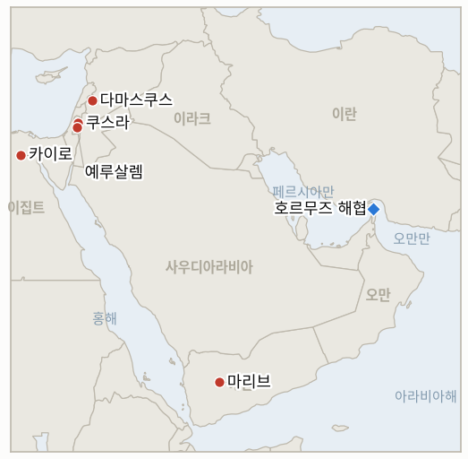
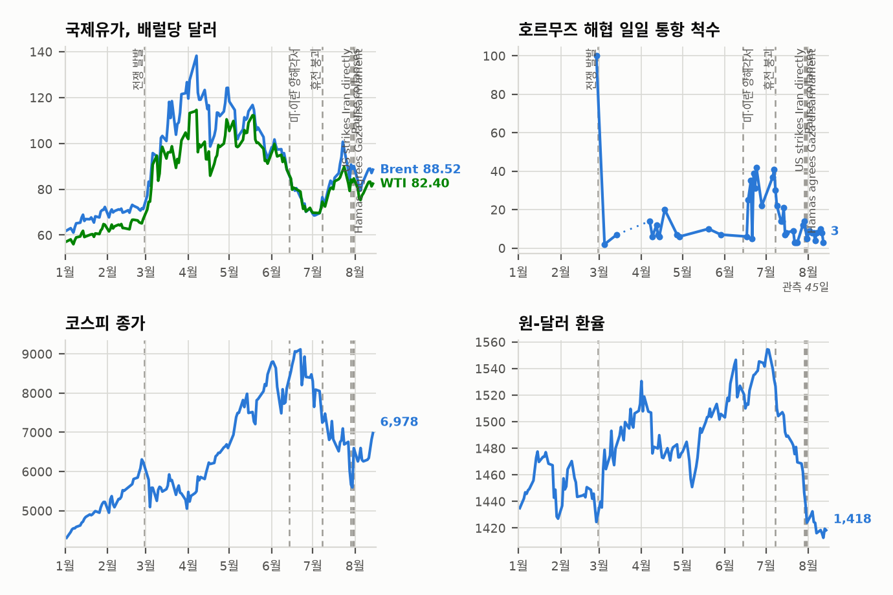

# 중동 일일 브리핑

**2026년 8월 15일**

- **보고 기간:** 약 24시간, 8월 14일 09:00 ~ 8월 15일 09:00 (한국시간)
- **종합 평가:** 금요일의 큰 흐름은 수사가 집행 가능한 조치를 앞질러 나간 하루였다. 트럼프 대통령은 이란을 "패배"시킨 뒤 "곧" 호르무즈 해협을 미국 영토로 선언하겠다고 말했고, 베센트 재무장관은 이란에 "세계가 본 적 없는" 수준의 경제적 고립을 예고했다. 이란 외무차관 카젬 가리브아바디는 "호르무즈 해협은 이란의 것이었고, 이란의 것이며, 앞으로도 이란의 것으로 남을 것"이라며 미국이 "패배라는 현실"을 받아들일 때까지 봉쇄를 계속하겠다고 응수했고, 헤그세스 국방장관이 봉쇄를 "무기한" 유지할 수 있다는 발언을 재확인하면서 브렌트유는 1.7% 오른 88.52달러, WTI는 1.4% 오른 82.40달러로 마감해 두 유종 모두 주간 기준 5% 이상 상승했다. 같은 패턴이 서안지구에서도 반복됐다. 이스라엘 카츠 국방장관은 군의 민간 치안 권한을 경찰로 이양하겠다고 발표했지만, 쿠스라 포위는 여섯째 날에 접어들었고 포위에 가담한 정착민들은 여전히 그 자리에 남아 있었다. 지표 대장에서도 8월 15일을 시한으로 하던 세 건의 지표, 사우디·이라크 민병대의 협조 공격 우려, 쿠웨이트의 확전, 하메네이의 이란-오만 호르무즈 프레임워크 승인이 모두 경고되거나 기대됐던 일이 끝내 일어나지 않은 채 만료됐으며, 워싱턴과 테헤란이 가장 날 선 주권 주장을 주고받은 바로 그날 함께 반증됐다. 여기에 단일 출처의 새로운 이란발 경고, 시리아가 레바논에서 헤즈볼라를 상대로 움직일 경우 대통령궁을 포함한 100곳 이상을 타격하겠다는 위협까지 더해졌고, 이라크 역시 같은 움직임에 대해 독자적으로 경고했다. 쿠슈너와 믈라데노프의 가자지구 압박 방문은 이집트까지 포함하는 것으로 확대됐고, 유엔의 그룬드베리 특사는 안보리에 예멘이 2022년 휴전 이후 최고 수준의 내전 재발 위험에 놓여 있다고 보고했으며, 4개 전선에서 전투가 이어졌다. 코스피는 5거래일 연속 상승을 이어가며 장중 한때 7,000선을 돌파한 뒤 2.42% 오른 사상 최고치 6,977.94에 마감했고, 원화는 1,418.3원으로 거의 변동이 없었다.

---

## 1. 무슨 일이 있었나

<figure style="float:right; width:46%; margin:2pt 0 8pt 14pt;">

<figcaption style="font-size:8pt; color:#666; text-align:center; margin-top:3pt; font-style:italic;">주요 논의 지점</figcaption>
</figure>

### 1.1 트럼프, 호르무즈 미국 영토 선언 예고, 이란은 미국의 패배 인정 때까지 봉쇄 지속 천명

트럼프 대통령은 롱아일랜드의 한 경찰 훈련시설 연설에서 "이란을 완전히 패배시키고 나면, 곧 호르무즈 해협을 미국 영토로 선언할 것"이라며 "우리에게는 봉쇄가 있다. 우리가 원하지 않는 한 어떤 배도 통과할 수 없다"고 말했고, 별도로 미국인들에게 "매우 사악한 나라"의 핵무기 획득을 막기 위한 비용으로 고유가를 받아들이라고 촉구했다([Fox11](https://fox11online.com/news/nation-world/trump-says-hell-declare-strait-of-hormuz-a-us-territory-when-iran-war-ends-tehran-war-conflict-waterway-gasoline-gas-oil-fuel-nuclear-weapon-department-of-war-secretary-pete-hegseth-president-donald-trump); [알자지라 라이브블로그](https://www.aljazeera.com/news/liveblog/2026/8/14/iran-war-live-us-eyes-indefinite-iran-naval-blockade)). 이란 외무차관 카젬 가리브아바디는 몇 시간 뒤 "호르무즈 해협은 이란의 것이었고, 이란의 것이며, 앞으로도 이란의 것으로 남을 것이다. 이 해협은 오직 이란의 명령에 따라 닫히고 열릴 것이며, 당신들이 패배라는 현실을 인정하고 허황된 망상을 버리지 않는 한 이란은 봉쇄를 계속할 것"이라고 응수했다. 스콧 베센트 재무장관은 뉴스맥스 인터뷰에서 워싱턴이 "세계가 본 적 없는 수준의 경제적 고립과, 이란 항구를 오가는 모든 것을 막는 지속적인 호르무즈 해협 봉쇄를 결합"할 것이라고 밝히며 세부 내용은 "다음 주" 발표하겠다고 예고했고, 헤그세스 국방장관도 해군이 무기한 봉쇄를 유지할 수 있다는 기존 입장을 재확인했다([CP24](https://www.cp24.com/news/world/2026/08/13/us-to-apply-measures-never-seen-on-iran-says-treasury-boss/); [CNBC](https://www.cnbc.com/2026/08/14/oil-prices-today-brent-wti-hormuz.html)). 이 발언들에 유가는 상승했다. 브렌트유는 1.7% 오른 88.52달러, WTI는 1.4% 오른 82.40달러로 마감했고, 두 유종 모두 주간 기준 5% 이상 상승했다. 이러한 확전 국면은 경고되거나 기대됐던 일이 끝내 일어나지 않은 채 만료된 세 건의 지표 대장 시한과 겹쳤다. 사우디아라비아를 겨냥한 후티·이라크 민병대의 협조 공격은 끝내 발생하지 않았고(IND-20260808-1, 반증), 부비얀 무인기 공격 이후 쿠웨이트나 GCC의 대응은 항의 수준을 넘지 않았으며(IND-20260802-2, 반증), 하메네이의 이란-오만 호르무즈 프레임워크 승인 여부에 대한 공개 확인은 끝내 나오지 않았다(IND-20260808-2, 반증). 이 세 건 모두 워싱턴과 테헤란이 가장 날 선 주권 주장을 주고받은 바로 그날 반증되며 마무리됐다. **신뢰도: 높음** — 트럼프·베센트·헤그세스의 발언과 정산가는 1~2등급 다출처 공식 발언으로 직접 확인됨; **신뢰도: 중간·높음** — 가리브아바디의 정확한 발언은 여러 매체의 실시간 보도에서 일관되게 인용됐으나 단일 원문 대조로 독립 검증되지는 않음.

### 1.2 카츠, 서안지구 치안 권한 군에서 경찰로 이양, 쿠스라 포위는 여섯째 날 진입

이스라엘 카츠 국방장관은 서안지구 내 이스라엘인에 대한 민간 치안 권한을 군에서 경찰로 이양하는 계획을 IDF에 지시했다고 발표하며, 이 같은 치안 업무는 "군의 역할이 아니며" IDF는 "그곳의 민간 문제 집행을 감당할 능력도 없다"고 말했고, 현재 방식을 "구릉지의 청년들을 쫓아다니는" 것에 불과하다고 폄하했다([타임스오브이스라엘](https://www.timesofisrael.com/liveblog_entry/amid-qusra-chaos-katz-asserts-he-will-transfer-civilian-enforcement-in-west-bank-from-idf-to-police/); [The Media Line](https://themedialine.org/headlines/katz-orders-shift-of-west-bank-enforcement-to-police-as-idf-investigates-qusra-violence/)). 이 발표는 쿠스라 팔레스타인 가옥 세 채에 대한 정착민 포위가 여섯째 날에 접어든 가운데 나왔으며, 주민들은 구호 활동가들의 식량 반입이 차단됐다고 전했고 포위에 가담한 정착민들은 여전히 가옥 인근에 자리를 지키고 있었다. 비판론자들은 경찰 역시 팔레스타인 지역에서 활동하려면 여전히 군의 호위가 필요하다는 점을 지적하며, 이번 조치가 집행 공백을 해소하기보다 명칭만 바꾸는 데 그칠 수 있다고 봤고, 일각에서는 이를 정착민 민간 행정을 서안지구에 정상화하는 단계로 해석했다. 한편 미국 관리들은 허커비 대사의 "이스라엘 테러리스트" 발언이 나온 지 엿새가 지났는데도 여전히 침묵을 지키는 네타냐후 총리에게 쿠스라 포위를 직접 규탄하라고 압박하고 있는 것으로 전해졌다([타임스오브이스라엘](https://www.timesofisrael.com/us-said-pushing-netanyahu-to-publicly-condemn-settler-violence-in-qusra-as-pm-keeps-mum/)). **신뢰도: 높음** — 카츠의 발표와 발언, 포위 지속(1~2등급, 다출처, 공식 발언); **신뢰도: 중간** — 식량 차단 주장과 이번 조치가 상징적이라는 구체적 비판, 둘 다 독립 검증이 상대적으로 약함.

### 1.3 이란, 레바논 헤즈볼라 관련 움직임 시 시리아에 대통령궁 포함 100곳 이상 타격 경고

이란 국영 타스님 통신은 레바논 매체 U News를 인용해, 테헤란이 앙카라·바그다드·도하·리야드에 미국의 압박에 따라 시리아가 레바논의 헤즈볼라를 상대로 군사적 움직임을 취할 경우 "시리아 영토에서 벌어지는 광범위한 지역적 충돌"을 촉발할 것이며, 이란의 미사일 대응이 "대통령궁을 포함한 시리아 내 100곳 이상의 전략 거점"을 겨냥할 것이라고 경고했다고 보도했고, 시리아-이라크 국경 불안정화, 홈스 전선 개방, 해안 지역 알라위파 세력 지원, 쿠르드 세력의 알레포 인근 재진입 부추김 등 추가 위협도 함께 전했다([The Yeshiva World](https://www.theyeshivaworld.com/news/israel-news/2585360/iran-threat-tehran-warns-syria-of-strikes-on-100-targets-including-presidential-palace.html); [South Front](https://maps.southfront.press/iran-threatens-to-wipe-out-syrias-power-centers-over-hezbollah)). 이와 별도로 이라크 정보국장 하미드 알샤트리는 다마스쿠스를 방문해 시리아 당국에 바그다드는 시리아의 레바논 영토 내 군사적 확장을 반대한다고 전달했으며, 다마스쿠스가 헤즈볼라를 상대로 움직일 경우 이라크 인민동원군(PMF) 소속 세력이 시리아 영토에 진입할 수 있다고 경고했다. 이 보도 시점까지 미국, 시리아, 로이터·AP·알자지라 등 어떤 곳도 이 경고를 독립적으로 확인하지 않았으며, 전적으로 타스님-U News 계열을 통해서만, 즉 이란 국영 매체가 비공개 외교 소통에 관한 주장을 전달하는 형태로만 보도됐다. **신뢰도: 낮음·중간** — 경고의 구체적 내용과 대통령궁 관련 세부 사항은 단일 이란 국영 매체 계열 보도에 근거하며 독립 확인이 없음; **신뢰도: 중간** — 이라크의 다마스쿠스에 대한 별도 경고는 이란발 주장과 함께 보도됐으나 통신사 차원의 독립 확인은 아직 없음.

### 1.4 쿠슈너·믈라데노프의 가자지구 압박 순방, 이집트까지 확대되며 이스라엘 반대 지속 부각

평화이사회 특사 재러드 쿠슈너와 니콜라이 믈라데노프는 목요일 처음 보도된 이스라엘 단독 방문이 아니라 다음 주 이스라엘과 이집트를 함께 방문할 것으로 전해졌으며, 네타냐후 총리에게 하마스 무장해제 합의 진전을 압박할 예정이다. 하아레츠의 실시간 보도는 이번 순방을 "이스라엘의 반대에 부딪힌" 트럼프 행정부의 가자지구 제안에 대한 대응으로 명확히 규정했는데, 이는 전날 사용됐던 무장해제 순서를 둘러싼 이견이라는 표현보다 한층 날 선 규정이다([하아레츠](https://www.haaretz.com/israel-news/israel-security/2026-08-14/ty-article-live/sources-kushner-to-visit-israel-and-egypt-next-week-to-push-trumps-gaza-plan/0000019f-fdf5-d337-a7df-fffd11570000)). 순방의 정확한 일정과 의제는 아직 확정되지 않았으며, 평화이사회 프레임워크의 어떤 버전에 대해서도 이스라엘 안보내각의 공식 표결은 아직 이뤄지지 않았다. 한편 중부사령부 사령관은 최근 이스라엘군 고위 장교들과의 접촉에서 가자지구, 레바논, 이란 대치 국면 전반에 걸쳐 활성 전선을 축소하겠다는 워싱턴의 의도를 전달한 것으로 보도됐는데, 이는 이번 순방이 속한 압박 캠페인의 일부다. **신뢰도: 중간** — 순방의 이집트 확대와 그 규정은 하아레츠의 익명 소식통 기반 실시간 보도에 근거하며 아직 제2의 매체로 독립 확인되지 않음; **신뢰도: 낮음·중간** — 중부사령부 사령관이 이스라엘 장교들에게 전달했다는 비공개 메시지는 출처가 얕음.

### 1.5 유엔 그룬드베리 특사, 안보리에 예멘이 2022년 휴전 이후 최고 수준의 전쟁 위험에 놓였다고 보고

유엔 특사 한스 그룬드베리는 안보리에 예멘이 2022년 4월 휴전 이후 전면전 재발 위험이 가장 높은 상태에 있다고 공식 보고하며, 오랫동안 고착됐던 전선에서의 군사 활동 격화가 예멘을 더 넓은 미국-이란 지역 대치 국면으로 끌어들일 수 있다고 경고했고, 양측 모두 "대치보다 협력에서 얻을 것이 더 많다"며 석유 수출, 상업 해운, 사나 공항 운항 재개를 포함한 "경제적 긴장 완화"를 촉구했다([알자지라](https://www.aljazeera.com/news/2026/8/14/yemen-faces-highest-risk-of-returning-to-war-since-2022-truce-un-warns)). 이번 보고 기간에 후티군과 정부군은 마리브, 하드라마우트, 타이즈, 그리고 타이즈주 소속 항구도시 알마카(모카)에서 다시 충돌했으며, 정부군은 여러 주에서 후티 진지에 포병 및 무인기 공격을 가했다고 밝혔고, 예멘 대통령지도위원회는 "후티가 취하는 모든 행동에는 상응하는 대응이 있을 것"이라고 다짐했다. 유엔은 별도로 예멘 인구의 절반 이상이 안정적인 식량 접근권을 갖지 못하고 있으며, 600만 명이 기근에 가까운 비상 수준의 결핍 상태에 있고, 예방 가능한 임신 합병증으로 매일 여성 3명이 사망하고 있다고 재차 밝혔다. **신뢰도: 높음** — 그룬드베리의 유엔 안보리 보고와 그 내용(1등급, 유엔 성명, 다출처); **신뢰도: 중간** — 구체적인 정부군 공격 지점과 대통령지도위원회 성명, 독립 검증이 상대적으로 약함.

---

## 2. 심층 분석: 유인과 동기

### 2.1 세 건의 걸프 확전 경고가 조용히 미해결로 만료된 바로 그 순간, 트럼프는 왜 호르무즈 영토 주장으로 수위를 높였을까?

수사적 최대주의 주장은 입법 조치도, 군사 명령도, 협상된 문서도 필요로 하지 않기 때문에 워싱턴에는 아무런 비용이 들지 않으면서도 국내적으로는 훌륭한 사진 소재가 되는 반면, 그 이면의 현실, 즉 어느 쪽도 쉽게 끝낼 수 없는 경제적으로 고통스러운 봉쇄는 그대로 남기 때문이다. 지표 대장에서 가장 중대한 단기 시험대(사우디에 대한 우려됐던 공격, 쿠웨이트의 확전, 이란-오만 프레임워크에 대한 하메네이의 승인) 세 가지가 모두 미해결 상태로 조용히 만료된 시점에 말로써 판돈을 키우는 것은, 의회의 계속된 자금 지원 침묵과 새로운 이란-오만 돌파구의 부재 속에서 자체 동력을 잃은 외교 트랙의 공백을, 테헤란도 오만도 그 누구의 협력도 필요로 하지 않으면서 헤드라인을 지배하는 주장으로 메우려는 시도임을 시사한다.

### 2.2 이스라엘은 왜 쿠스라 정착민을 단순히 철수시키는 대신 서안지구 치안 권한을 재편했을까?

민간 치안 권한을 IDF에서 경찰로 이양하는 구조적·관료적 조치는, 집권 연정 내에서 여전히 지지를 받는 정착민들을 물리적으로 제거하라는 정치적으로 비용이 큰 명령 대신, 6일간의 국제적 압박과 미국 대사의 "테러리스트" 규탄에 체계적 개혁으로 대응한 것처럼 보이게 하기 때문이다. 또한 경찰 역시 팔레스타인 지역에서 활동하려면 여전히 군의 호위가 필요하므로, 이번 변화는 실제 운용 현실과 포위된 가옥 인근에 남아 있는 정착민들의 실제 위치를 단기적으로 바꾸지 않으면서도 책임을 지는 듯한 모습을 만들어낼 수 있다.

### 2.3 이란은 왜 시리아에 대한 경고를 직접적이고 공개적으로가 아니라 튀르키예 경로와 국영 매체를 통해 전달했을까?

대통령궁을 포함한 100곳 이상을 겨냥한다는 이 정도 수위의 위협을 앙카라를 거쳐 다른 네 개 지역 수도로 우회시키는 것은, 테헤란이 공식적이고 귀책 가능한 이란 정부 성명 없이도 결의를 신호할 수 있게 해주며, 이는 동등하게 공식적인 국제적 감시나 공조된 대응을 초래하지 않기 때문이다. 동시에 이 경고가 허세로 드러날 경우를 대비한 부인 가능성을 유지하면서도, 알샤라 대통령의 시리아 정부에 다마스쿠스의 셈법을 좌우할 만큼 신뢰할 수 있는 경로를 통해 전달되도록 보장한다. 특히 이라크가 공식 외교 서한이 아니라 자국 정보국장을 통해 자체적인 병행 경고를 전달한 것과 짝을 이루는데, 양측 모두 중개되고 반공식적인 경로를 이용해 어느 나라도 공개적인 레드라인에 공식적으로 매이지 않으면서 시리아의 움직임에 따르는 비용만 높이려는 것이다.

### 2.4 쿠슈너·믈라데노프 순방에 이집트를 추가하고 기술적 순서 문제가 아니라 이스라엘의 반대를 전면에 내세운 이유는?

더 좁은 무장해제 순서 이견이라 부르는 대신 "이스라엘의 반대"라고 직접 명명하는 것은, 워싱턴이 이번 걸림돌을 협상으로 풀 수 있는 기술적 이견이 아니라 이스라엘 정부 자체의 입장으로 본다는 점을 분명히 함으로써 순방을 앞둔 네타냐후에 대한 정치적 압박 수위를 높이기 때문이다. 동시에 하마스에 자체 채널을 갖고 가자지구 재건 및 국경 협상에 이해관계가 있는 보증국인 이집트를 추가함으로써, 특사들에게 지역적 압박을 구축할 두 번째 수도와 이스라엘 구간에서 성과가 없을 경우의 대안적 무대를 제공한다. 이는 고위급 미국 압박 순방이 네타냐후의 공개 입장을 움직이지 못한 패턴을 이 지표 대장이 이미 두 차례 기록한 것에 대한 헤지다.

### 2.5 그룬드베리는 왜 언론을 통한 기존 경고 반복이 아니라 안보리 발언 수위 자체를 높였을까?

공식 안보리 보고는 언론 성명이 갖지 못하는 제도적 무게를 지니며, 이를 통해 (비록 대체로 상징적이지만) 행동할 수 있는 가장 명확한 권한을 가진 기구 앞에 예멘의 궤적을 공식 기록으로 남길 수 있다. 4개 전선에서 전투가 확산되고 더 넓은 미국-이란 호르무즈 대치 국면이 병행 확전되는 지금 이를 실행함으로써, 석유 수출·해운·사나 공항 운항 재개라는 그룬드베리의 경제적 긴장 완화 호소를, 여러 지역적 트랙(예멘의 내전, 호르무즈 대치, 그리고 이제 레바논 관련 시리아에 대한 이란의 경고)이 서로 단순히 공존하는 수준을 넘어 서로를 강화하기 시작하기 전 마지막으로 외교적으로 틀 지어진 출구로 자리매김시킨다.

---

## 3. 한국에 대한 정책적 함의

### 3.1 익스포저 현황

| 항목 | 현재 수치 | 출처 |
| --- | --- | --- |
| 원유 수입 중 중동 비중 | 48.5%(2026년 5~7월), 전년 동기 69.1%에서 하락; 비중동 비중이 사상 처음 50%를 넘어섬 | KNOC, 아시아경제 인용; `korea-exposure.md` |
| 7~8월 원유 조달 | 전년 동기 대비 110% 이상 확보(산업통상자원부, 7월 21일); 전략비축유 스와프는 8월까지 연장, 현재까지 약 2,100만 배럴 스와프 | 산업통상자원부, 헤럴드경제·한경 인용; `korea-exposure.md` |
| 9월 원유 조달 | 90% 이상 확보(산업통상자원부, 7월 21일) | 산업통상자원부, 헤럴드경제 인용; `korea-exposure.md` |
| 홍해 우회 항로 | 한국행 원유 화물은 얀부·홍해 우회 경로를 계속 이용 중; 얀부에서 한국을 포함한 아시아 매수자로의 수출량이 전년 100만 bpd 미만에서 약 400만 bpd로 급증 | 로이즈리스트 인텔리전스; `korea-exposure.md` |
| 전략비축유 커버리지 | 실제 소비 기준 약 26일분(추정); 스와프는 즉시 대기 상태이나 대규모 실제 시험은 미실시 | CSIS; 산업통상자원부 7월 27일 |
| 정유사 사우디 지분 익스포저 | S-Oil(사우디 아람코 지분 약 63%), HD현대오일뱅크(아람코 지분 약 17%) | 공시자료; `korea-exposure.md` |
| 브렌트/WTI | 정산가 88.52달러(+1.7%) / 82.40달러(+1.4%), 3거래일 만의 반등이자 베센트·헤그세스의 봉쇄 발언에 힘입어 두 유종 모두 주간 5% 이상 상승 | CNBC |
| 코스피/원달러 | 종가 6,977.94(+2.42%, 사상 최고, 5거래일 연속 상승, 장중 한때 7,000선 돌파), 지역 분쟁과 무관한 외국인 반도체 매수세; 원화는 1,418.3원으로 거의 보합 | 코리아타임스, 아시아경제 |
| 호르무즈 통항량 | 보고 기간 중 신규 Kpler/Windward 수치 없음; 마지막 확인된 수치는 8월 12일까지 24시간 기준 3척(윈드워드), 전량 남부 항로 이용 | 윈드워드 데일리 인텔리전스 |

### 3.2 사안별 함의

**트럼프의 호르무즈 영토 주장과 베센트가 예고한 전례 없는 경제적 고립 패키지는 한국 정유사의 물리적 조달 체계에 당장의 변화를 가져오지는 않지만, 그 수사가 시장에 미친 영향은 직접적이다. 브렌트·WTI가 주간 기준 5% 이상 반등한 것은 새로운 집행 조치가 없어도 한국의 수입 비용이 선언적 확전에 민감하게 반응함을 보여주며, 걸프 확전 경고 세 건(쿠웨이트, 사우디-이라크, 하메네이의 승인)이 별다른 사건 없이 같은 날 만료된 것은 이 분쟁의 수사적 강도와 실제 작전 템포가 서로 독립적으로 움직일 수 있음을 다시 한번 보여준다.** 신규 IND-20260815-1(시한 8월 22일)은 베센트가 예고한 패키지가 구체적이고 식별 가능한 새 조치로 이어질지, 아니면 기존 봉쇄·제재 체제의 수사적 확대에 그칠지를 검증한다.

**카츠의 서안지구 IDF-경찰 치안 권한 이양은 한국 시장에 직접적인 익스포저는 없지만, 지속되는 정착민 폭력과 그것이 드러내는 집행 공백은 한국 리스크 담당자들이 호르무즈·가자지구 트랙과 함께 추적하는 더 넓은 불안정성 서사를 계속 뒷받침한다.** 신규 IND-20260815-2(시한 9월 12일)는 이번 정책 변화가 정착민 폭력의 측정 가능한 감소로 이어지는지를 검증하며, IND-20260813-3(시한 8월 27일)은 쿠스라 포위 자체를 계속 추적하는데, 정착민들이 여섯째 날에도 그대로 남아 있어 반증 쪽으로 기울고 있다.

**레바논 관련 이란의 시리아 경고가 사실이라면, 한국 선박들이 이미 우회 운항 중인 동일한 동지중해 해상 항로 바로 인근에 (가자지구, 예멘, 호르무즈 대치에 이은) 네 번째 활성 군사 전선이 열리는 셈이다. 다만 이 경고 자체가 단일 이란 국영 매체 출처라는 점은, 독립적으로 확인되기 전까지 이를 계획 기준선이 아니라 모니터링해야 할 리스크 신호로 다뤄야 함을 시사한다.** 신규 IND-20260815-3(시한 9월 15일)은 경고 자체의 신뢰도와는 별개로, 시리아가 실제로 헤즈볼라를 상대로 움직이는지 또는 이란이 실제로 시리아 목표물을 타격하는지를 검증한다.

**쿠슈너·믈라데노프 순방의 이집트 확대와 그룬드베리의 공식 안보리 예멘 경고는 모두, 호르무즈 통항 제약에 대한 주된 대안인 한국의 얀부·홍해 우회 항로가, 가자지구·예멘·더 넓은 지역 트랙이 순차적으로 해소되기보다 동시에 살아 있는 무대를 계속 통과하고 있음을 재확인한다.** IND-20260812-4(시한 8월 26일)는 가자지구 무장해제 우선 프레임워크가 이스라엘 안보내각의 공식 표결에 도달하는지를 계속 추적하며, IND-20260814-3(시한 9월 4일)은 예멘의 전투가 현재의 3개 주를 넘어 확산되는지를 계속 추적하는데, 모카가 새로운 영역이 아니라 타이즈주 소속이므로 오늘은 변동이 없다.

**검증 가능한 지표:**

- **IND-20260815-1** — 베센트가 예고한 "전례 없는" 이란 경제적 고립 패키지가 구체적인 새 조치와 함께 공개되는지, 아니면 발표가 지연되거나 기존 제재·봉쇄 체제에 못 미치는 수준에 그치는지를 검증한다. 이 예고된 전례 없는 경제적 고립으로 명시적으로 규정된 구체적인 신규 재무부 또는 백악관 제재 패키지나 조치가 약 2026-08-22까지 발표되면 이 약속이 실제 식별 가능한 정책 조치로 전환됐음이 확증되며, 같은 시점까지 그런 별도의 신규 패키지가 없으면 기존 체제의 수사적 확대에 그쳤음이 반증된다.
- **IND-20260815-2** — 서안지구 민간 치안 권한을 IDF에서 경찰로 이양한 조치가 정착민 폭력의 검증된 감소로 이어지는지, 아니면 사건 발생률이 변함없이 유지되는지를 검증한다. 카츠의 발표 이후 4주 이내에 정착민 폭력 사건의 검증되고 보고된 감소가 약 2026-09-12까지 확인되면 이양 조치가 측정 가능한 효과를 냈음이 확증되며, 같은 시점까지 사건 보고가 지속되거나 증가하거나 이양 조치 자체가 시행되기 전에 정체되면 반증된다.
- **IND-20260815-3** — 시리아가 이란의 경고에도 불구하고 레바논에서 헤즈볼라를 상대로 군사적 움직임을 취해 예고된 이란의 타격을 초래하는지, 아니면 다마스쿠스가 자제하는지를 검증한다. 시리아의 레바논 내 헤즈볼라 관련 검증된 군사적 움직임, 또는 이 경고와 명시적으로 연결된 이란의 시리아 목표물에 대한 검증된 타격이 약 2026-09-15까지 확인되면 이란이 경고한 대치가 현실화되고 있음이 확증되며, 같은 시점까지 시리아의 움직임도 이란의 타격도 없으면 반증된다.

---

## 4. 관찰 목록

- **베센트가 예고한 전례 없는 이란 경제적 고립 패키지가 구체적인 새 조치와 함께 실현되는지** (IND-20260815-1, 시한 8월 22일).
- **서안지구 IDF-경찰 치안 권한 이양이 정착민 폭력을 줄이는지, 아니면 변함없이 유지되는지** (IND-20260815-2, 시한 9월 12일).
- **시리아가 이란의 경고에도 불구하고 레바논에서 헤즈볼라를 상대로 움직이는지, 아니면 대치가 수사에 그치는지** (IND-20260815-3, 시한 9월 15일).
- **8월 17일경 만료되는 6월 17일 MOU의 호르무즈 통행료 면제 기간이 실제 이란의 통행료 부과로 이어지는지, 아니면 조용히 연장되는지** (IND-20260814-1, 시한 8월 24일).
- **이집트까지 확대된 쿠슈너·믈라데노프 순방이 네타냐후의 하마스 무장해제 입장을 변화시키는지** (IND-20260814-2, 시한 8월 21일).
- **예멘의 후티-정부군 전투가 마리브·하드라마우트·타이즈를 넘어 네 번째 주로 확산되는지** (IND-20260814-3, 시한 9월 4일).
- **쿠스라 포위가 실제로 해소되는지, 여섯째 날에도 정착민이 남아 있어 반증 쪽으로 기우는 중** (IND-20260813-3, 시한 8월 27일).
- **후티의 구조대 상대 이중 타격 전술이 재발하는지, 아니면 일회성 확전으로 남는지** (IND-20260813-2, 시한 9월 2일).
- **IEA의 재고 고갈 경고가 추가적인 공조 정책 대응이나 지속적인 가격 변동으로 이어지는지** (IND-20260813-1, 시한 9월 2일).
- **이란 최고국가안보회의(SNSC)의 요구가 워싱턴을 군사행동 재개로 몰아가는지, 아니면 더 좁은 합의가 도출되는지** (IND-20260809-1, 시한 8월 16일).
- **예멘 정부군 주도의 공세 작전이 계속되는지, 아니면 영토 변화가 확인되는지** (IND-20260809-3, 확증 쪽으로 기우는 중, 시한 8월 16일).
- **더 좁혀지거나 수정된 이란-오만 호르무즈 메커니즘이 공개 발표되고 수용되는지** (IND-20260810-1, 시한 8월 20일).
- **이란의 강경파 안보 개편이 호르무즈 외교를 계속 정체시키는지, 아니면 이란-오만 트랙이 여전히 성사되는지** (IND-20260811-1, 시한 8월 18일).
- **사우디아라비아가 자잔 정유시설 공격이나 추가 후티 공격에 직접 보복으로 대응하는지** (IND-20260810-3, 시한 8월 17일).
- **레바논 남부의 활성 교전 국면이 로마 외교 트랙을 탈선시키는지, 아니면 병행하여 계속되는지** (IND-20260807-2, 시한 9월 1일).
- **미 해군의 무력을 동반한 봉쇄 집행이 이란의 군사적 대응을 촉발하는지** (IND-20260812-1, 시한 8월 26일).
- **시리아의 핵물질 파일이 IAEA와의 최종 합의 및 검증된 반출로 이어지는지** (IND-20260812-2, 시한 9월 11일).
- **가자지구 무장해제 우선 프레임워크가 어떤 형태로든 이스라엘 안보내각의 공식 표결에 도달하는지** (IND-20260812-4, 시한 8월 26일).
- **마즈달 준 폭발이 헤즈볼라의 조작으로 확인되는지, 아니면 오래된 불활성 장치로 결론 나는지** (IND-20260811-2, 시한 8월 25일).
- **타이베를 비거주자에게 봉쇄한 조치가 정착민 공격을 줄이는지, 아니면 폭력이 계속되는지** (IND-20260811-3, 시한 8월 18일).
- **구조 작업이 시작된 지금, 캐롤라인 베젠기호 기름 유출이 유출 시작 두 달여 만에 통제되는지.**
- **케슘섬 폭발이 실제 공격으로 확인되는지, 아니면 오경보로 결론 나는지.**

---

## 5. 출처 신뢰도 요약

| 주장 | 출처 | 신뢰도 |
| --- | --- | --- |
| 트럼프, 이란 패배 후 "곧" 호르무즈 해협을 미국 영토로 선언하겠다고 발언 | Fox11, 알자지라 라이브블로그(1~2등급, 공식 발언, 다출처) | 높음 |
| 이란 가리브아바디, "호르무즈 해협은 이란의 것이었고, 이란의 것이며, 앞으로도 이란의 것"이라며 미국의 "패배라는 현실" 인정까지 봉쇄 지속 언급 | 여러 매체 실시간 보도, 독립 보도들에서 발언 내용 일치(1~2등급, 단일 원문 대조 미실시) | 중간·높음 |
| 베센트, 이란에 "세계가 본 적 없는" 경제적 고립 예고; 헤그세스, 무기한 봉쇄 재확인 | CP24, CNBC(1~2등급, 공식 인터뷰 및 발언) | 높음 |
| 브렌트 88.52달러(+1.7%), WTI 82.40달러(+1.4%) 정산, 두 유종 모두 주간 5% 이상 상승 | CNBC(1~2등급, 시장 통신) | 높음 |
| 지표 3건(쿠웨이트/GCC 확전, 사우디-이라크 협조 공격, 하메네이의 오만 프레임워크 승인)이 약 8월 15일 시한에 미해결 상태로 만료 | 각 지표의 원 출처 기록 기준; 보고 기간 중 상반된 보도 없음 | 높음 |
| 카츠, 서안지구 민간 치안 권한 IDF에서 경찰로 이양 지시; 쿠스라 포위 여섯째 날 진입 | 타임스오브이스라엘, The Media Line(1~2등급, 공식 발언, 다출처) | 높음 |
| 미국 관리들, 침묵하는 네타냐후에 쿠스라 포위 규탄 계속 압박 | 타임스오브이스라엘(1~2등급, 익명 미국 관리 인용) | 중간 |
| 이란, 레바논 헤즈볼라 관련 시리아의 움직임 시 대통령궁 포함 100곳 이상 타격 경고; 이라크 정보국장 별도로 다마스쿠스 경고 | The Yeshiva World, South Front, 타스님/U News 인용(3등급, 단일 이란 국영 매체 계열, 독립 확인 없음) | 낮음·중간 |
| 쿠슈너·믈라데노프의 가자지구 압박 순방, 이집트까지 확대, 이스라엘의 반대 대응으로 규정 | 하아레츠 실시간 보도(1~2등급, 익명 소식통, 제2 매체의 독립 확인 아직 없음) | 중간 |
| 유엔 그룬드베리, 안보리에 예멘이 2022년 휴전 이후 최고 수준의 내전 재발 위험에 놓였다고 보고; 마리브·하드라마우트·타이즈·모카 전투 지속 | 알자지라(1등급, 유엔 성명, 다출처) | 높음 |
| 오만 앞바다 캐롤라인 베젠기호 구조 작업 개시; 유출 규모 출처에 따라 1,300~2,000㎢ 이상으로 추정 | 알자지라, 그린피스(알자지라 인용)(1~2등급, 다출처, 위성사진 및 공식 회사 발표) | 중간·높음 |
| 코스피 +2.42% 사상 최고 6,977.94 마감, 장중 한때 7,000선 돌파, 5거래일 연속 상승; 원화 1,418.3원으로 거의 보합 | 코리아타임스, 아시아경제(1~2등급, 한국 경제 언론) | 높음 |
