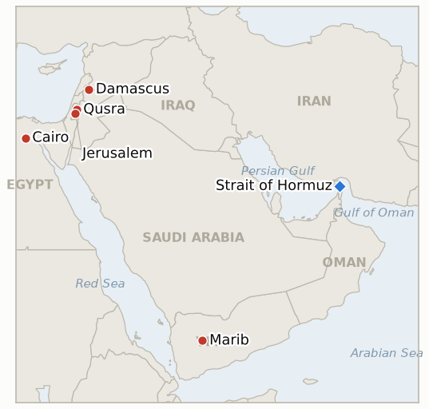

# Middle East Daily Briefing

**August 15, 2026**

- **Reporting window:** ~24 hours, August 14, 09:00 to August 15, 09:00 KST
- **Overall assessment:** Friday's throughline was rhetoric racing ahead of anything enforceable. President Trump said he would "pretty soon" declare the Strait of Hormuz US territory once Iran is "defeated," and Treasury Secretary Bessent promised economic isolation of Iran "like the world has never seen before"; Iran's Deputy Foreign Minister Kazem Gharibabadi answered that the strait "has been Iranian, is Iranian, and will remain Iranian" and would stay blockaded until the US accepts "the reality of defeat," while Defense Secretary Hegseth's own line that the blockade can hold "indefinitely" helped push Brent up 1.7% to $88.52 and WTI up 1.4% to $82.40, both benchmarks now more than 5% higher for the week. The pattern repeated in the West Bank, where Defense Minister Israel Katz announced he would strip the IDF of civilian enforcement powers and hand them to police even as the Qusra siege reached its sixth day with the besieging settlers still in place; in the ledger, where three separate ~August 15 deadlines (a feared Saudi-Iraqi militia attack, a Kuwaiti escalation, and Khamenei's approval of the Iran-Oman Hormuz framework) all lapsed with the warned or hoped-for action never materializing; and in a new, single-sourced Iranian warning to Damascus threatening a hundred-plus target strike if Syria moves against Hezbollah in Lebanon, a threat matched by Iraq's own warning against the same move. Kushner and Mladenov's Gaza push visit grew to include Egypt, and the UN's Grundberg told the Security Council Yemen faces its highest civil-war risk since the 2022 truce, as fighting continued across four fronts. KOSPI extended its rally to a fifth straight session, briefly topping 7,000 intraday before closing up 2.42% at a record 6,977.94, while the won held essentially flat at 1,418.3.

---

## 1. What Happened

<figure style="float:right; width:46%; margin:2pt 0 8pt 14pt;">

<figcaption style="font-size:8pt; color:#666; text-align:center; margin-top:3pt; font-style:italic;">Major places of discussion</figcaption>
</figure>

### 1.1 Trump Vows to Declare Hormuz US Territory as Iran Says It Will Blockade Until Washington Accepts Defeat

Speaking at a police training center on Long Island, President Trump said that "after we finish defeating Iran, which is being very badly defeated, pretty soon I'll be declaring the Hormuz Strait a territory of the United States," adding "we have the blockade. No ships get through unless we want them to," and separately urged Americans to accept higher gas prices as the cost of stopping "a very evil country" from getting a nuclear weapon ([Fox11](https://fox11online.com/news/nation-world/trump-says-hell-declare-strait-of-hormuz-a-us-territory-when-iran-war-ends-tehran-war-conflict-waterway-gasoline-gas-oil-fuel-nuclear-weapon-department-of-war-secretary-pete-hegseth-president-donald-trump); [Al Jazeera liveblog](https://www.aljazeera.com/news/liveblog/2026/8/14/iran-war-live-us-eyes-indefinite-iran-naval-blockade)). Iran's Deputy Foreign Minister Kazem Gharibabadi answered within hours that "the Strait of Hormuz has been Iranian, is Iranian, and will remain Iranian; this strait will only be closed and opened under Iran's command, and as long as you do not accept the reality of defeat and cease your fanciful delusions, Iran will continue to enforce the blockade." Treasury Secretary Scott Bessent, in a Newsmax interview, said Washington would apply "a combination of economic isolation like the world has never seen before, and the continued blockade in the Strait of Hormuz that will keep anything from going in or out of the Iranian ports," with specifics promised "next week," while Defense Secretary Hegseth separately reaffirmed the Navy can maintain the blockade indefinitely ([CP24](https://www.cp24.com/news/world/2026/08/13/us-to-apply-measures-never-seen-on-iran-says-treasury-boss/); [CNBC](https://www.cnbc.com/2026/08/14/oil-prices-today-brent-wti-hormuz.html)). Oil rose on the rhetoric: Brent settled up 1.7% to $88.52 and WTI up 1.4% to $82.40, both benchmarks more than 5% higher for the week. The escalation coincided with three separate ledger deadlines lapsing without the warned or hoped-for action: no coordinated Houthi-Iraqi militia attack ever hit Saudi Arabia (IND-20260808-1, falsified), no Kuwaiti or GCC action went beyond protest after the Bubiyan drone strikes (IND-20260802-2, falsified), and no public confirmation of Khamenei's approval, rejection or review of the Iran-Oman Hormuz framework was ever issued (IND-20260808-2, falsified) — all three resolving on the same day Washington and Tehran traded their sharpest sovereignty claims yet. **Confidence: High** on Trump's, Bessent's and Hegseth's statements and the settle prices (Tier 1-2, multi-outlet, on-record, verified via direct fetch); **Medium-High** on the exact Gharibabadi quote, consistently reported across multiple outlets' live coverage but not independently verified against a single primary transcript.

### 1.2 Katz Shifts West Bank Enforcement From the IDF to Police as the Qusra Siege Reaches a Sixth Day

Defense Minister Israel Katz announced he has instructed the IDF to draw up a plan transferring civilian enforcement powers over Israelis in the West Bank from the military to Israel Police, saying such enforcement "is not the role" of the IDF "nor is it capable of handling the enforcement of civil issues" there, and dismissing the current approach as sending soldiers to "chase youth in the hilltops" ([Times of Israel](https://www.timesofisrael.com/liveblog_entry/amid-qusra-chaos-katz-asserts-he-will-transfer-civilian-enforcement-in-west-bank-from-idf-to-police/); [The Media Line](https://themedialine.org/headlines/katz-orders-shift-of-west-bank-enforcement-to-police-as-idf-investigates-qusra-violence/)). The announcement came as the settler siege of three Palestinian homes in Qusra entered its sixth day, with residents saying activists were blocked from delivering food and the besieging settlers still positioned near the homes; critics noted police will still require army escorts to operate in Palestinian areas, so the change may relabel rather than end the enforcement gap, and some analysts read it as a step toward normalizing settler civil administration of the West Bank. Separately, US officials were reported still pressing a publicly silent Netanyahu to personally condemn the Qusra siege, six days after Ambassador Huckabee's own "Israeli terrorists" remark ([Times of Israel](https://www.timesofisrael.com/us-said-pushing-netanyahu-to-publicly-condemn-settler-violence-in-qusra-as-pm-keeps-mum/)). **Confidence: High** on Katz's announcement and quotes, and the siege's continuation (Tier 1-2, multi-outlet, on-record); **Medium** on the food-blockage claim and the specific criticism that the change is symbolic, both less independently verified.

### 1.3 Iran Warns Syria Against Any Move on Hezbollah in Lebanon, Threatening a Hundred Plus Targets Including the Presidential Palace

Iran's Tasnim news agency, citing Lebanese outlet U News, reported that Tehran warned Ankara, Baghdad, Doha and Riyadh that any Syrian military move against Hezbollah in Lebanon, undertaken under US pressure, would trigger "a broad regional confrontation fought on Syrian territory," with an Iranian missile response targeting "more than 100 strategic sites in Syria, including the presidential palace," and additional threats to destabilize the Syria-Iraq border, open a front in Homs, back Alawite movements on the coast, and encourage Kurdish forces back toward Aleppo ([The Yeshiva World](https://www.theyeshivaworld.com/news/israel-news/2585360/iran-threat-tehran-warns-syria-of-strikes-on-100-targets-including-presidential-palace.html); [South Front](https://maps.southfront.press/iran-threatens-to-wipe-out-syrias-power-centers-over-hezbollah)). Separately, Iraq's intelligence chief Hamid al-Shatri traveled to Damascus and told Syrian officials Baghdad rejects any Syrian military expansion into Lebanese territory, warning that Iraqi Popular Mobilization Forces factions could enter Syria if Damascus moved against Hezbollah. No US, Syrian or Reuters/AP/Al Jazeera reporting independently corroborated the warning at the time of writing; it is sourced entirely through the Tasnim-U News chain, Iranian state media relaying a claim about a private diplomatic communication. **Confidence: Low-Medium** on the warning's specific content and the presidential-palace detail (single Iranian state-media source via a secondary outlet, no independent corroboration found); **Medium** on Iraq's parallel warning to Damascus, reported alongside the Iranian claim but not yet independently confirmed by a wire service either.

### 1.4 Kushner and Mladenov's Gaza Push Grows to Include Egypt as Israeli Opposition to the Plan Persists

Board of Peace envoys Jared Kushner and Nickolay Mladenov are now reported to be traveling to both Israel and Egypt next week, rather than Israel alone as first reported Thursday, to press Prime Minister Netanyahu on advancing Hamas's disarmament agreement; Haaretz's live coverage framed the trip explicitly as a response to a Trump administration Gaza proposal that "ran into Israeli opposition," a sharper characterization of the obstacle than the disarmament-sequencing dispute language used a day earlier ([Haaretz](https://www.haaretz.com/israel-news/israel-security/2026-08-14/ty-article-live/sources-kushner-to-visit-israel-and-egypt-next-week-to-push-trumps-gaza-plan/0000019f-fdf5-d337-a7df-fffd11570000)). The visit's exact dates and agenda remain unconfirmed, and no formal Israeli Security Cabinet vote on any version of the Board of Peace framework has yet occurred. Separately, CENTCOM's commander was reported to have used recent meetings with senior Israeli officers to relay Washington's intent to wind down active fronts across Gaza, Lebanon and the Iran standoff together, part of the same pressure campaign this visit belongs to. **Confidence: Medium** on the visit's expansion to include Egypt and its framing (sourced to Haaretz's live coverage citing unnamed sources, not yet independently corroborated by a second outlet); **Low-Medium** on the CENTCOM commander's private messaging to Israeli officers, thinly sourced.

### 1.5 The UN's Grundberg Tells the Security Council Yemen Faces Its Highest War Risk Since the 2022 Truce

UN Special Envoy Hans Grundberg formally briefed the Security Council that Yemen faces its highest risk of renewed all-out war since the April 2022 truce, warning that intensified military activity across the country's long-frozen front lines could draw Yemen into the wider US-Iran regional confrontation, and urging both sides toward "economic de-escalation," including resuming oil exports, commercial shipping and flights to Sanaa airport, since both parties "have more to gain from cooperation than confrontation" ([Al Jazeera](https://www.aljazeera.com/news/2026/8/14/yemen-faces-highest-risk-of-returning-to-war-since-2022-truce-un-warns)). In the window, Houthi and government forces clashed again across Marib, Hadramaut, Taiz and the Taiz-governorate port of al-Makha (Mokha), with government forces reporting artillery and drone strikes on Houthi positions in multiple governorates and Yemen's Presidential Leadership Council vowing that "every action undertaken by the Houthis will be met with" a matching response. The UN separately reiterated that more than half of Yemen's population lacks reliable food access, with 6 million people at emergency levels bordering on famine and three women dying daily from preventable pregnancy complications. **Confidence: High** on Grundberg's UN Security Council briefing and its content (Tier 1, UN statement, multi-outlet); **Medium** on the specific government-strike locations and the Presidential Leadership Council's statement, less independently verified.

---

## 2. Deep Dive: Incentives and Motives

### 2.1 Why would Trump escalate to a territorial claim on Hormuz just as three separate Gulf-escalation warnings quietly expire unfulfilled?

Because a rhetorical maximalist claim, one that requires no legislative act, military order or negotiated instrument to make, costs Washington nothing and photographs well domestically even as the underlying reality, an economically painful blockade neither side can easily end, remains unchanged; raising the stakes verbally while three of the ledger's most consequential near-term tests (a feared Saudi-Iraqi attack, a Kuwaiti escalation, Khamenei's sign-off on the Oman framework) all quietly expire without resolution suggests the administration is substituting a war of words for a diplomatic track that has stalled on its own terms, filling the vacuum left by Congress's continued silence on funding and the absence of any new Iran-Oman breakthrough with a claim that dominates headlines without requiring Tehran's, Oman's, or anyone else's cooperation.

### 2.2 Why would Israel reorganize West Bank enforcement authority rather than simply removing the Qusra settlers?

Because a structural, bureaucratic fix, transferring civil enforcement from the IDF to police, lets the Defense Ministry appear to answer six days of international pressure and a US ambassador's "terrorists" rebuke with a systemic reform rather than a politically costly order to physically remove settlers who retain support inside the governing coalition, and because police will still require army escorts to operate in the same areas, the change can generate the appearance of accountability while leaving operational reality, and the settlers' actual position near the besieged homes, unchanged in the near term.

### 2.3 Why would Iran warn Syria off intervening in Lebanon through Turkish channels and Iranian state media rather than directly and openly?

Because routing a threat this severe, over a hundred targets including the presidential palace, through Ankara to four other regional capitals lets Tehran signal resolve to Damascus without a formal, attributable Iranian government statement that would invite equally formal international scrutiny or a coordinated response, preserving deniability if the warning proves bluster while still ensuring it reaches Syrian President al-Sharaa's government through channels credible enough to shape Damascus's calculus, especially paired with Iraq's own parallel warning delivered through its intelligence chief rather than a formal diplomatic note, both sides using intermediated, semi-official channels to raise the cost of a Syrian move without formally committing either country to a public redline.

### 2.4 Why add Egypt to the Kushner-Mladenov visit and frame it around Israeli opposition rather than technical sequencing?

Because naming "Israeli opposition" directly, rather than describing a narrower disarmament-sequencing dispute, raises the political stakes for Netanyahu ahead of the visit by making clear Washington sees the obstacle as the Israeli government's position itself rather than a technical disagreement to be negotiated around, while adding Egypt, a guarantor state with its own channels to Hamas and a stake in Gaza's reconstruction and border arrangements, gives the envoys a second capital from which to build regional pressure and an alternative venue for progress if the Israel leg produces nothing, a hedge against the pattern this ledger has already recorded twice of senior US pressure visits failing to move Netanyahu's public position.

### 2.5 Why would Grundberg escalate his public language to the Security Council itself rather than repeating a standing warning through the press?

Because a formal Security Council briefing carries institutional weight a press statement does not, putting Yemen's trajectory on the record before the body with the clearest (if largely symbolic) authority to act, and doing so now, as fighting spreads across four fronts and the broader US-Iran Hormuz confrontation escalates in parallel, positions Grundberg's economic de-escalation appeal, resuming oil exports, shipping and Sanaa flights, as the last diplomatically framed off-ramp before the multiple regional tracks (Yemen's civil war, the Hormuz standoff, and now Iran's warning to Syria over Lebanon) begin reinforcing rather than merely coexisting with one another.

---

## 3. Policy Implications for South Korea

### 3.1 Exposure snapshot

| Item | Current reading | Source |
| --- | --- | --- |
| Middle East share of crude imports | 48.5% (May-July 2026), down from 69.1% a year earlier; non-Middle East share crossed 50% for the first time on record | KNOC via Asia Business Daily; `korea-exposure.md` |
| July-August crude procurement | 110%+ of prior-year volume secured (MOTIE, July 21); strategic reserve swap extended through August, ~21 million barrels swapped to date | MOTIE via Herald Business, Hankyung; `korea-exposure.md` |
| September crude procurement | 90%+ secured (MOTIE, July 21) | MOTIE via Herald Business; `korea-exposure.md` |
| Red Sea detour routing | Korean-bound crude cargoes continue via the Yanbu/Red Sea workaround; Yanbu exports to Asian buyers including Korea have surged to ~4 million bpd from under 1 million bpd a year earlier | Lloyd's List Intelligence; `korea-exposure.md` |
| Strategic reserve coverage | ~26 days of actual consumption (estimate); swap on immediate standby, untested at scale | CSIS; MOTIE July 27 |
| Refiner Saudi ownership exposure | S-Oil (Saudi Aramco majority ~63%), HD Hyundai Oilbank (Aramco ~17%) | Public filings; `korea-exposure.md` |
| Brent / WTI | Settle $88.52 (+1.7%) / $82.40 (+1.4%), first gain in three sessions, both up 5%+ for the week on Bessent's and Hegseth's blockade rhetoric | CNBC |
| KOSPI / USD-KRW | Close 6,977.94 (+2.42%, record, fifth straight gain, briefly above 7,000 intraday) on foreign chip buying unrelated to the regional conflict; won essentially flat at 1,418.3 | Korea Times, Asia Business Daily |
| Hormuz transits | No fresh Kpler/Windward print in the window; last verified level remains 3 vessels for the 24 hours ending August 12 (Windward), all via the south corridor | Windward Daily Intelligence |

### 3.2 Implications by development

**Trump's Hormuz territorial claim and Bessent's promised unprecedented economic isolation package carry no immediate change to Korean refiners' physical supply arrangements, but the rhetoric's market effect is direct: Brent and WTI's rebound past 5% weekly gains shows Korean import costs remain sensitive to declaratory escalation even absent new enforcement action, and the same-day lapse of three separate Gulf-escalation warnings (Kuwait, Saudi-Iraq, Khamenei's approval) without incident is a reminder that this conflict's rhetorical intensity and its operational tempo can move independently.** New IND-20260815-1 (deadline August 22) tests whether Bessent's promised package converts into a concrete, distinguishable new measure or remains rhetorical amplification of the existing blockade and sanctions regime.

**Katz's IDF-to-police enforcement handover in the West Bank has no direct Korean market exposure, but sustained settler violence and the enforcement gap it reflects continue to feed the broader instability narrative Korean risk planners track alongside the Hormuz and Gaza tracks.** New IND-20260815-2 (deadline September 12) tests whether the policy change produces any measurable reduction in settler-violence incidents; IND-20260813-3 (deadline August 27) continues tracking the Qusra siege itself, now trending toward falsification as the settlers remain in place through a sixth day.

**Iran's warning to Syria over Lebanon, if real, would open a fourth active military front (alongside Gaza, Yemen and the Hormuz standoff) directly adjacent to the same eastern Mediterranean shipping lanes Korean vessels already route around; the single-sourced, Iranian-state-media nature of the warning itself argues for treating it as a risk signal to monitor rather than a planning baseline until independently corroborated.** New IND-20260815-3 (deadline September 15) tests whether Syria actually moves against Hezbollah or Iran actually strikes Syrian targets, independent of the warning's own reliability.

**The Kushner-Mladenov visit's expansion to include Egypt, and Grundberg's formal Security Council warning on Yemen, both reinforce that Korea's Yanbu Red Sea workaround, the primary alternative to constrained Hormuz throughput, continues to route through a theater where the Gaza, Yemen and broader regional tracks remain simultaneously live rather than sequentially resolving.** IND-20260812-4 (deadline August 26) continues tracking whether the Gaza disarm-first framework ever reaches a formal Israeli Security Cabinet vote; IND-20260814-3 (deadline September 4) continues tracking whether Yemen's fighting spreads beyond its current three governorates, unchanged today since Mokha sits within Taiz governorate rather than marking new territory.

**Testable indicators:**

- **IND-20260815-1** — Bessent's promised "never seen" Iran economic isolation package is unveiled with concrete new measures, or the announcement slips or underdelivers relative to the existing sanctions and blockade regime. A concrete new Treasury or White House sanctions package or measure explicitly framed as this promised unprecedented economic isolation, announced by ~2026-08-22, confirms the promise converted into a real, distinguishable policy step; no such distinct new package by the same date falsifies it as rhetorical amplification of the existing regime.
- **IND-20260815-2** — Transferring West Bank civilian enforcement from the IDF to police produces a verified reduction in settler-violence incidents, or incidents continue at an unchanged pace. A verified, reported decline in settler-violence incidents in the four weeks after Katz's announcement, by ~2026-09-12, confirms the transfer had a measurable effect; continued or increased incident reports through the same date, or the transfer stalling before implementation, falsifies it.
- **IND-20260815-3** — Syria undertakes a military move against Hezbollah in Lebanon despite Iran's warning, drawing the threatened Iranian strikes, or Damascus holds off. A verified Syrian military move against Hezbollah in Lebanon, or a verified Iranian strike on Syrian targets explicitly linked to this warning, by ~2026-09-15 confirms the confrontation Iran warned of is materializing; no Syrian move and no Iranian strike through the same date falsifies it.

---

## 4. Watch List

- **Whether Bessent's promised unprecedented Iran economic isolation package materializes with concrete new measures** (IND-20260815-1, deadline August 22).
- **Whether the West Bank IDF to police enforcement transfer reduces settler violence, or leaves it unchanged** (IND-20260815-2, deadline September 12).
- **Whether Syria moves against Hezbollah in Lebanon despite Iran's warning, or the confrontation stays rhetorical** (IND-20260815-3, deadline September 15).
- **Whether the June 17 MOU's toll free Hormuz window, lapsing around August 17, converts into actual Iranian tolls or a quiet extension** (IND-20260814-1, deadline August 24).
- **Whether the Kushner and Mladenov visit, now expanded to include Egypt, shifts Netanyahu's position on Hamas disarmament** (IND-20260814-2, deadline August 21).
- **Whether Yemen's Houthi government fighting spreads to a fourth governorate beyond Marib, Hadramaut and Taiz** (IND-20260814-3, deadline September 4).
- **Whether the Qusra siege is ever actually resolved, now trending toward falsification as settlers remain past a sixth day** (IND-20260813-3, deadline August 27).
- **Whether the Houthi double tap tactic against rescuers recurs or stays a one time escalation** (IND-20260813-2, deadline September 2).
- **Whether the IEA's inventory depletion warning draws a further coordinated policy response or a sustained price move** (IND-20260813-1, deadline September 2).
- **Whether Iran's SNSC demands push Washington toward renewed military action, or a narrower deal emerges** (IND-20260809-1, deadline August 16).
- **Whether Yemen's government-initiated offensive operations continue or a territorial change is confirmed** (IND-20260809-3, trending Confirmed, deadline August 16).
- **Whether a narrower or revised Iran-Oman Hormuz mechanism is publicly announced and accepted** (IND-20260810-1, deadline August 20).
- **Whether Iran's hardline security reshuffle further stalls Hormuz diplomacy or the Iran-Oman track still converts** (IND-20260811-1, deadline August 18).
- **Whether Saudi Arabia answers the Jazan refinery strikes, or any further Houthi attack, with direct retaliation** (IND-20260810-3, deadline August 17).
- **Whether south Lebanon's active combat phase derails or continues running parallel to the Rome diplomatic track** (IND-20260807-2, deadline September 1).
- **Whether the US Navy's kinetic blockade enforcement draws an Iranian military response** (IND-20260812-1, deadline August 26).
- **Whether Syria's nuclear material file converts into a concluded IAEA agreement and verified removal** (IND-20260812-2, deadline September 11).
- **Whether the Gaza disarm first framework ever reaches a formal Israeli Security Cabinet vote in any form** (IND-20260812-4, deadline August 26).
- **Whether the Majdal Zoun blast is confirmed as Hezbollah tampering or an old, inert device** (IND-20260811-2, deadline August 25).
- **Whether sealing Taybeh to non-residents reduces settler attacks or violence continues regardless** (IND-20260811-3, deadline August 18).
- **Whether the Caroline Bezengi oil spill is contained now that salvage work has begun, more than two months after the spill started.**
- **Whether the Qeshm Island explosions are ever confirmed as a real strike or resolved as a false alarm.**

---

## 5. Source Quality Summary

| Claim | Sources | Confidence |
| --- | --- | --- |
| Trump says he will "pretty soon" declare the Strait of Hormuz US territory after Iran's defeat | Fox11, Al Jazeera liveblog (Tier 1-2, on-record remarks, multi-outlet) | High |
| Iran's Gharibabadi says the strait "has been Iranian, is Iranian, and will remain Iranian" until the US accepts "the reality of defeat" | Multiple outlets' live coverage, quote consistent across independent reports (Tier 1-2, not independently verified against a single primary transcript) | Medium-High |
| Bessent promises Iran economic isolation "like the world has never seen before"; Hegseth reaffirms an indefinite blockade | CP24, CNBC (Tier 1-2, on-record interview and statement) | High |
| Brent settles $88.52 (+1.7%), WTI $82.40 (+1.4%), both up 5%+ for the week | CNBC (Tier 1-2, market wire) | High |
| Three ledger indicators (Kuwait/GCC escalation, Saudi-Iraq coordinated attack, Khamenei's Oman-framework approval) lapse unresolved at their ~August 15 deadlines | Original sourcing per each indicator's ledger entry; no contrary reporting found in the window | High |
| Katz orders West Bank civilian enforcement transferred from the IDF to police; Qusra siege reaches a sixth day | Times of Israel, The Media Line (Tier 1-2, on-record statement, multi-outlet) | High |
| US officials still pressing a publicly silent Netanyahu to condemn the Qusra siege | Times of Israel (Tier 1-2, sourced to unnamed US officials) | Medium |
| Iran warns Syria against a move on Hezbollah in Lebanon, threatening 100+ targets including the presidential palace; Iraq's intelligence chief separately warns Damascus | The Yeshiva World, South Front, citing Tasnim/U News (Tier 3, single Iranian state-media source chain, no independent corroboration) | Low-Medium |
| Kushner and Mladenov's Gaza push visit expands to include Egypt, framed around Israeli opposition to the plan | Haaretz live coverage (Tier 1-2, sourced to unnamed officials, not yet corroborated by a second outlet) | Medium |
| UN's Grundberg tells the Security Council Yemen faces its highest civil war risk since the 2022 truce; fighting continues across Marib, Hadramaut, Taiz and Mokha | Al Jazeera (Tier 1, UN statement, multi-outlet) | High |
| Salvage operations begin on the Caroline Bezengi tanker off Oman; spill estimated at 1,300 to 2,000+ square kilometers depending on source | Al Jazeera, Greenpeace via Al Jazeera (Tier 1-2, multi-outlet, satellite and on-record company statement) | Medium-High |
| KOSPI closes +2.42% at a record 6,977.94, briefly topping 7,000 intraday, fifth straight gain; won essentially flat at 1,418.3 | Korea Times, Asia Business Daily (Tier 1-2, Korean financial press) | High |
