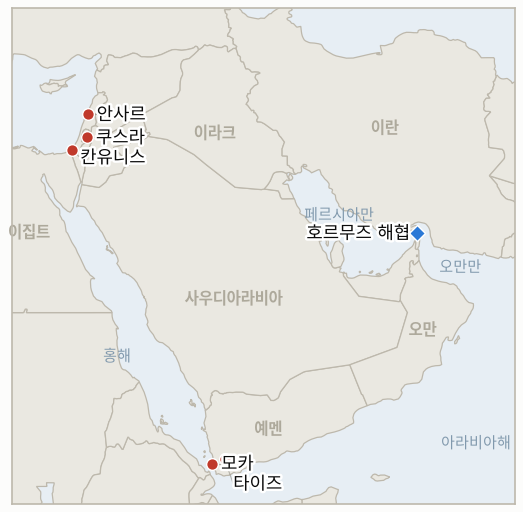

# 중동 일일 브리핑

**2026년 8월 16일**

- **보고 기간:** 약 24시간, 8월 15일 09:00 ~ 8월 16일 09:00 (한국시간)
- **종합 평가:** 토요일의 핵심 흐름은 휴전이 직접적인 타격을 받으면서도 공식적으로는 깨지지 않았다는 점이다. 레바논 남부에서는 헤즈볼라의 자폭 드론이 새벽 알리 타헤르 능선 인근에서 이스라엘군 3명을 중상 입혔고, 이스라엘은 안사르와 데이르 알자흐라니에 대한 공습으로 어린이 3명을 포함해 11명을 사망시켜 6월 휴전 이후 최악의 하루를 기록했다. 레바논 대통령과 총리는 이 인명피해를 규탄했고 헤즈볼라는 보복을 다짐했으며, 네타냐후 대변인은 이번 공습이 "협상을 본격화해야 한다"고 말해, 양측 모두 같은 충돌을 각자가 원하는 결과로 이끄는 압박으로 해석했을 뿐 틀 자체를 포기할 이유로 삼지는 않았다. 가자지구의 휴전도 비슷한 시험을 견뎌냈다: IDF 전차가 옐로 라인 인근에서 하마스가 매설한 폭발물에 피격됐고, 병력은 경계선을 넘어 접근한 팔레스타인인 2명을 사살했다. 두 사건 모두 "중대한" 위반으로 규정됐으나 대응은 아직 이뤄지지 않았다. 서안지구 쿠스라 포위는 7일째로 접어들었고, 초점은 포위된 가족들 자체에서 이들 주택에 전력을 재연결하려던 팔레스타인 자치정부 작업반을 공격한 정착민들로 옮겨갔으며, 움알헤이르에서는 별도의 정착민 공격으로 5명이 부상했다. 예멘에서는 후티의 미사일 공격으로 모카에서 민간인 4명이 사망했고, 예멘 정부군은 후티 진지에 대한 공세 작전을 추가로 기록해, 정부·후티 전쟁이 제한적 충돌이 아니라 공개적이고 지속적인 교전으로 확전됐음을 확증하는 원장의 3일 기준을 충족했다. 호르무즈 해협 전선에서는 이란과 오만이 해상교통지도 합의를 발표했으나 공동성명 서명에는 아직 이르지 못했고, 이는 원장의 가장 오래된 미해결 지표가 주시해온 결렬이 아니라 좁은 범위의 "일반 틀" 트랙이 계속되고 있음을 보여주며 오늘 시한에 반증됐다. 서울과 뉴욕 모두 주말로 시장이 휴장했다. 금요일 종가인 브렌트유 88.52달러와 WTI유 82.40달러(모두 주간 5% 이상 상승), 코스피 사상 최고치 6,977.94는 변동 없이 이월된다.

---

## 1. 무슨 일이 있었나

<figure style="float:right; width:46%; margin:2pt 0 8pt 14pt;">

<figcaption style="font-size:8pt; color:#666; text-align:center; margin-top:3pt; font-style:italic;">주요 논의 지점</figcaption>
</figure>

### 1.1 헤즈볼라 드론이 IDF 3명 중상, 이스라엘 보복 공습으로 레바논 남부서 11명 사망, 휴전 이후 최악의 하루

헤즈볼라의 자폭 드론이 새벽 2시 30분경 레바논 남부 알리 타헤르 능선 인근에서 이스라엘군을 공격해 정예 공병부대인 야할롬 부대 소속 장교 1명과 병사 2명이 중상을 입고 모두 병원으로 이송됐다([하레츠](https://www.haaretz.com/middle-east-news/lebanonnews/2026-08-15/ty-article/.premium/three-idf-troops-seriously-wounded-by-hezbollah-attack-netanyahus-office-says/000001a0-05e1-db35-afee-77eb0c840000); [Ynet](https://www.ynetnews.com/article/bkbb6l08fg)). IDF는 티레 북쪽 안사르와 나바티예 인근 데이르 알자흐라니에 대한 공습으로 대응했으며, 레바논 보건당국은 안사르에서 어린이 3명과 여성 2명을 포함해 7명, 데이르 알자흐라니에서 4명 등 총 11명이 사망하고 19명이 부상했다고 밝혔다. 이스라엘은 안사르 공습이 라드완 부대 본부를 타격해 지휘관 알리 사미르 알하지 하산을 사살했다고 밝히면서, 사망한 어린이와 여성은 해당 시설에 있던 지휘관의 가족이었다고 인정했다([타임스오브이스라엘](https://www.timesofisrael.com/israeli-strikes-kill-11-in-south-lebanon-idf-says-raids-in-response-to-hezbollah-action/); [프랑스24](https://www.france24.com/en/middle-east/20260815-israeli-strikes-kill-11-in-southern-lebanon-hezbollah-threatens-to-retaliate)). 조제프 아운 레바논 대통령은 이번 공습을 "기본협정의 반복적 위반"이라 규정했고, 나와프 살람 총리는 "7명의 순교자는... 군사 시설이 아니며, 사망한 어린이와 여성은 군사적 표적이 아니었다"며 이스라엘에 "매우 위험한" 확전을 중단하라고 촉구했다. 헤즈볼라는 이스라엘이 "합당한 대응에 직면할 것"이라고 밝혔다. 네타냐후 대변인 도론 스필먼은 이번 공습이 "협상을 본격화하고 훨씬 진지하게 만들어야 하며, 그 반대가 되어서는 안 된다"고 말했고, 이스라엘군은 레바논 내 계속되는 포격·공습 활동으로 갈릴리 북부 주민들에게 밤새 추가 폭발음이 예상된다고 통보했다. 이는 6월 휴전 이후 하루 사망자 수로는 최고치이며, 휴전 이후 헤즈볼라가 IDF 병력을 부상시킨 것이 확인된 첫 사례다. **신뢰도: 높음** — 사망자 수, 라드완 부대 지휘관의 사망, 아운·살람·헤즈볼라·스필먼의 발언(1~2등급, 다수 매체, 공식 발언). **신뢰도: 중상** — 드론 공격의 정확한 시점과 부대 정보는 이스라엘 매체 전반에 걸쳐 일관되게 보도됐으나 IDF의 전체 공식 성명과 독립적으로 대조 확인되지는 않았다.

### 1.2 IDF 전차, 옐로 라인 인근서 하마스 매설 폭발물 피격, 경계선 넘은 2명 사살

가자지구 남부에서 기바티 여단과 함께 작전 중이던 IDF 전차가 휴전의 내부 경계선인 "옐로 라인" 인근에서 하마스가 매설한 폭발물에 피격됐으나 병력 부상은 없었다. 별도로 병력은 경계선을 넘어 IDF 진지에 "위협적인 방식으로" 접근한 2명을 확인해, 군은 이들이 장비를 파괴하려 시도한 것으로 보고 사살했다고 밝혔다([타임스오브이스라엘 라이브블로그](https://www.timesofisrael.com/liveblog-august-15-2026/); [Israel National News](https://www.israelnationalnews.com/news/431735); [JNS](https://www.jns.org/news/israel-israel-news/idf-tank-hit-by-hamas-explosive-device-in-yellow-line-area)). 이스라엘군은 두 사건 모두 "중대한" 휴전 위반으로 규정하며 대응할 뜻을 밝혔으나, 이 기사 작성 시점까지 보복 공습은 보고되지 않았다. 두 사건에 대해 하마스의 공개 성명은 없었으며, 사살된 2명의 신원과 소속은 IDF 측 설명 외에 독립적으로 확인되지 않았다. **신뢰도: 중상** — 전차 피격과 사살 사실 자체(1~2등급, IDF 성명, 다수 매체). **신뢰도: 중하** — 사살된 2명이 파괴 공작에 관여했다는 규정은 IDF의 설명에만 근거하며 독립적 의도 확인이 없다.

### 1.3 쿠스라 포위 7일째, 정착민들 전기 복구반 공격, 움알헤이르서 별도 공격으로 5명 부상

나블루스 인근 쿠스라의 팔레스타인 주택 정착민 포위가 7일째로 접어들었다. 팔레스타인 자치정부 소속 지방자치 작업반이 포위된 주택에 전력을 재연결하려 하자 정착민들이 이들을 공격했고, 이스라엘군은 (포위한 정착민이 아니라) 작업반 3명을 구금했다([타임스오브이스라엘 라이브블로그](https://www.timesofisrael.com/liveblog-august-15-2026/)). 이스라엘군 수백 명이 이번 주 초 쿠스라에 진입해 인근 불법 전초기지를 철거하겠다며 수일간의 작전을 시작했다고 밝혔으나, 주민과 인권 감시단은 전초기지의 공식 지위와 무관하게 정착민들이 가족을 몰아내려 배치돼 있는 근본적인 포위 구도는 계속되고 있다고 말한다. 별도로 헤브론 남부 마사페르 야타의 움알헤이르 마을에서는 이스라엘 정착민들의 공격으로 주로 여성과 어린이인 5명이 타박상 등을 입고 부상했으며, 같은 날 인근에서는 정착민들이 알주웨이딘 도로에서 팔레스타인 주민의 차량에 돌을 던지고 팔레스타인 농지에 가축을 풀어놓는 사건도 있었다([WAFA](https://english.wafa.ps/Pages/Details/173649)). **신뢰도: 높음** — 움알헤이르 부상자 수와 쿠스라 전기 복구반 공격 사건(1~2등급, 다수 매체 및 현장 보도). **신뢰도: 중간** — 전초기지 철거 작전이 근본적 포위 구도에 미치는 영향에 대한 해석은 검증된 결과라기보다 해석적 판단이다.

### 1.4 후티 미사일에 모카서 민간인 4명 사망, 예멘 정부 공세 지표 시한에 확증

예멘 국제 승인 정부는 후티 세력이 정부 통제 하 홍해 항구도시 모카의 주거지역에 탄도미사일 6발을 발사해 민간인 4명이 사망했다고 밝혔다. 후티 군사대변인 야히아 사리는 이 공격이 "사우디가 지원하는" 군 증원 병력과 무기, 선박을 겨냥한 것이라며, 민간인이 아니라 "수십 명"의 병력을 살상했다고 주장했다([신화통신](https://english.news.cn/20260815/30d55690cbe145b5897f0966d1522206/c.html); [하레츠](https://www.haaretz.com/middle-east-news/2026-08-15/ty-article/yemen-saudi-backed-govt-says-houthi-missiles-kill-four-civilians-in-port-city/000001a0-0343-db35-afee-77eb0c840000)). 예멘 정부군은 별도로 후티 진지에 대한 공세 작전을 하루 더 기록했으며, 이는 예멘 정부가 8월 8일 처음으로 공세로 전환한 이후 원장이 추적해온 여러 주(州)에 걸친 포격·드론 공격 패턴이 이어진 것이다. 확증 기준인 3일이 이미 8월 12일 충족됐고 이후 매일 강화돼 오늘 시한에 이르렀으므로, **IND-20260809-3은 확증(Confirmed)으로 종료된다**: 예멘 정부-후티 전쟁은 후티의 초기 공격과 마리브 후속 공격을 넘어 공개적이고 지속적인 교전으로 확전됐다. **신뢰도: 높음** — 모카 민간인 사망자 수와 정부·후티 양측의 상반된 사상자 규정(1~2등급, 다수 매체, 양측 공식 발언). **신뢰도: 높음** — 지표 확증은 단일 보도가 아니라 8월 8일부터 15일까지 원장 자체의 날짜별 추적 기록에 근거한다.

### 1.5 이란·오만, 호르무즈 해상교통지도 합의 발표, 최고국가안보회의 결렬 지표 시한에 반증

이란 외무부 대변인 에스마일 바가에이는 6월 18일 양해각서를 바탕으로 3주간의 집중 협상 끝에 이란과 오만이 호르무즈 해협 해상교통지도에 합의했다고 밝혔다. 그는 데파 프레스에 "미국의 방해에도 불구하고 협상은 긍정적으로 진전됐다"고 말하면서, 이번 합의는 양국의 주권을 유지하는 독립적인 양자 협정이라는 점을 강조했다. 남은 쟁점에 대한 공동성명은 아직 작성 중이며, "절차가 마무리될 때까지" 협의가 계속될 것이라고 덧붙였다([미들이스트아이](https://www.middleeasteye.net/live-blog/live-blog-update/iran-says-route-through-hormuz-agreed-oman-deal-yet-be-finalised); [CGTN](https://news.cgtn.com/news/2026-08-15/news-1PDn2jghyHS/p.html)). 이란 최고국가안보회의의 광범위한 요구 목록과 관련해 미국이나 트럼프가 재개된 군사행동을 구체적으로 언급한 발언, 또는 오만 중재 트랙을 공식 종료하는 선언은 오늘 시한까지 단 한 차례도 나오지 않았다. 대신 외교 트랙은 이 지표의 반증 조건이 정확히 명시한 대로 더 좁은 범위의 항로·좌표 조건에서 계속됐다. **IND-20260809-1은 반증(Falsified)으로 종료된다**: 최고국가안보회의의 광범위한 조건은 실제 결렬이라기보다 강경파의 협상 시작 입장이었던 것으로 읽힌다. 실제 작동 중인 협상 트랙이 이를 다루지 않았고 대신 이번의 좁은 범위 해상교통지도 합의를 만들어냈기 때문이다. **신뢰도: 높음** — 바가에이의 발언과 합의의 좁은 범위(1~2등급, 공식 부처 발언, 다수 매체). **신뢰도: 높음** — 지표 반증은 7일 전체 추적 기간에 걸쳐 해당 조건을 충족하는 미국 측 발언이 부재했다는 점에 근거한다.

---

## 2. 심층 분석: 유인과 동기

### 2.1 헤즈볼라는 왜 불균형적 보복이 거의 확실한 상황에서 지금 IDF 병력을 직접 겨냥한 드론 공격을 감행했는가?

레바논 남부 진지를 잠식해온 두 달간의 이스라엘 작전, 전초기지 철거, 봉쇄 확대, 6월 휴전에도 불구하고 계속된 공습이 헤즈볼라로 하여금 능력과 의지를 모두 입증해야 한다는 압박을 남겼기 때문이다. 그렇지 않으면 베이루트 정부 자체가 공식 무장해제 협상으로 다가가는 상황에서 존재감을 완전히 상실할 위험이 있었다. 이스라엘군을 사살이 아닌 부상만 입히는 드론 공격은 헤즈볼라가 여전히 감내할 수 있다고 판단한 최저 수준의 도발로 이 메시지를 전달하도록 계산된 것이며, 이스라엘의 대응이 불균형적일 것을 감수하는 이유는 침묵이 아니라 이를 감내하는 것 자체가 헤즈볼라 자신의 지지 기반과 이란의 역내 입지 모두가 필요로 하는 신호이기 때문이다.

### 2.2 이스라엘은 왜 단일 드론 공격에 대해 지휘관 가족을 포함해 11명이 사망한 공습으로 대응했는가, 좁은 범위의 비례적 대응 대신?

네타냐후 대변인 자신의 표현, 즉 이번 공습이 "협상을 본격화하고 훨씬 진지하게 만들어야 한다"는 발언이 그 근저의 논리를 드러낸다. 명확히 귀책이 가능한 도발에 압도적 무력을 적용함으로써, 이스라엘은 베이루트와 워싱턴 양쪽에 헤즈볼라의 어떤 활동이든 도발 자체와 비교해 불균형적인 대가를 치른다는 것을 입증하고, 공습의 규모를 헤즈볼라가 지연시켜온 무장해제 협상을 가속화하는 지렛대로 삼는다. 이는 레바논 대통령과 총리에게 실질적인 반발 근거를 안겨주고 공습이 명목상 진전시키려던 외교 트랙 자체를 복잡하게 만드는 민간인 사상자라는 대가를 치르더라도 감수하는 선택이다.

### 2.3 무장해제 협상이 계속되는 상황에서 하마스 연계 조직원들은 왜 옐로 라인 인근에서 폭발물을 매설하고 IDF 진지에 접근했는가?

옐로 라인 사건이 우발적인 현지 행동 이상의 무언가를 반영한다면, 이는 쿠슈너와 믈라데노프의 압박 캠페인이 관통하는 협상 테이블을 공식적으로 포기하지 않으면서도 하마스 또는 하마스 연계 세력이 여전히 휴전의 물리적 경계선에 이의를 제기할 능력을 갖추고 있음을 낮은 비용으로 입증하려는 시도로 읽힌다. 이는 서면상 협상되는 "진정한 무장해제"가 현장에서 당연시될 수 없다는 것을 이스라엘에 보여줌으로써 무장해제 협상 내 지렛대를 유지하려는 것이며, 휴전이 반복적으로 보여온 패턴, 즉 틀 자체를 붕괴시키지는 않는 선에서 그치는 저강도 위반의 연장선에 있다.

### 2.4 쿠스라의 정착민들은 왜 일주일 된 포위를 조용히 끝나게 두지 않고 팔레스타인 자치정부 복구반을 공격하는 데까지 확대했는가?

포위된 주택에 전력을 복구하는 것은 해당 가족들이 계속 머물 의사가 있다는 구체적인 신호이며, 그 복구를 막는 것, 즉 포위의 원래 명분이었던 재산 분쟁이 아니라 바로 이것이 실제 목표이기 때문이다. 복구 작업을 하는 작업반을 공격하고, 이스라엘군이 포위한 정착민이 아니라 팔레스타인 노동자들을 구금한 사실은, 카츠 국방장관이 하루 전 발표한 IDF에서 경찰로의 이관이 낳을 것이라는 비평가들의 집행 공백 우려가 가설이 아니라 실제로 작동하고 있음을 보여준다. 그 실질적 효과는 명목상 집행 책임이 어느 기관에 있는지와 무관하게 해당 가족들이 정상적인 삶으로 돌아가는 것을 계속 막는 것이다.

### 2.5 이란은 왜 자국 최고국가안보회의의 광범위한 요구가 공식적으로 여전히 테이블에 남아 있는 상태에서 좁은 범위의 오만 해상교통지도 협정을 마무리했는가?

이란과 전쟁 상태에 있지 않은 오만과의 주권을 유지하는 양자 협정은, 워싱턴의 최고국가안보회의 요구 목록에 무언가를 양보하는 것처럼 보이지 않으면서도 테헤란이 호르무즈 통항에 대한 실질적 통제력을 보여주고 자국의 경제적 고립을 부분적으로 완화할 수 있게 해준다. 이를 통해 이란은 미국의 압력에 의해 해협을 재개방한 것이 아니라고 주장하면서도 작동하는 통항 체제가 제공하는 제재 관련 완화 효과는 그대로 취할 수 있다. 최고국가안보회의의 광범위한 조건을 공식적으로 테이블에 남겨두는 것은 테헤란에 아무런 비용도 발생시키지 않는데, 미국을 포함해 누구도 이를 실제 협상 문서로 취급하고 있지 않기 때문이며, 그동안 좁은 범위의 오만 채널이 봉쇄의 경제적 피해를 관리하는 실질적 작업을 수행한다.

---

## 3. 한국에 대한 정책적 함의

### 3.1 익스포저 현황

| 항목 | 현재 수치 | 출처 |
| --- | --- | --- |
| 원유 수입 중 중동 비중 | 48.5% (2026년 5~7월), 1년 전 69.1%에서 하락; 비중동 비중이 사상 처음 50%를 상회 | KNOC, 아시아경제 경유; `korea-exposure.md` |
| 7~8월 원유 조달 | 전년 동기 물량의 110% 이상 확보(산업부, 7월 21일); 비축유 스와프 8월까지 연장, 현재까지 약 2,100만 배럴 스와프 | 산업부, 헤럴드경제·한경 경유; `korea-exposure.md` |
| 9월 원유 조달 | 90% 이상 확보(산업부, 7월 21일) | 산업부, 헤럴드경제 경유; `korea-exposure.md` |
| 홍해 우회 항로 | 한국행 원유 화물이 얀부·홍해 우회로를 계속 이용 중; 한국을 포함한 아시아 매수처로의 얀부 수출량이 1년 전 하루 100만 배럴 미만에서 약 400만 배럴로 급증 | 로이즈리스트 인텔리전스; `korea-exposure.md` |
| 비축유 보유 여력 | 실제 소비 기준 약 26일분(추정); 스와프는 즉시 가동 대기 상태이나 대규모 실행은 미검증 | CSIS; 산업부 7월 27일 |
| 정유사 사우디 지분 익스포저 | S-Oil(사우디 아람코 과반 지분 약 63%), HD현대오일뱅크(아람코 지분 약 17%) | 공시 자료; `korea-exposure.md` |
| 브렌트유/WTI유 | 주말 휴장(정산 없음); 금요일 종가 88.52달러/82.40달러가 이월되며 모두 주간 5% 이상 상승, 봉쇄·고립 발언이 배경 | CNBC(금요일 정산가) |
| 코스피/원달러 환율 | 주말 휴장; 금요일 사상 최고치 마감 6,977.94와 환율 1,418.3원이 이월 | 코리아타임스, 아시아경제(금요일 종가) |
| 호르무즈 통항량 | 이번 보고 기간 중 신규 Kpler/Windward 발표 없음; 마지막 확인 수치는 8월 12일 종료 24시간 기준 3척(Windward), 전량 남측 항로 이용 | Windward Daily Intelligence |

### 3.2 사안별 함의

**레바논 확전은 6월 휴전 이후 하루 사망자 수 최고치이자 휴전 이후 헤즈볼라가 IDF 병력을 부상시킨 것이 확인된 첫 사례로, 한국 시장에 직접적인 익스포저는 없으나 휴전의 집행 메커니즘이 아니라 틀 자체가 직접적인 군사적 충돌을 붕괴 없이 견뎌낼 수 있는지를 시험한다.** 신규 IND-20260816-1(시한 8월 29일)은 이번 충돌이 며칠 내 추가 라운드로 이어질지, 아니면 양측이 충돌 이전 균형 상태로 물러날지를 검증한다. IND-20260807-2(시한 9월 1일)는 레바논 남부의 활성 전투 국면이 병행되는 로마 외교 트랙을 탈선시키는지를 계속 추적하며, 현재 탈선 쪽으로 기울고 있다.

**가자지구 옐로 라인 사건들은 한국 시장에 직접적인 익스포저가 없으나, 쿠슈너와 믈라데노프의 무장해제 압박이 계속되는 와중에도 휴전의 내부 경계선이 여전히 살아있는 마찰 지점임을 재확인시키며, 예고됐으나 아직 이행되지 않은 IDF의 대응 자체가 주시할 만한 신호다.** 신규 IND-20260816-2(시한 8월 30일)는 이 사건들이 공식적인 IDF 작전 대응을 촉발할지, 아니면 고립된 사건으로 남을지를 검증한다. IND-20260812-4(시한 8월 26일)는 가자지구 무장해제 선행 프레임워크가 이스라엘 안보내각의 공식 표결에 이를지를 계속 추적한다.

**쿠스라 전기 복구반 공격과 움알헤이르 부상 사건은 한국 시장에 직접적인 익스포저가 없으나, 카츠 장관이 IDF에서 경찰로의 이관을 발표한 날 제기됐던 집행 공백 우려를 확증한다. 즉 포위된 가족이 아니라 정착민들이 여전히 현장의 사실관계를 결정하는 행위자로 남아 있다.** IND-20260813-3(시한 8월 27일)은 쿠스라 포위 자체를 계속 추적하며, 명목상 이를 해결하기 위한 것이라는 군사 작전보다 근본적 역학이 더 오래 지속되면서 반증 쪽으로 더 기울고 있다. IND-20260815-2(시한 9월 12일)는 집행 이관이 정착민 폭력의 측정 가능한 감소로 이어지는지를 계속 추적하며, 오늘의 사건들은 감소가 아니라 지속으로 기록된다.

**오늘 확증된 예멘 정부 공세 지표는 모카 민간인 4명 사망과 함께, 한국의 얀부 홍해 우회로가 정부-후티 전쟁이 이제 공식적으로 제한적 충돌을 넘어 확전된 지역을 통과하고 있음을 재확인시키며, 이는 `korea-exposure.md`의 8월 10일·8월 13일 항목이 이미 일시적이 아닌 구조적 리스크로 추적하기 시작한 바로 그 수송로 리스크다.** 아래에 개설된 이란-오만 트랙용 신규 IND-20260816-3과 IND-20260810-3(시한 8월 17일, 자잔 공격에 대한 사우디의 대응)이 가장 근접한 예멘 인접 시험대로 남아 있다. IND-20260813-2(시한 9월 2일)는 구조대를 겨냥한 이중 타격 전술의 재발 여부를 계속 추적한다.

**이란-오만 해상교통지도 합의는 최고국가안보회의 결렬 지표의 반증과 함께 오늘의 가장 직접적인 한국 관련 신호다. 이는 작동 중인 호르무즈 외교 트랙이 한국 정유사와 KNOC가 계획을 세울 수 있는 좁은 범위의 기술적 트랙으로 남아 있음을 확인시키며, 재개된 군사적 확전과 더 강경한 봉쇄를 예고했을 광범위한 조건의 결렬은 일어나지 않았다.** 신규 IND-20260816-3(시한 9월 5일)은 이번 해상교통지도 합의가 이행 일정을 담은 서명된 공동성명으로 전환될지, 아니면 6월 18일 양해각서의 통행료 면제 기간(IND-20260814-1, 시한 8월 24일)이 별도로 만료를 앞둔 가운데 다시 서명 직전에서 정체될지를 검증한다.

**검증 가능한 지표:**

- **IND-20260816-1** — 8월 15일 헤즈볼라-이스라엘 충돌(IDF 3명을 부상시킨 드론 공격, 11명이 사망한 보복 공습)이 며칠 내 추가 충돌 라운드로 이어져 레바논 남부에서 구조적으로 활성 전투가 재개되는지, 아니면 양측이 6월 휴전 이후의 균형 상태로 물러나는지를 검증한다. 2026년 8월 29일까지 헤즈볼라의 추가 IDF 공격이 검증되거나 이스라엘의 공습으로 레바논에서 5명 이상이 추가로 사망하면 이번 충돌이 재개된 활성 전투 국면을 열었음이 확증된다. 같은 시한까지 양측 어느 쪽의 추가 공격도 없고 이전의 간헐적이고 낮은 사상자 수의 사건 패턴으로 복귀하면 이는 국한된 일회성 충돌로 반증된다.
- **IND-20260816-2** — 가자지구 옐로 라인의 폭발물·파괴 공작 사건들이 공식적으로 검증 가능한 IDF 작전 대응(확대된 집행 구역, 해당 사건과 명시적으로 연계된 보복 공습, 또는 공개적인 정책 변화)을 촉발하는지, 아니면 추가 확전 없이 흡수되는지를 검증한다. 2026년 8월 30일까지 8월 15일 사건과 명시적으로 연계된 검증 가능한 IDF 작전 대응이 있으면 확전이 확증된다. 같은 시한까지 그러한 대응이 없고 옐로 라인을 따라 긴장을 고조시키는 추가 사건도 없으면 고립된 사건 한 쌍으로 흡수됐음이 반증된다.
- **IND-20260816-3** — 이란과 오만이 발표한 호르무즈 해상교통지도 합의가 이행 일정이 명시된 서명 공동성명으로 전환되는지, 아니면 다시 서명 직전에서 절차가 정체되는지를 검증한다. 2026년 9월 5일까지 이행 일정 또는 시행일이 포함된 이란-오만 호르무즈 항로 서명 공동성명이 나오면 좁은 범위의 일반 틀 트랙이 실제 문서를 만들어냈음이 확증된다. 같은 시한까지 서명된 성명이나 시행일이 없으면 또 한 번의 미완결 "마무리 단계" 주장으로 반증된다.

---

## 4. 관찰 목록

- **8월 15일 헤즈볼라-이스라엘 충돌이 추가 라운드로 이어질지, 아니면 양측이 휴전 이후 균형 상태로 물러날지** (IND-20260816-1, 시한 8월 29일).
- **가자지구 옐로 라인 사건들이 공식적인 IDF 작전 대응을 촉발할지, 아니면 고립된 사건으로 남을지** (IND-20260816-2, 시한 8월 30일).
- **이란-오만 호르무즈 해상교통지도 합의가 서명된 이행 공동성명으로 전환될지** (IND-20260816-3, 시한 9월 5일).
- **베센트가 예고한 전례 없는 이란 경제 고립 조치가 구체적인 새 조치와 함께 실현될지** (IND-20260815-1, 시한 8월 22일).
- **서안지구 IDF에서 경찰로의 집행 이관이 정착민 폭력을 줄일지, 그대로 유지될지** (IND-20260815-2, 시한 9월 12일).
- **이란의 경고에도 불구하고 시리아가 레바논 헤즈볼라에 대해 움직일지, 아니면 대립이 수사적 수준에 머물지** (IND-20260815-3, 시한 9월 15일).
- **8월 17일경 만료되는 6월 17일 양해각서의 통행료 면제 기간이 실제 이란의 통행료 부과로 이어질지, 아니면 조용히 연장될지** (IND-20260814-1, 시한 8월 24일).
- **이집트로 확대된 쿠슈너·믈라데노프 방문이 하마스 무장해제에 대한 네타냐후의 입장을 바꿀지** (IND-20260814-2, 시한 8월 21일).
- **예멘 후티-정부 교전이 마리브·하드라마우트·타이즈를 넘어 네 번째 주(州)로 확산될지** (IND-20260814-3, 시한 9월 4일).
- **쿠스라 포위가 실제로 해소될지, 명목상 이를 해결하려던 군사 작전보다 근본 역학이 더 오래 지속되면서 반증 쪽으로 더 기울고 있다** (IND-20260813-3, 시한 8월 27일).
- **구조대를 겨냥한 후티의 이중 타격 전술이 재발할지, 일회성 확전으로 그칠지** (IND-20260813-2, 시한 9월 2일).
- **IEA의 재고 고갈 경고가 추가적인 공조 정책 대응이나 지속적인 가격 변동으로 이어질지** (IND-20260813-1, 시한 9월 2일).
- **더 좁은 범위 또는 수정된 이란-오만 호르무즈 메커니즘이 공개 발표되고 수용될지, 오늘의 해상교통지도 합의로 사실상 확증됨** (IND-20260810-1, 시한 8월 20일).
- **사우디아라비아가 자잔 정유시설 공격이나 추가 후티 공격에 직접 보복할지** (IND-20260810-3, 시한 8월 17일).
- **미 해군의 무력 봉쇄 집행이 이란의 군사적 대응을 촉발할지** (IND-20260812-1, 시한 8월 26일).
- **시리아의 핵물질 파일이 IAEA와의 최종 합의 및 검증된 제거로 전환될지** (IND-20260812-2, 시한 9월 11일).
- **가자지구 무장해제 선행 프레임워크가 어떤 형태로든 이스라엘 안보내각의 공식 표결에 이를지** (IND-20260812-4, 시한 8월 26일).
- **타이베를 비거주자에게 폐쇄한 조치가 정착민 공격을 줄일지, 폭력이 그대로 계속될지** (IND-20260811-3, 시한 8월 18일).
- **캐롤라인 베젠기호 기름 유출이 샐비지 작업 시작 이후, 유출 시작 두 달여 만에 억제될지.**
- **케슘섬 폭발이 실제 공격으로 확인될지, 오경보로 결론 날지.**

---

## 5. 출처 신뢰도 요약

| 주장 | 출처 | 신뢰도 |
| --- | --- | --- |
| 헤즈볼라 자폭 드론이 알리 타헤르 능선 인근에서 IDF 3명 부상 | 하레츠, Ynet(1~2등급, 네타냐후실 성명, 다수 매체) | 높음 |
| 안사르·데이르 알자흐라니 공습으로 어린이 3명·여성 2명 포함 11명 사망; 라드완 부대 지휘관 알리 사미르 알하지 하산 사살 | 타임스오브이스라엘, 프랑스24, PBS(1~2등급, 레바논 보건부, IDF 성명, 다수 매체) | 높음 |
| 아운·살람·헤즈볼라의 규탄·보복 발언 | 타임스오브이스라엘, 프랑스24(1~2등급, 공식 발언) | 높음 |
| IDF 전차가 옐로 라인 인근서 하마스 매설 폭발물에 피격; 경계선 넘은 2명 사살 | 타임스오브이스라엘 라이브블로그, Israel National News, JNS(1~2등급, IDF 성명, 다수 매체) | 중상 |
| 사살된 2명이 IDF 장비 파괴를 시도했다는 규정 | IDF 성명에만 근거, 독립적 대조 확인 없음 | 중하 |
| 쿠스라 포위 7일째; 정착민이 자치정부 복구반 공격, 작업반 3명 구금 | 타임스오브이스라엘 라이브블로그(1~2등급, 현장 라이브블로그 보도) | 높음 |
| 움알헤이르(마사페르 야타) 정착민 공격으로 팔레스타인인 5명 부상 | WAFA(2~3등급, 팔레스타인 공식 통신사) | 높음 |
| 모카서 후티 미사일로 민간인 4명 사망; 후티는 군사 표적이라 주장 | 신화통신, 하레츠(1~2등급, 예멘 정부·후티 성명, 다수 매체) | 높음 |
| 예멘 정부군이 후티 진지에 대한 공세 작전 추가 기록, IND-20260809-3 확증 | 8월 8~15일에 걸친 원장 자체의 날짜별 추적 기록(각 항목별 원 출처) | 높음 |
| 이란·오만이 호르무즈 해상교통지도 합의 발표; 공동성명은 아직 마무리 중 | 미들이스트아이, CGTN, 에스마일 바가에이 인용(1~2등급, 공식 부처 대변인 발언, 다수 매체) | 높음 |
| 시한까지 최고국가안보회의 조건과 연계된 미국·트럼프의 재개 군사행동 발언이 없어 IND-20260809-1 반증 | 원장의 7일 전체 추적 기간에 걸친 해당 보도 부재; 상반된 보도 없음 | 높음 |
