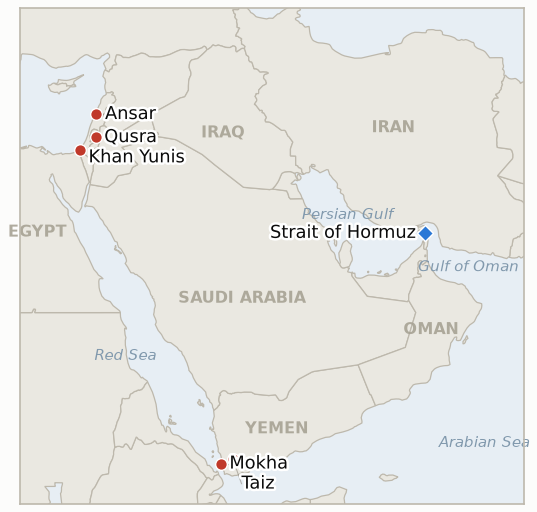

# Middle East Daily Briefing

**August 16, 2026**

- **Reporting window:** ~24 hours, August 15, 09:00 to August 16, 09:00 KST
- **Overall assessment:** Saturday's throughline was ceasefires absorbing direct hits without formally breaking. In south Lebanon, a Hezbollah explosive drone seriously wounded three Israeli soldiers near Ali Taher Ridge before dawn, and Israel answered with strikes on Ansar and Deir al-Zahrani that killed 11 people, including three children, the deadliest single day since the June truce; Lebanon's president and prime minister condemned the toll, Hezbollah vowed to respond, and a Netanyahu spokesman said the strikes should "jumpstart the talks," each side reading the same exchange as pressure toward its own preferred outcome rather than a reason to abandon the framework. Gaza's ceasefire absorbed a comparable test: an IDF tank struck a Hamas-planted explosive device near the Yellow Line and troops shot dead two Palestinians who crossed the line and approached them, both declared "grave" violations with a response promised but not yet delivered. The West Bank's Qusra siege ran into a seventh day, its focus shifting from the besieged families themselves to a Palestinian Authority utility crew that settlers attacked while it tried to reconnect the homes' power, and a separate settler attack in Umm al-Khair injured five. In Yemen, Houthi missiles killed four civilians in Mokha and Yemeni government forces logged a further day of offensive action against Houthi positions, meeting this ledger's three-day bar for confirming that the government-Houthi war has escalated into open, sustained fighting rather than a bounded exchange. And in the Hormuz theater, Iran and Oman announced agreement on a shipping traffic map, still short of a signed joint statement, continuing the narrower "general framework" track rather than snapping into the rupture this ledger's oldest open indicator was watching for, which falsifies at its own deadline today. Markets were closed for the weekend in both Seoul and New York; Friday's settles, Brent $88.52 and WTI $82.40, both up more than 5% for the week, and KOSPI's record 6,977.94 close, carry forward unchanged.

---

## 1. What Happened

<figure style="float:right; width:46%; margin:2pt 0 8pt 14pt;">

<figcaption style="font-size:8pt; color:#666; text-align:center; margin-top:3pt; font-style:italic;">Major places of discussion</figcaption>
</figure>

### 1.1 Hezbollah Drone Wounds Three IDF Soldiers as Israeli Strikes Kill Eleven in South Lebanon's Deadliest Day Since the Truce

A Hezbollah explosive drone struck Israeli troops near Ali Taher Ridge in southern Lebanon at around 2:30 a.m., seriously wounding three soldiers, an officer and two soldiers from the elite Yahalom combat engineering unit, all hospitalized ([Haaretz](https://www.haaretz.com/middle-east-news/lebanonnews/2026-08-15/ty-article/.premium/three-idf-troops-seriously-wounded-by-hezbollah-attack-netanyahus-office-says/000001a0-05e1-db35-afee-77eb0c840000); [Ynet](https://www.ynetnews.com/article/bkbb6l08fg)). The IDF responded with strikes on Ansar, north of Tyre, and Deir al-Zahrani, near Nabatieh, that Lebanese health authorities said killed 11 people in total, seven in Ansar (including three children and two women) and four in Deir al-Zahrani, with 19 people wounded; Israel said the Ansar strike hit a Radwan Force headquarters and killed commander Ali Samir Al-Haj Hassan, while acknowledging the children and women killed were the commander's family present at the site ([Times of Israel](https://www.timesofisrael.com/israeli-strikes-kill-11-in-south-lebanon-idf-says-raids-in-response-to-hezbollah-action/); [France 24](https://www.france24.com/en/middle-east/20260815-israeli-strikes-kill-11-in-southern-lebanon-hezbollah-threatens-to-retaliate)). Lebanese President Joseph Aoun called the strikes "repeated violations of the framework agreement," and Prime Minister Nawaf Salam said "the seven martyrs...are not military infrastructure, and the children and women killed were not military targets," urging Israel to halt an "extremely dangerous" escalation; Hezbollah said Israel "will be met with an appropriate response." A Netanyahu spokesman, Doron Spielman, said the strikes "should jumpstart the talks and make them much more serious, not do the opposite," and Israel's military told residents of the Upper Galilee to expect further overnight explosions from continuing artillery and air activity in Lebanon. It is the highest single-day death toll in Lebanon since the June truce, and the first confirmed Hezbollah strike to wound IDF troops since then. **Confidence: High** on the casualty figures, the Radwan commander's death, and the Aoun, Salam, Hezbollah and Spielman statements (Tier 1-2, multi-outlet, on-record); **Medium-High** on the precise timing and unit details of the drone strike, sourced consistently across Israeli outlets but not independently verified against a primary IDF statement in full.

### 1.2 IDF Tank Hit by Hamas-Planted Explosive Near the Yellow Line as Troops Kill Two Crossing the Ceasefire Line

The IDF said a tank operating with the Givati Brigade in southern Gaza struck an explosive device planted by Hamas near the "Yellow Line," the ceasefire's internal demarcation, with no soldiers injured; separately, troops identified two people who crossed the line and approached IDF positions "in a manner that posed a threat," attempting, the military said, to sabotage equipment, and shot them dead ([Times of Israel liveblog](https://www.timesofisrael.com/liveblog-august-15-2026/); [Israel National News](https://www.israelnationalnews.com/news/431735); [JNS](https://www.jns.org/news/israel-israel-news/idf-tank-hit-by-hamas-explosive-device-in-yellow-line-area)). The military described both incidents as "grave" ceasefire violations and indicated it intends to respond, though no retaliatory strike had been reported by the time of writing. Neither incident has drawn a public Hamas statement, and the identities and affiliation of the two people killed have not been independently confirmed beyond the IDF's own account. **Confidence: Medium-High** on the tank strike and the fact of the shooting (Tier 1-2, IDF statement, multi-outlet); **Low-Medium** on the characterization of the two killed as engaged in sabotage, sourced solely to the IDF with no independent corroboration of intent.

### 1.3 Qusra Siege Reaches a Seventh Day as Settlers Attack a Utility Crew, and a Separate Attack Injures Five in Umm al-Khair

The settler siege of Palestinian homes in Qusra, near Nablus, continued into a seventh day; when a Palestinian Authority municipal crew attempted to reconnect electricity to the besieged homes, settlers attacked the workers and Israeli forces detained three of them, not the settlers ([Times of Israel liveblog](https://www.timesofisrael.com/liveblog-august-15-2026/)). Hundreds of Israeli soldiers had entered Qusra earlier in the week for a stated multi-day operation to dismantle a nearby illegal outpost, but residents and rights monitors say the underlying siege dynamic, settlers positioned to force the families out, persists regardless of the outpost's formal status. Separately, in Masafer Yatta south of Hebron, Israeli settlers attacked Palestinians in the Umm al-Khair hamlet, injuring five people, mostly women and children, with bruises and contusions; in nearby incidents the same day, settlers stoned a Palestinian's vehicle on the al-Zuweidin road and released livestock onto Palestinian farmland ([WAFA](https://english.wafa.ps/Pages/Details/173649)). **Confidence: High** on the Umm al-Khair injury count and the Qusra utility-crew incident (Tier 1-2, multi-outlet and on-scene reporting); **Medium** on the characterization of the outpost-dismantling operation's effect on the underlying siege, which is an interpretive read rather than a verified outcome.

### 1.4 Houthi Missiles Kill Four Civilians in Mokha as Yemen's Government-Offensive Indicator Confirms at Its Deadline

Yemen's internationally recognized government said Houthi forces fired six ballistic missiles into residential areas of the government-held Red Sea port of Mokha, killing four civilians; the Houthis' military spokesman, Yahya Saree, said the barrage targeted "Saudi-backed" military reinforcements, weapons and boats, claiming it killed or wounded "dozens" of personnel rather than civilians ([Xinhua](https://english.news.cn/20260815/30d55690cbe145b5897f0966d1522206/c.html); [Haaretz](https://www.haaretz.com/middle-east-news/2026-08-15/ty-article/yemen-saudi-backed-govt-says-houthi-missiles-kill-four-civilians-in-port-city/000001a0-0343-db35-afee-77eb0c840000)). Yemeni government forces separately logged a further day of offensive operations against Houthi positions, continuing the pattern of artillery and drone strikes across multiple governorates this ledger has tracked since Yemen's government first went on the offensive August 8; with confirmation's three-day bar already met August 12 and reinforced on each subsequent day through today's deadline, **IND-20260809-3 resolves Confirmed**: Yemen's government-Houthi war has escalated into open, sustained fighting beyond the Houthis' initial raid, rather than staying a bounded exchange. **Confidence: High** on the Mokha civilian toll and the competing government/Houthi casualty framing (Tier 1-2, multi-outlet, both sides' statements on record); **High** on the indicator resolution, which rests on the ledger's own dated tracking record rather than a single day's report.

### 1.5 Iran and Oman Announce a Hormuz Shipping Map Agreement as the SNSC Rupture Indicator Falsifies at Its Deadline

Iranian Foreign Ministry spokesman Esmail Baghaei said Iran and Oman have reached agreement on a Strait of Hormuz shipping traffic map after three weeks of intensive talks building on their June 18 memorandum, telling Defa Press that "despite US obstruction, the talks have made positive progress," while stressing the arrangement remains an independent bilateral agreement preserving both states' sovereignty; a joint statement on the remaining points is still being drafted and exchanges will continue "until the process is finalised" ([Middle East Eye](https://www.middleeasteye.net/live-blog/live-blog-update/iran-says-route-through-hormuz-agreed-oman-deal-yet-be-finalised); [CGTN](https://news.cgtn.com/news/2026-08-15/news-1PDn2jghyHS/p.html)). No US, Trump statement invoking renewed military action tied specifically to Iran's Supreme National Security Council's sweeping demand list, and no formal declaration ending the Oman-mediated track, has occurred at any point through today's deadline; instead, the diplomatic track has continued on exactly the narrower route-and-coordinates terms this indicator's falsification branch specified. **IND-20260809-1 resolves Falsified**: the SNSC's sweeping conditions read as a hardliner opening position rather than a genuine rupture, since the operative negotiating track never engaged with them and instead produced this narrower shipping-map agreement. **Confidence: High** on Baghaei's statement and the agreement's narrower scope (Tier 1-2, on-record ministry statement, multi-outlet); **High** on the indicator resolution, based on the absence of any qualifying US statement across the full seven-day window.

---

## 2. Deep Dive: Incentives and Motives

### 2.1 Why would Hezbollah risk a direct drone strike on IDF troops now, given the near-certainty of disproportionate retaliation?

Because two months of Israeli operations chipping away at Hezbollah's southern positions, outpost dismantlements, expanded closures, and continued strikes despite the June truce, have left the group needing to demonstrate it retains both the capability and the will to impose a cost, even a small one, or risk being negotiated out of relevance entirely as Beirut's own government edges toward formal disarmament talks; a single drone strike wounding rather than killing Israeli soldiers is calibrated to make that point at the lowest level of provocation Hezbollah judged would still register, accepting that Israel's response would be disproportionate because absorbing it, rather than staying silent, is the signal Hezbollah's own constituency and Iran's regional position both need.

### 2.2 Why would Israel answer a single drone strike with strikes killing 11 people, including a commander's family, rather than a narrower proportionate response?

Because the Netanyahu spokesman's own framing, that the strikes "should jumpstart the talks and make them much more serious," reveals the underlying logic: overwhelming force applied to a clearly attributable provocation lets Israel demonstrate to Beirut and Washington alike that any Hezbollah activity carries costs disproportionate to the provocation itself, using the strike's scale as leverage to accelerate the disarmament negotiations Hezbollah has been slow-walking, even at the cost of civilian casualties that hand Lebanon's president and prime minister a genuine grievance and complicate the diplomatic track the strikes were nominally meant to advance.

### 2.3 Why would Hamas-linked operatives plant explosives and approach IDF positions near the Yellow Line even as disarmament negotiations continue?

Because the Yellow Line incidents, if they reflect anything beyond opportunistic local action, read as a low-cost demonstration that Hamas or Hamas-aligned factions retain the capacity to contest the ceasefire's physical boundary without formally abandoning the negotiating table Kushner and Mladenov's pressure campaign runs through, preserving leverage inside the disarmament talks by showing Israel that "genuine disarmament" cannot be taken for granted on the ground even as it is being negotiated on paper, a pattern consistent with the ceasefire's repeated pattern of low-level violations that stop short of collapsing the framework itself.

### 2.4 Why would Qusra's settlers escalate to attacking a Palestinian Authority utility crew rather than let a week-old siege wind down quietly?

Because restoring electricity to the besieged homes is a concrete signal that the families intend to stay, and preventing that restoration, rather than the siege's original property dispute, is the actual objective; attacking the crew doing the reconnection work, and having Israeli forces detain the Palestinian workers rather than the besieging settlers, demonstrates that the enforcement gap critics flagged when Defense Minister Katz announced his IDF-to-police handover a day earlier is not a hypothetical concern but an active one, with the practical effect of denying the families' return to normal life regardless of which authority is nominally responsible for enforcement.

### 2.5 Why would Iran finalize a narrower Oman shipping-map deal while its own Supreme National Security Council's sweeping demands remain formally on the table?

Because a bilateral, sovereignty-preserving arrangement with Oman, a state Iran is not at war with, lets Tehran demonstrate practical control over Hormuz traffic and partially ease its own economic isolation without appearing to concede anything to Washington on the SNSC's list of conditions, letting Iran claim it never reopened the strait under American pressure while still extracting whatever sanctions-adjacent relief a working traffic arrangement provides; keeping the SNSC's sweeping conditions formally on the table costs Tehran nothing since no one, least of all the US, is treating them as an active negotiating text, while the narrower Oman channel does the practical work of managing the blockade's economic damage.

---

## 3. Policy Implications for South Korea

### 3.1 Exposure snapshot

| Item | Current reading | Source |
| --- | --- | --- |
| Middle East share of crude imports | 48.5% (May-July 2026), down from 69.1% a year earlier; non-Middle East share crossed 50% for the first time on record | KNOC via Asia Business Daily; `korea-exposure.md` |
| July-August crude procurement | 110%+ of prior-year volume secured (MOTIE, July 21); strategic reserve swap extended through August, ~21 million barrels swapped to date | MOTIE via Herald Business, Hankyung; `korea-exposure.md` |
| September crude procurement | 90%+ secured (MOTIE, July 21) | MOTIE via Herald Business; `korea-exposure.md` |
| Red Sea detour routing | Korean-bound crude cargoes continue via the Yanbu/Red Sea workaround; Yanbu exports to Asian buyers including Korea have surged to ~4 million bpd from under 1 million bpd a year earlier | Lloyd's List Intelligence; `korea-exposure.md` |
| Strategic reserve coverage | ~26 days of actual consumption (estimate); swap on immediate standby, untested at scale | CSIS; MOTIE July 27 |
| Refiner Saudi ownership exposure | S-Oil (Saudi Aramco majority ~63%), HD Hyundai Oilbank (Aramco ~17%) | Public filings; `korea-exposure.md` |
| Brent / WTI | No settle (weekend); Friday's close $88.52 / $82.40 carries forward, both up 5%+ for the week on blockade and isolation rhetoric | CNBC (Friday settle) |
| KOSPI / USD-KRW | No session (weekend); Friday's record close 6,977.94 and won 1,418.3 carry forward | Korea Times, Asia Business Daily (Friday close) |
| Hormuz transits | No fresh Kpler/Windward print in the window; last verified level remains 3 vessels for the 24 hours ending August 12 (Windward), all via the south corridor | Windward Daily Intelligence |

### 3.2 Implications by development

**The Lebanon escalation, the deadliest single day since the June truce and the first confirmed Hezbollah strike to wound IDF troops since then, has no direct Korean market exposure but tests whether the ceasefire framework itself, rather than just its enforcement mechanics, can absorb a direct military exchange without collapsing.** New IND-20260816-1 (deadline August 29) tests whether the exchange triggers a further round within days or both sides step back to the pre-strike equilibrium; IND-20260807-2 (deadline September 1) continues tracking whether south Lebanon's active combat phase derails the parallel Rome diplomatic track, now trending toward derailment.

**The Yellow Line incidents in Gaza carry no direct Korean market exposure but reinforce that the ceasefire's internal boundary remains a live friction point even as Kushner and Mladenov's disarmament push continues; a promised but undelivered IDF response is itself a signal worth tracking.** New IND-20260816-2 (deadline August 30) tests whether the incidents prompt a formal IDF operational response or remain isolated; IND-20260812-4 (deadline August 26) continues tracking whether the Gaza disarm-first framework ever reaches a formal Israeli Security Cabinet vote.

**The Qusra utility-crew attack and the Umm al-Khair injuries have no direct Korean market exposure but confirm the enforcement-gap concern flagged the day Katz announced the IDF-to-police handover: settlers, not besieged families, remain the actors setting facts on the ground.** IND-20260813-3 (deadline August 27) continues tracking the Qusra siege itself, now trending further toward falsification as the underlying dynamic outlasts a formal military operation nominally aimed at resolving it; IND-20260815-2 (deadline September 12) continues tracking whether the enforcement handover produces any measurable reduction in settler-violence incidents, with today's events registering as a continuation rather than a reduction.

**Yemen's government-offensive indicator confirming today, alongside four Mokha civilians killed, reinforces that Korea's Yanbu Red Sea workaround transits a theater where the government-Houthi war has now formally escalated beyond a bounded exchange, exactly the corridor risk `korea-exposure.md`'s Aug 10 and Aug 13 entries already began tracking as structural rather than episodic.** New IND-20260816-3, opened for the Iran-Oman track below, and IND-20260810-3 (deadline August 17, Saudi response to the Jazan strikes) remain the nearest-term Yemen-adjacent tests; IND-20260813-2 (deadline September 2) continues tracking whether the double-tap tactic against rescuers recurs.

**The Iran-Oman shipping-map agreement, alongside the SNSC-rupture indicator's falsification, is the most direct Korean-relevant signal today: it confirms the operative Hormuz diplomatic track remains the narrower, technical one Korean refiners and KNOC can plan around, rather than the sweeping-conditions rupture that would have signaled renewed military escalation and a harder close.** New IND-20260816-3 (deadline September 5) tests whether this shipping-map agreement converts into a signed, implemented joint statement with an operating date, or stalls again short of signature as the June 18 MOU's own toll-free window (IND-20260814-1, deadline August 24) nears its separate lapse.

**Testable indicators:**

- **IND-20260816-1** — The August 15 Hezbollah-Israel exchange (drone strike wounding three IDF soldiers, retaliatory strikes killing 11) triggers a further round of exchange within days, structurally reopening active combat in south Lebanon, or both sides step back to the post-June-truce equilibrium. A further verified Hezbollah attack on IDF forces, or a further Israeli strike killing five or more people in Lebanon, by ~2026-08-29 confirms the exchange has opened a renewed active-combat phase; no further attack from either side and a return to the prior pattern of intermittent, lower-casualty incidents through the same date falsifies it as a contained, one-off exchange.
- **IND-20260816-2** — The Gaza Yellow Line explosive-device and sabotage incidents prompt a formal, verified IDF operational response (an expanded enforcement zone, a retaliatory strike explicitly linked to the incidents, or a public policy change), or the incidents are absorbed without further Israeli escalation. A verified IDF operational response explicitly tied to the August 15 incidents by ~2026-08-30 confirms escalation; no such response, and no further incident escalating tensions along the Yellow Line, through the same date falsifies it as an absorbed, isolated pair of incidents.
- **IND-20260816-3** — Iran and Oman's announced Hormuz shipping-map agreement converts into a signed, implemented joint statement with a stated operating date, or the process stalls again short of signature. A signed Iran-Oman joint statement on the Hormuz shipping route, with an operating or implementation date, by ~2026-09-05 confirms the narrower general-framework track has produced a real instrument; no signed statement and no implementation date by the same date falsifies it as another unfinalized "final stage" claim.

---

## 4. Watch List

- **Whether the August 15 Hezbollah-Israel exchange triggers a further round or both sides step back to the post-truce equilibrium** (IND-20260816-1, deadline August 29).
- **Whether the Gaza Yellow Line incidents prompt a formal IDF operational response or stay isolated** (IND-20260816-2, deadline August 30).
- **Whether the Iran-Oman Hormuz shipping-map agreement converts into a signed, implemented joint statement** (IND-20260816-3, deadline September 5).
- **Whether Bessent's promised unprecedented Iran economic isolation package materializes with concrete new measures** (IND-20260815-1, deadline August 22).
- **Whether the West Bank IDF to police enforcement transfer reduces settler violence, or leaves it unchanged** (IND-20260815-2, deadline September 12).
- **Whether Syria moves against Hezbollah in Lebanon despite Iran's warning, or the confrontation stays rhetorical** (IND-20260815-3, deadline September 15).
- **Whether the June 17 MOU's toll free Hormuz window, lapsing around August 17, converts into actual Iranian tolls or a quiet extension** (IND-20260814-1, deadline August 24).
- **Whether the Kushner and Mladenov visit, now expanded to include Egypt, shifts Netanyahu's position on Hamas disarmament** (IND-20260814-2, deadline August 21).
- **Whether Yemen's Houthi government fighting spreads to a fourth governorate beyond Marib, Hadramaut and Taiz** (IND-20260814-3, deadline September 4).
- **Whether the Qusra siege is ever actually resolved, now trending further toward falsification as the dynamic outlasts a formal military operation** (IND-20260813-3, deadline August 27).
- **Whether the Houthi double tap tactic against rescuers recurs or stays a one time escalation** (IND-20260813-2, deadline September 2).
- **Whether the IEA's inventory depletion warning draws a further coordinated policy response or a sustained price move** (IND-20260813-1, deadline September 2).
- **Whether a narrower or revised Iran-Oman Hormuz mechanism is publicly announced and accepted, now effectively confirmed by today's shipping-map agreement** (IND-20260810-1, deadline August 20).
- **Whether Saudi Arabia answers the Jazan refinery strikes, or any further Houthi attack, with direct retaliation** (IND-20260810-3, deadline August 17).
- **Whether the US Navy's kinetic blockade enforcement draws an Iranian military response** (IND-20260812-1, deadline August 26).
- **Whether Syria's nuclear material file converts into a concluded IAEA agreement and verified removal** (IND-20260812-2, deadline September 11).
- **Whether the Gaza disarm first framework ever reaches a formal Israeli Security Cabinet vote in any form** (IND-20260812-4, deadline August 26).
- **Whether sealing Taybeh to non-residents reduces settler attacks or violence continues regardless** (IND-20260811-3, deadline August 18).
- **Whether the Caroline Bezengi oil spill is contained now that salvage work has begun, more than two months after the spill started.**
- **Whether the Qeshm Island explosions are ever confirmed as a real strike or resolved as a false alarm.**

---

## 5. Source Quality Summary

| Claim | Sources | Confidence |
| --- | --- | --- |
| Hezbollah explosive drone wounds three IDF soldiers near Ali Taher Ridge | Haaretz, Ynet (Tier 1-2, Netanyahu's office statement, multi-outlet) | High |
| Israeli strikes on Ansar and Deir al-Zahrani kill 11, including three children and two women; Radwan commander Ali Samir Al-Haj Hassan killed | Times of Israel, France 24, PBS (Tier 1-2, Lebanese Health Ministry, IDF statement, multi-outlet) | High |
| Aoun, Salam and Hezbollah statements condemning or vowing response to the strikes | Times of Israel, France 24 (Tier 1-2, on-record statements) | High |
| IDF tank struck by Hamas-planted explosive near the Yellow Line; two people shot dead crossing the line | Times of Israel liveblog, Israel National News, JNS (Tier 1-2, IDF statement, multi-outlet) | Medium-High |
| Characterization of the two killed as attempting to sabotage IDF equipment | IDF statement only, no independent corroboration | Low-Medium |
| Qusra siege reaches a seventh day; settlers attack PA utility crew, three PA workers detained | Times of Israel liveblog (Tier 1-2, on-scene liveblog reporting) | High |
| Five Palestinians injured in settler attack on Umm al-Khair, Masafer Yatta | WAFA (Tier 2-3, Palestinian official news agency) | High |
| Houthi missiles kill four civilians in Mokha; Houthis claim military targets | Xinhua, Haaretz (Tier 1-2, Yemeni government and Houthi statements, multi-outlet) | High |
| Yemeni government forces log a further day of offensive action against Houthi positions, confirming IND-20260809-3 | Ledger's own dated tracking record across August 8-15 (original sourcing per each dated entry) | High |
| Iran and Oman announce agreement on a Hormuz shipping traffic map; joint statement still being finalized | Middle East Eye, CGTN, citing Esmail Baghaei (Tier 1-2, on-record ministry spokesman statement, multi-outlet) | High |
| No US/Trump statement invoking renewed military action tied to the SNSC's terms occurred through the deadline, falsifying IND-20260809-1 | Absence of qualifying reporting across the ledger's full seven-day tracking window; no contrary reporting found | High |
