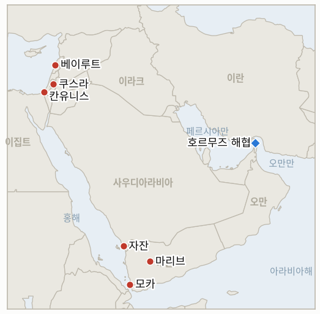

# 중동 일일 브리핑

**2026년 8월 17일**

- **보고 기간:** 약 24시간, 8월 16일 09:00 ~ 8월 17일 09:00 (한국시간)
- **종합 평가:** 월요일의 핵심 흐름은 수사와 집행 모두 강경해지면서도 명확한 무력 충돌로는 번지지 않았다는 점이다. 호르무즈 해협에서는 트럼프 대통령이 해협을 미국 영토로 선언하겠다고 공언해 이란 측의 이례적으로 날 선 반박("패배의 현실")을 불러왔고, 같은 주말 6월 17일 양해각서의 60일 통행료 면제 기간이 공식 통행료 부과도 미이란 간 연장 합의도 없이 만료됐으며, ADNOC 선박이 해협 통항 중 세 번째로 피격됐다. 각각의 확전이 서로를 강화할 뿐 뚜렷한 다음 단계로 수렴되지는 않고 있다. 예멘에서는 정부군이 하루 만에 다섯 개 주에 걸쳐 후티 진지에 181건의 작전을 수행한 것이 원장이 정한 지리적 확산 확증 기준을 충족해, 마리브·하드라마우트·타이즈라는 원래 세 전선을 넘어선 확산이 확증됐다. 반면 사우디아라비아가 자잔 정유시설에 대한 세 차례의 후티 공격에 대해 직접 보복하지 않고 있다는 사실은 리야드가 직접 군사 대응으로 넘어갈지를 시험하던 병행 지표를 반증시켰다. 레바논에서는 이스라엘이 헤즈볼라 지휘관을 한 명 더 사살했다고 밝히며 추가 행동을 다짐했으나 헤즈볼라의 예고된 대응은 순전히 수사적 수준에 머물렀고, 레바논 당국은 규탄 수위를 높였으며, 미 국무부는 헤즈볼라에 책임을 직접 돌리는 이례적으로 노골적인 성명을 냈다. 가자지구에서는 쿠슈너가 그동안 전적으로 중개자를 통해서만 이뤄지던 접촉에서 벗어나 이집트에서 하마스의 칼릴 알하야를 직접 만났고, 월요일 네타냐후 회동을 앞둔 가운데 옐로 라인 사건 이후 IDF가 칸유니스와 누세이라트에서 실시한 타격이 아직 공식 대응으로 명확히 규정되지는 않았다. 그리고 서안지구에서는 이스라엘의 집행이 재진입한 쿠스라 정착민들을 체포 없이 돌려보냈고, 8월 11일 공격이 타이베 폐쇄 조치를 뚫고 발생했다는 새로운 보도가 마을 봉쇄가 실제로 정착민 폭력을 줄였는지를 시험하던 원장의 지표를 반증시켰다. 시장은 주말에서 월요일 개장으로 넘어가는 구간으로 여전히 휴장 상태다. 금요일 종가인 브렌트유 88.52달러와 WTI유 82.40달러, 코스피의 6,977.94 회복 고점(원장 8월 14일 자체의 서술과 달리 사상 최고치는 아니다), 원달러 환율 1,418.3원이 모두 변동 없이 이월된다.

**정정 및 업데이트:**

- 8월 14일 브리핑(8월 16일 브리핑에서도 그대로 이월)은 금요일 코스피 종가 6,977.94를 "사상 최고치"로 서술했다. 이는 5거래일 연속 상승에 따른 회복 고점이었을 뿐 사상 최고치가 아니다. 코스피의 실제 사상 최고 종가는 2월 28일 전쟁 발발로 지수가 폭락하기 전인 2026년 6월 19일에 기록된 9,385.59다. 이번 브리핑부터는 전쟁 이후 회복 고점에 "사상 최고치" 표현을 쓰지 않는다. §3.1 참조.
- 8월 12일 브리핑은 해당 보고 기간 동안 타이베에서 검증된 정착민 공격이 없었다고 밝히며 "후속 취재 부재로 신뢰도가 제한적"이라고 덧붙였다. 이후 보도(미들이스트아이, Drop Site News)에 따르면 실제로는 그 기간 안인 8월 11일 타이베 외곽 자바스 지역에서 정착민들이 침입해 울타리를 해체하려 시도하고 개를 풀어 주민을 쫓는 사건이 있었다. §1.5의 IND-20260811-3 종료 항목 참조.

---

## 1. 무슨 일이 있었나

<figure style="float:right; width:46%; margin:2pt 0 8pt 14pt;">

<figcaption style="font-size:8pt; color:#666; text-align:center; margin-top:3pt; font-style:italic;">주요 논의 지점</figcaption>
</figure>

### 1.1 트럼프, 호르무즈 해협 미국 영토 선언 공언, 이란 반발 강경화, 양해각서 통행료 면제 기간 미해결 상태로 만료

트럼프 대통령은 뉴욕 가든시티의 선거 유세 행사에서 "이란을 완전히 물리친 뒤에는... 호르무즈 해협을 미국 영토로 선언하겠다"고 말했다. 이를 뒷받침할 법적·군사적 근거는 공개되지 않았다([알자지라](https://www.aljazeera.com/news/2026/8/14/trump-says-he-will-declare-strait-of-hormuz-a-us-territory); [더힐](https://thehill.com/homenews/administration/6030671-trump-says-strait-of-hormuz-us-territory/)). 이란의 반응은 주말 동안 강경해졌다. 카젬 가리브아바디 외무차관은 X를 통해 해협이 "이란의 것이었고, 이란의 것이며, 앞으로도 이란의 것으로 남을 것"이라며 "당신들이 패배의 현실을 받아들이지 않는 한" 그렇다고 밝혔고, 골람호세인 모흐세니에제이 사법부 수장은 이란을 "이 중요한 국제 수로의 주인이자 지배자"라 칭했으며, 아라그치 외무장관은 워싱턴과의 협상 재개 여부를 아직 결정하지 않았다고 밝혔다([유로뉴스](https://www.euronews.com/2026/08/15/iran-says-strait-of-hormuz-will-remain-iranian-after-trump-warning); [NBC뉴스](https://www.nbcnews.com/world/iran/iran-rejects-delusions-trump-strait-hormuz-us-territory-rcna592666)). 6월 17일 양해각서의 60일 호르무즈 통행료 면제 기간이 오늘 만료됐으나 공식 통행료 부과 발표도, 명시적 연장 발표도 나오지 않았다. 모하마드 바게르 갈리바프 국회의장은 테헤란이 기간 만료 후 통항료를 부과할 계획이라고 밝혔으며, 익명의 이란 소식통은 로이터에 워싱턴과 연장 협상은 없다며 "연장할 것이 없다"고 말했다([크립토브리핑](https://cryptobriefing.com/iran-qalibaf-strait-hormuz-toll-free-60-days/); [Nation.com.pk](https://www.nation.com.pk/16-Aug-2026/iran-says-hormuz-reopening-hinges-end-us-blockade)). 별도로 지난 금요일 늦게 ADNOC 선박이 호르무즈 통항 중 피격됐다. 약 일주일 사이 세 번째 공격으로, UAE 외교부는 이 패턴을 "강력히 규탄"했으며 대통령실 외교보좌관은 반복되는 표적 공격이 "항행의 자유를 수호"하려는 UAE를 "단념시키지 못할 것"이라고 밝혔다([아샤르크 알아우사트](https://english.aawsat.com/gulf/5307143-adnoc-vessel-attacked-again-strait-hormuz); [OANN](https://www.oann.com/newsroom/uae-condemns-iran-for-attacking-3rd-state-owned-oil-tanker-in-strait-of-hormuz-in-1-week/)). **신뢰도: 높음** — 트럼프의 발언과 이란 측의 다자간 반박(1~2등급, 공식 발언, 다수 매체). **신뢰도: 중상** — 통행료 면제 기간이 미해결 상태로 만료됐다는 점은 첫 통행료 징수도 공식 연장도 이번 보고 기간 마감까지 확인되지 않았다는 데 근거한다. **신뢰도: 높음** — 세 번째 ADNOC 피격(1~2등급, UAE 외교부 성명, 다수 매체).

### 1.2 예멘 전쟁 다섯 개 주로 확산, 사우디의 직접 보복 자제로 원장의 대응 지표 반증

예멘군 대변인 마지드 압둘라 알누자일리 대령은 정부군이 24시간 동안 타이즈, 마리브, 아비안, 달리, 호데이다 등 다섯 개 주에서 후티 진지를 겨냥한 181건의 작전을 수행해 "수십 건의 군사 장비, 차량, 무기고를 파괴했다"고 밝혔다([미들이스트모니터](https://www.middleeastmonitor.com/20260816-yemeni-army-launches-181-operations-against-houthis-in-24-hours/)). 8월 8일경 마리브·하드라마우트·타이즈에 국한돼 시작된 이번 교전 국면에서 정부군의 작전이 아비안·달리·호데이다까지 처음 확대된 것은 원장의 진정한 지리적 확산 확증 기준을 충족한다. **IND-20260814-3은 9월 4일 시한을 거의 3주 앞두고 확증(Confirmed)으로 종료된다.** 밤사이 신규 후티 미사일·드론 공격이 마리브 주거지(부상 4명)와 알마카 외곽·간선도로(사망 4명, 부상 8명)를 강타했고, 후티 측은 타이즈 서쪽 마크바나 전선에서 자체 전투원 4명이 사망했다고 주장했다([알자지라](https://www.aljazeera.com/news/2026/8/16/houthis-launch-new-attacks-on-al-makha-and-marib-as-yemen-conflict-escalates)). 한편 사우디아라비아는 3주에 걸쳐 자잔 정유시설에 대한 후티의 세 차례 공격(7월 25~26일, 8월 9일, 8월 13~14일)을 겪고도 단 한 차례도 검증된 직접 군사 보복을 하지 않았고, 대신 호데이다에 국한된 연합군 작전과 진화 성명, 오만 중재 외교라는 자세를 유지했다. **IND-20260810-3은 8월 17일 자체 시한에 반증(Falsified)으로 종료된다.** **신뢰도: 높음** — 181건 작전 건수와 다중 주(州) 확산(2~3등급, 예멘 군 대변인 공식 발언, 다수 매체). **신뢰도: 높음** — 사우디 비보복 지표의 종료는 FDD 롱워저널, 블룸버그 등 다수 매체의 시한 전체 기간 보도 부재에 근거한다.

### 1.3 이스라엘, 헤즈볼라 지휘관 한 명 더 사살 확인하고 추가 행동 다짐, 헤즈볼라 대응은 수사적 수준에 머물고 워싱턴은 헤즈볼라를 직접 비난

이스라엘은 8월 15일 안사르 공습에서 헤즈볼라 라드완 부대 지휘관을 한 명 더 사살했다고 밝히며, 추가 위협이 있을 경우 "헤즈볼라를 계속 추적하겠다"고 다짐했다([알아라비야](https://english.alarabiya.net/News/middle-east/2026/08/16/israel-vows-to-go-after-hezbollah-as-it-names-another-killed-4); [아샤르크 알아우사트](https://english.aawsat.com/arab-world/5307585-israel-vows-go-after-hezbollah-it-names-another-killed)). 드론 공격과 보복 공습 충돌에 대해 헤즈볼라가 예고한 "합당한 대응"은 지금까지 수사적 수준에 머물러 있다. 이번 보고 기간 어느 매체도 추가 헤즈볼라 공격이나 8월 15~16일 공습 물결과 구분되는 별도의 이스라엘 공습을 보도하지 않았다. 알자지라 자체 정리에 따르면 이번 물결은 안사르·데이르 알자흐라니 외에도 알리 타헤르 능선, 빈트 즈베일, 타이베, 알만수리 등에 걸쳐 있었다([알자지라](https://www.aljazeera.com/news/2026/8/16/why-has-israel-escalated-attacks-in-southern-lebanon-despite-ceasefire)). 레바논 당국은 규탄 수위를 높였다. 아운 대통령은 이번 공습을 "협상 절차에 대한 명확한 메시지"라 불렀고, 살람 총리는 "우리 국민의 안전과 이 땅에서 살 권리는 협상이나 흥정의 대상이 아니다"라고 말했으며, 베리 국회의장은 안사르와 데이르 알자흐라니를 "말살을 목표로 한 전쟁" 속의 "두 건의 학살"이라 불렀다([유로뉴스](https://www.euronews.com/2026/08/15/lebanon-president-says-israeli-strikes-that-killed-11-send-clear-message-on-negotiations); [트리뷴인디아](https://www.tribuneindia.com/news/world/israel-must-halt-this-escalation-lebanon-pm-salam-condemns-israeli-strikes/); [나하르넷](https://www.naharnet.com/stories/en/321861-berri-says-massacres-prove-israel-disregards-all-agreements)). 미 국무부 대변인은 같은 날 이례적으로 노골적인 입장을 밝혀 "헤즈볼라가 이스라엘의 레바논 영토 주둔에 전적인 책임이 있다"며 이 조직을 "레바논의 안전과 안정에 대한 가장 큰 위협"이라 불렀다([나하르넷](https://www.naharnet.com/stories/en/321870-us-official-says-hezbollah-bears-sole-responsibility-for-israel-s-presence-in-lebanon)). 로마 외교 트랙이 잠정 예정한 9월 1일 8차 회담이 이번 확전 이후에도 유지되는지는 이번 보고 기간에 확인되지 않았다. **신뢰도: 높음** — 두 번째 헤즈볼라 지휘관 사살 확인과 레바논 당국 발언(1~2등급, 다수 매체, 공식 발언). **신뢰도: 중간** — 헤즈볼라 대응이 수사적 수준에 머물렀다는 평가는 명시적인 자제 선언이 아니라 추가 공격 보도의 부재에 근거한다.

### 1.4 쿠슈너, 이집트에서 하마스의 알하야와 회동, IDF는 옐로 라인 사건 이후 정밀 타격 실시

재러드 쿠슈너는 엘알라메인에서 압델 파타 엘시시 이집트 대통령을 만났고, 병행 트랙에서는 하마스 정치국장 칼릴 알하야가 카타르·튀르키예 관계자들이 배석한 가운데 하산 라샤드 이집트 정보국장을 만났다. 평화이사회 특사 니콜라이 믈라데노프와 전 영국 총리 토니 블레어가 쿠슈너와 동행했다([타임스오브이스라엘](https://www.timesofisrael.com/kushner-hamas-chief-in-egypt-for-talks-on-advancing-trumps-gaza-plan-idf-continues-strikes/); [알자지라](https://www.aljazeera.com/news/2026/8/16/kushner-meets-hamas-in-egypt-to-push-trumps-gaza-plan); [액시오스](https://www.axios.com/2026/08/16/kushner-hamas-gaza-disarmament-egypt-israel)). 쿠슈너는 하마스의 무장해제 의무가 팔레스타인 과도 기술관료 정부로의 통치권 이양, 국제안정화군 배치 허용 등 "구체적이고 검증 가능한 조치"로 전환돼야 한다고 압박했다. 외교 소식통에 따르면 하마스의 입장은 네타냐후가 계획 조건을 공개적으로 수용하겠다고 밝혀야만 무장해제 이행을 시작하겠다는 것이며, 네타냐후는 지금까지 이를 거부해왔다. 쿠슈너·믈라데노프·블레어는 오늘 이스라엘에서 네타냐후를 만날 예정으로, 이번 방문이 그의 입장을 바꿀지 혹은 공식적인 안보내각 표결로 이어질지를 판가름할 다음 구체적 시험대다. 별도로 8월 15일 옐로 라인 사건 이후 IDF는 그날 저녁 가자지구에서 "공습 물결을 개시"했다고 밝혔고, 일요일에는 칸유니스에서 이슬라믹지하드 조직원을, 누세이라트에서 하마스 조직원을 "테러 공격을 진전시킨" 인물로 규정해 타격했다([Israel National News](https://www.israelnationalnews.com/flashes/691833); [예시바월드](https://www.theyeshivaworld.com/news/israel-news/2585890/southern-front-heats-up-hamas-plants-bomb-under-idf-tank-idf-launches-wave-of-strikes-in-gaza.html)). 어느 매체도 이 타격을 옐로 라인 위반에 대한 예고된 대응으로 명시적으로 규정하지 않아, 원장이 시험하는 작전 대응 기준을 충족하는지는 아직 미확정이다. **신뢰도: 높음** — 쿠슈너·시시·알하야 회동과 하마스의 조건부 입장(1~2등급, 다수 매체, 외교 소식통). **신뢰도: 중간** — 일요일 가자지구 타격이 옐로 라인 사건에 대한 공식 대응인지는 이스라엘 측의 명시적 연계 발언이 없어 불확실하다.

### 1.5 쿠스라 재진입 정착민 체포 없이 귀환 조치, 타이베 폐쇄 지표는 새 보도로 반증

쿠스라에서는 토요일 약 15명의 정착민이 IDF의 군사 폐쇄 구역 명령에도 불구하고 재진입했다. 병력이 도착해 명령을 낭독하자 정착민들은 떠났으나, 이스라엘 경찰은 주민들에게 IDF가 제공한 괴롭힘 용의자 사진이 "체포를 뒷받침할 만큼 구체적이지 않다"고 밝혔고, 주민들은 IDF가 "여전히 일부 주택으로의 귀환을 허용하지 않는다"고 전했다([타임스오브이스라엘 라이브블로그](https://www.timesofisrael.com/liveblog-august-16-2026/); [예루살렘포스트](https://www.jpost.com/israel-news/defense-news/article-905583)). 교황 레오 14세는 일요일 쿠스라를 구체적으로 언급하며 서안지구 폭력 종식을 공개 촉구했다([타임스오브이스라엘](https://www.timesofisrael.com/pope-calls-to-end-violence-against-west-bank-palestinians-as-settler-attacks-surge/)). 별도로 비거주자에게 타이베 마을을 폐쇄한 조치가 정착민 공격을 줄였는지를 시험하던 원장의 지표가 8월 18일 자체 시한을 하루 앞두고 종료된다. 미들이스트아이와 Drop Site News에 따르면 폐쇄 조치가 시행된 뒤인 8월 11일 정착민들이 타이베 외곽 자바스 지역에 침입해 울타리를 해체하려 시도하고 개를 풀어 주민을 쫓았다. 두 매체 모두 폐쇄 조치의 효과가 제한적이라고 서술했으며, 특히 Drop Site는 이 조치가 오히려 정착민이 아니라 사건을 기록하고 억제할 수 있었던 외부 감시자들을 배제하는 결과를 낳았다고 지적했다. **IND-20260811-3은 반증(Falsified)으로 종료된다.** **신뢰도: 높음** — 쿠스라 재진입과 무체포 결과(1~2등급, 현장 라이브블로그·다수 매체). **신뢰도: 높음** — 타이베 지표 종료(다수 매체 보도, 다만 이 사건이 발생 당일 포착되지 못한 경위는 위 정정 항목 참조).

---

## 2. 심층 분석: 유인과 동기

### 2.1 트럼프는 왜 이를 뒷받침할 법적·군사적 근거가 없는 상황에서 지금 호르무즈 해협을 미국 영토로 선언하겠다고 공언했는가, 봉쇄의 경제적 압박이 스스로 말하게 두는 대신?

이 발언은 양해각서 통행료 면제 기간이 같은 주말 만료되는 시점에 맞춰진 수사적 확전으로 기능하기 때문이다. 이란 협상팀이 미국이 중재한 합의의 연장을 공개적으로 거부하는 외교적으로 어색한 순간을, 어느 미 행정부도 두 주권 연안국 사이의 해협을 병합할 공개된 법적 경로를 갖고 있지 않다는 사실과 무관하게 협상 정체가 아니라 미국의 결의 표명으로 재구성할 수 있게 해준다. 이 발언은 트럼프에게 국내적으로 아무런 대가가 없다. 최대주의적 프레이밍을 받아들이는 지지층에 부합하기 때문이다. 반면 이란에는 강경파가 요구하는 계속된 봉쇄 집행을 정당화할 명분을 그대로 안겨주면서도 자국 입장을 누그러뜨릴 필요는 없게 해준다.

### 2.2 이란은 왜 트럼프의 영토 주장에 봉쇄 집행을 더 강화하는 대신 주권 반박으로 대응했는가, 양해각서 통행료 면제 기간이 같은 주에 만료되는 상황에서도?

이란 지도부는 워싱턴의 압박에 대한 선을 지키기 위해 강경파 레자에이를 최고국가안보회의 사무총장에 막 임명한 만큼, 스스로 도발로 지목될 수 있는 새로운 확전 조치를 취하기보다 트럼프 자신의 수사가 계속된 봉쇄 집행의 명분을 대신 제공하도록 두는 편이 더 유리하기 때문이다. 새로운 무력 조치 대신 주권 언어("패배의 현실")로 대응하는 것은 테헤란이 먼저 확전을 시작한 것이 아니라 미국의 공격성에 대응하고 있다는 선호하는 프레이밍을 유지시켜준다. 한편 더 조용히 병행되는 오만 해상교통지도 트랙은 트럼프의 수사가 겨냥한 채널이 아니라는 바로 그 이유로 이란이 계속 열어둘 수 있는 작동 중인 외교 채널로 남는다.

### 2.3 예멘 정부는 왜 이미 확보한 마리브·하드라마우트 전선에 병력을 집중하는 대신 다섯 개 주로 동시에 공세를 확대했는가?

기존 마리브·하드라마우트 전선에서만 정부의 압박을 흡수하는 후티는 그곳에 병력을 집중할 수 있는 반면, 정부군의 작전이 아비안·달리·호데이다까지 동시에 확대되면 같은 병력으로 더 넓은 전선을 방어해야 하는 부담을 후티에 지운다. 정부군 자체의 과잉 확장 위험을 감수하는 대신, 홍해 해상 작전과 자잔에 대한 미보복 공격으로 이미 늘어난 후티의 역량이 모든 전선을 동시에 지탱하지는 못할 것이라는 데 베팅하는 것이다. 유엔 특사 그룬드베리가 안보리에 예멘의 내전 위험이 최고조라고 경고한 직후라는 시점 또한, 갱신된 국제 중재 압박이 현 전선을 고착시키기 전에 정부가 새로운 현장 사실을 확립하려는 움직임으로 읽힌다.

### 2.4 이스라엘은 왜 여러 주 동안의 무집행 끝에 이번에는 재진입한 정착민들에 대해 쿠스라 군사 폐쇄 구역을 집행하면서도 여전히 아무도 체포하지 않았는가?

정착민을 체포 없이 돌려보내는 것은 이스라엘 당국이 누적된 국제적 압박, 즉 처음 포위한 이들을 "이스라엘 테러리스트"라 부른 미국 대사의 발언에 이어 이번 일요일 교황 레오 14세의 촉구로 이어진 압박에 가시적으로 응답하게 해주는 동시에, 정착민을 형사 기소하는 정치적으로 더 큰 대가를 치르는 조치는 피하게 해준다. 그러한 기소는 카츠 국방장관의 IDF에서 경찰로의 집행 이관에 이미 불만인 같은 연립 파트너들로부터 더 강한 정치적 반발을 부를 것이다. 경찰이 지적한 구체성 부족한 사진은 아무도 기소하지 않겠다는 적극적인 정치적 선택을 할 필요 없이 즉시 사용할 수 있는 행정적 사유로 기능한다.

### 2.5 쿠슈너는 왜 그동안 전적으로 카타르와 이집트 중개자를 통해서만 이뤄지던 접촉에서 벗어나 하마스의 칼릴 알하야를 이집트에서 직접 만났는가?

네타냐후가 8월 9일 평화이사회의 무장해제 선행 프레임워크를 거부한 이후 그의 입장이 강경해진 상황에서, 여전히 이집트와 카타르가 물리적으로 주선하고 중개하는 형태이긴 하지만 쿠슈너와 하마스 사이의 직접 채널은 워싱턴이 네타냐후로부터 먼저 양보를 끌어내지 않고도 검증 가능한 무장해제 조치에 대한 하마스의 실제 유연성을 시험할 수 있게 해준다. 기존 중개 구조는 미국과 하마스 간 어떤 접촉에도 그 양보를 전제조건으로 삼았었다. 월요일 네타냐후 회동에 하마스의 입장을 간접적이 아니라 직접 파악한 상태로 들어가는 것 또한, 쿠슈너가 하마스가 무엇을 받아들이고 무엇을 받아들이지 않을지 네타냐후에게 알려줄 수 있는 입지를 강화해, 다음 양보의 부담을 예루살렘 쪽으로 넘긴다.

---

## 3. 한국에 대한 정책적 함의

### 3.1 익스포저 현황

| 항목 | 현재 수치 | 출처 |
| --- | --- | --- |
| 원유 수입 중 중동 비중 | 48.5% (2026년 5~7월), 1년 전 69.1%에서 하락; 비중동 비중이 사상 처음 50%를 상회 | KNOC, 아시아경제 경유; `korea-exposure.md` |
| 7~8월 원유 조달 | 전년 동기 물량의 110% 이상 확보(산업부, 7월 21일); 비축유 스와프 8월까지 연장, 현재까지 약 2,100만 배럴 스와프 | 산업부, 헤럴드경제·한경 경유; `korea-exposure.md` |
| 9월 원유 조달 | 90% 이상 확보(산업부, 7월 21일) | 산업부, 헤럴드경제 경유; `korea-exposure.md` |
| 홍해 우회 항로 | 한국행 원유 화물이 얀부·홍해 우회로를 계속 이용 중; 한국을 포함한 아시아 매수처로의 얀부 수출량이 1년 전 하루 100만 배럴 미만에서 약 400만 배럴로 급증 | 로이즈리스트 인텔리전스; `korea-exposure.md` |
| 비축유 보유 여력 | 실제 소비 기준 약 26일분(추정); 스와프는 즉시 가동 대기 상태이나 대규모 실행은 미검증 | CSIS; 산업부 7월 27일 |
| 정유사 사우디 지분 익스포저 | S-Oil(사우디 아람코 과반 지분 약 63%), HD현대오일뱅크(아람코 지분 약 17%) | 공시 자료; `korea-exposure.md` |
| 브렌트유/WTI유 | 주말·개장 전 휴장(정산 없음); 금요일 종가 88.52달러/82.40달러가 이월되며 모두 주간 5% 이상 상승, 봉쇄·고립 발언이 배경 | CNBC(금요일 정산가) |
| 코스피/원달러 환율 | 주말·개장 전 휴장; 금요일 종가 6,977.94(5거래일 연속 상승에 따른 회복 고점이나 6월 19일 기록된 사상 최고치 9,385.59에는 크게 못 미침)와 환율 1,418.3원이 이월 | 비즈니스코리아, 코리아타임스, 뉴시스(금요일 종가) |
| 호르무즈 통항량 | Kpler는 8월 13일 통항을 13척(전일 대비 44% 증가)으로 집계; Windward는 별도로 8월 14일을 13척(입항 4척, 출항 9척)으로 집계했으나 자체 8월 13일 수치는 3척으로, 원장이 이전에도 지적한 두 기관 간 계산 기준의 뚜렷한 불일치가 재확인됨; 주간 호르무즈 통항량은 전쟁 이전 평균의 약 17%에 머묾 | Kpler(X), 미들이스트아이; Windward Daily Intelligence |

### 3.2 사안별 함의

**트럼프의 호르무즈 영토 발언과 양해각서 통행료 면제 기간의 미해결 만료는 오늘 가장 직접적인 한국 관련 신호다. 이란이 실제로 통항료 징수에 나설지, 아니면 모호한 상태를 그대로 방치할지가 한국 정유사가 걸프 화물에 새로운 직접 비용을 부담하게 될지, 아니면 기존의 봉쇄·우회로 병행 체제를 그대로 유지할지를 가른다.** 신규 IND-20260817-2(시한 8월 31일)는 트럼프의 공언이 구체적인 미국 정책 조치로 전환될지, 수사에 그칠지를 검증한다. IND-20260814-1(시한 8월 24일)은 오늘의 만료로 이제 현실화된 통행료 문제 자체를 계속 추적한다.

**예멘 전쟁의 다섯 개 주 확산 확증과 사우디아라비아의 직접 보복 자제 확증은 한국의 얀부 홍해 우회로가 안정되기는커녕 교전 당사자 목록이 계속 늘어나는 지역을 통과하고 있음을 재확인시키는 동시에, 리야드의 흡수·복구 자세가 적어도 현재로서는 한국 화물이 함께 의존하는 더 넓은 사우디 에너지 수송로를 직접적인 교전에서 벗어나게 유지하고 있음을 보여준다.** 신규 IND-20260817-1(시한 8월 31일)은 확증된 확산이 갱신된 유엔 중재를 이끌어낼지, 아니면 전쟁이 억제되지 않고 계속 확대될지를 검증한다. IND-20260813-2(시한 9월 2일)는 구조대를 겨냥한 후티의 이중 타격 전술 재발 여부를 계속 추적한다.

**레바논 전선이 무력 충돌에서 말 대 말의 공방으로 옮겨가고 미 국무부가 헤즈볼라에 직접 책임을 돌리는 이례적으로 노골적인 성명을 낸 것은 한국 시장에 직접적인 익스포저는 없으나, 무장해제 다툼에서 워싱턴 자신이 어느 편에 서 있는지를 보여주는 지금까지 가장 명확한 신호다.** IND-20260816-1(시한 8월 29일)은 8월 15일 충돌이 활성 전투를 재개시킬지를 계속 검증하며, IND-20260807-2(시한 9월 1일)는 로마 트랙의 상태를 계속 추적한다. 이제 그 자체의 다음 시험대는 미확인 상태인 9월 1일 회담이다.

**쿠슈너의 하마스 직접 채널과 아직 명확히 규정되지 않은 가자지구 타격은 한국 시장에 직접적인 익스포저는 없으나, 무장해제 선행 프레임워크가 또 한 차례의 발언 공방이 아니라 실제 이스라엘 측 결정으로 이어지는지를 지역 리스크 가격 형성에 의미 있는 시험대로 계속 유지시킨다.** IND-20260814-2(시한 8월 21일)는 쿠슈너 방문의 이스라엘 구간이 네타냐후의 입장을 바꿀지를 계속 추적하며, IND-20260812-4(시한 8월 26일)는 안보내각 표결 여부를 계속 추적한다. 오늘의 네타냐후 회동이 가장 가까운 시험대다.

**쿠스라 집행 결과와 타이베 폐쇄 지표의 반증은 모두 카츠 장관의 IDF에서 경찰로의 이관 이후 원장이 추적해온 동일한 근본 패턴을 확증한다. 즉 근본적인 집행 공백을 해소하지 않은 채 정착민을 대가 없이 돌려보내는 행정적 절반의 조치라는 패턴이다.** IND-20260813-3(시한 8월 27일)은 쿠스라 포위가 실제로 해소될지를 계속 추적하며, IND-20260815-2(시한 9월 12일)는 더 넓은 범위의 집행 이관이 측정 가능한 사건 감소로 이어지는지를 계속 추적한다.

**검증 가능한 지표:**

- **IND-20260817-1** — 마리브·하드라마우트·타이즈를 넘어선 예멘 전쟁의 확증된 확산이 갱신된 국제 또는 유엔 중재를 이끌어낼지, 아니면 전쟁이 그런 대응 없이 계속 확대될지를 검증한다. 2026년 8월 31일까지 확증된 확산에 명시적으로 대응하는 공식 유엔 주도 또는 제3자 중재 이니셔티브가 있으면 확전 이후 국제 중재가 뒤따랐음이 확증된다. 같은 시한까지 그런 이니셔티브가 없고 지리적 또는 병력 확대가 계속되면 이는 상응하는 외교적 대응 없이 계속 확대되는 전쟁으로 반증된다.
- **IND-20260817-2** — 호르무즈 해협을 미국 영토로 만들겠다는 트럼프의 공언이 구체적인 미국 정책 또는 군사 조치로 전환될지, 아니면 수사에 그칠지를 검증한다. 2026년 8월 31일까지 이 영토 주장과 명시적으로 연계된 공식 미국 선언, 의회 통보, 또는 공개된 미군 전력 배치 변화가 있으면 이 발언이 제도적 후속 조치로 이어졌음이 확증된다. 같은 시한까지 그런 조치가 없으면 이는 정책적 실체 없는 수사적 확전으로 반증된다.

---

## 4. 관찰 목록

- **6월 17일 양해각서의 통행료 면제 기간이 이제 만료된 가운데 실제 이란의 통행료 부과로 이어질지, 아니면 조용히 연장될지** (IND-20260814-1, 시한 8월 24일).
- **호르무즈를 미국 영토로 만들겠다는 트럼프의 공언이 구체적인 정책 조치로 이어질지** (IND-20260817-2, 시한 8월 31일).
- **예멘의 확증된 다섯 개 주 확산이 갱신된 국제 중재를 이끌어낼지** (IND-20260817-1, 시한 8월 31일).
- **8월 15일 헤즈볼라-이스라엘 충돌이 추가 라운드로 이어질지, 아니면 양측이 휴전 이후 균형 상태로 물러날지** (IND-20260816-1, 시한 8월 29일).
- **로마 트랙이 잠정 예정한 9월 1일 8차 회담이 8월 15~16일 확전 이후에도 예정대로 진행될지** (IND-20260807-2, 시한 9월 1일).
- **가자지구 옐로 라인 사건들이 공식적인 IDF 작전 대응을 촉발할지, 아니면 고립된 사건으로 남을지** (IND-20260816-2, 시한 8월 30일).
- **쿠슈너 방문의 이스라엘 구간이 하마스 무장해제에 대한 네타냐후의 입장을 바꿀지** (IND-20260814-2, 시한 8월 21일).
- **가자지구 무장해제 선행 프레임워크가 어떤 형태로든 이스라엘 안보내각의 공식 표결에 이를지** (IND-20260812-4, 시한 8월 26일).
- **베센트가 예고한 전례 없는 이란 경제 고립 조치가 구체적인 새 조치와 함께 실현될지** (IND-20260815-1, 시한 8월 22일).
- **이란의 강경파 최고국가안보회의 개편이 호르무즈 외교를 계속 정체시킬지, 오만 트랙이 여전히 진전되는 가운데 수사에 그칠지** (IND-20260811-1, 시한 8월 18일).
- **서안지구 IDF에서 경찰로의 집행 이관이 정착민 폭력을 줄일지, 그대로 유지될지** (IND-20260815-2, 시한 9월 12일).
- **이란의 경고에도 불구하고 시리아가 레바논 헤즈볼라에 대해 움직일지, 아니면 대립이 수사적 수준에 머물지** (IND-20260815-3, 시한 9월 15일).
- **쿠스라 포위가 실제로 해소될지, 반증 쪽으로 더 기울고 있다** (IND-20260813-3, 시한 8월 27일).
- **구조대를 겨냥한 후티의 이중 타격 전술이 재발할지, 일회성 확전으로 그칠지** (IND-20260813-2, 시한 9월 2일).
- **IEA의 재고 고갈 경고가 추가적인 공조 정책 대응이나 지속적인 가격 변동으로 이어질지** (IND-20260813-1, 시한 9월 2일).
- **이행 일정을 담은 서명된 이란-오만 호르무즈 공동성명이 나올지, 아니면 해상교통지도 합의가 다시 서명 직전에서 정체될지** (IND-20260816-3, 시한 9월 5일).
- **미 해군의 무력 봉쇄 집행이 이란의 군사적 대응을 촉발할지** (IND-20260812-1, 시한 8월 26일).
- **시리아의 핵물질 파일이 IAEA와의 최종 합의 및 검증된 제거로 전환될지** (IND-20260812-2, 시한 9월 11일).
- **캐롤라인 베젠기호 기름 유출이 샐비지 작업 시작 이후 억제될지.**
- **케슘섬 폭발이 실제 공격으로 확인될지, 오경보로 결론 날지.**

---

## 5. 출처 신뢰도 요약

| 주장 | 출처 | 신뢰도 |
| --- | --- | --- |
| 트럼프, 호르무즈 해협을 미국 영토로 선언하겠다고 공언 | 알자지라, 더힐(1~2등급, 공식 유세 발언, 다수 매체) | 높음 |
| 가리브아바디·모흐세니에제이·아라그치의 반박 발언 | 유로뉴스, NBC뉴스(1~2등급, 공식 부처 발언, 다수 매체) | 높음 |
| 6월 17일 양해각서 통행료 면제 기간이 통행료 부과나 연장 없이 만료 | 크립토브리핑, Nation.com.pk, 갈리바프와 익명 이란 소식통 인용(2~3등급, "연장할 것이 없다" 발언은 단일 소식통) | 중상 |
| ADNOC 선박, 호르무즈 통항 중 세 번째 피격 | 아샤르크 알아우사트, OANN(1~2등급, UAE 외교부 성명, 다수 매체) | 높음 |
| 예멘 정부, 다섯 개 주에 걸쳐 후티 진지에 181건 작전 기록 | 미들이스트모니터, 알누자일리 대령 인용(2~3등급, 정부 대변인 공식 발언) | 높음 |
| 밤사이 마리브·알마카 후티 미사일·드론 공격 | 알자지라(1~2등급, 예멘 정부 소식통, 다수 매체) | 높음 |
| 사우디아라비아, 자잔 공격에 직접 보복 자제 지속, IND-20260810-3 종료 근거 | FDD 롱워저널, 블룸버그, 비즈니스스탠더드, 미들이스트모니터(1~3등급, 다수 추적기관의 보도 부재) | 높음 |
| 이스라엘, 헤즈볼라 라드완 부대 지휘관 한 명 더 사살 확인, 추가 행동 다짐 | 알아라비야, 아샤르크 알아우사트(1~2등급, 공식 발언, 다수 매체) | 높음 |
| 아운·살람·베리의 규탄 발언; 헤즈볼라를 비난한 미 국무부 성명 | 유로뉴스, 트리뷴인디아, 나하르넷(1~2등급, 공식 발언, 다수 매체) | 높음 |
| 쿠슈너, 이집트에서 시시·알하야 회동; 하마스, 무장해제를 네타냐후의 공개 수용에 조건부로 제시 | 타임스오브이스라엘, 알자지라, 액시오스(1~2등급, 다수 매체, 외교 소식통) | 높음 |
| 옐로 라인 사건 이후 칸유니스·누세이라트 IDF 타격 | Israel National News, 예시바월드(2~3등급, IDF 성명, 옐로 라인 연계에 대한 독립 확인 제한적) | 중간 |
| 쿠스라 정착민, 체포 없이 귀환 조치; 일부 주민 여전히 귀가 금지 | 타임스오브이스라엘 라이브블로그, 예루살렘포스트(1~2등급, 현장 라이브블로그 보도) | 높음 |
| 8월 11일 타이베 정착민 침입 사건, IND-20260811-3 종료 근거 | 미들이스트아이, Drop Site News(2~3등급, 현지·인권감시단 취재) | 높음 |
| 코스피 6,977.94 종가는 사상 최고치가 아니라 회복 고점 | TradingEconomics, 비즈니스코리아, 코리아타임스(1~2등급, 다수 금융 매체) | 높음 |
