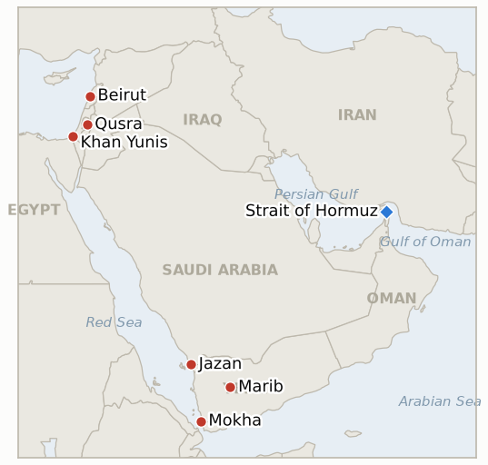

# Middle East Daily Briefing

**August 17, 2026**

- **Reporting window:** ~24 hours, August 16, 09:00 to August 17, 09:00 KST
- **Overall assessment:** Monday's throughline was rhetoric and enforcement both hardening without a clean kinetic break. On Hormuz, President Trump vowed to declare the strait US territory, drawing an unusually sharp round of Iranian rebuttals invoking "the reality of defeat," the same weekend the June 17 MOU's 60 day toll free shipping window lapsed without either a formal Iranian toll schedule or a US-Iran extension, and a third ADNOC vessel was struck transiting the strait; each escalation reinforces the others without resolving into a single clear next step. In Yemen, the government's 181 operations against Houthi positions across five governorates in a single day meets this ledger's bar for confirmed geographic spread beyond the original Marib-Hadramaut-Taiz fronts, even as Saudi Arabia's continued restraint from any direct retaliation for three separate Jazan refinery strikes falsifies the parallel indicator testing whether Riyadh would cross into direct military response. In Lebanon, Israel named a second Hezbollah commander killed and vowed further action while Hezbollah's promised response stayed purely rhetorical, Lebanese officials escalated their condemnation, and an unusually blunt US State Department statement placed blame squarely on Hezbollah. In Gaza, Kushner met Hamas's Khalil al-Hayya directly in Egypt, an unusual departure from routing contact solely through intermediaries, ahead of a Monday Netanyahu meeting, while the IDF's post-Yellow-Line strikes in Khan Yunis and Nuseirat have not been explicitly framed as a formal response. And in the West Bank, Israeli enforcement turned away re-entering Qusra settlers without arrests, while new reporting that an August 11 attack breached the Taybeh closure falsifies this ledger's test of whether sealing the village actually reduced settler violence. Markets remain closed for the weekend transition into Monday's open; Friday's settles, Brent $88.52 and WTI $82.40, KOSPI's 6,977.94 recovery high (not, contrary to this ledger's own August 14 framing, an all-time record), and the won's 1,418.3, all carry forward unchanged.

**Corrections and updates:**

- The August 14 brief (carried forward unchanged in August 16's) described Friday's 6,977.94 KOSPI close as a "record." It was a five-session recovery high, not an all-time record: KOSPI's all-time closing high remains 9,385.59, set June 19, 2026, before the February 28 war outbreak crashed the index. This and future briefs drop the "record" framing for post-crash recovery highs; see §3.1.
- The August 12 brief found no verified settler attack on Taybeh in that day's window, noting "the absence of dedicated follow-up coverage limits confidence either way." Subsequent reporting (Middle East Eye, Drop Site News) documents a settler incursion into Taybeh's Jabas outskirts on August 11, an attempted fence dismantling and a dog release against residents, that in fact occurred inside that window; see IND-20260811-3's resolution in §1.5.

---

## 1. What Happened

<figure style="float:right; width:46%; margin:2pt 0 8pt 14pt;">

<figcaption style="font-size:8pt; color:#666; text-align:center; margin-top:3pt; font-style:italic;">Major places of discussion</figcaption>
</figure>

### 1.1 Trump Vows to Declare the Strait of Hormuz US Territory as Iran's Rebuke Hardens and the MOU's Toll Free Window Lapses Unresolved

President Trump told a campaign event in Garden City, New York that "after we finish defeating Iran...I'll be declaring the Hormuz Strait a territory of the United States," a claim with no disclosed legal or military mechanism behind it ([Al Jazeera](https://www.aljazeera.com/news/2026/8/14/trump-says-he-will-declare-strait-of-hormuz-a-us-territory); [The Hill](https://thehill.com/homenews/administration/6030671-trump-says-strait-of-hormuz-us-territory/)). Iran's response hardened across the weekend: Deputy Foreign Minister Kazem Gharibabadi said on X that the strait "has been Iranian, is Iranian, and will remain Iranian...as long as you do not accept the reality of defeat," judiciary head Gholam-Hossein Mohseni-Ejei called Iran "the owner and ruler of this important global waterway," and Foreign Minister Araghchi said Tehran has not decided whether to resume negotiations with Washington ([Euronews](https://www.euronews.com/2026/08/15/iran-says-strait-of-hormuz-will-remain-iranian-after-trump-warning); [NBC News](https://www.nbcnews.com/world/iran/iran-rejects-delusions-trump-strait-hormuz-us-territory-rcna592666)). The June 17 memorandum's 60 day toll free Hormuz shipping window lapses today with neither a formal Iranian toll schedule nor an explicit extension announced; Parliament Speaker Mohammad Bagher Qalibaf has said Tehran intends to charge transit fees once the window closes, and an Iranian source told Reuters there are no talks with Washington on extending the arrangement, calling it "nothing to extend" ([CryptoBriefing](https://cryptobriefing.com/iran-qalibaf-strait-hormuz-toll-free-60-days/); [Nation.com.pk](https://www.nation.com.pk/16-Aug-2026/iran-says-hormuz-reopening-hinges-end-us-blockade)). Separately, a third ADNOC vessel came under attack transiting Hormuz late Friday, the third such strike in roughly a week, with the UAE's Ministry of Foreign Affairs "strongly condemning" the pattern and a presidential diplomatic adviser saying repeated targeting "will not deter" the UAE from "safeguard[ing] their rights to freedom of navigation" ([Asharq Al-Awsat](https://english.aawsat.com/gulf/5307143-adnoc-vessel-attacked-again-strait-hormuz); [OANN](https://www.oann.com/newsroom/uae-condemns-iran-for-attacking-3rd-state-owned-oil-tanker-in-strait-of-hormuz-in-1-week/)). **Confidence: High** on Trump's statement and Iran's multi-official rebuke (Tier 1-2, on-record quotes, multi-outlet); **Medium-High** on the toll-free window's lapse without resolution, since no outlet has yet confirmed either a first toll collection or a formal extension as of this window's close; **High** on the third ADNOC strike (Tier 1-2, UAE MOFA statement, multi-outlet).

### 1.2 Yemen's War Spreads to Five Governorates as Saudi Arabia's Restraint From Direct Retaliation Falsifies the Ledger's Response Indicator

Yemeni military spokesman Col. Majid Abdullah al-Nuzaili said government forces conducted 181 operations against Houthi positions in a single 24 hour period, spanning Taiz, Marib, Abyan, Al-Dhalea and Al-Hudaydah governorates, destroying "dozens of military equipment, vehicles, and weapons depots" ([Middle East Monitor](https://www.middleeastmonitor.com/20260816-yemeni-army-launches-181-operations-against-houthis-in-24-hours/)). Since this round of fighting began around August 8 confined to Marib, Hadramaut and Taiz, government operations reaching Abyan, Al-Dhalea and Al-Hudaydah for the first time meet this ledger's bar for genuine geographic spread: **IND-20260814-3 resolves Confirmed**, nearly three weeks ahead of its September 4 deadline. Overnight, fresh Houthi missile and drone strikes hit residential Marib (four wounded) and al-Makha's outskirts and main road (four killed, eight wounded), while the Houthis claimed four of their own fighters killed on the Maqbanah front west of Taiz ([Al Jazeera](https://www.aljazeera.com/news/2026/8/16/houthis-launch-new-attacks-on-al-makha-and-marib-as-yemen-conflict-escalates)). Separately, with Saudi Arabia having absorbed three separate Houthi strikes on its Jazan refinery over three weeks (July 25-26, August 9, August 13-14) without a single reported direct military retaliation, maintaining instead its Hodeidah-confined, coalition-fronted posture of firefighting statements and Oman-mediated diplomacy: **IND-20260810-3 resolves Falsified** at its own August 17 deadline. **Confidence: High** on the 181-operations count and the multi-governorate spread (Tier 1-2, on-record Yemeni military spokesman, multi-outlet); **High** on the Saudi non-retaliation resolution, based on the absence of any reported strike across FDD Long War Journal, Bloomberg and multi-outlet coverage through the full deadline window.

### 1.3 Israel Names a Second Hezbollah Commander Killed and Vows Further Action as Hezbollah's Response Stays Rhetorical and Washington Bluntly Blames the Group

Israel disclosed that its August 15 strike on Ansar also killed a second Hezbollah Radwan Force figure, and vowed to "go after Hezbollah" again if further threatened ([Al Arabiya](https://english.alarabiya.net/News/middle-east/2026/08/16/israel-vows-to-go-after-hezbollah-as-it-names-another-killed-4); [Asharq Al-Awsat](https://english.aawsat.com/arab-world/5307585-israel-vows-go-after-hezbollah-it-names-another-killed)). Hezbollah's promised "appropriate response" to the drone strike and retaliation exchange has so far stayed rhetorical rather than kinetic; no outlet in this window reports a further Hezbollah attack or an Israeli strike distinct from the August 15-16 wave, which Al Jazeera's own roundup places across Ali al-Taher ridge, Bint Jbeil, Taybeh and al-Mansouri in addition to Ansar and Deir al-Zahrani ([Al Jazeera](https://www.aljazeera.com/news/2026/8/16/why-has-israel-escalated-attacks-in-southern-lebanon-despite-ceasefire)). Lebanese officials escalated their condemnation: President Aoun called the strikes a "clear message on the negotiations process," Prime Minister Salam said "the security of our people and their right to life on their land are not subject to negotiation or bargaining," and Parliament Speaker Berri called Ansar and Deir al-Zahrani "two massacres" in a "war aimed at extermination" ([Euronews](https://www.euronews.com/2026/08/15/lebanon-president-says-israeli-strikes-that-killed-11-send-clear-message-on-negotiations); [Tribune India](https://www.tribuneindia.com/news/world/israel-must-halt-this-escalation-lebanon-pm-salam-condemns-israeli-strikes/); [Naharnet](https://www.naharnet.com/stories/en/321861-berri-says-massacres-prove-israel-disregards-all-agreements)). A US State Department spokesperson took an unusually blunt line the same day, saying "Hezbollah bears sole responsibility for Israel's presence on Lebanese soil" and calling the group "the biggest threat to the safety and stability of Lebanon" ([Naharnet](https://www.naharnet.com/stories/en/321870-us-official-says-hezbollah-bears-sole-responsibility-for-israel-s-presence-in-lebanon)). Whether the Rome diplomatic track's provisionally scheduled September 1 eighth round still stands after this escalation could not be confirmed in this window. **Confidence: High** on the second Hezbollah commander's naming and Lebanese officials' statements (Tier 1-2, multi-outlet, on-record quotes); **Medium** on the assessment that Hezbollah's response has stayed rhetorical only, based on the absence of reporting of a further attack rather than an explicit stand-down statement.

### 1.4 Kushner Meets Hamas's Al Hayya in Egypt as the IDF Conducts Precision Strikes Following the Yellow Line Incidents

Jared Kushner met Egyptian President Abdel Fattah al-Sisi in El Alamein, while in a parallel track Hamas political leader Khalil al-Hayya met Egyptian intelligence chief Hassan Rashad with Qatari and Turkish officials present; Board of Peace envoy Nickolay Mladenov and former UK Prime Minister Tony Blair joined Kushner ([Times of Israel](https://www.timesofisrael.com/kushner-hamas-chief-in-egypt-for-talks-on-advancing-trumps-gaza-plan-idf-continues-strikes/); [Al Jazeera](https://www.aljazeera.com/news/2026/8/16/kushner-meets-hamas-in-egypt-to-push-trumps-gaza-plan); [Axios](https://www.axios.com/2026/08/16/kushner-hamas-gaza-disarmament-egypt-israel)). Kushner pressed for Hamas's disarmament obligations to convert into "concrete, verifiable steps," including transferring governing authority to a Palestinian technocratic government and allowing the International Stabilization Force to deploy; Hamas's position, per diplomatic sources, is that it will only begin implementing disarmament once Netanyahu publicly commits to the plan's terms, which he has so far declined to do. Kushner, Mladenov and Blair are scheduled to meet Netanyahu in Israel today, the next concrete test of whether the visit shifts his position or a formal Security Cabinet vote follows. Separately, following the August 15 Yellow Line incidents, the IDF said it "launched a wave of strikes" in Gaza that evening, and on Sunday struck an Islamic Jihad operative in Khan Yunis and a Hamas operative in Nuseirat, described as individuals "who advanced terror attacks" ([Israel National News](https://www.israelnationalnews.com/flashes/691833); [The Yeshiva World](https://www.theyeshivaworld.com/news/israel-news/2585890/southern-front-heats-up-hamas-plants-bomb-under-idf-tank-idf-launches-wave-of-strikes-in-gaza.html)); no outlet has yet framed these strikes explicitly as the promised response to the Yellow Line breach, so whether they satisfy this ledger's operational-response test remains open. **Confidence: High** on the Kushner-Sisi-al-Hayya meetings and Hamas's conditioning statement (Tier 1-2, multi-outlet); **Medium** on whether Sunday's Gaza strikes constitute a formal response to the Yellow Line incidents specifically, since no Israeli statement has drawn that link.

### 1.5 Qusra Enforcement Turns Away Re Entering Settlers Without Arrests as New Reporting Falsifies the Taybeh Closure Indicator

In Qusra, roughly 15 settlers re-entered the area Saturday despite the IDF's closed military zone order; troops arrived, read the order, and the settlers left, but Israeli police told residents that photos the IDF supplied of harassment suspects "lack enough specificity to support arrests," and residents said the IDF is "still not allowing them back to some homes" ([Times of Israel liveblog](https://www.timesofisrael.com/liveblog-august-16-2026/); [Jerusalem Post](https://www.jpost.com/israel-news/defense-news/article-905583)). Pope Leo XIV publicly called Sunday for an end to violence against West Bank Palestinians, explicitly citing Qusra ([Times of Israel](https://www.timesofisrael.com/pope-calls-to-end-violence-against-west-bank-palestinians-as-settler-attacks-surge/)). Separately, this ledger's indicator testing whether sealing Taybeh village to non-residents reduced settler attacks resolves ahead of its own August 18 deadline: Middle East Eye and Drop Site News report that on August 11, after the closure took effect, settlers entered the Jabas area on Taybeh's outskirts, attempted to dismantle a fence, and released dogs to chase residents, with both outlets describing the order's effect as limited and, per Drop Site, mainly removing the outside observers who might otherwise document and deter attacks; **IND-20260811-3 resolves Falsified**. **Confidence: High** on the Qusra re-entry and non-arrest outcome (Tier 1-2, on-scene liveblog and multi-outlet reporting); **High** on the Taybeh indicator resolution (multi-outlet reporting, though see the Corrections block above on why this was not caught the same day it happened).

---

## 2. Deep Dive: Incentives and Motives

### 2.1 Why would Trump vow to declare the Strait of Hormuz US territory now, a claim with no evident legal or military mechanism to enforce, rather than let the blockade's economic pressure alone speak?

Because the claim functions as a rhetorical escalation timed to the MOU's toll free window lapsing the same weekend, letting Trump reframe a diplomatically awkward moment, Iran's negotiators openly declining to extend a US brokered arrangement, as an assertion of American resolve rather than a diplomatic stall, regardless of whether any US administration has a disclosed legal path to annex a strait between two sovereign littoral states; the statement costs Trump nothing domestically since it plays to a base receptive to maximalist framing, while for Iran it hands Tehran's hardliners exactly the affront needed to justify continued blockade enforcement without softening their own position.

### 2.2 Why would Iran respond to Trump's territorial claim with a sovereignty rebuke rather than escalate its blockade enforcement further, even as the MOU's toll free window lapses the same week?

Because Iran's leadership, having just installed the hardline Rezaei as SNSC secretary specifically to hold the line against US pressure, gains more from letting Trump's own rhetoric supply the pretext for continued blockade enforcement than from taking a new escalatory step itself that could be pinned as unprovoked; answering with sovereignty language, "the reality of defeat," rather than a fresh kinetic move preserves Tehran's preferred framing that it is responding to American aggression rather than initiating conflict, while the parallel, quieter Oman shipping-map track lets Iran keep a working diplomatic channel open precisely because it is not the channel Trump's rhetoric is aimed at.

### 2.3 Why would Yemen's government push offensive operations into five governorates simultaneously rather than consolidate gains on the Marib and Hadramaut fronts already won?

Because a Houthi movement absorbing government pressure only on its established Marib and Hadramaut fronts can concentrate its own forces there, while government operations reaching into Abyan, Al-Dhalea and Al-Hudaydah simultaneously force the Houthis to defend a wider perimeter with the same manpower, trading the government's own risk of overextension for a bet that Houthi capacity, stretched further by the Red Sea shipping campaign and the unanswered Saudi Jazan strikes, cannot hold everywhere at once; the timing, immediately after UN envoy Grundberg's Security Council warning of Yemen's highest civil war risk since 2022, also reads as the government moving to establish new facts on the ground before any renewed international mediation push can freeze the conflict along its current lines.

### 2.4 Why would Israel enforce the Qusra closed military zone against re entering settlers this time, after weeks of non enforcement, while still declining to arrest anyone?

Because turning settlers away without arresting them lets Israeli authorities visibly answer the accumulated international pressure, Pope Leo XIV's Sunday statement being the latest in a run that has included a US ambassador calling the original besiegers "Israeli terrorists," while avoiding the domestically costlier step of criminally charging settlers, whose prosecution would draw a harder political reaction from the same coalition partners already unhappy with Defense Minister Katz's IDF to police enforcement handover; the insufficiently specific photos police cited function as a ready-made administrative reason for inaction that requires no one to make an affirmative political choice not to prosecute.

### 2.5 Why would Kushner meet Hamas's Khalil al Hayya directly in Egypt, a marked departure from routing all contact through Qatari and Egyptian intermediaries?

Because with Netanyahu's own position hardened since his August 9 rejection of the Board of Peace's disarm first framework, a direct Kushner-Hamas channel, even one still physically hosted and brokered by Egypt and Qatar, lets Washington test Hamas's actual flexibility on verifiable disarmament steps without first extracting a concession from Netanyahu that the ongoing intermediary structure had made a precondition for any US-Hamas contact at all; going into the Monday Netanyahu meeting with a direct read on Hamas's position, rather than a secondhand one, also strengthens Kushner's hand to tell Netanyahu what Hamas will and will not accept, shifting the burden of the next concession onto Jerusalem.

---

## 3. Policy Implications for South Korea

### 3.1 Exposure snapshot

| Item | Current reading | Source |
| --- | --- | --- |
| Middle East share of crude imports | 48.5% (May-July 2026), down from 69.1% a year earlier; non-Middle East share crossed 50% for the first time on record | KNOC via Asia Business Daily; `korea-exposure.md` |
| July-August crude procurement | 110%+ of prior-year volume secured (MOTIE, July 21); strategic reserve swap extended through August, ~21 million barrels swapped to date | MOTIE via Herald Business, Hankyung; `korea-exposure.md` |
| September crude procurement | 90%+ secured (MOTIE, July 21) | MOTIE via Herald Business; `korea-exposure.md` |
| Red Sea detour routing | Korean-bound crude cargoes continue via the Yanbu/Red Sea workaround; Yanbu exports to Asian buyers including Korea have surged to ~4 million bpd from under 1 million bpd a year earlier | Lloyd's List Intelligence; `korea-exposure.md` |
| Strategic reserve coverage | ~26 days of actual consumption (estimate); swap on immediate standby, untested at scale | CSIS; MOTIE July 27 |
| Refiner Saudi ownership exposure | S-Oil (Saudi Aramco majority ~63%), HD Hyundai Oilbank (Aramco ~17%) | Public filings; `korea-exposure.md` |
| Brent / WTI | No settle (weekend/pre-open); Friday's close $88.52 / $82.40 carries forward, both up 5%+ for the week on blockade and isolation rhetoric | CNBC (Friday settle) |
| KOSPI / USD-KRW | No session (weekend/pre-open); Friday's close 6,977.94, a fifth straight gain and a recovery high but well below the all-time 9,385.59 set June 19 before the war crash, and won 1,418.3 carry forward | Businesskorea, Korea Times, Newsis (Friday close) |
| Hormuz transits | Kpler put August 13 crossings at 13 (+44% day on day); Windward separately put August 14 at 13 (4 inbound, 9 outbound) but its own August 13 count was 3, a sharp cross-provider disagreement this ledger has flagged before; weekly Hormuz traffic remains ~17% of the pre-conflict average | Kpler via X, Middle East Eye; Windward Daily Intelligence |

### 3.2 Implications by development

**Trump's Hormuz territory claim and the MOU toll free window's unresolved lapse are the most direct Korea relevant signal today: whether Iran actually begins charging transit fees, or simply lets ambiguity persist, determines whether Korean refiners face a new direct cost on Gulf-sourced cargo or continue navigating the existing blockade-and-workaround status quo.** New IND-20260817-2 (deadline August 31) tests whether Trump's declared intent converts into any concrete US policy step or remains rhetorical; IND-20260814-1 (deadline August 24) continues tracking the toll question itself, now live as of today's lapse.

**Yemen's confirmed spread to five governorates, alongside Saudi Arabia's confirmed restraint from direct retaliation, reinforces that Korea's Yanbu Red Sea workaround transits a theater whose combatant list keeps growing rather than stabilizing, while Riyadh's absorb and repair posture at least keeps the broader Saudi energy corridor Korean cargo also depends on out of direct crossfire for now.** New IND-20260817-1 (deadline August 31) tests whether the confirmed spread draws renewed UN mediation or the war keeps widening unchecked; IND-20260813-2 (deadline September 2) continues tracking whether the Houthi double tap tactic against rescuers recurs.

**The Lebanon front's shift from kinetic exchange to a war of words, alongside an unusually blunt US statement blaming Hezbollah outright, has no direct Korean market exposure but is the clearest signal yet of Washington's own alignment in the disarmament fight.** IND-20260816-1 (deadline August 29) continues testing whether the August 15 exchange reopens active combat; IND-20260807-2 (deadline September 1) continues tracking the Rome track's status, its own next test now the unconfirmed September 1 round.

**Kushner's direct Hamas channel and the as yet unclaimed Gaza strikes have no direct Korean market exposure but keep the disarm first framework's path to an actual Israeli decision, rather than another round of statements, as the operative test for whether Gaza normalizes enough to matter for regional risk pricing.** IND-20260814-2 (deadline August 21) continues tracking whether the Israel leg of Kushner's visit shifts Netanyahu's position; IND-20260812-4 (deadline August 26) continues tracking the Security Cabinet vote question, with today's Netanyahu meeting the nearest test.

**The Qusra enforcement outcome and the Taybeh closure's falsification both confirm the same underlying pattern this ledger has tracked since Katz's IDF to police handover: administrative half measures that turn settlers away without consequence rather than resolving the underlying enforcement gap.** IND-20260813-3 (deadline August 27) continues tracking whether Qusra's siege is ever actually resolved; IND-20260815-2 (deadline September 12) continues tracking whether the broader enforcement handover produces any measurable reduction in incidents.

**Testable indicators:**

- **IND-20260817-1** — Yemen's war, now confirmed spread beyond Marib, Hadramaut and Taiz into Abyan, Al-Dhalea and Al-Hudaydah, draws renewed international or UN mediation, or continues widening without one. A formal UN-led or third-party mediation initiative explicitly responding to the confirmed spread, by ~2026-08-31, confirms international mediation followed the escalation; no such initiative and further geographic or force expansion through the same date falsifies it as a war widening without a matching diplomatic response.
- **IND-20260817-2** — Trump's declared intent to make the Strait of Hormuz US territory converts into a concrete US policy or military step, or stays rhetorical. A formal US proclamation, a congressional notification, or a disclosed change in US force posture explicitly tied to the territorial claim, by ~2026-08-31, confirms the statement had institutional follow through; no such step through the same date falsifies it as rhetorical escalation without policy substance.

---

## 4. Watch List

- **Whether the June 17 MOU's toll free Hormuz window, now lapsed, converts into actual Iranian tolls or a quiet extension** (IND-20260814-1, deadline August 24).
- **Whether Trump's declared intent to make Hormuz US territory produces any concrete policy step** (IND-20260817-2, deadline August 31).
- **Whether Yemen's confirmed five governorate spread draws renewed international mediation** (IND-20260817-1, deadline August 31).
- **Whether the August 15 Hezbollah-Israel exchange triggers a further round or both sides step back to the post-truce equilibrium** (IND-20260816-1, deadline August 29).
- **Whether the Rome track's provisionally scheduled September 1 eighth round proceeds after the August 15-16 escalation** (IND-20260807-2, deadline September 1).
- **Whether the Gaza Yellow Line incidents prompt a formal IDF operational response or stay isolated** (IND-20260816-2, deadline August 30).
- **Whether Kushner's Israel leg shifts Netanyahu's position on Hamas disarmament** (IND-20260814-2, deadline August 21).
- **Whether the Gaza disarm first framework ever reaches a formal Israeli Security Cabinet vote in any form** (IND-20260812-4, deadline August 26).
- **Whether Bessent's promised unprecedented Iran economic isolation package materializes with concrete new measures** (IND-20260815-1, deadline August 22).
- **Whether Iran's hardline SNSC reshuffle further stalls Hormuz diplomacy or proves rhetorical while the Oman track still converts** (IND-20260811-1, deadline August 18).
- **Whether the West Bank IDF to police enforcement transfer reduces settler violence, or leaves it unchanged** (IND-20260815-2, deadline September 12).
- **Whether Syria moves against Hezbollah in Lebanon despite Iran's warning, or the confrontation stays rhetorical** (IND-20260815-3, deadline September 15).
- **Whether the Qusra siege is ever actually resolved, now trending further toward falsification** (IND-20260813-3, deadline August 27).
- **Whether the Houthi double tap tactic against rescuers recurs or stays a one time escalation** (IND-20260813-2, deadline September 2).
- **Whether the IEA's inventory depletion warning draws a further coordinated policy response or a sustained price move** (IND-20260813-1, deadline September 2).
- **Whether a signed Iran-Oman Hormuz joint statement with an operating date is reached, or the shipping map deal stalls again short of signature** (IND-20260816-3, deadline September 5).
- **Whether the US Navy's kinetic blockade enforcement draws an Iranian military response** (IND-20260812-1, deadline August 26).
- **Whether Syria's nuclear material file converts into a concluded IAEA agreement and verified removal** (IND-20260812-2, deadline September 11).
- **Whether the Caroline Bezengi oil spill is contained now that salvage work has begun.**
- **Whether the Qeshm Island explosions are ever confirmed as a real strike or resolved as a false alarm.**

---

## 5. Source Quality Summary

| Claim | Sources | Confidence |
| --- | --- | --- |
| Trump vows to declare the Strait of Hormuz US territory | Al Jazeera, The Hill (Tier 1-2, on-record campaign-event quote, multi-outlet) | High |
| Gharibabadi, Mohseni-Ejei and Araghchi statements rebuking Trump's claim | Euronews, NBC News (Tier 1-2, on-record ministry statements, multi-outlet) | High |
| June 17 MOU's 60 day toll free window lapses without a toll schedule or extension | CryptoBriefing, Nation.com.pk, citing Qalibaf and an unnamed Iranian source (Tier 2-3, single-sourced on the "nothing to extend" quote) | Medium-High |
| Third ADNOC vessel struck transiting Hormuz | Asharq Al-Awsat, OANN (Tier 1-2, UAE MOFA statement, multi-outlet) | High |
| Yemeni government logs 181 operations against Houthi positions across five governorates | Middle East Monitor, citing Yemeni military spokesman Col. al-Nuzaili (Tier 2-3, on-record government spokesman) | High |
| Houthi missile and drone strikes on Marib and al-Makha overnight | Al Jazeera (Tier 1-2, Yemeni government sourcing, multi-outlet) | High |
| Saudi Arabia's continued restraint from direct retaliation for Jazan strikes, resolving IND-20260810-3 | FDD Long War Journal, Bloomberg, Business Standard, Middle East Monitor (Tier 1-3, absence-of-reporting across multiple trackers) | High |
| Israel names a second Hezbollah Radwan commander killed, vows further action | Al Arabiya, Asharq Al-Awsat (Tier 1-2, on-record Israeli statement, multi-outlet) | High |
| Aoun, Salam, Berri statements condemning the strikes; US State Department statement blaming Hezbollah | Euronews, Tribune India, Naharnet (Tier 1-2, on-record statements, multi-outlet) | High |
| Kushner meets Sisi and Hamas's al-Hayya in Egypt; Hamas conditions disarmament on Netanyahu's public commitment | Times of Israel, Al Jazeera, Axios (Tier 1-2, multi-outlet, diplomatic sourcing) | High |
| IDF strikes in Khan Yunis and Nuseirat following the Yellow Line incidents | Israel National News, The Yeshiva World (Tier 2-3, IDF statement, limited independent corroboration of the link to Yellow Line) | Medium |
| Qusra settlers turned away without arrests; residents still barred from some homes | Times of Israel liveblog, Jerusalem Post (Tier 1-2, on-scene liveblog reporting) | High |
| Taybeh's August 11 settler incursion, resolving IND-20260811-3 | Middle East Eye, Drop Site News (Tier 2-3, on-record local and rights-monitor sourcing) | High |
| KOSPI's 6,977.94 close was a recovery high, not an all-time record | TradingEconomics, Businesskorea, Korea Times (Tier 1-2, multi-outlet financial press) | High |
