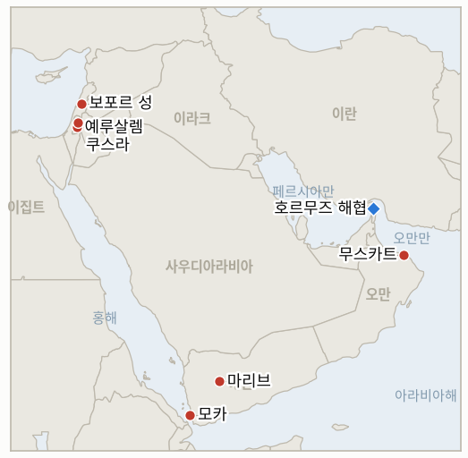

# 중동 일일 브리핑

**2026년 8월 18일**

- **보고 기간:** 약 24시간, 8월 17일 09:00 ~ 8월 18일 09:00 (한국시간)
- **종합 평가:** 월요일의 핵심 흐름은 워싱턴 자신의 발언이 테헤란의 발언 못지않은 파장을 낳았다는 점이다. 트럼프 대통령은 폭스뉴스에 호르무즈 협상과 관련해 "오만이 방해가 되면 그들을 완전히 폭격해버리겠다"고 말했다. 미국의 조약 우방국을 겨냥한 전례 없는 위협으로, 6월 양해각서의 60일 시한이 연장 없이 만료된 바로 그날 나왔으며, 이란 외무부 대변인 에스마일 바가에이는 이란-오만 해상교통지도에 대해 "이해에 도달했다"는 미완성 상태만을 주장하면서도 양측이 아직 마무리해야 한다고 밝힌 공동성명에는 이르지 못했다고 했다. 이 원장 자체의 시험 기준으로 볼 때, 오늘 시한까지 공동으로 확인된 메커니즘도 하메네이의 승인도 나오지 않았으므로 IND-20260811-1은 확증(Confirmed)으로 종료된다. 다만 기술적 트랙 자체는 계속 진전되고 있다는 점은 유의할 만하다. 예루살렘에서는 쿠슈너와 네타냐후가 3시간 회동 끝에 미군 장성이 하마스의 무기 인도를 감독해야 하며 하마스가 "진정으로 무장해제"될 때까지는 IDF가 재배치하지 않는다는 데 합의했고, 무장해제와 재건을 각각 다루는 두 개의 실무그룹이 구성됐으나 안보내각 표결도, 네타냐후의 기존 순서 원칙에 대한 변화도 없었다. 하마스는 이스라엘이 철수하고 국제사회가 팔레스타인 국가 지위를 인정해야만 무장해제하겠다는 입장으로, 이스라엘 정부가 정면으로 거부하는 전제조건이다. 레바논에서는 이스라엘이 나바티예와 보포르 성 인근, 헤즈볼라의 지하 "신경 중추"로 불리는 알리 알타헤르 능선을 장악할 준비가 됐다고 전해지며, 정전 체제를 흔들지 않는 정밀하고 사상자를 최소화하는 작전을 위한 워싱턴의 승인만을 기다리고 있다. 서안지구에서는 집행이 대조적인 모습을 보였다. 병력이 포위된 쿠스라 주택 인근에서 일부 정착민 시설을 철거하고 배치됐지만 IDF는 여전히 자체 군사 폐쇄 구역 명령을 폭넓게 집행하지 않았고, 카츠 국방장관은 벤그비르 산하 경찰로 민간인 집행권을 이관하는 공식 2주 계획을 지시했으며, 같은 날 라말라 인근에 새 정착촌 두 곳이 들어서면서 유엔 특별보고관 프란체스카 알바네제는 이스라엘이 "정착민에게 강압을 외주화"해 그가 인종청소라 부른 것을 진전시키고 있다고 말했다. 그리고 예멘에서는 후티군 대변인 야히야 사레아가 처음으로 모카 인근에서 사우디 해군 함정, 상륙함 1척과 호위정 4척에 대한 직접 탄도미사일 공격과 마리브의 사우디 관련 무기고에 대한 드론 공격을 주장했다. 리야드는 어느 쪽도 확인하지 않았으나, 사실로 확인될 경우 사우디아라비아가 보복 없이 흡수한 자잔 정유시설 공격을 넘어서는 수준이 된다. 유가는 월요일 마감까지 지난주 상승분 대부분을 유지했다. 브렌트유는 배럴당 88.31달러, WTI유는 81.74달러로 마감해 각각 소폭 하락했다. 한국 증시는 광복절 대체공휴일로 휴장해 금요일 코스피 종가 6,977.94와 환율 1,418.3원이 사흘째 그대로 이월되며, 화요일 재개장이 다음 시험대다.

---

## 1. 무슨 일이 있었나

<figure style="float:right; width:46%; margin:2pt 0 8pt 14pt;">

<figcaption style="font-size:8pt; color:#666; text-align:center; margin-top:3pt; font-style:italic;">주요 논의 지점</figcaption>
</figure>

### 1.1 트럼프, 오만 폭격 위협, 60일 양해각서 만료, 이란은 미완성 합의만 주장

트럼프 대통령은 폭스뉴스의 트레이 잉스트에게 미국의 이란과의 호르무즈 관련 협상에서 "오만이 방해가 되면 그들을 완전히 폭격해버리겠다"고 말했고, 이후 오벌 오피스에서는 오만이 "그다지 잘 처신하지 않았다"면서도 미국이 "매우 쉽게 처리할 수 있다"고 덧붙였다([워싱턴포스트](https://www.washingtonpost.com/world/2026/08/17/trump-threatens-bomb-oman-if-it-gets-way/); [NBC뉴스](https://www.nbcnews.com/politics/trump-administration/trump-bomb-oman-iran-strait-hormuz-rcna592971)). 민주당의 팀 케인 상원의원은 상원이 휴회에서 복귀하면 오만에 대한 군사 조치를 금지하는 결의안을 발의하겠다고 밝혔다. 이 위협은 6월 17일 미국-이란 양해각서의 60일 협상 시한이 양측 모두 연장 의사 없이 공식 만료된 바로 그날 나왔으며, 이란 외무부 대변인 에스마일 바가에이는 오만과의 호르무즈 해상교통지도 합의에 대해 "이해에 도달했다"고만 밝히면서도 테헤란과 무스카트가 여전히 "지도에 공동성명을 더한 패키지 형태로 이해를 마무리"해야 한다고 덧붙였다([타임스오브이스라엘](https://www.timesofisrael.com/as-60-day-mou-deadline-expires-iran-says-it-has-reached-a-deal-with-oman-on-hormuz/); [CBS뉴스](https://www.cbsnews.com/live-updates/us-iran-war-deal-expired-strait-of-hormuz/)). 바가에이의 발언은 이란-오만 공동 발표가 아니라 이란 측의 일방적 주장이며 하메네이의 승인도 나타나지 않았으므로, 이 원장의 IND-20260811-1은 자체 시한에 **확증(Confirmed)**으로 종료된다. 오늘까지 공동으로 확인된 메커니즘도 하메네이의 승인도 없었다는 점이 지표의 강경화 확증 조건을 문언 그대로 충족시켰으며, 이는 기저의 기술적 협상 자체가 계속 진전되고 있다는 사실과는 별개다. 트럼프의 오만 위협 자체를 시험하는 신규 **IND-20260818-1**이 개설된다. **신뢰도: 높음** — 트럼프의 발언과 케인 의원의 대응(1~2등급, 공식 발언, 다수 매체). **신뢰도: 중간** — 바가에이의 "이해" 주장의 실질적 내용은 오만 측의 확인이 없고 공동성명도 발표되지 않아 불확실하다.

### 1.2 쿠슈너와 네타냐후, 하마스 완전 무장해제 전 IDF 재배치 없다는 데 합의, 실무그룹 구성하되 안보내각 표결은 없어

재러드 쿠슈너는 이집트에서 하마스의 칼릴 알하야를 만난 다음 날인 월요일, 예루살렘에서 네타냐후 총리와 약 3시간 동안 회동했으며 평화이사회 특사 니콜라이 믈라데노프와 전 영국 총리 토니 블레어가 동행했다([블룸버그](https://www.bloomberg.com/news/articles/2026-08-17/kushner-netanyahu-agree-hamas-to-disarm-before-idf-leaves-gaza); [NBC뉴스](https://www.nbcnews.com/world/gaza/kushner-netanyahu-hamas-talks-gaza-plan-peace-trump-rcna592871)). 네타냐후 총리실은 이스라엘과 평화이사회가 무장해제와 비무장화가 "가자지구 재건에 앞서 신속히 완료돼야 한다"는 데 합의했으며 미군 장성이 하마스의 무기 인도를 감독해야 한다고 밝혔다. 무장해제·비무장화를 다루는 실무그룹과 재건·위생·공중보건을 다루는 실무그룹, 두 개가 구성됐다. 네타냐후는 하마스가 "진정으로 무장해제"될 때까지 IDF가 가자지구에서 재배치하지 않을 것이라는 기존 입장을 재확인했다. 이는 8월 9일 평화이사회의 기존 순서 원칙을 거부한 것과 달라지지 않은 것이며, 벤그비르 국가안보장관은 정전 체제 자체를 계속 반대하며 대신 매일 밤 표적 사살을 요구했다. 하마스는 무장해제하겠다고 밝혔으나 이스라엘의 공습 중단과 철수, 국제사회의 팔레스타인 국가 지위 인정을 전제조건으로 내걸었으며, 이는 이스라엘 정부가 거부하는 조건이다. **신뢰도: 높음** — 회동 성사와 무장해제 선행 합의(1~2등급, 다수 매체, 네타냐후 총리실 발표). **신뢰도: 중간** — 이것이 기존 조건의 재확인을 넘어선 실질적 진전인지는 불확실하다. IND-20260814-2가 시험하는 공식 표결이나 순서 변경은 오늘 이뤄지지 않았다.

### 1.3 이스라엘, 레바논 알리 알타헤르 능선 장악 준비, 미국 승인 기다려

이스라엘은 나바티예와 보포르 성 인근, 헤즈볼라의 지하 "신경 중추"로 널리 알려진 알리 알타헤르 능선을 완전히 장악하기 위한 작전을 개시할 준비가 됐다고 전해지며, 워싱턴이 이스라엘-레바논 합의 틀을 훼손하지 않는 정밀하고 사상자를 최소화하는 작전을 요청한 가운데 미국의 승인만을 기다리고 있다([예루살렘포스트](https://www.jpost.com/israel-news/defense-news/article-905549); [Ynet뉴스](https://www.ynetnews.com/article/hjzl9e3ife)). IDF는 최근 며칠 새 능선 터널망에 대한 포위를 강화해 지하 시설로의 급수관을 차단하고 포격, 공습, 드론을 이용한 폭발물 투하를 늘렸다. 터널 안에 갇힌 것으로 묘사되는 헤즈볼라 전투원들을 겨냥한 조치다([Ynet뉴스](https://www.ynetnews.com/article/syiznpdlzx)). 이스라엘은 지난 6월 26일 이미 능선을 장악했다고 주장했으나 헤즈볼라는 이를 부인했으며, 나바티예와 크파르 테브니트를 굽어보는 이 능선의 전략적 가치를 둘러싼 실제 지배권 다툼은 핵심 쟁점으로 남아 있다. 작전이 실제로 개시되는지를 시험하는 신규 **IND-20260818-2**가 개설된다. **신뢰도: 중상** — 이스라엘의 작전 준비 태세와 미국 승인 대기 상태(2~3등급, 익명의 레바논·이스라엘 당국자, 다수 매체). **신뢰도: 높음** — 기저의 포위와 기반시설 타격(1~2등급, IDF 성명, 다수 매체).

### 1.4 서안지구 집행 선별적으로 지속, 카츠는 경찰 이관 공식화, 라말라 인근 새 정착촌 등장

쿠스라에서는 병력이 포위된 팔레스타인 주택 인근에서 일부 정착민 시설을 철거하고 배치됐으나, IDF는 재진입하는 정착민들에 대해 자체 군사 폐쇄 구역 명령을 폭넓게 집행하지는 않았다([하레츠](https://www.haaretz.com/israel-news/israel-security/2026-08-17/ty-article/.premium/idf-declines-to-enforce-order-barring-settlers-from-besieged-palestinian-land/000001a0-0b94-dccb-afed-ef9517310000)). 별도로 이스라엘 카츠 국방장관은 군에 극우 성향의 벤그비르 국가안보장관 산하 경찰로 서안지구 민간인 집행권을 이관하는 종합 계획을 2주 안에 제출하라고 지시했다. 벤그비르는 이를 "이스라엘 주권을 향한 중대한 진전"이라 불렀으며, 강경 정착민들 사이에서도 이 계획을 둘러싸고 분열이 있는 것으로 전해진다([예루살렘포스트](http://www.jpost.com/israel-news/defense-news/article-905767)). 같은 날 정착민들은 라말라 북서쪽 움 사파 인근 와디 제이툰과 별도로 부르카에 새 불법 정착촌 두 곳을 위한 텐트를 세웠다. 이로써 두 마을을 둘러싼 정착촌은 총 여섯 곳으로 늘었으며, 정착민들은 이미 움 사파 4,800두남 중 약 4,700두남, 부르카 1만 2,000두남 중 1만 두남을 차지하고 있다([알자지라](https://www.aljazeera.com/news/2026/8/17/israeli-settlers-pitch-tents-for-new-illegal-outpost-in-occupied-west-bank)). 유엔 특별보고관 프란체스카 알바네제는 "이스라엘이 정착민에게 강압을 외주화해 인종청소를 진전시키는 데 이용하고 있다"고 말했다. **신뢰도: 높음** — 쿠스라 집행 양상과 카츠의 경찰 이관 계획(1~2등급, 다수 매체, 공식 발언). **신뢰도: 높음** — 움 사파·부르카 신규 정착촌(1~2등급, 알자지라, 유엔 소식통).

### 1.5 후티, 모카 인근 사우디 해군 함정 직접 공격 주장

후티군 대변인 야히야 사레아 준장은 텔레그램을 통해 후티군이 바브엘만데브 해협 진입로에 위치한 모카 인근에서 사우디 해군 상륙함 1척과 호위정 4척을 "여러 발의 탄도미사일"로 공격했다고 밝히며 "정확하고 직접적인" 타격이었다고 주장했다. 상륙함은 완전히 화염에 휩싸였고 일부 호위정은 침몰, 일부는 화재가 났다고 주장했으며, 별도로 마리브 주 사흔 알진 기지의 사우디 관련 무기고에 대한 드론 공격도 주장했다([예루살렘포스트](https://www.jpost.com/middle-east/article-905779); [미들이스트모니터](https://www.middleeastmonitor.com/20260817-yemens-houthis-strike-saudi-naval-vessels-arms-depot-spokesman/); [신화통신](https://english.news.cn/20260817/c8551b66b9ae464eaffb293dbed68eb0/c.html)). 이번 보고 기간 마감까지 사우디 당국은 어느 주장에 대해서도 확인이나 부인을 하지 않았다. 이 주장은 최근 몇 주간 25차례 이상 피격돼 항구 관리소장에 따르면 7명이 숨지고 약 1,600만 달러의 손실이 발생해 사실상 운영이 중단된 모카항의 상황 속에서 나왔다. 독립적으로 확인될 경우 이는 이번 교전 국면에서 후티가 사우디 군사 함정을 직접 겨냥한 첫 사례가 되며, 사우디아라비아가 보복 없이 흡수한 자잔 정유시설 공격(IND-20260810-3, 8월 17일 반증으로 종료)보다 더 직접적인 공격이 된다. 리야드가 이 주장을 확인하거나 대응하는지를 시험하는 신규 **IND-20260818-3**이 개설된다. **신뢰도: 중간** — 후티의 주장 자체(2~3등급, 후티군 대변인 단일 소식통, 다수 매체가 주장을 보도했으나 독립 검증은 없음). **신뢰도: 높음** — 모카항의 기존 피해와 운영 중단(1~2등급, 다수 매체).

---

## 2. 심층 분석: 유인과 동기

### 2.1 트럼프는 왜 오만이 이란과의 돌파구를 주장하는 바로 그 시점에 협상 중재국인 오만을 폭격하겠다고 위협했는가?

이란이 아니라 중재자를 위협하는 것은 워싱턴이 통제하지 못하는 절차에 대한 사실상의 거부권을 재확인시켜주기 때문이다. 바가에이의 "이해" 발언이 워싱턴이 정한 조건이 아닌 채로 양해각서의 60일 시한이 만료되는 바로 그 주에 나온 만큼, 오만을 공개적으로 위협하는 것은 이란-오만의 자체적인 기정사실화를 워싱턴의 묵인에 좌우되는 것으로 재구성해준다. 최대주의적 수사를 받아들이는 지지층 덕분에 트럼프에게는 국내적으로 대가가 거의 없는 반면, 미국이 여전히 필요로 하는 걸프 우방국과의 관계를 악화시키고 케인 의원의 결의안 추진과 같은 제도적 반발을 부를 위험이 있다.

### 2.2 쿠슈너와 네타냐후는 왜 8월 9일 이후 계획을 정체시킨 근본적인 순서 다툼을 해소하는 대신 미군 장성의 감독이라는 합의로 돌아섰는가?

미군의 명목상 감독 아래 무장해제·비무장화 실무그룹을 두는 것은 실제로 절차를 정체시킨 지점을 어느 쪽도 양보하지 않으면서 양측 모두 진전을 주장할 수 있게 해주기 때문이다. 네타냐후는 무장해제 전까지 재배치하지 않는다는 입장을 온전히 유지하면서도 워싱턴의 절차에 협조하는 모습을 보일 수 있고, 쿠슈너는 안보내각 표결 없이도 내세울 수 있는 제도적 틀을 확보한다. 이는 이스라엘이 실제로 하마스가 서명할 만한 어떤 형태의 계획이든 받아들일 것인지라는 더 어려운 질문을 뒤로 미룬다.

### 2.3 이스라엘은 왜 6월과 같이 일방적으로 행동하는 대신 알리 알타헤르 능선 진입에 앞서 미국의 승인을 구하는가?

지난 6월의 일방적인 장악 주장은 헤즈볼라의 반박을 받았고 명확히 해소되지 않았기 때문에, 검증되지 않은 두 번째 시도는 같은 모호함을 반복할 위험이 있다. 워싱턴 자체의 정밀하고 사상자를 최소화하는 작전 요청과 함께 명시적인 미국 승인 절차를 거치는 것은 헤즈볼라나 레바논 정부의 강한 반발이 나올 경우 이스라엘에 정치적 방어막을 제공하며, 작전의 정당성을 워싱턴 스스로 지키려는 정전 체제와 연결시켜준다.

### 2.4 카츠 장관은 왜 라말라 인근에 새 정착촌이 늘어나는 바로 그 주에 서안지구 집행 이관을 공식화했는가, 기존 방식이 효과가 있음을 보여주기 위해 잠시 멈추는 대신?

2주 계획을 예정대로 완료하는 것은 벤그비르가 이미 공개적으로 "주권을 향한 진전"이라 규정한 정착민 민족주의 연립에 대한 공약을 이행하는 것이며, 움 사파와 부르카의 정착촌에 대응해 이를 지연시키는 것은 국제적 압박이 정책 설계가 아니라 이스라엘의 집행 결정을 좌우한다는 점을 인정하는 셈이 된다. 그대로 진행하는 것은 그러한 정치적 신뢰를 유지시키는 동시에, 이관이 실제로 사건을 줄이는지에 대한 책임은 IND-20260815-2 자체의 9월 시한으로 미룰 수 있게 해준다.

### 2.5 후티는 왜 이전처럼 정부 계열 기반시설과 선박만이 아니라 지금 사우디 해군 함정에 대한 직접 공격을 주장하는가?

사우디아라비아가 자잔 정유시설에 대한 세 차례 공격을 보복 없이 흡수한 것은 이미 리야드의 인내 한계를 시험한 셈이다. 사우디 군사 함정에 대한 직접 공격을 주장하는 것으로 확전하는 것은 재산 피해가 아니라 사우디 측 사상자가 마침내 리야드의 무력 대응을 이끌어낼지를 시험하며, 이는 이란과 연계된 후티의 메시지가 이 분쟁을 예멘 내부 문제가 아니라 다시금 사우디-후티 전쟁으로 재구성할 수 있게 해준다. 이는 이란이 별도로 호르무즈를 협상하고 있는 바로 이 시점에 사우디아라비아를 자국 인근 문제에 계속 묶어두는 것이 유리한 테헤란의 대리 세력 지렛대를 재가동시킬 수 있다.

---

## 3. 한국에 대한 정책적 함의

### 3.1 익스포저 현황

| 항목 | 현재 수치 | 출처 |
| --- | --- | --- |
| 원유 수입 중 중동 비중 | 48.5% (2026년 5~7월), 1년 전 69.1%에서 하락; 비중동 비중이 사상 처음 50%를 상회 | KNOC, 아시아경제 경유; `korea-exposure.md` |
| 7~8월 원유 조달 | 전년 동기 물량의 110% 이상 확보(산업부, 7월 21일); 비축유 스와프 8월까지 연장, 현재까지 약 2,100만 배럴 스와프 | 산업부, 헤럴드경제·한경 경유; `korea-exposure.md` |
| 9월 원유 조달 | 90% 이상 확보(산업부, 7월 21일) | 산업부, 헤럴드경제 경유; `korea-exposure.md` |
| 홍해 우회 항로 | 한국행 원유 화물이 얀부·홍해 우회로를 계속 이용 중; 한국을 포함한 아시아 매수처로의 얀부 수출량이 1년 전 하루 100만 배럴 미만에서 약 400만 배럴로 급증 | 로이즈리스트 인텔리전스; `korea-exposure.md` |
| 비축유 보유 여력 | 실제 소비 기준 약 26일분(추정); 스와프는 즉시 가동 대기 상태이나 대규모 실행은 미검증 | CSIS; 산업부 7월 27일 |
| 정유사 사우디 지분 익스포저 | S-Oil(사우디 아람코 과반 지분 약 63%), HD현대오일뱅크(아람코 지분 약 17%) | 공시 자료; `korea-exposure.md` |
| 브렌트유/WTI유 | 월요일 정산가 88.31달러/81.74달러, 양해각서 시한 만료와 트럼프의 오만 위협 속에 소폭 하락했으나 지난주 5% 이상 상승분 대부분 유지 | CNBC, 로이터(월요일 정산가) |
| 코스피/원달러 환율 | 광복절 대체공휴일로 월요일 휴장, 이번 보고 기간 신규 세션 없음. 금요일 종가 6,977.94(6월 19일 기록된 사상 최고치 9,385.59에는 크게 못 미치는 회복 고점)와 환율 1,418.3원이 사흘째 이월되며, 화요일 재개장이 다음 시험대 | 한국거래소(KRX); 비즈니스코리아, 코리아타임스(금요일 종가) |
| 호르무즈 통항량 | Kpler는 8월 16일 통항을 3척으로 집계, 20척 미만/일 붕괴 국면이 지속됨을 재확인; 8월 10~16일 주간 통항량은 전주 대비 19.5% 감소한 반면 바브엘만데브 통항량은 6.7% 증가한 254척을 기록해, 한국 화물도 이용하는 홍해 우회로의 상대적 견고함을 재확인 | Kpler, 미들이스트아이 경유; The National |

### 3.2 사안별 함의

**미국의 조약 우방국을 겨냥한 트럼프의 오만 폭격 위협은 양해각서의 미해결 만료, 이란의 여전히 일방적인 오만 합의 주장과 겹쳐 오늘 가장 직접적인 한국 관련 신호다. 실제로 공동 확인된 메커니즘이 나오기 전까지 한국 정유사는 기존의 봉쇄·우회로 병행 체제를 그대로 유지해야 하며, 이제는 워싱턴 자신의 발언이 한국의 걸프 공급로가 간접적으로 의존하는 바로 그 중재자를 흔들 수 있다는 위험까지 더해졌다.** 신규 IND-20260818-1(시한 9월 1일)은 오만 위협이 실질적 결과로 이어질지를 검증하며, IND-20260811-1은 오늘 확증으로 종료된다. IND-20260814-1(시한 8월 24일)은 통행료 문제 자체를 계속 추적하고, IND-20260816-3(시한 9월 5일)은 해상교통지도가 실제 서명된 문서로 이어질지를 계속 추적한다.

**쿠슈너와 네타냐후의 무장해제 선행 합의는 안보내각 표결 없이 이뤄져, 가자지구의 정상화 경로를 아직 공식적으로 내려지지 않은 이스라엘 측 결정에 계속 의존하게 만든다. 이는 한국의 지역 리스크 가격 형성이 그동안 유지해온 바로 그 지점이다.** IND-20260814-2(시한 8월 21일)와 IND-20260812-4(시한 8월 26일)는 이번 주의 절차적 진전이 실제 기록된 표결이나 실질적 입장 변화로 이어질지를 계속 추적한다.

**미국의 승인을 전제로 한 이스라엘의 알리 알타헤르 능선 장악 준비는 한국 시장에 직접적인 익스포저는 없으나, 6월 정전 체제가 또 한 차례의 공방이 아니라 의도적인 이스라엘의 공세를 견뎌낼 수 있는지를 가늠하는 지금까지 가장 명확한 시험대다.** 신규 IND-20260818-2(시한 8월 31일)는 작전이 실제로 개시되는지를 검증하며, IND-20260816-1(시한 8월 29일)은 8월 15일 충돌이 더 넓은 범위의 전투 재개로 이어질지를 계속 추적한다.

**서안지구의 공식화된 집행 이관과 늘어나는 정착촌이 뒤섞인 상황은 한국 시장에 직접적인 익스포저는 없으나, 이스라엘의 행정적 절반의 조치가 단순한 재명명을 넘어 실제로 측정 가능한 사건 감소로 이어지는지를 계속 시험한다.** IND-20260813-3(시한 8월 27일)과 IND-20260815-2(시한 9월 12일)는 쿠스라의 해소 여부와 더 넓은 범위의 이관 효과를 계속 추적한다.

**사우디 해군 함정에 대한 직접 공격이라는 미확인 후티 주장은, 사실로 확인될 경우 사우디아라비아가 보복 없이 흡수한 정유시설 공격보다 사우디 군사 자산에 더 깊숙이 파고드는 것으로, 한국의 얀부 홍해 우회로가 함께 의존하는 더 넓은 사우디 에너지 수송로에 대한 위험이 된다.** 신규 IND-20260818-3(시한 9월 1일)은 리야드가 이를 확인하거나 대응하는지를 검증하며, IND-20260817-1(시한 8월 31일)은 예멘의 확증된 확산이 갱신된 국제 중재를 이끌어낼지를 계속 추적한다.

**검증 가능한 지표:**

- **IND-20260818-1** — 호르무즈 협상과 관련해 오만이 "방해가 되면" 폭격하겠다는 트럼프의 위협이 실질적인 외교적 또는 군사적 결과로 이어질지, 아니면 일회성 수사에 그칠지를 검증한다. 2026년 9월 1일까지 오만에 대한 검증된 미군 태세 변화, 오만의 공식 항의 또는 중재 역할 중단, 또는 이 위협에 명시적으로 대응하는 의회 조치(케인 의원의 결의안 추진 등)가 있으면 위협이 실질적 결과로 이어졌음이 확증된다. 같은 시한까지 오만이 아무 사고 없이 중재 역할을 유지하고 미국의 추가 압박도 없으면 이는 후속 조치 없는 수사적 과잉으로 반증된다.
- **IND-20260818-2** — 미국의 승인을 기다리는 이스라엘의 알리 알타헤르 능선 장악 작전이 실제로 개시될지, 아니면 승인 대기 상태로 정체될지를 검증한다. 2026년 8월 31일까지 능선에서 검증된 IDF 지상 작전이 개시되거나 완료되면 작전이 진행됐음이 확증된다. 같은 시한까지 어떤 작전 개시도 없거나 계획이 명시적으로 보류되면 이는 정체되거나 포기된 계획으로 반증된다.
- **IND-20260818-3** — 모카 인근 사우디 해군 함정에 대한 후티의 미사일 공격 주장이 독립적으로 확인되거나 직접적인 사우디 군사 대응을 이끌어낼지, 아니면 미확인·무응답 상태로 남을지를 검증한다. 2026년 9월 1일까지 사우디 측의 해군 공격 확인(보복 여부와 무관), 또는 이 사건과 명시적으로 연계된 검증된 사우디의 후티 진지에 대한 직접 군사 타격이 있으면 이 주장이 실질적 무게를 가졌음이 확증된다. 같은 시한까지 사우디 측의 침묵이 계속되고 직접 보복이 없으면 이는 IND-20260810-3의 패턴을 연장하는, 응답 없이 흡수된 미검증 주장으로 반증된다.

---

## 4. 관찰 목록

- **트럼프의 오만 폭격 위협이 실질적인 외교적 또는 군사적 결과로 이어질지** (IND-20260818-1, 시한 9월 1일).
- **이스라엘의 준비된 알리 알타헤르 능선 작전이 실제로 개시될지** (IND-20260818-2, 시한 8월 31일).
- **사우디 해군 함정에 대한 후티의 공격 주장이 확인되거나 직접적인 사우디 대응을 이끌어낼지** (IND-20260818-3, 시한 9월 1일).
- **6월 17일 양해각서의 통행료 면제 기간이 이제 만료된 가운데 실제 이란의 통행료 부과로 이어질지, 아니면 조용히 연장될지** (IND-20260814-1, 시한 8월 24일).
- **호르무즈를 미국 영토로 만들겠다는 트럼프의 공언이 구체적인 정책 조치로 이어질지** (IND-20260817-2, 시한 8월 31일).
- **예멘의 확증된 다섯 개 주 확산이 갱신된 국제 중재를 이끌어낼지** (IND-20260817-1, 시한 8월 31일).
- **8월 15일 헤즈볼라-이스라엘 충돌이 추가 라운드로 이어질지, 아니면 양측이 휴전 이후 균형 상태로 물러날지** (IND-20260816-1, 시한 8월 29일).
- **로마 트랙이 잠정 예정한 9월 1일 8차 회담이 8월 15~16일 확전 이후에도 예정대로 진행될지** (IND-20260807-2, 시한 9월 1일).
- **가자지구 옐로 라인 사건들이 공식적인 IDF 작전 대응을 촉발할지, 아니면 고립된 사건으로 남을지** (IND-20260816-2, 시한 8월 30일).
- **쿠슈너 방문의 이스라엘 구간이 이번 주의 실무그룹 구성을 넘어 하마스 무장해제에 대한 네타냐후의 입장을 바꿀지** (IND-20260814-2, 시한 8월 21일).
- **가자지구 무장해제 선행 프레임워크가 어떤 형태로든 이스라엘 안보내각의 공식 표결에 이를지** (IND-20260812-4, 시한 8월 26일).
- **베센트가 예고한 전례 없는 이란 경제 고립 조치가 구체적인 새 조치와 함께 실현될지** (IND-20260815-1, 시한 8월 22일).
- **서안지구 IDF에서 경찰로의 집행 이관이 정착민 폭력을 줄일지, 그대로 유지될지** (IND-20260815-2, 시한 9월 12일).
- **이란의 경고에도 불구하고 시리아가 레바논 헤즈볼라에 대해 움직일지, 아니면 대립이 수사적 수준에 머물지** (IND-20260815-3, 시한 9월 15일).
- **쿠스라 포위가 실제로 해소될지, 반증 쪽으로 더 기울고 있다** (IND-20260813-3, 시한 8월 27일).
- **구조대를 겨냥한 후티의 이중 타격 전술이 재발할지, 일회성 확전으로 그칠지** (IND-20260813-2, 시한 9월 2일).
- **IEA의 재고 고갈 경고가 추가적인 공조 정책 대응이나 지속적인 가격 변동으로 이어질지** (IND-20260813-1, 시한 9월 2일).
- **이행 일정을 담은 서명된 이란-오만 호르무즈 공동성명이 나올지, 아니면 해상교통지도 합의가 다시 서명 직전에서 정체될지** (IND-20260816-3, 시한 9월 5일).
- **미 해군의 무력 봉쇄 집행이 이란의 군사적 대응을 촉발할지** (IND-20260812-1, 시한 8월 26일).
- **시리아의 핵물질 파일이 IAEA와의 최종 합의 및 검증된 제거로 전환될지** (IND-20260812-2, 시한 9월 11일).
- **캐롤라인 베젠기호 기름 유출이 샐비지 작업 시작 이후 억제될지.**
- **케슘섬 폭발이 실제 공격으로 확인될지, 오경보로 결론 날지.**

---

## 5. 출처 신뢰도 요약

| 주장 | 출처 | 신뢰도 |
| --- | --- | --- |
| 트럼프, 호르무즈 협상 관련 "오만이 방해가 되면" 폭격하겠다고 위협 | 워싱턴포스트, NBC뉴스(1~2등급, 폭스뉴스 인터뷰·오벌 오피스 발언, 다수 매체) | 높음 |
| 6월 17일 양해각서 시한 연장 없이 만료; 이란 바가에이의 미완성 오만 "이해" 주장, IND-20260811-1 종료 근거 | 타임스오브이스라엘, CBS뉴스(1~2등급, 이란 외무부 대변인 공식 발언, 다수 매체) | 만료는 높음; "이해" 주장의 실질은 중간 |
| 쿠슈너-네타냐후 3시간 예루살렘 회동; 무장해제 선행 합의, 미군 장성 감독, 실무그룹 2개 구성 | 블룸버그, NBC뉴스(1~2등급, 네타냐후 총리실 발표, 다수 매체) | 높음 |
| 하마스, 이스라엘 철수와 국가 지위 인정을 무장해제 조건으로 제시 | NBC뉴스(1~2등급, 외교 소식통) | 중상 |
| 이스라엘, 알리 알타헤르 능선 작전 준비, 미국 승인 대기 | 예루살렘포스트, Ynet뉴스(2~3등급, 익명 레바논·이스라엘 당국자, 다수 매체) | 중상 |
| IDF, 능선 지하 터널망 포위 강화 | Ynet뉴스(1~2등급, IDF 성명) | 높음 |
| 쿠스라 집행 선별적 지속; 카츠의 2주 경찰 이관 계획 공식화 | 하레츠, 예루살렘포스트(1~2등급, 공식 발언, 다수 매체) | 높음 |
| 라말라 인근 움 사파·부르카 신규 정착촌; 알바네제의 "인종청소" 발언 | 알자지라(1~2등급, 유엔 특별보고관 발언, 현장 취재) | 높음 |
| 후티, 모카 인근 사우디 해군 함정 직접 공격 및 마리브 무기고 드론 공격 주장 | 예루살렘포스트, 미들이스트모니터, 신화통신, Israel National News(2~3등급, 후티군 대변인 단일 소식통, 주장 자체는 다수 매체 보도이나 독립 검증 없음) | 중간 |
| 모카항의 기존 피해와 운영 중단(25차례 이상 피격, 사망 7명, 손실 1,600만 달러) | 예루살렘포스트(1~2등급, 항구 관리소장 발언) | 높음 |
| 브렌트유 88.31달러, WTI유 81.74달러 월요일 정산, 지난주 상승분 대부분 유지 | CNBC, 로이터(1~2등급, 다수 금융 매체) | 높음 |
| 한국 증시 광복절 대체공휴일로 월요일 휴장; 금요일 코스피 6,977.94와 환율 1,418.3원 이월 | 한국거래소(KRX) 공지, 다수 한국 금융 매체 | 높음 |
| 호르무즈 통항량 8월 16일 3척으로 하락; 호르무즈 주간 19.5% 감소 대 바브엘만데브 6.7% 증가 | Kpler, 미들이스트아이 경유; The National | 높음 |
