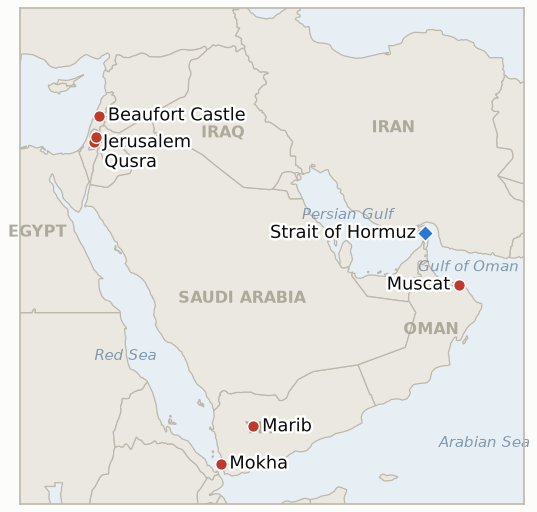

# Middle East Daily Briefing

**August 18, 2026**

- **Reporting window:** ~24 hours, August 17, 09:00 to August 18, 09:00 KST
- **Overall assessment:** Monday's throughline was Washington's own rhetoric becoming as consequential as anything Tehran said. President Trump told Fox News he would "bomb the s*** out of" Oman "if it gets in the way" of Hormuz negotiations, an unprecedented threat against a US treaty partner that landed the same day the June MOU's 60 day deadline expired without extension and Iran's foreign ministry spokesman Esmail Baghaei claimed only an unfinished "understanding" on the Iran Oman shipping map, still short of the joint statement both sides say they still need to finalize; on the letter of this ledger's own test, no jointly confirmed mechanism and no Khamenei approval arrived by today's deadline, so IND-20260811-1 resolves Confirmed even as the underlying technical track keeps inching forward. In Jerusalem, Kushner and Netanyahu emerged from a three hour meeting agreeing that a US general should oversee Hamas's weapons handover and that no IDF redeployment happens until Hamas is "genuinely disarmed," with two working groups formed on disarmament and on reconstruction, but no Security Cabinet vote and no change to Netanyahu's underlying sequencing; Hamas says it will disarm only once Israel withdraws and the international community recognizes Palestinian statehood, a precondition Israel's government rejects outright. In Lebanon, Israel is reportedly ready to move on the Ali al Taher ridge, the tunnel network near Beaufort Castle that functions as Hezbollah's underground nerve center in the south, and is waiting only on Washington's approval for a surgical, low casualty operation that does not unravel the ceasefire framework. In the West Bank, enforcement stayed a study in contrasts: soldiers dismantled some settler structures and positioned near the besieged Qusra homes even as the IDF still declined to enforce its own closed military zone order broadly, Defense Minister Katz ordered a formal two week plan to hand civilian enforcement to police under Ben Gvir, and settlers pitched two fresh outposts near Ramallah the same day, prompting UN Special Rapporteur Francesca Albanese to say Israel has "outsourced coercion to the settlers" to advance what she called ethnic cleansing. And in Yemen, Houthi military spokesman Yahya Saree claimed for the first time a direct ballistic missile strike on Saudi naval vessels, a landing ship and four escorts, near Mocha, plus a drone strike on a Saudi linked arms depot in Marib; Riyadh has not confirmed either claim, but if verified this would go beyond the Jazan refinery strikes Saudi Arabia already absorbed without retaliating. Oil held most of last week's gains into Monday's close, Brent settling at $88.31 and WTI at $81.74, both down modestly on the day; Korean markets stayed closed for the Liberation Day substitute holiday, so Friday's KOSPI close of 6,977.94 and won at 1,418.3 carry forward unchanged for a third session, with Tuesday's reopening the next test.

---

## 1. What Happened

<figure style="float:right; width:46%; margin:2pt 0 8pt 14pt;">

<figcaption style="font-size:8pt; color:#666; text-align:center; margin-top:3pt; font-style:italic;">Major places of discussion</figcaption>
</figure>

### 1.1 Trump Threatens to Bomb Oman as the Sixty Day MOU Expires and Iran Claims an Unfinished Understanding

President Trump told Fox News' Trey Yingst that "if Oman gets in the way" of US dealings with Iran over the Strait of Hormuz, "we'll bomb the s*** out of them," later adding in the Oval Office that Oman "didn't behave very well" but that the US "would handle them very easily" ([Washington Post](https://www.washingtonpost.com/world/2026/08/17/trump-threatens-bomb-oman-if-it-gets-way/); [NBC News](https://www.nbcnews.com/politics/trump-administration/trump-bomb-oman-iran-strait-hormuz-rcna592971)). Senate Democrat Tim Kaine said he would introduce a resolution barring military action against Oman when the Senate returns from recess. The threat landed the same day the June 17 US Iran memorandum's 60 day negotiating window formally expired with neither side willing to extend it, while Iran's Foreign Ministry spokesman Esmail Baghaei said only that "an understanding has been reached" on the proposed Hormuz shipping map with Oman, adding that Tehran and Muscat still need to "finalize the understanding in the form of a package: the map plus a joint statement" ([Times of Israel](https://www.timesofisrael.com/as-60-day-mou-deadline-expires-iran-says-it-has-reached-a-deal-with-oman-on-hormuz/); [CBS News](https://www.cbsnews.com/live-updates/us-iran-war-deal-expired-strait-of-hormuz/)). Because Baghaei's statement is a one sided Iranian claim rather than a joint Iran Oman announcement, and no Khamenei approval has surfaced, this ledger's IND-20260811-1 resolves **Confirmed** at its own deadline: no publicly announced, jointly confirmed mechanism and no Khamenei approval arrived by today, satisfying the indicator's hardening branch on its literal terms even as the underlying technical negotiation keeps moving; new **IND-20260818-1** opens to test whether Trump's Oman threat itself produces any real consequence. **Confidence: High** on Trump's quote and Kaine's response (Tier 1-2, on record, multi outlet); **Medium** on Baghaei's "understanding" claim's substance, since it remains unconfirmed by Oman and no joint statement has been published.

### 1.2 Kushner and Netanyahu Agree Hamas Must Disarm Before Any IDF Redeployment as Two Working Groups Form Without a Cabinet Vote

Jared Kushner met Prime Minister Netanyahu in Jerusalem for roughly three hours Monday, a day after his meeting with Hamas's Khalil al-Hayya in Egypt, joined by Board of Peace envoy Nickolay Mladenov and former UK Prime Minister Tony Blair ([Bloomberg](https://www.bloomberg.com/news/articles/2026-08-17/kushner-netanyahu-agree-hamas-to-disarm-before-idf-leaves-gaza); [NBC News](https://www.nbcnews.com/world/gaza/kushner-netanyahu-hamas-talks-gaza-plan-peace-trump-rcna592871)). Netanyahu's office said Israel and the Board of Peace agreed disarmament and demilitarization "should be prompt and completed before any reconstruction happens in Gaza," and that a US general should oversee Hamas's weapons handover; two working groups were formed, one on disarmament and demilitarization, the other on reconstruction, sanitation and public health. Netanyahu reiterated the IDF will not redeploy from Gaza until Hamas is "genuinely disarmed," unchanged from his August 9 rejection of the Board of Peace's original sequencing, while National Security Minister Ben Gvir continued to oppose the ceasefire framework entirely, calling instead for nightly targeted killings. Hamas said it will disarm, but only once Israel ends strikes, withdraws from Gaza and the international community recognizes a Palestinian state, a precondition Israel's government rejects. **Confidence: High** on the meeting's occurrence and the disarmament first agreement (Tier 1-2, multi outlet, Netanyahu's office statement); **Medium** on whether this represents material movement in Netanyahu's position rather than restated existing terms, since IND-20260814-2's test of a formal cabinet vote or sequencing change was not met today.

### 1.3 Israel Prepares to Seize the Ali al Taher Ridge in Lebanon While Awaiting a US Green Light

Israel is reportedly ready to launch an operation to seize full control of the Ali al Taher ridge near Nabatieh and Beaufort Castle, widely described as Hezbollah's underground "nerve center" in south Lebanon, and is awaiting only US approval, with Washington reportedly asking for a precise, surgical operation with minimal civilian casualties that does not damage the Israel Lebanon framework agreement ([Jerusalem Post](https://www.jpost.com/israel-news/defense-news/article-905549); [Ynetnews](https://www.ynetnews.com/article/hjzl9e3ife)). The IDF has tightened its siege of the ridge's tunnel network in recent days, cutting water supply lines to the underground facility and intensifying artillery fire, airstrikes and drone dropped explosive charges against Hezbollah fighters described as trapped inside ([Ynetnews](https://www.ynetnews.com/article/syiznpdlzx)). Israel claimed to have already seized the ridge on June 26, but Hezbollah disputed that claim and the dispute over actual control has become a central sticking point given the ridge's strategic value overlooking Nabatieh and Kfar Tebnit. New **IND-20260818-2** opens to test whether the operation actually launches. **Confidence: Medium-High** on Israel's operational readiness and the pending US approval (Tier 2-3, Lebanese and Israeli officials cited anonymously, multi outlet); **High** on the underlying siege and infrastructure targeting (Tier 1-2, IDF statements, multi outlet).

### 1.4 West Bank Enforcement Stays Selective as Katz Formalizes a Police Handover and New Outposts Rise Near Ramallah

In Qusra, Israeli soldiers dismantled some settler erected structures and positioned tents near the besieged Palestinian homes, even as the IDF continued declining to broadly enforce its own closed military zone order against re-entering settlers ([Haaretz](https://www.haaretz.com/israel-news/israel-security/2026-08-17/ty-article/.premium/idf-declines-to-enforce-order-barring-settlers-from-besieged-palestinian-land/000001a0-0b94-dccb-afed-ef9517310000)). Separately, Defense Minister Israel Katz directed the army to submit within two weeks a comprehensive plan to transfer West Bank civilian enforcement powers from the IDF to police under far right National Security Minister Ben Gvir, a move Ben Gvir called "a significant step toward Israeli sovereignty," while radical settlers themselves reportedly split over the plan ([Jerusalem Post](http://www.jpost.com/israel-news/defense-news/article-905767)). The same day, settlers pitched tents for two new illegal outposts at Wadi Zeytun near Umm Safa and separately at Burqa, both northwest of Ramallah, bringing the total outposts encircling the two villages to six; settlers already hold roughly 4,700 of Umm Safa's 4,800 dunams and 10,000 of Burqa's 12,000 ([Al Jazeera](https://www.aljazeera.com/news/2026/8/17/israeli-settlers-pitch-tents-for-new-illegal-outpost-in-occupied-west-bank)). UN Special Rapporteur Francesca Albanese said "Israel has outsourced coercion to the settlers and is using them to advance ethnic cleansing." **Confidence: High** on the Qusra enforcement pattern and the Katz enforcement transfer plan (Tier 1-2, multi outlet, on record officials); **High** on the new Umm Safa and Burqa outposts (Tier 1-2, Al Jazeera, UN sourcing).

### 1.5 Houthis Claim a Direct Missile Strike on Saudi Naval Vessels Near Mocha

Houthi military spokesman Brig. Gen. Yahya Saree said via Telegram that Houthi forces struck a Saudi naval landing ship and four escort vessels with "several ballistic missiles" near Mocha in the Bab el-Mandeb approach, calling the strikes "accurate and direct" and claiming the landing ship caught fire completely while some escort boats sank and others burned; he separately claimed a drone strike on a Saudi linked weapons depot at the Sahn al-Jin camp in Marib governorate ([Jerusalem Post](https://www.jpost.com/middle-east/article-905779); [Middle East Monitor](https://www.middleeastmonitor.com/20260817-yemens-houthis-strike-saudi-naval-vessels-arms-depot-spokesman/); [Xinhua](https://english.news.cn/20260817/c8551b66b9ae464eaffb293dbed68eb0/c.html)). Saudi authorities have issued no confirmation or denial of either claim as of this window's close. The claim comes as Mocha port, already struck more than 25 times in recent weeks with seven deaths and an estimated $16 million in losses per the port director, remains largely suspended; if independently verified, this would be the first reported direct Houthi targeting of Saudi military vessels in the current round of fighting, distinct from and more direct than the Jazan refinery strikes Saudi Arabia already absorbed without retaliating (IND-20260810-3, resolved Falsified August 17). New **IND-20260818-3** opens to test whether Riyadh confirms the claim or responds. **Confidence: Medium** on the Houthi claim itself (Tier 2-3, single-source Houthi military spokesman, multi outlet reporting of the claim but no independent verification); **High** on Mocha port's prior damage and suspension (Tier 1-2, multi outlet).

---

## 2. Deep Dive: Incentives and Motives

### 2.1 Why would Trump threaten to bomb Oman, a US partner mediating the Hormuz talks, just as Iran claims a breakthrough with Muscat?

Because threatening the mediator rather than Iran reasserts Washington's veto over a process it does not otherwise control: with Baghaei's "understanding" landing the same week the MOU's 60 day window lapsed on terms Washington did not set, publicly menacing Oman lets Trump recast Iran's own claimed progress as contingent on US tolerance rather than an Iran Oman fait accompli, at minimal domestic cost given a political base receptive to maximalist rhetoric, even though it risks souring a Gulf partner whose continued mediation the US still needs and drawing the kind of institutional pushback Kaine's proposed resolution represents.

### 2.2 Why would Kushner and Netanyahu agree on a US general overseeing Hamas's disarmament rather than resolve the underlying sequencing dispute that has stalled the plan since August 9?

Because a joint disarmament and demilitarization working group under nominal US military oversight lets both sides claim forward motion without either conceding the point that has actually stalled the process: Netanyahu keeps his no-redeployment-until-disarmed position fully intact while appearing cooperative with Washington's process, and Kushner gets an institutional structure to point to even without a Security Cabinet vote, deferring the harder question of whether Israel will accept any version of the plan Hamas would actually sign onto.

### 2.3 Why would Israel seek US approval before moving on the Ali al Taher ridge instead of acting unilaterally as it did in June?

Because June's unilateral claim to have seized the ridge was disputed by Hezbollah and never cleanly resolved, a second unverified move risks repeating that ambiguity; routing the operation through an explicit US approval process, with Washington's own request for a surgical, low casualty operation, gives Israel political cover if the move draws a harsh Hezbollah or Lebanese government reaction and ties the operation's legitimacy to the ceasefire framework the US is itself invested in preserving.

### 2.4 Why would Katz formalize the West Bank enforcement handover to police the same week new outposts multiply near Ramallah, rather than pause to show the current approach can work?

Because completing the two-week planning process on schedule fulfills a coalition commitment to the settler-nationalist bloc that Ben Gvir has already framed publicly as "a step toward sovereignty," and abandoning or delaying it in response to the Umm Safa and Burqa outposts would concede that international pressure, not policy design, drives Israeli enforcement decisions; proceeding regardless keeps that political credit intact while deferring any accountability for whether the handover actually reduces incidents to IND-20260815-2's own September deadline.

### 2.5 Why would the Houthis claim a direct strike on Saudi naval vessels now, rather than continue targeting government aligned infrastructure and shipping as before?

Because Saudi Arabia's absorption of three Jazan refinery strikes without retaliating already tested Riyadh's tolerance for infrastructure hits; escalating to a claimed strike on Saudi military vessels directly tests whether Saudi casualties, rather than property damage, finally force a kinetic Saudi response that would let Iran-aligned Houthi messaging reframe the conflict as a renewed Saudi-Houthi war rather than an intra-Yemeni one, potentially reactivating Tehran's proxy leverage over Riyadh precisely while Iran is negotiating Hormuz separately and would benefit from Saudi Arabia staying preoccupied closer to home.

---

## 3. Policy Implications for South Korea

### 3.1 Exposure snapshot

| Item | Current reading | Source |
| --- | --- | --- |
| Middle East share of crude imports | 48.5% (May-July 2026), down from 69.1% a year earlier; non-Middle East share crossed 50% for the first time on record | KNOC via Asia Business Daily; `korea-exposure.md` |
| July-August crude procurement | 110%+ of prior-year volume secured (MOTIE, July 21); strategic reserve swap extended through August, ~21 million barrels swapped to date | MOTIE via Herald Business, Hankyung; `korea-exposure.md` |
| September crude procurement | 90%+ secured (MOTIE, July 21) | MOTIE via Herald Business; `korea-exposure.md` |
| Red Sea detour routing | Korean-bound crude cargoes continue via the Yanbu/Red Sea workaround; Yanbu exports to Asian buyers including Korea have surged to ~4 million bpd from under 1 million bpd a year earlier | Lloyd's List Intelligence; `korea-exposure.md` |
| Strategic reserve coverage | ~26 days of actual consumption (estimate); swap on immediate standby, untested at scale | CSIS; MOTIE July 27 |
| Refiner Saudi ownership exposure | S-Oil (Saudi Aramco majority ~63%), HD Hyundai Oilbank (Aramco ~17%) | Public filings; `korea-exposure.md` |
| Brent / WTI | Monday settle $88.31 / $81.74, both down modestly on the day but holding most of last week's 5%+ gain, as the MOU deadline expired and Trump threatened Oman | CNBC, Reuters (Monday settle) |
| KOSPI / USD-KRW | No session; Korean markets closed Monday for the Liberation Day substitute holiday. Friday's close 6,977.94, a recovery high but well below the all-time 9,385.59 set June 19 before the war crash, and won 1,418.3 carry forward a third session; Tuesday's reopening is the next test | KRX; Businesskorea, Korea Times (Friday close) |
| Hormuz transits | Kpler: transits fell to 3 vessels August 16, extending the sub-20/day disruption regime; the week of August 10 to 16 fell 19.5% from the prior week even as Bab el-Mandeb transits rose 6.7% to 254, underscoring the relative durability of the Red Sea workaround Korea's own cargoes use | Kpler via Middle East Eye; The National |

### 3.2 Implications by development

**Trump's threat to bomb a US partner over Hormuz mediation, layered onto the MOU's unresolved expiration and Iran's still one sided Oman claim, is today's most direct Korea relevant signal: until an actual jointly confirmed mechanism exists, Korean refiners keep navigating the same blockade and workaround status quo, now with the added risk that Washington's own rhetoric could destabilize the very mediator Seoul's Gulf supply routes indirectly depend on.** New IND-20260818-1 (deadline September 1) tests whether the Oman threat produces any real consequence; IND-20260811-1 resolves Confirmed today; IND-20260814-1 (deadline August 24) continues tracking the toll question itself, and IND-20260816-3 (deadline September 5) continues tracking the shipping map's path to an actual signed instrument.

**Kushner and Netanyahu's disarm first agreement, still without a Security Cabinet vote, keeps Gaza's path to normalization exactly where Korea's regional risk pricing has kept it: contingent on a formal Israeli decision that has not yet happened.** IND-20260814-2 (deadline August 21) and IND-20260812-4 (deadline August 26) continue tracking whether this week's process momentum ever converts into a recorded cabinet vote or a materially changed Israeli position.

**Israel's preparations to seize the Ali al Taher ridge, contingent on a US green light, have no direct Korean market exposure but are the clearest test yet of whether the post-June truce holds through a deliberate Israeli offensive rather than another exchange of strikes.** New IND-20260818-2 (deadline August 31) tests whether the operation actually launches; IND-20260816-1 (deadline August 29) continues tracking whether the August 15 exchange reopens broader active combat.

**The West Bank's mix of a formalized enforcement handover and multiplying settler outposts has no direct Korean market exposure but continues to test whether Israel's administrative half measures ever produce a measurable reduction in incidents rather than simply relabeling the enforcement gap.** IND-20260813-3 (deadline August 27) and IND-20260815-2 (deadline September 12) continue tracking Qusra's resolution and the broader handover's effect.

**An unconfirmed Houthi claim of a direct strike on Saudi naval vessels, if verified, would mark Yemen's war reaching further into Saudi military assets than the refinery strikes Riyadh already absorbed without retaliating, a risk to the broader Saudi energy corridor that Korea's own Yanbu Red Sea workaround also depends on.** New IND-20260818-3 (deadline September 1) tests whether Riyadh confirms or responds; IND-20260817-1 (deadline August 31) continues tracking whether Yemen's confirmed spread draws renewed international mediation.

**Testable indicators:**

- **IND-20260818-1** — Trump's threat to bomb Oman "if it gets in the way" of Hormuz talks converts into real diplomatic or military consequence, or stays a one-off rhetorical outburst. A verified US military posture change toward Oman, a formal Omani protest or suspension of its mediating role, or a congressional action explicitly responding to the threat (such as Sen. Kaine's proposed resolution advancing), by ~2026-09-01, confirms the threat had real consequences; Oman continuing its mediating role without incident and no further US pressure through the same date falsifies it as rhetorical excess without follow through.
- **IND-20260818-2** — Israel's prepared operation to seize the Ali al Taher ridge, awaiting a US green light, actually launches, or stays stalled pending approval. A verified IDF ground operation launched or completed on the ridge, by ~2026-08-31, confirms the operation proceeded; continued absence of any launched operation, or an explicit shelving of the plan, through the same date falsifies it as a stalled or abandoned plan.
- **IND-20260818-3** — The Houthis' claimed missile strike on Saudi naval vessels near Mocha is independently confirmed or draws a direct Saudi military response, or stays an unconfirmed, unanswered claim. Saudi confirmation of the naval strike, with or without retaliation, or a verified direct Saudi military strike on Houthi positions explicitly tied to this incident, by ~2026-09-01, confirms the claim carried real weight; continued Saudi silence and no direct retaliation through the same date falsifies it as an unverified claim absorbed without response, extending the pattern in IND-20260810-3.

---

## 4. Watch List

- **Whether Trump's threat to bomb Oman produces any real diplomatic or military consequence** (IND-20260818-1, deadline September 1).
- **Whether Israel's prepared Ali al Taher ridge operation actually launches** (IND-20260818-2, deadline August 31).
- **Whether the Houthis' claimed strike on Saudi naval vessels is confirmed or draws a direct Saudi response** (IND-20260818-3, deadline September 1).
- **Whether the June 17 MOU's toll free Hormuz window, now lapsed, converts into actual Iranian tolls or a quiet extension** (IND-20260814-1, deadline August 24).
- **Whether Trump's declared intent to make Hormuz US territory produces any concrete policy step** (IND-20260817-2, deadline August 31).
- **Whether Yemen's confirmed five governorate spread draws renewed international mediation** (IND-20260817-1, deadline August 31).
- **Whether the August 15 Hezbollah-Israel exchange triggers a further round or both sides step back to the post-truce equilibrium** (IND-20260816-1, deadline August 29).
- **Whether the Rome track's provisionally scheduled September 1 eighth round proceeds after the August 15-16 escalation** (IND-20260807-2, deadline September 1).
- **Whether the Gaza Yellow Line incidents prompt a formal IDF operational response or stay isolated** (IND-20260816-2, deadline August 30).
- **Whether Kushner's Israel leg shifts Netanyahu's position on Hamas disarmament beyond this week's working groups** (IND-20260814-2, deadline August 21).
- **Whether the Gaza disarm first framework ever reaches a formal Israeli Security Cabinet vote in any form** (IND-20260812-4, deadline August 26).
- **Whether Bessent's promised unprecedented Iran economic isolation package materializes with concrete new measures** (IND-20260815-1, deadline August 22).
- **Whether the West Bank IDF to police enforcement transfer reduces settler violence, or leaves it unchanged** (IND-20260815-2, deadline September 12).
- **Whether Syria moves against Hezbollah in Lebanon despite Iran's warning, or the confrontation stays rhetorical** (IND-20260815-3, deadline September 15).
- **Whether the Qusra siege is ever actually resolved, now trending further toward falsification** (IND-20260813-3, deadline August 27).
- **Whether the Houthi double tap tactic against rescuers recurs or stays a one time escalation** (IND-20260813-2, deadline September 2).
- **Whether the IEA's inventory depletion warning draws a further coordinated policy response or a sustained price move** (IND-20260813-1, deadline September 2).
- **Whether a signed Iran-Oman Hormuz joint statement with an operating date is reached, or the shipping map deal stalls again short of signature** (IND-20260816-3, deadline September 5).
- **Whether the US Navy's kinetic blockade enforcement draws an Iranian military response** (IND-20260812-1, deadline August 26).
- **Whether Syria's nuclear material file converts into a concluded IAEA agreement and verified removal** (IND-20260812-2, deadline September 11).
- **Whether the Caroline Bezengi oil spill is contained now that salvage work has begun.**
- **Whether the Qeshm Island explosions are ever confirmed as a real strike or resolved as a false alarm.**

---

## 5. Source Quality Summary

| Claim | Sources | Confidence |
| --- | --- | --- |
| Trump threatens to bomb Oman "if it gets in the way" of Hormuz talks | Washington Post, NBC News (Tier 1-2, on-record Fox News interview and Oval Office remarks, multi-outlet) | High |
| June 17 MOU's 60 day window expires without extension; Iran's Baghaei claims an unfinished Oman "understanding," resolving IND-20260811-1 | Times of Israel, CBS News (Tier 1-2, on-record Iranian FM spokesman statement, multi-outlet) | High on the expiration; Medium on the "understanding" claim's substance |
| Kushner-Netanyahu three hour Jerusalem meeting; disarm-first agreement, US general oversight, two working groups | Bloomberg, NBC News (Tier 1-2, Netanyahu's office statement, multi-outlet) | High |
| Hamas conditions disarmament on Israeli withdrawal and statehood recognition | NBC News (Tier 1-2, diplomatic sourcing) | Medium-High |
| Israel prepares Ali al Taher ridge operation, awaiting US green light | Jerusalem Post, Ynetnews (Tier 2-3, anonymous Lebanese and Israeli officials, multi-outlet) | Medium-High |
| IDF tightens siege of the ridge's underground tunnel network | Ynetnews (Tier 1-2, IDF statements) | High |
| Qusra enforcement stays selective; Katz formalizes two week police enforcement transfer plan | Haaretz, Jerusalem Post (Tier 1-2, on-record officials, multi-outlet) | High |
| New settler outposts pitched at Umm Safa and Burqa near Ramallah; Albanese's "ethnic cleansing" statement | Al Jazeera (Tier 1-2, UN Special Rapporteur statement, on-scene reporting) | High |
| Houthis claim direct missile strike on Saudi naval vessels near Mocha and drone strike on Marib arms depot | Jerusalem Post, Middle East Monitor, Xinhua, Israel National News (Tier 2-3, single-source Houthi military spokesman, multi-outlet reporting of the claim, no independent verification) | Medium |
| Mocha port's prior damage and suspension (25+ strikes, seven deaths, $16 million losses) | Jerusalem Post (Tier 1-2, port director statement) | High |
| Brent settles $88.31, WTI $81.74 Monday, holding most of last week's gains | CNBC, Reuters (Tier 1-2, multi-outlet financial press) | High |
| Korean markets closed Monday for Liberation Day substitute holiday; Friday's KOSPI 6,977.94 and won 1,418.3 carry forward | Korea Exchange (KRX) notice, multi-outlet Korean financial press | High |
| Hormuz transits fall to 3 vessels August 16; week over week Hormuz decline of 19.5% versus Bab el-Mandeb's 6.7% rise | Kpler via Middle East Eye, The National | High |
