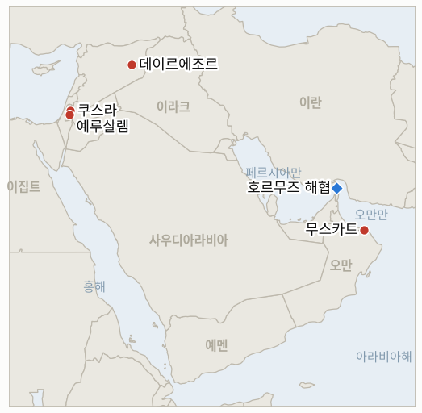

# 중동 일일 브리핑

**2026년 8월 19일**

- **보고 기간:** 약 24시간, 8월 18일 09:00 ~ 8월 19일 09:00 (한국시간)
- **종합 평가:** 화요일의 핵심 흐름은 워싱턴이 선언하는 통제력과 실제 수면 위 안전 사이의 간극이 더 벌어졌다는 점이다. 그리스 선적 벌크선 미노안 디그니티호가 호르무즈 해협을 빠져나가던 중 새벽에 기관실에 피격을 당해 기관장이 숨졌으며, 누구도 배후를 자처하지 않았다. 몇 시간 뒤 트럼프 대통령은 트루스 소셜에 호르무즈 해협을 "미국의 새 영토"로 선언하는 지도를 게시하며 "모든 기뢰는 제거되거나 폭발 처리됐다", 해협은 "정상적으로 운영되고 있다"고 썼고, 별도로 이란과 "진행 중이거나 예정된 회담이나 대화는 없다"고 밝혔다. 그럼에도 Kpler의 자체 통항 집계는 5월 이후 최저 수준에 가깝게 머물렀다. 이란 국회의장 모하마드 바게르 갈리바프는 "양해각서에 명시된 미국의 약속이 이행될 때까지" 해협이 열리지 않을 것이라고 답했고, 이란의 한 고위 당국자는 로이터에 별도로 외교가 실패할 경우 봉쇄를 뚫기 위해 "시의적절하고 정밀한 타격"을 가할 준비가 돼 있다고 밝혔다. 워싱턴포스트는 트럼프의 월요일 오만 폭격 위협이 이란-오만 해협 출구 공동 관리를 포함한 아직 발표되지 않은 이란-오만 합의의 일부에 대한 미국의 반대에서 비롯됐다고 보도했으며, 팀 케인 상원의원이 예고한 오만에 대한 군사 조치 금지 결의안은 이제 9월에 상원 본회의 표결에 오르는 것이 사실상 확정됐다. 시리아에서는 국제원자력기구 그로시 사무총장이 거의 20년 만에 처음으로 데이르에조르 현장에 대한 접근권을 얻어, 2007년 이스라엘이 파괴한 아사드 정권 시절 알키바르 원자로 계획과 연관된 "다량의 핵물질"을 발견했다고 밝혔다. 최종 합의와 검증된 제거에는 못 미치지만 이 사안을 마무리 짓는 데 지금까지 가장 구체적인 진전이다. 서안지구에서는 쿠스라 포위가 열흘째를 맞았다. 오하이오 출신 팔레스타인계 미국인 루이 리디가 돌아와 자택 지붕에 성조기를 게양한 뒤 다음 날 자신의 집을 점거한 정착민들에게 직접 항의하며 퇴거를 요구했으나, 이스라엘군은 정착민에게는 집행하지 않는 바로 그 군사 폐쇄 구역 명령을 근거로 그를 다시 집 안으로 들여보냈다. 한편 예루살렘포스트는 카츠 국방장관의 경찰 이관 계획이 IDF와 사전 조율 없이 발표됐으며, 미국의 압박과 IDF 법무 반대, 대법원 청원 가능성, 10월 27일 총선 등 여러 장애 요인에 직면해 있다고 보도했다. 유가는 사흘째 상승세를 이어가 브렌트유는 배럴당 91.12달러, WTI유는 85.11달러로 마감해 각각 7월 말 이후 최고치를 기록했으며, 호르무즈 피격과 이란의 강경 발언, 2007년 이후 최고치인 연 5.32%를 넘어선 30년물 미 국채 금리 급등이 겹치면서 한국 코스피는 1.55% 하락한 6,869.83으로 마감해 개장 초 2%까지 상승했던 흐름을 뒤집고 5거래일 연속 상승세를 마감했으며, 원화는 1,412.1원으로 소폭 강세를 보였다. 가자지구에서는 쿠슈너가 네타냐후와의 예루살렘 회동 하루 만에 하마스 무장해제에 30일에서 90일에 이르는 시간표를 제시했고 일부 보도는 이를 사실상의 최후통첩으로 규정했으나, 하마스는 이를 수용하지 않았고 이스라엘 안보내각의 공식 표결도 아직 이뤄지지 않았다.

---

## 1. 무슨 일이 있었나

<figure style="float:right; width:46%; margin:2pt 0 8pt 14pt;">

<figcaption style="font-size:8pt; color:#666; text-align:center; margin-top:3pt; font-style:italic;">주요 논의 지점</figcaption>
</figure>

### 1.1 호르무즈 치명적 피격이 트럼프의 새 영토 선언, 이란과의 회담 중단 발언과 겹치다

그리스 선적 벌크선 미노안 디그니티호가 화요일 새벽 오만 인근 호르무즈 해협을 빠져나가던 중 기관실에 발사체 피격을 당해 화재가 발생, 기관장이 숨졌다. 영국 해양무역작전국(UKMTO)은 승조원 사상자 발생을 확인했으며 오만 해안경비대가 남은 승조원을 지원하고 있다고 밝혔고, 이번 보고 기간 마감까지 배후를 자처한 조직은 없었다([유로뉴스](https://www.euronews.com/2026/08/18/ship-hit-in-hormuz-as-irans-top-negotiator-says-strait-to-stay-shut); [SAFETY4SEA](https://safety4sea.com/crew-member-killed-after-vessel-attack-and-engine-room-fire-in-strait-of-hormuz/)). 몇 시간 뒤 트럼프 대통령은 트루스 소셜에 호르무즈 해협을 "미국의 새 영토"로 선언하는 지도를 게시하며 "우리는 봉쇄를 통해 이곳을 통제하고 있으며, 이를 우리 영토로 선언하는 발상이 마음에 든다"고 썼고, 별도로 이란과 "진행 중이거나 예정된 회담이나 대화는 없다", "해상 봉쇄는 전면적으로 유지되고 있다", "호르무즈 해협은 정상적으로 운영되고 있다. 모든 기뢰는 제거되거나 폭발 처리됐다"고 밝혔다([예루살렘포스트](https://www.jpost.com/middle-east/iran-news/article-905890)). 이란 국회의장 모하마드 바게르 갈리바프는 "양해각서에 명시된 미국의 약속이 이행될 때까지" 해협이 열리지 않을 것이라며 봉쇄 해제와 원유 제재 해제, 이란 자산 동결 해제를 요구했고, 이란의 한 고위 당국자는 로이터에 별도로 테헤란이 "호르무즈 해협과 더 넓은 지역에서 긴장을 고조시킬" 준비가 돼 있으며 외교가 실패할 경우 봉쇄를 뚫기 위해 "시의적절하고 정밀한 타격"을 가하겠다고 밝혔다. 워싱턴포스트는 트럼프의 월요일 오만 폭격 위협이 이란-오만 해협 출구 공동 관리를 포함해 아직 발표되지 않은 이란-오만 합의의 일부에 대한 미 행정부의 반대에서 구체적으로 비롯됐다고 보도했으며, 팀 케인 상원의원이 예고한 오만에 대한 군사 조치 금지 결의안은 전쟁권한 결의가 특권적 지위를 가져 지도부가 상정을 미룰 수 없기 때문에 9월 상원 본회의 표결에 오르는 것이 사실상 확정됐다. 미노안 디그니티호 피격이 배후 세력에 의해 확인되거나 미국·연합군의 대응을 이끌어낼지를 시험하는 신규 **IND-20260819-1**이 개설된다. **신뢰도: 높음** — 피격과 사망(1~2등급, UKMTO, 다수 매체). **신뢰도: 높음** — 트럼프의 영토 선언과 "회담 없음" 발언(1등급, 본인의 트루스 소셜 게시물, 다수 매체). **신뢰도: 중상** — 트럼프의 오만 위협 배경에 대한 워싱턴포스트의 취재(1~2등급, 익명 당국자).

### 1.2 IAEA, 데이르에조르 20년 만의 첫 접근에서 미신고 핵물질 다량 발견

국제원자력기구 그로시 사무총장은 8월 17일부터 18일까지 다마스쿠스의 초청으로 시리아를 방문해, 2007년 이스라엘이 공습으로 파괴한 아사드 정권 시절 알키바르 원자로 계획과 연관된 데이르에조르 인근 현장과 미공개 제2 현장에 접근했다. 이는 기구가 데이르에조르 현장에 접근한 것으로는 거의 20년 만에 처음이다([The National](https://www.thenationalnews.com/news/mena/2026/08/18/iaea-and-syria-hail-progress-on-resolving-assads-nuclear-secrets/); [France 24](https://www.france24.com/en/middle-east/20260818-tons-of-nuclear-materials-found-at-undisclosed-syrian-site-iaea-chief-says)). 그로시 사무총장은 이전까지 미신고 상태였던 이 현장에서 "다량의 핵물질"을 발견했다고 밝혔으며, 시리아 외무장관 아사드 알샤이바니는 다마스쿠스가 7월 17일 IAEA에 서한을 보내 이 물질을 신고했다면서 이를 "축출된 정권의 유산을 다루는 것"이라 규정하고 "새로운 시리아는 국제사회와 평화적 핵 활동 협력을 기대한다"고 말했다([Axios](https://www.axios.com/2026/08/18/syria-nuclear-reactors-iaea)). 그로시 사무총장은 시리아가 "핵 비확산에 관한 모든 법적 의무를 완전히 준수하는 국가로서 국제사회에서의 지위를 되찾았다"고 밝혔으나, 이는 IND-20260812-2가 확증 조건으로 요구하는 최종 합의 및 검증된 물리적 제거에는 못 미치는 표현이어서 해당 지표는 계속 열린 상태로 유지된다. **신뢰도: 높음** — 현장 방문과 물질 발견, 발언 내용(1등급, IAEA 및 시리아 정부 발표, 다수 매체). **신뢰도: 중간** — 제거까지의 시간표는 공개되지 않아 불확실하다.

### 1.3 쿠스라 포위 열흘째, 카츠의 경찰 이관 계획이 사전 조율 없이 발표됐음이 드러나다

오하이오 출신의 46세 팔레스타인계 미국인 집주인 루이 리디는 월요일 군의 호위를 받으며 포위된 쿠스라 자택으로 돌아와 지붕에 성조기를 게양했다. 다음 날 그는 여전히 자신의 부지를 점거하고 있는 정착민들에게 직접 항의하며 퇴거를 요구했으나, 이스라엘군은 정작 정착민들에게는 집행하지 않는 바로 그 군사 폐쇄 구역 명령을 근거로 그를 다시 집 안으로 들여보냈다([WSLS/AP](https://www.wsls.com/news/world/2026/08/18/palestinian-american-returns-to-besieged-west-bank-home-but-israeli-settlers-remain/); [NPR](https://www.npr.org/2026/08/18/nx-s1-5936098/palestinian-american-return-west-bank)). 리디는 "군이 철수하는 순간... 정착민들이 다시 돌아올 수 있다"고 말했으며, 걱정하는 친지들에게는 "괜찮다, 안전하다고 거짓말을 해야 한다"고 밝혔다. 포위는 최소 열흘째 이어지고 있으며 일부 시설만 철거됐을 뿐 국제사회의 지속적인 규탄에도 체포는 전혀 없었다. 한편 예루살렘포스트는 월요일 발표된 카츠 국방장관의 서안지구 민간인 집행권 경찰 이관 계획이 사전에 IDF 고위 당국자들과 조율되지 않았으며, 다수 관계자가 월요일 회의 전까지 무엇이 제안되는지조차 이해하지 못했다고 보도했다. 이 계획은 미국의 외교적 압박, IDF 법무실·법무장관의 반대, 대법원 청원 가능성, 팔레스타인·이스라엘인이 뒤섞인 사건 처리의 현실적 어려움, 10월 27일 총선 등 여러 장애 요인에 직면해 있으며, 협의에는 "쉽게 수개월 혹은 그 이상 걸릴 수 있다"고 전했다([예루살렘포스트](https://www.jpost.com/israel-news/defense-news/article-905917)). 이관이 원래의 2주 시간표에 가깝게 진행될지, 지연되거나 무산될지를 시험하는 신규 **IND-20260819-2**가 개설된다. **신뢰도: 높음** — 리디의 귀환과 항의(1~2등급, 공식 취재, 직접 인용). **신뢰도: 높음** — 카츠 계획의 IDF 미조율 사실(1~2등급, 예루살렘포스트, IDF 소식통).

### 1.4 유가 91달러 돌파 지속, 코스피는 5거래일 연속 상승세 마감

브렌트유는 화요일 배럴당 91.12달러, WTI유는 85.11달러로 마감해 사흘 연속 상승하며 각각 7월 말 이후 최고치를 기록했다. 미국-이란 외교에 대한 기대 약화와 미노안 디그니티호 피격이 호르무즈 해상운송에 미치는 위축 효과가 겹친 결과다([CNBC](https://www.cnbc.com/amp/2026/08/18/oil-climbs-as-fading-us-iran-peace-hopes-raise-supply-risks.html)). 한국 코스피는 1.55% 하락한 6,869.83으로 마감해 5거래일 연속 상승세를 마감했다. 30년물 미국 국채 금리가 2007년 이후 최고치인 연 5.32%를 넘어섰고, 기관은 삼성전자를 포함해 순매도 7,800억 원을 기록했으며 삼성전자 주가는 2% 넘게 하락했다. 이는 반도체 낙관론에 힘입어 장 초반 최대 2%까지 상승했던 흐름을 뒤집은 것이다. 원화는 달러당 1,412.1원으로 소폭 강세를 보였다([코리아헤럴드](https://www.koreatimes.co.kr/economy/20260818/kospi-falls-as-high-us-treasury-yields-overshadow-ai-optimism); [코리아중앙데일리](https://www.koreajoongangdaily.com/business/kospi-closes-lower-to-snap-5day-winning-streak/12830551)). **신뢰도: 높음** — 유가 정산가와 코스피 종가 모두(1~2등급, 다수 금융 매체).

### 1.5 쿠슈너, 하마스가 수용하지 않은 30~90일 무장해제 시간표 제시

네타냐후와의 예루살렘 마라톤 회동 하루 만에 재러드 쿠슈너는 하마스의 무기 반출이 "이르면 30일 안에, 바라건대... 진전을 보일 수 있다"며 터널 매립은 "그 다음 60일에서 90일 사이"에 이어질 수 있다고 밝혔다. 이는 양측이 월요일 합의한 미군 장성의 감독 아래 진행되며, 이스라엘 매체는 반납된 무기가 가자지구의 새 기술관료 행정부가 관리하는 창고로 이전될 것이라고 보도했다([JNS](https://www.jns.org/news/israel-news/kushner-gaza-demilitarization-could-begin-within-30-days)). 쿠슈너의 발언은 동시에 하마스에 대한 압박으로도 작용했다. 한 보도는 이를 하마스가 무장해제하지 않으면 이스라엘이 미국의 지원을 받아 "임무를 완수"하게 될 것이라는 사실상의 최후통첩으로 규정했으며, 이는 월요일 보도된 실무그룹 절차보다 더 날카로운 태도다. 하마스 자신의 전제조건, 즉 이스라엘의 선철수와 국제사회의 팔레스타인 국가 지위 인정은 여전히 충족되지 않았고, 공식적인 이스라엘 안보내각 표결도 없었다([야후뉴스](https://www.yahoo.com/news/politics/articles/kushner-gives-hamas-stark-ultimatum-230043827.html)). 쿠슈너의 시간표는 하마스가 수용한 합의가 아니라 그 자신의 희망적 구상에 가깝기 때문에, IND-20260814-2의 "합의된 무장해제 시간표" 확증 조건은 8월 21일 시한을 사흘 앞둔 현재 아직 충족되지 않았다. **신뢰도: 높음** — 쿠슈너의 발언과 최후통첩 프레이밍(1~2등급, 공식 발언, 다수 매체). **신뢰도: 중간** — 하마스의 미충족 전제조건을 고려할 때 이 시간표가 실제 양측 합의를 반영하는지는 불확실하다.

---

## 2. 심층 분석: 유인과 동기

### 2.1 트럼프는 왜 치명적 피격이 자신의 "정상 운영" 주장을 무너뜨리는 바로 그날 호르무즈를 미국 영토라 선언하고 이란과의 회담을 배제했는가?

봉쇄가 출항하는 벌크선 한 척의 안전조차 보장하지 못한다는 사실을 인정하는 것은 그의 낙관적 발언 자체가 감추려는 바로 그 운영상의 실패를 자인하는 셈이기 때문이다. 영토 선언과 "회담 없음" 태도를 고수하는 것은 악화되는 상황을 실패가 아닌 결단의 증거로 재구성할 수 있게 해주며, 그 대가는 Kpler의 자체 통항 데이터와 화요일의 사망 사고가 실제로 보여주는 바와 트럼프의 발언 사이의 괴리가 점점 커지는 것이다.

### 2.2 시리아는 왜 20년간 거부해온 IAEA 접근을 지금 허용하며 미신고 핵물질을 다량 자진 신고했는가?

새 시리아 정부가 신빙성 있게 부인할 수 있는 아사드 정권의 은밀한 프로그램을 투명하게 공개하는 것은, 계속된 불투명성보다 훨씬 저렴한 비용으로 제재 완화와 국제사회 재편입을 여는 비확산 신뢰를 다마스쿠스에 안겨주기 때문이다. 특히 미국, 이스라엘, 튀르키예가 이미 물질 제거에 관한 양해에 도달했다고 보도된 상황에서, 이를 "축출된 정권의 유산"으로 신고하는 것은 알샤이바니 정부가 물질의 기원과는 거리를 두면서도 협력의 공을 주장할 수 있게 해준다.

### 2.3 카츠 장관은 왜 IDF와의 사전 조율 없이 서안지구 집행 이관을 공개 발표했는가, 지금 그 조율 부재가 계획 자체를 위협한다는 보도가 나오는데도?

벤그비르 연립 계열에 "주권을 향한 진전"이라는 가시적 성과를 안겨주는 정치적 효과는 쿠스라를 둘러싼 국제적 압박이 고조되는 가운데 발표하는 순간 이미 발생하기 때문이며, 실행 여부와는 무관하다. IDF 자체의 법무·작전상 이의 제기를 앞질러 발표함으로써 카츠는 즉각적인 대응력을 과시하는 공을 챙기는 한편, 실제로 이관이 이뤄질지에 관한 더 어려운 문제는 예루살렘포스트가 보도했듯 수개월이 걸리거나 10월 총선과 맞물릴 수 있는 절차로 미룰 수 있다.

### 2.4 시장은 왜 5거래일 연속 상승세와 달리 화요일의 유가 움직임을 한국 증시를 매도할 이유로 받아들였는가?

치명적인 호르무즈 피격, 트럼프의 "회담 없음" 발언, 급등하는 30년물 국채 금리가 겹치면서 전쟁이 한국 증시에 대한 완만한 할인 요인에서 이미 더 차분한 단기 전망을 반영해온 랠리에 대한 적극적인 차익 실현의 계기로 전환됐기 때문이다. 기관이 특히 삼성전자를 매도한 것은 한국 자체의 펀더멘털에 대한 전반적 재평가라기보다는 지수에서 가장 크고 금리에 민감한 종목에 대한 리스크 재가격화임을 시사한다.

### 2.5 쿠슈너는 왜 하마스가 동의하지 않은 구체적인 30~90일 무장해제 시간표를 실제 합의를 기다리지 않고 공개했는가?

공개적이고 검증 가능한 시한을 제시하는 것은 하마스에게 조건을 수용하거나 지연의 책임을 눈에 띄게 떠안으라는 압박을 스스로 가하게 만들며, 네타냐후가 양보가 아닌 절차만을 제시한 시점에 "누가 지연시키는가"라는 서사를 하마스 쪽으로 돌린다. 하마스가 이 시간표를 거부하면 워싱턴은 이스라엘의 무장해제 선행 순서가 애초부터 합리적이었다고 주장할 수 있고, 반대로 하마스가 응한다면 그 구체적 수치는 향후 양측 모두를 구속하는 기준이 된다.

---

## 3. 한국에 대한 정책적 함의

### 3.1 익스포저 현황

| 항목 | 현재 수치 | 출처 |
| --- | --- | --- |
| 원유 수입 중 중동 비중 | 48.5% (2026년 5~7월), 1년 전 69.1%에서 하락; 비중동 비중이 사상 처음 50%를 상회 | KNOC, 아시아경제 경유; `korea-exposure.md` |
| 7~8월 원유 조달 | 전년 동기 물량의 110% 이상 확보(산업부, 7월 21일); 비축유 스와프 8월까지 연장, 현재까지 약 2,100만 배럴 스와프 | 산업부, 헤럴드경제·한경 경유; `korea-exposure.md` |
| 9월 원유 조달 | 90% 이상 확보(산업부, 7월 21일) | 산업부, 헤럴드경제 경유; `korea-exposure.md` |
| 홍해 우회 항로 | 한국행 원유 화물이 얀부·홍해 우회로를 계속 이용 중; 한국을 포함한 아시아 매수처로의 얀부 수출량이 1년 전 하루 100만 배럴 미만에서 약 400만 배럴로 급증 | 로이즈리스트 인텔리전스; `korea-exposure.md` |
| 비축유 보유 여력 | 실제 소비 기준 약 26일분(추정); 스와프는 즉시 가동 대기 상태이나 대규모 실행은 미검증 | CSIS; 산업부 7월 27일 |
| 정유사 사우디 지분 익스포저 | S-Oil(사우디 아람코 과반 지분 약 63%), HD현대오일뱅크(아람코 지분 약 17%) | 공시 자료; `korea-exposure.md` |
| 브렌트유/WTI유 | 화요일 정산가 91.12달러/85.11달러, 호르무즈 치명적 피격이 미국-이란 외교 기대 약화와 겹치며 사흘 연속 상승, 7월 말 이후 최고치 | CNBC(화요일 정산가) |
| 코스피/원달러 환율 | 코스피 -1.55%로 6,869.83 마감, 2007년 이후 최고치인 30년물 미 국채 금리 속에 5거래일 연속 상승세 마감; 원화는 1,412.1원으로 소폭 강세 | 한국거래소(KRX); 코리아헤럴드, 코리아중앙데일리 |
| 호르무즈 통항량 | Kpler: 8월 17일 월요일 6척 통항(입항 3척, 출항 3척), 10일 평균 11척에 여전히 못 미치는 붕괴 국면 수준 | 로이터, Kpler 경유 |

### 3.2 사안별 함의

**배후가 확인되지 않은 치명적 호르무즈 피격이 트럼프의 영토 선언, 이란과의 회담 배제 발언과 같은 날 겹친 것은 오늘 가장 직접적인 한국 관련 신호다. 워싱턴이 선언하는 통제력과 실제 수면의 안전 사이의 간극이 계속 벌어지는 한, 한국 정유사의 얀부 우회로는 계속해서 유효한 헤지 수단으로 남는다.** 신규 IND-20260819-1(시한 9월 2일)은 배후 확인과 대응 여부를 검증하며, IND-20260817-2(시한 8월 31일)와 IND-20260810-1(시한 8월 20일, 하루 남음)은 각각 영토 주장과 외교 트랙 자체를 계속 추적하고, IND-20260818-1(시한 9월 1일)은 이제 배경 동기가 드러난 오만 위협의 결과를 계속 추적한다.

**IAEA의 시리아 핵물질 발견은 한국 시장에 직접적인 익스포저는 없으나, 서울이 걸프 지역과의 민간 원자력 협력을 확대하는 상황에서 1차적인 비확산 지표다.** IND-20260812-2(시한 9월 11일)는 오늘의 접근이 최종 합의와 검증된 제거로 이어질지를 계속 추적한다.

**쿠스라 열흘째와 새로 드러난 카츠 계획의 미조율 문제는 한국 시장에 직접적인 익스포저는 없으나, 이스라엘의 행정적 조치가 재명명을 넘어 실제로 측정 가능한 서안지구 사건 감소로 이어지는지를 계속 시험한다.** 신규 IND-20260819-2(시한 9월 1일)는 이관이 진행될지 정체될지를 검증하며, IND-20260813-3(시한 8월 27일)과 IND-20260815-2(시한 9월 12일)는 쿠스라의 해소 여부와 더 넓은 이관 효과를 계속 추적한다.

**화요일의 유가 움직임과 코스피의 상승세 중단은 오늘 한국 시장에 가장 직접적인 영향을 미친 사안이다. 치명적 피격, 강경해진 미국·이란 발언, 국채 금리 충격이 단 하루 만에 겹치면서 5거래일 연속 외국인 반도체 매수가 쌓아온 상승분을 지워버렸으며, 이는 중동發 위험과 금리發 위험이 동시에 작동할 때 한국 증시의 랠리가 얼마나 빠르게 반전될 수 있는지를 보여준다.** 이 시장 움직임 자체에 대해서는 신규 지표를 개설하지 않으며, 위 차트가 해당 지표를 직접 추적한다.

**하마스의 동의 없이 제시된 쿠슈너의 30~90일 가자지구 무장해제 시간표는, 한국의 지역 리스크 가격 형성이 그동안 유지해온 바로 그 지점, 즉 아직 존재하지 않는 합의에 계속 의존한 상태로 가자지구의 정상화 경로를 묶어둔다.** IND-20260814-2(시한 8월 21일, 사흘 남음)는 이번 주의 절차적 진전이 공식 안보내각 표결이나 실제 합의된 시간표로 전환될지를 계속 추적하며, IND-20260812-4(시한 8월 26일)는 안보내각 표결 문제를 별도로 계속 추적한다.

**검증 가능한 지표:**

- **IND-20260819-1** — 기관장이 숨지고 배후가 확인되지 않은 호르무즈 해협 벌크선 미노안 디그니티호 피격이 국가 행위자에 의해 배후가 확인되거나 미국·연합군의 군사 대응을 이끌어낼지, 아니면 이번 전쟁의 수많은 미확인·무응답 호르무즈 피격 목록에 합류할지를 검증한다. 2026년 9월 2일까지 이란이나 다른 국가 행위자에 대한 검증된 배후 확인, 또는 이 피격에 명시적으로 연계된 미국·연합군의 군사 대응이 있으면 피격이 실질적 결과로 이어졌음이 확증된다. 같은 시한까지 배후가 확인되지 않고 군사 대응도 없으면 이는 또 하나의 흡수된 미확인 피격으로 반증된다.
- **IND-20260819-2** — IDF와 사전 조율 없이 발표된 것으로 드러난 카츠 국방장관의 서안지구 경찰 집행 이관이 원래의 2주 시간표에 가깝게 진행될지, 아니면 보도된 여러 장애 요인으로 지연되거나 무산될지를 검증한다. 2026년 9월 1일까지 IDF가 이관 계획을 제출하고 시행을 시작하면 조율 부재에도 불구하고 계획이 진행됐음이 확증된다. 같은 시한까지 계획이 정체되거나 공식적으로 보류되거나 여전히 제출되지 않으면 이는 실행 역량을 앞지른 발표로 반증된다.
- **IND-20260819-3** — 상원이 휴회에서 복귀하는 9월에 특권적 지위로 본회의 표결이 사실상 확정된 케인 상원의원의 오만 관련 군사 조치 금지 전쟁권한 결의안이 실제로 표결에 부쳐져 통과될지, 아니면 부결되거나 철회되거나 특권적 지위에도 불구하고 본회의에 상정조차 되지 않을지를 검증한다. 2026년 9월 25일까지 상원 본회의 표결이 이뤄지고 결의안이 통과되면 제도적 반발이 오만 관련 군사 행동에 대한 구속력 있는 견제로 전환됐음이 확증된다. 같은 시한까지 결의안이 부결되거나 철회되거나 표결 자체가 이뤄지지 않으면 이는 실제 제약으로 전환되지 못한 보도된 긴급함으로 반증된다.

---

## 4. 관찰 목록

- **치명적인 미노안 디그니티호 피격의 배후가 확인되거나 군사 대응을 이끌어낼지** (IND-20260819-1, 시한 9월 2일).
- **카츠의 미조율 서안지구 경찰 이관이 진행될지, 지연되거나 무산될지** (IND-20260819-2, 시한 9월 1일).
- **케인 의원의 특권적 오만 관련 전쟁권한 결의안이 통과될지, 부결될지, 본회의 표결에 아예 오르지 못할지** (IND-20260819-3, 시한 9월 25일).
- **이란-오만 호르무즈 메커니즘이 명시적인 미국의 수용 발표나 3자 공동 발표를 이끌어낼지** (IND-20260810-1, 시한 8월 20일, 하루 남음).
- **트럼프의 오만 폭격 위협이 실질적인 외교적 또는 군사적 결과로 이어질지** (IND-20260818-1, 시한 9월 1일).
- **호르무즈를 미국 영토로 만들겠다는 트럼프의 공언이 화요일의 지도 게시를 넘어 구체적인 정책 조치로 이어질지** (IND-20260817-2, 시한 8월 31일).
- **IAEA의 시리아 핵물질 발견이 최종 합의와 검증된 제거로 전환될지** (IND-20260812-2, 시한 9월 11일).
- **6월 17일 양해각서의 통행료 면제 기간이 이제 만료된 가운데 실제 이란의 통행료 부과로 이어질지, 아니면 조용히 연장될지** (IND-20260814-1, 시한 8월 24일).
- **이스라엘의 준비된 알리 알타헤르 능선 작전이 실제로 개시될지** (IND-20260818-2, 시한 8월 31일).
- **사우디 해군 함정에 대한 후티의 공격 주장이 확인되거나 직접적인 사우디 대응을 이끌어낼지** (IND-20260818-3, 시한 9월 1일).
- **예멘의 확증된 다섯 개 주 확산이 갱신된 국제 중재를 이끌어낼지** (IND-20260817-1, 시한 8월 31일).
- **8월 15일 헤즈볼라-이스라엘 충돌이 추가 라운드로 이어질지, 아니면 양측이 휴전 이후 균형 상태로 물러날지** (IND-20260816-1, 시한 8월 29일).
- **로마 트랙이 잠정 예정한 9월 1일 8차 회담이 예정대로 진행될지** (IND-20260807-2, 시한 9월 1일).
- **가자지구 옐로 라인 사건들이 공식적인 IDF 작전 대응을 촉발할지, 아니면 고립된 사건으로 남을지** (IND-20260816-2, 시한 8월 30일).
- **쿠슈너가 제시한 시간표가 이번 주의 실무그룹 구성을 넘어 네타냐후의 입장을 바꿀지, 공식 안보내각 표결로 이어질지** (IND-20260814-2, 시한 8월 21일, 사흘 남음).
- **가자지구 무장해제 선행 프레임워크가 어떤 형태로든 이스라엘 안보내각의 공식 표결에 이를지** (IND-20260812-4, 시한 8월 26일).
- **베센트가 예고한 전례 없는 이란 경제 고립 조치가 구체적인 새 조치와 함께 실현될지** (IND-20260815-1, 시한 8월 22일).
- **쿠스라 포위가 실제로 해소될지, 열흘째에 접어들며 반증 쪽으로 더 기울고 있다** (IND-20260813-3, 시한 8월 27일).
- **미 해군의 무력 봉쇄 집행이나 이란이 위협한 "정밀 타격"이 실제 미국-이란 군사적 충돌로 이어질지** (IND-20260812-1, 시한 8월 26일).
- **이행 일정을 담은 서명된 이란-오만 호르무즈 공동성명이 나올지, 아니면 해상교통지도 합의가 다시 서명 직전에서 정체될지** (IND-20260816-3, 시한 9월 5일).
- **서안지구 IDF에서 경찰로의 집행 이관이 이번 보고 기간 드러난 조율 공백을 딛고 정착민 폭력을 줄일지, 그대로 유지될지** (IND-20260815-2, 시한 9월 12일).
- **이란의 경고에도 불구하고 시리아가 레바논 헤즈볼라에 대해 움직일지, 아니면 대립이 수사적 수준에 머물지** (IND-20260815-3, 시한 9월 15일).
- **캐롤라인 베젠기호 기름 유출이 샐비지 작업 시작 이후 억제될지.**
- **케슘섬 폭발이 실제 공격으로 확인될지, 오경보로 결론 날지.**

---

## 5. 출처 신뢰도 요약

| 주장 | 출처 | 신뢰도 |
| --- | --- | --- |
| 미노안 디그니티호 호르무즈 기관실 피격, 기관장 사망, 배후 자처 조직 없음 | 유로뉴스, SAFETY4SEA, UKMTO(1~2등급, 공식 해양 안보 보고, 다수 매체) | 높음 |
| 트럼프, 호르무즈를 "미국의 새 영토"로 선언하는 지도 게시; 이란과 "회담 없음" 발언; 해협 "정상 운영" 주장 | 예루살렘포스트(1등급, 트럼프 본인의 트루스 소셜 게시물, 다수 매체) | 높음 |
| 트럼프의 오만 폭격 위협, 이란-오만 해협 출구 공동 관리에 대한 반대가 배경 | 워싱턴포스트(KSAT 경유)(1~2등급, 익명 미 당국자) | 중상 |
| 갈리바프의 봉쇄 조건 발언; 고위 이란 당국자의 "정밀 타격" 경고 | 유로뉴스; 로이터(1~2등급, 공식 발언 및 고위 당국자 취재, 다수 매체) | 갈리바프 발언은 높음; 익명의 타격 경고는 중간 |
| 케인 의원의 오만 관련 전쟁권한 결의안, 9월 특권적 본회의 표결 사실상 확정 | 케인 상원의원실 보도자료; JNS(1~2등급, 상원의원 본인 발표, 다수 매체) | 높음 |
| IAEA 그로시 사무총장, 20년 만의 첫 데이르에조르 접근, 미신고 핵물질 "다량" 발견 | The National, France 24, Axios(1등급, IAEA·시리아 정부 발표, 다수 매체) | 높음 |
| 루이 리디, 포위된 쿠스라 자택 귀환, 정착민에게 항의, IDF에 의해 재입주 저지 | WSLS/AP, NPR(1~2등급, 현장 취재, 직접 인용) | 높음 |
| 카츠의 서안지구 경찰 이관 계획, IDF와 미조율, 여러 장애 요인 직면 | 예루살렘포스트(1~2등급, IDF 소식통) | 높음 |
| 브렌트유 91.12달러, WTI유 85.11달러 화요일 정산, 사흘 연속 상승 | CNBC(1~2등급, 다수 금융 매체) | 높음 |
| 코스피 1.55% 하락한 6,869.83으로 마감, 5거래일 연속 상승세 중단; 원화 1,412.1원으로 강세 | 코리아헤럴드, 코리아중앙데일리(1~2등급, 다수 한국 금융 매체) | 높음 |
| 호르무즈 통항량: 8월 17일 월요일 10일 평균 11척 대비 6척 통항 | 로이터, Kpler 경유 | 높음 |
| 쿠슈너, 하마스가 수용하지 않은 30~90일 가자지구 무장해제 시간표 제시, 일부 보도는 최후통첩으로 규정 | JNS, 야후뉴스(1~2등급, 공식 발언 인용, 다수 매체) | 발언 자체는 높음; 최후통첩 프레이밍과 하마스의 실제 수용 여부는 중간 |
