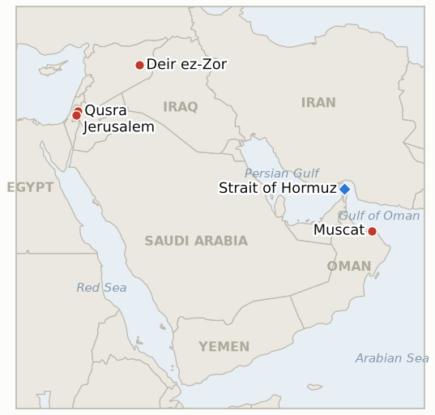

# Middle East Daily Briefing

**August 19, 2026**

- **Reporting window:** ~24 hours, August 18, 09:00 to August 19, 09:00 KST
- **Overall assessment:** Tuesday's throughline was the widening gap between Washington's rhetoric and the water beneath it. A projectile struck the Greek owned bulk carrier Minoan Dignity in the engine room while it transited outbound through the Strait of Hormuz before dawn, killing the chief engineer in an attack no group has claimed; hours later President Trump posted a map on Truth Social declaring the strait "new U.S. territory," wrote that "all water mines have been removed or detonated" and the strait is "open and operating," and separately said there were "no talks or conversations going on, or scheduled" with Iran, even as Kpler's own transit count sat near its lowest since May. Iran's parliament speaker Mohammad Bagher Ghalibaf answered that the strait "will not be opened until the American commitments stipulated in the memorandum of understanding... are implemented," and a senior Iranian official separately told Reuters Tehran is prepared to launch "timely and precise strikes" to break the naval blockade if diplomacy fails, while the Washington Post reported Trump's Monday threat to bomb Oman was driven specifically by US opposition to joint Iranian Omani management of the strait's exit route, and Senator Tim Kaine's promised war powers resolution barring military action against Oman is now guaranteed a privileged Senate floor vote in September. In Syria, IAEA Director General Rafael Grossi gained the agency's first access to the Deir Ezzor site in nearly twenty years and reported finding "tons of nuclear materials" tied to the Assad era Al Kibar reactor program that Israel destroyed in 2007, a concrete step toward closing the file though short of a concluded agreement and verified removal. In the West Bank, the Qusra siege reached a tenth day as Palestinian American landlord Loui Ridi returned from Ohio, raised an American flag over his home, then confronted the settlers still occupying his property the next day only to be ordered back inside by Israeli soldiers citing the same closed military zone order the IDF has otherwise declined to enforce against the settlers, while the Jerusalem Post reported Defense Minister Katz's police enforcement handover plan was never coordinated with the IDF and now faces potential obstacles from US pressure, IDF legal objections, High Court petitions and October's elections. Oil extended its climb into a third session, Brent settling at $91.12 and WTI at $85.11, both the highest since late July, and the combination of the Hormuz attack, Iran's hardened rhetoric and a surging 30 year US Treasury yield above 5.32% dragged South Korea's KOSPI down 1.55% to 6,869.83, snapping a five session winning streak even after the index had opened as much as 2% higher, while the won firmed marginally to 1,412.1. And in Gaza, Jared Kushner floated a 30 to 90 day Hamas disarmament timeline a day after his Jerusalem meeting with Netanyahu, framed by some reporting as a stark ultimatum, though Hamas has not accepted it and no formal Israeli Security Cabinet vote has occurred.

---

## 1. What Happened

<figure style="float:right; width:46%; margin:2pt 0 8pt 14pt;">

<figcaption style="font-size:8pt; color:#666; text-align:center; margin-top:3pt; font-style:italic;">Major places of discussion</figcaption>
</figure>

### 1.1 A Fatal Hormuz Attack Meets Trump's Claim of New US Territory and No Talks With Iran

A projectile struck the Greek owned bulk carrier Minoan Dignity in the engine room while it was transiting outbound through the Strait of Hormuz off Oman early Tuesday, sparking a fire and killing the chief engineer; the UK Maritime Trade Operations Centre confirmed a crew casualty and said the Omani Coast Guard was assisting the remaining crew, and no group had claimed responsibility as of this window's close ([Euronews](https://www.euronews.com/2026/08/18/ship-hit-in-hormuz-as-irans-top-negotiator-says-strait-to-stay-shut); [SAFETY4SEA](https://safety4sea.com/crew-member-killed-after-vessel-attack-and-engine-room-fire-in-strait-of-hormuz/)). Hours later President Trump posted a map on Truth Social declaring the Strait of Hormuz "new U.S. territory," writing "We control it through the blockade, and I like the idea of declaring it our territory," and separately posted that there were "no talks or conversations going on, or scheduled, with the Islamic Republic of Iran," that "the Naval Blockade remains in full force and effect," and that "the Hormuz Strait is open and operating. All water mines have been removed or detonated" ([Jerusalem Post](https://www.jpost.com/middle-east/iran-news/article-905890)). Iran's parliament speaker Mohammad Bagher Ghalibaf countered that the strait "will not be opened until the American commitments stipulated in the memorandum of understanding... are implemented," demanding an end to the blockade, lifting of oil sanctions and unfreezing of Iranian assets, while a senior Iranian official separately told Reuters Tehran is prepared "to escalate tensions in the Strait of Hormuz and wider region" and launch "timely and precise strikes" to break the blockade if diplomacy fails. The Washington Post reported that Trump's Monday threat to bomb Oman was driven specifically by administration opposition to parts of the still unannounced Iran Oman Hormuz deal, including joint Iranian and Omani management of the strait's exit route, and Senator Tim Kaine's promised war powers resolution barring military action against Oman is now all but guaranteed a Senate floor vote in September because such resolutions are privileged and cannot simply be left unscheduled by leadership. New **IND-20260819-1** opens to test whether the Minoan Dignity attack is ever attributed to a state actor or draws a US or coalition military response. **Confidence: High** on the attack and fatality (Tier 1-2, UKMTO, multi-outlet); **High** on Trump's territorial claim and "no talks" statement (Tier 1, his own Truth Social posts, multi-outlet); **Medium-High** on the Washington Post's sourcing of Trump's underlying Oman motive (Tier 1-2, unnamed officials).

### 1.2 IAEA Finds Tons of Undeclared Nuclear Material at a Secret Syrian Site in First Deir Ezzor Access in Two Decades

IAEA Director General Rafael Grossi visited Syria August 17 to 18 at Damascus's invitation, gaining access to a site near Deir Ezzor and a second undisclosed location tied to the Assad era Al Kibar reactor project that Israel destroyed in a 2007 airstrike, the agency's first access to the Deir Ezzor site in nearly twenty years ([The National](https://www.thenationalnews.com/news/mena/2026/08/18/iaea-and-syria-hail-progress-on-resolving-assads-nuclear-secrets/); [France 24](https://www.france24.com/en/middle-east/20260818-tons-of-nuclear-materials-found-at-undisclosed-syrian-site-iaea-chief-says)). Grossi said inspectors found "tons of nuclear materials" at the previously undeclared site, while Syria's Foreign Minister Asaad al-Shaibani said Damascus disclosed the material in a July 17 letter to the IAEA, framing it as "the ousted regime's legacy regarding nuclear activities" while "the new Syria looks forward to co-operating with the international community on peaceful nuclear activities" ([Axios](https://www.axios.com/2026/08/18/syria-nuclear-reactors-iaea)). Grossi said Syria had "regained its place in the international community as a state fully complying with all its legal obligations on nuclear non-proliferation," language that marks the most concrete step yet toward closing the file but stops short of the concluded agreement and verified physical removal IND-20260812-2 requires to confirm, so that indicator stays Open. **Confidence: High** on the site visit, the material's discovery and the quotes (Tier 1, IAEA and Syrian government statements, multi-outlet); **Medium** on the timeline to removal, since none was disclosed.

### 1.3 Qusra's Siege Reaches a Tenth Day as Katz's Police Handover Plan Is Revealed to Be Uncoordinated

Loui Ridi, a 46 year old Palestinian American landlord from Ohio, returned to his besieged Qusra home under military escort Monday and raised an American flag over the roof; the next day he confronted the settlers still occupying his property and demanded they leave, only for Israeli soldiers to order him back inside, citing the same closed military zone order the IDF has otherwise declined to enforce against the settlers themselves ([WSLS/AP](https://www.wsls.com/news/world/2026/08/18/palestinian-american-returns-to-besieged-west-bank-home-but-israeli-settlers-remain/); [NPR](https://www.npr.org/2026/08/18/nx-s1-5936098/palestinian-american-return-west-bank)). Ridi said "as soon as [Israeli soldiers] leave... the settlers may come back," and that he has to "lie and say, 'No, I'm safe, I'm OK'" to worried relatives; the siege has now lasted at least ten days with only isolated structures dismantled and no arrests despite sustained international condemnation. Separately, the Jerusalem Post reported that Defense Minister Katz's plan to transfer West Bank civilian enforcement from the IDF to police, announced Monday, was never coordinated with top IDF authorities beforehand, to the point that many did not understand what was being proposed until a Monday meeting, and now faces potential obstacles including US diplomatic pressure, opposition from the IDF legal division and attorney general, possible High Court petitions, practical difficulties with mixed Palestinian-Israeli incidents, and Israel's October 27 elections, with negotiations that could "easily take months, if not longer" ([Jerusalem Post](https://www.jpost.com/israel-news/defense-news/article-905917)). New **IND-20260819-2** opens to test whether the handover proceeds on anything close to its original two week timeline or is delayed or blocked outright. **Confidence: High** on Ridi's return and confrontation (Tier 1-2, on record, multi-outlet); **High** on the Katz plan's lack of IDF coordination (Tier 1-2, Jerusalem Post sourcing).

### 1.4 Oil Extends Gains Past 91 Dollars as KOSPI Snaps Its Five Day Winning Streak

Brent crude settled at $91.12 and WTI at $85.11 Tuesday, both climbing for a third straight session to their highest levels since late July, as fading hopes for a US-Iran deal and the Minoan Dignity attack's chilling effect on Hormuz shipping compounded each other ([CNBC](https://www.cnbc.com/amp/2026/08/18/oil-climbs-as-fading-us-iran-peace-hopes-raise-supply-risks.html)). South Korea's KOSPI closed down 1.55% at 6,869.83, snapping a five session winning streak, as the 30 year US Treasury yield surged to its highest since 2007 above 5.32% and institutions sold a net 780 billion won of shares including Samsung Electronics, down more than 2%, even after the index had opened as much as 2% higher on continued chip optimism; the won firmed marginally to 1,412.1 per dollar ([Korea Herald](https://www.koreatimes.co.kr/economy/20260818/kospi-falls-as-high-us-treasury-yields-overshadow-ai-optimism); [Korea JoongAng Daily](https://www.koreajoongangdaily.com/business/kospi-closes-lower-to-snap-5day-winning-streak/12830551)). **Confidence: High** on both the oil settle figures and the KOSPI close (Tier 1-2, multi-outlet financial press).

### 1.5 Kushner Floats a 30 to 90 Day Gaza Disarmament Timeline Hamas Has Not Accepted

A day after his marathon Jerusalem meeting with Netanyahu, Jared Kushner said Hamas weapons removal "could be seeing progress... in as little as 30 days, hopefully, starting to take some of the weapons out," with tunnel filling to follow "in the next 60 to 90 days," under the US general oversight both sides agreed to Monday, while Israeli media reported surrendered weapons would go to warehouses controlled by Gaza's new technocratic administration ([JNS](https://www.jns.org/news/israel-news/kushner-gaza-demilitarization-could-begin-within-30-days)). Kushner's framing doubled as pressure on Hamas, described by one report as a "stark ultimatum" that the group disarm or Israel would get US backing to "finish the job," a sharper posture than the working group process reported Monday, even as Hamas's own precondition, that Israel first withdraw and the international community recognize Palestinian statehood, remains unmet and no formal Israeli Security Cabinet vote has occurred ([Yahoo News](https://www.yahoo.com/news/politics/articles/kushner-gives-hamas-stark-ultimatum-230043827.html)). Because Kushner's timeline is his own aspirational framing rather than a timeline Hamas has accepted, IND-20260814-2's "agreed disarmament timeline" confirmation branch is not yet satisfied at three days from its August 21 deadline. **Confidence: High** on Kushner's quote and the ultimatum framing (Tier 1-2, on record, multi-outlet); **Medium** on whether the timeline reflects genuine two-sided agreement, given Hamas's unmet precondition.

---

## 2. Deep Dive: Incentives and Motives

### 2.1 Why would Trump escalate to claiming Hormuz as US territory and rule out talks with Iran the same day a fatal attack undercuts his "open and operating" claim?

Because acknowledging that the blockade cannot even guarantee the safety of an outbound bulk carrier would concede exactly the operational failure his optimistic claims are designed to paper over; doubling down on the territorial claim and the "no talks" posture lets Trump reframe a deteriorating security picture as evidence of resolve rather than failure, at the cost of making his public rhetoric increasingly detached from what Kpler's own transit data and Tuesday's fatality actually show.

### 2.2 Why would Syria voluntarily disclose tons of undeclared nuclear material now, inviting IAEA access it had refused for two decades?

Because transparency about the Assad regime's clandestine program, something the new Syrian government can credibly disown as "the ousted regime's legacy," buys Damascus nonproliferation credibility that unlocks sanctions relief and international reintegration far more cheaply than continued opacity would, especially with the US, Israel and Turkey already reported to have reached understandings on eventually removing the material; disclosing it lets al-Shaibani's government claim credit for cooperation while distancing itself from the material's origin.

### 2.3 Why would Katz publicly announce the West Bank enforcement handover before securing IDF buy-in, given that the lack of coordination is now reported to threaten the plan itself?

Because the political value of the announcement, delivering Ben Gvir's coalition bloc a visible "step toward sovereignty" amid mounting international pressure over Qusra, accrues the moment it is made regardless of whether implementation follows; front-running the IDF's own legal and operational objections lets Katz claim credit for responsiveness now while leaving the harder question of whether the transfer actually happens to a process that, per the Jerusalem Post's reporting, could still take months or run into October's elections.

### 2.4 Why did markets treat Tuesday's oil move as a reason to sell Korean equities specifically, rather than treat it as background noise the way five straight up days had?

Because the combination of a fatal Hormuz attack, Trump's "no talks" statement and a surging 30 year Treasury yield converted the war from a slow-burning discount on Korean equities into an active reason for profit-taking on a rally that had already priced in a calmer near-term outcome; institutions selling specifically into Samsung Electronics signals a repricing of risk on the index's largest, most rate-sensitive component rather than a broad reassessment of Korea's own fundamentals.

### 2.5 Why would Kushner publicize a specific 30 to 90 day disarmament timeline that Hamas has not agreed to, rather than wait for an actual deal?

Because putting a public, falsifiable clock on the process creates pressure on Hamas to either accept the terms or visibly own the delay, shifting the "who is stalling" narrative onto Hamas at a moment when Netanyahu has offered only process, not concessions; if Hamas rejects the timeline outright, Washington can argue Israel's disarmament-first sequencing was reasonable all along, while if Hamas engages, the specific numbers become a benchmark both sides can be held to going forward.

---

## 3. Policy Implications for South Korea

### 3.1 Exposure snapshot

| Item | Current reading | Source |
| --- | --- | --- |
| Middle East share of crude imports | 48.5% (May-July 2026), down from 69.1% a year earlier; non-Middle East share crossed 50% for the first time on record | KNOC via Asia Business Daily; `korea-exposure.md` |
| July-August crude procurement | 110%+ of prior-year volume secured (MOTIE, July 21); strategic reserve swap extended through August, ~21 million barrels swapped to date | MOTIE via Herald Business, Hankyung; `korea-exposure.md` |
| September crude procurement | 90%+ secured (MOTIE, July 21) | MOTIE via Herald Business; `korea-exposure.md` |
| Red Sea detour routing | Korean-bound crude cargoes continue via the Yanbu/Red Sea workaround; Yanbu exports to Asian buyers including Korea have surged to ~4 million bpd from under 1 million bpd a year earlier | Lloyd's List Intelligence; `korea-exposure.md` |
| Strategic reserve coverage | ~26 days of actual consumption (estimate); swap on immediate standby, untested at scale | CSIS; MOTIE July 27 |
| Refiner Saudi ownership exposure | S-Oil (Saudi Aramco majority ~63%), HD Hyundai Oilbank (Aramco ~17%) | Public filings; `korea-exposure.md` |
| Brent / WTI | Tuesday settle $91.12 / $85.11, both up for a third straight session to their highest since late July, as a fatal Hormuz attack compounded fading US-Iran diplomacy | CNBC (Tuesday settle) |
| KOSPI / USD-KRW | KOSPI -1.55% to 6,869.83, snapping a five session winning streak as 30-year US Treasury yields hit their highest since 2007; won firmed marginally to 1,412.1 | KRX; Korea Herald, Korea JoongAng Daily |
| Hormuz transits | Kpler: 6 vessels transited Monday August 17 (3 inbound, 3 outbound) against a 10-day average of 11, still near the disruption regime's lows | Reuters via Kpler |

### 3.2 Implications by development

**A fatal, unattributed Hormuz attack landing the same day Trump claims the strait as US territory and rules out talks with Iran is today's most direct Korea relevant signal: the gap between Washington's declared control and the water's actual security keeps widening, and Korean refiners' Yanbu workaround remains the operative hedge for as long as that gap persists.** New IND-20260819-1 (deadline ~September 2) tests attribution and response; IND-20260817-2 (deadline August 31) and IND-20260810-1 (deadline August 20, one day out) continue tracking the underlying territorial claim and the diplomatic track respectively; IND-20260818-1 (deadline September 1) continues tracking the Oman threat's consequences now that its underlying motive is reported.

**The IAEA's Syria nuclear material find has no direct Korean market exposure but is a first-order nonproliferation marker for a region where Seoul is expanding its own civil nuclear cooperation.** IND-20260812-2 (deadline September 11) continues tracking whether today's access converts into a concluded agreement and verified removal.

**Qusra's tenth day and the newly uncoordinated Katz enforcement plan have no direct Korean market exposure but continue to test whether Israel's administrative measures ever produce a measurable reduction in West Bank incidents rather than another relabeled enforcement gap.** New IND-20260819-2 (deadline ~September 1) tests whether the handover proceeds or stalls; IND-20260813-3 (deadline August 27) and IND-20260815-2 (deadline September 12) continue tracking Qusra's resolution and the broader handover's effect.

**Tuesday's oil move and the KOSPI's snapped winning streak are today's clearest direct Korea market impact: a single day's combination of a fatal attack, hardened US and Iranian rhetoric, and a Treasury-yield shock was enough to erase gains five straight sessions of foreign chip buying had built, underscoring how quickly Korea's own rally can reverse on Middle East and rate-driven risk simultaneously.** No new indicator opens on the market move itself; the chart above tracks the series directly.

**Kushner's 30 to 90 day Gaza disarmament timeline, floated without Hamas's agreement, keeps Gaza's path to normalization exactly where Korea's regional risk pricing has kept it: contingent on a deal that does not yet exist.** IND-20260814-2 (deadline August 21, three days out) continues tracking whether this week's process momentum converts into a formal cabinet vote or a genuinely agreed timeline; IND-20260812-4 (deadline August 26) continues tracking the cabinet vote question separately.

**Testable indicators:**

- **IND-20260819-1** — The Minoan Dignity attack on a bulk carrier in the Strait of Hormuz, which killed its chief engineer and remains unclaimed, is attributed to a state actor or draws a US or coalition military response, or stays an unattributed, unanswered incident like most other Hormuz attacks this war. A verified attribution to Iran or another state actor, or a US/coalition military response explicitly tied to this attack, by ~2026-09-02, confirms the attack carried real consequences; continued absence of attribution and no military response through the same date falsifies it as another absorbed, unattributed strike.
- **IND-20260819-2** — Defense Minister Katz's West Bank police enforcement handover, revealed to have been announced without IDF coordination, proceeds on anything close to its original two week timeline, or is delayed or blocked by the legal, diplomatic and political obstacles the Jerusalem Post reported. The IDF submitting and beginning implementation of a handover plan by ~2026-09-01 confirms the plan proceeded despite the coordination gap; the plan stalling, being formally shelved, or remaining unsubmitted through the same date falsifies it as an announcement that outran its own implementation capacity.
- **IND-20260819-3** — Senator Kaine's war powers resolution barring military action against Oman, now guaranteed a privileged Senate floor vote once the chamber returns from recess in September, actually receives that vote and passes, or fails, is withdrawn, or never reaches the floor despite its privileged status. A Senate floor vote occurring and the resolution passing, by ~2026-09-25, confirms institutional pushback converted into a binding check on Oman-related military action; the resolution failing, being withdrawn, or no vote occurring through the same date falsifies it as reported urgency that did not convert into actual constraint.

---

## 4. Watch List

- **Whether the fatal Minoan Dignity attack is ever attributed or draws a military response** (IND-20260819-1, deadline September 2).
- **Whether Katz's uncoordinated West Bank police handover proceeds or is delayed or blocked** (IND-20260819-2, deadline September 1).
- **Whether Kaine's privileged war powers resolution on Oman passes, fails, or never reaches a floor vote** (IND-20260819-3, deadline September 25).
- **Whether the Iran-Oman Hormuz mechanism ever draws an explicit US acceptance statement or joint three-way announcement** (IND-20260810-1, deadline August 20, one day out).
- **Whether Trump's threat to bomb Oman produces any real diplomatic or military consequence** (IND-20260818-1, deadline September 1).
- **Whether Trump's declared intent to make Hormuz US territory produces any concrete policy step beyond Tuesday's map post** (IND-20260817-2, deadline August 31).
- **Whether the IAEA's Syria nuclear material find converts into a concluded agreement and verified removal** (IND-20260812-2, deadline September 11).
- **Whether the June 17 MOU's toll free Hormuz window, now lapsed, converts into actual Iranian tolls or a quiet extension** (IND-20260814-1, deadline August 24).
- **Whether Israel's prepared Ali al Taher ridge operation actually launches** (IND-20260818-2, deadline August 31).
- **Whether the Houthis' claimed strike on Saudi naval vessels is confirmed or draws a direct Saudi response** (IND-20260818-3, deadline September 1).
- **Whether Yemen's confirmed five governorate spread draws renewed international mediation** (IND-20260817-1, deadline August 31).
- **Whether the August 15 Hezbollah-Israel exchange triggers a further round or both sides step back to the post-truce equilibrium** (IND-20260816-1, deadline August 29).
- **Whether the Rome track's provisionally scheduled September 1 eighth round proceeds** (IND-20260807-2, deadline September 1).
- **Whether the Gaza Yellow Line incidents prompt a formal IDF operational response or stay isolated** (IND-20260816-2, deadline August 30).
- **Whether Kushner's floated timeline moves Netanyahu's position beyond this week's working groups, and whether a formal cabinet vote follows** (IND-20260814-2, deadline August 21, three days out).
- **Whether the Gaza disarm-first framework ever reaches a formal Israeli Security Cabinet vote in any form** (IND-20260812-4, deadline August 26).
- **Whether Bessent's promised unprecedented Iran economic isolation package materializes with concrete new measures** (IND-20260815-1, deadline August 22).
- **Whether the Qusra siege is ever actually resolved, now trending further toward falsification at its tenth day** (IND-20260813-3, deadline August 27).
- **Whether the US Navy's kinetic blockade enforcement, or Iran's threatened "precise strikes," draws an actual US-Iran military exchange** (IND-20260812-1, deadline August 26).
- **Whether a signed Iran-Oman Hormuz joint statement with an operating date is reached, or the shipping map deal stalls again short of signature** (IND-20260816-3, deadline September 5).
- **Whether the West Bank IDF-to-police enforcement transfer reduces settler violence, or leaves it unchanged, given the coordination gap this window revealed** (IND-20260815-2, deadline September 12).
- **Whether Syria moves against Hezbollah in Lebanon despite Iran's warning, or the confrontation stays rhetorical** (IND-20260815-3, deadline September 15).
- **Whether the Caroline Bezengi oil spill is contained now that salvage work has begun.**
- **Whether the Qeshm Island explosions are ever confirmed as a real strike or resolved as a false alarm.**

---

## 5. Source Quality Summary

| Claim | Sources | Confidence |
| --- | --- | --- |
| Minoan Dignity struck in Hormuz engine room, chief engineer killed, no group claims responsibility | Euronews, SAFETY4SEA, UKMTO (Tier 1-2, official maritime security reporting, multi-outlet) | High |
| Trump posts map declaring Hormuz "new U.S. territory"; says "no talks" scheduled with Iran; claims strait "open and operating" | Jerusalem Post (Tier 1, Trump's own Truth Social posts, multi-outlet) | High |
| Trump's Oman bomb threat driven by opposition to joint Iran-Oman exit-route management | Washington Post via KSAT (Tier 1-2, unnamed US officials) | Medium-High |
| Ghalibaf's statement on blockade conditions; senior Iranian official's "precise strikes" warning | Euronews; Reuters (Tier 1-2, on-record and senior-official sourcing, multi-outlet) | High on Ghalibaf; Medium on the anonymous strikes warning |
| Kaine's war powers resolution guaranteed a privileged Senate floor vote in September | Kaine Senate press release; JNS (Tier 1-2, senator's own statement, multi-outlet) | High |
| IAEA's Grossi gains first Deir Ezzor access in 20 years, finds "tons" of undeclared nuclear material | The National, France 24, Axios (Tier 1, IAEA and Syrian government statements, multi-outlet) | High |
| Loui Ridi returns to besieged Qusra home, confronts settlers, ordered back inside by IDF | WSLS/AP, NPR (Tier 1-2, on-scene reporting, direct quotes) | High |
| Katz's West Bank police handover plan uncoordinated with IDF, faces multiple potential obstacles | Jerusalem Post (Tier 1-2, IDF sourcing) | High |
| Brent settles $91.12, WTI $85.11 Tuesday, third straight gain | CNBC (Tier 1-2, multi-outlet financial press) | High |
| KOSPI falls 1.55% to 6,869.83, snapping five-session streak; won firms to 1,412.1 | Korea Herald, Korea JoongAng Daily (Tier 1-2, multi-outlet Korean financial press) | High |
| Hormuz transits: 6 vessels Monday August 17 against a 10-day average of 11 | Reuters via Kpler | High |
| Kushner floats 30 to 90 day Gaza disarmament timeline, framed as an ultimatum by some reporting | JNS, Yahoo News (Tier 1-2, on-record quote, multi-outlet) | High on the quote; Medium on the ultimatum framing and Hamas's actual acceptance |
