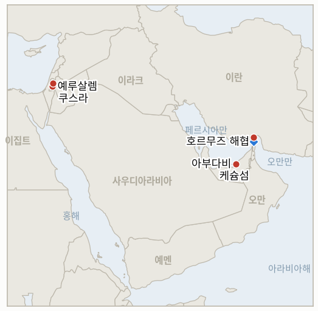

# 중동 일일 브리핑

**2026년 8월 20일**

- **보고 기간:** 약 24시간, 8월 19일 09:00 ~ 8월 20일 09:00 (한국시간)
- **종합 평가:** 수요일 전쟁은 걸프 4번째 국가로 번졌고 한국은 이번 전쟁 통틀어 가장 격렬한 하루를 겪었다. UAE 국방부는 자국 방공망이 이란에서 발사된 탄도미사일 2발을 탐지했으며 해상 항로를 겨냥한 것으로 평가된다고 밝혔다. 첫 번째 미사일은 UAE 영해 밖에, 두 번째는 영해 안에 떨어졌다. UAE는 즉각적이고 무기한적인 대이란 전면 무역·금융 거래 중단을 명령했고, 이란 외무부 대변인 에스마일 바가에이는 이 주장을 "근거 없다"며 반박하고 선린 관계 원칙에 어긋난다고 지적하면서 미국과 이스라엘의 지속적인 악의적 행위 속에서 벌어진 "위장 공작"일 가능성까지 시사했다. 이 사건은 이미 흔들리고 있던 호르무즈 "통제" 구도 위에 겹쳐졌다. 이란 혁명수비대는 케슘섬 남쪽에서 UAE 연계 유조선이 이란이 지정한 북쪽 항로를 따르지 않고 통행료 납부를 거부했다는 이유로 이를 나포해 억류한 것으로 전해졌고, 별도의 UAE 유조선 아마라호는 케슘섬 인근에서 최소 다섯 차례 불규칙한 방향 전환 끝에 멈춰 섰으며, 홍콩 선적에 중국인 승선원을 태운 초대형 유조선 두 척, 세아브이호와 헤스티아호는 해협 한복판에서 통항을 완료하지 않고 회항해, 트럼프 대통령이 화요일 해협이 "정상 운영되고 있다"고 밝힌 지 하루 만에 이를 무색하게 했다. 이런 위험이 겹치면서 유가는 나흘 연속 상승해 브렌트유는 배럴당 91.62달러, WTI유는 85.83달러로 마감해 각각 7월 24일 이후 최고치를 기록했다. 한편 한국 코스피는 개장과 동시에 6%대 넘게 급락하며 개장 5분 만에 매도 사이드카를 발동시켰다. 올해 48번째 사이드카였다. 지수는 결국 5.8% 하락한 6471.17로 마감했으며 외국인은 3조4800억 원어치를 순매도했고 삼성전자와 SK하이닉스는 각각 7% 넘게 떨어졌다. 이는 2007년 이후 최고치인 연 5.33%를 넘어선 30년물 미국 국채 금리가 중동 리스크와 직접 겹친 결과다. 그럼에도 원화는 오히려 강세를 보이며 한때 1396원까지 올랐다가 1398.27원으로 마감해, 10월 초 이후 처음으로 1400원 밑으로 내려갔다. 미국의 부진한 경제지표에 따른 전반적인 달러 약세와 수출기업의 달러 매도가 겹치면서 통화가 같은 날 벌어진 주식 폭락과는 다른 흐름을 탄 것이다. 가자지구에서는 국무부가 수요일 공개된 서한에서 가자지구 국제안정화군에 2억600만 달러를 지원하겠다고 의회에 통보했다. 장비·기반시설·운영비로 2억 달러, 미군 장갑차 재배치용으로 600만 달러다. 트럼프 로드맵에 대한 미국의 첫 실질적 자금 지원이지만, 이스라엘과 하마스 어느 쪽도 이 병력이 실제로 그 역할을 하게 할 무장해제 조건을 아직 수용하지 않은 상태다. 서안지구에서는 쿠스라 포위가 열하루째를 맞았다. 유엔 인도주의 요원들이 갇혀 있는 약 13명의 주민에게 접근했고 지방정부 인력이 상하수도와 전기를 복구했지만, 정착민들은 여전히 매일같이 지역을 배회하고 있고 IDF는 스스로 내린 군사 폐쇄 구역 명령을 정착민들에게는 집행하지 않고 있으며, 카츠 국방장관이 정한 IDF 이관 계획 제출 2주 시한이 제출 보고 없이 점점 다가오고 있다.

---

## 1. 오늘의 주요 사건

<figure style="float:right; width:46%; margin:2pt 0 8pt 14pt;">

<figcaption style="font-size:8pt; color:#666; text-align:center; margin-top:3pt; font-style:italic;">주요 논의 지점</figcaption>
</figure>

### 1.1 UAE, 이란 탄도미사일 2발 탐지 후 대이란 전면 무역 중단

UAE 국방부는 화요일 자국 방공망이 이란에서 발사돼 자국을 향한 탄도미사일 2발을 탐지했으며, 지상 목표물이 아닌 해상 항로를 겨냥한 것으로 평가된다고 밝혔다. 첫 번째 미사일은 UAE 영해 밖에, 두 번째는 영해 안에 각각 떨어졌으며 모두 바다에 낙하해 지상 피해나 인명 피해는 보고되지 않았다([워싱턴포스트](https://www.washingtonpost.com/world/2026/08/19/uae-says-it-is-suspending-trade-with-iran-after-missile-attack/); [알자지라](https://www.aljazeera.com/news/2026/8/19/uae-imposes-indefinite-trade-embargo-on-iran-over-alleged-missile-attacks)). 이에 대응해 UAE는 이란과의 모든 무역·경제 교류·금융 거래를 즉각적이고 무기한으로 중단하라고 명령했으며, 이러한 지역 긴장 고조가 지역 및 국제 평화와 안보를 훼손한다고 밝혔다. 이란 외무부 대변인 에스마일 바가에이는 몇 시간 뒤 이 주장을 "근거 없다"며 반박하고, UAE의 이러한 태도가 선린 관계 원칙에 어긋나며 지역 신뢰 구축 노력을 저해한다고 말했고, 별도로 미국과 이스라엘의 지속적인 악의적 행위 속에서 벌어진 "위장 공작"일 가능성까지 시사했다([신화통신](https://english.news.cn/20260819/58ffc5e0974f45558bdbb429f26f907b/c.html)). 이 보고 기간 마감 시점까지 다른 걸프 국가나 미국 어느 쪽도 UAE의 배후 지목을 독자적으로 뒷받침하지 않았다. 신규 지표 **IND-20260820-1**이 개설돼 이란 배후설의 독자적 확인 여부, 대안적 설명의 등장 여부, 또는 이 갈등이 더 넓은 걸프 지역 또는 미국의 군사적 대응으로 확대되는지를 시험한다. **신뢰도: 높음** — 탐지 사실 자체와 무역 중단 발표(1~2등급, UAE 정부 성명, 다수 매체). **신뢰도: 중간** — 이란의 구체적이고 적극적인 반박을 감안한 최종 배후 판정.

### 1.2 유조선 나포와 회항이 트럼프의 "정상 운영" 주장을 계속 무색하게 하다

이란 혁명수비대는 케슘섬 남쪽을 통항하던 UAE 소유 유조선이 이란이 지정한 북쪽 항로를 이용하지 않고 필수 통행료 납부를 거부했다는 이유로 이를 나포해 억류한 것으로 전해졌다. 이란 국영 매체와 연계된 파르스통신은 해협을 통항하는 유조선은 이란이 지정한 항로를 따라야 하며 통행료를 내고 이란의 허가를 받아야 한다고 밝혔다([SAFETY4SEA](https://safety4sea.com/iran-reportedly-detains-uae-owned-tanker-near-qeshm-island/); [트레이드윈즈](https://www.tradewindsnews.com/tankers/iran-claims-seizure-of-uae-linked-tanker-in-strait-of-hormuz/2-1-2030263)). 별도로 선박 추적 데이터에 따르면 UAE 연계 연료 유조선 아마라호는 월요일 빈 배로 걸프만에 진입한 뒤 최소 다섯 차례 불규칙한 방향 전환을 거쳐 해협 북쪽의 이란 통제 항로에서 멈춰 섰고, 홍콩 선적에 중국인 승선원을 태운 초대형 유조선 두 척, 이라크산 원유를 실은 세아브이호와 헤스티아호는 화요일과 수요일 각각 통항 도중 방향을 돌려 되돌아갔으며 운영사 어느 쪽도 이유를 밝히지 않았다([블룸버그](https://www.bloomberg.com/news/articles/2026-08-19/two-chinese-supertankers-u-turn-in-hormuz-as-risks-remain-high); [블룸버그](https://www.bloomberg.com/news/articles/2026-08-18/tanker-stops-in-hormuz-as-iran-raises-efforts-to-control-strait)). Kpler 자체 통항 집계도 이번 보고 기간 중 오락가락했다. 수요일 보도는 8월 17일 월요일 통항량을 9척으로 제시했는데, 이는 화요일 보도에서 제시했던 6척에서 상향 수정된 것이며, 8월 18일 화요일 자체는 6척으로 집계돼 10일 평균 11척에 여전히 못 미쳤다. 나포, 회항, 방향 전환이 모두 겹치며 트럼프 대통령이 화요일 밝힌 "정상 운영" 주장을 계속 무색하게 하고 있으며, IND-20260817-2와 IND-20260819-1을 계속 시험한다. **신뢰도: 높음** — 유조선 동향 자체(1~2등급, 블룸버그 선박 추적 데이터, 다수 매체). **신뢰도: 중간** — 이란이 밝힌 통행료·항로 사유는 독자적 확인 없이 이란 국영 연계 매체에만 근거한다.

### 1.3 유가 나흘 연속 상승, 코스피는 전쟁 중 최악의 하루, 원화는 폭락장 속 홀로 강세

브렌트유는 수요일 배럴당 91.62달러, WTI유는 85.83달러로 마감해 나흘 연속 상승하며 각각 7월 24일 이후 최고치를 기록했다. UAE와 이란의 단교에 가까운 조치가 이미 얇아진 호르무즈 해상운송 위에 겹친 결과다([로이터/야후파이낸스](https://finance.yahoo.com/energy/articles/oil-prices-extend-gains-hormuz-095617554.html)). 한국 코스피는 개장과 동시에 6%대 넘게 급락하며 개장 약 5분 만에 매도 사이드카를 발동시켰다. 올해 48번째 발동이었다. 지수는 결국 5.8% 하락한 6471.17로 마감했으며 외국인이 3조4800억 원을 순매도했고 삼성전자는 7% 넘게, SK하이닉스는 거의 10% 급락했다. 2007년 이후 최고치인 연 5.33%를 넘어선 30년물 미국 국채 금리 급등이 그날의 중동 긴장 고조와 정면으로 겹친 결과다([아시아경제](https://www.asiae.co.kr/en/article/2026081915454701870); [코리아중앙데일리](https://www.koreajoongangdaily.com/business/krx-activates-sellside-sidecar-for-kospi-on-sharp-fall/12831455)). 그럼에도 원화는 장중 내내 강세를 이어가 한때 1396원까지 오른 뒤 1398.27원으로 마감해, 10월 초 이후 처음으로 1400원 아래로 내려갔다. 미국의 부진한 경제지표에 따른 전반적인 달러 약세와 수출기업의 달러 보유분 매도가 겹치면서 통화가 같은 날 벌어진 주식 폭락과 분리된 흐름을 탄 것이다([코리아헤럴드](https://www.koreaherald.com/article/10845530); [코리아타임스](https://www.koreatimes.co.kr/economy/20260819/won-dollar-rate-falls-below-1400-won-for-1st-time-in-11-months)). 신규 지표 **IND-20260820-2**가 개설돼 이번 폭락이 하루짜리 충격으로 그치고 일부 되돌려지는지, 아니면 지속적인 재평가의 시작인지를 시험한다. **신뢰도: 높음** — 유가 정산가, 코스피 종가와 서킷브레이커 발동, 원화 종가 모두(1~2등급, 다수 금융 매체).

### 1.4 워싱턴, 무장해제 교착 속에서도 가자지구 안정화군에 첫 실질 자금 지원

국무부는 수요일 공개된 서한에서 의회 세출·외교위원회에 가자지구 국제안정화군에 2억600만 달러를 지원하겠다고 통보했다. 장비·기반시설·차량·운영비로 2억 달러, 미군 장갑차를 재배치하는 데 600만 달러가 배정됐다. 트럼프 가자지구 로드맵에 대한 미국의 첫 실질적 자금 지원이다([타임스오브이스라엘/로이터](https://kfgo.com/2026/08/19/us-to-provide-206-million-for-gaza-peacekeeping-force-letters-show/)). 안정화군은 치안 작전을 주도하고 "포괄적 무장해제"를 지원하며 인도주의 지원과 재건 자재 전달을 가능케 하는 역할을 맡을 예정이지만, 이번 자금 지원은 실제 배치를 가능케 할 조건이 마련되기 전에 이뤄졌다. 하마스는 쿠슈너가 화요일 제시한 구체적인 무장해제 시간표를 아직 수용하지 않았고, 이스라엘은 더 넓은 무장해제 우선 틀에 대해 공식적인 안보내각 표결을 아직 거치지 않았다. 신규 지표 **IND-20260820-3**이 개설돼 이번 자금 지원이 교착 상태에도 불구하고 가시적인 안정화군 창설이나 배치로 이어지는지, 아니면 성사되지 않는 합의를 기다리며 미집행 상태로 남는지를 시험한다. **신뢰도: 높음** — 자금 지원 통보와 그 목적(1~2등급, 로이터가 보도한 의회 서한, 다수 매체). **신뢰도: 중간** — 무장해제 전제조건이 미해결 상태임을 감안한 단기 배치 가능성.

### 1.5 쿠스라 포위 열하루째, 카츠의 이관 시한은 계획 없이 다가온다

이스라엘 정착민들은 열하루째 쿠스라 라스알아인 지역의 팔레스타인 가옥 세 채를 포위했으며, 미국 이중국적자 가정을 포함해 약 13명의 주민이 여전히 자유롭게 나갈 수 없는 상태다. 유엔 인도주의 요원들이 이들 가정에 접근했고 지방정부 인력이 포위 초기 파손됐던 상하수도와 전기를 복구했지만, 정착민들은 여전히 매일같이 지역을 배회하고 있으며 IDF는 스스로 내린 군사 폐쇄 구역 명령을 정착민이 아닌 주민과 외부 방문자들에게만 집행하고 있다([WAFA](https://english.wafa.ps/Pages/Details/173877); [유엔뉴스](https://news.un.org/en/story/2026/08/1168155)). 이 대치는 카츠 국방장관이 8월 14일 내린 지시, 즉 서안지구 민간 치안 권한을 군에서 경찰로 이관하는 계획을 2주 안에 제출하라는 지시와 함께 이어지고 있다. 시한은 8월 28일 전후로 떨어지며 아직 제출 보고 없이 점점 다가오고 있다([타임스오브이스라엘](https://www.timesofisrael.com/katz-idf-has-2-weeks-to-draft-plan-to-hand-west-bank-civilian-enforcement-to-police/)). 두 흐름 모두 IND-20260813-3(쿠스라 해체, 시한 약 8월 27일)과 IND-20260819-2(이관 시간표, 시한 약 9월 1일)을 계속 시험한다. **신뢰도: 높음** — 쿠스라 열하루째 상황과 선택적 집행 양상(1~2등급, WAFA·유엔, 다수 매체). **신뢰도: 중간** — 카츠 계획 제출의 정확한 현황은 이번 보고 기간 새 보도가 없어 이전 보도에 의존한다.

---

## 2. 심층 분석: 동기와 배경

### 2.1 이란-오만 해협 항로 합의가 서명을 앞둔 것으로 보이던 시점에, 왜 UAE가 이란 배후로 지목하는 공격이 지금 벌어졌는가?

만약 이란이 실제로 발사했다면, "해상 항로"를 겨냥했다는 점은 UAE 자체에 대한 공격이라기보다 폐쇄된 호르무즈 해협을 대체해온 걸프 대체 항로에 대한 억지력을 재확인하려는 시도로 읽히며, 미국이 중개한 통항 관련 진전이 탄력을 받던 바로 그 시점에 그 대체 경로 자체를 응징한 것이다. 만약 이란이 아니었다면, 이 사건의 시점은 부상하던 이란-오만 트랙을 얼어붙게 하고 더 강력한 고립을 정당화하는 데서 이익을 얻는 쪽에 유리하게 작동하며, 바가에이 본인의 "위장 공작" 프레이밍 자체가 테헤란이 사실관계와 무관하게 비난을 받을 것으로 예상한다는 신호이기도 하다.

### 2.2 왜 시장은 수요일의 여러 촉매를 올해 가장 격렬한 서킷브레이커 발동의 원인으로 받아들이면서도, 원화는 주가 폭락과 반대 방향으로 움직였는가?

30년물 미국 국채 금리가 19년 만의 최고치로 오른 것이 한국 지수에서 금리에 가장 민감하고 외국인 지분이 높은 종목인 삼성전자와 SK하이닉스에 새로운 중동 리스크와 정면으로 겹치면서, 이미 상대적 안정을 가격에 반영했던 외국인 투자자들에게 점진적이 아닌 누적된 충격을 안겼기 때문이다. 반면 원화의 동시 강세는 별개의 경로, 즉 부진한 미국 지표에 따른 전반적인 달러 약세와 수출기업의 달러 보유분 전환을 반영한 것으로, 한국의 통화와 주식 시장이 지금 단일한 "한국 이탈" 서사가 아니라 서로 다른 메커니즘을 통해 리스크를 가격에 반영하고 있음을 보여준다.

### 2.3 왜 실제 유조선 움직임은 트럼프의 반복된 "정상 운영" 주장을 뒷받침하지 않고 계속 무색하게 하는가?

상업 선주와 이란 자체의 집행 기구는 미국 대통령의 공개 발언이 아니라 근본적인 위험 계산, 즉 피격 빈도, 나포 위험, 항로·통행료 준수를 요구하는 이란의 태도에 반응하기 때문이다. 이러한 실질적 위험이 해소되지 않는 한 유조선의 행동은 아무리 자주 반복되더라도 선언적 주장과 계속 어긋날 수밖에 없다.

### 2.4 왜 워싱턴은 이스라엘이나 하마스가 병력 배치를 가능케 할 조건을 수용하기도 전에 가자지구 안정화군에 실제 자금을 투입하는가?

무장해제 교착이 지속되는 지금 안정화군의 장비와 기반시설을 미리 구축해두면, 정부가 자체 로드맵에서 앞으로 나아가고 있음을 보여줄 수 있는 동시에 언제든 배치 가능한 역량을 만들어 양측 어느 쪽이든 계속 시간을 끄는 데 따르는 실질적·정치적 비용을 높이기 때문이다. 이는 자금만으로는 만들어낼 수 없는 합의를 기다리기보다 지렛대를 미리 배치해두는 전략이다.

### 2.5 이스라엘 당국이 법적 수단과 카츠 자신의 정치적 동기를 모두 갖고 있음에도 왜 쿠스라 포위는 열하루째 계속되는가?

포위된 팔레스타인 주민이 아닌 정착민을 상대로 군사 폐쇄 구역 명령을 집행하는 것은, 카츠가 바로 그 지지층을 자극하지 않으면서 치안 권한을 경찰로 이관하려 하는 바로 그 시점에 벤그비르 연립 지지층을 상대로 강제력을 행사하는 것을 의미하기 때문이다. 따라서 명령은 선택적으로만 적용되고 포위는 정치적으로 가장 저항이 적은 경로로 지속된다.

---

## 3. 한국에 대한 정책적 함의

### 3.1 노출도 스냅샷

| 항목 | 현재 수치 | 출처 |
| --- | --- | --- |
| 원유 수입 중 중동 비중 | 48.5%(2026년 5~7월), 1년 전 69.1%에서 하락; 비중동 비중이 사상 처음 50%를 넘어섬 | 한국석유공사(KNOC), 아시아경제 인용; `korea-exposure.md` |
| 7~8월 원유 확보 | 전년 동기 물량의 110% 이상 확보(산업통상자원부, 7월 21일); 전략비축유 스와프를 8월까지 연장, 현재까지 약 2100만 배럴 스와프 | 산업통상자원부, 헤럴드경제·한경 인용; `korea-exposure.md` |
| 9월 원유 확보 | 90% 이상 확보(산업통상자원부, 7월 21일) | 산업통상자원부, 헤럴드경제 인용 |
| 홍해 우회 항로 | 한국행 원유 화물은 얀부/홍해 우회 항로를 계속 이용 중; 얀부에서 한국을 포함한 아시아 구매자로의 수출은 1년 전 하루 100만 배럴 미만에서 약 400만 배럴로 급증 | 로이즈리스트 인텔리전스; `korea-exposure.md` |
| 전략비축유 커버리지 | 실제 소비 기준 약 26일분(추정); 스와프는 즉시 대기 상태이나 대규모 실전 검증은 없음 | CSIS; 산업통상자원부(7월 27일) |
| 정유사 사우디 지분 노출 | S-Oil(사우디 아람코 지분 약 63%), HD현대오일뱅크(아람코 지분 약 17%) | 공시자료; `korea-exposure.md` |
| 브렌트유/WTI유 | 수요일 정산가 91.62달러/85.83달러, 나흘 연속 상승하며 7월 24일 이후 최고치, UAE-이란 단교급 조치가 얇은 호르무즈 해상운송에 겹친 결과 | 로이터, 야후파이낸스 인용 |
| 코스피/원달러 환율 | 코스피 -5.8%로 6471.17 마감, 올해 48번째 서킷브레이커, 19년 만의 최고치인 30년물 미국 국채 금리와 중동 리스크가 겹친 결과; 원화는 1398.27원으로 강세, 10월 초 이후 처음으로 1400원 아래 | 한국거래소(KRX); 코리아헤럴드, 코리아타임스, 아시아경제 |
| 호르무즈 통항량 | 로이터/Kpler: 8월 18일 화요일 6척, 10일 평균 11척; 월요일 수치는 6척에서 9척으로 상향 수정됨 | 로이터, Kpler 인용 |

### 3.2 사건별 함의

**UAE의 미사일 탐지와 대이란 전면 무역 중단은 오늘 한국에 가장 중대한 지역 신호다. 걸프 4번째 국가가 이제 테헤란과 직접 대치 국면에 들어섰으며, UAE의 에너지·금융 인프라를 겨냥한 확전이 발생한다면 이는 한국 정유·무역업체가 통항하고 지역 안정을 위해 의존하는 시장에 직접 영향을 미친다.** 신규 IND-20260820-1(시한 약 9월 3일)이 배후 확인과 추가 확전 여부를 시험한다.

**유조선 나포와 회항은 현재까지 한국행 화물에 대한 직접적 노출은 보고되지 않았지만, 한국행 해상운송에 대한 실질적 위험이 워싱턴의 선언적 주장이 아니라 실제 현장의 집행 행태임을 재확인시키며, 얀부 홍해 우회 항로를 여전히 유효한 헤지 수단으로 남긴다.** IND-20260817-2(시한 8월 31일)와 IND-20260819-1(시한 약 9월 2일, 13일 남음)이 각각 그 근본 주장과 배후 확인을 계속 추적한다.

**나흘 연속 유가 상승과 한국 전쟁 중 최악의 거래일이 겹친 것은 오늘 한국 시장에 가장 직접적인 영향이며, 통화 시장이 주식과 반대 방향으로 움직였다는 점에서 더욱 두드러진다.** 신규 IND-20260820-2(시한 약 8월 27일)가 이번 폭락이 하루짜리 충격인지 지속적인 재평가인지를 시험하며, 위 차트가 해당 지표를 직접 추적한다.

**워싱턴의 가자지구 안정화군 2억600만 달러 지원은 한국 시장에 직접적 노출은 없지만, 합의가 실제로 성사됐을 때 가자지구 정상화 궤도와 그에 결부된 지역 리스크 프리미엄이 얼마나 빠르게 실제로 움직일 수 있는지를 보여주는 1차 신호다.** 신규 IND-20260820-3(시한 약 9월 19일)이 자금 지원이 실제 배치로 이어지는지를 시험하며, IND-20260814-2(시한 8월 21일, 하루 남음)와 IND-20260812-4(시한 8월 26일)가 각각 무장해제 틀 자체의 진전 여부를 계속 추적한다.

**쿠스라 열하루째와 카츠의 다가오는 이관 시한은 한국 시장에 직접적 노출은 없지만, 이스라엘의 행정적 조치가 서안지구 사건을 실제로 측정 가능하게 줄이는지, 아니면 또 다른 명칭만 바뀐 집행 공백으로 남는지를 계속 시험한다.** IND-20260813-3(시한 8월 27일, 7일 남음)과 IND-20260819-2(시한 약 9월 1일)가 각각 쿠스라 사태 해결과 이관 계획을 계속 추적한다.

**테스트 가능한 지표:**

- **IND-20260820-1** — 이란산 탄도미사일 2발이 자국 해상 항로를 겨냥했다는 UAE의 주장(이란은 반박하며 "위장 공작" 가능성을 시사)이 이란산으로 독자 확인되는지, 대안적 설명이 등장하는지, 아니면 이 갈등이 무역 중단에 그치지 않고 더 넓은 걸프 지역 또는 미국의 군사적 대응으로 확대되는지를 시험한다. 2026년 9월 3일까지 (UAE·이란이 아닌) 독자적인 이란산 확인, 또는 이 사건과 명시적으로 연결된 UAE·다른 걸프국·미국의 검증된 군사적 대응이 나오면 이 사건이 무역 중단을 넘어선 실질적 결과를 낳았음이 확정된다. 같은 날짜까지 독자적 확인이 계속 없고 군사적 대응도 없으면, 외교 차원에서만 흡수된 미해결·논쟁적 주장으로 반증된다.
- **IND-20260820-2** — 30년물 미국 국채 금리 급등과 중동 리스크가 겹쳐 5.8% 폭락하며 올해 48번째 서킷브레이커를 발동시킨 한국 코스피가 약 일주일 안에 일부 회복해 하루짜리 위험회피 사건임을 보여주는지, 아니면 계속 하락하거나 낮은 수준에 머물러 지속적인 재평가임을 확인시키는지를 시험한다. 2026년 8월 27일까지 코스피가 폭락 전 종가 6869.83의 2% 이내로 마감하면 폭락이 하루짜리 충격이었음이 확정된다. 같은 날짜까지 지수가 그 수준보다 5% 넘게 낮게 마감하거나 더 하락하면, 빠른 회복은 반증되고 전쟁·금리 리스크가 겹친 지속적 재평가로 확정된다.
- **IND-20260820-3** — 가자지구 국제안정화군에 대한 2억600만 달러 미국 자금 지원 통보가 이스라엘과 하마스 모두 무장해제 조건을 수용하지 않은 상태에서도 가시적인 장비 인도, 병력 창설, 배치로 이어지는지, 아니면 성사되지 않는 합의를 기다리며 배정된 채 미집행 상태로 남는지를 시험한다. 2026년 9월 19일까지 가시적인 안정화군 장비 인도, 인력 창설, 배치 활동이 나오면 자금 지원이 정치적 합의보다 먼저 움직였음이 확정된다. 같은 날짜까지 이러한 가시적 창설 활동이 전혀 없고 근본적인 무장해제 틀도 여전히 미해결이면, 단기 배치는 반증된다.

---

## 4. 주시 목록

- **UAE의 이란 미사일 주장이 독자적으로 확인되는지, 갈등이 더 확대되는지** (IND-20260820-1, 시한 9월 3일).
- **한국 코스피의 역대급 폭락이 며칠 안에 반전되는지, 지속적인 재평가로 굳어지는지** (IND-20260820-2, 시한 8월 27일).
- **가자지구 안정화군 2억600만 달러 자금 지원이 가시적인 배치 활동으로 이어지는지** (IND-20260820-3, 시한 9월 19일).
- **쿠슈너와 믈라데노프의 방문이 공식적인 이스라엘 안보내각 표결이나 합의된 무장해제 시간표로 이어지는지** (IND-20260814-2, 시한 8월 21일, 하루 남음).
- **베선트가 예고한 전례 없는 대이란 경제 고립 조치가 구체적인 신규 조치와 함께 실현되는지** (IND-20260815-1, 시한 8월 22일).
- **6월 17일 양해각서의 통행료 면제 기간이 실제 이란의 통행료 부과나 조용한 연장으로 이어지는지** (IND-20260814-1, 시한 8월 24일).
- **미 해군의 봉쇄 집행이나 이란이 위협한 "정밀 타격"이 실제 미국-이란 군사 충돌로 이어지는지** (IND-20260812-1, 시한 8월 26일).
- **가자지구 무장해제 우선 틀이 어떤 형태로든 공식 이스라엘 안보내각 표결에 오르는지** (IND-20260812-4, 시한 8월 26일).
- **쿠스라 포위가 실제로 해결되는지, 열하루째를 맞아 반증 쪽으로 더 기울고 있는지** (IND-20260813-3, 시한 8월 27일).
- **8월 15일 헤즈볼라-이스라엘 충돌이 추가 라운드로 이어지는지, 양측이 휴전 이후 균형으로 돌아가는지** (IND-20260816-1, 시한 8월 29일).
- **가자지구 옐로라인 사건들이 공식적인 IDF 작전 대응으로 이어지는지, 개별 사건으로 흡수되는지** (IND-20260816-2, 시한 8월 30일).
- **예멘의 확인된 5개 주 확산이 새로운 국제 중재로 이어지는지** (IND-20260817-1, 시한 8월 31일).
- **호르무즈 해협을 미국 영토로 만들겠다는 트럼프의 선언이 지도 게시를 넘어 구체적인 정책 조치로 이어지는지** (IND-20260817-2, 시한 8월 31일).
- **이스라엘이 준비 중인 알리타헤르 능선 작전이 실제로 개시되는지** (IND-20260818-2, 시한 8월 31일).
- **9월 1일로 잠정 예정된 로마 트랙 8차 회담이 실제로 진행되는지** (IND-20260807-2, 시한 9월 1일).
- **오만을 폭격하겠다는 트럼프의 위협이 실질적인 외교적·군사적 결과로 이어지는지** (IND-20260818-1, 시한 9월 1일).
- **후티의 사우디 해군 함정 공격 주장이 확인되거나 사우디의 직접 대응을 끌어내는지** (IND-20260818-3, 시한 9월 1일).
- **카츠의 조율 없는 서안지구 경찰 이관이 진행되는지, 지연되거나 차단되는지** (IND-20260819-2, 시한 9월 1일).
- **미노안 디그니티호 피격 사건의 배후가 확인되거나 군사적 대응으로 이어지는지** (IND-20260819-1, 시한 9월 2일, 13일 남음).
- **이란-오만 호르무즈 공동성명이 운영 개시일과 함께 서명되는지, 항로 합의가 서명 직전에서 다시 정체되는지** (IND-20260816-3, 시한 9월 5일).
- **시리아 핵물질 발견 건이 최종 합의와 검증된 제거로 이어지는지** (IND-20260812-2, 시한 9월 11일).
- **서안지구 IDF-경찰 치안 이관이 정착민 폭력을 실제로 줄이는지, 변화 없이 유지되는지** (IND-20260815-2, 시한 9월 12일).
- **시리아가 이란의 경고에도 레바논 내 헤즈볼라에 군사적 행동을 취하는지, 대치가 수사에 그치는지** (IND-20260815-3, 시한 9월 15일).
- **케인 의원의 오만 관련 특권적 전쟁권한 결의안이 본회의 표결을 거쳐 가결되는지, 부결되거나 상정조차 되지 않는지** (IND-20260819-3, 시한 9월 25일).
- **캐롤라인 베젠기호 기름 유출이 인양 작업 시작 후 억제되는지.**
- **케슘섬 폭발이 실제 공격으로 확인되는지, 오경보로 정리되는지.**

---

## 5. 출처 신뢰도 요약

| 주장 | 출처 | 신뢰도 |
| --- | --- | --- |
| UAE, 이란산 탄도미사일 2발이 해상 항로를 겨냥한 것으로 탐지, 대이란 전면 무역 무기한 중단 | 워싱턴포스트, 알자지라(1~2등급, UAE 정부 성명, 다수 매체) | 높음 |
| 이란 바가에이, UAE 주장을 "근거 없다"며 반박, "위장 공작" 가능성 시사 | 신화통신(1~2등급, 이란 정부의 공식 발언) | 반박 자체는 높음; 최종 배후 판정은 중간 |
| 이란 혁명수비대, 항로·통행료 미준수를 이유로 케슘섬 인근에서 UAE 연계 유조선 나포 | SAFETY4SEA, 트레이드윈즈(2등급, 이란 국영 연계 매체 및 해운 전문매체) | 중상 |
| 중국인 승선 초대형 유조선 세아브이·헤스티아, 해협 한복판에서 회항; UAE 유조선 아마라, 반복된 방향 전환 끝에 정지 | 블룸버그(1등급, 선박 추적 데이터, 다수 매체) | 높음 |
| 브렌트유 91.62달러, WTI유 85.83달러로 수요일 마감, 나흘 연속 상승 | 로이터, 야후파이낸스 인용(1~2등급, 다수 금융 매체) | 높음 |
| 코스피 5.8% 하락한 6471.17 마감, 올해 48번째 서킷브레이커 발동; 원화는 1398.27원으로 강세, 10월 초 이후 처음 1400원 아래 | 아시아경제, 코리아중앙데일리, 코리아헤럴드, 코리아타임스(1~2등급, 다수 한국 금융 매체) | 높음 |
| 호르무즈 통항량: 8월 18일 화요일 6척, 10일 평균 11척; 월요일 수치는 6척에서 9척으로 상향 수정 | 로이터, Kpler 인용 | 중상(교차 보도 수정 명시) |
| 미국, 의회 통보를 통해 가자지구 국제안정화군에 2억600만 달러 지원 | 로이터, 타임스오브이스라엘·KFGO 인용(1~2등급, 의회 서한, 다수 매체) | 높음 |
| 쿠스라 포위 열하루째; 유엔 구호물자 가정에 전달; 정착민 상대 미집행 지속 | WAFA, 유엔뉴스(1~2등급, 현장·유엔 취재, 다수 매체) | 높음 |
| 카츠의 IDF 이관 계획 2주 시한, 약 8월 28일 도래하나 제출 보고 없음 | 타임스오브이스라엘(1~2등급, 8월 14일 보도에서 이어진 단일 매체 소싱) | 중간 |
