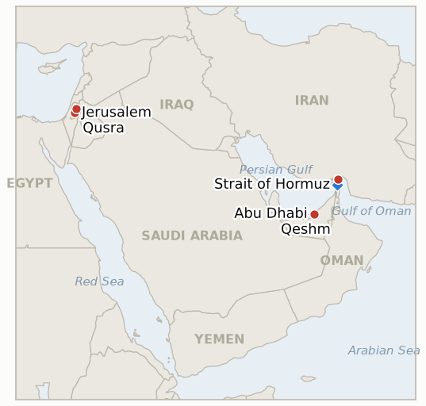

# Middle East Daily Briefing

**August 20, 2026**

- **Reporting window:** ~24 hours, August 19, 09:00 to August 20, 09:00 KST
- **Overall assessment:** Wednesday widened the war to a fourth Gulf state and delivered Korea's sharpest single day of the whole conflict. The UAE's Ministry of Defense said its air defenses detected two ballistic missiles fired from Iran toward its waters, assessed as targeting maritime navigation, with one falling outside and one inside UAE territorial waters; the UAE ordered an immediate, indefinite halt to all trade and financial transactions with Iran, and Iran's Foreign Ministry spokesman Esmaeil Baghaei rejected the accusation as "baseless," calling it inconsistent with good neighborliness and hinting at a "false flag operation" amid what he called continued US and Israeli malicious acts. The incident landed atop an already fraying picture of Hormuz "control": Iran's Revolutionary Guard reportedly boarded and held a UAE linked tanker south of Qeshm Island for bypassing Iran's designated northern route and refusing to pay its service fees, a separate UAE fuel tanker called the Amara made at least five erratic U-turns before halting near Qeshm, and two Hong Kong flagged, Chinese crewed supertankers, the Sea V and the Hestia, reversed course mid-strait rather than complete their transits, undercutting Trump's Tuesday claim that the strait is "open and operating" a day after it was made. Oil extended its gains to a fourth straight session on the compounding risk, Brent settling at $91.62 and WTI at $85.83, both the highest since July 24, while South Korea's KOSPI opened down more than 6% and tripped a sell-side circuit breaker just five minutes into trading, the year's 48th sidecar, before closing down 5.8% at 6,471.17 as offshore investors sold a net 3.48 trillion won and Samsung Electronics and SK Hynix each fell more than 7%, driven by a 30-year US Treasury yield surging to a 19-year high above 5.33% compounding directly with Middle East risk; the won nonetheless strengthened, briefly touching 1,396 and closing at 1,398.27, below 1,400 for the first time since early October, on broad dollar weakness and exporter dollar selling that decoupled the currency from the equity rout. In Gaza, the State Department told Congress in notifications made public Wednesday that it will provide $206 million, $200 million for equipment, infrastructure and operations and $6 million to repurpose US armored vehicles, to the planned International Stabilization Force, the first substantial US funding behind Trump's roadmap even though neither Israel nor Hamas has accepted the disarmament terms the force is meant to help enforce. And in the West Bank, the Qusra siege reached an eleventh day, with UN humanitarian staff reaching the roughly 13 trapped residents and municipal crews having restored water and power, but settlers still roaming the area daily under an IDF closed-military-zone order it continues to decline enforcing against them, as Defense Minister Katz's own two-week deadline for an IDF handover plan draws closer without a submission yet reported.

---

## 1. What Happened

<figure style="float:right; width:46%; margin:2pt 0 8pt 14pt;">

<figcaption style="font-size:8pt; color:#666; text-align:center; margin-top:3pt; font-style:italic;">Major places of discussion</figcaption>
</figure>

### 1.1 The UAE Halts All Trade With Iran After Detecting Two Ballistic Missiles Aimed at Gulf Shipping

The UAE's Ministry of Defense said Tuesday its air defense systems detected two ballistic missiles launched from Iran toward the country, assessed as targeting maritime navigation rather than land targets; the first missile fell outside UAE territorial waters and the second fell within them, both in the sea with no reported impact on land or casualties ([Washington Post](https://www.washingtonpost.com/world/2026/08/19/uae-says-it-is-suspending-trade-with-iran-after-missile-attack/); [Al Jazeera](https://www.aljazeera.com/news/2026/8/19/uae-imposes-indefinite-trade-embargo-on-iran-over-alleged-missile-attacks)). In response, the UAE ordered an immediate and indefinite halt to all trade, economic exchanges and financial transactions with Iran, citing regional escalations that undermine peace and security. Iran's Foreign Ministry spokesman Esmaeil Baghaei rejected the accusation as "baseless" hours later, saying the UAE's conduct contradicted the principle of good neighborliness and disrupted regional trust-building efforts, and separately suggested the incident could be a "false flag operation" carried out amid what he called continued malicious US and Israeli acts against the region ([Xinhua](https://english.news.cn/20260819/58ffc5e0974f45558bdbb429f26f907b/c.html)). No other Gulf state or the United States has independently corroborated the UAE's attribution as of this window's close. New **IND-20260820-1** opens to test whether Iranian origin is independently confirmed, a false-flag or alternative explanation surfaces, or the trade halt escalates into a wider Gulf or US military response. **Confidence: High** on the detection and trade-halt announcement itself (Tier 1-2, UAE government statement, multi-outlet); **Medium** on ultimate attribution, given Iran's active and specific denial.

### 1.2 Tanker Detentions and U-Turns Keep Undercutting Trump's "Open and Operating" Claim

Iran's Islamic Revolutionary Guard Corps reportedly detained a UAE-owned tanker transiting south of Qeshm Island after it allegedly refused to use Iran's designated northern route through the strait and declined to pay required service fees; Iranian state-linked outlet Fars said tankers must follow an Iran-designated route, pay fees and obtain Iranian authorization to transit ([SAFETY4SEA](https://safety4sea.com/iran-reportedly-detains-uae-owned-tanker-near-qeshm-island/); [TradeWinds](https://www.tradewindsnews.com/tankers/iran-claims-seizure-of-uae-linked-tanker-in-strait-of-hormuz/2-1-2030263)). Separately, ship-tracking data showed a UAE-linked fuel tanker, the Amara, sailing empty into the Gulf Monday before making at least five erratic U-turns and coming to a halt in the strait's northern, Iran-controlled corridor, while two Hong Kong-flagged, Chinese-crewed supertankers, the Iraqi-crude-laden Sea V and the Hestia, separately reversed course mid-transit Tuesday and Wednesday rather than complete their crossings, with no operator explanation given for either turn ([Bloomberg](https://www.bloomberg.com/news/articles/2026-08-19/two-chinese-supertankers-u-turn-in-hormuz-as-risks-remain-high); [Bloomberg](https://www.bloomberg.com/news/articles/2026-08-18/tanker-stops-in-hormuz-as-iran-raises-efforts-to-control-strait)). Kpler's own transit count, cited by Reuters, also proved unstable this window: Wednesday's reporting put Monday August 17 at 9 crossings, revised up from the 6 reported in Tuesday's own briefing, while Tuesday August 18 itself came in at 6, still near the 10-day average of 11. Taken together, the detention, the U-turns and the reversed course keep contradicting Trump's Tuesday claim that the strait is "open and operating," continuing to test IND-20260817-2 and IND-20260819-1. **Confidence: High** on the tanker movements themselves (Tier 1-2, Bloomberg ship-tracking data, multi-outlet); **Medium** on Iran's stated fee/route rationale for the detention, sourced to Iranian state-linked media without independent confirmation.

### 1.3 Oil Extends Gains to a Fourth Session as KOSPI Suffers Its Worst Day of the War and the Won Defies the Selloff

Brent crude settled at $91.62 and WTI at $85.83 Wednesday, both climbing for a fourth straight session to their highest since July 24, as the UAE-Iran rupture compounded already-thin Hormuz shipping ([Yahoo Finance/Reuters](https://finance.yahoo.com/energy/articles/oil-prices-extend-gains-hormuz-095617554.html)). South Korea's KOSPI opened down more than 6% and tripped a sell-side sidecar circuit breaker roughly five minutes into trading, the year's 48th such activation, before closing down 5.8% at 6,471.17 as offshore investors sold a net 3.48 trillion won, Samsung Electronics fell more than 7% and SK Hynix fell nearly 10%, driven by the 30-year US Treasury yield surging to its highest since 2007 above 5.33% compounding directly with the day's Middle East escalation ([Asia Business Daily](https://www.asiae.co.kr/en/article/2026081915454701870); [Korea JoongAng Daily](https://www.koreajoongangdaily.com/business/krx-activates-sellside-sidecar-for-kospi-on-sharp-fall/12831455)). The won nonetheless strengthened through the session, touching as low as 1,396 per dollar before closing at 1,398.27, below 1,400 for the first time since early October, as broad dollar weakness on soft US data and Korean exporters converting dollar holdings decoupled the currency from the simultaneous equity rout ([Korea Herald](https://www.koreaherald.com/article/10845530); [Korea Times](https://www.koreatimes.co.kr/economy/20260819/won-dollar-rate-falls-below-1400-won-for-1st-time-in-11-months)). New **IND-20260820-2** opens to test whether the crash proves a one-day shock that partially reverses or the start of a sustained repricing. **Confidence: High** on the oil settle figures, the KOSPI close and circuit-breaker trigger, and the won's close (Tier 1-2, multi-outlet financial press).

### 1.4 Washington Commits First Substantial Funding to Gaza's Stabilization Force Despite the Disarmament Standoff

The State Department notified congressional appropriations and foreign affairs committees in letters made public Wednesday that it will provide $206 million toward the planned International Stabilization Force for Gaza, $200 million for equipment, infrastructure, vehicles and operational costs and a further $6 million to repurpose US armored vehicles for the force, marking the first significant US funding behind Trump's Gaza roadmap ([Times of Israel/Reuters](https://kfgo.com/2026/08/19/us-to-provide-206-million-for-gaza-peacekeeping-force-letters-show/)). The ISF is intended to lead security operations, support "comprehensive demilitarization" and enable humanitarian aid and reconstruction delivery, but the funding moves ahead of, not after, the conditions that would let it actually deploy: Hamas has not accepted the specific disarmament timeline Kushner floated Tuesday, and Israel has taken no formal Security Cabinet vote on the broader disarm-first framework. New **IND-20260820-3** opens to test whether the funding converts into visible ISF stand-up or deployment despite the standoff, or sits unused pending a deal that has not materialized. **Confidence: High** on the funding notification and its stated purpose (Tier 1-2, congressional letters reported by Reuters, multi-outlet); **Medium** on whether it signals near-term deployment given the unresolved disarmament precondition.

### 1.5 Qusra's Siege Reaches an Eleventh Day as Katz's Handover Deadline Nears Without a Plan

Israeli settlers continued for an eleventh consecutive day to besiege three Palestinian homes in Qusra's Ras al-Ain area, where roughly 13 residents, including a dual US citizen's household, remain unable to freely leave; UN humanitarian staff reached the families and municipal crews have restored water and electricity connections damaged earlier in the siege, but settlers continue roaming the area daily and the IDF still has not enforced its own closed-military-zone order against them, only against the residents and outside visitors ([WAFA](https://english.wafa.ps/Pages/Details/173877); [UN News](https://news.un.org/en/story/2026/08/1168155)). The standoff continues alongside Defense Minister Katz's August 14 directive giving the IDF two weeks to submit a plan transferring West Bank civilian enforcement from the military to police, a deadline that falls around August 28 and is drawing closer with no submission yet reported ([Times of Israel](https://www.timesofisrael.com/katz-idf-has-2-weeks-to-draft-plan-to-hand-west-bank-civilian-enforcement-to-police/)). Both threads continue to test IND-20260813-3 (Qusra's dismantlement, deadline ~August 27) and IND-20260819-2 (the handover's timeline, deadline ~September 1). **Confidence: High** on Qusra's eleventh-day status and the selective enforcement pattern (Tier 1-2, WAFA, UN, multi-outlet); **Medium** on the exact status of Katz's plan submission, since no fresh reporting on it appeared in this window.

---

## 2. Deep Dive: Incentives and Motives

### 2.1 Why would an attack the UAE attributes to Iran happen now, deepening Tehran's isolation just as an Iran-Oman shipping deal appeared close to signature?

If Iran did originate the launches, targeting "maritime navigation" rather than UAE territory itself reads less as an attack on the UAE and more as an attempt to reassert deterrence over the alternate Gulf shipping routes that have increasingly substituted for a closed Hormuz, punishing the workaround at the exact moment US-brokered movement on transit was gaining momentum; if it was not Iran, the incident's timing serves whichever actor benefits from freezing the emerging Iran-Oman track and hardening the case for tighter isolation, and Baghaei's own "false flag" framing signals that Tehran expects to be blamed regardless of the facts on the ground.

### 2.2 Why did markets treat Wednesday's catalysts as cause for the year's most severe circuit-breaker event, while the won moved in the opposite direction from the stock selloff?

Because the 30-year Treasury yield's move to a 19-year high compounded directly with fresh Middle East risk on Korea's most rate-sensitive, foreign-owned names, Samsung and SK Hynix, at a moment offshore investors had already priced in relative calm, producing a stacked shock rather than an incremental one; the won's simultaneous strengthening reflects a decoupled channel, broad dollar weakness on soft US data plus exporters converting dollar holdings, showing Korea's currency and equity markets are currently pricing risk through entirely different mechanisms rather than a single "flight from Korea" narrative.

### 2.3 Why do real-world tanker movements keep contradicting Trump's repeated "open and operating" claims rather than confirming them?

Because commercial shipowners and Iran's own enforcement apparatus are responding to the underlying risk calculus, attack frequency, detention risk, and Iran's insistence on route and fee compliance, not to a US president's public statements, so as long as those material risks stay unresolved, tanker behavior will keep diverging from the declaratory claim no matter how often it is repeated.

### 2.4 Why would Washington commit real money to Gaza's stabilization force before Israel or Hamas has accepted the terms that would let it deploy?

Because standing up the ISF's equipment and infrastructure now, while the disarmament standoff continues, lets the administration demonstrate forward momentum on its own roadmap and creates a ready-to-deploy capability that raises the practical and political cost of either side continuing to stall, effectively pre-positioning leverage rather than waiting on a deal that funding alone cannot produce.

### 2.5 Why does the Qusra siege persist into an eleventh day when Israeli authorities hold both the legal instrument and the political incentive to end it?

Because enforcing the closed-military-zone order against the settlers, rather than against the besieged Palestinian residents, would mean using force against Ben Gvir's coalition base at the exact moment Katz is trying to shift enforcement authority to police without alienating that same constituency, so the order stays selectively applied and the siege persists as the path of least political resistance.

---

## 3. Policy Implications for South Korea

### 3.1 Exposure snapshot

| Item | Current reading | Source |
| --- | --- | --- |
| Middle East share of crude imports | 48.5% (May-July 2026), down from 69.1% a year earlier; non-Middle East share crossed 50% for the first time on record | KNOC via Asia Business Daily; `korea-exposure.md` |
| July-August crude procurement | 110%+ of prior-year volume secured (MOTIE, July 21); strategic reserve swap extended through August, ~21 million barrels swapped to date | MOTIE via Herald Business, Hankyung; `korea-exposure.md` |
| September crude procurement | 90%+ secured (MOTIE, July 21) | MOTIE via Herald Business; `korea-exposure.md` |
| Red Sea detour routing | Korean-bound crude cargoes continue via the Yanbu/Red Sea workaround; Yanbu exports to Asian buyers including Korea have surged to ~4 million bpd from under 1 million bpd a year earlier | Lloyd's List Intelligence; `korea-exposure.md` |
| Strategic reserve coverage | ~26 days of actual consumption (estimate); swap on immediate standby, untested at scale | CSIS; MOTIE July 27 |
| Refiner Saudi ownership exposure | S-Oil (Saudi Aramco majority ~63%), HD Hyundai Oilbank (Aramco ~17%) | Public filings; `korea-exposure.md` |
| Brent / WTI | Wednesday settle $91.62 / $85.83, a fourth straight gain and highest since July 24, as the UAE-Iran rupture compounded thin Hormuz shipping | Reuters via Yahoo Finance |
| KOSPI / USD-KRW | KOSPI -5.8% to 6,471.17, the year's 48th circuit breaker, on a 19-year-high 30-year Treasury yield and Middle East risk; won firmed to 1,398.27, below 1,400 for the first time since early October | KRX; Korea Herald, Korea Times, Asia Business Daily |
| Hormuz transits | Reuters via Kpler: 6 vessels Tuesday August 18 against a 10-day average of 11; Monday's own count was revised from 6 to 9 between Tuesday's and Wednesday's reporting | Reuters via Kpler |

### 3.2 Implications by development

**The UAE's missile detection and indefinite trade halt with Iran is today's most consequential regional signal for Korea: a fourth Gulf state now stands in direct confrontation with Tehran, and any escalation toward UAE energy or financial infrastructure would touch a market Korean refiners and traders both transit and rely on for regional stability.** New IND-20260820-1 (deadline ~September 3) tests attribution and further escalation.

**The tanker detentions and U-turns have no immediate Korean cargo exposure reported but reinforce that the operative risk to Korea-bound shipping remains real-world enforcement behavior, not Washington's declaratory claims, keeping the Yanbu Red Sea workaround the binding hedge.** IND-20260817-2 (deadline August 31) and IND-20260819-1 (deadline ~September 2, thirteen days out) continue tracking the underlying claim and attribution respectively.

**Wednesday's combination of a fourth straight oil gain and Korea's worst single trading day of the war is today's clearest direct Korea market impact, compounded by a currency market moving in the opposite direction from equities.** New IND-20260820-2 (deadline ~August 27) tests whether the crash proves a one-day shock or a sustained repricing; the chart above tracks the underlying series directly.

**Washington's $206 million Gaza stabilization funding has no direct Korean market exposure but is a first-order signal for how quickly Gaza's normalization track, and the regional risk premium tied to it, could actually move once a deal is reached.** New IND-20260820-3 (deadline ~September 19) tests whether funding converts into deployment; IND-20260814-2 (deadline August 21, one day out) and IND-20260812-4 (deadline August 26) continue tracking whether the underlying disarmament framework itself advances.

**Qusra's eleventh day and Katz's approaching handover deadline have no direct Korean market exposure but continue to test whether Israel's administrative measures ever produce a measurable reduction in West Bank incidents rather than another relabeled enforcement gap.** IND-20260813-3 (deadline August 27, seven days out) and IND-20260819-2 (deadline ~September 1) continue tracking Qusra's resolution and the handover respectively.

**Testable indicators:**

- **IND-20260820-1** — The UAE's claim that two Iranian ballistic missiles targeted its maritime navigation, met with Iran's denial and a "false flag" suggestion, is independently confirmed as Iranian in origin, an alternative explanation surfaces, or the dispute escalates into a wider Gulf or US military response, rather than remaining a trade-halt-only diplomatic rupture. Independent (non-UAE, non-Iranian) confirmation of Iranian origin, or a verified military response by the UAE, another Gulf state or the US explicitly tied to this incident, by ~2026-09-03, confirms the incident carried real consequences beyond the trade halt; continued absence of independent confirmation and no military response through the same date falsifies it as an unresolved, contested claim absorbed at the diplomatic level only.
- **IND-20260820-2** — South Korea's KOSPI, which crashed 5.8% and tripped the year's 48th circuit breaker on a combined Treasury-yield and Middle East shock, either partially recovers within about a week, showing a one-day risk-off event, or continues falling or stays depressed, confirming a durable repricing. The KOSPI closing within 2% of its pre-crash 6,869.83 level by ~2026-08-27 confirms the crash was a one-day shock; the index closing more than 5% below that level, or falling further, through the same date falsifies a quick recovery and confirms a sustained repricing tied to compounding war and yield risk.
- **IND-20260820-3** — The $206 million US funding notification for Gaza's International Stabilization Force converts into visible equipment delivery, force stand-up, or deployment despite Israel and Hamas both withholding acceptance of the disarmament terms, or the funding sits allocated but unused pending a deal that does not materialize. Visible ISF equipment delivery, personnel stand-up, or deployment activity by ~2026-09-19 confirms the funding moved ahead of the political deal; continued absence of any visible stand-up activity through the same date, with the underlying disarmament framework still unresolved, falsifies near-term deployment.

---

## 4. Watch List

- **Whether the UAE's Iran missile claim is independently confirmed or the dispute escalates further** (IND-20260820-1, deadline September 3).
- **Whether South Korea's historic KOSPI crash reverses within days or marks a durable repricing** (IND-20260820-2, deadline August 27).
- **Whether the $206 million Gaza stabilization funding converts into visible deployment activity** (IND-20260820-3, deadline September 19).
- **Whether Kushner and Mladenov's visit produces a formal Israeli Security Cabinet vote or agreed disarmament timeline** (IND-20260814-2, deadline August 21, one day out).
- **Whether Bessent's promised unprecedented Iran economic isolation package materializes with concrete new measures** (IND-20260815-1, deadline August 22).
- **Whether the June 17 MOU's toll free Hormuz window converts into actual Iranian tolls or a quiet extension** (IND-20260814-1, deadline August 24).
- **Whether the US Navy's kinetic blockade enforcement, or Iran's threatened "precise strikes," draws an actual US-Iran military exchange** (IND-20260812-1, deadline August 26).
- **Whether the Gaza disarm-first framework ever reaches a formal Israeli Security Cabinet vote in any form** (IND-20260812-4, deadline August 26).
- **Whether the Qusra siege is ever actually resolved, now trending further toward falsification at its eleventh day** (IND-20260813-3, deadline August 27).
- **Whether the August 15 Hezbollah-Israel exchange triggers a further round or both sides step back to the post-truce equilibrium** (IND-20260816-1, deadline August 29).
- **Whether the Gaza Yellow Line incidents prompt a formal IDF operational response or stay isolated** (IND-20260816-2, deadline August 30).
- **Whether Yemen's confirmed five governorate spread draws renewed international mediation** (IND-20260817-1, deadline August 31).
- **Whether Trump's declared intent to make Hormuz US territory produces any concrete policy step beyond his map post** (IND-20260817-2, deadline August 31).
- **Whether Israel's prepared Ali al Taher ridge operation actually launches** (IND-20260818-2, deadline August 31).
- **Whether the Rome track's provisionally scheduled September 1 eighth round proceeds** (IND-20260807-2, deadline September 1).
- **Whether Trump's threat to bomb Oman produces any real diplomatic or military consequence** (IND-20260818-1, deadline September 1).
- **Whether the Houthis' claimed strike on Saudi naval vessels is confirmed or draws a direct Saudi response** (IND-20260818-3, deadline September 1).
- **Whether Katz's uncoordinated West Bank police handover proceeds or is delayed or blocked** (IND-20260819-2, deadline September 1).
- **Whether the fatal Minoan Dignity attack is ever attributed or draws a military response** (IND-20260819-1, deadline September 2, thirteen days out).
- **Whether a signed Iran-Oman Hormuz joint statement with an operating date is reached, or the shipping map deal stalls again short of signature** (IND-20260816-3, deadline September 5).
- **Whether the Syria nuclear material find converts into a concluded agreement and verified removal** (IND-20260812-2, deadline September 11).
- **Whether the West Bank IDF-to-police enforcement transfer reduces settler violence, or leaves it unchanged** (IND-20260815-2, deadline September 12).
- **Whether Syria moves against Hezbollah in Lebanon despite Iran's warning, or the confrontation stays rhetorical** (IND-20260815-3, deadline September 15).
- **Whether Kaine's privileged war powers resolution on Oman passes, fails, or never reaches a floor vote** (IND-20260819-3, deadline September 25).
- **Whether the Caroline Bezengi oil spill is contained now that salvage work has begun.**
- **Whether the Qeshm Island explosions are ever confirmed as a real strike or resolved as a false alarm.**

---

## 5. Source Quality Summary

| Claim | Sources | Confidence |
| --- | --- | --- |
| UAE detects two Iranian ballistic missiles targeting maritime navigation, halts all trade with Iran indefinitely | Washington Post, Al Jazeera (Tier 1-2, UAE government statement, multi-outlet) | High |
| Iran's Baghaei rejects the UAE's claim as "baseless," suggests a "false flag operation" | Xinhua (Tier 1-2, on-record Iranian government statement) | High on the denial; Medium on ultimate attribution |
| Iran's IRGC detains a UAE-linked tanker off Qeshm Island over route/fee noncompliance | SAFETY4SEA, TradeWinds (Tier 2, Iranian state-linked and shipping trade press) | Medium-High |
| Chinese-crewed supertankers Sea V and Hestia U-turn mid-strait; UAE tanker Amara makes repeated U-turns and halts | Bloomberg (Tier 1, ship-tracking data, multi-outlet) | High |
| Brent settles $91.62, WTI $85.83 Wednesday, fourth straight gain | Reuters via Yahoo Finance (Tier 1-2, multi-outlet financial press) | High |
| KOSPI falls 5.8% to 6,471.17, triggers year's 48th circuit breaker; won firms to 1,398.27, below 1,400 first time since early October | Asia Business Daily, Korea JoongAng Daily, Korea Herald, Korea Times (Tier 1-2, multi-outlet Korean financial press) | High |
| Hormuz transits: 6 vessels Tuesday August 18 against a 10-day average of 11; Monday's count revised 6 to 9 | Reuters via Kpler | Medium-High (cross-report revision noted) |
| US commits $206 million to Gaza's International Stabilization Force via congressional notification | Reuters via Times of Israel, KFGO (Tier 1-2, congressional letters, multi-outlet) | High |
| Qusra siege reaches eleventh day; UN aid reaches families; settlers unenforced against | WAFA, UN News (Tier 1-2, on-scene and UN sourcing, multi-outlet) | High |
| Katz's two-week IDF handover-plan deadline approaches ~August 28 without a reported submission | Times of Israel (Tier 1-2, single-outlet sourcing carried over from August 14) | Medium |
