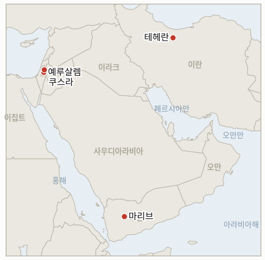

# 중동 일일 브리핑

**2026년 8월 21일**

- **보고 기간:** 약 24시간, 8월 20일 09:00 ~ 8월 21일 09:00 (한국시간)
- **종합 평가:** 목요일의 지배적인 신호는 무기가 아니라 워싱턴의 수사가 날카로워졌다는 점이었다. 스콧 베선트 재무장관은 CNBC에서 미국이 역대 최강이라 부른 제재를 통해 "이 정권을 붕괴시키겠다"고 밝히면서도, 같은 압박이 대규모 전투 재개로 이어지지는 않을 것이라고 신중한 태도를 덧붙였고, 트럼프 대통령은 다가오는 8월 24일 월요일 발표를 "경제적 디데이"라고 규정했다. UAE의 화요일 대이란 미사일 주장은 닷새가 지나도록 미국이나 CENTCOM의 독자적 확인을 받지 못한 채로 남아 있으며, 그럼에도 이러한 수사만으로 유가는 닷새 연속 상승해 브렌트유는 배럴당 93.15달러, WTI유는 86.21달러로 마감하며 각각 거의 한 달 만의 최고치를 기록했다. 한국 코스피는 그날의 또 다른 주요 반전을 보여주며 전쟁 중 최악의 하루 다음 날 5.89% 급등한 6852.58로 마감했다. SK하이닉스의 40조 원 자사주 매입 발표와 후퇴하는 미 국채 금리가 배경이었으며, 올해 49번째 서킷브레이커를 이번에는 매수 쪽에서 발동시켰고 원화는 1392.6원으로 추가 강세를 보였다. 가자지구 외교에서는 목요일에 쿠슈너·믈라데노프 방문을 시험하던 지표의 시한이 마감됐다. 네타냐후 총리는 특사들에게 15개항 틀의 진전이 10월 27일 총선을 앞두고 정치적으로 "곤란하다"고 말하고 하마스의 완전한 무장해제 전까지 철수는 없다는 입장을 재확인해, 월요일 합의된 실무 그룹 구성에도 불구하고 입장을 바꾸기보다는 되풀이했다. 쿠스라 포위는 열이틀째를 맞았고 갇힌 가족들은 식량이 바닥났다고 전했으며, 이스라엘군은 여전히 보급을 막으면서도 정착민이 아닌 주민들을 상대로만 자신들이 내린 폐쇄 명령을 집행하고 있다. 그리고 예멘 전쟁은 더욱 확대돼, 정부군이 24시간 동안 후티 진지를 상대로 100건 넘는 작전을 기록했고 후티의 미사일은 마리브의 실향민 캠프를 강타했다.

---

## 1. 오늘의 주요 사건

<figure style="float:right; width:46%; margin:2pt 0 8pt 14pt;">

<figcaption style="font-size:8pt; color:#666; text-align:center; margin-top:3pt; font-style:italic;">주요 논의 지점</figcaption>
</figure>

### 1.1 베선트 "이 정권을 붕괴시키겠다" 다짐, UAE 미사일 주장은 여전히 미확인, 유가는 닷새째 상승

베선트 재무장관은 목요일 CNBC에서 미국이 해상 봉쇄와 "역사상 가장 강력한 제재"를 동원해 이란 정부를 "붕괴"시키겠다고 밝히면서도, 같은 방송에서 이러한 경제적 확전이 오히려 대규모 전투 재개 가능성을 낮춘다고 말해 자신이 부추긴 시장 불안을 진화하려는 듯한 모습을 보였다([CNBC](https://www.cnbc.com/2026/08/20/bessent-economy-iran-war-trump.html); [더힐](https://thehill.com/homenews/administration/6029661-scott-bessent-treasury-donald-trump-economic-pressure-iran-war/)). 트럼프 대통령은 별도로 다가오는 발표를 "경제적 디데이"라 부르며 미국 동맹국들에 동참을 촉구했고, 블룸버그는 베선트가 이란산 원유 유통을 지탱해온 중국 은행과 해운·보험·정제 중개업체 등을 겨냥할 수 있는 구체적인 신규 조치를 8월 24일 월요일로 예정된 기자회견에서 밝힐 예정이라고 보도했다([블룸버그/폴리티컬와이어](https://politicalwire.com/2026/08/20/bessent-to-detail-u-s-plans-to-isolate-iran/); [사히](https://www.sahi.com/news/bessent-declares-us-will-impose-toughest-sanctions-in-history-against-iran-sanctions-PE)). 이 날짜는 IND-20260815-1 자체의 약 8월 22일 시한보다 이틀 늦어, 예고된 발표가 그 지표의 확정 시한 안에 이뤄지지 않는다는 뜻이다. 한편 UAE가 화요일 이란산 탄도미사일 2발이 해상 항로를 겨냥했다고 주장한 지 닷새가 지나도록 워싱턴도 CENTCOM도 이란 배후설을 독자적으로 뒷받침하지 않고 있어, UAE의 무역 중단 조치는 자체 판단에만 의존한 채 남아 있다([알자지라](https://www.aljazeera.com/news/2026/8/20/are-hormuz-ships-more-willing-to-defy-iran-or-the-us-what-data-shows)). 유가는 이러한 수사가 겹치며 닷새 연속 상승해 브렌트유는 93.15달러(+1.67%), WTI유는 86.21달러(+2.16%)로 마감해 각각 거의 한 달 만의 최고치를 기록했다([트레이딩이코노믹스](https://tradingeconomics.com/commodity/brent-crude-oil)). 협상 쪽으로의 공개적 전환 없이 확전적 수사만 이어진 채 자체 시한인 약 8월 20일을 지난 만큼, **IND-20260810-2**(케인 합참의장의 비공개 출구 전략 옹호)는 **반증**으로 확정된다. 행정부의 공개 입장은 케인이 비공개로 촉구했다는 협상을 통한 출구가 아니라 오히려 더 강한 경제적 압박 쪽으로 움직였다. **신뢰도: 높음** — 베선트와 트럼프의 공개 발언 및 예정된 8월 24일 발표(1~2등급, CNBC·블룸버그, 다수 매체). **신뢰도: 높음** — 유가 정산가. **신뢰도: 중간** — UAE-이란 배후 확인이 여전히 없다는 판단은, 원칙적으로 보도되지 않은 비공개 확인이 존재할 가능성을 배제할 수 없다.

### 1.2 코스피, 전쟁 중 최악의 폭락 다음 날 5.9% 급등하며 역대급 반전

한국 코스피는 목요일 5.89% 상승한 6852.58로 마감해 수요일 5.8% 폭락을 거의 완전히 되돌렸다. SK하이닉스가 40조 원 규모의 자사주 매입 프로그램을 발표하고 누적 잉여현금흐름의 최소 절반을 주주에게 환원하겠다고 밝히면서 주가가 12.73% 급등했고 삼성전자도 9.49% 올랐다([코리아타임스](https://www.koreatimes.co.kr/economy/20260820/kospi-surges-59-as-chipmakers-rally-on-shareholder-returns)). 오전 9시 57분 매수 사이드카가 발동됐는데, 올해 49번째 발동이자 이번 변동성 국면에서 처음으로 매수 쪽에서 나온 발동이었다. 외국인은 1조7000억 원을 순매수한 반면 국내 기관과 개인은 반등장에서 매도에 나섰으며, 미 재무부의 긴급 국채 바이백 이후 미 국채 금리가 하락하면서 반도체 주도 안도 랠리에 힘을 보탰다. 원화는 1392.6원으로 추가 강세를 보여 11개월 만의 최고치를 기록했으며, 수요일 1400원 아래로 내려간 데 이어 5.1원 더 올랐다([서울경제신문 영문판](https://en.sedaily.com/finance/2026/08/20/korean-won-hits-11-month-high-as-us-treasury-doubles-bond)). 이번 반전은 IND-20260820-2에 유리한 초기 신호이지만, 그 지표의 시한은 약 8월 27일까지로 아직 마감되지 않았다. 하루 만의 반등은 지표가 요구하는 지속적인 회복이라 보기에는 아직 이르다. **신뢰도: 높음** — 코스피 종가, 서킷브레이커 발동, 원화 수준(1~2등급, 다수 한국 금융 매체). **신뢰도: 높음** — SK하이닉스 자사주 매입이 직접적 촉매였다는 점.

### 1.3 쿠슈너·믈라데노프 방문 자체를 시험하던 지표, 네타냐후가 입장을 바꾸지 않으며 마무리

쿠슈너, 믈라데노프와 만난 자리에서 네타냐후 총리는 평화위원회의 15개항 틀에 대한 진전이 10월 27일 크네세트 총선을 앞두고 정치적으로 "곤란하다"고 말했고, 경중을 막론한 하마스의 완전한 무장해제 전까지는 어떠한 이스라엘군 철수도 승인하지 않겠다고 재확인했다. 이는 그의 사무실이 하루 전 무장해제와 가자지구 위생·물 공급 문제를 각각 다룰 실무 그룹 구성에 합의했다고 밝힌 지 하루 만이다([타임스오브이스라엘](https://www.timesofisrael.com/kushner-netanyahu-meet-for-hours-in-jerusalem-amid-push-for-us-backed-gaza-plan/); [더내셔널](https://www.thenationalnews.com/news/mena/2026/08/17/kushner-meets-netanyahu-to-break-gaza-board-of-peace-deadlock/)). 이번 방문 기간 중 공식적인 이스라엘 안보내각 표결은 없었고, 하마스가 수용한 무장해제 시간표도 나오지 않았다. 방문 자체는 연기되거나 취소되지 않고 이뤄졌지만, 8월 17일 이미 보도된 실무 그룹 구성을 넘어서는 네타냐후 입장의 공개적 변화는 없었던 만큼, **IND-20260814-2**는 약 8월 21일 시한에 **반증**으로 확정된다. 절차상의 진전은 계속됐지만 실질적 입장은 움직이지 않았다. **신뢰도: 높음** — 네타냐후의 발언 인용과 실무 그룹 합의(1~2등급, 타임스오브이스라엘·더내셔널, 다수 매체). **신뢰도: 중간** — 공개적 재확인과 별도로 비공개 유화 신호가 있었는지는 확인되지 않는다.

### 1.4 쿠스라 포위 열이틀째, 식량과 의약품이 바닥나다

이스라엘 정착민들은 열이틀째 쿠스라 라스알아인 지역의 팔레스타인 가옥 세 채를 계속 포위하고 있으며, 갇힌 주민들은 자신들이 "굶고 있다"고 전했다. 이스라엘군은 스스로 선포한 군사 폐쇄 구역으로의 식량·의약품 재보급을 막으면서도, 지역을 배회하는 정착민이 아닌 주민들만을 상대로 그 명령을 집행하고 있다([미들이스트아이](https://www.middleeasteye.net/news/we-are-starving-palestinians-besieged-settlers-west-bank-homes-run-out-food); [미들이스트모니터](https://www.middleeastmonitor.com/20260820-israeli-occupiers-besiege-3-west-bank-homes-for-12th-consecutive-day/)). 세 가옥 중 한 채는 여전히 군사 초소로 전용된 상태이며, 목요일 보고 기간 중 이스라엘 정부나 IDF의 식량·의약품 부족 심화에 대한 어떠한 입장 표명도 없었다. 이 포위는 **IND-20260813-3**(해체, 시한 약 8월 27일, 6일 남음)을 계속 시험하는 동시에, 이번엔 별도로 이 부족 사태 자체가 공인된 인도주의적 비상사태로 굳어지기 전에 개입을 이끌어내는지를 새로 시험한다. 신규 **IND-20260821-2**가 이 좁은 질문을 추적하기 위해 개설됐다. **신뢰도: 높음** — 포위 열이틀째 상황과 보도된 식량 부족(1~2등급, 미들이스트아이·미들이스트모니터, 유엔·국제앰네스티의 앞선 기록과 부합). **신뢰도: 중간** — 어떤 구호 기구도 아직 정확한 칼로리·의료 수요 평가를 발표하지 않아 부족의 정확한 심각도는 불확실하다.

### 1.5 예멘 정부군 공세 확대, 후티는 마리브 실향민 캠프에 미사일 발사

예멘 국제 공인 정부는 목요일 보도에 앞선 24시간 동안 후티 진지를 상대로 100건 넘는 작전을 수행했다고 밝혔으며, 후티군은 정부 통제하의 마리브에서 실향민 캠프와 주거 지역에 미사일을 발사해 정부 정보부가 민간인 생명에 대한 고의적 위협이라 규정한 확전을 벌였다([알자지라](https://www.aljazeera.com/news/2026/8/18/yemeni-government-escalates-attacks-against-houthis-whats-next); [HNGN](https://www.hngn.com/articles/272756/20260815/yemens-civil-war-reignites-houthi-forces-escalate-attacks-government-positions-taiz.htm)). 전투는 마리브, 하드라마우트, 타이즈, 알다레아, 알후다이다 등 여러 전선에서 계속되고 있으며, 유엔 특사는 안전보장이사회에 예멘이 2022년 휴전 이후 최고 수준의 내전 위험에 처해 있다고 밝혔다. 이러한 계속된 확산과 상호 확전은 **IND-20260817-1**(시한 약 8월 31일)을 계속 시험하는데, 이 지표는 확대되는 전쟁이 새로운 국제 중재로 이어지는지를 묻는다. 아직 그런 중재는 나타나지 않았다. **신뢰도: 높음** — 작전 강도와 마리브 공격(1~2등급, 알자지라, 다수 매체). **신뢰도: 중간** — 정확한 사상자 수는 출처마다 차이가 있으며 독자적으로 검증되지 않았다.

---

## 2. 심층 분석: 동기와 배경

### 2.1 왜 워싱턴은 새로운 전투는 없을 것이라고 시장을 안심시키려는 바로 그 주에 대이란 경제적 수사를 더 강경하게 끌어올리는가?

제재와 봉쇄 집행은 병력을 추가로 투입하거나 호르무즈 해상운송에서 추가 손실을 감수하지 않고도 행정부가 조일 수 있는 유일한 지렛대이기 때문이다. 베선트의 "정권 붕괴" 프레이밍은 트럼프가 국내 정치적 소비를 위해 "디데이" 규모의 확전 캠페인을 내세울 수 있게 해주는 동시에, "대규모 전투 재개 가능성은 낮다"는 그 자신의 단서는 전쟁 재점화를 우려하는 시장과 동맹국을 향한 것이어서, 행정부가 실제 군사적 태세를 확대하지 않으면서도 언어의 수위만 높일 수 있게 한다.

### 2.2 왜 네타냐후는 쿠슈너에게 무장해제 틀을 단순히 거부하거나 수용하는 대신 지금 "정치적으로 곤란하다"고 말했는가?

이스라엘의 10월 27일 총선을 앞두고, 가자지구에 대한 어떤 눈에 보이는 양보든 하마스가 무기 하나도 내려놓기 전에 네타냐후 자신의 연립 파트너들에게 공격받을 빌미가 되기 때문이다. 문제를 실질적 거부가 아닌 시점의 문제로 규정하면 워싱턴과의 절차를 계속 살려두면서 쿠슈너와의 공개적 결렬이라는 정치적 비용을 피할 수 있고, 무장해제 순서가 완전히 충족될 때까지는 지지층이 기대하는 원칙도 그대로 지킬 수 있다.

### 2.3 왜 한국 반도체 기업들은 글로벌 시장이 중동 리스크와 금리 리스크가 겹치는 것을 가격에 반영하는 바로 그 주에 대규모 주주환원을 발표했는가?

SK하이닉스와 삼성전자의 근본적인 AI·메모리 수요 사이클은 거시적 리스크가 급등해도 변하지 않았기 때문에, 대규모 자사주 매입은 전쟁과 금리가 이끈 매도세로 밸류에이션이 가장 크게 눌린 바로 이 시점에 자체 현금창출력에 대한 자신감을 보여주는 신호가 된다. 이는 펀더멘털과 무관한 충격으로부터 주가를 방어하는 동시에, 수요일 폭락장을 견뎌낸 주주들에게 보상하는 효과를 낸다.

### 2.4 왜 UAE의 미사일 주장은 워싱턴이 대이란 압박 캠페인을 더 강하게 밀어붙이는 와중에도 닷새가 지나도록 미국의 확인을 받지 못하고 있는가?

이란 배후를 독자적으로 확인하면 미국이 파트너국 영토에 대한 공격을 동맹 차원의 문제로 취급해야 하는 확전적 의무를 지게 되는 반면, 경제적 고립 캠페인은 그러한 구체적 공약 없이도 워싱턴이 더 넓은 전쟁 전반에서 테헤란을 계속 압박할 수 있게 해준다. 따라서 행정부로서는 UAE 자체의 주장을 확인도 반박도 하지 않은 채 그대로 두는 편이 유리하다.

### 2.5 인도주의적 피해가 이제 보고된 굶주림까지 포함하게 됐는데도 이스라엘은 왜 쿠스라 정착민들을 상대로 자신들이 내린 군사 폐쇄 구역 명령을 여전히 집행하지 않는가?

주민이 아닌 정착민을 상대로 그 명령을 집행하려면 정부가 의존하는 정치적 지지층을 상대로 강제력을 행사해야 하는데, 정부의 계산에서는 그 정치적 대치의 비용이 계속되는 국제적 비난이라는 평판 비용보다 여전히 크기 때문이다. 그래서 그 결과가 눈에 띄게 악화되는 와중에도 포위는 같은 선택적 집행 양상을 따라 지속된다.

---

## 3. 한국에 대한 정책적 함의

### 3.1 노출도 스냅샷

| 항목 | 현재 수치 | 출처 |
| --- | --- | --- |
| 원유 수입 중 중동 비중 | 48.5%(2026년 5~7월), 1년 전 69.1%에서 하락; 비중동 비중이 사상 처음 50%를 넘어섬 | 한국석유공사(KNOC), 아시아경제 인용; `korea-exposure.md` |
| 7~8월 원유 확보 | 전년 동기 물량의 110% 이상 확보(산업통상자원부, 7월 21일); 전략비축유 스와프를 8월까지 연장, 현재까지 약 2100만 배럴 스와프 | 산업통상자원부, 헤럴드경제·한경 인용; `korea-exposure.md` |
| 9월 원유 확보 | 90% 이상 확보(산업통상자원부, 7월 21일) | 산업통상자원부, 헤럴드경제 인용 |
| 홍해 우회 항로 | 한국행 원유 화물은 얀부/홍해 우회 항로를 계속 이용 중; 얀부에서 한국을 포함한 아시아 구매자로의 수출은 1년 전 하루 100만 배럴 미만에서 약 400만 배럴로 급증 | 로이즈리스트 인텔리전스; `korea-exposure.md` |
| 전략비축유 커버리지 | 실제 소비 기준 약 26일분(추정); 스와프는 즉시 대기 상태이나 대규모 실전 검증은 없음 | CSIS; 산업통상자원부(7월 27일) |
| 정유사 사우디 지분 노출 | S-Oil(사우디 아람코 지분 약 63%), HD현대오일뱅크(아람코 지분 약 17%) | 공시자료; `korea-exposure.md` |
| 브렌트유/WTI유 | 목요일 정산가 93.15달러/86.21달러, 닷새 연속 상승하며 거의 한 달 만의 최고치, 베선트의 "정권 붕괴" 발언과 여전히 미확인 상태인 UAE 미사일 주장이 얇은 호르무즈 해상운송에 겹친 결과 | 트레이딩이코노믹스; CNBC |
| 코스피/원달러 환율 | 코스피 +5.89%로 6852.58 마감, 올해 49번째 서킷브레이커(매수 쪽); SK하이닉스 자사주 매입과 미 국채 금리 하락이 배경; 원화는 1392.6원으로 강세, 11개월 만의 최고치 | 코리아타임스; 서울경제신문 영문판 |
| 호르무즈 통항량 | 로이터/Kpler: 8월 19일 수요일 6척, 10일 평균 11척; 같은 보도가 8월 18일 화요일 수치를 기존 6척에서 9척으로 상향 수정, 집계의 근본적인 불안정성을 다시 보여줌 | 로이터, Kpler 인용 |

### 3.2 사건별 함의

**베선트의 "정권 붕괴" 다짐과 다가오는 8월 24일 제재 발표는 오늘 워싱턴이 새로운 교전 재개 여부와 무관하게 대이란 경제적 압박을 계속 확대하려 한다는 가장 뚜렷한 신호이며, 이는 유가에 내재된 전쟁 프리미엄을 한국의 수입 비용에 계속 붙들어 둔다.** 신규 IND-20260821-1(시한 약 8월 26일)이 이번 발표가 실질적으로 새로운 조치를 담는지를 시험하며, IND-20260815-1(시한 약 8월 22일, 하루 남음)은 8월 24일 발표보다 먼저 마감되면서 시한을 넘길 가능성이 커졌다.

**코스피의 5.9% 반전은 오늘 한국 시장에 가장 직접적인 안도 신호이지만, 개별 기업의 자사주 매입이라는 특정 촉매에 의한 하루짜리 반등이 수요일 폭락이 전쟁·금리 리스크가 겹친 지속적 재평가였는지를 아직 확정 짓지는 못한다.** IND-20260820-2(시한 약 8월 27일, 6일 남음)가 근본 질문을 계속 추적하며, 위 차트가 두 지표를 직접 추적한다.

**쿠슈너·네타냐후 지표가 정책적 전환 없이 마무리된 것은 한국 시장에 직접적 노출은 없지만, 가자지구 정상화 궤도와 그에 결부된 지역 리스크 프리미엄이 여전히 정체돼 있음을 확인시키며, 이는 이번 달 한국 시장 변동성을 이끈 전반적인 전쟁 국면의 미해결 상태를 그대로 유지시킨다.** IND-20260812-4(시한 8월 26일, 5일 남음)가 근본적인 안보내각 표결 여부를 계속 추적한다.

**쿠스라의 식량 위기와 예멘의 확전 모두 한국 시장에 직접적 노출은 없지만, 각각 서안지구에서 공인된 인도주의적 비상사태로, 또는 예멘에서 조율된 중재 노력으로 이어지는 문턱을 넘는지, 즉 지역 불안정의 단계적 전환을 의미하는지를 계속 시험한다.** 신규 IND-20260821-2(시한 약 8월 28일)가 쿠스라 문턱을 시험하고, IND-20260817-1(시한 8월 31일, 10일 남음)이 예멘 쪽을 계속 추적한다.

**테스트 가능한 지표:**

- **IND-20260821-1** — 트럼프 대통령이 "경제적 디데이"라 부른 베선트 재무장관의 8월 24일 월요일 제재 발표가 중국 은행, 위안화 표시 원유 대금 결제망, 또는 이란 수출을 지탱해온 해운·보험·정제 중개업체 등 기존 해상 봉쇄와 이전 제재 체제를 넘어서는 실질적으로 새로운 조치를 겨냥하는지, 아니면 새로운 수단 없이 기존 조치를 되풀이하는 데 그치는지를 시험한다. 2026년 8월 26일까지 기존에 제재 대상이 아니었던 최소 한 가지 신규 메커니즘이 확인되면 캠페인이 실질적으로 확대됐음이 확정된다. 같은 날짜까지 발표가 기존 봉쇄와 이전 제재 목록을 새로운 대상 없이 되풀이하는 데 그치면, 실질적 확대 없는 수사적 확전으로 반증된다.
- **IND-20260821-2** — 이제 열이틀째로 접어들었고 갇힌 주민들이 굶주림이라 표현한 쿠스라 포위의 식량·의약품 부족이 약 일주일 안에 이스라엘의 개입으로 막힘없는 재보급이 회복되는지, 아니면 부족이 방치된 채 계속되면서 포위가 공인된 인도주의적 비상사태로 굳어지는지를 시험한다. 2026년 8월 28일까지 포위된 가옥으로의 식량·의약품 접근이 검증 가능하게 회복되면 개입이 있었음이 확정된다. 같은 날짜까지 재보급이 계속 막혀 있고 이스라엘 정부나 IDF의 어떠한 입장 표명도 없으면, 단기적 구제는 반증되고 포위가 공인된 비상사태가 됐음이 확정된다.

---

## 4. 주시 목록

- **베선트의 8월 24일 제재 발표가 실질적으로 새로운 조치를 담는지, 기존 조치를 되풀이하는 데 그치는지** (IND-20260821-1, 시한 8월 26일).
- **쿠스라의 식량·의약품 부족이 공인된 비상사태로 굳어지기 전에 이스라엘의 개입을 끌어내는지** (IND-20260821-2, 시한 8월 28일).
- **한국 코스피의 반전이 유지되는지, 일주일 안에 수요일 폭락이 다시 나타나는지** (IND-20260820-2, 시한 8월 27일).
- **가자지구 안정화군 2억600만 달러 자금 지원이 가시적인 배치 활동으로 이어지는지** (IND-20260820-3, 시한 9월 19일).
- **UAE의 이란 미사일 주장이 독자적으로 확인되는지, 갈등이 더 확대되는지** (IND-20260820-1, 시한 9월 3일).
- **8월 24일로 미뤄진 베선트의 예고된 전례 없는 대이란 경제 고립 조치가 결국 기존 체제 대비 미흡한 수준에 그치는지** (IND-20260815-1, 시한 8월 22일, 하루 남음).
- **6월 17일 양해각서의 통행료 면제 기간이 실제 이란의 통행료 부과나 조용한 연장으로 이어지는지** (IND-20260814-1, 시한 8월 24일).
- **미 해군의 봉쇄 집행이나 이란이 위협한 "정밀 타격"이 실제 미국-이란 군사 충돌로 이어지는지** (IND-20260812-1, 시한 8월 26일).
- **가자지구 무장해제 우선 틀이 어떤 형태로든 공식 이스라엘 안보내각 표결에 오르는지** (IND-20260812-4, 시한 8월 26일).
- **쿠스라 포위가 실제로 해결되는지, 열이틀째를 맞아 반증 쪽으로 더 기울고 있는지** (IND-20260813-3, 시한 8월 27일).
- **8월 15일 헤즈볼라-이스라엘 충돌이 추가 라운드로 이어지는지, 양측이 휴전 이후 균형으로 돌아가는지** (IND-20260816-1, 시한 8월 29일).
- **가자지구 옐로라인 사건들이 공식적인 IDF 작전 대응으로 이어지는지, 개별 사건으로 흡수되는지** (IND-20260816-2, 시한 8월 30일).
- **예멘 정부군이 하루 100건 넘는 작전을 기록하는 가운데, 확인된 확산이 새로운 국제 중재로 이어지는지** (IND-20260817-1, 시한 8월 31일).
- **호르무즈 해협을 미국 영토로 만들겠다는 트럼프의 선언이 지도 게시를 넘어 구체적인 정책 조치로 이어지는지** (IND-20260817-2, 시한 8월 31일).
- **이스라엘이 준비 중인 알리타헤르 능선 작전이 실제로 개시되는지** (IND-20260818-2, 시한 8월 31일).
- **9월 1일로 잠정 예정된 로마 트랙 8차 회담이 실제로 진행되는지** (IND-20260807-2, 시한 9월 1일).
- **오만을 폭격하겠다는 트럼프의 위협이 실질적인 외교적·군사적 결과로 이어지는지** (IND-20260818-1, 시한 9월 1일).
- **후티의 사우디 해군 함정 공격 주장이 확인되거나 사우디의 직접 대응을 끌어내는지** (IND-20260818-3, 시한 9월 1일).
- **카츠의 조율 없는 서안지구 경찰 이관이 진행되는지, 지연되거나 차단되는지** (IND-20260819-2, 시한 9월 1일).
- **미노안 디그니티호 피격 사건의 배후가 확인되거나 군사적 대응으로 이어지는지** (IND-20260819-1, 시한 9월 2일).
- **이란-오만 호르무즈 공동성명이 운영 개시일과 함께 서명되는지, 항로 합의가 서명 직전에서 다시 정체되는지** (IND-20260816-3, 시한 9월 5일).
- **시리아 핵물질 발견 건이 최종 합의와 검증된 제거로 이어지는지** (IND-20260812-2, 시한 9월 11일).
- **서안지구 IDF-경찰 치안 이관이 정착민 폭력을 실제로 줄이는지, 변화 없이 유지되는지** (IND-20260815-2, 시한 9월 12일).
- **시리아가 이란의 경고에도 레바논 내 헤즈볼라에 군사적 행동을 취하는지, 대치가 수사에 그치는지** (IND-20260815-3, 시한 9월 15일).
- **케인 의원의 오만 관련 특권적 전쟁권한 결의안이 9월 상원 복귀 후 본회의 표결을 거쳐 가결되는지, 부결되거나 상정조차 되지 않는지** (IND-20260819-3, 시한 9월 25일).
- **캐롤라인 베젠기호 기름 유출이 인양 작업 시작 후 억제되는지.**
- **케슘섬 폭발이 실제 공격으로 확인되는지, 오경보로 정리되는지.**

---

## 5. 출처 신뢰도 요약

| 주장 | 출처 | 신뢰도 |
| --- | --- | --- |
| 베선트, "이 정권을 붕괴시키겠다" 다짐, 대규모 전투 재개 가능성은 낮다고 언급; 트럼프, "경제적 디데이"라 규정, 발표는 8월 24일로 예정 | CNBC, 더힐, 블룸버그/폴리티컬와이어, 사히(1~2등급, 공식 발언, 다수 매체) | 높음 |
| UAE의 이란산 미사일 주장, 닷새가 지나도록 미국·CENTCOM의 독자 확인 없음 | 알자지라(1~2등급, 미국 정부 성명 부재와 교차 확인) | 중상 |
| 브렌트유 93.15달러, WTI유 86.21달러로 목요일 마감, 닷새 연속 상승, 거의 한 달 만의 최고치 | 트레이딩이코노믹스, CNBC 보도와 교차 확인 | 높음 |
| 코스피 5.89% 급등한 6852.58 마감, 올해 49번째 서킷브레이커(매수 쪽); 원화는 1392.6원으로 강세, 11개월 만의 최고치 | 코리아타임스, 서울경제신문 영문판(1~2등급, 다수 한국 금융 매체) | 높음 |
| SK하이닉스 40조 원 자사주 매입 발표; SK하이닉스 +12.73%, 삼성전자 +9.49% | 코리아타임스(1~2등급, 다수 한국 금융 매체) | 높음 |
| 네타냐후, 10월 27일 총선 앞두고 15개항 틀 진전이 "정치적으로 곤란하다"고 언급, 완전한 무장해제 전 철수 없다는 입장 재확인 | 타임스오브이스라엘, 더내셔널(1~2등급, 이스라엘 정부 공식 발언, 다수 매체) | 높음 |
| 쿠스라 포위 열이틀째; 갇힌 주민들 식량 바닥났다고 전언 | 미들이스트아이, 미들이스트모니터(2등급, 현장·주민 취재, 유엔·국제앰네스티 기록과 부합) | 포위 일수와 식량 부족은 높음; 정확한 심각도는 중간 |
| 예멘 정부군, 24시간 동안 후티 진지 상대로 100건 넘는 작전 기록; 후티 미사일이 마리브 실향민 캠프 강타 | 알자지라, HNGN(1~2등급, 정부·유엔 소싱, 다수 매체) | 작전 강도는 높음; 사상자 수치는 중간 |
