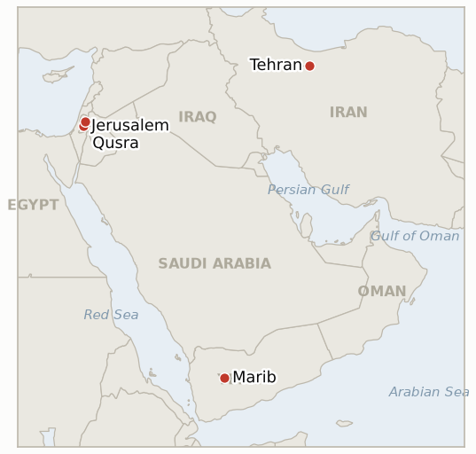

# Middle East Daily Briefing

**August 21, 2026**

- **Reporting window:** ~24 hours, August 20, 09:00 to August 21, 09:00 KST
- **Overall assessment:** Thursday's dominant signal was Washington sharpening its rhetoric rather than its munitions: Treasury Secretary Scott Bessent told CNBC the United States will "collapse this regime" through what he called the toughest sanctions in history, while cautioning the same push likely means no return to large scale combat operations, and President Trump framed the coming Monday, August 24 rollout as an "ECONOMIC D-DAY." The UAE's Tuesday missile claim against Iran still carries no independent US or CENTCOM corroboration five days on, even as the rhetoric alone helped extend oil's gains to a fifth straight session, Brent settling at $93.15 and WTI at $86.21, both the highest in nearly a month. South Korea's KOSPI staged the day's other headline reversal, surging 5.89% to 6,852.58, a day after its worst single session of the war, on SK Hynix's 40 trillion won buyback announcement and retreating US Treasury yields, tripping the year's 49th circuit breaker on the buy side this time, while the won firmed further to 1,392.6. In Gaza diplomacy, Thursday closed out the testable window on the Kushner and Mladenov visit: Netanyahu told the envoys that progress on the 15 point framework was politically "problematic" ahead of Israel's October 27 election and reiterated no withdrawal until Hamas is fully disarmed, restating rather than shifting his position even after Monday's agreement to form two working groups. The Qusra siege reached a twelfth day with trapped families reporting they have run out of food, Israeli forces still blocking resupply and declining to enforce their own closure order against the settlers rather than the residents. And Yemen's war widened further, with the government logging more than 100 operations against Houthi positions in 24 hours as Houthi missiles struck displacement camps in Marib.

---

## 1. What Happened

<figure style="float:right; width:46%; margin:2pt 0 8pt 14pt;">

<figcaption style="font-size:8pt; color:#666; text-align:center; margin-top:3pt; font-style:italic;">Major places of discussion</figcaption>
</figure>

### 1.1 Bessent Vows to "Collapse This Regime" as the UAE's Missile Claim Stays Unconfirmed and Oil Extends Its Climb to a Fifth Session

Treasury Secretary Scott Bessent told CNBC Thursday that the US will use its naval blockade and "the toughest sanctions in history" to "collapse" Iran's government, while separately telling the network the same economic escalation likely means the administration will not restart large scale combat operations, an apparent attempt to walk back market alarm even as he sharpened the rhetoric ([CNBC](https://www.cnbc.com/2026/08/20/bessent-economy-iran-war-trump.html); [The Hill](https://thehill.com/homenews/administration/6029661-scott-bessent-treasury-donald-trump-economic-pressure-iran-war/)). President Trump separately called the coming rollout an "ECONOMIC D-DAY" and urged US allies to join in isolating Tehran, with Bloomberg reporting Bessent will detail the specific new measures, potentially including action against the Chinese banks and shipping, insurance and refining intermediaries that have kept Iranian oil moving, at a press conference now scheduled for Monday, August 24 ([Bloomberg via Political Wire](https://politicalwire.com/2026/08/20/bessent-to-detail-u-s-plans-to-isolate-iran/); [Sahi](https://www.sahi.com/news/bessent-declares-us-will-impose-toughest-sanctions-in-history-against-iran-sanctions-PE)). That date falls two days after IND-20260815-1's own ~August 22 deadline, meaning the promised unveiling will not arrive in time to confirm that indicator on schedule. Separately, five days after the UAE's Tuesday claim that two Iranian ballistic missiles targeted its maritime navigation, neither Washington nor CENTCOM has independently corroborated Iranian origin, leaving Abu Dhabi's trade halt resting on its own assessment alone ([Al Jazeera](https://www.aljazeera.com/news/2026/8/20/are-hormuz-ships-more-willing-to-defy-iran-or-the-us-what-data-shows)). Oil extended its gains to a fifth straight session on the combined rhetoric, Brent settling at $93.15 (+1.67%) and WTI at $86.21 (+2.16%), both the highest in nearly a month ([TradingEconomics](https://tradingeconomics.com/commodity/brent-crude-oil)). With no fresh public shift toward negotiation and continued escalatory rhetoric through its own ~August 20 deadline, **IND-20260810-2** (Gen. Caine's private off ramp advocacy) resolves **Falsified**: the administration's public posture has moved toward tighter economic pressure, not toward the negotiated exit Caine was reported to be urging privately. **Confidence: High** on Bessent's and Trump's on record statements and the scheduled August 24 announcement (Tier 1-2, CNBC, Bloomberg, multi-outlet); **High** on the oil settle figures; **Medium** on the continued absence of independent UAE-Iran attribution, since a quiet US corroboration could in principle exist without being reported.

### 1.2 KOSPI Completes a Historic Round Trip, Surging 5.9% a Day After Its Worst Crash of the War

South Korea's KOSPI closed up 5.89% at 6,852.58 Thursday, a near complete reversal of Wednesday's 5.8% crash, after SK Hynix unveiled a 40 trillion won share buyback program and committed to directing at least half of its cumulative free cash flow to shareholders, with the stock surging 12.73% and Samsung Electronics gaining 9.49% ([Korea Times](https://www.koreatimes.co.kr/economy/20260820/kospi-surges-59-as-chipmakers-rally-on-shareholder-returns)). A buy side circuit breaker, the year's 49th activation and the first on the buy side during this stretch of volatility, tripped at 9:57 a.m. as foreign investors bought a net 1.7 trillion won even as domestic institutional and retail investors sold into the rally; falling US Treasury yields, after the Treasury conducted emergency debt buybacks, compounded the chip led relief rally. The won firmed further to 1,392.6, an 11 month high, gaining a further 5.1 won on top of Wednesday's move below 1,400 ([Seoul Economic Daily](https://en.sedaily.com/finance/2026/08/20/korean-won-hits-11-month-high-as-us-treasury-doubles-bond)). The reversal is an early, favorable data point for IND-20260820-2, which does not resolve until ~August 27, but a single day's snap back is not yet the sustained recovery the indicator's confirming branch requires. **Confidence: High** on the KOSPI close, circuit breaker trigger, and won level (Tier 1-2, multi-outlet Korean financial press); **High** on the SK Hynix buyback and its role as the proximate catalyst.

### 1.3 The Kushner and Mladenov Visit's Own Indicator Resolves as Netanyahu Restates, Rather Than Shifts, His Position

Meeting Jared Kushner and Nickolay Mladenov, Prime Minister Netanyahu said progress on the Board of Peace's 15 point framework was politically "problematic" ahead of Israel's October 27 Knesset election and reiterated that no Israeli pullback would be approved before Hamas's full disarmament of both light and heavy weapons, a day after his office announced the two sides had agreed to form working groups on disarmament and on Gaza's sanitation and water needs ([Times of Israel](https://www.timesofisrael.com/kushner-netanyahu-meet-for-hours-in-jerusalem-amid-push-for-us-backed-gaza-plan/); [The National](https://www.thenationalnews.com/news/mena/2026/08/17/kushner-meets-netanyahu-to-break-gaza-board-of-peace-deadlock/)). No formal Israeli Security Cabinet vote on the framework occurred and no disarmament timeline gained Hamas's acceptance during the visit's window. Because the visit occurred rather than being postponed or cancelled, but produced no public change in Netanyahu's disarmament first sequencing beyond the working groups already reported August 17, **IND-20260814-2** resolves **Falsified** at its ~August 21 deadline: process movement continued, but the substantive position did not move. **Confidence: High** on Netanyahu's quoted remarks and the working groups agreement (Tier 1-2, Times of Israel, The National, multi-outlet); **Medium** on whether any private, unreported softening occurred alongside the public restatement.

### 1.4 Qusra's Siege Reaches a Twelfth Day as Food and Medicine Run Out

Israeli settlers continued for a twelfth consecutive day to besiege three Palestinian homes in Qusra's Ras al-Ain area, with trapped residents telling reporters they are now "starving" as Israeli forces restrict resupply of food and medicine into the closed military zone they declared but continue to enforce only against the residents, not the settlers roaming the area ([Middle East Eye](https://www.middleeasteye.net/news/we-are-starving-palestinians-besieged-settlers-west-bank-homes-run-out-food); [Middle East Monitor](https://www.middleeastmonitor.com/20260820-israeli-occupiers-besiege-3-west-bank-homes-for-12th-consecutive-day/)). One of the three homes remains converted into a military barracks, and no Israeli government or IDF statement addressed the deepening food and medicine shortage in Thursday's window. The siege continues to test **IND-20260813-3** (dismantlement, deadline ~August 27, six days out) and now separately tests whether the shortage itself draws an intervention before it becomes an acknowledged humanitarian emergency; new **IND-20260821-2** opens to track that narrower question. **Confidence: High** on the siege's twelfth day status and the reported food shortage (Tier 1-2, Middle East Eye, Middle East Monitor, corroborating the UN's and Amnesty's earlier documentation); **Medium** on the precise severity of the shortage, since no aid agency has yet published a formal assessment of caloric or medical need.

### 1.5 Yemen's Government Escalates Further as Houthi Missiles Strike Marib's Displacement Camps

Yemen's internationally recognized government said its forces conducted more than 100 operations against Houthi positions in the 24 hours preceding Thursday's reporting, while Houthi forces fired missiles into displacement camps and residential neighborhoods in government held Marib, an escalation the government's information ministry called a deliberate threat to civilian life ([Al Jazeera](https://www.aljazeera.com/news/2026/8/18/yemeni-government-escalates-attacks-against-houthis-whats-next); [HNGN](https://www.hngn.com/articles/272756/20260815/yemens-civil-war-reignites-houthi-forces-escalate-attacks-government-positions-taiz.htm)). Fighting continues across Marib, Hadramaut, Taiz, al-Dhalea and al-Hudaydah, and the UN's special envoy has told the Security Council Yemen faces its highest civil war risk since the 2022 truce. The continued spread and mutual escalation keeps testing **IND-20260817-1** (deadline ~August 31), which asks whether the widening war draws renewed international mediation; none has yet materialized. **Confidence: High** on the operational tempo and the Marib strikes (Tier 1-2, Al Jazeera, multi-outlet); **Medium** on the precise casualty toll, which varies by source and has not been independently verified.

---

## 2. Deep Dive: Incentives and Motives

### 2.1 Why would Washington escalate its economic rhetoric against Iran the same week it is trying to reassure markets no new combat is coming?

Because sanctions and blockade enforcement are the one lever the administration can tighten without adding troops or risking further Hormuz shipping losses, Bessent's "collapse the regime" framing lets Trump claim an escalating, "D-Day" scale campaign for domestic political consumption while his own "likely no return to large scale combat" caveat is aimed at the market and at allies who fear the war reigniting, letting the administration escalate its language without escalating its actual military posture.

### 2.2 Why did Netanyahu tell Kushner the disarmament framework was politically problematic now, rather than simply rejecting or accepting it outright?

Because Israel's October 27 election makes any visible concession on Gaza a target for Netanyahu's own coalition partners well before Hamas has surrendered a single weapon, so framing the issue as a timing problem rather than a substantive rejection lets him keep the process alive with Washington, avoid the political cost of a public break with Kushner, and still hold the line his base expects until the disarmament sequencing is fully met.

### 2.3 Why would Korean chipmakers announce major shareholder returns the same week global markets are pricing in compounding Middle East and yield risk?

Because SK Hynix and Samsung's underlying AI and memory demand cycle has not changed even as macro risk spiked, so a large buyback lets them signal confidence in their own cash generation precisely when a war driven, yield driven selloff has depressed their valuations furthest, both defending the share price against a shock unrelated to their fundamentals and rewarding the shareholders who stayed through Wednesday's crash.

### 2.4 Why does the UAE's missile claim remain uncorroborated by Washington five days on, even as the US amplifies the broader pressure campaign against Iran?

Because independently confirming Iranian origin would commit the US to treating an attack on a partner's territory as an alliance matter with escalatory obligations attached, while the economic isolation campaign lets Washington keep pressuring Tehran on the broader war without taking on that specific commitment, so the administration has an incentive to let the UAE's own accusation stand unendorsed rather than either corroborating or disputing it.

### 2.5 Why does Israel keep declining to enforce its own closed military zone order against the Qusra settlers even as the humanitarian toll now includes reported starvation?

Because enforcing the order against settlers rather than residents would require using force against a political constituency the government depends on, and the political cost of that confrontation still outweighs, in the government's calculus, the reputational cost of continued international condemnation, so the siege persists along the same selective enforcement pattern even as its consequences visibly worsen.

---

## 3. Policy Implications for South Korea

### 3.1 Exposure snapshot

| Item | Current reading | Source |
| --- | --- | --- |
| Middle East share of crude imports | 48.5% (May-July 2026), down from 69.1% a year earlier; non-Middle East share crossed 50% for the first time on record | KNOC via Asia Business Daily; `korea-exposure.md` |
| July-August crude procurement | 110%+ of prior-year volume secured (MOTIE, July 21); strategic reserve swap extended through August, ~21 million barrels swapped to date | MOTIE via Herald Business, Hankyung; `korea-exposure.md` |
| September crude procurement | 90%+ secured (MOTIE, July 21) | MOTIE via Herald Business; `korea-exposure.md` |
| Red Sea detour routing | Korean-bound crude cargoes continue via the Yanbu/Red Sea workaround; Yanbu exports to Asian buyers including Korea have surged to ~4 million bpd from under 1 million bpd a year earlier | Lloyd's List Intelligence; `korea-exposure.md` |
| Strategic reserve coverage | ~26 days of actual consumption (estimate); swap on immediate standby, untested at scale | CSIS; MOTIE July 27 |
| Refiner Saudi ownership exposure | S-Oil (Saudi Aramco majority ~63%), HD Hyundai Oilbank (Aramco ~17%) | Public filings; `korea-exposure.md` |
| Brent / WTI | Thursday settle $93.15 / $86.21, a fifth straight gain and highest in nearly a month, as Bessent's "collapse the regime" vow and the still unconfirmed UAE missile claim compounded thin Hormuz shipping | TradingEconomics; CNBC |
| KOSPI / USD-KRW | KOSPI +5.89% to 6,852.58, the year's 49th circuit breaker (buy side), on SK Hynix's buyback and falling Treasury yields; won firmed to 1,392.6, an 11 month high | Korea Times; Seoul Economic Daily |
| Hormuz transits | Reuters via Kpler: 6 vessels Wednesday August 19 against a 10-day average of 11; the same reporting revised Tuesday August 18 up to 9 crossings from the 6 previously reported, underscoring the count's inherent noisiness | Reuters via Kpler |

### 3.2 Implications by development

**Bessent's "collapse the regime" vow and the coming August 24 sanctions rollout is today's clearest signal that Washington intends to widen economic pressure on Iran rather than de-escalate, a trajectory that keeps oil's war premium embedded in Korea's import bill regardless of whether new fighting breaks out.** New IND-20260821-1 (deadline ~August 26) tests whether the rollout contains genuinely new mechanisms; IND-20260815-1 (deadline ~August 22, one day out) now looks likely to lapse before the August 24 announcement arrives.

**KOSPI's 5.9% reversal is today's clearest direct market relief for Korea, but a single day's snap back on a company specific buyback catalyst does not yet resolve whether Wednesday's crash reflected a durable repricing of compounding war and yield risk.** IND-20260820-2 (deadline ~August 27, six days out) continues tracking the underlying question; the chart above tracks both series directly.

**The Kushner Netanyahu indicator's resolution without a policy shift has no direct Korean market exposure but confirms the Gaza normalization track, and the regional risk premium tied to it, remains stalled rather than advancing, keeping the broader war footing that has driven Korea's own market volatility this month unresolved.** IND-20260812-4 (deadline August 26, five days out) continues tracking whether the underlying Security Cabinet vote itself ever occurs.

**Qusra's food crisis and Yemen's widening war both have no direct Korean market exposure but continue to test whether either conflict crosses a threshold, an acknowledged humanitarian emergency in the West Bank, or a coordinated mediation effort in Yemen, that would mark a step change in regional instability.** New IND-20260821-2 (deadline ~August 28) tests the Qusra threshold; IND-20260817-1 (deadline August 31, ten days out) continues tracking Yemen's.

**Testable indicators:**

- **IND-20260821-1** — Treasury Secretary Bessent's Monday, August 24 sanctions rollout, framed by Trump as an "ECONOMIC D-DAY," either targets genuinely new mechanisms, Chinese banks, yuan denominated oil payment channels, or the shipping, insurance and refining intermediaries sustaining Iranian exports, going beyond the existing naval blockade and prior sanctions regime, or the announcement reiterates existing measures without materially new tools. Reporting confirming at least one newly targeted mechanism not previously sanctioned, by ~2026-08-26, confirms a genuinely expanded campaign; an announcement that restates the existing blockade and prior sanctions list without new targets through the same date falsifies it as rhetorical escalation without substantive expansion.
- **IND-20260821-2** — The Qusra siege's food and medicine shortage, now twelve days old and described by trapped residents as starvation, either draws an Israeli intervention restoring unimpeded resupply within about a week, or the shortage continues unaddressed, converting the siege into a documented humanitarian emergency. Verified restoration of food and medicine access to the besieged homes by ~2026-08-28 confirms an intervention; continued blocked resupply through the same date, with no Israeli government or IDF statement addressing it, falsifies any near-term relief and confirms the siege has become an acknowledged emergency.

---

## 4. Watch List

- **Whether Bessent's August 24 sanctions rollout delivers genuinely new mechanisms or reiterates existing measures** (IND-20260821-1, deadline August 26).
- **Whether the Qusra food and medicine shortage draws an Israeli intervention before it hardens into an acknowledged emergency** (IND-20260821-2, deadline August 28).
- **Whether South Korea's KOSPI reversal holds or Wednesday's crash reasserts itself within the week** (IND-20260820-2, deadline August 27).
- **Whether the $206 million Gaza stabilization funding converts into visible deployment activity** (IND-20260820-3, deadline September 19).
- **Whether the UAE's Iran missile claim is independently confirmed or the dispute escalates further** (IND-20260820-1, deadline September 3).
- **Whether Bessent's promised unprecedented Iran economic isolation package, now delayed to August 24, ultimately underdelivers relative to the existing regime** (IND-20260815-1, deadline August 22, one day out).
- **Whether the June 17 MOU's toll free Hormuz window converts into actual Iranian tolls or a quiet extension** (IND-20260814-1, deadline August 24).
- **Whether the US Navy's kinetic blockade enforcement, or Iran's threatened "precise strikes," draws an actual US-Iran military exchange** (IND-20260812-1, deadline August 26).
- **Whether the Gaza disarm-first framework ever reaches a formal Israeli Security Cabinet vote in any form** (IND-20260812-4, deadline August 26).
- **Whether the Qusra siege is ever actually resolved, now deepening toward its own falsification at day twelve** (IND-20260813-3, deadline August 27).
- **Whether the August 15 Hezbollah-Israel exchange triggers a further round or both sides step back to the post-truce equilibrium** (IND-20260816-1, deadline August 29).
- **Whether the Gaza Yellow Line incidents prompt a formal IDF operational response or stay isolated** (IND-20260816-2, deadline August 30).
- **Whether Yemen's confirmed spread draws renewed international mediation as the government logs 100-plus daily operations** (IND-20260817-1, deadline August 31).
- **Whether Trump's declared intent to make Hormuz US territory produces any concrete policy step beyond his map post** (IND-20260817-2, deadline August 31).
- **Whether Israel's prepared Ali al Taher ridge operation actually launches** (IND-20260818-2, deadline August 31).
- **Whether the Rome track's provisionally scheduled September 1 eighth round proceeds** (IND-20260807-2, deadline September 1).
- **Whether Trump's threat to bomb Oman produces any real diplomatic or military consequence** (IND-20260818-1, deadline September 1).
- **Whether the Houthis' claimed strike on Saudi naval vessels is confirmed or draws a direct Saudi response** (IND-20260818-3, deadline September 1).
- **Whether Katz's uncoordinated West Bank police handover proceeds or is delayed or blocked** (IND-20260819-2, deadline September 1).
- **Whether the fatal Minoan Dignity attack is ever attributed or draws a military response** (IND-20260819-1, deadline September 2).
- **Whether a signed Iran-Oman Hormuz joint statement with an operating date is reached, or the shipping map deal stalls again short of signature** (IND-20260816-3, deadline September 5).
- **Whether the Syria nuclear material find converts into a concluded agreement and verified removal** (IND-20260812-2, deadline September 11).
- **Whether the West Bank IDF-to-police enforcement transfer reduces settler violence, or leaves it unchanged** (IND-20260815-2, deadline September 12).
- **Whether Syria moves against Hezbollah in Lebanon despite Iran's warning, or the confrontation stays rhetorical** (IND-20260815-3, deadline September 15).
- **Whether Kaine's privileged war powers resolution on Oman passes, fails, or never reaches a floor vote when the Senate returns in September** (IND-20260819-3, deadline September 25).
- **Whether the Caroline Bezengi oil spill is contained now that salvage work has begun.**
- **Whether the Qeshm Island explosions are ever confirmed as a real strike or resolved as a false alarm.**

---

## 5. Source Quality Summary

| Claim | Sources | Confidence |
| --- | --- | --- |
| Bessent vows to "collapse this regime," calls large scale combat unlikely; Trump calls it "ECONOMIC D-DAY," rollout set for August 24 | CNBC, The Hill, Bloomberg via Political Wire, Sahi (Tier 1-2, on record statements, multi-outlet) | High |
| UAE's Iranian missile claim remains without independent US/CENTCOM corroboration five days on | Al Jazeera (Tier 1-2, cross-referenced with absence of any US government statement) | Medium-High |
| Brent settles $93.15, WTI $86.21 Thursday, fifth straight gain, highest in nearly a month | TradingEconomics, cross-referenced with CNBC reporting | High |
| KOSPI surges 5.89% to 6,852.58, year's 49th circuit breaker (buy side); won firms to 1,392.6, an 11 month high | Korea Times, Seoul Economic Daily (Tier 1-2, multi-outlet Korean financial press) | High |
| SK Hynix unveils 40 trillion won buyback; SK Hynix +12.73%, Samsung Electronics +9.49% | Korea Times (Tier 1-2, multi-outlet Korean financial press) | High |
| Netanyahu calls 15 point framework progress "politically problematic" ahead of the October 27 election, reiterates no pullback until full disarmament | Times of Israel, The National (Tier 1-2, on the record Israeli government sourcing, multi-outlet) | High |
| Qusra siege reaches twelfth day; trapped residents report running out of food | Middle East Eye, Middle East Monitor (Tier 2, on scene and residency sourcing, corroborating UN and Amnesty documentation) | High on the day count and food shortage; Medium on precise severity |
| Yemen's government logs 100-plus operations against Houthi positions in 24 hours; Houthi missiles strike Marib displacement camps | Al Jazeera, HNGN (Tier 1-2, government and UN sourcing, multi-outlet) | High on the operational tempo; Medium on casualty figures |
