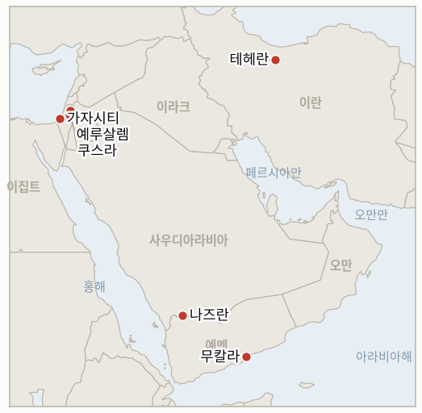

# 중동 일일 브리핑

**2026년 8월 22일**

- **보고 기간:** 약 24시간, 8월 21일 09:00 ~ 8월 22일 09:00 (한국시간)
- **종합 평가:** 금요일의 지배적인 흐름은 워싱턴의 대이란 경제전이 실질보다 달력에 부딪혔다는 점이었다. 지난 7월과 8월 중순부터 추적해 온 지표 두 건이 같은 약 8월 22일 시한에 도달했고 둘 다 반증으로 확정됐다. 의회는 전쟁 자체에 뿌리를 둔 상원의 봉쇄 끝에 700억 달러 이상의 전쟁 추가경정예산에 아무것도 배정하지 않았고, 베선트 재무장관이 약속한 "전례 없는" 제재 패키지는 예정대로 나오지 못하고 월요일 기자회견으로 미뤄졌다. 그럼에도 유가는 거의 한 달 만의 최고치 부근을 유지해 브렌트유는 93.93달러, WTI유는 86.64달러로 마감하며 각각 엿새 연속 상승했고, 같은 기간 한국 시장도 계속 올라 코스피는 0.88% 오른 6912.95로 마감했고 원화는 반도체 기업의 지속된 자사주 매입 자금 흐름에 힘입어 11개월 만의 최고치인 1386.5원을 기록했다. 예멘 전쟁은 두 전선에서 확대됐다. 후티 드론이 사우디아라비아 나즈란 공항과 아람코 시설을 타격했다고 주장하는 동시에, 소말리아 해적은 이란 자체의 제재 대상 그림자 선단 유조선을 무칼라 인근에서 나흘 사이 두 번째로 납치했다. 가자지구 외교는 두 건의 동맹국 질책을 동시에 받았다. 영국·호주·캐나다·폴란드는 이스라엘이 월드 센트럴 키친 공습 수사를 종결한 것을 "수치스럽다"고 규탄했고, 튀르키예·이집트·카타르는 화요일 이후 팔레스타인인 최소 16명이 숨진 최근 이스라엘의 공습이 휴전을 훼손한다고 공동 규탄했다. 그리고 쿠스라에서는 IDF가 마침내 포위하던 정착민들을 철수시켰지만, 주민들은 정작 정착민들 자신은 한 번도 구속하지 못했던 바로 그 폐쇄 명령에 따라 병력이 이제 자신들을 집 안에 가두고 있다고 전했다.

---

## 1. 오늘의 주요 사건

<figure style="float:right; width:46%; margin:2pt 0 8pt 14pt;">

<figcaption style="font-size:8pt; color:#666; text-align:center; margin-top:3pt; font-style:italic;">주요 논의 지점</figcaption>
</figure>

### 1.1 워싱턴의 대이란 경제전, 자체 시한에 부딪히다: 의회 예산과 베선트 제재 패키지 모두 지연

7월과 8월 중순에 각각 개설된 지표 두 건이 모두 약 8월 22일 시한을 안고 있었고, 둘 다 같은 시간대에 반증으로 확정됐다. 첫째, 의회는 6월 행정부가 제출한 헤그세스 국방장관의 700억 달러 이상 긴급 전쟁 추가경정예산(공식적으로는 876억 달러 규모, 이 중 국방 관련이 670억 달러)에 대해 어떠한 세출 조치도 취하지 않았다. 상원은 7월 중순 이를 담고 있던 국방수권법안의 토론 개시조차 50 대 46으로 부결시켰으며, 민주당은 이란 전쟁 자체와 미국·이스라엘 군 통합 조항을 명시적으로 반대 이유로 들었고, 이후 추가경정예산 자체에 대한 별도 표결도 없었다([알자지라](https://www.aljazeera.com/news/2026/7/14/senate-democrats-block-defence-bill-over-iran-war-israel-provisions); [PBS](https://www.pbs.org/newshour/politics/watch-live-senate-democrats-block-1-trillion-annual-defense-bill-in-protest-over-iran-war)). 이는 전쟁 자체에 결부된, 단순한 침묵이 아닌 실제로 공개 귀속된 봉쇄 행위이므로 **IND-20260723-1**은 **반증**으로 확정된다. 확정 조건이 요구했던 무제한적 자금 지원은 실현되지 않았다. 둘째, 8월 15일 "다음 주"에 내놓겠다던 베선트의 "전례 없는" 제재 패키지는 대신 8월 24일 월요일 기자회견으로 미뤄졌고, 금요일에도 밴스 부통령과 베선트는 "역사상 가장 강력한 조율된 경제적 고립"이라는 캠페인 수사를 되풀이했을 뿐 새로운 조치는 하나도 명시하지 않았다([알자지라 라이브블로그](https://www.aljazeera.com/news/liveblog/2026/8/20/iran-war-live-trump-announces-most-crushing-iran-sanctions); [CNN](https://www.cnn.com/2026/08/20/world/live-news/iran-war-trump)). 자체 시한인 8월 22일까지 구체적 조치가 나오지 않아 **IND-20260815-1**은 "지연"으로 **반증** 확정되며, 월요일 발표가 실제로 새로운 내용을 담는지에 대한 실질적 질문은 IND-20260821-1이 별도로 계속 추적한다. **신뢰도: 높음** — 상원 표결과 그 명시된 이유(1~2등급, 알자지라·PBS, 다수 매체). **신뢰도: 높음** — 보고 기간 중 구체적인 베선트 패키지가 나오지 않았다는 점(1~2등급, 알자지라·CNN).

### 1.2 한국 반등 이틀째, 원화는 11개월 만의 최고치

코스피는 금요일 0.88%(+60.37포인트) 오른 6912.95로 마감해 목요일 5.89% 반전에 이어 이틀 연속 상승했다. 삼성전자와 SK하이닉스가 주주환원 기대를 계속 이끌었으나, 코스닥은 소형 성장주에서 자금이 빠지는 별도의 순환매 속에 4.63% 하락했다([코리아중앙데일리](https://www.koreajoongangdaily.com/business/kospi-ends-higher-on-chip-gains-amid-hopes-for-shareholder-return-plans/12837331); [블루밍비트](https://en.bloomingbit.io/feed/news/118803)). 원화는 목요일 1392.6원에서 6.1원 더 떨어진 1386.5원으로 마감해 약 11개월 만의 최고치를 기록했고 장중에는 1380.3원까지 찍었다. SK하이닉스와 삼성전자의 주주환원 발표에 결부된 달러 매도가 원화 강세에 대한 역외 투자자들의 베팅과 겹쳤으며, 권민수 한국은행 부총재보는 원화의 하락(강세) 추세가 "펀더멘털상 옳은 방향"이라고 밝혔다([서울경제신문 영문판](https://en.sedaily.com/finance/2026/08/21/korean-won-hits-11-month-high-as-chipmaker-payouts-fuel)). 이번 반전은 이제 이틀째로 접어들었으며, IND-20260820-2가 약 8월 27일 시한에 확정으로 결론 나기 위해 요구하는 지속적 회복에는 아직 못 미치지만, 반전 없는 날이 하루씩 더해질 때마다 그 확정 가능성은 커지고 있다. **신뢰도: 높음** — 코스피 종가와 원화 수준(1~2등급, 다수 한국 금융 매체). **신뢰도: 중간** — 반도체 자금 흐름과 전반적인 달러 약세 사이의 정확한 기여도 구분은, 두 요인이 동시에 같은 방향으로 움직였다는 점에서 불확실하다.

### 1.3 예멘 전쟁, 두 전선에서 동시 확산: 후티가 사우디를 타격하는 사이 해적이 이란 자체 그림자 선단을 나포

후티 군사 대변인 야히아 사리는 금요일 그룹이 사우디아라비아의 두 표적에 드론 공격을 가했다고 밝혔다. 나즈란 공항의 "민감한" 표적 한 곳과 특정되지 않은 아람코 시설이었으며, 사우디의 사다 주에 대한 사우디 측 드론 정찰에 대한 보복이라고 설명했다. 리야드는 두 공격 중 어느 쪽도 실제로 명중했는지 확인하지 않았다([미들이스트모니터](https://www.middleeastmonitor.com/20260821-yemens-houthis-say-they-successfully-struck-two-saudi-targets-with-drones/); [알모니터](https://www.al-monitor.com/originals/2026/08/houthis-claim-new-strikes-saudi-arabia-after-irgc-warning-what-know)). 이와는 별개로 후티와 무관하게, 무장 괴한 6명이 유조선 시부 1호(구 시멀호)를 납치했다. 이 선박은 에리트레아 국적으로, 미 재무부가 지난 12월 이란 그림자 선단 소속으로 제재했으며 후티가 통제하는 라스이사 터미널에 상시적으로 연료를 운송해온 배로, 무칼라에서 동쪽으로 약 136해리 떨어진 해상에서 나포됐다. 이는 나흘 만에 두 번째 아덴만 납치 사건이며 올해 소말리아 인근에서 공격받은 최소 13번째 선박이다([알자지라](https://www.aljazeera.com/news/2026/8/20/gunmen-seize-tanker-off-yemen-amid-resurgence-of-somali-piracy); [데일리스타](https://www.thedailystar.net/news/world/news/iran-linked-oil-tanker-falls-victim-somali-piracy-surge-4253521)). 두 사건 모두 아직 인명 피해나 지속적 피해가 확인되지는 않았지만, 함께 놓고 보면 전쟁의 파급이 새로운 국가 행위자인 사우디아라비아와 완전히 별개의 범죄적 위협인 조직화된 해적 행위 양쪽으로 같은 24시간 동안 번졌음을 보여준다. **신뢰도: 높음** — 시부 1호 납치(1~2등급, 알자지라, UKMTO 소싱, 다수 매체). **신뢰도: 중간** — 나즈란·아람코에 대한 후티의 주장은 사우디 측의 독자적 확인 없이 자체 대변인 발언에만 근거한다.

### 1.4 가자지구 외교, 한 시간대에 동맹국 두 건의 질책을 동시에 받다

영국, 호주, 캐나다, 폴란드는 영국·호주 국적자와 캐나다·미국 이중국적자를 포함해 월드 센트럴 키친 구호요원 7명이 숨진 공습에 대한 이스라엘의 형사수사 종결 결정을 "수치스럽다"고 규탄하는 공동성명을 발표했다. 이들은 발표 시점이 세계인도주의의날과 겹쳤다는 점과, 2년 넘게 책임 규명을 촉구해왔다는 점을 짚었다. IDF 자체 검토는 "심각한 절차상 결함"은 있었으나 형사기소 근거는 없다고 결론지었다([미들이스트모니터](https://www.middleeastmonitor.com/20260821-uk-australia-canada-call-israels-decision-to-close-world-central-kitchen-strike-probe-shameful/); [영국 정부 공동성명](https://www.gov.uk/government/news/joint-statement-israel-closing-the-investigation-into-strikes-on-world-central-kitchen-convoy)). 별도로 휴전의 중재국인 튀르키예, 이집트, 카타르는 화요일 이후 팔레스타인인 최소 16명이 숨진 이스라엘의 가자지구 공습을 공동 규탄하며, 이러한 격화가 평화이사회가 더 넓은 계획을 이행하려는 "결정적 국면에서 지역·국제적 노력을 훼손한다"고 밝혔다([알모니터](https://www.al-monitor.com/originals/2026/08/turkey-egypt-qatar-condemn-israeli-attacks-gaza-call-israel-comply-ceasefire)). 두 성명 모두 강제 이행 수단은 없으며, 이스라엘은 어느 쪽에도 대응해 태세를 바꾸지 않았다. **신뢰도: 높음** — 두 공동성명의 내용과 서명국(1등급, 정부 성명 및 다수 매체 보도). **신뢰도: 중간** — 정확한 가자지구 사상자 수는 가자지구 의료당국 소싱으로 독자적으로 검증되지 않았다.

### 1.5 쿠스라, 정착민은 물러갔지만 병력이 이제 주민을 집 안에 가둬

새로운 보도에 따르면 이스라엘군은 거의 2주간 쿠스라 라스알아인 지역의 팔레스타인 가옥 세 채를 포위해온 정착민 전초기지를 철거하고, 대신 세 가옥의 입구에 병력을 배치했다. 하지만 주민들은 정착민이 아닌 활동가와 취재진을 막기 위해 군이 애초에 발동했던 바로 그 군사 폐쇄 구역 명령에 따라 여전히 집 밖으로 나가지 못하고 있다고 전했다([타임스오브이스라엘](https://www.timesofisrael.com/liveblog_entry/idf-soldiers-stationed-at-entrances-to-qusra-homes-residents-still-cant-leave/)). 목요일 주민들이 스스로 굶고 있다고 표현한 식량·의약품 부족에 대해 이스라엘 정부나 IDF의 어떠한 입장 표명도 보고 기간 중 없었다. 정착민 철수는 IND-20260813-3(해체, 시한 약 8월 27일)에 부분적으로 유리한 신호이지만, 이 지표가 요구하는 실제 기준인 전초기지의 완전한 해체와 재발 없는 종식은 병력이 같은 부지를 점거하고 있는 한 완전히 충족되지 않는다. 재보급 재개라는 더 좁은 질문을 추적하는 IND-20260821-2는 약 8월 28일 시한까지 계속 열려 있으며, 재보급이 재개됐다는 확인은 아직 없다. **신뢰도: 높음** — 정착민 철수와 병력 배치(1~2등급, 타임스오브이스라엘, 목요일 미들이스트아이·미들이스트모니터 보도의 흐름과 부합). **신뢰도: 중간** — 이 감금이 이제 보호 목적인지 아니면 여전히 기본값으로 이어지는 폐쇄 조치인지는 IDF의 어떠한 설명도 없어 불확실하다.

---

## 2. 심층 분석: 동기와 배경

### 2.1 왜 워싱턴의 예산과 제재 시한이 예정대로 도달하지 못하고 같은 시한에 함께 지연됐는가?

두 절차 모두 백악관도 의회도 완전히 통제하지 못하는 각기 다른 제도적 시계에 따라 움직이기 때문이다. 876억 달러 규모의 추가경정예산은 전쟁에 지친 상원이 계속 내주지 않는 본회의 시간이 필요하고, "다음 주"라는 제재 약속은 재무부가 대상을 지명하기 전에 법적으로 방어 가능한 지정 절차를 완료해야 한다. 따라서 이번 우연의 일치는 조율된 유예라기보다 입법적 병목과 관료적 병목이라는 서로 다른 두 제약이 행정부가 정한 같은 시한에 우연히 함께 도달한 결과에 가깝다.

### 2.2 워싱턴 자체의 지표들이 대이란 압박 캠페인이 정체되고 있음을 확인시키는 와중에도 한국 시장은 왜 이틀째 반등을 이어가는가?

현재 한국 주식 흐름을 이끄는 것은 전쟁의 궤적과 무관한 기업 고유 촉매, 즉 SK하이닉스와 삼성전자의 자사주 매입·배당 발표이기 때문이다. 정체된 제재 발표는 기존 봉쇄를 확대하는 대신 현상을 그대로 유지하는 것이므로 하방 리스크를 새로 더하지 않으면서도 상방 촉매를 새로 만들어내지도 않는다. 그 결과 더 넓은 전쟁이 여전히 미해결 상태로 남아 있음에도 반도체 주도 랠리는 자체 논리대로 계속될 수 있다.

### 2.3 전쟁의 무게중심이 미국-이란 경제적 대치로 옮겨간 지금, 후티는 왜 사우디아라비아에 대한 직접 타격을 감행하는가?

워싱턴과 테헤란 모두 총격전이 아닌 자신들의 경제적 압박 서사에 몰두해 있는 지금 사우디아라비아에 대한 타격은 후티에게 비용이 크지 않으면서도, 더 부유한 역내 경쟁국을 상대로 한 도달 능력을 과시하고 "확전에는 확전으로"라는 억지 공식을 재확인할 기회가 된다. 워싱턴도 리야드도 지금은 이에 대응해 두 번째 군사 전선을 열 여력도 의지도 없는 시점이기에 더욱 그렇다.

### 2.4 영국, 호주, 캐나다, 폴란드는 왜 다른 시점이 아닌 바로 이번 주에 이스라엘의 월드 센트럴 키친 결정을 "수치스럽다"고 규탄했는가?

그 결정이 다름 아닌 세계인도주의의날에 발표됐고, 2년 넘게 해당국들이 비공개로 책임 규명을 압박해온 뒤였기 때문이다. 이는 평소라면 조용한 외교 각서에 그쳤을 사안을 공개 규탄이 정치적으로 값어치 있다고 판단할 만큼 상징적 무게가 실린 순간으로 바꿔놓았으며, 특히 공습으로 자국민을 잃은 네 나라의 국내 여론이 대응을 지켜보고 있었다는 점도 작용했다.

### 2.5 IDF는 왜 쿠스라의 정착민들을 철수시켜 놓고도 이제 주민들 자신을 같은 폐쇄 명령으로 가두는가?

군사 폐쇄 구역 지정은 애초에 주민의 안전을 위한 조치가 아니라 접근과 정보를 통제하기 위한 수단이었기 때문이다. 그래서 정착민을 철수시키는 것만으로 눈에 보이는 폭도 폭력이라는 정치적·평판적 문제는 해결되지만, 군이 이미 구축해 놓은 더 넓은 통제 메커니즘 자체를 포기할 필요는 없다. 그 결과 국제적 관심을 불러온 즉각적인 물리적 위협이 사라진 뒤에도 주민들은 여전히 자유롭게 움직이지 못한다.

---

## 3. 한국에 대한 정책적 함의

### 3.1 노출도 스냅샷

| 항목 | 현재 수치 | 출처 |
| --- | --- | --- |
| 원유 수입 중 중동 비중 | 48.5%(2026년 5~7월), 1년 전 69.1%에서 하락; 비중동 비중이 사상 처음 50%를 넘어섬 | 한국석유공사(KNOC), 아시아경제 인용; `korea-exposure.md` |
| 7~8월 원유 확보 | 전년 동기 물량의 110% 이상 확보(산업통상자원부, 7월 21일); 전략비축유 스와프를 8월까지 연장, 현재까지 약 2100만 배럴 스와프 | 산업통상자원부, 헤럴드경제·한경 인용; `korea-exposure.md` |
| 9월 원유 확보 | 90% 이상 확보(산업통상자원부, 7월 21일) | 산업통상자원부, 헤럴드경제 인용 |
| 홍해 우회 항로 | 한국행 원유 화물은 얀부/홍해 우회 항로를 계속 이용 중; 얀부에서 한국을 포함한 아시아 구매자로의 수출은 1년 전 하루 100만 배럴 미만에서 약 400만 배럴로 급증 | 로이즈리스트 인텔리전스; `korea-exposure.md` |
| 전략비축유 커버리지 | 실제 소비 기준 약 26일분(추정); 스와프는 즉시 대기 상태이나 대규모 실전 검증은 없음 | CSIS; 산업통상자원부(7월 27일) |
| 정유사 사우디 지분 노출 | S-Oil(사우디 아람코 지분 약 63%), HD현대오일뱅크(아람코 지분 약 17%) | 공시자료; `korea-exposure.md` |
| 브렌트유/WTI유 | 금요일 정산가 93.93달러/86.64달러, 엿새 연속 상승하며 거의 한 달 만의 최고치; 워싱턴의 대이란 압박 캠페인이 두 시한을 넘겼음에도 구체 조치 없이 고점 부근을 유지 | 트레이딩이코노믹스 |
| 코스피/원달러 환율 | 코스피 +0.88%로 6912.95 마감, 이틀 연속 상승; 원화는 1386.5원으로 추가 강세, 11개월 만의 최고치, 장중 1380.3원까지 하락(강세) | 코리아중앙데일리; 서울경제신문 영문판 |
| 호르무즈 통항량 | 보고 기간 중 새로운 검증된 일일 통항량 없음; 로이터/Kpler의 마지막 발표치는 8월 19일 수요일 6척, 10일 평균 11척 그대로 유지 | 로이터, Kpler 인용(이월) |

### 3.2 사건별 함의

**오늘 확정된 두 지표는 한국에 같은 방향을 가리킨다. 워싱턴의 대이란 경제 압박 캠페인은 수사로는 실재하지만 예산과 실질 양면에서 지금 당장은 미흡한 상태이며, 이는 한국의 수입 비용을 더 끌어올릴 근시일 내 확전 가능성을 낮추는 동시에 그것을 낮춰줄 근시일 내 출구도 아직 보이지 않는다는 뜻이다.** IND-20260821-1(시한 약 8월 26일)이 월요일 발표가 이 그림을 바꾸는지를 시험하는 부담을 이어받으며, IND-20260814-1(호르무즈 통행료 문제, 시한 약 8월 24일)이 그로부터 며칠 안에 확정된다.

**코스피의 이틀 연속 상승과 원화의 11개월 만의 최고치는 오늘 한국에 가장 직접적인 신호이며, 반전 없는 날이 하루 더해지면서 목요일 폭락이 지속적인 재평가가 아닌 단발성 기술적 사건이었다는 판단이 유의미하게 힘을 얻고 있다.** IND-20260820-2(시한 약 8월 27일, 5일 남음)가 근본 질문을 계속 추적하며, 위 차트가 두 지표를 직접 추적한다.

**후티의 사우디아라비아 타격과 시부 1호 납치 모두 오늘 한국 화물에 직접적 노출은 없다. 한국의 자체 항로는 이들 사건이 걸친 바브엘만데브·아덴만 회랑이 아닌 홍해/얀부 우회로를 이용하기 때문이다. 다만 이미 교란된 호르무즈·홍해 리스크 지도에 해적 재발까지 겹치면, 결국 한국 국적이나 한국 용선 선박에도 도달할 수 있는 더 넓은 보험 리프라이싱의 꼬리 위험을 키운다.** 신규 IND-20260822-1과 IND-20260822-2(모두 시한 약 9월 5일)가 각각 확전 여부를 추적하기 위해 개설됐다.

**월드 센트럴 키친 질책과 튀르키예·이집트·카타르의 가자지구 공습 규탄 모두 한국 시장에 직접적 노출은 없지만, 둘 다 가자지구 휴전이 안정화되기는커녕 여전히 적극적인 긴장 상태에 있음을 확인시키며, 이는 이번 달 한국 시장 변동성을 이끈 더 넓은 지역 리스크 프리미엄을 미해결 상태로 남긴다.** IND-20260812-4(안보내각 표결, 시한 8월 26일)와 IND-20260816-2(옐로라인 사건, 시한 8월 30일)가 각각 어느 쪽이든 공식 대응으로 이어지는지를 계속 추적한다.

**쿠스라의 부분적 해결, 즉 정착민은 물러났지만 주민은 여전히 갇혀 있는 상태는 한국 시장에 직접적 노출은 없지만, 앞서 워싱턴의 더 넓은 가자지구 외교에 압박을 가해온 것과 같은 종류의 추가적인 국제적 비판을 부를 가능성이 있는 온건한 긴장 완화 신호다.** IND-20260813-3(시한 8월 27일)과 IND-20260821-2(시한 8월 28일) 모두 남은 질문을 계속 추적한다.

**테스트 가능한 지표:**

- **IND-20260822-1** — 사우디아라비아가 8월 21일 후티의 나즈란 공항·아람코 시설 드론 공격 주장에 대해 군사적, 외교적 대응 또는 가시적인 방어 조치를 취하는지, 아니면 자스 정유시설 공격 때(IND-20260810-3, 반증)와 같이 직접 보복하지 않는 기존 패턴을 유지하는지를 시험한다. 2026년 9월 5일까지 나즈란·아람코 주장과 명확히 결부된 사우디의 군사적, 외교적 또는 방어적 대응이 확인되면 자제 패턴에서의 이탈이 확정된다. 같은 날짜까지 침묵이 계속되거나 통상적인 방어 태세에 그치면, 변화 없음이 반증되고 사우디 영토에 대한 주장에도 불구하고 자제 패턴이 유지됐음이 확정된다.
- **IND-20260822-2** — 올해 최소 13척이 공격받고 나흘 사이 두 건의 납치, 그중 하나는 이란과 연계된 그림자 선단 유조선인 2026년 8월 소말리아 해적 급증 사태가 조율된 해군 대응이나 보험시장 대응을 끌어내는지, 아니면 기존 홍해/호르무즈 안보 태세에 흡수된 채 별도 대응 없이 계속되는지를 시험한다. 2026년 9월 5일까지 이 해적 급증을 구체적으로 겨냥한 공개 해군 작전 배치, 보험사 지정 또는 이에 준하는 조율된 대응이 발표되면 별도의 국제적 대응이 있었음이 확정된다. 같은 날짜까지 그런 별도 대응 없이 납치가 계속되면, 조율된 대응이 반증되고 해적 행위가 새로운 대응을 촉발하기보다 기존 안보 구도에 흡수되고 있음이 확정된다.

---

## 4. 주시 목록

- **사우디아라비아가 나즈란·아람코 후티 공격 주장에 대응하는지, 자제 패턴을 유지하는지** (IND-20260822-1, 시한 9월 5일).
- **소말리아 해적 급증이 조율된 해군 또는 보험 대응을 끌어내는지** (IND-20260822-2, 시한 9월 5일).
- **8월 24일 월요일 제재 발표가 실질적으로 새로운 조치를 담는지, 기존 조치를 되풀이하는 데 그치는지** (IND-20260821-1, 시한 8월 26일).
- **쿠스라의 식량·의약품 부족이 이스라엘의 개입을 끌어내는지, 포위의 여파가 공인된 비상사태로 굳어지는지** (IND-20260821-2, 시한 8월 28일).
- **한국 코스피의 반전이 일주일 내내 유지되는지, 수요일 폭락이 다시 나타나는지** (IND-20260820-2, 시한 8월 27일).
- **가자지구 안정화군 2억600만 달러 자금 지원이 가시적인 배치 활동으로 이어지는지** (IND-20260820-3, 시한 9월 19일).
- **UAE의 이란 미사일 주장이 독자적으로 확인되는지, 갈등이 더 확대되는지** (IND-20260820-1, 시한 9월 3일).
- **6월 17일 양해각서의 통행료 면제 기간이 실제 이란의 통행료 부과나 조용한 연장으로 이어지는지** (IND-20260814-1, 시한 8월 24일).
- **미 해군의 봉쇄 집행이나 이란이 위협한 "정밀 타격"이 실제 미국-이란 군사 충돌로 이어지는지** (IND-20260812-1, 시한 8월 26일).
- **가자지구 무장해제 우선 틀이 어떤 형태로든 공식 이스라엘 안보내각 표결에 오르는지** (IND-20260812-4, 시한 8월 26일).
- **쿠스라 정착민 전초기지 철거가 재발 없이 유지돼 지표의 해체 기준을 완전히 충족하는지** (IND-20260813-3, 시한 8월 27일).
- **8월 15일 헤즈볼라-이스라엘 충돌이 추가 라운드로 이어지는지, 양측이 휴전 이후 균형으로 돌아가는지** (IND-20260816-1, 시한 8월 29일).
- **가자지구 옐로라인 사건들이 공식적인 IDF 작전 대응으로 이어지는지, 개별 사건으로 흡수되는지** (IND-20260816-2, 시한 8월 30일).
- **예멘의 확산이 사우디를 겨냥한 두 번째 전선으로 번지면서 새로운 국제 중재로 이어지는지** (IND-20260817-1, 시한 8월 31일).
- **호르무즈 해협을 미국 영토로 만들겠다는 트럼프의 선언이 지도 게시를 넘어 구체적인 정책 조치로 이어지는지** (IND-20260817-2, 시한 8월 31일).
- **이스라엘이 준비 중인 알리타헤르 능선 작전이 실제로 개시되는지** (IND-20260818-2, 시한 8월 31일).
- **9월 1일로 잠정 예정된 로마 트랙 8차 회담이 실제로 진행되는지** (IND-20260807-2, 시한 9월 1일).
- **오만을 폭격하겠다는 트럼프의 위협이 실질적인 외교적·군사적 결과로 이어지는지** (IND-20260818-1, 시한 9월 1일).
- **후티의 모카 인근 사우디 해군 함정 공격 주장이 확인되거나 사우디의 직접 대응을 끌어내는지** (IND-20260818-3, 시한 9월 1일).
- **카츠의 조율 없는 서안지구 경찰 이관이 진행되는지, 지연되거나 차단되는지** (IND-20260819-2, 시한 9월 1일).
- **미노안 디그니티호 피격 사건의 배후가 확인되거나 군사적 대응으로 이어지는지** (IND-20260819-1, 시한 9월 2일).
- **이란-오만 호르무즈 공동성명이 운영 개시일과 함께 서명되는지, 항로 합의가 서명 직전에서 다시 정체되는지** (IND-20260816-3, 시한 9월 5일).
- **시리아 핵물질 발견 건이 최종 합의와 검증된 제거로 이어지는지** (IND-20260812-2, 시한 9월 11일).
- **서안지구 IDF-경찰 치안 이관이 정착민 폭력을 실제로 줄이는지, 변화 없이 유지되는지** (IND-20260815-2, 시한 9월 12일).
- **시리아가 이란의 경고에도 레바논 내 헤즈볼라에 군사적 행동을 취하는지, 대치가 수사에 그치는지** (IND-20260815-3, 시한 9월 15일).
- **케인 의원의 오만 관련 특권적 전쟁권한 결의안이 9월 상원 복귀 후 본회의 표결을 거쳐 가결되는지, 부결되거나 상정조차 되지 않는지** (IND-20260819-3, 시한 9월 25일).
- **캐롤라인 베젠기호 기름 유출이 인양 작업 시작 후 억제되는지.**
- **케슘섬 폭발이 실제 공격으로 확인되는지, 오경보로 정리되는지.**

---

## 5. 출처 신뢰도 요약

| 주장 | 출처 | 신뢰도 |
| --- | --- | --- |
| 상원, 7월 중순 전쟁 예산을 담은 국방수권법안 토론 개시를 50 대 46으로 부결; 이후 추가경정예산 세출 조치 없음 | 알자지라, PBS(1~2등급, 공식 표결 결과, 다수 매체) | 높음 |
| 베선트의 제재 패키지, 8월 24일 월요일로 지연; 보고 기간 중 구체 조치 없음 | 알자지라 라이브블로그, CNN(1~2등급, 공식 발언, 다수 매체) | 높음 |
| 브렌트유 93.93달러, WTI유 86.64달러로 금요일 마감, 엿새 연속 상승, 거의 한 달 만의 최고치 | 트레이딩이코노믹스, 목요일 검증치와 교차 확인 | 높음 |
| 코스피 +0.88%로 6912.95 마감; 원화는 1386.5원으로 강세, 11개월 만의 최고치, 장중 1380.3원 | 코리아중앙데일리, 블루밍비트, 서울경제신문 영문판(1~2등급, 다수 한국 금융 매체) | 높음 |
| 후티, 나즈란 공항·아람코 시설 드론 공격 주장 | 미들이스트모니터, 알모니터(2~3등급, 후티 대변인 소싱, 사우디 독자 확인 없음) | 중간 |
| 제재 대상 이란 그림자 선단 유조선 시부 1호, 무칼라 인근에서 납치, 나흘 사이 두 번째 아덴만 나포 | 알자지라, 데일리스타(1~2등급, UKMTO 소싱, 다수 매체) | 높음 |
| 영국·호주·캐나다·폴란드, 이스라엘의 월드 센트럴 키친 수사 종결을 "수치스럽다"고 규탄 | 영국 정부 공동성명, 미들이스트모니터(1~2등급, 정부 성명, 다수 매체) | 높음 |
| 튀르키예·이집트·카타르, 화요일 이후 팔레스타인인 16명 이상 사망한 이스라엘 가자지구 공습 공동 규탄 | 알모니터(1~2등급, 공동 정부 성명, 다수 매체 교차 확인) | 성명 자체는 높음; 정확한 사상자 수는 중간 |
| 쿠스라 정착민 전초기지 철거, 병력이 가옥 입구에 배치, 주민은 여전히 외출 금지 | 타임스오브이스라엘(1~2등급, 현장 라이브블로그 취재) | 높음 |
