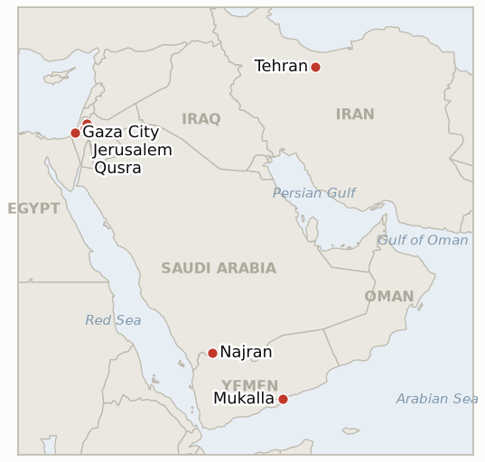

# Middle East Daily Briefing

**August 22, 2026**

- **Reporting window:** ~24 hours, August 21, 09:00 to August 22, 09:00 KST
- **Overall assessment:** Friday's dominant thread was Washington's economic war against Iran hitting the calendar rather than delivering substance: two indicators this ledger has tracked since July and mid-August both reached their ~August 22 deadline and both resolve falsified, Congress having appropriated nothing toward the $70bn-plus war supplemental after a Senate blockade rooted in the war itself, and Treasury Secretary Bessent's promised "never seen" sanctions package having slipped to a Monday press conference rather than arriving on schedule. Oil held near one month highs regardless, Brent settling at $93.93 and WTI at $86.64, both a sixth straight session of gains, while South Korea's markets kept climbing in the same window, KOSPI adding 0.88% to 6,912.95 and the won reaching an 11 month high of 1,386.5 on continued chipmaker buyback flows. Yemen's war widened on two fronts, Houthi drones claiming to hit Saudi Arabia's Najran airport and Aramco facilities even as Somali pirates hijacked a sanctioned Iranian shadow fleet tanker off Mukalla, the second such seizure in four days. Gaza diplomacy absorbed two separate rebukes: the UK, Australia, Canada and Poland called Israel's closure of its World Central Kitchen strike investigation "shameful," while Turkey, Egypt and Qatar jointly condemned a fresh round of Israeli strikes that has killed at least 16 Palestinians since Tuesday as undermining the ceasefire. And in Qusra, the IDF has finally removed the besieging settlers, but residents say soldiers now keep them confined to their own homes under the same closure order that never constrained the settlers themselves.

---

## 1. What Happened

<figure style="float:right; width:46%; margin:2pt 0 8pt 14pt;">

<figcaption style="font-size:8pt; color:#666; text-align:center; margin-top:3pt; font-style:italic;">Major places of discussion</figcaption>
</figure>

### 1.1 Washington's Economic War on Iran Hits Its Own Deadline: Congress's Funding and Bessent's Sanctions Package Both Slip

Two indicators this ledger opened in July and mid-August both carried an ~August 22 deadline, and both resolve falsified in the same window. First, Congress has taken no appropriations action on Defense Secretary Hegseth's $70bn-plus emergency war supplemental (formally an $87.6bn package, $67bn of it defense related) since the administration submitted it in June: the Senate voted 50-46 in mid-July against even opening debate on the annual defense bill that was carrying it, Democrats objecting explicitly to the Iran war and to provisions integrating US and Israeli forces, and no standalone vote on the supplemental itself has followed ([Al Jazeera](https://www.aljazeera.com/news/2026/7/14/senate-democrats-block-defence-bill-over-iran-war-israel-provisions); [PBS](https://www.pbs.org/newshour/politics/watch-live-senate-democrats-block-1-trillion-annual-defense-bill-in-protest-over-iran-war)). That is a real, publicly attributed blocking action tied to the war itself, not silence, so **IND-20260723-1** resolves **Falsified**: the open-ended funding runway the confirming branch required did not materialize. Second, Bessent's promised "unprecedented" sanctions package, first floated August 15 for delivery "next week," instead moved to a Monday, August 24 press conference, and separately on Friday Vice President Vance and Bessent repeated the pressure campaign's rhetoric, "the greatest coordinated economic isolation in the history of the world," without naming a single new mechanism ([Al Jazeera liveblog](https://www.aljazeera.com/news/liveblog/2026/8/20/iran-war-live-trump-announces-most-crushing-iran-sanctions); [CNN](https://www.cnn.com/2026/08/20/world/live-news/iran-war-trump)). No concrete measure arrived by its own August 22 deadline, so **IND-20260815-1** resolves **Falsified** as "slipped," with the substantive question of whether Monday's eventual announcement is genuinely new still tracked separately by IND-20260821-1. **Confidence: High** on the Senate vote and its stated rationale (Tier 1-2, Al Jazeera, PBS, multi-outlet); **High** on the absence of a concrete Bessent package through the window (Tier 1-2, Al Jazeera, CNN).

### 1.2 South Korea's Rally Extends a Second Day as the Won Hits an 11 Month High

KOSPI closed up 0.88% (+60.37 points) at 6,912.95 Friday, its second straight gain after Thursday's 5.89% reversal, with Samsung Electronics and SK Hynix continuing to lead on shareholder return optimism even as Kosdaq fell 4.63% on a separate rotation out of smaller growth names ([Korea JoongAng Daily](https://www.koreajoongangdaily.com/business/kospi-ends-higher-on-chip-gains-amid-hopes-for-shareholder-return-plans/12837331); [Bloomingbit](https://en.bloomingbit.io/feed/news/118803)). The won firmed further to close at 1,386.5, down 6.1 won from Thursday's 1,392.6 and its best level in roughly 11 months, touching 1,380.3 intraday, as dollar selling tied to the SK Hynix and Samsung payout announcements combined with offshore bets on continued won strength; Bank of Korea Deputy Governor Kwon Min-su called the currency's downward trend against the dollar "fundamentally...right" ([Seoul Economic Daily](https://en.sedaily.com/finance/2026/08/21/korean-won-hits-11-month-high-as-chipmaker-payouts-fuel)). The reversal now stands two full sessions old, still short of the sustained recovery IND-20260820-2 requires to confirm at its ~August 27 deadline, but each additional day without a snapback strengthens that case. **Confidence: High** on the KOSPI close and won level (Tier 1-2, multi-outlet Korean financial press); **Medium** on the precise attribution between chipmaker flows and the broader dollar weakness, since both moved the same direction simultaneously.

### 1.3 Yemen's War Widens on Two Fronts: Houthi Strikes Hit Saudi Arabia While Pirates Seize Iran's Own Shadow Fleet

Houthi military spokesman Yahya Saree said Friday the group struck two Saudi targets with drones, a "sensitive" target at Najran airport and unspecified Aramco facilities, describing it as retaliation for alleged Saudi drone overflights of Saada province; Riyadh has not confirmed either strike landed ([Middle East Monitor](https://www.middleeastmonitor.com/20260821-yemens-houthis-say-they-successfully-struck-two-saudi-targets-with-drones/); [Al-Monitor](https://www.al-monitor.com/originals/2026/08/houthis-claim-new-strikes-saudi-arabia-after-irgc-warning-what-know)). Separately and unconnected to the Houthis, six armed men hijacked the tanker Sibu 1, formerly Seamull, an Eritrea flagged vessel the US Treasury sanctioned last December as part of Iran's shadow fleet and which has routinely ferried fuel to the Houthi controlled Ras Isa terminal, roughly 136 nautical miles east of Mukalla; it is the second Gulf of Aden hijacking in four days and at least the 13th vessel attacked off Somalia this year ([Al Jazeera](https://www.aljazeera.com/news/2026/8/20/gunmen-seize-tanker-off-yemen-amid-resurgence-of-somali-piracy); [Daily Star](https://www.thedailystar.net/news/world/news/iran-linked-oil-tanker-falls-victim-somali-piracy-surge-4253521)). Neither event is yet confirmed to have caused casualties or lasting damage, but together they mark the war's spillover reaching both a new state actor, Saudi Arabia, and a wholly separate criminal threat, organized piracy, in the same 24 hour window. **Confidence: High** on the Sibu 1 hijacking (Tier 1-2, Al Jazeera, UKMTO sourced, multi-outlet); Medium on the Houthi claim against Najran and Aramco, since it rests on the group's own spokesman with no independent Saudi confirmation.

### 1.4 Gaza Diplomacy Absorbs Two Allied Rebukes in One Window

The UK, Australia, Canada and Poland issued a joint statement calling Israel's decision to close its criminal investigation into the strike that killed seven World Central Kitchen aid workers, including UK, Australian and dual Canadian-US nationals, "shameful," noting the timing landed on World Humanitarian Day and that they had spent more than two years pressing for accountability; the IDF's own review found "serious failures" but no grounds for criminal prosecution ([Middle East Monitor](https://www.middleeastmonitor.com/20260821-uk-australia-canada-call-israels-decision-to-close-world-central-kitchen-strike-probe-shameful/); [UK government joint statement](https://www.gov.uk/government/news/joint-statement-israel-closing-the-investigation-into-strikes-on-world-central-kitchen-convoy)). Separately, Turkey, Egypt and Qatar, the ceasefire's mediating states, jointly condemned Israeli strikes that have killed at least 16 Palestinians in Gaza since Tuesday, saying the intensification "undermines regional and international efforts at a critical juncture" as the Board of Peace works to implement the wider plan ([Al-Monitor](https://www.al-monitor.com/originals/2026/08/turkey-egypt-qatar-condemn-israeli-attacks-gaza-call-israel-comply-ceasefire)). Neither statement carries an enforcement mechanism, and Israel has not altered its posture in response to either. **Confidence: High** on both joint statements' content and signatories (Tier 1, government statement and multi-outlet coverage); Medium on the precise Gaza casualty count, which is sourced to Gaza medics and not independently verified.

### 1.5 Qusra's Settlers Are Gone, but Soldiers Now Keep Residents Confined to Their Own Homes

New reporting confirms Israeli forces have removed the settler outpost that besieged three Palestinian homes in Qusra's Ras al-Ain area for nearly two weeks, stationing soldiers at the homes' entrances instead; residents say they remain barred from leaving under the same closed military zone order the army originally used to keep activists and journalists out, rather than to protect the families ([The Times of Israel](https://www.timesofisrael.com/liveblog_entry/idf-soldiers-stationed-at-entrances-to-qusra-homes-residents-still-cant-leave/)). No Israeli government or IDF statement in the window addressed the food and medicine shortage reported Thursday, when residents described themselves as starving. The settlers' removal is a partial, favorable data point for IND-20260813-3 (dismantlement, deadline ~August 27) but the indicator's own bar, the outpost's actual dismantlement with no return, is not yet fully met while soldiers occupy the same ground; IND-20260821-2, tracking the narrower resupply question, remains open through ~August 28 with no confirmation resupply has resumed. **Confidence: High** on the settlers' removal and the soldiers' presence (Tier 1-2, Times of Israel, corroborating trend from Thursday's Middle East Eye and Middle East Monitor reporting); Medium on whether the confinement now reflects protective intent or continued closure by default, since no IDF statement has clarified the rationale.

---

## 2. Deep Dive: Incentives and Motives

### 2.1 Why would Washington's funding and sanctions timelines both slip at the same deadline rather than either one landing on schedule?

Because both processes run on separate institutional clocks that neither the White House nor Congress fully controls, an $87.6bn supplemental needs floor time a war weary Senate keeps declining to grant, while a "next week" sanctions promise depends on Treasury completing legally defensible designations before naming targets, so the coincidence is less a coordinated pause than two independent bottlenecks, a legislative one and a bureaucratic one, both landing on the same administration-set deadline by chance rather than design.

### 2.2 Why would Korean markets keep rallying into a second day even as Washington's own indicators confirm its Iran pressure campaign is stalling on delivery?

Because Korean equity flows are currently being driven by a company specific catalyst, the SK Hynix and Samsung buyback and payout announcements, that has nothing to do with the war's trajectory, so a stalled sanctions rollout that keeps the status quo blockade in place rather than escalating it removes downside risk without adding any new upside catalyst, letting the chip led rally continue on its own logic even as the broader war remains unresolved.

### 2.3 Why would the Houthis risk a direct strike on Saudi Arabia now, when the war's center of gravity has shifted toward the US-Iran economic standoff?

Because a strike on Saudi Arabia costs the Houthis little while Washington and Tehran are both absorbed in their own economic pressure narrative rather than a shooting war, letting the group demonstrate reach against a wealthier regional adversary and reinforce its "escalation for escalation" deterrence formula precisely when neither Washington nor Riyadh has the bandwidth or appetite to open a second military front in response.

### 2.4 Why would the UK, Australia, Canada and Poland choose this specific week to call Israel's World Central Kitchen decision "shameful," rather than issuing a quieter diplomatic protest?

Because the decision landed on World Humanitarian Day itself, after more than two years of the allies privately pressing for accountability, turning what might otherwise have been a routine diplomatic note into a symbolically loaded moment those governments calculated was worth a public rebuke, especially with domestic constituencies in all four countries who lost nationals in the strike watching for a response.

### 2.5 Why would the IDF remove Qusra's settlers only to then confine the residents themselves under the same closure order?

Because the closed military zone designation was never actually about the residents' safety, it was a tool for controlling access and information, so removing the settlers solved the political and reputational problem of visible mob violence without requiring the army to abandon the broader mechanism of control it had already established, leaving residents still unable to move freely even once the immediate physical threat that justified international attention was gone.

---

## 3. Policy Implications for South Korea

### 3.1 Exposure snapshot

| Item | Current reading | Source |
| --- | --- | --- |
| Middle East share of crude imports | 48.5% (May-July 2026), down from 69.1% a year earlier; non-Middle East share crossed 50% for the first time on record | KNOC via Asia Business Daily; `korea-exposure.md` |
| July-August crude procurement | 110%+ of prior-year volume secured (MOTIE, July 21); strategic reserve swap extended through August, ~21 million barrels swapped to date | MOTIE via Herald Business, Hankyung; `korea-exposure.md` |
| September crude procurement | 90%+ secured (MOTIE, July 21) | MOTIE via Herald Business; `korea-exposure.md` |
| Red Sea detour routing | Korean-bound crude cargoes continue via the Yanbu/Red Sea workaround; Yanbu exports to Asian buyers including Korea have surged to ~4 million bpd from under 1 million bpd a year earlier | Lloyd's List Intelligence; `korea-exposure.md` |
| Strategic reserve coverage | ~26 days of actual consumption (estimate); swap on immediate standby, untested at scale | CSIS; MOTIE July 27 |
| Refiner Saudi ownership exposure | S-Oil (Saudi Aramco majority ~63%), HD Hyundai Oilbank (Aramco ~17%) | Public filings; `korea-exposure.md` |
| Brent / WTI | Friday settle $93.93 / $86.64, a sixth straight session of gains and fresh one month highs, as Washington's Iran pressure campaign held near its highs despite hitting two deadlines without a concrete package | TradingEconomics |
| KOSPI / USD-KRW | KOSPI +0.88% to 6,912.95, a second straight gain; won firmed further to 1,386.5, an 11 month high, touching 1,380.3 intraday | Korea JoongAng Daily; Seoul Economic Daily |
| Hormuz transits | No new verified daily count in the window; Reuters via Kpler's last published figure remains Wednesday August 19's 6 vessels against a 10-day average of 11 | Reuters via Kpler (carried forward) |

### 3.2 Implications by development

**Both of today's resolved indicators point the same direction for Korea: Washington's economic pressure campaign against Iran is real in rhetoric but currently under-delivering in either funding or substance, which argues against expecting a near-term escalation that would spike Korea's import bill further, while also offering no near-term off-ramp that would bring it down.** IND-20260821-1 (deadline ~August 26) now carries the load of testing whether Monday's rollout changes that picture; IND-20260814-1 (Hormuz toll question, deadline ~August 24) resolves within days of it.

**KOSPI's second consecutive gain and the won's 11 month high are today's clearest direct signal for Korea, and a second straight day without a reversal meaningfully strengthens the case that Thursday's crash was a single-day technical event rather than a durable repricing.** IND-20260820-2 (deadline ~August 27, five days out) continues tracking the underlying question; the chart above tracks both series directly.

**The Houthi strikes on Saudi Arabia and the Sibu 1 hijacking both have no direct Korean cargo exposure today, since Korea's own routing runs through the Red Sea/Yanbu detour rather than the Bab el-Mandeb and Gulf of Aden corridor these events touched, but a piracy resurgence layered onto an already disrupted Hormuz and Red Sea risk map raises the tail risk of a broader insurance repricing that would eventually reach Korean-flagged or Korean-chartered tonnage.** New IND-20260822-1 and IND-20260822-2 (both deadline ~September 5) open to track whether either escalates further.

**Neither the World Central Kitchen rebuke nor the Turkey-Egypt-Qatar condemnation of Gaza strikes carries direct Korean market exposure, but both confirm the Gaza ceasefire remains under active strain rather than consolidating, keeping the broader regional risk premium that has driven this month's Korean market volatility unresolved.** IND-20260812-4 (Security Cabinet vote, deadline August 26) and IND-20260816-2 (Yellow Line incidents, deadline August 30) continue tracking whether either strand produces a formal response.

**Qusra's partial resolution, settlers gone but residents still confined, has no direct Korean market exposure but is a modest de-escalation signal on the humanitarian front most likely to draw further international censure of a kind that has previously pressured Washington's broader Gaza diplomacy.** IND-20260813-3 (deadline August 27) and IND-20260821-2 (deadline August 28) both continue tracking the remaining questions.

**Testable indicators:**

- **IND-20260822-1** — Saudi Arabia either responds militarily, diplomatically (a formal protest, a recalled ambassador, a coalition statement), or with visible defensive measures to the Houthis' claimed August 21 drone strikes on Najran airport and Aramco facilities, or Riyadh continues its established pattern of not directly retaliating, as it did after the Jazan refinery strikes (IND-20260810-3, falsified). A confirmed Saudi military, diplomatic or defensive response specifically tied to the Najran/Aramco claim by ~2026-09-05 confirms a break from the restraint pattern; continued silence or only routine defensive posture through the same date falsifies any change and confirms the restraint pattern holds even against a claimed strike on Saudi soil itself.
- **IND-20260822-2** — The August 2026 Somali piracy surge, now at least 13 vessels attacked this year including two hijackings in four days, one an Iran-linked shadow fleet tanker, either draws a coordinated naval response (a Combined Maritime Forces or EU Operation Aspides tasking specifically against Gulf of Aden piracy, insurer war-risk zone expansion) or continues without a distinct international response separate from existing Red Sea/Hormuz security postures. A publicly announced naval tasking, insurer designation, or comparable coordinated response specifically addressing the piracy surge by ~2026-09-05 confirms it has drawn a distinct international reaction; continued hijackings through the same date with no such distinct response falsifies a coordinated reaction and confirms piracy is being absorbed into the existing security picture rather than triggering a new one.

---

## 4. Watch List

- **Whether Saudi Arabia responds to the claimed Najran/Aramco Houthi strikes or maintains its restraint pattern** (IND-20260822-1, deadline September 5).
- **Whether the Somali piracy surge against shadow fleet and other tankers draws a coordinated naval or insurance response** (IND-20260822-2, deadline September 5).
- **Whether Monday's August 24 sanctions rollout delivers genuinely new mechanisms or reiterates existing measures** (IND-20260821-1, deadline August 26).
- **Whether the Qusra food and medicine shortage draws an Israeli intervention or the siege's aftermath hardens into an acknowledged emergency** (IND-20260821-2, deadline August 28).
- **Whether South Korea's KOSPI reversal holds for a full week or Wednesday's crash reasserts itself** (IND-20260820-2, deadline August 27).
- **Whether the $206 million Gaza stabilization funding converts into visible deployment activity** (IND-20260820-3, deadline September 19).
- **Whether the UAE's Iran missile claim is independently confirmed or the dispute escalates further** (IND-20260820-1, deadline September 3).
- **Whether the June 17 MOU's toll free Hormuz window converts into actual Iranian tolls or a quiet extension** (IND-20260814-1, deadline August 24).
- **Whether the US Navy's kinetic blockade enforcement, or Iran's threatened "precise strikes," draws an actual US-Iran military exchange** (IND-20260812-1, deadline August 26).
- **Whether the Gaza disarm-first framework ever reaches a formal Israeli Security Cabinet vote in any form** (IND-20260812-4, deadline August 26).
- **Whether the Qusra settler outpost's removal proves durable with no return, completing the indicator's dismantlement bar** (IND-20260813-3, deadline August 27).
- **Whether the August 15 Hezbollah-Israel exchange triggers a further round or both sides step back to the post-truce equilibrium** (IND-20260816-1, deadline August 29).
- **Whether the Gaza Yellow Line incidents prompt a formal IDF operational response or stay isolated** (IND-20260816-2, deadline August 30).
- **Whether Yemen's confirmed spread draws renewed international mediation as the war widens onto a second, Saudi-facing front** (IND-20260817-1, deadline August 31).
- **Whether Trump's declared intent to make Hormuz US territory produces any concrete policy step beyond his map post** (IND-20260817-2, deadline August 31).
- **Whether Israel's prepared Ali al Taher ridge operation actually launches** (IND-20260818-2, deadline August 31).
- **Whether the Rome track's provisionally scheduled September 1 eighth round proceeds** (IND-20260807-2, deadline September 1).
- **Whether Trump's threat to bomb Oman produces any real diplomatic or military consequence** (IND-20260818-1, deadline September 1).
- **Whether the Houthis' claimed strike on Saudi naval vessels near Mocha is confirmed or draws a direct Saudi response** (IND-20260818-3, deadline September 1).
- **Whether Katz's uncoordinated West Bank police handover proceeds or is delayed or blocked** (IND-20260819-2, deadline September 1).
- **Whether the fatal Minoan Dignity attack is ever attributed or draws a military response** (IND-20260819-1, deadline September 2).
- **Whether a signed Iran-Oman Hormuz joint statement with an operating date is reached, or the shipping map deal stalls again short of signature** (IND-20260816-3, deadline September 5).
- **Whether the Syria nuclear material find converts into a concluded agreement and verified removal** (IND-20260812-2, deadline September 11).
- **Whether the West Bank IDF-to-police enforcement transfer reduces settler violence, or leaves it unchanged** (IND-20260815-2, deadline September 12).
- **Whether Syria moves against Hezbollah in Lebanon despite Iran's warning, or the confrontation stays rhetorical** (IND-20260815-3, deadline September 15).
- **Whether Kaine's privileged war powers resolution on Oman passes, fails, or never reaches a floor vote when the Senate returns in September** (IND-20260819-3, deadline September 25).
- **Whether the Caroline Bezengi oil spill is contained now that salvage work has begun.**
- **Whether the Qeshm Island explosions are ever confirmed as a real strike or resolved as a false alarm.**

---

## 5. Source Quality Summary

| Claim | Sources | Confidence |
| --- | --- | --- |
| Senate blocked debate on the defense bill carrying Iran war funding 50-46 in mid-July over the war itself; no supplemental appropriations action since | Al Jazeera, PBS (Tier 1-2, multi-outlet, on the record vote count) | High |
| Bessent's promised sanctions package slips to Monday August 24; no concrete measure named in the window | Al Jazeera liveblog, CNN (Tier 1-2, on record statements, multi-outlet) | High |
| Brent settles $93.93, WTI $86.64 Friday, sixth straight session of gains and fresh one month highs | TradingEconomics, cross-referenced against Thursday's verified settles | High |
| KOSPI closes +0.88% at 6,912.95; won firms to 1,386.5, an 11 month high, touching 1,380.3 intraday | Korea JoongAng Daily, Bloomingbit, Seoul Economic Daily (Tier 1-2, multi-outlet Korean financial press) | High |
| Houthis claim drone strikes on Najran airport and Aramco facilities | Middle East Monitor, Al-Monitor (Tier 2-3, Houthi spokesman sourced, no independent Saudi confirmation) | Medium |
| Tanker Sibu 1, sanctioned Iran shadow fleet vessel, hijacked off Mukalla, second Gulf of Aden seizure in four days | Al Jazeera, Daily Star (Tier 1-2, UKMTO sourced, multi-outlet) | High |
| UK, Australia, Canada, Poland call Israel's closure of the World Central Kitchen strike probe "shameful" | UK government joint statement, Middle East Monitor (Tier 1-2, government statement, multi-outlet) | High |
| Turkey, Egypt, Qatar jointly condemn Israeli Gaza strikes that killed 16-plus Palestinians since Tuesday | Al-Monitor (Tier 1-2, joint government statement, multi-outlet corroboration) | High on the statement; Medium on the precise casualty count |
| Qusra settler outpost removed, soldiers now stationed at the homes' entrances, residents still barred from leaving | The Times of Israel (Tier 1-2, on the ground liveblog reporting) | High |
