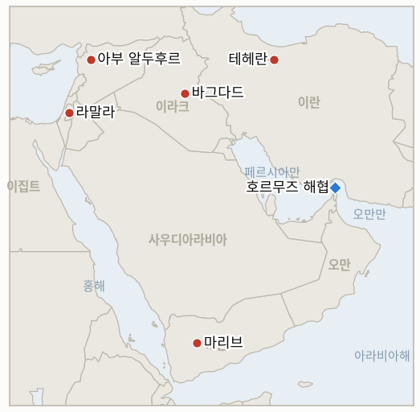

# 중동 일일 브리핑

**2026년 8월 23일**

- **보고 기간:** 약 24시간, 8월 22일 09:00 ~ 8월 23일 09:00 (한국시간)
- **종합 평가:** 토요일의 지배적인 흐름은 월요일에 실제로 나올 제재 발표에 앞서 수사가 먼저 질주했다는 점이었다. 이란 외무부는 다가올 베선트 패키지를 "모든 국가에 대한 선전포고"라고 선제적으로 규정하고 이에 동참하는 국가는 "적으로 간주"하겠다고 경고했으며, 트럼프 대통령은 호르무즈 해협을 "지금 이 순간 미국 영토로 본다"는 주장을 되풀이했으나, 두 발언 모두 월요일의 실제 내용에 관해 검증 가능한 새로운 사실을 하나도 더하지 못했다. 이보다 규모는 작지만 더 구체적인 움직임으로, 이란은 이라크 유조선 다수에 해협 통항을 허용했는데, 불응 선박에 대한 광범위한 봉쇄는 유지한 채로 제3국에 내준 전쟁 최초의 문서화된 통항 양보다. 예멘 전쟁은 다시 확대되어, 마리브에 대한 미사일·드론 공격으로 4명이 부상했고 예멘 정부는 후티 진지에 대해 또다시 세 자릿수 작전을 벌였으며 타이즈 인근에서 후티 지휘관 3명을 사살했다. 미국 특사 톰 배럭은 이스라엘의 시리아 아부 알두후르 공군기지 공습이 튀르키예와의 직접 충돌 위험을 낳았다고 밝히고 이스라엘 자신의 선거를 앞두고 앙카라를 "미끼로 유인"하려던 의도였을 수 있다고 시사해, 미국의 두 파트너 사이에 새로운 마찰 지점을 열었다. 그리고 서안지구에서는 이스라엘군 수뇌부가 정치 지도부에 영토가 폭력 확산의 "경계선"에 있다고 비공개로 경고했는데, 같은 날 정착민 공격으로 팔레스타인인 4명이 추가로 부상하고 가자지구에서 이스라엘군의 공습으로 하마스 지휘관이 사망한 것과 겹쳤다. 서울과 뉴욕 모두 주말 휴장으로, 금요일 종가인 브렌트유 93.93달러, WTI유 86.64달러, 코스피 6912.95는 변동 없이 그대로 이어진다.

---

## 1. 오늘의 주요 사건

<figure style="float:right; width:46%; margin:2pt 0 8pt 14pt;">

<figcaption style="font-size:8pt; color:#666; text-align:center; margin-top:3pt; font-style:italic;">주요 논의 지점</figcaption>
</figure>

### 1.1 이란, 월요일 제재를 "모든 국가에 대한 선전포고"라 규정하며 트럼프의 호르무즈 영토 주장 반복

이란 외무부 대변인 에스마일 바그하에이는 토요일 베선트 재무장관이 월요일 기자회견에서 상세 내용을 발표할 제재 패키지가 모든 유엔 회원국에 대한 불법적인 "역외 주권" 행사에 해당한다고 밝혔으며, 별도로 테헤란은 이 조치에 동참하는 국가는 "적으로 간주"하겠다고 경고했다([CNBC](https://www.cnbc.com/2026/08/22/iran-criticizes-us-sanctions-extraterritorial-sovereignty.html); [알자지라 라이브블로그](https://www.aljazeera.com/news/liveblog/2026/8/22/iran-war-live-trump-says-tehran-not-ready-to-make-right-deal-to-end-war)). 하메네이의 측근 인사는 별도로 트럼프의 수사가 "절박함에서 비롯된 것"이라며 이란은 "굴복하지 않을 것"이라고 말했다([CNN](https://www.cnn.com/2026/08/22/world/live-news/iran-war-trump)). 트럼프는 같은 기간 "지금 이 순간 호르무즈 해협을 미국 영토로 본다"는 입장을 되풀이하고 이란이 "제 생각에 제대로 된 합의를 할 준비가 되어 있지 않다"고 말했는데, 이는 IND-20260817-2가 추적하는 수사와 정책 사이의 시험을 진전시키기보다 재확인하는 발언이다. 토요일 양측의 발언 어느 쪽도 구체적인 새 조치를 하나도 명시하지 않았으며, 실질적 시험대는 여전히 월요일의 실제 기자회견이다. **신뢰도: 높음** — 양측의 인용 발언(1~2등급, CNBC·알자지라·CNN, 실명 인용, 다수 매체). 이 시점에서 발언 자체 외에 독자적으로 검증 가능한 사실은 아직 없다.

### 1.2 이란, 이라크 유조선에 호르무즈 통항 허용, 첫 구체적 양보 조치

이란이 이라크 유조선 다수에 호르무즈 해협 통항을 허용했다. 이는 알자이디 이라크 총리 정부가 모하마드 바게르 갈리바프 이란 국회의장의 이라크 방문 기간 거듭 요청한 데 따른 것으로, 니자르 아미디 이라크 대통령은 이란이 "최근 며칠간 이라크산 원유를 실은 선박의 통항을 편의해줬다"고 확인했다([BOE 리포트](https://boereport.com/2026/08/22/iran-grants-permission-for-a-number-of-iraqi-oil-tankers-to-pass-through-hormuz/); [알자지라](https://www.aljazeera.com/news/2026/8/22/iran-grants-permission-for-some-iraqi-oil-tankers-to-pass-through-hormuz); [더 내셔널](https://www.thenationalnews.com/news/mena/2026/08/22/iran-gives-permission-for-iraqi-oil-tankers-to-pass-through-strait-of-hormuz/)). 전쟁 전 하루 약 400만 배럴을 생산했고 자체 유조선단이 없는 이라크는 별도로 튀르키예·시리아·요르단을 경유하는 대체 수출로도 모색해 왔다. 이번 조치는 이란이 일괄 허용이나 일괄 거부가 아니라 제3국 화물에 양자 간 통항 양보를 내준 최초의 문서화된 사례다. 일반적인 통행료나 수수료 발표로 이어지지는 않았으며, 이란이 불응으로 판단하는 선박에 대한 계속되는 나포·저지 조치에도 영향을 주지 않는다. **신뢰도: 높음** — 양보 조치 자체와 이라크 정부 소식통(1~2등급, 다수 매체, 실명 이라크 대통령 발언). **신뢰도: 중간** — 공식적으로 발표된 기준이 없어 이번 예외 조치가 얼마나 지속적이고 제한적인지는 불확실하다.

### 1.3 예멘 전쟁 재격화, 마리브에 미사일·드론 공격

마리브주 정부 매체는 토요일 저녁 탄도미사일 6기와 드론 4기가 마리브시 주거지역을 타격해 4명이 부상하고 가옥과 민간 기반시설이 파손됐다고 밝혔으며, 별도로 같은 날 타이즈 서부에서 예멘 정부군 드론 공격으로 지휘관급을 포함한 후티 대원 3명이 사망했다([더 뉴 아랍](https://www.newarab.com/news/yemen-government-forces-houthis-renew-fighting-marib-taiz)). 국제사회가 승인한 예멘 정부는 지난 24시간 동안 후티 진지에 대해 100건 이상의 군사 작전을 수행했다고 밝혀, 이 원장이 8월 중순부터 추적해 온 세 자릿수 일일 작전 강도 패턴이 이어졌다. 마리브 공격도 타이즈 인근 교전도 보고 기간 중 새로운 국제 중재 대응을 이끌어내지 못했다. **신뢰도: 높음** — 마리브 사상자·피해 수치와 정부 작전 집계(1~2등급, 예멘 정부 매체, 다수 매체). **신뢰도: 중간** — 타이즈 인근 후티 측 정확한 사상자 귀속은 독립적 확인 없이 정부 군 소식통에만 의존한다.

### 1.4 미국 특사, 이스라엘의 시리아 공습이 튀르키예와의 전쟁 위험을 낳았고 선거철 "미끼"였을 수 있다고 밝혀

시리아 담당 미국 특사이자 튀르키예 주재 대사인 톰 배럭은 이스라엘의 8월 18일 시리아 이들리브주 아부 알두후르 공군기지 공습이 튀르키예와의 직접적 군사 충돌로 번질 수 있었다고 밝혔다. 해당 기지의 튀르키예군이 사전 통보를 받지 못해 자신들이 공격받는다고 여겨 전투기를 출격시켰을 가능성도 있었다는 것이다. 토요일 보도된 최근 발언에서 배럭은 한발 더 나아가, 튀르키예가 주둔을 추진 중이라고 알려진 기지를 겨냥한 이번 공습의 시점이 이스라엘 자신의 10월 27일 선거를 앞두고 앙카라를 충돌로 유인하려는 "미끼"였을 수 있다고 시사했다([하레츠](https://www.haaretz.com/israel-news/israel-security/2026-08-22/ty-article/.premium/u-s-envoy-israel-risked-confrontation-with-turkey-by-baiting-ankara/000001a0-2822-dc38-a7f1-3f2f77b90000); [타임스 오브 이스라엘](https://www.timesofisrael.com/us-envoy-suggests-israeli-strike-in-syria-was-election-ploy-aimed-at-baiting-turkey-into-clash/)). 기데온 사르 이스라엘 외무장관은 토요일 이스라엘이 "튀르키예와의 확전에는 관심이 없다"면서도 시리아 내 튀르키예군 주둔은 용납하지 않겠다고 밝혔으며, 레바논과 가자지구에서의 이란 활동에 적용해온 것과 같은 외국 세력 침투 우려를 이유로 들었다([타임스 오브 이스라엘 라이브블로그](https://www.timesofisrael.com/liveblog-august-22-2026/)). 배럭의 발언 이후 튀르키예와 이스라엘 어느 쪽도 이번 공습에 직접 결부된 추가 군사적·외교적 조치를 취하지 않았다. **신뢰도: 높음** — 배럭과 사르의 인용 발언(1~2등급, 하레츠·타임스 오브 이스라엘, 실명 인용). **신뢰도: 중간** — "미끼" 규정 자체는 확인된 이스라엘 측 의도가 아니라 배럭 본인의 추론이다.

### 1.5 이스라엘군, 서안지구가 확산의 "경계선"에 있다 경고하는 가운데 정착민 폭력과 가자지구 공습 계속

이스라엘 매체는 이스라엘군(IDF) 수뇌부가 정착민 폭력과 불법 전초기지 확산을 이유로 서안지구가 폭력 확산의 경계선에 있다고 정치 지도부에 비공개로 경고했으며, 병력이 팔레스타인 테러 용의자 체포에서 점점 더 정착민 극단주의 대응으로 전환 배치되고 있다고 전했다([타임스 오브 이스라엘 라이브블로그](https://www.timesofisrael.com/liveblog-august-21-2026/)). 같은 기간 팔레스타인인 최소 4명이 추가로 정착민 공격에 부상했는데, 타무운 인근에서 15세 소년이 부상했고 라말라 인근에서는 투석 이후 팔레스타인 차량이 충돌 사고를 냈다([타임스 오브 이스라엘 라이브블로그](https://www.timesofisrael.com/liveblog-august-22-2026/)). 가자지구에서는 이스라엘군이 하마스 데이르알발라 대대 지휘관 샤리프 알하사나트를 사살했는데, 군은 병력에 대한 "즉각적 위협"을 겨냥한 것이라고 밝혔으며, 알하사나트는 하마스 지하 터널망 복구와 이스라엘군 대상 공격 계획에 관여해온 것으로 전해졌다([예루살렘포스트](http://www.jpost.com/middle-east/iran-news/2026-08-22/live-updates-906234)). 두 사안 모두 이스라엘군의 비공개 경고 외에 공식적인 이스라엘 정부 대응으로는 이어지지 않았다. **신뢰도: 높음** — 정착민 공격 부상자 4명과 가자지구 공습(1~2등급, 타임스 오브 이스라엘 라이브블로그·예루살렘포스트, 현장 보도). **신뢰도: 중간** — 이스라엘군의 비공개 경고는 익명 관계자를 인용한 것으로 실명 공식 성명은 없어 정확한 표현은 불확실하다.

---

## 2. 심층 분석: 유인과 동기

### 2.1 베선트가 아직 새 제재를 하나도 명시하지 않았는데 이란은 왜 "선전포고" 수준으로 수사를 격상하는가?

위협을 선제적으로 최대치로 규정하는 데 드는 수사적 비용은 사실상 없고 그 이득은 실질적이기 때문이다. 제재를 단순히 이란만이 아니라 "모든 국가"에 대한 전쟁 행위로 규정하면, 테헤란은 중국·러시아를 비롯한 교역 상대국들이 실제 대상이 무엇인지 확인하기도 전에 왜 준수를 거부해야 하는지에 대한 기성 논리를 손에 쥐게 되며, 이는 이란이 단순히 월요일 발표에 반응하기보다 그 서사를 선점하도록 해준다.

### 2.2 광범위한 봉쇄가 계속되는 가운데 이란은 왜 하필 이라크 유조선에만 통항을 양보하는가?

이라크는 적대국이 아니라 의존적인 이웃 국가이며, 테헤란은 이라크의 원유 수출을 옥죌 전략적 유인이 없고 그 우호 관계(그리고 갈리바프 방문에서 얻은 이란의 외교적 자산)를 유지하는 데 드는 비용도 크지 않기 때문이다. 이를 통해 테헤란은 자국의 봉쇄가 모두를 대상으로 한 무차별적 폐쇄가 아니라 적대적이거나 불응한다고 판단한 상대만을 겨냥한 표적화된 수단이라는 점을 과시할 수 있으며, 이는 이 혼란이 통제력 상실이 아니라 의도된 정책이라는 이란 자신의 주장에도 도움이 된다.

### 2.3 국제적 관심이 월요일의 이란 제재 발표에 쏠려 있는 시점에 예멘 전쟁은 왜 다시 격화되는가?

후티 세력도 예멘 정부도 워싱턴의 일정에 맞춰 작전을 결정하지 않으며, 걸프 인접 지역의 경제 이슈가 전 세계의 관심을 흡수하는 상황은 이미 자체 논리로 굴러가는 지역 전쟁이 더 조용한 한 주였다면 받았을 외교적 주목을 피하면서 기존의 작전 강도를 유지할 여지를 오히려 넓혀주기 때문이다.

### 2.4 미국 특사는 왜 동맹국 자신의 선거를 앞두고 그 동맹이 나토 회원국을 고의로 도발했다고 공개적으로 시사하는가?

배럭이 시리아 특사이자 튀르키예 대사라는 이중 역할을 맡고 있어 이스라엘의 의도와 무관하게 앙카라와의 후폭풍을 관리해야 하는 입장에 놓여 있기 때문이다. 선거 정치라는 설명을 미국 내부 평가로만 남겨두지 않고 공개적으로 밝히는 것은, 워싱턴이 이번 공습을 단순히 시리아 문제로만 보지 않는다는 신호를 튀르키예에 보내는 동시에, 이스라엘 자체 선거철이 진행되는 동안 네타냐후 정부가 같은 상황을 반복하지 않도록 공개적 압박을 가하는 효과를 낸다.

### 2.5 쿠스라 포위가 이미 몇 주간 국제적 주목을 받은 뒤인데 이스라엘군 수뇌부는 왜 지금 서안지구 폭력에 대한 비공개 경고를 격상하는가?

쿠스라는 고립된 사례로 관리할 수 있는 단일하고 국제적으로 가시화된 사건이었던 반면, 수뇌부의 이번 브리핑은 더 광범위한 구조적 추세, 즉 전초기지 확산과 정착민 폭력이 대테러 자원을 전용하지 않고는 군이 대응할 수 있는 역량을 앞지르고 있다는 점을 다루고 있기 때문이다. 이는 특정 사건 하나에 대한 경고가 아니라 체제 전반의 궤적에 대한 경고이며, 쿠스라 자체의 해결이 그것이 상징이었어야 할 근본 패턴의 속도를 늦추지 못했다는 바로 그 이유로 지금 제기하는 것이 더 시급해진다.

---

## 3. 한국에 대한 정책적 함의

### 3.1 익스포저 현황

| 항목 | 현재 수치 | 출처 |
| --- | --- | --- |
| 원유 수입 중 중동산 비중 | 48.5%(2026년 5~7월), 전년 동기 69.1%에서 하락; 비중동산 비중이 사상 처음 50% 상회 | KNOC, 아시아경제 인용; `korea-exposure.md` |
| 7~8월 원유 도입 | 전년 동기 대비 110% 이상 확보(산업통상부, 7월 21일); 전략비축유 스와프 8월까지 연장, 현재까지 약 2,100만 배럴 스와프 | 산업통상부, 헤럴드경제·한경 인용; `korea-exposure.md` |
| 9월 원유 도입 | 90% 이상 확보(산업통상부, 7월 21일) | 산업통상부, 헤럴드경제 인용; `korea-exposure.md` |
| 홍해 우회 항로 | 한국행 원유 화물은 얀부·홍해 우회로를 계속 이용; 얀부에서 한국을 포함한 아시아 매수처로의 수출이 1년 전 하루 100만 배럴 미만에서 약 400만 배럴로 급증 | 로이즈리스트 인텔리전스; `korea-exposure.md` |
| 전략비축유 커버리지 | 실제 소비 기준 약 26일분(추정); 스와프는 즉시 대기 상태이나 대규모 실행은 검증되지 않음 | CSIS; 산업통상부 7월 27일 |
| 정유사 사우디 지분 익스포저 | S-Oil(사우디 아람코 지분 약 63%), HD현대오일뱅크(아람코 지분 약 17%) | 공시 자료; `korea-exposure.md` |
| 브렌트유/WTI유 | 주말 휴장; 마지막 확인된 금요일 종가 93.93달러/86.64달러로 엿새 연속 상승, 변동 없이 이어짐 | TradingEconomics |
| 코스피/원달러 | 주말 휴장; 마지막 확인된 금요일 종가 코스피 6912.95(+0.88%), 원화 1386.5원(11개월 만의 최고치), 변동 없이 이어짐 | 코리아중앙데일리; 서울경제신문 |
| 호르무즈 통항량 | 보고 기간 중 신규 로이터/클플러 발표 없음; 마지막 확인치는 목요일 8월 20일 7척으로, 아이란와이어가 "역대 최저"라 평가했으며 같은 보도의 수요일 수치인 14척과 대비 | 로이터, 클플러 인용; 아이란와이어 |

### 3.2 사안별 함의

**토요일의 상반된 수사, 즉 이란의 "선전포고" 규정과 트럼프의 호르무즈 영토 주장 반복은 한국 정책 입안자가 실제로 행동에 옮길 수 있는 검증 가능한 새 사실을 전혀 더하지 못했으며, 진짜 중요한 시험대는 어느 한쪽의 선제적 입지 선점이 아니라 월요일의 실제 제재 내용으로 남아 있다.** IND-20260821-1(시한 약 8월 26일)이 이 질문을 실제로 결론지을 지표이며, IND-20260817-2(호르무즈 영토 주장, 시한 약 8월 31일)는 이 수사가 한국의 해운·보험 담당자들이 가격에 반영해야 할 실제 정책 조치로 전환되는지를 계속 추적한다.

**이란의 이라크 유조선 통항 양보는 이 원장이 확보한 것 중 봉쇄가 전면 폐쇄가 아니라 선택적이고 협상 가능한 수단으로 작동한다는 최초의 구체적 증거이며, 적절한 양자 조건 하에서는 비이란계 화물도 해협을 통과할 수 있다는 일반 명제에 대해 다소 안심되는 신호다. 다만 테헤란과 비교 가능한 양자 채널이 없는 한국 국적·용선 선박에는 직접적인 이득이 없다.** IND-20260814-1(호르무즈 통행료 문제, 시한 약 8월 24일, 이틀 앞으로 다가옴)은 이 증거로 인해 무료 통항 반증 쪽으로 기울고 있다.

**예멘의 재확산, 즉 마리브 공격과 정부의 지속된 세 자릿수 작전 강도는 마리브의 내륙 전선이 아니라 바브엘만데브 회랑을 지나는 한국 자체의 얀부·홍해 항로에는 직접적인 영향이 없지만, 한국의 우회로가 지나는 같은 지역에서 활발한 다중 전선 전쟁이라는 더 큰 패턴을 유지시킨다.** IND-20260817-1(예멘 확산이 중재를 이끌어내는지, 시한 약 8월 31일)은 확산되는 전쟁이 결국 상응하는 외교적 대응을 이끌어내는지를 계속 추적한다.

**아부 알두후르 공습을 둘러싼 튀르키예-이스라엘 마찰은 오늘 당장은 한국 시장에 직접적인 통로가 없지만, 미국의 두 안보 파트너 사이의 진짜 균열은 한국 자체 해상 항로에 인접한 지역에서 이 원장이 이제까지 추적할 필요가 없었던 새로운 유형의 지역 리스크가 될 것이며, 올해 내내 지배적이었던 이란 중심 리스크 지도와는 별개다.** 신규 IND-20260823-1(시한 약 9월 6일)이 이 마찰이 실제 대치로 확대되는지 아니면 흡수되는지를 추적하기 위해 개설됐다.

**서안지구의 "경계선" 경고와 가자지구 공습 모두 한국 시장에 직접적인 익스포저는 없지만, 둘 다 더 큰 휴전·점령 관리 체계가 안정화되기보다 구조적 긴장 아래 있음을 재확인시켜, 올해 한국 시장 변동성의 배후에 있는 지역 리스크 프리미엄을 미해결 상태로 남겨둔다.** 신규 IND-20260823-2(시한 약 9월 6일)가 이 체계적 경고가 실제로 폭력 양상의 단계적 변화로 이어지는지를 추적하기 위해 개설됐다.

**검증 가능한 지표:**

- **IND-20260823-1** — 미국 특사 톰 배럭이 밝힌, 이스라엘의 8월 18일 시리아 아부 알두후르 공군기지 공습이 튀르키예와의 직접적 군사 충돌 위험을 낳았다는 설명과 이 공습이 이스라엘 자신의 선거를 앞두고 앙카라를 "미끼로 유인"하려 했다는 시사가 실제 튀르키예-이스라엘 대치나 외교적 단절로 확대되는지, 아니면 양측이 이 사건을 흡수하고 긴장을 완화하는지를 검증한다. 약 2026년 9월 6일까지 이번 공습에 구체적으로 결부된 튀르키예의 군사적 대응, 공식적 외교 단절, 또는 튀르키예·이스라엘 군사 태세 변화가 확인되면 실제 확전으로 확정되며, 같은 기한까지 군사적·외교적 단절 없이 성명(사르의 "확전에는 관심 없다" 발언, 통상적인 튀르키예 측 항의)에 그치면 확전이 반증되어 양측이 이 사건을 흡수했음이 확정된다.
- **IND-20260823-2** — 이스라엘군의 서안지구가 폭력 확산의 "경계선"에 있다는 비공개 경고가 대규모 인명피해 사건, 공식적인 이스라엘 비상 안보 조치, 또는 실질적으로 다른 집행 태세로 이어지는지, 아니면 산발적 일일 사건 양상이 단계적 변화 없이 지속되는지를 검증한다. 약 2026년 9월 6일까지 이 경고에 구체적으로 대응하는 대규모 인명피해 사건, 공식 비상 조치, 또는 문서화된 집행 태세 변화가 확인되면 경고가 실제 단계적 변화에 선행했음이 확정되며, 같은 기한까지 산발적 일일 사건이 변함없는 속도로 지속되고 공식 조치가 없으면 단계적 변화가 반증된다.

---

## 4. 관찰 목록

- **월요일 8월 24일 제재 발표가 진정 새로운 조치를 담는지 아니면 기존 조치를 반복하는지** (IND-20260821-1, 시한 8월 26일).
- **6월 17일 양해각서의 호르무즈 통행료 면제 기간이 실제 이란 통행료로 전환되는지, 아니면 이라크식의 조용한 무료 통항 연장으로 이어지는지** (IND-20260814-1, 시한 8월 24일, 이틀 앞).
- **미 해군의 물리적 봉쇄 집행이나 이란이 위협한 "정밀 타격"이 실제 미이란 군사 충돌로 이어지는지** (IND-20260812-1, 시한 8월 26일).
- **가자지구 선무장해제 우선 틀이 어떤 형태로든 이스라엘 안보내각 공식 표결에 도달하는지** (IND-20260812-4, 시한 8월 26일).
- **쿠스라 정착민 전초기지 철거가 재진입 없이 지속되어 지표의 철거 기준을 완전히 충족하는지** (IND-20260813-3, 시한 8월 27일).
- **쿠스라 식량·의료품 부족이 이스라엘의 개입을 이끌어내는지, 아니면 공식화된 위기로 굳어지는지** (IND-20260821-2, 시한 8월 28일).
- **한국 코스피 반등이 온전히 한 주를 버티는지, 아니면 지난주 급락이 재현되는지** (IND-20260820-2, 시한 8월 27일).
- **사우디아라비아가 나즈란·아람코 후티 공격 주장에 대응하는지, 아니면 자제 패턴을 유지하는지** (IND-20260822-1, 시한 9월 5일).
- **소말리아 해적 급증이 조율된 해군 또는 보험 업계의 대응을 이끌어내는지** (IND-20260822-2, 시한 9월 5일).
- **8월 15일 헤즈볼라-이스라엘 교전이 추가 라운드로 이어지는지, 아니면 양측이 휴전 후 균형으로 돌아가는지** (IND-20260816-1, 시한 8월 29일).
- **가자지구 옐로라인 사건이 공식적인 이스라엘군 작전 대응을 촉발하는지, 아니면 고립된 사건으로 남는지** (IND-20260816-2, 시한 8월 30일).
- **예멘의 확인된 확산이 새로운 국제 중재를 이끌어내는지** (IND-20260817-1, 시한 8월 31일).
- **트럼프의 호르무즈 미국 영토화 의지가 반복된 수사를 넘어 구체적인 정책 조치로 이어지는지** (IND-20260817-2, 시한 8월 31일).
- **이스라엘의 준비된 알리 알타헤르 능선 작전이 실제로 개시되는지** (IND-20260818-2, 시한 8월 31일).
- **9월 1일로 잠정 예정된 로마 트랙 8차 회담이 진행되는지** (IND-20260807-2, 시한 9월 1일).
- **트럼프의 오만 폭격 위협이 실제 외교적·군사적 결과로 이어지는지** (IND-20260818-1, 시한 9월 1일).
- **후티가 주장한 모카 인근 사우디 해군 함정 공격이 확인되거나 사우디의 직접 대응을 이끌어내는지** (IND-20260818-3, 시한 9월 1일).
- **카츠의 조율되지 않은 서안지구 경찰 이양이 진행되는지, 지연되는지, 저지되는지** (IND-20260819-2, 시한 9월 1일).
- **미노안 디그니티호에 대한 치명적 공격의 배후가 결국 규명되거나 군사적 대응을 이끌어내는지** (IND-20260819-1, 시한 9월 2일).
- **운영 개시일이 명시된 서명된 이란-오만 호르무즈 공동성명이 도출되는지, 아니면 해상교통지도 합의가 다시 서명 문턱에서 멈추는지** (IND-20260816-3, 시한 9월 5일).
- **아부 알두후르 공습을 둘러싼 튀르키예-이스라엘 마찰이 확대되는지, 아니면 흡수되는지** (IND-20260823-1, 시한 9월 6일).
- **이스라엘군의 서안지구 "경계선" 경고 이후 실제로 폭력 양상의 단계적 변화가 뒤따르는지** (IND-20260823-2, 시한 9월 6일).
- **시리아의 아사드 시대 핵물질 사안이 최종 합의와 검증된 반출로 이어지는지** (IND-20260812-2, 시한 9월 11일).
- **서안지구 군에서 경찰로의 집행 이양이 정착민 폭력을 줄이는지, 아니면 변화 없이 유지되는지** (IND-20260815-2, 시한 9월 12일).
- **시리아가 이란의 경고에도 불구하고 레바논 내 헤즈볼라에 대해 군사적 조치를 취하는지, 아니면 대치가 수사에 그치는지** (IND-20260815-3, 시한 9월 15일).
- **케인 의원의 오만 관련 전쟁권한 결의안이 9월 상원 복귀 시 표결에서 통과·부결되는지, 아니면 아예 상정되지 않는지** (IND-20260819-3, 시한 9월 25일).
- **캐롤라인 베젠기호 유출 사고가 인양 작업 개시 이후 봉쇄됐는지.**
- **케슘섬 폭발이 실제 공격으로 확인되거나 오경보로 종결되는지.**

---

## 5. 출처 신뢰도 요약

| 주장 | 출처 | 신뢰도 |
| --- | --- | --- |
| 이란, 다가올 제재를 "모든 국가에 대한 선전포고"라 규정; 동참국은 "적으로 간주" 경고 | CNBC, 알자지라 라이브블로그(1~2등급, 실명 외무부 발표, 다수 매체) | 높음 |
| 트럼프, "지금 이 순간 호르무즈 해협을 미국 영토로 본다" 재확인; 이란은 "제대로 된 합의 준비 안 됨" | 알자지라 라이브블로그(1~2등급, 실명 인용) | 높음 |
| 이란, 바그다드 요청에 따라 이라크 유조선 다수에 호르무즈 통항 허용 | BOE 리포트, 알자지라, 더 내셔널(1~2등급, 실명 이라크 대통령 발언, 다수 매체) | 높음 |
| 마리브 미사일·드론 공격으로 4명 부상; 예멘 정부, 24시간 동안 후티 진지에 100건 이상 작전 | 더 뉴 아랍, 예멘 정부 매체·군 소식통 인용(2등급, 정부 소식통, 사상자 수 독립 확인 없음) | 정부 집계는 높음; 정확한 사상자 귀속은 중간 |
| 미국 특사 톰 배럭, 아부 알두후르 공습이 튀르키예와의 전쟁 위험을 낳았고 선거철 "미끼"였을 수 있다고 발언 | 하레츠, 타임스 오브 이스라엘(1~2등급, 실명 특사 발언, 다수 매체) | 인용 발언은 높음; "미끼" 규정은 배럭 본인의 추론이라 중간 |
| 이스라엘 사르 외무장관, "튀르키예와의 확전에는 관심 없다"면서도 시리아 내 튀르키예 기지는 용납하지 않겠다고 발언 | 타임스 오브 이스라엘 라이브블로그(1~2등급, 실명 장관 발언) | 높음 |
| 이스라엘군 수뇌부, 서안지구가 폭력 확산의 "경계선"에 있다고 정치 지도부에 비공개 경고 | 타임스 오브 이스라엘 라이브블로그(2등급, 익명 관계자 인용, 실명 이스라엘군 성명 없음) | 중간 |
| 팔레스타인인 4명 정착민 공격에 부상(타무운, 라말라); 이스라엘군, 하마스 데이르알발라 지휘관 샤리프 알하사나트 사살 | 타임스 오브 이스라엘 라이브블로그, 예루살렘포스트(1~2등급, 현장 보도, 다수 매체) | 높음 |
