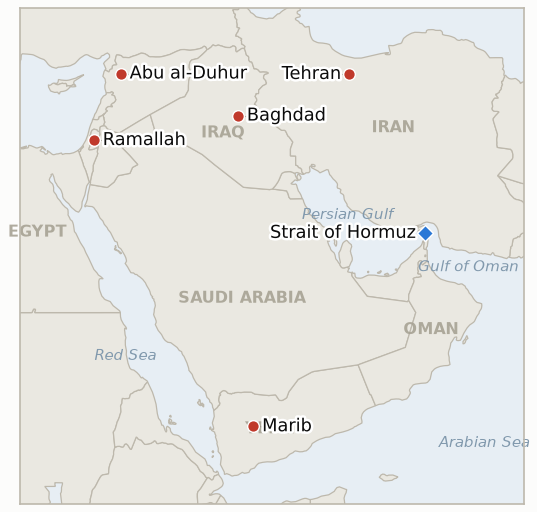

# Middle East Daily Briefing

**August 23, 2026**

- **Reporting window:** ~24 hours, August 22, 09:00 to August 23, 09:00 KST
- **Overall assessment:** Saturday's throughline was rhetoric racing ahead of Monday's actual sanctions rollout while three separate fronts kept moving on their own tracks. Iran's Foreign Ministry pre-emptively branded the coming Bessent package a "declaration of war on all nations" and threatened any country that joins it as "considered an enemy," while Trump repeated his claim to view Hormuz "as an American territory right now," neither statement adding a single verifiable new fact to Monday's actual content. In a smaller but more concrete move, Iran granted passage to a number of Iraqi oil tankers through the strait, the war's first documented passage concession to a third country even as the broader blockade against noncompliant shipping holds. Yemen's war widened again, a Marib missile and drone barrage wounding four as Yemen's government logged another triple-digit day of operations against Houthi positions and killed three Houthi field commanders near Taiz. US envoy Tom Barrack said an Israeli strike on Syria's Abu al-Duhur airbase risked a direct clash with Turkey and suggested it was timed to "bait" Ankara ahead of Israel's own election, opening a new friction point between two US partners. And in the West Bank, IDF brass privately warned political leadership the territory is on the "brink" of violent escalation, a warning that arrived the same day as four more settler-attack injuries and an Israeli strike that killed a Hamas commander in Gaza. Markets were closed for the weekend in both Seoul and New York; Friday's settles, Brent $93.93 and WTI $86.64, and KOSPI's 6,912.95 close, carry forward unchanged.

---

## 1. What Happened

<figure style="float:right; width:46%; margin:2pt 0 8pt 14pt;">

<figcaption style="font-size:8pt; color:#666; text-align:center; margin-top:3pt; font-style:italic;">Major places of discussion</figcaption>
</figure>

### 1.1 Iran Calls Monday's Coming Sanctions a "Declaration of War on All Nations" as Trump Repeats His Hormuz Territory Claim

Iran's Foreign Ministry spokesman Esmaeil Baghaei said Saturday the sanctions package Treasury Secretary Bessent is set to detail at Monday's press conference amounts to an unlawful "extraterritorial sovereignty" over every independent UN member state, and separately Tehran warned any country that joins the measures will be "considered an enemy" ([CNBC](https://www.cnbc.com/2026/08/22/iran-criticizes-us-sanctions-extraterritorial-sovereignty.html); [Al Jazeera liveblog](https://www.aljazeera.com/news/liveblog/2026/8/22/iran-war-live-trump-says-tehran-not-ready-to-make-right-deal-to-end-war)). A close ally of Khamenei separately said Trump's rhetoric "stems from desperation" and that Iran "will not submit" ([CNN](https://www.cnn.com/2026/08/22/world/live-news/iran-war-trump)). Trump, in the same window, repeated that he views "the Strait of Hormuz as an American territory right now" and said Iran is "not ready to make the right deal in my opinion," language that restates rather than advances IND-20260817-2's rhetoric-versus-policy test. Neither side's Saturday statements name a single concrete new measure; Monday's actual press conference remains the substantive test. **Confidence: High** on both sides' quoted statements (Tier 1-2, CNBC, Al Jazeera, CNN, on-record, multi-outlet); no claim here is yet independently testable beyond the statements themselves.

### 1.2 Iran Opens a Hormuz Passage Concession for Iraqi Oil Tankers, a First Concrete Move

Iran has granted permission for a number of Iraqi oil tankers to pass through the Strait of Hormuz, following repeated requests from Baghdad that Iraqi Prime Minister Ali al-Zaidi's government pressed during Iranian Parliament Speaker Mohammad Baqer Qalibaf's visit to Iraq; Iraqi President Nizar Amedi confirmed Iran "facilitated the passage of vessels carrying Iraqi oil through the strait in recent days" ([BOE Report](https://boereport.com/2026/08/22/iran-grants-permission-for-a-number-of-iraqi-oil-tankers-to-pass-through-hormuz/); [Al Jazeera](https://www.aljazeera.com/news/2026/8/22/iran-grants-permission-for-some-iraqi-oil-tankers-to-pass-through-hormuz); [The National](https://www.thenationalnews.com/news/mena/2026/08/22/iran-gives-permission-for-iraqi-oil-tankers-to-pass-through-strait-of-hormuz/)). Iraq, which produced roughly 4 million barrels a day before the war and lacks its own tanker fleet, has been separately exploring alternative export routes through Turkey, Syria and Jordan; this is the first documented instance of Iran granting a bilateral passage concession to a third country's flagged cargo rather than either blanket permission or blanket denial. The move does not extend to a general toll or fee announcement and has no bearing on Iran's continued interdiction of vessels it deems noncompliant. **Confidence: High** on the concession itself and its Iraqi-government sourcing (Tier 1-2, multi-outlet, on-record Iraqi presidential statement); Medium on how durable or exception-limited the carve-out is, since no formal published criteria accompany it.

### 1.3 Yemen's War Intensifies Again as Marib Absorbs a Missile and Drone Barrage

Marib's government media office said six ballistic missiles and four drones struck residential neighborhoods in Marib city Saturday evening, wounding four people and damaging homes and civilian infrastructure; separately, three Houthi fighters, including field commanders, were killed in Yemeni government drone strikes west of Taiz the same day ([The New Arab](https://www.newarab.com/news/yemen-government-forces-houthis-renew-fighting-marib-taiz)). Yemen's internationally recognized government said its forces conducted more than 100 military operations against Houthi positions in the prior 24 hours, continuing the pattern of triple-digit daily operational tempo this ledger has tracked since mid-August. Neither the Marib barrage nor the Taiz strikes drew any fresh international mediation response in the window. **Confidence: High** on the Marib casualty and damage figures and the government operations tally (Tier 1-2, Yemeni government media office, multi-outlet); Medium on precise Houthi casualty attribution near Taiz, since the count rests on government military sourcing without independent confirmation.

### 1.4 A US Envoy Says Israel's Syria Strike Risked War With Turkey and May Have Been Timed to Bait Ankara

US special envoy to Syria and ambassador to Turkey Tom Barrack said Israel's August 18 strike on the Abu al-Duhur airbase in Syria's Idlib province could have escalated into a direct military confrontation with Turkey, since Turkish forces at the base were not informed in advance and could plausibly have scrambled jets believing themselves under attack; in fresh remarks reported Saturday, Barrack went further, suggesting the strike's timing, targeting a base Turkey was reportedly moving to garrison, may have been intended to "bait" Ankara into a clash ahead of Israel's own October 27 election ([Haaretz](https://www.haaretz.com/israel-news/israel-security/2026-08-22/ty-article/.premium/u-s-envoy-israel-risked-confrontation-with-turkey-by-baiting-ankara/000001a0-2822-dc38-a7f1-3f2f77b90000); [The Times of Israel](https://www.timesofisrael.com/us-envoy-suggests-israeli-strike-in-syria-was-election-ploy-aimed-at-baiting-turkey-into-clash/)). Israeli Foreign Minister Gideon Sa'ar said Saturday Israel has "no interest in escalation with Turkey" but will not accept a Turkish military presence in Syria, citing the same concern about foreign infiltration Israel has applied to Iranian activity in Lebanon and Gaza ([The Times of Israel liveblog](https://www.timesofisrael.com/liveblog-august-22-2026/)). Neither Turkey nor Israel has taken a further military or diplomatic step tied specifically to the strike since Barrack's remarks. **Confidence: High** on Barrack's and Sa'ar's quoted statements (Tier 1-2, Haaretz, Times of Israel, on-record); Medium on the "bait" characterization itself, since it is Barrack's own inference rather than a confirmed Israeli motive.

### 1.5 IDF Warns the West Bank Is on the "Brink" of Escalation as Settler Violence and a Gaza Strike Both Continue

Israeli media reported IDF brass have privately warned political leadership the West Bank is on the brink of violent escalation as settler violence and illegal outpost growth continue, with forces increasingly diverted from Palestinian-terror arrests to contain settler extremism ([The Times of Israel liveblog](https://www.timesofisrael.com/liveblog-august-21-2026/)). The same window saw at least four more Palestinians injured in separate settler attacks, a 15-year-old wounded near Tammun and a Palestinian vehicle crashing after stone-throwing near Ramallah ([The Times of Israel liveblog](https://www.timesofisrael.com/liveblog-august-22-2026/)). In Gaza, the IDF killed Sharif al-Hasanat, a company commander in Hamas's Deir al-Balah Battalion, in a strike the army said targeted an "immediate threat" to troops; al-Hasanat had reportedly been involved in rebuilding Hamas's tunnel network and advancing attacks on IDF forces ([The Jerusalem Post](http://www.jpost.com/middle-east/iran-news/2026-08-22/live-updates-906234)). Neither story has yet produced a formal Israeli government response beyond the private IDF warning itself. **Confidence: High** on the four settler-attack injuries and the Gaza strike (Tier 1-2, Times of Israel liveblog, Jerusalem Post, on-the-ground reporting); Medium on the private IDF warning's precise framing, since it is sourced to unnamed officials rather than an on-record statement.

---

## 2. Deep Dive: Incentives and Motives

### 2.1 Why would Iran escalate to "declaration of war" language before Bessent has named a single new sanction?

Because the rhetorical cost of pre-emptively maximizing the threat is zero and the payoff is real: framing the sanctions as an act of war against "all nations" rather than just Iran gives Tehran a ready-made argument for why China, Russia and other trading partners should resist compliance before they have even seen what the measures target, positioning Iran to shape the narrative around Monday's announcement rather than simply react to it.

### 2.2 Why would Iran carve out passage for Iraqi tankers specifically while its broader blockade against noncompliant shipping continues?

Because Iraq is a dependent neighbor rather than an adversary, one whose oil exports Tehran has no strategic interest in strangling and whose goodwill (and Ghalibaf's personal diplomatic capital from the visit) costs Iran little to preserve, letting Tehran demonstrate that its blockade is a targeted instrument against parties it judges hostile or noncompliant rather than an indiscriminate closure of the strait to everyone, a distinction useful to Iran's own claim that the disruption is deliberate policy rather than loss of control.

### 2.3 Why would Yemen's war intensify again just as international attention is fixed on Monday's Iran sanctions rollout?

Because neither the Houthis nor Yemen's government take their operational cues from Washington's calendar, and a Gulf-adjacent economic story absorbing global attention creates, if anything, more room rather than less for a regional war that already runs on its own logic to continue at its established tempo without drawing the diplomatic scrutiny a quieter week might invite.

### 2.4 Why would a US envoy publicly suggest an ally deliberately provoked a NATO member right before that ally's own election?

Because Barrack's job as both Syria envoy and Turkey ambassador puts him in the position of managing the fallout with Ankara regardless of Israel's intent, and naming the electoral-politics explanation publicly, rather than letting it remain a private US assessment, both signals to Turkey that Washington understands the strike was not solely about Syria and puts public pressure on Netanyahu's government to avoid a repeat performance while Israel's own campaign season is underway.

### 2.5 Why would IDF brass escalate their private warning about West Bank violence now, after weeks of the Qusra siege already drawing international attention?

Because Qusra was a single, contained, internationally visible incident that could be managed as an isolated case, while the brass's brief describes a broader structural trend, outpost growth and settler violence outpacing the army's capacity to respond without diverting resources from counterterrorism, a warning about system-wide trajectory rather than one more site-specific incident, and one more urgent to raise now precisely because Qusra's own resolution has not slowed the underlying pattern it was supposed to be a symptom of.

---

## 3. Policy Implications for South Korea

### 3.1 Exposure snapshot

| Item | Current reading | Source |
| --- | --- | --- |
| Middle East share of crude imports | 48.5% (May-July 2026), down from 69.1% a year earlier; non-Middle East share crossed 50% for the first time on record | KNOC via Asia Business Daily; `korea-exposure.md` |
| July-August crude procurement | 110%+ of prior-year volume secured (MOTIE, July 21); strategic reserve swap extended through August, ~21 million barrels swapped to date | MOTIE via Herald Business, Hankyung; `korea-exposure.md` |
| September crude procurement | 90%+ secured (MOTIE, July 21) | MOTIE via Herald Business; `korea-exposure.md` |
| Red Sea detour routing | Korean-bound crude cargoes continue via the Yanbu/Red Sea workaround; Yanbu exports to Asian buyers including Korea have surged to ~4 million bpd from under 1 million bpd a year earlier | Lloyd's List Intelligence; `korea-exposure.md` |
| Strategic reserve coverage | ~26 days of actual consumption (estimate); swap on immediate standby, untested at scale | CSIS; MOTIE July 27 |
| Refiner Saudi ownership exposure | S-Oil (Saudi Aramco majority ~63%), HD Hyundai Oilbank (Aramco ~17%) | Public filings; `korea-exposure.md` |
| Brent / WTI | Markets closed for the weekend; last verified Friday settle $93.93 / $86.64, a sixth straight session of gains, carries forward unchanged | TradingEconomics |
| KOSPI / USD-KRW | Markets closed for the weekend; last verified Friday close KOSPI 6,912.95 (+0.88%), won 1,386.5 (11-month high), carries forward unchanged | Korea JoongAng Daily; Seoul Economic Daily |
| Hormuz transits | No fresh Reuters/Kpler print in the window; last verified Thursday August 20 count of 7 vessels, an "historic low" per IranWire, against Wednesday's same-report figure of 14 | Reuters via Kpler; IranWire |

### 3.2 Implications by development

**Saturday's dueling rhetoric, Iran's "declaration of war" framing and Trump's repeated Hormuz territory claim, adds no verifiable new fact for Korean planners to act on, and the genuinely consequential test remains Monday's actual sanctions content rather than either side's pre-emptive positioning.** IND-20260821-1 (deadline ~August 26) is the indicator that will actually resolve this question; IND-20260817-2 (Hormuz territorial claim, deadline ~August 31) continues tracking whether the rhetoric ever converts into a real policy step Korea's shipping and insurance planners would need to price.

**Iran's Iraqi-tanker carve-out is the first concrete evidence this ledger has of the blockade functioning as a selective, negotiable instrument rather than a blanket closure, a marginally reassuring signal for the general proposition that non-Iranian cargo can move through the strait under the right bilateral terms, though it carries no direct benefit for Korean-flagged or Korean-chartered tonnage, which has no comparable bilateral channel with Tehran.** IND-20260814-1 (Hormuz toll question, deadline ~August 24, two days out) now leans toward its free-passage falsification branch on this evidence.

**Yemen's renewed intensification, the Marib barrage and the government's continued triple-digit operational tempo, has no direct bearing on Korea's own Yanbu/Red Sea routing, which runs through the Bab el-Mandeb corridor rather than Marib's inland front, but sustains the broader pattern of an active, multi-front war in the same theater Korea's workaround transits.** IND-20260817-1 (Yemen spread draws mediation, deadline ~August 31) continues tracking whether the widening war ever draws a matching diplomatic response.

**The Turkey-Israel friction over the Abu al-Duhur strike has no direct Korean market channel today, but a genuine rupture between two US security partners in a theater adjacent to Korea's own shipping routes would be a new category of regional risk this ledger has not previously had to track, distinct from the Iran-centered risk map that has dominated this year.** New IND-20260823-1 (deadline ~September 6) opens to track whether the friction escalates into an actual confrontation or is absorbed.

**The West Bank "brink of escalation" warning and the Gaza strike both carry no direct Korean market exposure, but both confirm the broader ceasefire and occupation-management framework remains under structural strain rather than stabilizing, keeping the regional risk premium behind this year's Korean market volatility unresolved.** New IND-20260823-2 (deadline ~September 6) opens to track whether the systemic warning translates into an actual step change in the violence pattern it describes.

**Testable indicators:**

- **IND-20260823-1** — US envoy Tom Barrack's account that Israel's August 18 strike on Syria's Abu al-Duhur airbase risked a direct military clash with Turkey, and his suggestion the strike was timed to "bait" Ankara ahead of Israel's own election, either escalates into a real Turkey-Israel confrontation or diplomatic rupture, or both sides de-escalate and absorb the episode. A confirmed Turkish military response, formal diplomatic rupture, or disclosed change in Turkish or Israeli force posture specifically tied to the strike by ~2026-09-06 confirms real escalation; continued statements only, with no military or diplomatic rupture through the same date, falsifies escalation and confirms both sides absorbed the episode.
- **IND-20260823-2** — The IDF's private warning that the West Bank is on the "brink" of violent escalation either materializes into a mass-casualty event, a formal Israeli emergency security measure, or a materially different enforcement posture, or the pattern of scattered daily incidents continues without a step change. A mass-casualty incident, a formal emergency measure, or a documented enforcement-posture shift specifically responding to the warning, by ~2026-09-06, confirms the warning preceded a real step change; continued scattered daily incidents at an unchanged pace and no formal measure through the same date falsifies a step change.

---

## 4. Watch List

- **Whether Monday's August 24 sanctions rollout delivers genuinely new mechanisms or reiterates existing measures** (IND-20260821-1, deadline August 26).
- **Whether the June 17 MOU's toll-free Hormuz window converts into actual Iranian tolls or a quiet, Iraqi-style extension of free passage** (IND-20260814-1, deadline August 24, two days out).
- **Whether the US Navy's kinetic blockade enforcement, or Iran's threatened "precise strikes," draws an actual US-Iran military exchange** (IND-20260812-1, deadline August 26).
- **Whether the Gaza disarm-first framework ever reaches a formal Israeli Security Cabinet vote in any form** (IND-20260812-4, deadline August 26).
- **Whether the Qusra settler outpost's removal proves durable with no return, completing the indicator's dismantlement bar** (IND-20260813-3, deadline August 27).
- **Whether the Qusra food and medicine shortage draws an Israeli intervention or hardens into a documented emergency** (IND-20260821-2, deadline August 28).
- **Whether South Korea's KOSPI reversal holds for a full week or last week's crash reasserts itself** (IND-20260820-2, deadline August 27).
- **Whether Saudi Arabia responds to the claimed Najran/Aramco Houthi strikes or maintains its restraint pattern** (IND-20260822-1, deadline September 5).
- **Whether the Somali piracy surge draws a coordinated naval or insurance response** (IND-20260822-2, deadline September 5).
- **Whether the August 15 Hezbollah-Israel exchange triggers a further round or both sides step back to the post-truce equilibrium** (IND-20260816-1, deadline August 29).
- **Whether the Gaza Yellow Line incidents prompt a formal IDF operational response or stay isolated** (IND-20260816-2, deadline August 30).
- **Whether Yemen's confirmed spread draws renewed international mediation as the war widens further** (IND-20260817-1, deadline August 31).
- **Whether Trump's declared intent to make Hormuz US territory produces any concrete policy step beyond repeated rhetoric** (IND-20260817-2, deadline August 31).
- **Whether Israel's prepared Ali al-Taher ridge operation actually launches** (IND-20260818-2, deadline August 31).
- **Whether the Rome track's provisionally scheduled September 1 eighth round proceeds** (IND-20260807-2, deadline September 1).
- **Whether Trump's threat to bomb Oman produces any real diplomatic or military consequence** (IND-20260818-1, deadline September 1).
- **Whether the Houthis' claimed strike on Saudi naval vessels near Mocha is confirmed or draws a direct Saudi response** (IND-20260818-3, deadline September 1).
- **Whether Katz's uncoordinated West Bank police handover proceeds or is delayed or blocked** (IND-20260819-2, deadline September 1).
- **Whether the fatal Minoan Dignity attack is ever attributed or draws a military response** (IND-20260819-1, deadline September 2).
- **Whether a signed Iran-Oman Hormuz joint statement with an operating date is reached, or the shipping map deal stalls again** (IND-20260816-3, deadline September 5).
- **Whether the Turkey-Israel friction over the Abu al-Duhur strike escalates or is absorbed** (IND-20260823-1, deadline September 6).
- **Whether the IDF's West Bank "brink of escalation" warning is followed by an actual step change in the violence pattern** (IND-20260823-2, deadline September 6).
- **Whether the Syria nuclear material find converts into a concluded agreement and verified removal** (IND-20260812-2, deadline September 11).
- **Whether the West Bank IDF-to-police enforcement transfer reduces settler violence, or leaves it unchanged** (IND-20260815-2, deadline September 12).
- **Whether Syria moves against Hezbollah in Lebanon despite Iran's warning, or the confrontation stays rhetorical** (IND-20260815-3, deadline September 15).
- **Whether Kaine's privileged war powers resolution on Oman passes, fails, or never reaches a floor vote when the Senate returns in September** (IND-20260819-3, deadline September 25).
- **Whether the Caroline Bezengi oil spill is contained now that salvage work has begun.**
- **Whether the Qeshm Island explosions are ever confirmed as a real strike or resolved as a false alarm.**

---

## 5. Source Quality Summary

| Claim | Sources | Confidence |
| --- | --- | --- |
| Iran calls the coming sanctions a "declaration of war on all nations"; warns joining countries will be "considered an enemy" | CNBC, Al Jazeera liveblog (Tier 1-2, on-record Foreign Ministry statement, multi-outlet) | High |
| Trump repeats he views the Strait of Hormuz "as an American territory right now"; Iran "not ready to make the right deal" | Al Jazeera liveblog (Tier 1-2, on-record quote) | High |
| Iran grants passage to a number of Iraqi oil tankers through Hormuz following Baghdad's requests | BOE Report, Al Jazeera, The National (Tier 1-2, on-record Iraqi presidential statement, multi-outlet) | High |
| Marib missile and drone barrage wounds four; Yemen's government logs 100-plus operations against Houthi positions in 24 hours | The New Arab, citing Yemeni government media office and military sourcing (Tier 2, government-sourced, no independent international confirmation of casualty count) | High on the government tally; Medium on precise casualty attribution |
| US envoy Tom Barrack says the Abu al-Duhur strike risked war with Turkey and may have been election-season "bait" | Haaretz, The Times of Israel (Tier 1-2, on-record envoy statement, multi-outlet) | High on the quote; Medium on the "bait" characterization as Barrack's own inference |
| Israeli FM Sa'ar says Israel has "no interest in escalation with Turkey" but will not accept a Turkish base in Syria | The Times of Israel liveblog (Tier 1-2, on-record ministerial statement) | High |
| IDF brass privately warn political leadership the West Bank is on the "brink" of violent escalation | The Times of Israel liveblog (Tier 2, unnamed-official sourcing, no on-record IDF statement) | Medium |
| Four Palestinians injured in separate settler attacks (Tammun, Ramallah); IDF kills Hamas Deir al-Balah commander Sharif al-Hasanat | The Times of Israel liveblog, The Jerusalem Post (Tier 1-2, on-the-ground reporting, multi-outlet) | High |
