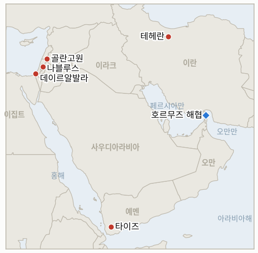

# 중동 일일 브리핑

**2026년 8월 24일**

- **보고 기간:** 약 24시간, 8월 23일 09:00 ~ 8월 24일 09:00 (한국시간)
- **종합 평가:** 일요일의 지배적인 흐름은 월요일에 실제로 나올 베선트 제재 발표를 앞두고 사방에서 압박이 쌓여갔다는 점이었으며, 발표 자체는 아직 이 보고 기간에 들어오지 않았다. 이란의 신임 강경파 안보 수장 모흐센 레자에이는 걸프 이웃국이 다가오는 미국 제재에 동참할 경우 호르무즈 해협의 모든 석유 흐름을 차단하겠다고 위협했으며, 같은 주말 페제시키안 대통령은 붕괴된 6월 양해각서를 공개적으로 옹호하며 이란이 "영원히 전쟁을 지속할 수는 없다"고 말했고, 이집트 외무장관은 테헤란과 통화하며 외교 채널을 살리려 애썼다. 같은 정부에서 같은 주말 세 갈래로 갈린 신호였다. 별도로 미국 특사 톰 배럭은, 토요일부터 이 원장이 추적해온 튀르키예-이스라엘 마찰의 중심에 이미 서 있던 인물인데, 이스라엘이 "지금도" 골란고원을 점령 중이라는 자신의 발언을 철회하며 두 번째 논란을 자초했다. 이는 트럼프의 2019년 인정 입장과 정면으로 배치되는 발언이었고, 카츠 국방장관과 공화당 상원의원의 직접적인 비판을 받았다. 가자지구에서는 네타냐후와 카츠가 무해한 연 발사를 이유로 "공습을 강화하겠다"고 경고하는 동시에, 별도의 공습이 알자와이다와 누세이라트에서 4세 아동을 포함해 팔레스타인인 3명의 목숨을 앗아갔다. 서안지구에서는 요르단 계곡에서 이스라엘인을 겨냥한 흉기 습격, 오사린의 정착민 방화, 그리고 이스라엘에 E1 정착촌 입찰 철회를 요구하는 EU의 새로운 성명이 이어졌다. 그리고 예멘에서는 전투가 타이즈로 집중돼, 정부군이 알다바브 전선에서 후티의 침투 시도를 격퇴했다. 서울과 뉴욕 모두 이틀 연속 주말 휴장으로, 금요일 종가인 브렌트유 93.93달러, WTI유 86.64달러, 코스피 6912.95는 변동 없이 그대로 이어진다.

---

## 1. 오늘의 주요 사건

<figure style="float:right; width:46%; margin:2pt 0 8pt 14pt;">

<figcaption style="font-size:8pt; color:#666; text-align:center; margin-top:3pt; font-style:italic;">주요 논의 지점</figcaption>
</figure>

### 1.1 이란 신임 안보 수장, 호르무즈 전면 봉쇄 위협하고 페제시키안은 양해각서 옹호하며 이집트는 대화 재개 시도

이란 최고국가안보회의 사무총장이자 강경파 출신 전 혁명수비대 총사령관인 모흐센 레자에이는 토요일 "주변국이 미국의 경제전쟁에 동참한다면 페르시아만과 호르무즈 해협에서 단 한 방울의 석유도 나가지 못할 것"이라고 경고하며 이 위협을 다른 걸프 수출 항로로도 확대했고, 트럼프가 네타냐후의 영향을 받아 행동한다고 비난했다([미들이스트아이](https://www.middleeasteye.net/live-blog/live-blog-update/iran-threatens-block-hormuz-if-neighbours-join-us-sanctions); [CNN](https://www.cnn.com/2026/08/23/world/live-news/iran-war-trump)). 같은 주말, 8월 23일 국영 통신사 IRNA가 보도한 연설에서 페제시키안 대통령은 6월 양해각서를 현재로선 최선의 합의라고 옹호하며 "이 합의에는 항복에 해당하는 조항이 단 하나도 없다"고 말했고, 이란이 "영원히 전쟁을 지속할 수는 없다"며 "전쟁도 평화도 아닌" 상태를 끝내는 문제를 국가 경제 전망과 연결지었다([더 뉴스](https://www.thenews.com.pk/latest/1413356-iran-president-says-us-agreement-is-best-way-out-of-neither-war-nor-peace); [더 뉴 아랍](https://www.newarab.com/news/irans-president-wants-revive-mou-end-stalled-us-war)). 별도로 바드르 압델아티 이집트 외무장관과 아바스 아라그치 이란 외무장관은 토요일 통화에서 미이란 대화 재개와 이란-오만 호르무즈 해상교통지도 트랙을 논의했다고 이집트 외무부가 밝혔으나, 협상이 곧 재개된다는 징후는 없다([아랍뉴스](https://www.arabnews.com/node/2655540/middle-east)). 같은 이란 정부에서 나온 세 갈래의 신호, 강경 위협과 온건 호소와 조용한 외교가 서로 다른 방향을 가리키는 가운데, 월요일 실제 제재 세부 내용 발표를 몇 시간 앞두고 있다. **신뢰도: 높음** — 세 발언의 발생과 출처(1~2등급, 미들이스트아이·CNN, IRNA를 다수 매체가 인용, 아랍뉴스, 실명 인용). **신뢰도: 중간** — 진영 간 실질적 이견인지 아니면 서로 다른 청중을 겨냥한 조율된 메시지인지는 불확실하다.

### 1.2 튀르키예 마찰의 중심에 있던 미국 특사, 이번엔 골란고원을 둘러싸고 두 번째 논란에 휩싸여

시리아 담당 미국 특사이자 튀르키예 주재 대사로서 토요일 이 원장이 추적한 아부 알두후르 공습 관련 발언의 당사자이기도 한 톰 배럭은, 이틀 전 이스라엘이 유엔 결의를 위반해 "지금도" 골란고원을 점령하고 있다고 한 별도의 발언을 철회했다. 이는 트럼프의 2019년 이스라엘 주권 인정 입장과 정면으로 배치되는 주장이었다([볼티모어선](https://www.baltimoresun.com/2026/08/23/a-us-envoy-clarifies-his-comments-on-golan-heights-that-contradicted-trumps-position/); [야후뉴스](https://www.yahoo.com/news/politics/articles/us-envoy-walks-back-comments-190343038.html)). 배럭은 자신이 원래 의도한 바는 레바논 내 이스라엘의 영토 병합을 예상하지 않는 이유를 설명하려던 것이며, "무력으로 취한 영토는 협상된 합의가 없는 한 수 세대에 걸쳐 분쟁 대상으로 남는다"는 점을 골란을 예로 들어 지적한 것이지 유엔의 입장을 지지한 것이 아니라고 밝혔다. 그는 "골란에 대한 미국의 정책은 2019년 트럼프 대통령이 정한 그대로이며 변함이 없다"고 덧붙였다. 이스라엘 카츠 국방장관은 배럭의 원래 발언이 "부정확한 내용으로 가득하다"며 "트럼프 미국 대통령의 입장과 배치되는 견해"를 담고 있다고 비판했고, 플로리다주 공화당 상원의원 릭 스콧은 특사가 트럼프의 이스라엘 주권 인정을 "잊은" 것 같다고 밝혔다([타임스 오브 이스라엘 라이브블로그](https://www.timesofisrael.com/liveblog-august-23-2026/)). 배럭 본인의 해명 외에 미국 행정부 차원의 공식 성명은 나오지 않았다. **신뢰도: 높음** — 배럭의 원 발언과 철회, 카츠·스콧의 반응(1~2등급, 볼티모어선·야후·타임스 오브 이스라엘, 실명 인용, 다수 매체). **신뢰도: 중간** — 이번 논란이 배럭의 이중 특사 역할에 실질적 결과를 낳을지는 불확실하다.

### 1.3 이스라엘, 가자지구 연 발사에 "공습 강화" 경고하는 가운데 별도 공습으로 4세 아동 포함 3명 사망

네타냐후 총리와 카츠 국방장관은 일요일, 가자지구에서 이스라엘 마을 방향으로 연을 날리는 행위가 즉시 중단되지 않으면 이스라엘군이 책임자에 대한 "공습을 강화"하겠다고 경고했다. 이는 폭발물이 실려 있지 않은 연 4개가 나할오즈 키부츠에서 발견된 데 따른 것이며, 하마스 대변인 하젬 카셈은 이를 "난민촌의 아이들 장난감"이라며 일축했다([타임스 오브 이스라엘 라이브블로그](https://www.timesofisrael.com/liveblog-august-23-2026/)). 같은 날 별도로, 이스라엘군의 공습이 가자지구 중부 알자와이다에서 4세 무함마드 압델살람 타하를 포함해 2명, 누세이라트에서 1명 등 총 3명의 목숨을 앗아갔다. 이스라엘군은 한 공습이 "테러리스트"를 겨냥한 것이라고 밝혔고, 사상자 수는 가자지구 민방위대가 발표했다([아흐람온라인](https://english.ahram.org.eg/NewsContent/58/1262/575121/War-on-Gaza/War-on-Gaza/Israeli-strikes-kill-three,-including-a-child-in-c.aspx); [아랍뉴스](https://www.arabnews.com/node/2655607/middle-east)). 가자지구 보건당국에 따르면 10월 휴전 발효 이후 이스라엘의 공습으로 사망한 팔레스타인인은 1,280명을 넘어섰다. 별도로 국제적십자위원회(ICRC)의 중개로 팔레스타인 억류자 6명이 석방돼 칸유니스의 나세르 병원에 도착했다. **신뢰도: 높음** — 연 발사 경고, 공습 사망자, 억류자 석방(1~2등급, 타임스 오브 이스라엘·아흐람온라인·아랍뉴스, 현장 보도, 다수 매체). **신뢰도: 중간** — 알자와이다 공습 표적에 대한 이스라엘군의 "테러리스트" 규정은 군 자체 설명에만 의존한다.

### 1.4 요르단 계곡 흉기 습격, 오사린 정착민 방화, EU의 E1 입찰 철회 요구로 서안지구 긴장 고조

가족 나들이 중이던 24세 이스라엘인이 요르단 계곡에서 흉기에 여러 차례 찔려 부상했으며, 수색 끝에 팔레스타인인 용의자가 체포됐다([타임스 오브 이스라엘 라이브블로그](https://www.timesofisrael.com/liveblog-august-23-2026/)). 별도로 나블루스 남쪽 오사린 마을에서 정착민들이 팔레스타인 가족의 차량과 거주용 방 한 칸에 불을 질렀다. 같은 기간 이스라엘군이 서안지구 급습에서 어린이 1명을 포함해 팔레스타인인 13명을 체포했으나 정착민 용의자에 대한 체포는 이뤄지지 않아 더 넓은 패턴을 이어갔다([미들이스트모니터](https://www.middleeastmonitor.com/20260823-israeli-army-arrests-13-palestinians-as-occupiers-escalate-attacks-in-west-bank/)). EU 외교안보 고위대표는 별도로 이스라엘에 서안지구 E1 구역 건설 입찰을 철회하고 관련 계획을 중단할 것을 촉구하며, E1을 포함한 이스라엘 정착촌이 국제법상 불법이라는 기존 입장을 재확인했다. 흉기 습격도 정착민 방화도 보고 기간 중 집행 정책의 변화로 이어지지는 않았다. **신뢰도: 높음** — 흉기 습격, 체포, 방화(1~2등급, 타임스 오브 이스라엘·미들이스트모니터, 현장 보도, 다수 매체). **신뢰도: 중간** — EU의 E1 성명이 기존 법적 입장의 재확인을 넘어 실질적 결과로 이어질지는 불확실하다.

### 1.5 예멘 전쟁, 타이즈로 집중되며 정부군이 후티의 침투 시도 격퇴

예멘 정부군과 후티 대원들은 일요일 타이즈주 여러 전선에서 교전과 상호 포격을 벌였으며, 정부군은 타이즈시 서쪽 알다바브 전선에서 후티의 침투 시도를 격퇴하고 주 서부 농촌 지역과 시 북부 전선의 후티 진지에 포격을 가해 후티 측 사상자가 발생한 것으로 전해졌다([예멘모니터](https://www.yemenmonitor.com/en/Details/ArtMID/908/ArticleID/179452)). 이번 교전은 토요일 마리브에 대한 미사일·드론 공격과 타이즈 서부에서 후티 지휘관급 3명이 사살된 데 이은 것으로, 8월 초부터 이 원장이 추적해온 정부군 주도의 거의 매일 벌어지는 공세 패턴이 이어지고 있음을 보여준다. 다만 일요일 보도는 과거 몇 주간 나타났던 여러 주로의 확산이 아니라 타이즈 전선에 구체적으로 집중돼 있다. **신뢰도: 중간** — 타이즈 교전 세부 내용은 정부 성향의 단일 매체 보도에 의존하며 독립적인 국제 확인이 없다. **신뢰도: 높음** — 이미 확인된 토요일의 마리브·타이즈 보도와 부합한다는 점에서, 전투가 계속되고 있다는 더 큰 패턴 자체는 신뢰도가 높다.

---

## 2. 심층 분석: 유인과 동기

### 2.1 이란의 안보 수장은 왜 호르무즈 전면 봉쇄를 위협하는데 같은 정부의 대통령은 같은 주말 외교적 출구를 공개적으로 호소하는가?

두 사람은 알리 하메네이 암살 이후 더욱 강경해진 지도부 내에서 서로 다른 세력을 대변하기 때문이다. 혁명수비대 출신으로 현재 최고국가안보회의를 이끄는 레자에이는 안보 기득권층과 흔들리는 걸프 국가들에게 월요일에 무엇이 나오든 최대치의 보복이 여전히 선택지에 있다는 신호를 보내는 반면, 거듭된 사임 시사와 외무장관에 대한 탄핵 압박으로 입지가 약화된 페제시키안은 전쟁의 비용이 지속 불가능하다는 논리를 국내 경제 청중에게 호소하고 있다. 둘 다 아직 내용조차 모르는 발표를 앞두고 이란이 어떻게 처신해야 하는지에 대한 진정으로 상반된 파벌적 도박이다.

### 2.2 이미 한 건의 외교적 화재를 관리 중인 미국 특사는 왜 며칠 만에 무관한 사안에서 또 다른 논란을 자초하는가?

배럭은 시리아 특사와 튀르키예 대사를 동시에 맡는 이례적으로 노출이 큰 역할을 맡고 있어, 여러 개의 겹치는 분쟁을 동시에 관리하려 애쓰면서 끊임없이 카메라와 인터뷰 앞에 서야 하기 때문이다. 그가 밝힌 원래 의도, 즉 골란을 역사적으로 민감한 비유로 활용해 레바논 문제에 대한 논점을 만들려 했다는 설명은, 사전에 조율된 발언 요지 안에 머무르기보다 실시간으로 역사적으로 민감한 유사 사례를 끌어오는 습관을 보여주며, 이 습관이야말로 그의 담당 영역이 이 지역에서 가장 민감한 영토 분쟁들을 동시에 건드리기 때문에 계속 마찰을 낳는 이유다.

### 2.3 이스라엘은 왜 가자지구 무기 중 가장 살상력이 낮은 연 발사에 수사적으로 격상 대응하면서, 같은 날 자신의 공습으로 그보다 훨씬 많은 팔레스타인인을 살상하는가?

연 위협은 이스라엘군 자신의 무폭발물 판정이 인정하듯 물리적 위험 자체보다는 억지력 기준선을 재확인하고, 하마스가 명목상 통제하는 지역에서 나오는 사소한 도발조차 단속할 수 있는지 또는 그럴 의지가 있는지를 시험하는 데 초점이 있는 반면, 알자와이다와 누세이라트의 공습은 휴전 이후 계속 이어져 온 "즉각적 위협" 표적 작전이라는 완전히 별개의 궤도에서 진행되기 때문이다. 상징적 경고와 지속적인 치명적 집행이라는 서로 다른 두 논리가 서로에 대한 대응이 아니라 병렬로 작동하고 있다.

### 2.4 EU가 E1을 둘러싸고 공식 압박을 갱신하는 같은 주말에 서안지구 정착민 폭력은 왜 계속되는가?

EU의 서안지구 정착촌 관련 성명이 이스라엘이 구속력 있다고 여겨온 집행 메커니즘을 동반한 적이 없고, 카츠 자신의 경찰 이양이 비판받아온 집행 공백이 그 주에 브뤼셀이 반대하든 말든 정착민의 방화와 흉기 습격에 가까운 혼란이 사실상 같은 관대한 조건 위에서 벌어지도록 방치하기 때문이다. 정부의 가시적 대응 역량, 어린이 1명을 포함한 팔레스타인인 13명 체포는 계속해서 이 원장의 이스라엘군 경계선 경고(IND-20260823-2)가 구체적으로 위험의 동인으로 지목한 정착민이 아니라 보복 능력이 가장 취약한 인구를 향해 비대칭적으로 작동하고 있다.

### 2.5 예멘의 전투는 왜 새로운 전선으로 계속 확산되기보다 타이즈로 구체적으로 집중되는가?

타이즈는 올해 재점화 훨씬 이전부터 정부와 후티 통제 지역 사이의 경합 요충지로 기능해온, 이 나라의 주요 남북 도로 연결망에 걸쳐 있는 지역이기 때문이다. 양측 모두 이미 여러 전선에서 동시에 싸울 의지를 시험하고 확인한 이상, 전쟁이 가장 전략적 가치가 높은 지형에 정착하는 것은 자연스러운 흐름이며, 이 원장이 추적해온 더 넓은 확산 패턴(IND-20260814-3)이 역전됐다는 신호는 아니다.

---

## 3. 한국에 대한 정책적 함의

### 3.1 익스포저 현황

| 항목 | 현재 수치 | 출처 |
| --- | --- | --- |
| 원유 수입 중 중동산 비중 | 48.5%(2026년 5~7월), 전년 동기 69.1%에서 하락; 비중동산 비중이 사상 처음 50% 상회 | KNOC, 아시아경제 인용; `korea-exposure.md` |
| 7~8월 원유 도입 | 전년 동기 대비 110% 이상 확보(산업통상부, 7월 21일); 전략비축유 스와프 8월까지 연장, 현재까지 약 2,100만 배럴 스와프 | 산업통상부, 헤럴드경제·한경 인용; `korea-exposure.md` |
| 9월 원유 도입 | 90% 이상 확보(산업통상부, 7월 21일) | 산업통상부, 헤럴드경제 인용; `korea-exposure.md` |
| 홍해 우회 항로 | 한국행 원유 화물은 얀부·홍해 우회로를 계속 이용; 얀부에서 한국을 포함한 아시아 매수처로의 수출이 1년 전 하루 100만 배럴 미만에서 약 400만 배럴로 급증 | 로이즈리스트 인텔리전스; `korea-exposure.md` |
| 전략비축유 커버리지 | 실제 소비 기준 약 26일분(추정); 스와프는 즉시 대기 상태이나 대규모 실행은 검증되지 않음 | CSIS; 산업통상부 7월 27일 |
| 정유사 사우디 지분 익스포저 | S-Oil(사우디 아람코 지분 약 63%), HD현대오일뱅크(아람코 지분 약 17%) | 공시 자료; `korea-exposure.md` |
| 브렌트유/WTI유 | 주말 휴장; 마지막 확인된 금요일 종가 93.93달러/86.64달러로 엿새 연속 상승, 변동 없이 이어짐 | TradingEconomics |
| 코스피/원달러 | 주말 휴장; 마지막 확인된 금요일 종가 코스피 6912.95(+0.88%), 원화 1386.5원(11개월 만의 최고치), 변동 없이 이어짐 | 코리아중앙데일리; 서울경제신문 |
| 호르무즈 통항량 | 보고 기간 중 신규 로이터/클플러 발표 없음; 마지막 확인치는 목요일 8월 20일 7척으로 아이란와이어가 "역대 최저"라 평가 | 로이터, 클플러 인용; 아이란와이어 |

### 3.2 사안별 함의

**이란의 상반된 신호, 즉 레자에이의 전면 봉쇄 위협과 페제시키안의 전쟁 피로 호소, 이집트의 조용한 외교적 접근은 한국 정책 입안자에게 행동에 옮길 단일하고 일관된 신호를 전혀 주지 못하며, 실제로 중요한 지표, 즉 어느 걸프 국가가 월요일 제재에 눈에 띄게 동조해 레자에이가 위협한 대응을 촉발하는지는 이 보고 기간이 끝날 때까지 검증되지 않은 채 남아 있다.** IND-20260821-1(시한 약 8월 26일)은 월요일 실제 발표가 실질적으로 새로운 것인지를 판가름할 지표이며, 신규 IND-20260824-1은 아래에서 다루는 배럭 논란이 더 넓은 미국의 지역 외교 태세와 관련해 실질적 결과를 낳는지를 추적한다.

**오늘 두 지표가 각자의 시한에 도달했다. IND-20260724-1(사우디 아브라함 협정 연계)은 반증으로 확정된다. 한 달간의 추적 결과 사우디의 정상화를 향한 또는 그로부터 멀어지는 움직임이 전혀 기록되지 않았으며, 이스라엘과의 관계를 팔레스타인 국가 수립에 조건 짓는 리야드의 입장은 이 지표가 개설됐을 때와 정확히 같은 자리에 머물러 있어, 핵협력-정상화 거래가 가속화되기는커녕 동결 상태에 머물러 있음을 확인한다.** IND-20260814-1(호르무즈 통행료 문제) 역시 반증으로 확정된다. 이란의 공식 통행료 일정도, 명시적인 전면 무료 통항 연장 발표도 시한까지 나오지 않았으며, 이미 토요일에 확인된 이라크 유조선에 대한 좁은 범위의 예외만 있었을 뿐이다. 이는 어느 쪽으로도 깔끔하게 결론나지 않은 채 지속되는 모호함을 확인시키며, 이란의 선택적이고 무력에 기반한 집행이 한국 해운·보험 업계가 발표된 관세표가 아니라 여전히 사안별로 가격에 반영해야 할 실제 현실로 남는다.

**배럭의 골란고원 논란은 한국 시장에 직접적인 통로가 없지만, 튀르키예-이스라엘 사안을 담당하는 같은 미국 특사가 첫 번째 논란(IND-20260823-1) 이후 며칠 만에 또 다른 자초 논란을 일으켰다는 사실은, 더 넓은 미국-튀르키예-이스라엘 정렬 리스크를 추적하는 한국 정책 입안자가 실질적 분쟁 자체와 함께 고려해야 할 미국 지역 외교의 신뢰성에 관한 데이터 포인트다.** 신규 IND-20260824-1(시한 약 9월 6일, IND-20260823-1과 동일)이 두 논란 중 어느 쪽이든 실제 미국의 정책적·인사적 결과로 이어지는지를 추적한다.

**이스라엘의 연 발사 관련 위협과 3명이 사망한 가자지구 공습은 한국 시장에 직접적인 익스포저가 없지만, 둘 다 휴전 집행 체계가 협상된 메커니즘이 아니라 여전히 이스라엘의 일방적 재량에 기반해 있음을 재확인시켜, 한국 시장 변동성의 배후에 있는 일반적인 지역 리스크 프리미엄을 미해결 상태로 남겨둔다.** 신규 IND-20260824-2(시한 약 8월 30일)가 연 발사 위협이 실제 문서화된 확전으로 전환되는지, 아니면 이행되지 않은 수사로 남는지를 추적한다.

**서안지구의 흉기 습격, 정착민 방화, EU의 E1 요구는 한국 시장에 직접적인 통로가 없지만, IND-20260823-2가 던지는 질문, 즉 이스라엘군 자체의 "경계선" 경고가 실제로 집행상의 단계적 변화로 이어지는지를 계속 시험하고 있으며, 지금까지의 증거는 변화가 아니라 연속성 쪽에 가깝다.**

**예멘의 타이즈 전선 집중은 한국의 얀부·홍해 우회로가 지나는 더 넓은 전장의 리스크를 새롭게 격화시키기보다는 유지시키며, 바브엘만데브 회랑 자체에서는 보고 기간 중 새로운 사건이 없었다.** IND-20260817-1(예멘 확산이 중재를 이끌어내는지, 시한 약 8월 31일)은 전쟁이 결국 상응하는 외교적 대응을 이끌어내는지를 계속 추적한다.

**검증 가능한 지표:**

- **IND-20260824-1** — 미국 특사 톰 배럭의 연이은 두 논란, 아부 알두후르 "미끼" 규정(IND-20260823-1)과 이번에 철회된 골란고원 발언이 실제 미국의 정책적 해명, 특사 역할에 대한 공개된 변화, 또는 제도적 결과 없는 지속적 논란 중 어느 쪽으로 귀결되는지를 검증한다. 약 2026년 9월 6일까지 두 사안 중 하나를 다루는 국무부 또는 백악관의 공식 성명, 혹은 배럭의 임무에 대한 공개된 변화가 확인되면 제도적 결과로 확정되며, 같은 기한까지 배럭 본인의 해명만 있을 뿐 공식 행정부 대응이 없는 지속적 공개 마찰만 있으면 결과 없이 흡수됐음이 반증으로 확정된다.
- **IND-20260824-2** — 이스라엘의 가자지구 연 발사에 대한 "공습 강화" 위협이 실제 문서화된 공습 강도·규모의 확대나 연 발사에 구체적으로 결부된 새로운 대피 명령으로 전환되는지, 아니면 위협이 이행되지 않은 채 연 관련 사건이 확전 없이 같은 저강도 수준으로 지속되는지를 검증한다. 약 2026년 8월 30일까지 연 발사에 명시적으로 결부된 문서화된 공습 강도 증가, 표적 범위 확대, 또는 새로운 대피 명령이 확인되면 위협이 실제 집행으로 전환됐음이 확정되며, 같은 기한까지 확전이나 새로운 대피 명령 없이 산발적 연 관련 사건만 지속되면 수사에 그쳤음이 반증으로 확정된다.

---

## 4. 관찰 목록

- **월요일 8월 24일 제재 발표가 진정 새로운 조치를 담는지 아니면 기존 조치를 반복하는지** (IND-20260821-1, 시한 8월 26일).
- **미 해군의 물리적 봉쇄 집행이나 이란이 위협한 "정밀 타격"이 실제 미이란 군사 충돌로 이어지는지** (IND-20260812-1, 시한 8월 26일).
- **가자지구 선무장해제 우선 틀이 어떤 형태로든 이스라엘 안보내각 공식 표결에 도달하는지** (IND-20260812-4, 시한 8월 26일).
- **쿠스라 정착민 전초기지 철거가 재진입 없이 지속되어 지표의 철거 기준을 완전히 충족하는지** (IND-20260813-3, 시한 8월 27일).
- **쿠스라 식량·의료품 부족이 이스라엘의 개입을 이끌어내는지, 아니면 공식화된 위기로 굳어지는지** (IND-20260821-2, 시한 8월 28일).
- **한국 코스피 반등이 온전히 한 주를 버티는지, 아니면 지난주 급락이 재현되는지** (IND-20260820-2, 시한 8월 27일).
- **이스라엘의 연 발사 "공습 강화" 위협이 실제 확전으로 전환되는지, 아니면 수사에 그치는지** (IND-20260824-2, 시한 8월 30일).
- **사우디아라비아가 나즈란·아람코 후티 공격 주장에 대응하는지, 아니면 자제 패턴을 유지하는지** (IND-20260822-1, 시한 9월 5일).
- **소말리아 해적 급증이 조율된 해군 또는 보험 업계의 대응을 이끌어내는지** (IND-20260822-2, 시한 9월 5일).
- **8월 15일 헤즈볼라-이스라엘 교전이 추가 라운드로 이어지는지, 아니면 양측이 휴전 후 균형으로 돌아가는지** (IND-20260816-1, 시한 8월 29일).
- **가자지구 옐로라인 사건이 공식적인 이스라엘군 작전 대응을 촉발하는지, 아니면 고립된 사건으로 남는지** (IND-20260816-2, 시한 8월 30일).
- **예멘의 확인된 확산이 새로운 국제 중재를 이끌어내는지** (IND-20260817-1, 시한 8월 31일).
- **트럼프의 호르무즈 미국 영토화 의지가 반복된 수사를 넘어 구체적인 정책 조치로 이어지는지** (IND-20260817-2, 시한 8월 31일).
- **이스라엘의 준비된 알리 알타헤르 능선 작전이 실제로 개시되는지** (IND-20260818-2, 시한 8월 31일).
- **9월 1일로 잠정 예정된 로마 트랙 8차 회담이 진행되는지** (IND-20260807-2, 시한 9월 1일).
- **트럼프의 오만 폭격 위협이 실제 외교적·군사적 결과로 이어지는지** (IND-20260818-1, 시한 9월 1일).
- **후티가 주장한 모카 인근 사우디 해군 함정 공격이 확인되거나 사우디의 직접 대응을 이끌어내는지** (IND-20260818-3, 시한 9월 1일).
- **카츠의 조율되지 않은 서안지구 경찰 이양이 진행되는지, 지연되는지, 저지되는지** (IND-20260819-2, 시한 9월 1일).
- **미노안 디그니티호에 대한 치명적 공격의 배후가 결국 규명되거나 군사적 대응을 이끌어내는지** (IND-20260819-1, 시한 9월 2일).
- **운영 개시일이 명시된 서명된 이란-오만 호르무즈 공동성명이 도출되는지, 아니면 해상교통지도 합의가 다시 서명 문턱에서 멈추는지** (IND-20260816-3, 시한 9월 5일).
- **아부 알두후르 공습을 둘러싼 튀르키예-이스라엘 마찰이 확대되는지, 아니면 흡수되는지** (IND-20260823-1, 시한 9월 6일).
- **이스라엘군의 서안지구 "경계선" 경고 이후 실제로 폭력 양상의 단계적 변화가 뒤따르는지** (IND-20260823-2, 시한 9월 6일).
- **배럭의 연이은 논란이 실제 미국의 정책적·인사적 결과로 이어지는지** (IND-20260824-1, 시한 9월 6일).
- **시리아의 아사드 시대 핵물질 사안이 최종 합의와 검증된 반출로 이어지는지** (IND-20260812-2, 시한 9월 11일).
- **서안지구 군에서 경찰로의 집행 이양이 정착민 폭력을 줄이는지, 아니면 변화 없이 유지되는지** (IND-20260815-2, 시한 9월 12일).
- **시리아가 이란의 경고에도 불구하고 레바논 내 헤즈볼라에 대해 군사적 조치를 취하는지, 아니면 대치가 수사에 그치는지** (IND-20260815-3, 시한 9월 15일).
- **케인 의원의 오만 관련 전쟁권한 결의안이 9월 상원 복귀 시 표결에서 통과·부결되는지, 아니면 아예 상정되지 않는지** (IND-20260819-3, 시한 9월 25일).
- **캐롤라인 베젠기호 유출 사고가 인양 작업 개시 이후 봉쇄됐는지.**
- **케슘섬 폭발이 실제 공격으로 확인되거나 오경보로 종결되는지.**

---

## 5. 출처 신뢰도 요약

| 주장 | 출처 | 신뢰도 |
| --- | --- | --- |
| 레자에이, 걸프 국가가 미국 제재에 동참하면 호르무즈 전면 봉쇄하겠다고 위협 | 미들이스트아이, CNN, 타스(1~3등급, 실명 최고국가안보회의 사무총장 발언, 다수 매체) | 높음 |
| 페제시키안, 6월 양해각서 옹호하며 "영원히 전쟁을 지속할 수 없다"고 발언 | 더 뉴스(파키스탄), 더 뉴 아랍, IRNA 인용(2등급, 국영 통신사, 실명 대통령 연설) | 높음 |
| 이집트·이란 외무장관, 미이란 대화 재개 논의 | 아랍뉴스, 이집트 외무부 인용(2등급, 실명 정부 발표) | 높음 |
| 배럭, 골란고원 발언 철회; 카츠와 릭 스콧 상원의원 원 발언 비판 | 볼티모어선, 야후뉴스, 타임스 오브 이스라엘 라이브블로그(1~2등급, 실명 인용, 다수 매체) | 높음 |
| 네타냐후·카츠, 가자지구 연 발사에 "공습 강화" 경고; 하마스는 "아이들 장난감"이라 일축 | 타임스 오브 이스라엘 라이브블로그(1~2등급, 실명 장관·하마스 발언) | 높음 |
| 이스라엘 공습으로 알자와이다·누세이라트에서 4세 아동 포함 3명 사망 | 아흐람온라인, 아랍뉴스, 가자 민방위대 인용(2등급, 현장 구조기관 소식통, 다수 매체) | 사망자 수는 높음; 이스라엘군의 표적 근거는 중간 |
| ICRC 중개로 팔레스타인 억류자 6명 석방돼 칸유니스 나세르 병원 도착 | 아랍뉴스, 프랑스24 라이브블로그(1~2등급, ICRC 중개, 다수 매체) | 높음 |
| 요르단 계곡에서 이스라엘인 흉기 습격; 오사린 정착민 방화; 서안지구 급습으로 팔레스타인인 13명 체포 | 타임스 오브 이스라엘 라이브블로그, 미들이스트모니터(1~2등급, 현장 보도, 다수 매체) | 높음 |
| EU, 이스라엘에 E1 건설 입찰 철회 요구하며 서안지구 정착촌이 불법이라고 재확인 | 미들이스트모니터, 통신사 보도(2등급, 실명 EU 성명) | 높음 |
| 예멘 정부군, 타이즈 알다바브 전선에서 후티 침투 시도 격퇴하며 상호 포격 지속 | 예멘모니터(3등급, 정부 성향 단일 매체, 독립적 국제 확인 없음) | 중간 |
