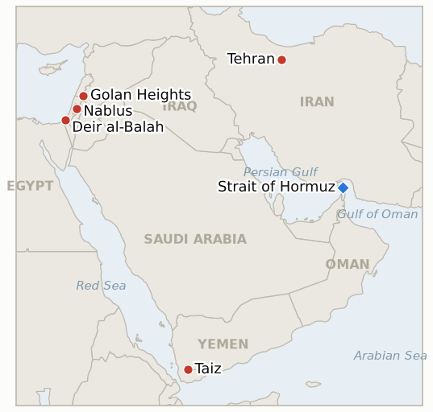

# Middle East Daily Briefing

**August 24, 2026**

- **Reporting window:** ~24 hours, August 23, 09:00 to August 24, 09:00 KST
- **Overall assessment:** Sunday's throughline was pressure building from every direction ahead of Monday's actual Bessent sanctions rollout, without the rollout itself yet landing inside this window. Iran's newly hardline security chief Mohsen Rezaei threatened to halt all oil flow through Hormuz if any Gulf neighbor joins the coming US sanctions, even as President Pezeshkian publicly defended the collapsed June MOU and said Iran "cannot continue with war forever," and Egypt's foreign minister worked the phones with Tehran to keep a diplomatic channel alive, three starkly different signals from the same government on the same weekend. Separately, US envoy Tom Barrack, already at the center of the Turkey-Israel friction this ledger has tracked since Thursday, generated a second controversy by walking back his own remark that Israel "still" occupies the Golan Heights, a claim that contradicted Trump's 2019 recognition and drew direct criticism from Defense Minister Katz and a Republican senator. In Gaza, Netanyahu and Katz threatened to "intensify strikes" over harmless kite launches from the Strip while separate strikes killed three Palestinians, including a four-year-old child, in Al-Zawayda and Nuseirat. The West Bank absorbed a stabbing attack on an Israeli in the Jordan Valley, settler arson in Osarin, and a fresh EU demand that Israel withdraw its E1 settlement tender. And in Yemen, fighting concentrated on Taiz, where government forces repelled a Houthi infiltration attempt on the Al-Dhabab front. Markets were closed for the weekend in both Seoul and New York for a second straight day; Friday's settles, Brent $93.93 and WTI $86.64, and KOSPI's 6,912.95 close, carry forward unchanged.

---

## 1. What Happened

<figure style="float:right; width:46%; margin:2pt 0 8pt 14pt;">

<figcaption style="font-size:8pt; color:#666; text-align:center; margin-top:3pt; font-style:italic;">Major places of discussion</figcaption>
</figure>

### 1.1 Iran's New Security Chief Threatens to Shut Hormuz Entirely as Pezeshkian Defends the Collapsed MOU and Egypt Works to Revive Talks

Mohsen Rezaei, secretary of Iran's Supreme National Security Council and a hardline former IRGC commander-in-chief, warned Saturday that "if the countries surrounding Iran join the Americans in their economic war, not a drop of oil will leave the Persian Gulf and the Strait of Hormuz," extending the threat to other Gulf export routes and accusing Trump of acting on Netanyahu's influence ([Middle East Eye](https://www.middleeasteye.net/live-blog/live-blog-update/iran-threatens-block-hormuz-if-neighbours-join-us-sanctions); [CNN](https://www.cnn.com/2026/08/23/world/live-news/iran-war-trump)). The same weekend, in a speech reported by state news agency IRNA on August 23, President Masoud Pezeshkian defended the June MOU as the best available agreement, saying "there is not a single provision in this agreement that amounts to capitulation" and that Iran "cannot continue with war forever," tying the country's economic prospects to ending its "neither war nor peace" limbo ([The News](https://www.thenews.com.pk/latest/1413356-iran-president-says-us-agreement-is-best-way-out-of-neither-war-nor-peace); [New Arab](https://www.newarab.com/news/irans-president-wants-revive-mou-end-stalled-us-war)). Separately, Egyptian Foreign Minister Badr Abdelatty and Iranian Foreign Minister Abbas Araghchi discussed reviving US-Iran talks and the Iran-Oman Hormuz shipping-map track in a Saturday call, Egypt's foreign ministry said, without any indication negotiations are about to restart ([Arab News](https://www.arabnews.com/node/2655540/middle-east)). The three threads point in different directions from the same Iranian government on the same weekend, hardline threat, moderate appeal, and quiet diplomacy, hours before Monday's actual sanctions detail is due. **Confidence: High** on all three statements' occurrence and attribution (Tier 1-2, Middle East Eye, CNN, IRNA via multiple outlets, Arab News, on-record); Medium on how much genuine daylight separates the factions versus coordinated messaging to different audiences.

### 1.2 A Second Controversy Engulfs the US Envoy Already at the Center of the Turkey Rift, This Time Over the Golan Heights

Tom Barrack, the US special envoy to Syria and ambassador to Turkey whose remarks on the Abu al-Duhur strike this ledger tracked Saturday (IND-20260823-1), walked back a separate comment from two days earlier that Israel "still" occupies the Golan Heights in violation of UN resolutions, a claim that directly contradicted Trump's 2019 recognition of Israeli sovereignty over the territory ([Baltimore Sun](https://www.baltimoresun.com/2026/08/23/a-us-envoy-clarifies-his-comments-on-golan-heights-that-contradicted-trumps-position/); [Yahoo News](https://www.yahoo.com/news/politics/articles/us-envoy-walks-back-comments-190343038.html)). Barrack said he had intended to argue that "territory taken by force remains contested for generations" absent a negotiated agreement, an argument he said was really about why he does not expect Israel to annex land in Lebanon, not an endorsement of the UN position on Golan; he added that "United States policy on the Golan was set by President Trump in 2019 and is unchanged." Defense Minister Katz called Barrack's original remarks "full of inaccuracies" that included "positions that contradict the position of US President Trump," while Florida Republican Senator Rick Scott wrote that the ambassador appeared to have "forgotten" Trump's recognition of Israeli sovereignty ([Times of Israel liveblog](https://www.timesofisrael.com/liveblog-august-23-2026/)). No US administration statement beyond Barrack's own clarification has followed. **Confidence: High** on Barrack's original and walked-back statements and the Katz and Scott reactions (Tier 1-2, Baltimore Sun, Yahoo, Times of Israel, on-record, multi-outlet); Medium on whether the episode carries any consequence for Barrack's dual role beyond the public friction itself.

### 1.3 Israel Threatens to "Intensify Strikes" Over Gaza Kite Launches as Separate Strikes Kill Three, Including a Four Year Old

Prime Minister Netanyahu and Defense Minister Katz warned Sunday that the IDF will "intensify strikes" against those responsible for launching kites from Gaza toward Israeli communities if the practice does not stop immediately, after four kites, none carrying explosives, were found at Kibbutz Nahal Oz; Hamas spokesman Hazem Qassem dismissed the objects as "children's toys in the refugee camps" ([Times of Israel liveblog](https://www.timesofisrael.com/liveblog-august-23-2026/)). In a separate incident the same day, Israeli strikes in central Gaza killed three people, including four-year-old Muhammad Abdel Salam Taha, in Al-Zawayda, with a third person killed in a separate strike on Nuseirat; the IDF said one strike targeted a "terrorist," while Gaza's civil defense service reported the casualties ([Ahram Online](https://english.ahram.org.eg/NewsContent/58/1262/575121/War-on-Gaza/War-on-Gaza/Israeli-strikes-kill-three,-including-a-child-in-c.aspx); [Arab News](https://www.arabnews.com/node/2655607/middle-east)). Gaza health officials say Israeli strikes have killed more than 1,280 Palestinians since the October ceasefire took effect. Separately, the ICRC facilitated the release of six Palestinian detainees, who arrived at Nasser Hospital in Khan Younis. **Confidence: High** on the kite-launch warning, the strike deaths, and the detainee release (Tier 1-2, Times of Israel, Ahram Online, Arab News, multi-outlet, on-the-ground reporting); Medium on the IDF's "terrorist" characterization of the Al-Zawayda strike target, since it rests on the army's own account.

### 1.4 West Bank Tension Mounts With a Jordan Valley Stabbing, Settler Arson, and a Fresh EU Demand Over E1

A 24-year-old Israeli sustained multiple stab wounds during a family outing in the Jordan Valley; the Palestinian suspect was arrested after a manhunt ([Times of Israel liveblog](https://www.timesofisrael.com/liveblog-august-23-2026/)). Separately, settlers torched a car and a residential room belonging to a Palestinian family in Osarin, south of Nablus, part of a broader pattern the Israeli army's own 13 arrests of Palestinians (including a child) in the same window did not extend to settler suspects ([Middle East Monitor](https://www.middleeastmonitor.com/20260823-israeli-army-arrests-13-palestinians-as-occupiers-escalate-attacks-in-west-bank/)). The EU's high representative separately urged Israel to withdraw its construction tender for the West Bank's E1 corridor and halt plans there, restating that Israeli settlements, including in E1, are illegal under international law. Neither the stabbing nor the settler arson has produced any announced change to enforcement policy in the window. **Confidence: High** on the stabbing, arrest, and arson (Tier 1-2, Times of Israel, Middle East Monitor, multi-outlet); Medium on whether the EU's E1 statement carries any practical consequence beyond restating its established legal position.

### 1.5 Yemen's War Concentrates on Taiz as the Army Repels a Houthi Infiltration Attempt

Yemeni Army forces and Houthi fighters traded clashes and mutual shelling across multiple Taiz Governorate fronts on Sunday, with government forces thwarting a Houthi infiltration attempt on the Al-Dhabab front west of Taiz city and shelling Houthi positions in the governorate's western countryside and the city's northern front, reportedly inflicting Houthi casualties ([Yemen Monitor](https://www.yemenmonitor.com/en/Details/ArtMID/908/ArticleID/179452)). The fighting follows Saturday's missile and drone barrage on Marib and the killing of three Houthi field commanders west of Taiz, continuing the pattern of near-daily government-initiated offensive action this ledger has tracked since early August, though Sunday's reporting concentrates specifically on the Taiz front rather than the multi-province spread seen in some prior weeks. **Confidence: Medium** on the Taiz clash details, since they rest on a single Yemeni outlet's government-aligned sourcing without independent international confirmation; High on the broader pattern of continued active fighting given the convergence with Saturday's already-confirmed Marib and Taiz reporting.

---

## 2. Deep Dive: Incentives and Motives

### 2.1 Why would Iran's security chief threaten a total Hormuz shutdown while its own president publicly appeals for a diplomatic off-ramp on the same weekend?

Because the two men speak for different constituencies inside a leadership that itself hardened after Ali Khamenei's assassination: Rezaei, an IRGC-aligned hardliner now heading the SNSC, is signaling to the security establishment and to wavering Gulf states that maximalist retaliation stays on the table regardless of what Monday brings, while Pezeshkian, whose own position has been weakened by threatened resignations and an impeachment push against his foreign minister, is making the case to a domestic economic audience that the war's costs are unsustainable, two genuinely divergent factional bets on how Iran should posture into an announcement neither of them yet knows the content of.

### 2.2 Why would a US envoy already managing one diplomatic fire risk a second one over an unrelated issue within days?

Because Barrack occupies an unusually exposed dual role, Syria envoy and Turkey ambassador at once, that puts him in front of cameras and interviewers constantly while he tries to manage several overlapping disputes simultaneously, and his stated intent, using the Golan as a rhetorical example about contested territory to make a point about Lebanon, shows a pattern of reaching for historically loaded analogies in real time rather than staying inside pre-cleared talking points, a habit that keeps generating friction precisely because his portfolio touches so many of the region's rawest territorial disputes at once.

### 2.3 Why would Israel escalate rhetoric over kites, the least lethal item in Gaza's arsenal, on the same day its own strikes kill several times more Palestinians than any kite has harmed Israelis?

Because the kite threat is aimed less at the physical risk, which the IDF's own no-explosives finding concedes is minimal, than at reasserting a deterrence baseline and testing whether Hamas can or will police even minor provocations from areas it nominally controls, while the Al-Zawayda and Nuseirat strikes proceed on an entirely separate track of ongoing "immediate threat" targeting that has continued at pace since the ceasefire regardless of the kite episode, two different logics, symbolic warning and continued lethal enforcement, running in parallel rather than in response to each other.

### 2.4 Why would West Bank settler violence continue at pace on the same weekend the EU renews formal pressure over E1?

Because EU statements on West Bank settlements carry no enforcement mechanism Israel has ever treated as binding, and the enforcement gap Katz's own police handover has been criticized for leaves settler arson and stabbing-adjacent chaos to occur on effectively the same permissive footing whether or not Brussels objects that week, while the government's visible response capacity, 13 Palestinian arrests including a child, continues to run asymmetrically against the population with the least capacity to retaliate rather than against the settlers this ledger's IDF-brink warning (IND-20260823-2) specifically named as the driver of the risk.

### 2.5 Why would Yemen's fighting concentrate specifically on Taiz rather than continuing to spread across new fronts?

Because Taiz sits astride the country's main north-south road link and has functioned as a contested chokepoint between government and Houthi-held territory since well before this year's reignition, making it a natural focal point once both sides have already tested and confirmed their willingness to fight on multiple fronts simultaneously, a war settling into its most strategically valuable terrain rather than a signal that the wider spread this ledger has tracked (IND-20260814-3) has reversed.

---

## 3. Policy Implications for South Korea

### 3.1 Exposure snapshot

| Item | Current reading | Source |
| --- | --- | --- |
| Middle East share of crude imports | 48.5% (May-July 2026), down from 69.1% a year earlier; non-Middle East share crossed 50% for the first time on record | KNOC via Asia Business Daily; `korea-exposure.md` |
| July-August crude procurement | 110%+ of prior-year volume secured (MOTIE, July 21); strategic reserve swap extended through August, ~21 million barrels swapped to date | MOTIE via Herald Business, Hankyung; `korea-exposure.md` |
| September crude procurement | 90%+ secured (MOTIE, July 21) | MOTIE via Herald Business; `korea-exposure.md` |
| Red Sea detour routing | Korean-bound crude cargoes continue via the Yanbu/Red Sea workaround; Yanbu exports to Asian buyers including Korea have surged to ~4 million bpd from under 1 million bpd a year earlier | Lloyd's List Intelligence; `korea-exposure.md` |
| Strategic reserve coverage | ~26 days of actual consumption (estimate); swap on immediate standby, untested at scale | CSIS; MOTIE July 27 |
| Refiner Saudi ownership exposure | S-Oil (Saudi Aramco majority ~63%), HD Hyundai Oilbank (Aramco ~17%) | Public filings; `korea-exposure.md` |
| Brent / WTI | Markets closed for the weekend; last verified Friday settle $93.93 / $86.64, a sixth straight session of gains, carries forward unchanged | TradingEconomics |
| KOSPI / USD-KRW | Markets closed for the weekend; last verified Friday close KOSPI 6,912.95 (+0.88%), won 1,386.5 (11-month high), carries forward unchanged | Korea JoongAng Daily; Seoul Economic Daily |
| Hormuz transits | No fresh Reuters/Kpler print in the window; last verified Thursday August 20 count of 7 vessels, an "historic low" per IranWire | Reuters via Kpler; IranWire |

### 3.2 Implications by development

**Iran's dueling signals, Rezaei's total-shutdown threat, Pezeshkian's war-fatigue appeal, and Egypt's quiet diplomatic outreach, give Korean planners no single coherent signal to act on, and the one metric that would actually matter, whether any Gulf state visibly aligns with Monday's sanctions and draws Rezaei's threatened response, remains untested going into the window's close.** IND-20260821-1 (deadline ~August 26) is the indicator that will resolve whether Monday's actual announcement is substantively new; new IND-20260824-1 tracks whether the Barrack controversy (below) carries any consequence relevant to the broader US diplomatic posture in the region.

**Two indicators reach their own deadline today. IND-20260724-1 (Saudi Abraham Accords linkage) resolves Falsified: a full month of tracking recorded no Saudi movement toward or away from normalization, and Riyadh's position, conditioning any Israel ties on Palestinian statehood, remains exactly where it sat when this indicator opened, confirming the nuclear-for-normalization bargain stays frozen rather than accelerating.** IND-20260814-1 (Hormuz toll question) also resolves Falsified: neither a formal Iranian toll schedule nor an explicit blanket free-passage announcement materialized by deadline, only the narrower Iraqi tanker carve-out already noted Saturday, confirming prolonged ambiguity rather than a clean resolution, with Iran's selective, force-backed enforcement remaining the operative reality Korean shippers and insurers must still price around case by case rather than against a published tariff.

**The Barrack Golan Heights controversy has no direct Korean market channel, but a second unforced controversy from the same US envoy managing the Turkey-Israel file within days of the first (IND-20260823-1) is a data point on the reliability of US regional diplomacy Korean planners tracking broader US-Turkey-Israel alignment risk should weigh alongside the substantive dispute itself.** New IND-20260824-1 (deadline ~September 6, aligned with IND-20260823-1) tracks whether either controversy produces an actual US policy or personnel consequence.

**Israel's kite-launch threat and the Gaza strikes that killed three carry no direct Korean market exposure, but both confirm the ceasefire's enforcement regime remains built on unilateral Israeli discretion rather than a negotiated mechanism, keeping the general regional risk premium behind Korean market volatility unresolved.** New IND-20260824-2 (deadline ~August 30) tracks whether the kite-launch threat converts into a documented escalation in strike tempo or stays unfollowed rhetoric.

**The West Bank stabbing, settler arson, and the EU's E1 demand have no direct Korean market channel, but continue to test IND-20260823-2's question of whether the IDF's own "brink of escalation" warning ever produces a step change in enforcement, evidence so far runs toward continuity rather than change.**

**Yemen's concentration on the Taiz front sustains rather than newly escalates the risk to the broader theater Korea's Yanbu/Red Sea workaround transits, though the Bab el-Mandeb corridor itself saw no fresh incident in the window.** IND-20260817-1 (Yemen spread draws mediation, deadline ~August 31) continues tracking whether the war ever draws a matching diplomatic response.

**Testable indicators:**

- **IND-20260824-1** — US envoy Tom Barrack's back-to-back controversies, the Abu al-Duhur "bait" characterization (IND-20260823-1) and now the walked-back Golan Heights remark, either produce an actual US policy clarification beyond Barrack's own statements, a disclosed change to his envoy role, or continued controversy with no institutional consequence. A formal State Department or White House statement addressing either episode, or a disclosed change to Barrack's assignment, by ~2026-09-06 confirms institutional consequence; continued public friction with only Barrack's own clarifications and no formal administration response through the same date falsifies it as absorbed without consequence.
- **IND-20260824-2** — Israel's threat to "intensify strikes" over Gaza kite launches either converts into a documented escalation in strike tempo, scale, or a new evacuation order specifically tied to kite incidents, or the threat goes unfollowed and kite incidents continue at the same low-level nuisance pace with no escalation. A documented strike-tempo increase, expanded target set, or new evacuation order explicitly tied to kite launches by ~2026-08-30 confirms the threat converted into real enforcement; continued isolated kite incidents with no escalation and no new evacuation order through the same date falsifies it as rhetorical.

---

## 4. Watch List

- **Whether Monday's August 24 sanctions rollout delivers genuinely new mechanisms or reiterates existing measures** (IND-20260821-1, deadline August 26).
- **Whether the US Navy's kinetic blockade enforcement, or Iran's threatened "precise strikes," draws an actual US-Iran military exchange** (IND-20260812-1, deadline August 26).
- **Whether the Gaza disarm-first framework ever reaches a formal Israeli Security Cabinet vote in any form** (IND-20260812-4, deadline August 26).
- **Whether the Qusra settler outpost's removal proves durable with no return, completing the indicator's dismantlement bar** (IND-20260813-3, deadline August 27).
- **Whether the Qusra food and medicine shortage draws an Israeli intervention or hardens into a documented emergency** (IND-20260821-2, deadline August 28).
- **Whether South Korea's KOSPI reversal holds for a full week or last week's crash reasserts itself** (IND-20260820-2, deadline August 27).
- **Whether Israel's kite-launch "intensify strikes" threat converts into real escalation or stays rhetorical** (IND-20260824-2, deadline August 30).
- **Whether Saudi Arabia responds to the claimed Najran/Aramco Houthi strikes or maintains its restraint pattern** (IND-20260822-1, deadline September 5).
- **Whether the Somali piracy surge draws a coordinated naval or insurance response** (IND-20260822-2, deadline September 5).
- **Whether the August 15 Hezbollah-Israel exchange triggers a further round or both sides step back to the post-truce equilibrium** (IND-20260816-1, deadline August 29).
- **Whether the Gaza Yellow Line incidents prompt a formal IDF operational response or stay isolated** (IND-20260816-2, deadline August 30).
- **Whether Yemen's confirmed spread draws renewed international mediation as the war widens further** (IND-20260817-1, deadline August 31).
- **Whether Trump's declared intent to make Hormuz US territory produces any concrete policy step beyond repeated rhetoric** (IND-20260817-2, deadline August 31).
- **Whether Israel's prepared Ali al-Taher ridge operation actually launches** (IND-20260818-2, deadline August 31).
- **Whether the Rome track's provisionally scheduled September 1 eighth round proceeds** (IND-20260807-2, deadline September 1).
- **Whether Trump's threat to bomb Oman produces any real diplomatic or military consequence** (IND-20260818-1, deadline September 1).
- **Whether the Houthis' claimed strike on Saudi naval vessels near Mocha is confirmed or draws a direct Saudi response** (IND-20260818-3, deadline September 1).
- **Whether Katz's uncoordinated West Bank police handover proceeds or is delayed or blocked** (IND-20260819-2, deadline September 1).
- **Whether the fatal Minoan Dignity attack is ever attributed or draws a military response** (IND-20260819-1, deadline September 2).
- **Whether a signed Iran-Oman Hormuz joint statement with an operating date is reached, or the shipping map deal stalls again** (IND-20260816-3, deadline September 5).
- **Whether the Turkey-Israel friction over the Abu al-Duhur strike escalates or is absorbed** (IND-20260823-1, deadline September 6).
- **Whether the IDF's West Bank "brink of escalation" warning is followed by an actual step change in the violence pattern** (IND-20260823-2, deadline September 6).
- **Whether Barrack's back-to-back controversies produce any actual US policy or personnel consequence** (IND-20260824-1, deadline September 6).
- **Whether the Syria nuclear material find converts into a concluded agreement and verified removal** (IND-20260812-2, deadline September 11).
- **Whether the West Bank IDF-to-police enforcement transfer reduces settler violence, or leaves it unchanged** (IND-20260815-2, deadline September 12).
- **Whether Syria moves against Hezbollah in Lebanon despite Iran's warning, or the confrontation stays rhetorical** (IND-20260815-3, deadline September 15).
- **Whether Kaine's privileged war powers resolution on Oman passes, fails, or never reaches a floor vote when the Senate returns in September** (IND-20260819-3, deadline September 25).
- **Whether the Caroline Bezengi oil spill is contained now that salvage work has begun.**
- **Whether the Qeshm Island explosions are ever confirmed as a real strike or resolved as a false alarm.**

---

## 5. Source Quality Summary

| Claim | Sources | Confidence |
| --- | --- | --- |
| Rezaei threatens total Hormuz shutdown if Gulf states join US sanctions | Middle East Eye, CNN, TASS (Tier 1-3, on-record SNSC secretary statement, multi-outlet) | High |
| Pezeshkian defends the June MOU, says Iran "cannot continue with war forever" | The News (Pakistan), New Arab, citing IRNA (Tier 2, state news agency, on-record presidential speech) | High |
| Egypt and Iran foreign ministers discuss reviving US-Iran talks | Arab News, citing Egypt's foreign ministry (Tier 2, on-record government statement) | High |
| Barrack walks back Golan Heights remarks; Katz and Sen. Rick Scott criticize the original comments | Baltimore Sun, Yahoo News, Times of Israel liveblog (Tier 1-2, on-record statements, multi-outlet) | High |
| Netanyahu and Katz warn of intensified strikes over Gaza kite launches; Hamas dismisses them as "children's toys" | Times of Israel liveblog (Tier 1-2, on-record ministerial and Hamas statements) | High |
| Israeli strikes kill three, including a four-year-old, in Al-Zawayda and Nuseirat | Ahram Online, Arab News, citing Gaza civil defense (Tier 2, on-the-ground rescue-service sourcing, multi-outlet) | High on the deaths; Medium on the IDF's stated target rationale |
| ICRC facilitates release of six Palestinian detainees to Nasser Hospital, Khan Younis | Arab News, France 24 liveblog (Tier 1-2, ICRC-facilitated, multi-outlet) | High |
| Jordan Valley stabbing of an Israeli; settler arson in Osarin; 13 Palestinians arrested in West Bank raids | Times of Israel liveblog, Middle East Monitor (Tier 1-2, on-the-ground reporting, multi-outlet) | High |
| EU urges Israel to withdraw its E1 construction tender, calls West Bank settlements illegal | Middle East Monitor, wire reporting (Tier 2, on-record EU statement) | High |
| Yemeni Army repels Houthi infiltration attempt on Taiz's Al-Dhabab front amid mutual shelling | Yemen Monitor (Tier 3, single government-aligned outlet, no independent international confirmation) | Medium |
