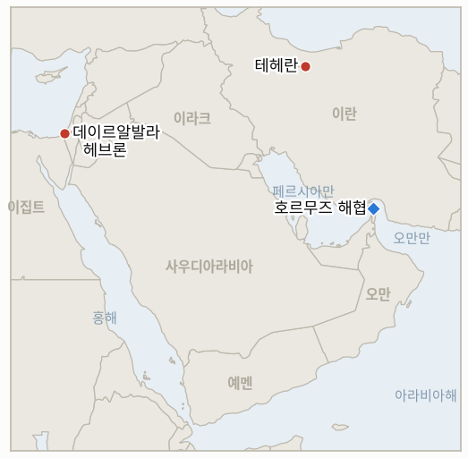

# 중동 일일 브리핑

**2026년 8월 25일**

- **보고 기간:** 약 24시간, 8월 24일 09:00 ~ 8월 25일 09:00 (한국시간)
- **종합 평가:** 월요일, 이 원장이 8월 중순부터 기다려온 실체가 마침내 드러났다. 스콧 베선트 재무장관이 오랫동안 예고해온 "이코노믹 D데이"가 "이코노믹 아웃캐스트 작전"이라는 이름으로 실제로 공개됐으며, 이는 기존의 석유·해운 봉쇄를 반복하는 데 그치지 않고 디지털 자산, 금, 항공, 기술 분야로 제재 대상을 실질적으로 확대한 조치로, IND-20260821-1이 자체 시한보다 앞서 확증으로 확정됐다. 이란의 대응은 군사 행동이 아니라 수사와 절차 수준에 머물렀다. 최고국가안보회의 사무총장 모흐센 레자에이는 걸프 국가가 제재에 동참하면 "단 한 방울의 석유도 이 지역을 떠나지 못할 것"이라고 거듭 위협했고, 이란의 국영 해상 당국은 통행 규정을 위반하는 선박에 벌금·나포 조치를 경고했으며, 이란 의회 국가안보위원회는 오랫동안 논의돼온 호르무즈 통행료 법 제3조를 통과시켰으나 전체 의회 통과에는 아직 이르지 못했다. 유가는 오히려 하락해 브렌트유는 2.5% 내린 92.06달러, WTI유는 2.15% 내린 85.19달러를 기록했는데, 시장은 유예 기간을 둔 단계적 시행 방식을 "D데이"라는 극단적 표현에 비해 온건한 조치로 해석했다. 서울 증시는 완전히 별개의 흐름을 탔다. 코스피는 3.12% 하락한 6,696.96으로 마감해 몇 주 만에 최대 낙폭을 기록했는데, 이는 투자자들이 삼성전자의 90조~110조 원 규모 사상 최대 주주환원 계획을 재평가하며 SK하이닉스의 자사주 매입·소각 프로그램에 비해 단기적 구체성이 부족하다고 판단한 데 따른 것으로, 이란이나 유가와는 무관한 삼성 고유의 실망감이었다. 원화는 오히려 1,382.4원으로 강세를 보였다. 가자지구에서는 이스라엘 공습으로 칸유니스의 10세 소녀와 부레이지의 4세 남아를 포함해 최소 2명의 어린이가 추가로 사망했으며, 별도의 공습은 이스라엘군이 모스크 내부에 은닉된 하마스 무기 저장고로 지목한 시설과 셰이크 라드완 지역 해수담수화 플랜트 인근 부지를 타격했다. 이는 일요일 "공습 강화" 위협 이후 처음 나온 구체적 사례이지만, 실제 사망자와 표적이 연 발사와 직접 결부됐다는 증거는 없어 휴전 체제 아래 계속돼온 "즉각적 위협" 표적 작전의 익숙한 패턴에 더 가깝다. 서안지구에서는 이스라엘 경찰이 61세 절단 장애인 셰이크 사이드 알아무르를 마사페르 야타에서 쇠파이프로 폭행한 혐의로 10대 정착민 1명을, 이를 촬영한 혐의로 다른 1명을 체포했다. 이는 8월 중순 이후 이 원장이 추적해온, 정착민 용의자는 좀처럼 체포되지 않는 패턴에서 벗어난 이례적인 집행 사례다.

---

## 1. 오늘의 주요 사건

<figure style="float:right; width:46%; margin:2pt 0 8pt 14pt;">

<figcaption style="font-size:8pt; color:#666; text-align:center; margin-top:3pt; font-style:italic;">주요 논의 지점</figcaption>
</figure>

### 1.1 베선트, "이코노믹 아웃캐스트 작전" 공개하며 이란은 호르무즈 나포 위협하고 통행료 법안 진전

스콧 베선트 재무장관은 트럼프가 "이코노믹 D데이"라 명명했던 제재 패키지를 "이코노믹 아웃캐스트 작전"이라는 이름으로 공식 공개하며 "우리는 전 세계에 걸친 이란의 금융 연결망에 대한 경제적 공세를 시작한다"고 밝혔고 "새벽과 함께 이코노믹 D데이가 시작된다"고 말했다([Axios](https://www.axios.com/2026/08/24/bessent-dday-iran-secondary-sanctions); [CBS 뉴스](https://www.cbsnews.com/news/bessent-press-conference-iran-sanctions-economic-d-day/)). 미 재무부 해외자산통제국(OFAC)은 개인·단체·선박 약 60건을 제재 대상에 올렸고, 디지털 자산·금·항공·기술·해운 등 5개 분야에 새로운 2차 제재 결정을 내렸으며, 이란 멜리은행을 특정해 지목하고 일부 송금 및 이란의 미국 학술·문화 접근을 허용해온 일반 허가를 정지시켰다([재무부 보도자료](https://home.treasury.gov/news/press-releases/sb0613)). 즉각적인 전면 시행 대신 베선트는 "모두에게 잘못된 행동을 시정할 기회를 주고 있다"며 유예 기간을 둔 단계적 접근을 설명했고, 이번 주말까지 대형 금융기관 한 곳이 제재 대상으로 지정될 것이라 예고했다. 제재 전문가 브렛 에릭슨은 CBS와의 인터뷰에서 이란산 석유 자금을 대는 중국 은행들이 여전히 실질적 표적이 되지 못했다는 점을 지적하며 "이는 이코노믹 D데이가 아니라... 그 중간 어디쯤이었다"고 회의적으로 평가했다. 이란의 대응은 위협과 절차가 결합된 형태였다. 최고국가안보회의 사무총장 모흐센 레자에이는 걸프 국가가 제재에 동참할 경우 적으로 간주하겠다는 경고를 반복하며 호르무즈 해협 오만 측을 통항하는 유조선을 추가로 겨냥해 대응하겠다고 밝히고 "단 한 방울의 석유도 이 지역을 떠나지 못할 것"이라고 경고했으며, 이란 국영 페르시아만 해협청(PGSA)은 별도로 통행 규정을 위반하는 선박이 벌금·나포·몰수 조치에 직면할 수 있다고 경고했다([CNBC](https://www.cnbc.com/2026/08/24/us-iran-war-trump-hormuz-bessent-economic-sanctions-.html)). 별도로 이란 의회 국가안보·외교정책위원회는 하산 카슈카비 위원회 대변인에 따르면 테헤란이 허가한 선박에 통행료를 부과할 수 있도록 하는 호르무즈 안보법 제3조를 통과시켰으나, 법률로 발효되려면 아직 의회 전체 표결을 거쳐야 한다([메르통신](https://en.mehrnews.com/news/247180/Charges-for-services-in-Hormuz-approved-in-Iranian-parliament)). 걸프 국가들은 이번 발표에 대체로 침묵을 지켰다. 지난주 이란과의 교역을 중단한 UAE는 단계적으로 유사한 제한 조치를 병행할 준비를 하고 있다고 전해졌으나, 사우디아라비아는 보고 기간 중 공식 입장을 내지 않았다. **신뢰도: 높음** — 제재 패키지의 내용, 레자에이와 PGSA의 발언, 의회 위원회 표결(1~2등급, 재무부 보도자료·Axios·CBS·CNBC·메르통신, 실명 인용, 다수 매체). **신뢰도: 중간** — 예고된 유예 기간과 중국 은행 문제가 미해결로 남은 점을 고려할 때 신규 분야가 실제로 얼마나 실질적으로 집행될지는 불확실하다.

### 1.2 삼성전자 주주환원 실망감이 코스피 몇 주 만의 최대 낙폭 견인

코스피는 3.12%(-215.99포인트) 하락한 6,696.96으로 마감해 8월 중순 변동성 이후 하루 낙폭으로는 가장 컸으며, 삼성전자 주가는 8.70% 급락한 반면 지난주 자체 자사주 매입·소각 프로그램을 발표한 SK하이닉스는 -3.41%로 상대적으로 선방했다([서울경제신문](https://en.sedaily.com/finance/2026/08/24/kospi-falls-312-percent-to-close-at-669696); [코리아타임스](https://www.koreatimes.co.kr/economy/others/20260824/kospi-plunges-more-than-3-as-samsung-sk-hynix-shares-tumble)). 이번 매도세의 배경은 금요일 발표된 90조~110조 원(약 650억~795억 달러) 규모의 사상 최대 삼성전자 주주환원 계획을 투자자들이 다시 들여다보며 단기적 실행 방안이 부족하다고 판단한 데 있다. 회사는 3분기에 약 30조 원의 현금 배당을 확정했지만, 나머지 규모와 배당·자사주 매입 간 배분은 연간 실적이 확정되는 2027년 1월 이사회로 미뤄, 즉각 실행되는 SK하이닉스의 매입·소각 방식에 비해 단기 주가 지지력이 떨어진다고 투자자들은 평가했다. 외국인 투자자는 3조 6,900억 원, 기관은 1조 2,900억 원 순매도했으며, 개인 투자자가 3조 3,200억 원을 순매수하며 낙폭을 일부 방어했다. 그럼에도 원화는 1,382.4원으로 4.1원 강세를 보이며 주식시장 매도세와는 별개로 움직였다. 두 매체 모두 이번 하락을 이란 제재나 유가와 연결짓지 않았다는 점도 주목할 만한데, 이는 1.1항의 호르무즈 관련 사건과 완전히 별개로 같은 거래일에 진행된 삼성 고유의 촉매임을 보여준다. **신뢰도: 높음** — 지수 수준, 종목별 등락, 매매 동향(1~2등급, 서울경제신문·코리아타임스, 거래소 공식 자료). **신뢰도: 중간** — 이번 실망감이 하락을 온전히 설명하는지, 아니면 5거래일 연속 상승 이후의 광범위한 차익 실현이 더 큰 요인인지는 불확실하다.

### 1.3 이스라엘 공습으로 가자지구 어린이 2명 추가 사망, 일요일 연 발사 위협 첫 시험대에

월요일 이스라엘군의 사격으로 팔레스타인 어린이 최소 2명이 추가로 사망했다. 칸유니스에서는 텐트 안에서 식사 중이던 10세 소녀 아말 아부 카터가 총격에 숨졌고, 부레이지 난민촌에서는 가옥에 대한 공습으로 4세 남아가 사망했으며, 별도의 칸유니스 도로 공습과 앞서 있었던 데이르알발라 텐트 공습에서도 추가 사망자가 보도됐다([아랍뉴스](https://www.arabnews.com/node/2655726/middle-east), 로이터·가자 보건당국 인용). 이스라엘군은 "10세 소녀와 관련된 사건은 인지하지 못하고 있다"고 밝혔고, 데이르알발라 공습에 대해서는 "하마스 조직원을 표적으로 했다"고 밝혔을 뿐 칸유니스와 부레이지의 사망에 대해서는 직접 언급하지 않았다. 별도로 이스라엘군과 신베트는 가자시티의 샤티와 데이르알발라 지역 모스크 내부에 은닉된 하마스 무기 저장고 2곳을 타격했다고 밝혔으며, 주민들과 하마스 측은 물 부족이 계속되는 가자시티 셰이크 라드완 지역의 해수담수화 플랜트도 공습을 받았다고 전했다. 이스라엘군 대변인은 타격 지점 중 하나가 해수담수화 플랜트에 "인접"해 있었다고만 밝히고 시설 피해 여부는 확인도 부인도 하지 않았다([타임스 오브 이스라엘 라이브블로그](https://www.timesofisrael.com/liveblog_entry/idf-says-it-strikes-weapons-depot-in-gaza-city-as-mosque-desalination-plant-reportedly-hit/)). 이번 공습은 네타냐후·카츠가 가자지구 연 발사에 대해 "공습 강화"를 경고한 지 하루 만에 나온 것이지만(8월 24일자 브리핑 §1.3), 월요일 보도 중 어느 것도 이번 사망이나 표적을 연 발사와 결부짓지 않으며, 오히려 휴전 이후 계속돼온 "즉각적 위협" 표적 작전이라는 익숙한 패턴에 가깝다. IND-20260824-2는 연 발사와 명확히 결부된 문서화된 확전이 확인될 때까지 계속 진행 상태로 남는다. 가자지구 보건당국은 10월 휴전 발효 이후 이스라엘 공습으로 사망한 팔레스타인인이 1,280명을 넘어섰다고 밝혔다. **신뢰도: 높음** — 사망자와 공습 위치(1~2등급, 아랍뉴스·로이터, 타임스 오브 이스라엘, 가자 보건당국·현장 목격자, 다수 매체). **신뢰도: 중간** — 이스라엘군이 밝힌 표적 근거는 군 자체 설명에만 의존하며, 세 건의 사망 중 두 건에 대해서는 답변을 하지 않았다.

### 1.4 마사페르 야타 절단 장애인 폭행에서 이례적 정착민 체포, 변함없는 폭력 양상과 대비

이스라엘 경찰은 이스라엘 청소년 2명을 체포했다. 헤브론 인근 정착촌 아비가일 출신 16세는 서안지구 남부 마사페르 야타 인근 키르베트 알라키즈에서 61세 팔레스타인 절단 장애인 셰이크 사이드 알아무르를 자택 밖에서 쇠파이프로 폭행한 혐의를, 17세는 이를 촬영한 혐의를 받는다. 알아무르는 2025년 4월 정착민과의 충돌에서 다리를 잃은 바 있다([아랍뉴스](https://www.arabnews.com/node/2655683/middle-east); [타임스 오브 이스라엘 라이브블로그](https://www.timesofisrael.com/liveblog_entry/two-teens-arrested-over-attack-on-palestinian-amputee/)). 16세는 법원 심리를 앞두고 구금 상태를 유지했고, 17세는 가택연금으로 석방됐다. 이번 체포는 이 원장이 일요일자 브리핑(§1.4, §2.4)에서 지적한 패턴, 즉 이스라엘의 집행이 팔레스타인인에게 비대칭적으로 작동하는 반면 정착민 용의자는 대체로 체포를 면해온 패턴에서 진정으로 벗어난 사례다. 다만 단일 사건만으로 지속적인 변화가 확립됐다고 보기는 이르다. IND-20260823-2(이스라엘군의 서안지구 "경계선" 경고, 시한 9월 6일)와 IND-20260819-2(카츠의 경찰 이양 일정, 시한 9월 1일)는 모두 이번 체포가 고립된 사례인지 아니면 패턴의 시작인지를 직접 시험하는 지표로 계속 진행 상태다. **신뢰도: 높음** — 폭행 사건, 피해자 신원, 체포(1~2등급, 아랍뉴스, 타임스 오브 이스라엘 라이브블로그, 실명 경찰 발표, 다수 매체). **신뢰도: 중간** — 이번 사건이 더 넓은 집행 관행의 변화를 신호하는지는 불확실하다.

---

## 2. 심층 분석: 유인과 동기

### 2.1 베선트는 왜 트럼프 자신의 "D데이" 표현과 달리 유예 기간과 지연된 시행을 둔 형태로 제재를 설계했는가?

단계적 시행 방식은 워싱턴이 발표 규모(약 60건 지정, 5개 신규 분야)에 대한 공로를 주장하면서도 중국 은행이 여전히 손대지 않은 상태에서 모든 교역국에게 즉시 편을 선택하도록 강요할 때 따르는 즉각적인 외교적·시장적 비용은 피할 수 있게 해주기 때문이다. "모두에게 잘못된 행동을 시정할 기회"를 준다는 표현은 워싱턴이 가장 파괴적인 선택지를 실제로 실행에 옮기기 전에 위협 자체만으로 걸프와 아시아의 행동을 바꿀 수 있는지 지켜볼 시간을 벌어주며, 이는 "D데이"라는 표현이 암시한 즉각적 단절이 아니라 계산된 단계적 확전이다.

### 2.2 이란은 왜 제재 발표에 대해 해협 내 즉각적인 군사 행동이 아니라 의회 통행료 법안과 수사적 위협으로 대응했는가?

테헤란 자신의 즉각적 군사 확전 능력은 미 해군의 봉쇄 집행에 직접 맞서 시험한 적이 없는 실질적 비용을 수반하기 때문이다(IND-20260812-1은 오늘까지 이란의 군사 대응 없이 진행 상태로 남아 있다). 레자에이의 극단적 수사와 절차적으로 더딘 통행료 법안을 함께 내세우는 것은 자국의 강경파 지지층과 흔들리는 걸프 이웃국에 결의를 신호하는 동시에, 실제 위력이 아직 나타나지도 않은 제재에 즉시 소진하기보다는 선택적으로 발동할 수 있는 공식 통행료 제도라는 실질적 지렛대를 아껴두는 방식이다.

### 2.3 코스피는 왜 사흘 전 나온 삼성 발표에 즉각 반응하지 않고 뒤늦게 급락했는가?

금요일의 초기 반응은 투자자들이 그 구조를 완전히 파악하기 전에 사상 최대라는 헤드라인 수치를 먼저 가격에 반영했기 때문이며, 주말과 월요일 거래를 거치면서 이미 실행 중인 SK하이닉스의 자사주 매입과 대비되는 2027년 1월로의 세부 이연이 헤드라인 수치가 암시했던 만큼의 단기 주당순이익 지지력을 실질적으로 약화시킨다는 점을 시장이 뒤늦게 인식했기 때문이다. 이는 새로운 정보에 대한 반응이라기보다 구조에 대한 재평가다.

### 2.4 연 발사에 대해 공개적으로 확전을 위협한 다음 날에도 어린이를 포함한 이스라엘 공습 사망이 같은 속도로 계속되는데, 둘 사이에 가시적 연관은 왜 없는가?

연 발사 위협과 월요일 사망을 낳은 "즉각적 위협" 표적 체계는 서로 다른 제도적 궤도에서 작동하기 때문이다. 하나는 하마스가 저강도 도발을 용인하는 데 대한 억지력 신호이고, 다른 하나는 휴전 이후 어느 하루의 수사와 무관하게 계속돼온 실질적 작전 표적 과정이다. 따라서 월요일에 연과 직접 결부된 공습이 문서화되지 않았다는 사실이 위협이 공허했다는 증거는 아니며, 단지 이날의 표적 활동이 새로 예고된 궤도가 아니라 기존의 궤도를 따랐을 뿐임을 뜻한다.

### 2.5 정착민 폭력이 대체로 기소되지 않아온 상황에서 이스라엘 경찰은 왜 이번 사건에서는 정착민 용의자를 체포했는가?

이미 정착민 폭력으로 다리를 잃은 61세 절단 장애인에 대한 문서화되고 촬영된 폭행이라는 이번 사건 특유의 여론 노출도가, 쿠스라 사태에 대한 유엔·프랑스·스페인·영국의 비판과 정착민 폭력을 공개적으로 규탄하라는 백악관의 대네타냐후 압박 보도까지 겹치면서 이번 사건을 기소하지 않고 넘기기에는 유난히 비용이 큰 사안으로 만들었기 때문이다. 반면 덜 문서화되고 덜 동정을 받는 피해자를 대상으로 한 훨씬 더 많은 수의 공격은 8월 중순 이후 이 원장이 추적해온 같은 집행 공백에 계속 놓여 있다.

---

## 3. 한국에 대한 정책적 함의

### 3.1 익스포저 현황

| 항목 | 현재 수치 | 출처 |
| --- | --- | --- |
| 원유 수입 중 중동산 비중 | 48.5%(2026년 5~7월), 전년 동기 69.1%에서 하락; 비중동산 비중이 사상 처음 50% 상회 | KNOC, 아시아경제 인용; `korea-exposure.md` |
| 7~8월 원유 도입 | 전년 동기 대비 110% 이상 확보(산업통상부, 7월 21일); 전략비축유 스와프 8월까지 연장, 현재까지 약 2,100만 배럴 스와프 | 산업통상부, 헤럴드경제·한경 인용; `korea-exposure.md` |
| 9월 원유 도입 | 90% 이상 확보(산업통상부, 7월 21일) | 산업통상부, 헤럴드경제 인용; `korea-exposure.md` |
| 홍해 우회 항로 | 한국행 원유 화물은 얀부·홍해 우회로를 계속 이용; 얀부에서 한국을 포함한 아시아 매수처로의 수출이 1년 전 하루 100만 배럴 미만에서 약 400만 배럴로 급증 | 로이즈리스트 인텔리전스; `korea-exposure.md` |
| 전략비축유 커버리지 | 실제 소비 기준 약 26일분(추정); 스와프는 즉시 대기 상태이나 대규모 실행은 검증되지 않음 | CSIS; 산업통상부 7월 27일 |
| 정유사 사우디 지분 익스포저 | S-Oil(사우디 아람코 지분 약 63%), HD현대오일뱅크(아람코 지분 약 17%) | 공시 자료; `korea-exposure.md` |
| 브렌트유/WTI유 | 월요일 종가 92.06달러(-2.5%)/85.19달러(-2.15%), 엿새 연속 상승세 종료, 시장은 제재 발표를 극단적 예상보다 온건하다고 해석 | TradingEconomics; CNBC |
| 코스피/원달러 | 코스피 -3.12%로 6,696.96 마감, 삼성전자 주주환원 실망감이 원인; 원화는 4.1원 강세로 1,382.4원, 주식 매도세와 분리된 흐름 | 서울경제신문; 코리아타임스 |
| 호르무즈 통항량 | 보고 기간 중 신규 로이터/클플러 발표 없음; 마지막 확인치는 목요일 8월 20일 7척으로 아이란와이어가 "역대 최저"라 평가 | 로이터, 클플러 인용; 아이란와이어 |

### 3.2 사안별 함의

**베선트의 제재 발표는 8월 중순부터 이 원장이 추적해온 질문에 마침내 답을 내놓았으며, 한국 정책 입안자에게 주는 답은 반복이 아니라 실질적 확대다. 디지털 자산·금·항공·기술 분야의 새로운 2차 제재가 기존의 석유·해운 봉쇄와 나란히 놓이면서, 에너지뿐 아니라 이들 분야에 걸쳐 있는 한국 기업이나 금융 거래 상대방도 이제 이를 심사해야 한다.** IND-20260821-1은 자체 시한인 8월 26일보다 앞서 오늘 확증으로 확정되는데, 발표 내용이 이미 확인됐기 때문이다. 신규 IND-20260825-1은 베선트가 예고한 "대형 금융기관" 지정이 실제로 이번 주 안에 이뤄지는지를 추적하며, 이는 이번 캠페인의 이행 여부를 판가름할 구체적인 단기 시험대다.

**제재가 실제로 발표된 날 유가가 2.5%, 2.15% 하락한 것은 단순한 확전 논리가 예측했을 방향과 정반대이며, 한국 원유 도입 담당자에게는 오히려 더 유의미한 신호다. 시장은 유예 기간을 둔 단계적 구조가 걸프·아시아향 원유 흐름을 단기적으로 크게 흔들지 않을 것으로 가격에 반영하고 있으며, 이는 보고 기간 중 별다른 차질 없이 전년 대비 110% 이상으로 진행 중인 한국의 7~8월 도입 실적과도 부합한다.** 아직 전체 의회 통과에는 이르지 못한 이란의 통행료 법안 위원회 표결은, 이 원장이 IND-20260814-1의 반증으로 추적해온 통행료 문제를 절차적으로 계속 살아 있게 하지만 아직 한국 해운·보험업계가 가격에 반영해야 할 실제 부과로 이어지지는 않았다. 신규 IND-20260825-2는 이 트랙과 무관하게 아래의 서안지구 사안과 짝을 이루지만, IND-20260816-3(이란-오만 해상교통지도 서명)이 통행 조건이 실제로 확정되는지를 판단할 더 직접적인 시험대로 계속 남는다.

**삼성발 코스피 하락은 이란이나 유가와 아무런 연관이 없으며, 한국 증시 변동성이 이제 중동 리스크 프리미엄과 국내 반도체 업종 고유의 촉매라는 최소 두 개의 독립된 궤도에서 동시에 작동하고 있음을 확인시킨다. 한국 정책 입안자와 투자자는 이를 단일한 지정학적 리스크 신호로 뭉뚱그리지 말고 분리해서 봐야 한다.** IND-20260820-2(지난주 코스피 반등이 온전히 한 주를 버티는지, 시한 8월 27일)는 오늘의 하락으로 직접 복잡해졌으며, 이번 하락이 하루짜리 조정인지 아니면 새로운 하락세의 시작인지를 판단할 지표로 계속 남는다.

**가자지구의 계속되는 치명적 공습과 서안지구의 이례적인 정착민 체포는 한국 시장에 직접적인 통로가 없지만, 둘 다 휴전과 서안지구 집행 체계가 책임성 쪽으로 움직이고 있는지 아니면 여전히 일방적 재량에 머물러 있는지를 판단하는 이 원장의 지속적인 평가를 시험하며, 이는 한국 정책 입안자가 더 넓은 중동 리스크 프리미엄을 추적할 때 계속 고려해야 할 일반적인 지역 안정성 신호다.** IND-20260824-2(연 발사 관련 공습 강도 시험, 시한 8월 30일)와 신규 IND-20260825-2(마사페르 야타 체포가 지속적인 집행 전환을 의미하는지, 아니면 고립된 사례로 남는지, IND-20260823-2·IND-20260819-2와 연계)가 모두 계속 지켜볼 시험대다.

**검증 가능한 지표:**

- **IND-20260825-1** — 베선트 재무장관이 "이번 주말까지" 대형 금융기관을 제재하겠다고 예고한 약속이 실제 지정으로 이어지는지, 아니면 한 주가 지나도록 지정이 이뤄지지 않는지를 검증한다. 약 2026년 8월 29일까지 이코노믹 아웃캐스트 작전 하에 특정 금융기관이 제재 대상으로 지정되면 이행이 확정으로 확인되며, 같은 기한까지 그러한 지정이 없으면 이행되지 않은 메시지에 그쳤음이 반증으로 확정된다.
- **IND-20260825-2** — 마사페르 야타 절단 장애인 폭행 사건의 체포가 정착민 폭력에 대한 지속적인 집행 패턴의 시작을 의미하는지, 아니면 이 사건이 고립된 예외로 남고 더 넓은 무처벌 패턴이 변화 없이 지속되는지를 검증한다. 약 2026년 9월 8일까지 별도의 폭력 사건에서 추가적인 정착민 체포나 기소가 확인되면 지속적인 집행 전환이 확정되며, 같은 기한까지 문서화된 공격에 체포가 없는 이전 패턴으로 돌아가면 고립된 사례였음이 반증으로 확정된다.

---

## 4. 관찰 목록

- **미 해군의 물리적 봉쇄 집행이나 이란이 위협한 "정밀 타격"이 실제 미이란 군사 충돌로 이어지는지** (IND-20260812-1, 시한 8월 26일).
- **가자지구 선무장해제 우선 틀이 어떤 형태로든 이스라엘 안보내각 공식 표결에 도달하는지** (IND-20260812-4, 시한 8월 26일).
- **쿠스라 정착민 전초기지 철거가 재진입 없이 지속되어 지표의 철거 기준을 완전히 충족하는지** (IND-20260813-3, 시한 8월 27일).
- **한국 코스피가 오늘 3.12% 하락 이후 온전히 한 주를 버티는지, 아니면 지난주 급락 패턴이 재현되는지** (IND-20260820-2, 시한 8월 27일).
- **쿠스라 식량·의료품 부족이 이스라엘의 개입을 이끌어내는지, 아니면 공식화된 위기로 굳어지는지** (IND-20260821-2, 시한 8월 28일).
- **이스라엘의 연 발사 "공습 강화" 위협이 연과 명확히 결부된 확전으로 전환되는지, 아니면 기존 표적 활동과 구분되지 않는 채로 남는지** (IND-20260824-2, 시한 8월 30일).
- **8월 15일 헤즈볼라-이스라엘 교전이 추가 라운드로 이어지는지, 아니면 양측이 휴전 후 균형으로 돌아가는지** (IND-20260816-1, 시한 8월 29일).
- **가자지구 옐로라인 사건이 공식적인 이스라엘군 작전 대응을 촉발하는지, 아니면 고립된 사건으로 남는지** (IND-20260816-2, 시한 8월 30일).
- **예멘의 확인된 확산이 새로운 국제 중재를 이끌어내는지** (IND-20260817-1, 시한 8월 31일).
- **트럼프의 호르무즈 미국 영토화 의지가 반복된 수사를 넘어 구체적인 정책 조치로 이어지는지** (IND-20260817-2, 시한 8월 31일).
- **이스라엘의 준비된 알리 알타헤르 능선 작전이 실제로 개시되는지** (IND-20260818-2, 시한 8월 31일).
- **9월 1일로 잠정 예정된 로마 트랙 8차 회담이 진행되는지** (IND-20260807-2, 시한 9월 1일).
- **트럼프의 오만 폭격 위협이 실제 외교적·군사적 결과로 이어지는지** (IND-20260818-1, 시한 9월 1일).
- **후티가 주장한 모카 인근 사우디 해군 함정 공격이 확인되거나 사우디의 직접 대응을 이끌어내는지** (IND-20260818-3, 시한 9월 1일).
- **카츠의 조율되지 않은 서안지구 경찰 이양이 진행되는지, 지연되는지, 저지되는지** (IND-20260819-2, 시한 9월 1일).
- **미노안 디그니티호에 대한 치명적 공격의 배후가 결국 규명되거나 군사적 대응을 이끌어내는지** (IND-20260819-1, 시한 9월 2일).
- **운영 개시일이 명시된 서명된 이란-오만 호르무즈 공동성명이 도출되는지, 이란 의회가 통행료 법안을 전체 통과시키는지** (IND-20260816-3, 시한 9월 5일).
- **아부 알두후르 공습을 둘러싼 튀르키예-이스라엘 마찰이 확대되는지, 아니면 흡수되는지** (IND-20260823-1, 시한 9월 6일).
- **이스라엘군의 서안지구 "경계선" 경고 이후 실제로 폭력 양상의 단계적 변화가 뒤따르는지** (IND-20260823-2, 시한 9월 6일).
- **배럭의 연이은 논란이 실제 미국의 정책적·인사적 결과로 이어지는지** (IND-20260824-1, 시한 9월 6일).
- **베선트 제재 패키지가 예고한 금융기관 지정이 이번 주 안에 이뤄지는지** (IND-20260825-1, 시한 8월 29일).
- **마사페르 야타 체포가 지속적인 정착민 집행 전환을 의미하는지, 아니면 고립된 사례로 남는지** (IND-20260825-2, 시한 9월 8일).
- **시리아의 아사드 시대 핵물질 사안이 최종 합의와 검증된 반출로 이어지는지** (IND-20260812-2, 시한 9월 11일).
- **서안지구 군에서 경찰로의 집행 이양이 정착민 폭력을 줄이는지, 아니면 변화 없이 유지되는지** (IND-20260815-2, 시한 9월 12일).
- **시리아가 이란의 경고에도 불구하고 레바논 내 헤즈볼라에 대해 군사적 조치를 취하는지, 아니면 대치가 수사에 그치는지** (IND-20260815-3, 시한 9월 15일).
- **케인 의원의 오만 관련 전쟁권한 결의안이 9월 상원 복귀 시 표결에서 통과·부결되는지, 아니면 아예 상정되지 않는지** (IND-20260819-3, 시한 9월 25일).
- **예멘 전투가 보고 기간 중 뚜렷한 새 사건 없이 지속된 가운데, 새로운 확전 계기가 나타나는지 아니면 타이즈·마리브 전선의 현재 소모전 양상에 정착하는지.**
- **캐롤라인 베젠기호 유출 사고가 인양 작업 개시 이후 봉쇄됐는지.**
- **케슘섬 폭발이 실제 공격으로 확인되거나 오경보로 종결되는지.**

---

## 5. 출처 신뢰도 요약

| 주장 | 출처 | 신뢰도 |
| --- | --- | --- |
| 베선트, "이코노믹 아웃캐스트 작전" 공개; OFAC 약 60건 제재 지정; 신규 분야 결정; 유예 기간을 둔 단계적 시행 | 재무부 보도자료, Axios, CBS 뉴스, NPR(1등급, 실명, 공식 문서, 다수 매체) | 높음 |
| 레자에이의 호르무즈 "석유 한 방울도" 위협; PGSA 통항 나포 경고 | CNBC(1등급, 실명 최고국가안보회의 사무총장 발언, 국영 해상 당국 발표) | 높음 |
| 이란 의회 위원회, 호르무즈 통행료 법안 제3조 통과 | 메르통신, TRT월드, 이란인터내셔널(2~3등급, 실명 위원회 대변인 발표, 국영·국제 매체) | 높음 |
| 브렌트유·WTI유 종가 및 하락률 | TradingEconomics, CNBC, 포춘(1~2등급, 시장 데이터, 다수 매체) | 높음 |
| 코스피 종가, 삼성전자·SK하이닉스 등락, 투자자 매매 동향 | 서울경제신문, 코리아타임스, 아시아경제(1~2등급, 거래소 자료, 실명 보도) | 높음 |
| 원달러 환율 종가 | TradingEconomics(1등급, 시장 데이터) | 중간, 두 번째 한국 매체로 교차 확인되지 않은 단일 출처 수치 |
| 이스라엘 공습으로 칸유니스·부레이지에서 어린이 사망; 이스라엘군 대응 | 아랍뉴스(로이터·가자 보건당국 인용), 타임스 오브 이스라엘 라이브블로그(1~2등급, 현장 보도, 공식 소식통, 다수 매체) | 사망자 수는 높음; 이스라엘군의 표적 근거는 중간 |
| 모스크 무기 저장고 타격, 가자시티 해수담수화 플랜트 인근 공습 | 타임스 오브 이스라엘 라이브블로그, 알자지라(1~2등급, 이스라엘군 발표 및 주민·하마스 진술, 다수 매체) | 공습 발생은 높음; 담수화 시설 피해 정도는 중간 |
| 마사페르 야타 절단 장애인 폭행과 정착민 체포 | 아랍뉴스, 타임스 오브 이스라엘 라이브블로그, 라프레세(1~2등급, 실명 경찰 발표, 다수 매체) | 높음 |
