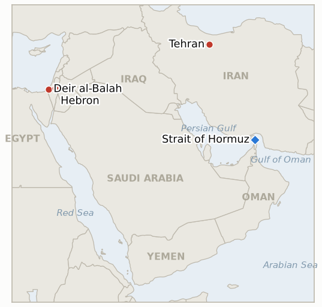

# Middle East Daily Briefing

**August 25, 2026**

- **Reporting window:** ~24 hours, August 24, 09:00 to August 25, 09:00 KST
- **Overall assessment:** Monday delivered the substance this ledger has been waiting on since mid-August: Treasury Secretary Scott Bessent's long-promised "economic D-Day" arrived as "Operation Economic Outcast," a sanctions campaign that genuinely expands the target list into digital assets, gold, aviation and technology sectors rather than reiterating the existing oil-and-shipping blockade, resolving IND-20260821-1 confirmed even before its own deadline. Iran's response stayed rhetorical and procedural rather than kinetic: SNSC secretary Mohsen Rezaei repeated his warning that "not even a single drop of oil will leave the region" if Gulf states join the sanctions, Iran's state maritime authority threatened fines and seizure for transit-rule violators, and parliament's national security committee advanced Article 3 of the long-discussed Hormuz transit-fee law, still short of full parliamentary passage. Oil actually eased on the news, Brent down 2.5% to $92.06 and WTI off 2.15% to $85.19, as traders read the phased, cure-period rollout as short of the maximalist "D-Day" framing. Seoul's own market story ran on an entirely separate track: KOSPI fell 3.12% to 6,696.96, its sharpest drop in weeks, as investors digested Samsung Electronics' record 90 to 110 trillion won shareholder-return plan and found it thinner on near-term specifics than SK Hynix's buyback-and-cancel program, a Samsung-specific disappointment with no Iran or oil linkage; the won still firmed to 1,382.4. In Gaza, Israeli strikes killed at least two more children, a 10-year-old girl in Khan Younis and a 4-year-old boy in Bureij, while separate strikes hit sites the IDF said were Hamas weapons caches inside two mosques and adjacent to a Sheikh Radwan desalination plant, the first concrete test of Sunday's threat to "intensify strikes" over Gaza's kite launches, though the strikes themselves track the ceasefire's familiar pattern of lethal "immediate threat" targeting rather than a documented kite-specific escalation. In the West Bank, Israeli police arrested two teenage settlers, one for beating 61-year-old amputee Sheikh Saeed al-Amour with a pipe in Masafer Yatta and one for filming it, a rare instance of enforcement against settler suspects that stands out against an otherwise unchanged pattern of violence and impunity this ledger has tracked since mid-August.

---

## 1. What Happened

<figure style="float:right; width:46%; margin:2pt 0 8pt 14pt;">

<figcaption style="font-size:8pt; color:#666; text-align:center; margin-top:3pt; font-style:italic;">Major places of discussion</figcaption>
</figure>

### 1.1 Bessent Unveils "Operation Economic Outcast" as Iran Threatens Hormuz Seizures and Advances a Transit Fee Bill

Treasury Secretary Scott Bessent formally unveiled the sanctions package Trump had branded an "ECONOMIC D-DAY," dubbed "Operation Economic Outcast," declaring "we are launching an economic onslaught against Iran's financial connections around the globe" and that "at dawn begins an economic D-Day" ([Axios](https://www.axios.com/2026/08/24/bessent-dday-iran-secondary-sanctions); [CBS News](https://www.cbsnews.com/news/bessent-press-conference-iran-sanctions-economic-d-day/)). The Treasury Department's Office of Foreign Assets Control sanctioned nearly 60 people, entities and vessels, issued new secondary-sanctions determinations across five sectors, digital assets, gold, aviation, technology and shipping, named Iran's Bank Melli specifically, and suspended general licenses that had permitted certain remittances and Iranian academic and cultural access to US institutions ([Treasury press release](https://home.treasury.gov/news/press-releases/sb0613)). Rather than immediate blanket enforcement, Bessent described a phased approach with cure periods, saying "we are giving everyone the opportunity to remedy bad behavior," while promising a major financial institution would be designated by the end of the week; sanctions expert Brett Erickson was more skeptical, telling CBS "this was not economic D-Day... it was something in the middle," faulting the package for still not meaningfully targeting Chinese banks financing Iranian oil. Iran's response combined threat and procedure: SNSC secretary Mohsen Rezaei repeated that any Gulf state joining the sanctions would be treated as an enemy and that Iran would respond by further targeting tankers transiting Hormuz's Omani side, warning "not even a single drop of oil will leave the region," while Iran's state-run Persian Gulf Strait Authority separately warned vessels violating its transit rules could face fines, seizure or confiscation ([CNBC](https://www.cnbc.com/2026/08/24/us-iran-war-trump-hormuz-bessent-economic-sanctions-.html)). Separately, parliament's National Security and Foreign Policy Commission approved Article 3 of the Hormuz security law, permitting Tehran to charge fees on vessels it authorizes to transit, per commission spokesman Hassan Qashqavi; the measure still requires full parliamentary passage before becoming law ([Mehr News](https://en.mehrnews.com/news/247180/Charges-for-services-in-Hormuz-approved-in-Iranian-parliament)). Gulf states stayed largely silent on the specific announcement, with the UAE, which halted Iran trade last week, reportedly preparing to phase in parallel restrictions while Saudi Arabia offered no public comment in the window. **Confidence: High** on the sanctions package's content, Rezaei's and the PGSA's statements, and the parliamentary committee vote (Tier 1-2, Treasury press release, Axios, CBS, CNBC, Mehr News, on-record, multi-outlet); Medium on how substantively the new sectors will be enforced given the stated cure periods and the unresolved Chinese-bank question.

### 1.2 Samsung's Shareholder Return Disappointment Drives KOSPI's Sharpest Drop in Weeks

KOSPI fell 3.12% (-215.99 points) to close at 6,696.96, its steepest single-day drop since the mid-August turbulence, as Samsung Electronics shares dropped 8.70% even though SK Hynix, which announced its own buyback-and-cancel program the prior week, held up relatively well at -3.41% ([Seoul Economic Daily](https://en.sedaily.com/finance/2026/08/24/kospi-falls-312-percent-to-close-at-669696); [Korea Times](https://www.koreatimes.co.kr/economy/others/20260824/kospi-plunges-more-than-3-as-samsung-sk-hynix-shares-tumble)). The selloff traces to investors re-reading Friday's record 90 to 110 trillion won ($65 billion to $79.5 billion) Samsung shareholder-return plan and finding it thin on near-term mechanics: the company confirmed roughly 30 trillion won in third-quarter cash dividends but deferred the remaining balance and its allocation between dividends and buybacks to a January 2027 board meeting once full-year results are known, a structure investors judged less immediately supportive than SK Hynix's direct buy-and-cancel approach. Foreign investors sold a net 3.69 trillion won and institutions sold 1.29 trillion won, partially offset by 3.32 trillion won in retail buying; the won nonetheless firmed 4.1 won to 1,382.4 per dollar, decoupling the currency move from the equity selloff. Notably, neither outlet's reporting linked the drop to Iran sanctions or oil prices, a genuinely separate, company-specific catalyst from Section 1.1's Hormuz story running in parallel the same trading day. **Confidence: High** on the index level, sector moves and flow data (Tier 1-2, Seoul Economic Daily, Korea Times, on-record exchange data); Medium on whether the disappointment fully explains the move versus broader profit-taking after five prior sessions of gains.

### 1.3 Israeli Strikes Kill Two More Children in Gaza as Sunday's Kite Threat Meets Its First Test

Israeli fire killed at least two more Palestinian children Monday: 10-year-old Amal Abu Khater, shot while eating in her family's tent in Khan Younis, and a 4-year-old boy killed in an airstrike on a house in the Bureij refugee camp, with additional deaths reported in a separate Khan Younis road strike and an earlier Deir al-Balah tent strike ([Arab News](https://www.arabnews.com/node/2655726/middle-east), citing Reuters and Gaza health officials). The Israeli military said it was "not aware of any incident involving a 10-year-old girl" and, on the Deir al-Balah strike, said it had "targeted a Hamas militant," without directly addressing the Khan Younis or Bureij deaths. Separately, the IDF and Shin Bet said they struck two Hamas weapons-storage facilities established inside mosques in Gaza City's Shati and Deir al-Balah areas, while residents and Hamas said a strike also hit a desalination plant in Gaza City's Sheikh Radwan neighborhood amid an ongoing water shortage; an Israeli military spokesperson said one struck site was "located adjacent to" the desalination facility without confirming or denying damage to it ([Times of Israel liveblog](https://www.timesofisrael.com/liveblog_entry/idf-says-it-strikes-weapons-depot-in-gaza-city-as-mosque-desalination-plant-reportedly-hit/)). The strikes arrive a day after Netanyahu and Katz threatened to "intensify strikes" over Gaza kite launches (brief 2026-08-24, §1.3), but nothing in Monday's reporting ties these specific deaths or targets to the kite episode rather than the ceasefire's familiar pattern of ongoing lethal "immediate threat" targeting; IND-20260824-2 remains open pending a documented, kite-specific escalation. Gaza health officials say more than 1,280 Palestinians have been killed by Israeli strikes since the October ceasefire began. **Confidence: High** on the deaths and strike locations (Tier 1-2, Arab News/Reuters, Times of Israel, Gaza health officials and medics, multi-outlet); Medium on the IDF's stated targeting rationale, since it rests on the army's own uncorroborated account and its response left two of the three named deaths unaddressed.

### 1.4 Rare Settler Arrests in a Masafer Yatta Amputee Assault Stand Out Against an Unchanged Violence Pattern

Israeli police arrested two Israeli teenagers, a 16-year-old from the Hebron-area settlement of Avigayil on suspicion of beating 61-year-old Palestinian amputee Sheikh Saeed al-Amour with a pipe outside his home in Khirbet Al-Rakeez, near Masafer Yatta in the southern West Bank, and a 17-year-old for allegedly filming the assault; al-Amour had lost his leg in an April 2025 clash with settlers ([Arab News](https://www.arabnews.com/node/2655683/middle-east); [Times of Israel liveblog](https://www.timesofisrael.com/liveblog_entry/two-teens-arrested-over-attack-on-palestinian-amputee/)). The 16-year-old was held in custody pending a court hearing while the 17-year-old was released to house arrest. The arrests are a genuine departure from the pattern this ledger flagged as recently as Sunday's brief, that Israeli enforcement runs asymmetrically against Palestinians while settler suspects go largely unarrested (brief 2026-08-24, §1.4, §2.4), though a single case does not yet establish a durable shift; IND-20260823-2 (IDF's West Bank "brink of escalation" warning, deadline September 6) and IND-20260819-2 (Katz's police-handover timeline, deadline September 1) both remain open and directly test whether this arrest is an isolated data point or the start of a pattern. **Confidence: High** on the assault, victim identity, and arrests (Tier 1-2, Arab News, Times of Israel liveblog, on-record police statements, multi-outlet); Medium on whether the case signals any broader change in enforcement practice.

---

## 2. Deep Dive: Incentives and Motives

### 2.1 Why would Bessent structure the sanctions rollout with cure periods and delayed enforcement rather than an immediate maximalist strike, given Trump's own "D-Day" framing?

Because a phased rollout lets Washington claim credit for the announcement's scale (nearly 60 designations, five new sector categories) while avoiding the immediate diplomatic and market cost of forcing every trading partner to choose sides at once, particularly with China's banks still untouched; giving "everyone the opportunity to remedy bad behavior" buys time to see whether the threat alone shifts Gulf and Asian behavior before Washington has to follow through on its most disruptive options, a calibrated escalation rather than the instant rupture the "D-Day" language implied.

### 2.2 Why would Iran respond to a sanctions announcement with a parliamentary fee bill and rhetorical threats rather than an immediate operational move in the strait?

Because Tehran's own capacity for immediate kinetic escalation carries real costs it has avoided testing directly against the US Navy's blockade enforcement (IND-20260812-1 remains open with no Iranian military response through today), so pairing Rezaei's maximalist rhetoric with the more modest, procedurally slow transit-fee legislation lets Iran signal resolve to its own hardline base and to wavering Gulf neighbors while keeping its actual leverage, a formal toll regime it can invoke selectively, in reserve rather than spending it immediately in response to sanctions whose real bite has not yet arrived.

### 2.3 Why would KOSPI fall sharply on a Samsung announcement made three trading days earlier rather than reacting immediately on the day of the news?

Because the initial Friday reaction priced in the headline record-return figure before investors had fully modeled its structure, and it took the intervening weekend and Monday's trading session for the market to register that the January 2027 deferral of the plan's remaining details, in contrast to SK Hynix's already-executing buyback, meaningfully reduces the near-term earnings-per-share support the headline number implied, a re-rating on structure rather than a reaction to new information.

### 2.4 Why would Israeli strikes killing children continue at the same pace the day after a public threat to escalate specifically over kites, without any visible connection between the two?

Because the kite-launch threat and the "immediate threat" targeting regime that produced Monday's deaths operate on separate institutional tracks, one a public deterrence signal aimed at Hamas's tolerance of low-level provocations, the other an ongoing operational targeting process that has continued at pace since the ceasefire regardless of any single day's rhetoric, so the absence of a documented kite-specific strike by Monday is not evidence the threat was empty, only that this particular day's targeting ran on its usual track rather than the newly announced one.

### 2.5 Why would Israeli police arrest settler suspects in this specific case when the broader pattern has left settler violence largely unprosecuted?

Because the case's specific optics, a documented, filmed assault on a 61-year-old amputee who had already lost a limb to prior settler violence, combined with mounting international pressure (the UN, France, Spain, and the UK's condemnations over Qusra, and reported White House pressure on Netanyahu to publicly denounce settler violence) made this an unusually costly incident to leave unprosecuted, while the far larger number of less-documented attacks against less sympathetic victims continues to face the same enforcement gap this ledger has tracked since mid-August.

---

## 3. Policy Implications for South Korea

### 3.1 Exposure snapshot

| Item | Current reading | Source |
| --- | --- | --- |
| Middle East share of crude imports | 48.5% (May-July 2026), down from 69.1% a year earlier; non-Middle East share crossed 50% for the first time on record | KNOC via Asia Business Daily; `korea-exposure.md` |
| July-August crude procurement | 110%+ of prior-year volume secured (MOTIE, July 21); strategic reserve swap extended through August, ~21 million barrels swapped to date | MOTIE via Herald Business, Hankyung; `korea-exposure.md` |
| September crude procurement | 90%+ secured (MOTIE, July 21) | MOTIE via Herald Business; `korea-exposure.md` |
| Red Sea detour routing | Korean-bound crude cargoes continue via the Yanbu/Red Sea workaround; Yanbu exports to Asian buyers including Korea have surged to ~4 million bpd from under 1 million bpd a year earlier | Lloyd's List Intelligence; `korea-exposure.md` |
| Strategic reserve coverage | ~26 days of actual consumption (estimate); swap on immediate standby, untested at scale | CSIS; MOTIE July 27 |
| Refiner Saudi ownership exposure | S-Oil (Saudi Aramco majority ~63%), HD Hyundai Oilbank (Aramco ~17%) | Public filings; `korea-exposure.md` |
| Brent / WTI | Settle $92.06 (-2.5%) / $85.19 (-2.15%) Monday, ending a six-session rally as traders read the sanctions rollout as short of maximalist expectations | TradingEconomics; CNBC |
| KOSPI / USD-KRW | KOSPI -3.12% to 6,696.96 on Samsung's shareholder-return disappointment; won firmed 4.1 won to 1,382.4, decoupled from the equity move | Seoul Economic Daily; Korea Times |
| Hormuz transits | No fresh Reuters/Kpler print in the window; last verified Thursday August 20 count of 7 vessels, an "historic low" per IranWire | Reuters via Kpler; IranWire |

### 3.2 Implications by development

**Bessent's rollout finally answers the question this ledger has tracked since mid-August, and the answer for Korean planners is a genuine expansion rather than a reiteration: new secondary-sanctions categories in digital assets, gold, aviation and technology sit alongside the existing oil-and-shipping blockade, meaning any Korean entity or financial counterparty with exposure across those sectors, not only energy, now needs to screen for it.** IND-20260821-1 resolves confirmed today, ahead of its own August 26 deadline, since the announcement's content is now known; new IND-20260825-1 tracks whether Bessent's promised "major financial institution" designation actually lands by week's end as stated, a concrete near-term test of the campaign's follow-through.

**Oil's 2.5% and 2.15% declines on the day the sanctions actually arrived are the opposite of what a naive escalation read would predict, and are the more informative signal for Korean import planners: the market is pricing the phased, cure-period structure as leaving Gulf and Asian crude flows largely undisturbed in the near term, consistent with Korea's own July-August procurement running at 110%+ of prior-year volume without any disruption reported in the window.** Iran's parliamentary committee vote on Hormuz transit fees, still short of full passage, keeps the toll question this ledger tracked toward IND-20260814-1's falsification in play procedurally without yet creating an operative charge Korean shippers or insurers must price; new IND-20260825-2 (paired with the West Bank development below) is not tied to this track, but IND-20260816-3 (Iran-Oman shipping-map signature) continues to be the more direct test of whether transit terms firm up.

**Samsung's KOSPI-driving disappointment has no Iran or oil linkage and confirms Korean equity volatility is now running on at least two independent tracks, Middle East risk premium and domestic semiconductor-sector catalysts, that Korean policymakers and investors need to disentangle rather than treat as a single geopolitical risk signal.** IND-20260820-2 (whether last week's KOSPI reversal holds for a full week, deadline August 27) is directly complicated by today's drop and remains the indicator to watch for whether this proves a one-day correction or the start of a renewed downturn.

**Gaza's continued lethal strikes and the West Bank's rare settler arrests carry no direct Korean market channel, but both test this ledger's running assessment of whether the ceasefire and West Bank enforcement regimes are moving toward accountability or continuing on unilateral discretion, a general regional-stability signal Korean planners tracking broader Middle East risk premium should continue to weigh.** IND-20260824-2 (kite-launch strike-tempo test, deadline August 30) and new IND-20260825-2 (whether the Masafer Yatta arrests mark a durable enforcement shift or stay an isolated case, paired with IND-20260823-2 and IND-20260819-2) both remain the tests to watch.

**Testable indicators:**

- **IND-20260825-1** — Treasury Secretary Bessent's promise that a major financial institution will be sanctioned "by the end of this week" either materializes with a named designation, or the week passes without one. A named financial institution sanctioned under Operation Economic Outcast by ~2026-08-29 confirms the follow-through; no such designation by the same date falsifies it as unfulfilled messaging.
- **IND-20260825-2** — The Masafer Yatta amputee-assault arrests either mark the start of a durable pattern of settler-violence enforcement (further arrests, indictments, or convictions in comparable cases), or the case remains an isolated exception with the broader impunity pattern continuing unchanged. Verified additional settler arrests or indictments in separate violence incidents by ~2026-09-08 confirms a durable shift; a return to the prior pattern, documented attacks with no arrests, through the same date falsifies it as an isolated case.

---

## 4. Watch List

- **Whether the US Navy's kinetic blockade enforcement, or Iran's threatened "precise strikes," draws an actual US-Iran military exchange** (IND-20260812-1, deadline August 26).
- **Whether the Gaza disarm-first framework ever reaches a formal Israeli Security Cabinet vote in any form** (IND-20260812-4, deadline August 26).
- **Whether the Qusra settler outpost's removal proves durable with no return, completing the indicator's dismantlement bar** (IND-20260813-3, deadline August 27).
- **Whether South Korea's KOSPI reversal holds for a full week after today's 3.12% drop, or last week's crash pattern reasserts itself** (IND-20260820-2, deadline August 27).
- **Whether the Qusra food and medicine shortage draws an Israeli intervention or hardens into a documented emergency** (IND-20260821-2, deadline August 28).
- **Whether Israel's kite-launch "intensify strikes" threat converts into a documented, kite-specific escalation or stays indistinguishable from ongoing targeting** (IND-20260824-2, deadline August 30).
- **Whether the August 15 Hezbollah-Israel exchange triggers a further round or both sides step back to the post-truce equilibrium** (IND-20260816-1, deadline August 29).
- **Whether the Gaza Yellow Line incidents prompt a formal IDF operational response or stay isolated** (IND-20260816-2, deadline August 30).
- **Whether Yemen's confirmed spread draws renewed international mediation as the war widens further** (IND-20260817-1, deadline August 31).
- **Whether Trump's declared intent to make Hormuz US territory produces any concrete policy step beyond repeated rhetoric** (IND-20260817-2, deadline August 31).
- **Whether Israel's prepared Ali al-Taher ridge operation actually launches** (IND-20260818-2, deadline August 31).
- **Whether the Rome track's provisionally scheduled September 1 eighth round proceeds** (IND-20260807-2, deadline September 1).
- **Whether Trump's threat to bomb Oman produces any real diplomatic or military consequence** (IND-20260818-1, deadline September 1).
- **Whether the Houthis' claimed strike on Saudi naval vessels near Mocha is confirmed or draws a direct Saudi response** (IND-20260818-3, deadline September 1).
- **Whether Katz's uncoordinated West Bank police handover proceeds or is delayed or blocked** (IND-20260819-2, deadline September 1).
- **Whether the fatal Minoan Dignity attack is ever attributed or draws a military response** (IND-20260819-1, deadline September 2).
- **Whether a signed Iran-Oman Hormuz joint statement with an operating date is reached, or the shipping map deal stalls again, and whether Iran's parliament passes the transit-fee bill in full** (IND-20260816-3, deadline September 5).
- **Whether the Turkey-Israel friction over the Abu al-Duhur strike escalates or is absorbed** (IND-20260823-1, deadline September 6).
- **Whether the IDF's West Bank "brink of escalation" warning is followed by an actual step change in the violence pattern** (IND-20260823-2, deadline September 6).
- **Whether Barrack's back-to-back controversies produce any actual US policy or personnel consequence** (IND-20260824-1, deadline September 6).
- **Whether the Bessent sanctions package's promised financial-institution designation materializes by week's end** (IND-20260825-1, deadline August 29).
- **Whether the Masafer Yatta arrests mark a durable settler-enforcement shift or stay an isolated case** (IND-20260825-2, deadline September 8).
- **Whether the Syria nuclear material find converts into a concluded agreement and verified removal** (IND-20260812-2, deadline September 11).
- **Whether the West Bank IDF-to-police enforcement transfer reduces settler violence, or leaves it unchanged** (IND-20260815-2, deadline September 12).
- **Whether Syria moves against Hezbollah in Lebanon despite Iran's warning, or the confrontation stays rhetorical** (IND-20260815-3, deadline September 15).
- **Whether Kaine's privileged war powers resolution on Oman passes, fails, or never reaches a floor vote when the Senate returns in September** (IND-20260819-3, deadline September 25).
- **Whether Yemen's fighting, which continued at pace through the window without a single dramatic new event, produces a fresh escalatory flashpoint or settles into the current attritional pattern on the Taiz and Marib fronts.**
- **Whether the Caroline Bezengi oil spill is contained now that salvage work has begun.**
- **Whether the Qeshm Island explosions are ever confirmed as a real strike or resolved as a false alarm.**

---

## 5. Source Quality Summary

| Claim | Sources | Confidence |
| --- | --- | --- |
| Bessent unveils "Operation Economic Outcast," ~60 OFAC designations, new sector categories, phased cure-period rollout | Treasury press release, Axios, CBS News, NPR (Tier 1, on-record, official document, multi-outlet) | High |
| Rezaei's Hormuz "not a drop of oil" threat; PGSA transit-seizure warning | CNBC (Tier 1, on-record SNSC secretary statement, state maritime authority statement) | High |
| Iran parliamentary committee approves Hormuz transit-fee bill Article 3 | Mehr News, TRT World, Iran International (Tier 2-3, on-record commission spokesman, state-linked and international outlets) | High |
| Brent and WTI settle levels and percentage declines | TradingEconomics, CNBC, Fortune (Tier 1-2, market data, multi-outlet) | High |
| KOSPI close, Samsung and SK Hynix share moves, investor flow data | Seoul Economic Daily, Korea Times, Asia Business Daily (Tier 1-2, exchange data, on-record reporting) | High |
| USD/KRW close | TradingEconomics (Tier 1, market data) | Medium, single-source figure not cross-checked against a second Korean outlet |
| Israeli strikes kill two children in Khan Younis and Bureij; IDF response | Arab News citing Reuters and Gaza health officials, Times of Israel liveblog (Tier 1-2, on-the-ground and official sourcing, multi-outlet) | High on the deaths; Medium on the IDF's stated targeting rationale |
| Strikes on mosque weapons caches and near a Gaza City desalination plant | Times of Israel liveblog, Al Jazeera (Tier 1-2, IDF statement and resident/Hamas accounts, multi-outlet) | High on the strikes occurring; Medium on the extent of damage to the desalination facility |
| Masafer Yatta amputee assault and settler arrests | Arab News, Times of Israel liveblog, LaPresse (Tier 1-2, on-record police statements, multi-outlet) | High |
