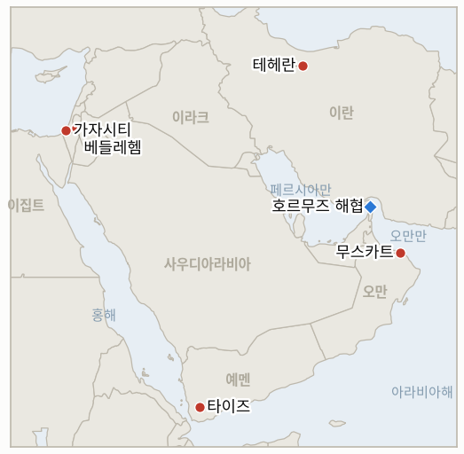

# 중동 일일 브리핑

**2026년 8월 26일**

- **보고 기간:** 약 24시간, 8월 25일 09:00 ~ 8월 26일 09:00 (한국시간)
- **종합 평가:** 화요일은 6월 양해각서 이후 가장 밀도 높은 긴장 완화 신호가 한꺼번에 쏟아진 날이었다. 트럼프 대통령은 호르무즈 해협의 기뢰가 전량 제거됐으며 "무관용 정책"으로 감시하고 있다고 선언했고, 이란의 가리바바디 부장관은 오만과 협상한 임시 호르무즈 항로 체계를 확인했으며, 파키스탄군 참모총장 아심 무니르는 테헤란 권력 기관들을 도는 하루 일정을 마쳤고, 뉴욕타임스는 미 국무부가 대피시켰던 외교관들을 중동 공관에 복귀시킬 준비를 하고 있다고 보도했다. 이 네 가지 신호가 겹치며 브렌트유와 WTI유는 나란히 일주일 만의 최저치로 떨어졌다. 그러나 현실은 정반대 방향도 함께 가리켰다. 오만 해안에서 정체불명 발사체가 유조선을 타격해 무력화시켰고, 월요일 호르무즈 통항 선박은 단 2척으로 5월 초 이후 최저치를 기록해, 오늘의 유가 랠리가 실제 통항 재개보다는 심리적 기대에 기댄 것임을 보여준다. IND-20260812-1(미 해군 봉쇄에 대한 이란의 군사적 보복)과 IND-20260812-4(가자지구 무장해제안에 대한 이스라엘 안보내각의 공식 표결)는 모두 오늘 자체 시한을 넘기며 반증으로 확정됐고, IND-20260811-2(마즈달 준 폭발 사건의 원인)는 이스라엘군의 판단이 끝내 확정적 결론에 이르지 못한 채 만료됐다. 서울 증시도 격변의 하루를 보냈다. 코스피는 2.40% 하락 출발해 장중 한때 4.3%까지 낙폭을 키웠다가 월가발 인공지능 수익성 우려의 여진으로 시작된 흐름을 딛고 반등해 0.68% 상승한 6,742.74로 마감했는데, 이는 IND-20260820-2가 추적하는 붕괴 이전 기준선에서 단 1.85%밖에 떨어지지 않은 수준이다. 가자지구에서는 베이트라히아·칸유니스·부레이지 곳곳의 산발적 공습으로 팔레스타인인 6명이 추가로 사망해 휴전 이후 누적 사망자가 1,296명을 넘어섰고, 서안지구에서는 복면을 쓴 정착민들이 베들레헴 인근에서 이스라엘 인권단체 "인권을 위한 랍비들" 활동가들에게 최루 스프레이를 뿌리고 폭행했으며 AFP 사진기자를 막대기로 가격해, 정착민 폭력이 팔레스타인인을 넘어 이스라엘인·국제 언론까지 겨냥하는 이례적 사례로 기록됐다. 예멘에서는 대통령지도위원회 의장 라샤드 알알리미가 타이즈 외곽의 격렬한 야간 교전 이후 후티 반군에 대한 "뼈아픈 타격"을 계속하겠다고 공언했다.

---

## 1. 오늘의 주요 사건

<figure style="float:right; width:46%; margin:2pt 0 8pt 14pt;">

<figcaption style="font-size:8pt; color:#666; text-align:center; margin-top:3pt; font-style:italic;">주요 논의 지점</figcaption>
</figure>

### 1.1 트럼프, 호르무즈 기뢰 전량 제거 주장, 이란-오만 항로 협상과 파키스탄 중재 겹쳐, 그러나 유조선 피격에 통항량은 급감

트럼프 대통령은 화요일 미 해군이 호르무즈 해협 국제 수역의 기뢰를 "전량 제거 또는 폭파"했다고 밝히며 "새로 기뢰를 설치하는 선박이나 보트는 즉시 파괴될 것"이라는 "무관용 정책"을 선언하고, 미 우주군이 해협의 "구석구석"을 감시하고 있다고 말했다([Axios](https://www.axios.com/2026/08/25/hormuz-mines-remove-oil-iran-trump); [US News](https://www.usnews.com/news/world/articles/2026-08-25/trump-says-strait-of-hormuz-has-been-demined-warns-iran-not-to-plant-more)). 몇 시간 뒤 이란과 오만은 임시 호르무즈 항로 체계에 관한 입장을 발표했다. 카젬 가리바바디 이란 외교부 부장관은 새로운 입출항 항로의 상당 부분이 이란 영해를 지나게 되며, 수십 년간 이어져 온 오만 영해 통항 체계를 두세 달 또는 그 이상의 기간 동안 대체하게 된다고 밝혔지만, 이 조치가 해협의 "전면 재개방을 의미하지는 않는다"며 미국이 붕괴된 6월 양해각서상의 의무로 "복귀해야" 한다고 강조했다([Al Jazeera](https://www.aljazeera.com/news/2026/8/25/iran-oman-discuss-temporary-shipping-lane-through-strait-of-hormuz); [Middle East Eye](https://www.middleeasteye.net/news/iran-oman-work-temporary-hormuz-shipping-route-trump-threatens-claim-strait)). 같은 날 파키스탄군 참모총장 아심 무니르 원수는 테헤란 중재 방문을 마쳤다. 그는 페제시키안 대통령, 의회 의장 겸 수석 핵협상가인 갈리바프, 아라그치 외무장관 등을 만나 이란을 워싱턴과의 협상 테이블로 복귀시키고 파키스탄과 동맹 관계인 걸프 국가들에 대한 공격을 만류하려 했다([Al Jazeera](https://www.aljazeera.com/news/2026/8/25/can-pakistans-asim-munir-convince-iran-military-chiefs-to-return-to-talks); [Bloomberg](https://www.bloomberg.com/news/articles/2026-08-25/pakistan-army-chief-ends-tehran-visit-us-iran-mediation-push)). 별도로 뉴욕타임스는 국무부가 올해 초 대피시킨 외교관들을 이스라엘·레바논·사우디아라비아·카타르·요르단·오만·이라크·쿠웨이트 소재 공관에 복귀시킬 준비를 하고 있다고 보도했다. 이스라엘·요르단·오만은 완전 복귀가 먼저 이뤄지고 나머지 공관은 75~85% 인력으로 제한된다는 내용으로, 워싱턴이 임박한 재개전을 예상하지 않는다는 구체적인 관료적 신호다([Arab News](https://www.arabnews.com/node/2655823/middle-east); [Haaretz](https://www.haaretz.com/israel-news/israel-security/2026-08-25/ty-article/report-u-s-prepares-to-return-mideast-diplomats-evacuated-before-iran-war/000001a0-387e-d936-a7ac-387f2b710000)). 유가는 이 네 가지 신호를 한꺼번에 반영해 브렌트유는 약 6% 내린 86.33달러, WTI유는 약 3% 내린 82.51달러로 각각 일주일 만의 최저치를 기록했다. 삭소뱅크의 상품전략 책임자 올레 한센은 "군사적 확전에서 경제적 압박으로의 전환이... 시장의 불안을 일부 완화시켰다"고 평가했다([Reuters via Investing.com](https://www.investing.com/news/commodities-news/oil-prices-steady-as-investors-weigh-impact-of-expanded-us-sanctions-against-iran-4874373)). 그러나 같은 기간 정반대 방향을 가리키는 두 신호도 함께 나왔다. 오만 아시샤 북동쪽 약 9해리 지점에서 정체불명 발사체가 유조선 엔진실을 타격해 무력화시켰다고 영국해양무역기구(UKMTO)가 밝혔고, 로이터 선박 데이터에 따르면 월요일 호르무즈를 통항한 상선은 단 2척으로 5월 초 이후 가장 적었다([Gulf News](https://gulfnews.com/business/energy/unknown-projectile-hits-oil-tanker-off-oman-ukmto-1.500651171)). **신뢰도: 높음** — 트럼프의 발언, 이란-오만 항로 체계의 내용, 무니르의 일정, 유조선 피격(1~2등급, 실명 발표, UKMTO 공식 경보, 다수 매체). **신뢰도: 중간** — 외교관 복귀 계획과 항로 체계가 지속 가능한 긴장 완화인지, 같은 기간 발생한 유조선 피격과 통항량 급감을 고려할 때 또 다른 잠정적·가역적 신호에 그칠지는 불확실하다.

### 1.2 코스피의 롤러코스터: 장중 4.3% 급락 후 0.68% 상승 마감

코스피는 2.40% 하락한 6,535.93으로 출발해 장중 한때 4.3%까지 낙폭을 키웠으나 오후 들어 반등해 전일 대비 45.78포인트(0.68%) 오른 6,742.74로 마감했다. 이는 특정 중동 촉발 요인이 아니라 미국 기술주의 인공지능 투자 수익성에 대한 우려로 나스닥이 밤새 0.76% 하락한 여파였다([Korea Times](https://www.koreatimes.co.kr/economy/20260825/kospi-edges-higher-despite-us-tech-headwinds); [SBS](https://news.sbs.co.kr/english/article.do?news_id=N1008721068)). 삼성전자는 주주환원 세부안 지연에 대한 우려로 장 초반 하락했다가 0.19% 오른 25만 7,000원으로 마감했고, SK하이닉스는 생산직 노조 대표단이 임금 합의안을 부결시켰음에도 0.42% 오른 167만 8,000원으로 마감했다. 외국인 투자자는 3조 8,200억 원을 순매도했지만 국내 기관과 개인이 각각 1조 1,700억 원, 1조 500억 원을 순매수하며 낙폭을 방어했다. 원화는 전일 대비 3.7원 약세를 보이며 1,386.1원으로 마감했다. 오늘 종가는 IND-20260820-2가 시험하는 붕괴 이전 기준선 6,869.83과 불과 1.85% 차이로, 8월 27일 시한을 하루 앞둔 상황이다. **신뢰도: 높음** — 지수 수준, 종목별 등락, 매매 동향(1~2등급, 코리아타임스·SBS, 거래소 공식 자료). **신뢰도: 중간** — 반등이 지속될지는 아직 해소되지 않은 월가발 서사와의 연관성을 고려할 때 불확실하다.

### 1.3 가자지구 곳곳 산발적 공습으로 팔레스타인인 6명 추가 사망, 휴전 이후 누적 사망자 1,296명 돌파

화요일 이스라엘군의 공습과 총격으로 가자지구 곳곳에서 팔레스타인인 최소 6명이 추가 사망했다. 카말 아드완 병원 인근 베이트라히아의 한 가옥에 대한 공습으로 3명이 사망했고, 칸유니스 알마와시 지역에 대한 드론 공습으로 1명이 숨졌으며, 이스라엘군의 총격으로 2명이 추가 사망했다. 그밖에 칸유니스 서부 포격과 알아말 지역 공습 부상자가 뒤늦게 숨진 사례도 확인됐다([Middle East Monitor/Anadolu](https://www.middleeastmonitor.com/20260825-another-6-palestinians-killed-by-israeli-strikes-across-beleaguered-gaza-strip/)). 이스라엘 군용 차량은 칸유니스 남부의 피란민 텐트촌을 향해서도 사격을 가했고, 포병은 부레이지 난민촌과 와디가자 다리 인근 지역도 겨냥한 것으로 전해졌다. 이스라엘군은 화요일 개별 공습에 대해 별도 입장을 밝히지 않았다. 가자지구 보건부는 10월 휴전 발효 이후 누적 사망자가 1,296명, 부상자가 4,296명에 달한다고 밝혔는데, 이는 월요일 집계였던 1,288명·4,290명에서 이틀 새 늘어난 수치로(8월 25일자 브리핑 §1.3), 일요일 연 발사 위협(IND-20260824-2) 이후에도 특정 공습이 연 발사와 직접 결부됐다는 근거 없이 이어지는 익숙한 사망 패턴과 일치한다. **신뢰도: 높음** — 사망자와 위치(1~2등급, 아나돌루통신 인용 미들이스트모니터, 가자 보건부, 여러 지역 보도). **신뢰도: 낮음** — 화요일 개별 사건에 대한 이스라엘 측 입장이 확인되지 않아 표적 근거를 판단하기 어렵다.

### 1.4 베들레헴 인근서 복면 정착민들, 이스라엘 인권 활동가와 AFP 기자 공격

일부가 옷 아래로 유대교 술 장식(치치트)이 드러난 복면 괴한들이 베들레헴 남쪽 코하브 예후다 전초기지 인근 자나타 마을에서 팔레스타인 가옥 주변에 울타리를 설치하던 "인권을 위한 랍비들" 활동가들을 공격해, 얼굴에 최루 스프레이를 뿌리고 고령의 랍비 한 명을 막대기로 폭행했다([The Times of Israel](https://www.timesofisrael.com/liveblog-august-25-2026/)). 몸싸움이 벌어진 뒤 이스라엘군은 해당 지역을 "폐쇄 군사 구역"으로 선포하고 취재진에 철수를 명령했는데, 그 순간 아이들을 포함한 정착민들을 태운 차량 두 대가 추가로 도착해 돌을 던졌고, 그중 한 아이가 막대기로 AFP 사진기자의 턱을 가격해 출혈을 일으켰다([Middle East Eye](https://www.middleeasteye.net/live-blog/live-blog-update/israeli-settlers-attack-afp-journalists-occupied-west-bank); [HNGN](https://www.hngn.com/articles/272909/20260825/settlers-attack-afp-journalists-activists-west-bank-idf-declares-closed-zone.htm)). 팔레스타인 적신월사는 최소 5명을 치료했다. 이번 공격은 8월 중순 이후 이 원장이 추적해 온, 정착민 폭력이 거의 전적으로 팔레스타인 주민만을 겨냥해온 패턴(8월 25일자 브리핑 §1.4)에서 벗어난 진정한 이례적 사례다. 이번에는 표적이 이스라엘 좌파 NGO와 국제 언론이었고, 군의 폐쇄 구역 선포도 쿠스라에서 문서화된 것과 마찬가지로(IND-20260813-3) 사전 예방이 아니라 공격 이후 뒤늦게 내려졌다. **신뢰도: 높음** — 공격, 부상, 폐쇄 구역 선포(1~2등급, 타임스 오브 이스라엘 라이브블로그, 미들이스트아이, 영상 증거, AFP 취재, 다수 매체). **신뢰도: 중간** — 체포로 이어질지는 보고 기간 중 확인되지 않았다.

### 1.5 예멘 정부, 타이즈 교전 격화 속 "뼈아픈 타격" 공언

예멘 대통령지도위원회 의장 라샤드 알알리미는 10년 넘게 정부군이 통제해온 도시 타이즈의 북부·북동부·동부 외곽에서 월요일 밤 격렬한 교전이 벌어진 뒤 후티 반군에 대해 "뼈아픈 타격"을 계속하겠다고 공언했다. 한 군 관계자는 정확한 수치는 밝히지 않은 채 후티 측이 정부군에 "심각한 피해"를 입혔다고 말했다([Arab News](https://www.arabnews.com/node/2655833/middle-east)). 이번 격화는 8월 초 마리브·하드라마우트에서 후티 반군의 미사일·드론 공격으로 정부군 최소 30명이 사망하고 모카에서도 7명이 숨진 사건에 이어진 것으로, 2022년 4월 유엔 중재 휴전 이후 유지돼온 상대적 소강 국면에서 예멘 전쟁이 지금껏 가장 크게 벗어난 사례다. **신뢰도: 높음** — 알알리미의 발언과 타이즈 교전(1~2등급, 아랍뉴스, 실명 관계자 발언). **신뢰도: 중간** — 양측 피해 규모는 독립적으로 검증된 수치가 없어 불확실하다.

---

## 2. 심층 분석: 유인과 동기

### 2.1 워싱턴과 테헤란은 왜 베선트의 제재 발표 하루 만에 기뢰 제거 주장, 항로 체계, 제3자 중재, 외교관 복귀 계획을 한꺼번에 쌓아 올렸는가?

양측 모두 제재 캠페인의 규모(이제 공식 기록으로 남은)가 주는 강압적 효과를 챙기면서도, 새로운 2차 제재 분야와 파키스탄의 중재로 압박받는 이란이 가리바바디가 모든 조건의 전제로 내건 양해각서 협상 재개 쪽으로 움직일지 동시에 시험할 수 있기 때문이다. 최대치의 제재 발표 다음 날 긴장 완화 신호를 쌓아 올리면 워싱턴은 공식적으로 노선을 바꾸지 않고도 채찍과 잠재적 출구 전략을 모두 손에 쥘 수 있고, 이란은 최고국가안보회의의 강경 노선 아래서 굴복하는 모습을 보이는 국내 정치적 비용 없이 "완전 재개방에 못 미치는 임시 항로" 양보만으로 제재 완화를 얻어낼 수 있는지 시험하게 된다.

### 2.2 이렇게 중동 관련 뉴스가 밀도 높았던 날, 코스피의 장중 최대 변동폭은 왜 중동 촉발 요인과 무관하게 전적으로 월가의 인공지능 투자 서사에서 비롯됐는가?

한국 증시 리스크는 이제 이 원장이 반복적으로 구분해온(8월 25일자 브리핑 §2.3) 최소 두 개의 독립된 축으로 움직이기 때문이다. 삼성전자와 SK하이닉스가 지수에서 차지하는 비중을 감안하면 나스닥 심리와 밀접하게 연동되는 반도체·인공지능 설비투자 축, 그리고 유가와 원화를 움직이는 중동 지정학적 리스크 축이다. 오늘 뉴스 흐름은 거의 전적으로 후자(긴장 완화 신호, 유가 하락)에 쏠려 있었기 때문에, 지수 자체의 변동성은 전자에서 비롯됐다는 것이 설명되며, 이러한 탈동조화 자체가 우연이 아니라 한국 정책 당국에 의미 있는 신호다.

### 2.3 커슈너-네타냐후가 합의한 무장해제 실무그룹과 조율 메커니즘 등 외교 트랙이 계속되는데도, 가자지구 민간인 희생 공습은 왜 변함없는 속도로 이어지는가?

조율 메커니즘과 실무그룹은 고위급 무장해제 협상을 관장할 뿐, 이 원장이 앞서 문서화한 대로 커슈너 특사 이임 이후 재도입된 완화된 교전수칙 아래서 이미 작전 중인 부대의 일상적 표적 선정 결정을 관장하지 않기 때문이다. 따라서 외교 트랙의 지속과 현장 수준의 살상 패턴 지속은 서로 모순되지 않는다. 단지 아직 서로 교차하도록 만들어지지 않은 별개의 절차일 뿐이다.

### 2.4 정착민 폭력은 왜 팔레스타인인만이 아니라 이스라엘 좌파 활동가와 국제 언론까지 겨냥하도록 확산됐는가?

"인권을 위한 랍비들"과 국제 사진기자들은 바로 그 종류의 기록과 책임 추궁 압력, 즉 영상, 외신 보도, NGO 보고서를 대표하는데, 이는 이 원장이 추적해온 드문 집행 사례(마사페르 야타 체포, 8월 25일자 브리핑 §1.4)를 실제로 이끌어낸 압력이기 때문이다. 따라서 기록자를 직접 공격하는 것은 기존 면책 패턴의 더 급진적이지만 논리적으로 일관된 연장선이다. 목격되지 않은 팔레스타인 공격은 기소되지 않는다면, 목격자를 제거하는 것은 이따금 예외를 만들어내는 그 압력 자체를 제거하는 셈이다.

### 2.5 예멘 정부는 왜 조용한 일상적 대응 작전 대신 지금 명시적으로 "뼈아픈 타격"을 공언했는가?

알알리미의 공개 선언은 그동안 조용히 이어져 온 정부군의 일상적 작전 속도를, 유엔이 이미 전쟁 확산에 경고를 내놓은 시점에 후티 반군의 자체 확전(마리브·하드라마우트 공격으로 병사 30명 사망)에 맞서 싸운다는 정치적 공로를 아덴 정부가 주장할 수 있는 공식 선포된 작전으로 전환시키기 때문이다. 이는 정부가 단순히 반응적으로 보이기를 기다리기보다, 교전이 벌어진 뒤가 아니라 진행되는 동안 국제적 동조를 더 강하게 주장할 수 있게 해준다.

---

## 3. 한국에 대한 정책적 함의

### 3.1 노출 현황 스냅숏

| 항목 | 현재 수치 | 출처 |
| --- | --- | --- |
| 원유 수입 중 중동산 비중 | 48.5%(2026년 5~7월), 전년 동기 69.1%에서 하락; 비중동산 비중이 사상 처음 50% 상회 | KNOC via 아시아경제; `korea-exposure.md` |
| 7~8월 원유 확보량 | 전년 동기 대비 110% 이상 확보(산업통상자원부, 7월 21일); 전략비축유 스와프 8월까지 연장, 현재까지 약 2,100만 배럴 스와프 | 산업통상자원부 via 헤럴드경제, 한경; `korea-exposure.md` |
| 9월 원유 확보량 | 90% 이상 확보(산업통상자원부, 7월 21일) | 산업통상자원부 via 헤럴드경제; `korea-exposure.md` |
| 홍해 우회 경로 | 한국행 원유는 얀부·홍해 우회로를 계속 이용 중; 얀부에서 한국을 포함한 아시아 구매자로의 수출량이 전년 동기 하루 100만 배럴 미만에서 약 400만 배럴로 급증 | Lloyd's List Intelligence; `korea-exposure.md` |
| 전략비축유 대응력 | 실제 소비량 기준 약 26일분(추정); 스와프는 즉시 대기 상태이나 대규모 실행은 검증되지 않음 | CSIS; 산업통상자원부 7월 27일 |
| 정유사 사우디 지분 노출 | S-Oil(사우디 아람코 지분 약 63%), HD현대오일뱅크(아람코 지분 약 17%) | 공시자료; `korea-exposure.md` |
| 브렌트유/WTI유 | 화요일 각각 86.33달러(-6.3%)/82.51달러(-2.9%)로 마감, 일주일 만의 최저치, 오만 인근 유조선 피격에도 불구하고 미국-이란 긴장 완화 신호가 겹친 결과 | TradingEconomics; Reuters via Investing.com |
| 코스피/원달러 환율 | 코스피는 월가발 인공지능 투자 우려로 장중 4.3% 급락 후 0.68% 상승한 6,742.74로 마감; 원화는 3.7원 약세로 1,386.1원 | Korea Times; SBS |
| 호르무즈 통항량 | 8월 24일(월) 단 2척 통항, 5월 초 이후 최저치, 외교적 신호는 완화 쪽을 가리켰음에도 통항 현실은 정반대 | Reuters/UKMTO via CNBC |

### 3.2 사안별 함의

**오늘 겹친 긴장 완화 신호, 기뢰 제거, 이란-오만 임시 항로, 파키스탄 중재, 미국 외교관 복귀 계획은 워싱턴과 테헤란 모두 긴장 완화에 가치를 둔다는 가장 구체적이고 다각적인 증거이지만, 같은 날 벌어진 유조선 피격과 단 2척에 그친 호르무즈 통항량을 고려하면 한국 정책 당국은 오늘의 유가 하락을 정상적 통항 재개가 아니라 심리적 반응으로 다뤄야 한다.** IND-20260812-1은 오늘 자체 시한에서 반증으로 확정됐다. 봉쇄가 계속되는데도 미 해군 함정이나 봉쇄 집행 자산에 대한 이란의 검증된 공격은 발생하지 않았다. IND-20260816-3(운영 개시일이 명시된 이란-오만 공동성명 서명, 시한 9월 5일)은 오늘의 항로 체계로 확증 쪽에 한 걸음 더 가까워졌지만, 서명되고 날짜가 확정된 합의라는 확증 기준에는 아직 이르지 못했다.

**코스피가 붕괴 이전 기준선에서 이제 1.85%까지 좁혀지며 IND-20260820-2의 시한을 하루 앞두고 가장 구체적인 근접 시험대에 오른 만큼, 한국 시장 참가자들은 내일 종가를 결정적 분기점으로 다뤄야 한다.** 오늘의 변동성이 중동 관련 사안이 아니라 전적으로 월가의 인공지능 서사에서 비롯됐다는 점은, 한국 증시 리스크와 중동 지정학 리스크가 이제 실질적으로 분리된 별개의 축이라는 이 원장의 기존 평가를 재확인시켜준다.

**가자지구의 변함없는 살상 패턴과 이번에는 이스라엘·국제 대상까지 확산된 서안지구 정착민 폭력은 한국 시장에 직접적인 경로는 없지만, 휴전과 집행 체제가 책임 추궁 쪽으로 향하는지 아니면 계속 와해되는지를 시험하는 일반적 지역 안정성 신호로서, 폭넓은 중동 리스크 프리미엄을 추적하는 한국 정책 당국이 계속 주시해야 할 사안이다.** IND-20260824-2(연 발사 관련 공습 강도 시험, 시한 8월 30일)는 특정 공습이 아직 연 발사와 결부되지 않은 채 계속 진행 상태이며, 신규 IND-20260826-2는 자나타 공격이 강력한 영상 증거에도 불구하고 마사페르 야타 사례(IND-20260825-2)와 달리 책임 추궁으로 이어지는지를 시험한다.

**예멘의 새로 공언된 "뼈아픈 타격" 작전은 티하마 이중 타격 사건 이후 이 원장이 추적해온 홍해 항로 리스크에 오늘 직접적인 피격 사례는 없었지만 새로운 확전 요소를 더하며, 한국의 얀부 우회로와 무관하지 않다.** IND-20260817-1(예멘의 확인된 확산이 국제 중재를 이끌어내는지, 시한 8월 31일)이 오늘의 사건과 가장 직접적으로 연관된 지표다.

**검증 가능한 지표:**

- **IND-20260826-1** — 대피시킨 외교관을 중동 공관(이스라엘, 레바논, 사우디아라비아, 카타르, 요르단, 오만, 이라크, 쿠웨이트)으로 복귀시킨다는 국무부 계획이 확인 가능한 실제 인력 증원으로 이어지거나, 계획이 지연·번복된다. 2026년 9월 2일경까지 국무부의 공식 확인이나 복귀 인력에 대한 보도가 나오면 국무부 자체의 전시 태세 평가가 실질적으로 완화됐음을 확증하며, 같은 시점까지 확인된 움직임이 없거나 계획의 중단·번복이 보도되면 이는 실행에 옮겨지지 못한 시험적 발표였음을 반증한다.
- **IND-20260826-2** — 자나타에서 "인권을 위한 랍비들" 활동가와 AFP 기자를 공격한 사건이 마사페르 야타의 드문 집행 사례(IND-20260825-2)와 마찬가지로 실명 체포나 기소로 이어지거나, 영상 증거에도 불구하고 기록되지 않고 기소되지 않는 정착민 폭력의 더 넓은 패턴에 합류한다. 2026년 9월 8일경까지 자나타 공격과 관련된 검증된 체포나 기소가 확인되면 복면을 쓴 신원 미상 가해자를 상대로도 영상 증거가 여전히 집행으로 이어질 수 있음을 확증하며, 같은 시점까지 체포가 없으면 신원 확인 없이는 영상만으로는 충분하지 않음을 반증한다.

---

## 4. 주시 목록

- **쿠스라 정착촌 전초기지 철거가 재유입 없이 지속되어 철거 기준을 완전히 충족하는지** (IND-20260813-3, 시한 8월 27일).
- **한국 코스피 반등이 붕괴 이전 수준 2% 이내를 유지하는지, 현재 1.85% 차이로 하루를 앞두고 있음** (IND-20260820-2, 시한 8월 27일).
- **쿠스라의 식량·의약품 부족 사태가 이스라엘의 개입을 이끌어내는지 아니면 문서화된 위기로 굳어지는지** (IND-20260821-2, 시한 8월 28일).
- **이스라엘의 연 발사 "공습 강화" 위협이 문서화된 확전으로 이어지는지, 아니면 기존 표적 작전과 구분되지 않는 수준에 머무는지** (IND-20260824-2, 시한 8월 30일).
- **8월 15일 헤즈볼라-이스라엘 교전이 추가 라운드로 이어지는지 아니면 양측이 휴전 이후 균형으로 물러서는지** (IND-20260816-1, 시한 8월 29일).
- **가자지구 옐로라인 사건들이 이스라엘군의 공식 작전 대응을 촉발하는지 아니면 고립된 사례로 남는지** (IND-20260816-2, 시한 8월 30일).
- **예멘의 확인된 확산이 국제 중재를 이끌어내는지, 오늘 알알리미의 "뼈아픈 타격" 공언으로 더욱 날카로워진 상태** (IND-20260817-1, 시한 8월 31일).
- **호르무즈를 미국 영토로 만들겠다는 트럼프의 선언이 반복된 수사를 넘어 구체적 정책 조치로 이어지는지** (IND-20260817-2, 시한 8월 31일).
- **이스라엘이 준비한 알리 알타헤르 능선 작전이 실제로 개시되는지** (IND-20260818-2, 시한 8월 31일).
- **로마 트랙의 9월 1일 예정 8차 회담이 예정대로 진행되는지** (IND-20260807-2, 시한 9월 1일).
- **오만을 폭격하겠다는 트럼프의 위협이 실제 외교적·군사적 결과로 이어지는지** (IND-20260818-1, 시한 9월 1일).
- **후티 반군의 모카 인근 사우디 해군 함정 공격 주장이 확인되거나 사우디의 직접 대응을 이끌어내는지** (IND-20260818-3, 시한 9월 1일).
- **카츠의 미조율 서안지구 경찰 이양이 예정대로 진행되는지, 지연되는지, 혹은 무산되는지** (IND-20260819-2, 시한 9월 1일).
- **미노안 디그니티호 치명적 피격 사건의 책임 소재가 규명되거나 군사적 대응으로 이어지는지** (IND-20260819-1, 시한 9월 2일).
- **운영 개시일이 명시된 이란-오만 호르무즈 공동성명이 서명되는지, 혹은 항로 협상이 다시 교착되는지, 그리고 이란 의회가 통행료 법안을 전체 통과시키는지** (IND-20260816-3, 시한 9월 5일).
- **아부 알두후르 공습을 둘러싼 튀르키예-이스라엘 갈등이 확전되는지 아니면 흡수되는지** (IND-20260823-1, 시한 9월 6일).
- **이스라엘군의 서안지구 "경계선" 경고 이후 실제 폭력 양상의 단계적 변화가 뒤따르는지** (IND-20260823-2, 시한 9월 6일).
- **배럭의 연이은 논란이 실제 미국 정책이나 인사 조치로 이어지는지** (IND-20260824-1, 시한 9월 6일).
- **베선트 제재 패키지가 예고한 대형 금융기관 지정이 이번 주 안에 실현되는지** (IND-20260825-1, 시한 8월 29일).
- **마사페르 야타 체포가 지속적인 정착민 집행 강화로 이어지는지 아니면 고립된 사례로 남는지** (IND-20260825-2, 시한 9월 8일).
- **국무부의 중동 공관 외교관 복귀 계획이 진행되는지 아니면 지연되는지** (IND-20260826-1, 시한 9월 2일).
- **자나타에서 이스라엘 활동가와 AFP 기자를 공격한 사건이 체포로 이어지는지** (IND-20260826-2, 시한 9월 8일).
- **시리아 핵물질 발견이 최종 합의와 검증된 제거로 이어지는지** (IND-20260812-2, 시한 9월 11일).
- **서안지구 이스라엘군-경찰 집행 이양이 정착민 폭력을 줄이는지 아니면 변화 없이 유지되는지** (IND-20260815-2, 시한 9월 12일).
- **이란의 경고에도 불구하고 시리아가 레바논 내 헤즈볼라에 조치를 취하는지, 아니면 대치가 수사에 머무는지** (IND-20260815-3, 시한 9월 15일).
- **케인 상원의원의 오만 관련 전쟁권한 결의안이 9월 상원 복귀 시 통과되는지, 부결되는지, 아니면 본회의 표결에 이르지 못하는지** (IND-20260819-3, 시한 9월 25일).
- **오늘 알알리미의 "뼈아픈 타격" 공언으로 더욱 날카로워진 예멘 교전이 극적인 추가 확전으로 이어지는지, 아니면 타이즈·마리브 전선의 소모전 양상으로 굳어지는지.**
- **캐롤라인 베젠기호 기름 유출 사고가 인양 작업 개시 이후 통제되는지.**
- **케슘섬 폭발 사건이 실제 공격으로 확인되는지, 아니면 오경보로 결론 나는지.**

---

## 5. 출처 품질 요약

| 주장 | 출처 | 신뢰도 |
| --- | --- | --- |
| 트럼프의 호르무즈 기뢰 제거 주장 및 "무관용 정책" 경고 | Axios, US News(1등급, 실명 대통령 발언, 다수 매체) | 높음 |
| 이란-오만 임시 호르무즈 항로 체계 및 조건 | Al Jazeera, Middle East Eye, IranWire(2~3등급, 실명 부장관 발언, 다수 매체) | 체계의 존재와 조건은 높음; 서명되고 날짜가 확정된 합의로 이어질지는 중간 |
| 파키스탄군 참모총장 아심 무니르의 테헤란 중재 방문 및 면담 | Al Jazeera, Bloomberg(1~2등급, 실명 일정, 다수 매체) | 높음 |
| 미국 외교관의 중동 공관 복귀 계획 | Arab News, Haaretz(뉴욕타임스 인용, 1~2등급, 내부 계획 문서 인용, 다수 매체) | 중간, 단일 원출처 보도로 국무부의 독립적 확인 전 |
| 브렌트유·WTI유 종가 및 일주일 최저치 평가 | TradingEconomics, Reuters via Investing.com(1~2등급, 시장 데이터, 다수 매체) | 높음 |
| 오만 인근 유조선의 정체불명 발사체 피격 | Gulf News, Arab News, UKMTO 공식 경보(1등급, 공식 해상안보 경보, 다수 매체) | 피격 사실은 높음; 배후 규명은 낮음, 어느 단체도 배후를 자처하지 않음 |
| 호르무즈 통항 선박 2척 | Reuters/UKMTO via CNBC | 중간, 이 통계열에서 반복돼온 매체 간 수치 불일치를 고려한 단일 출처 수치 |
| 코스피 종가, 삼성전자·SK하이닉스 등락, 매매 동향 | Korea Times, SBS(1~2등급, 거래소 데이터, 실명 보도) | 높음 |
| 원달러 환율 종가 | Korea Times | 중간, 두 번째 한국 매체와 아직 교차 확인되지 않은 수치 |
| 가자지구 곳곳 산발적 공습으로 팔레스타인인 6명 사망; 휴전 이후 누적 사망자 | Middle East Monitor(아나돌루통신 인용), 가자 보건부(2~3등급, 현장·공식 취재) | 사망 사실은 높음; 이스라엘군의 표적 근거는 낮음, 이스라엘 측 입장 미확인 |
| 자나타에서 "인권을 위한 랍비들" 활동가와 AFP 기자 공격 | Times of Israel 라이브블로그, Middle East Eye, HNGN(1~2등급, 영상 증거, AFP 취재, 다수 매체) | 높음 |
| 예멘 알알리미의 "뼈아픈 타격" 공언과 타이즈 교전 | Arab News(2등급, 실명 관계자 발언, 현장 보도) | 발언은 높음; 피해 규모는 중간, 독립 검증 수치 없음 |
