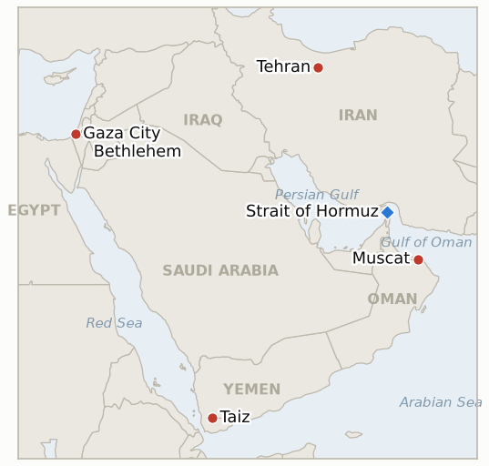

# Middle East Daily Briefing

**August 26, 2026**

- **Reporting window:** ~24 hours, August 25, 09:00 to August 26, 09:00 KST
- **Overall assessment:** Tuesday delivered the war's most concentrated stack of de-escalation signals since the June MOU: Trump declared the Strait of Hormuz fully demined and under "zero tolerance" watch, Iran's Gharibabadi confirmed a temporary Hormuz shipping route negotiated with Oman, Pakistan's army chief Asim Munir concluded a day of meetings across Tehran's power corridors, and the New York Times reported Washington is preparing to send evacuated diplomats back to Middle East embassies, together dragging Brent and WTI to one-week lows. The on-the-water reality cut the other way: an unidentified projectile disabled a tanker off Oman's coast and only two vessels transited Hormuz Monday, the thinnest daily tally since early May, underscoring how much of today's rally is priced on signaling rather than resumed traffic. Both IND-20260812-1 (US Navy blockade drawing Iranian retaliation) and IND-20260812-4 (a formal Israeli Security Cabinet vote on Gaza disarmament) hit their own deadlines today without triggering, resolving falsified, while IND-20260811-2 (the Majdal Zoun blast's origin) expires with the IDF's assessment still short of a confirmed finding either way. Seoul's KOSPI ran its own volatile day, opening down 2.4%, plunging as much as 4.3% on spillover from Wall Street's AI-profitability jitters, then clawing back to close up 0.68% at 6,742.74, within 1.85% of the pre-crash reference level IND-20260820-2 is tracking. Gaza's lethal pattern continued unabated, six more Palestinians killed in scattered strikes across Beit Lahia, Khan Younis and Bureij as the post-ceasefire toll passed 1,296, while in the West Bank masked settlers pepper-sprayed and beat Israeli human-rights activists and struck an AFP journalist with a stick near Bethlehem, a rare instance of settler violence turning on Israeli and international targets rather than only Palestinians. Yemen's war kept widening as Presidential Leadership Council chairman Rashad al-Alimi vowed "painful strikes" on Houthi positions after a night of heavy fighting on Taiz's outskirts.

---

## 1. What Happened

<figure style="float:right; width:46%; margin:2pt 0 8pt 14pt;">

<figcaption style="font-size:8pt; color:#666; text-align:center; margin-top:3pt; font-style:italic;">Major places of discussion</figcaption>
</figure>

### 1.1 Trump Claims Hormuz Fully Demined as Iran-Oman Route Talks and Pakistani Mediation Converge, Even as a Tanker Is Struck and Transits Collapse

President Trump said Tuesday that the US Navy had "removed and/or detonated" all mines from the Strait of Hormuz's international waters, declaring a "zero tolerance" policy in which "any new ship or boat placing new mines will be" destroyed, and said US Space Force assets were watching "every square inch" of the strait ([Axios](https://www.axios.com/2026/08/25/hormuz-mines-remove-oil-iran-trump); [US News](https://www.usnews.com/news/world/articles/2026-08-25/trump-says-strait-of-hormuz-has-been-demined-warns-iran-not-to-plant-more)). Hours later, Iran and Oman issued statements on a proposed framework for a temporary Hormuz shipping route: Deputy Foreign Minister Kazem Gharibabadi said large parts of the new inbound and outbound corridors would run through Iranian territorial waters, replacing the decades-old system of Omani-waters transit for a period of two to four months or longer, but stressed the arrangement "does not mean" the strait is fully reopening and that the US must "return to its commitments" under the collapsed June MOU before that happens ([Al Jazeera](https://www.aljazeera.com/news/2026/8/25/iran-oman-discuss-temporary-shipping-lane-through-strait-of-hormuz); [Middle East Eye](https://www.middleeasteye.net/news/iran-oman-work-temporary-hormuz-shipping-route-trump-threatens-claim-strait)). The same day, Pakistan's army chief Field Marshal Asim Munir concluded a one-day mediation visit to Tehran, meeting President Pezeshkian, parliament speaker and chief nuclear negotiator Ghalibaf, Foreign Minister Araghchi and other officials in a bid to bring Iran back to talks with Washington and dissuade Tehran from attacking Gulf states allied with Islamabad ([Al Jazeera](https://www.aljazeera.com/news/2026/8/25/can-pakistans-asim-munir-convince-iran-military-chiefs-to-return-to-talks); [Bloomberg](https://www.bloomberg.com/news/articles/2026-08-25/pakistan-army-chief-ends-tehran-visit-us-iran-mediation-push)). Separately, the New York Times reported the State Department is preparing to return Foreign Service staff evacuated earlier this year to embassies across Israel, Lebanon, Saudi Arabia, Qatar, Jordan, Oman, Iraq and Kuwait, with Israel, Jordan and Oman returning to full staffing first and other posts capped at 75 to 85 percent, a concrete bureaucratic signal that Washington does not expect renewed fighting imminently ([Arab News](https://www.arabnews.com/node/2655823/middle-east); [Haaretz](https://www.haaretz.com/israel-news/israel-security/2026-08-25/ty-article/report-u-s-prepares-to-return-mideast-diplomats-evacuated-before-iran-war/000001a0-387e-d936-a7ac-387f2b710000)). Oil priced all four signals together: Brent settled down roughly 6% to $86.33 and WTI eased about 3% to $82.51, both one-week lows, as Saxo Bank's Ole Hansen said the shift "from an escalation in military conflict to economic pressure... has reduced some of the oil market's anxiety" ([Reuters via Investing.com](https://www.investing.com/news/commodities-news/oil-prices-steady-as-investors-weigh-impact-of-expanded-us-sanctions-against-iran-4874373)). The rally sat uneasily against two contrary data points from the same window: an unidentified projectile struck and disabled a tanker's engine room roughly nine nautical miles northeast of Oman's Ash Shishah, per UKMTO, and Reuters shipping data showed only two commodity vessels transited Hormuz on Monday, the lowest daily count since early May ([Gulf News](https://gulfnews.com/business/energy/unknown-projectile-hits-oil-tanker-off-oman-ukmto-1.500651171)). **Confidence: High** on Trump's statement, the Iran-Oman route framework's terms, Munir's itinerary, and the tanker strike (Tier 1-2, on-record statements, UKMTO advisory, multi-outlet); Medium on whether the diplomat-return plan and route framework represent durable de-escalation or another provisional, reversible signal, given the same-window tanker attack and near-empty transit count.

### 1.2 KOSPI's Wild Swing: Down 4.3% Intraday on Wall Street AI Jitters, Recovers to Close Up 0.68%

KOSPI opened down 2.40% at 6,535.93 and fell as much as 4.3% intraday before recovering through the afternoon session to close at 6,742.74, up 45.78 points or 0.68% for the day, on spillover from an overnight 0.76% Nasdaq decline tied to investor concern over whether US technology firms' artificial-intelligence spending will pay off, rather than any fresh Middle East catalyst ([Korea Times](https://www.koreatimes.co.kr/economy/20260825/kospi-edges-higher-despite-us-tech-headwinds); [SBS](https://news.sbs.co.kr/english/article.do?news_id=N1008721068)). Samsung Electronics closed at 257,000 won, up 0.19%, after initially falling on continued uncertainty over its deferred shareholder-return specifics, while SK hynix ended at 1,678,000 won, up 0.42%, despite its own wage agreement being rejected by production-line union representatives; foreign investors sold a net 3.82 trillion won even as domestic institutions and retail bought 1.17 trillion won and 1.05 trillion won respectively. The won weakened marginally to 1,386.1 per dollar, down 3.7 won from Monday's close. Today's close sits just 1.85% below the pre-crash reference level of 6,869.83 that IND-20260820-2 is testing, with one day left before its August 27 deadline. **Confidence: High** on the index levels, sector moves and flow data (Tier 1-2, Korea Times, SBS, exchange data, on-record reporting); Medium on how durable the recovery proves given the move's explicit tie to an unresolved Wall Street narrative rather than a resolved local catalyst.

### 1.3 Six More Palestinians Killed in Scattered Gaza Strikes as the Post-Ceasefire Toll Passes 1,296

Israeli strikes and gunfire killed at least six more Palestinians across Gaza Tuesday: a strike on a home in Beit Lahia near Kamal Adwan Hospital killed three, a drone strike in the Al-Mawasi area of Khan Younis killed a man, and two more died from Israeli gunfire, while separate deaths were confirmed from injuries sustained in earlier shelling west of Khan Younis and an earlier strike on the Al-Amal neighborhood ([Middle East Monitor/Anadolu](https://www.middleeastmonitor.com/20260825-another-6-palestinians-killed-by-israeli-strikes-across-beleaguered-gaza-strip/)). Israeli military vehicles also opened fire on tents sheltering displaced civilians south of Khan Younis, and artillery reportedly targeted the Bureij refugee camp and areas near the Wadi Gaza Bridge; the Israeli military issued no statement addressing any of Tuesday's specific strikes in the reporting available. Gaza's health ministry now puts the toll since the October ceasefire at 1,296 killed and 4,296 wounded, up from 1,288 and 4,290 as of Monday's count (brief 2026-08-25, §1.3), a two-day increment consistent with the steady, unclaimed lethal pattern this ledger has tracked since Sunday's kite-launch threat (IND-20260824-2) without any single strike yet tied specifically to that episode. **Confidence: High** on the deaths and locations (Tier 1-2, Anadolu Agency via Middle East Monitor, Gaza health ministry, multi-location reporting); Low on the IDF's targeting rationale for any individual strike, since no Israeli statement addressing Tuesday's specific incidents was available in the window.

### 1.4 Masked Settlers Attack Israeli Human-Rights Activists and an AFP Journalist Near Bethlehem

Masked assailants, some with visible tzitzit (Jewish ritual fringes) under their clothing, attacked a group from Rabbis for Human Rights who were helping build a fence around a Palestinian home in Jannatah village, near the Kochav Yehuda outpost south of Bethlehem, pepper-spraying activists in the face and beating at least one, an elderly rabbi, with a club ([The Times of Israel](https://www.timesofisrael.com/liveblog-august-25-2026/)). After the altercation, the Israeli military declared the area a "closed military zone" and ordered journalists to leave; at that point two more carloads of settlers, including children, arrived and threw stones, with one child striking an AFP photojournalist in the chin with a stick, drawing blood ([Middle East Eye](https://www.middleeasteye.net/live-blog/live-blog-update/israeli-settlers-attack-afp-journalists-occupied-west-bank); [HNGN](https://www.hngn.com/articles/272909/20260825/settlers-attack-afp-journalists-activists-west-bank-idf-declares-closed-zone.htm)). The Palestine Red Crescent Society treated at least five people for injuries. The attack is a genuine departure from the pattern this ledger has tracked since mid-August, in which settler violence runs almost exclusively against Palestinian residents (brief 2026-08-25, §1.4): here the targets were an Israeli left-wing NGO and international press, and the military's closed-zone order came only after the initial assault rather than pre-emptively, echoing the same after-the-fact enforcement pattern documented at Qusra (IND-20260813-3). **Confidence: High** on the attack, injuries and closed-zone order (Tier 1-2, Times of Israel liveblog, Middle East Eye, AFP-sourced, multi-outlet, video evidence); Medium on whether any arrests follow, since none had been reported in the window.

### 1.5 Yemen's Government Vows "Painful Strikes" as Taiz Fighting Intensifies Overnight

Rashad al-Alimi, chairman of Yemen's Presidential Leadership Council, vowed that government forces would continue inflicting "painful strikes" on Houthi targets after heavy fighting broke out Monday night on the northern, northeastern and eastern outskirts of Taiz, a city under government control for over a decade; a military officer said the Houthis "inflicted heavy losses" on government positions without giving precise figures ([Arab News](https://www.arabnews.com/node/2655833/middle-east)). The escalation builds on early August's Houthi missile and drone strikes on Marib and Hadramaut that killed at least 30 government soldiers and on Mocha that killed seven, marking Yemen's sharpest departure yet from the relative calm that has held since the April 2022 UN-brokered truce. **Confidence: High** on al-Alimi's statement and the Taiz fighting (Tier 1-2, Arab News, on-record officials); Medium on the scale of losses on either side, given the absence of independently verified casualty figures.

---

## 2. Deep Dive: Incentives and Motives

### 2.1 Why would Washington and Tehran stack mine-clearing claims, a shipping-route framework, third-party mediation and a diplomat-return plan on the same day, one day after Bessent's sanctions rollout was meant to escalate pressure?

Because each side gets to bank the sanctions campaign's coercive value (its scale is now public record) while simultaneously testing whether Iran, squeezed by the new secondary-sanctions categories and Pakistan's mediation, will trade toward the reopened MOU talks Gharibabadi is conditioning everything on; stacking de-escalation signals the day after a maximalist sanctions announcement lets Washington claim both the stick and the potential off-ramp without formally reversing course, while Iran gets to test whether a "temporary route" concession short of full reopening buys sanctions relief without the domestic cost of appearing to capitulate under the SNSC's harder line.

### 2.2 Why would KOSPI's sharpest intraday swing in over a week trace entirely to Wall Street's AI-spending narrative rather than any Middle East catalyst, on a day this dense with regional news?

Because Korean equity risk now runs on at least two largely independent tracks this ledger has repeatedly separated (brief 2026-08-25, §2.3): a semiconductor-and-AI-capex track tightly coupled to Nasdaq sentiment given Samsung and SK hynix's weight in the index, and a Middle East geopolitical-risk track that moves oil and the won; today's news flow sat almost entirely in the second track (de-escalation signals, easing oil), which explains why the index's own volatility traced to the first track instead, a decoupling that itself is the informative signal for Korean policymakers rather than a coincidence.

### 2.3 Why would Israeli strikes in Gaza continue killing civilians at an unchanged pace even as diplomatic tracks with Washington (the disarmament working groups, the deconfliction mechanism Kushner and Netanyahu agreed to) remain active?

Because the deconfliction mechanism and working groups govern the high-level disarmament negotiation, not the day-to-day targeting decisions of forces already operating under the loosened rules of engagement this ledger documented reasserting themselves after Kushner's departure (brief 2026-08-25 context), so the diplomatic track's continuation and the ground-level lethal pattern's continuation are not in tension, they are simply governed by separate processes that have not yet been made to intersect.

### 2.4 Why would settler violence widen to target Israeli left-wing activists and international press rather than staying confined to Palestinian victims?

Because Rabbis for Human Rights and international photojournalists represent exactly the kind of documentation and accountability pressure, footage, foreign press coverage, NGO reporting, that has previously forced the rare enforcement actions this ledger has tracked (the Masafer Yatta arrests, brief 2026-08-25 §1.4), so attacking the documenters directly is a more radical but logically consistent extension of the impunity pattern: if unwitnessed attacks on Palestinians go unprosecuted, removing the witnesses removes the pressure that occasionally produces an exception.

### 2.5 Why would Yemen's government escalate to an explicit "painful strikes" vow now rather than continue its quieter pattern of daily counter-operations?

Because Al-Alimi's public vow converts what has been a steady, largely unannounced tempo of government operations into a declared campaign, a shift that lets Aden claim political credit for confronting the Houthis' own escalation (the Marib and Hadramaut strikes that killed 30 soldiers) at a moment when the war's widening is already drawing UN warnings, giving the government a stronger claim to international sympathy and support before the fighting, not after it, rather than waiting to be seen as merely reactive.

---

## 3. Policy Implications for South Korea

### 3.1 Exposure snapshot

| Item | Current reading | Source |
| --- | --- | --- |
| Middle East share of crude imports | 48.5% (May-July 2026), down from 69.1% a year earlier; non-Middle East share crossed 50% for the first time on record | KNOC via Asia Business Daily; `korea-exposure.md` |
| July-August crude procurement | 110%+ of prior-year volume secured (MOTIE, July 21); strategic reserve swap extended through August, ~21 million barrels swapped to date | MOTIE via Herald Business, Hankyung; `korea-exposure.md` |
| September crude procurement | 90%+ secured (MOTIE, July 21) | MOTIE via Herald Business; `korea-exposure.md` |
| Red Sea detour routing | Korean-bound crude cargoes continue via the Yanbu/Red Sea workaround; Yanbu exports to Asian buyers including Korea have surged to ~4 million bpd from under 1 million bpd a year earlier | Lloyd's List Intelligence; `korea-exposure.md` |
| Strategic reserve coverage | ~26 days of actual consumption (estimate); swap on immediate standby, untested at scale | CSIS; MOTIE July 27 |
| Refiner Saudi ownership exposure | S-Oil (Saudi Aramco majority ~63%), HD Hyundai Oilbank (Aramco ~17%) | Public filings; `korea-exposure.md` |
| Brent / WTI | Settle $86.33 (-6.3%) / $82.51 (-2.9%) Tuesday, one-week lows, on stacked US-Iran de-escalation signals even as a tanker was struck off Oman | TradingEconomics; Reuters via Investing.com |
| KOSPI / USD-KRW | KOSPI +0.68% to 6,742.74 after a 4.3% intraday plunge on Wall Street AI-spending jitters; won eased 3.7 won to 1,386.1 | Korea Times; SBS |
| Hormuz transits | Just 2 vessels transited Monday Aug 24, the lowest daily tally since early May, even as diplomatic signals pointed toward easing | Reuters/UKMTO via CNBC |

### 3.2 Implications by development

**Today's stacked de-escalation signals, demining, a temporary Iran-Oman route, Pakistani mediation and a US diplomat-return plan, are the most concrete, multi-source evidence yet that Washington and Tehran both see value in de-escalation, but the same-day tanker strike and a two-vessel Hormuz transit count mean Korean planners should treat oil's one-week low as a sentiment move rather than a resumption of normal shipping.** IND-20260812-1 resolves falsified today at its own deadline, no verified Iranian attack on a US Navy or blockade-enforcement asset occurred despite the blockade's continued operation; IND-20260816-3 (a signed Iran-Oman joint statement with an operating date, deadline September 5) moves closer to its confirming branch with today's route framework but has not yet cleared the bar of a finalized, dated agreement.

**KOSPI's proximity to its pre-crash reference level, now within 1.85% with one day left on IND-20260820-2's clock, is the single most concrete near-term test of whether last week's crash was a one-day shock or a durable repricing, and Korean market-watchers should treat tomorrow's close as decisive.** The index's volatility today tracing entirely to a Wall Street AI narrative rather than any Middle East development reinforces this ledger's standing assessment that Korean equity risk and Middle East geopolitical risk are now substantially decoupled tracks that require separate monitoring frameworks.

**Gaza's steady lethal pattern and the widening West Bank settler-violence pattern, this time reaching Israeli and international targets, carry no direct Korean market channel but continue to test whether the ceasefire and enforcement regimes are trending toward accountability or further unraveling, the general regional-stability signal Korean planners tracking broader Middle East risk premium should keep weighing.** IND-20260824-2 (kite-launch strike-tempo test, deadline August 30) remains open with no strike yet tied specifically to that episode; new IND-20260826-2 tests whether the Jannatah attack, unlike most settler-violence incidents, draws any accountability action given the strength of its video evidence.

**Yemen's newly declared "painful strikes" campaign adds a fresh, explicitly announced escalation to the Red Sea corridor risk this ledger has tracked since the Tihamah double-tap strike, relevant to Korea's Yanbu workaround even without a direct hit reported today.** IND-20260817-1 (whether Yemen's confirmed spread draws renewed international mediation, deadline August 31) is the indicator most directly engaged by today's development.

**Testable indicators:**

- **IND-20260826-1** — The State Department's reported plan to return evacuated Foreign Service staff to Middle East embassies (Israel, Lebanon, Saudi Arabia, Qatar, Jordan, Oman, Iraq, Kuwait) either proceeds with a confirmed, visible staffing increase, or the plan stalls or is reversed. Official State Department confirmation or reported arrivals of returning staff at any of the named posts by ~2026-09-02 confirms a genuine reduction in the department's own war-footing assessment; no confirmed movement, or a reported pause or reversal, by the same date falsifies it as a trial balloon that did not survive contact with events.
- **IND-20260826-2** — The Jannatah attack on Rabbis for Human Rights activists and an AFP journalist either draws a named arrest or indictment, paralleling the rare Masafer Yatta enforcement (IND-20260825-2), or joins the broader pattern of undocumented, unprosecuted settler violence despite video evidence. A verified arrest or indictment tied to the Jannatah attack by ~2026-09-08 confirms video evidence can still produce enforcement even against masked, unidentified assailants; no arrest by the same date falsifies it, showing footage alone is insufficient without identification.

---

## 4. Watch List

- **Whether the Qusra settler outpost's removal proves durable with no return, completing the indicator's dismantlement bar** (IND-20260813-3, deadline August 27).
- **Whether South Korea's KOSPI reversal holds within 2% of its pre-crash level, now just 1.85% away with one day left** (IND-20260820-2, deadline August 27).
- **Whether the Qusra food and medicine shortage draws an Israeli intervention or hardens into a documented emergency** (IND-20260821-2, deadline August 28).
- **Whether Israel's kite-launch "intensify strikes" threat converts into a documented, kite-specific escalation or stays indistinguishable from ongoing targeting** (IND-20260824-2, deadline August 30).
- **Whether the August 15 Hezbollah-Israel exchange triggers a further round or both sides step back to the post-truce equilibrium** (IND-20260816-1, deadline August 29).
- **Whether the Gaza Yellow Line incidents prompt a formal IDF operational response or stay isolated** (IND-20260816-2, deadline August 30).
- **Whether Yemen's confirmed spread draws renewed international mediation as the war widens further, now sharpened by al-Alimi's declared "painful strikes" campaign** (IND-20260817-1, deadline August 31).
- **Whether Trump's declared intent to make Hormuz US territory produces any concrete policy step beyond repeated rhetoric** (IND-20260817-2, deadline August 31).
- **Whether Israel's prepared Ali al-Taher ridge operation actually launches** (IND-20260818-2, deadline August 31).
- **Whether the Rome track's provisionally scheduled September 1 eighth round proceeds** (IND-20260807-2, deadline September 1).
- **Whether Trump's threat to bomb Oman produces any real diplomatic or military consequence** (IND-20260818-1, deadline September 1).
- **Whether the Houthis' claimed strike on Saudi naval vessels near Mocha is confirmed or draws a direct Saudi response** (IND-20260818-3, deadline September 1).
- **Whether Katz's uncoordinated West Bank police handover proceeds or is delayed or blocked** (IND-20260819-2, deadline September 1).
- **Whether the fatal Minoan Dignity attack is ever attributed or draws a military response** (IND-20260819-1, deadline September 2).
- **Whether a signed Iran-Oman Hormuz joint statement with an operating date is reached, or the shipping map deal stalls again, and whether Iran's parliament passes the transit-fee bill in full** (IND-20260816-3, deadline September 5).
- **Whether the Turkey-Israel friction over the Abu al-Duhur strike escalates or is absorbed** (IND-20260823-1, deadline September 6).
- **Whether the IDF's West Bank "brink of escalation" warning is followed by an actual step change in the violence pattern** (IND-20260823-2, deadline September 6).
- **Whether Barrack's back-to-back controversies produce any actual US policy or personnel consequence** (IND-20260824-1, deadline September 6).
- **Whether the Bessent sanctions package's promised financial-institution designation materializes by week's end** (IND-20260825-1, deadline August 29).
- **Whether the Masafer Yatta arrests mark a durable settler-enforcement shift or stay an isolated case** (IND-20260825-2, deadline September 8).
- **Whether the State Department's diplomat-return plan to Middle East embassies proceeds or stalls** (IND-20260826-1, deadline September 2).
- **Whether the Jannatah attack on Israeli activists and an AFP journalist draws any arrest** (IND-20260826-2, deadline September 8).
- **Whether the Syria nuclear material find converts into a concluded agreement and verified removal** (IND-20260812-2, deadline September 11).
- **Whether the West Bank IDF-to-police enforcement transfer reduces settler violence, or leaves it unchanged** (IND-20260815-2, deadline September 12).
- **Whether Syria moves against Hezbollah in Lebanon despite Iran's warning, or the confrontation stays rhetorical** (IND-20260815-3, deadline September 15).
- **Whether Kaine's privileged war powers resolution on Oman passes, fails, or never reaches a floor vote when the Senate returns in September** (IND-20260819-3, deadline September 25).
- **Whether Yemen's fighting, sharpened today by al-Alimi's "painful strikes" vow, produces a further dramatic escalation or settles into an attritional pattern on the Taiz and Marib fronts.**
- **Whether the Caroline Bezengi oil spill is contained now that salvage work has begun.**
- **Whether the Qeshm Island explosions are ever confirmed as a real strike or resolved as a false alarm.**

---

## 5. Source Quality Summary

| Claim | Sources | Confidence |
| --- | --- | --- |
| Trump's Hormuz demining claim and "zero tolerance" warning | Axios, US News (Tier 1, on-record presidential statement, multi-outlet) | High |
| Iran-Oman temporary Hormuz shipping route framework and terms | Al Jazeera, Middle East Eye, IranWire (Tier 2-3, on-record deputy foreign minister statement, multi-outlet) | High on the framework's existence and terms; Medium on whether it converts to a signed, dated agreement |
| Pakistan army chief Asim Munir's Tehran mediation visit and meetings | Al Jazeera, Bloomberg (Tier 1-2, on-record itinerary, multi-outlet) | High |
| US diplomat-return plan to Middle East embassies | Arab News, Haaretz, citing New York Times (Tier 1-2, sourced to internal planning document, multi-outlet) | Medium, single originating report not yet independently confirmed by the State Department |
| Brent and WTI settle levels and one-week-low framing | TradingEconomics, Reuters via Investing.com (Tier 1-2, market data, multi-outlet) | High |
| Tanker struck by unidentified projectile off Oman | Gulf News, Arab News, UKMTO advisory (Tier 1, official maritime-security advisory, multi-outlet) | High on the strike; Low on attribution, since no group claimed it |
| Hormuz transit count of 2 vessels Monday | Reuters/UKMTO via CNBC | Medium, single-provider count consistent with this series' recurring cross-report noise |
| KOSPI close, Samsung and SK hynix moves, flow data | Korea Times, SBS (Tier 1-2, exchange data, on-record reporting) | High |
| USD/KRW close | Korea Times | Medium, figure not yet cross-checked against a second Korean outlet |
| Six Palestinians killed across scattered Gaza strikes; post-ceasefire toll | Middle East Monitor citing Anadolu Agency, Gaza health ministry (Tier 2-3, on-the-ground and official sourcing) | High on the deaths; Low on IDF targeting rationale, since no Israeli statement was available |
| Jannatah attack on Rabbis for Human Rights activists and an AFP journalist | Times of Israel liveblog, Middle East Eye, HNGN (Tier 1-2, video evidence, AFP-sourced, multi-outlet) | High |
| Yemen's al-Alimi "painful strikes" vow and Taiz fighting | Arab News (Tier 2, on-record official statement, on-the-ground reporting) | High on the statement; Medium on casualty scale, no independent figures available |
