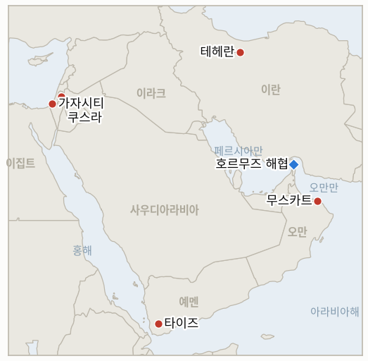

# 중동 일일 브리핑

**2026년 8월 27일**

- **보고 기간:** 약 24시간, 8월 26일 09:00 ~ 8월 27일 09:00 (한국시간)
- **종합 평가:** 수요일 가장 중대한 사건은 이란-호르무즈 축을 벗어난 곳에서 벌어졌다. 네타냐후 총리는 트럼프 대통령의 15개항 가자 평화안의 핵심인 무장해제 프레임워크를 공개적으로 거부했고, 유엔 평화이사회 특사 니콜라이 믈라데노프는 안전보장이사회에서 지금 휴전이 붕괴하면 이는 "차질"이 아니라 "모두에게 돌아올 수 없는 지점"이 될 것이며 "돌아갈 로드맵도, 배치할 행정 기구도, 재건할 현장도 남지 않을 것"이라고 경고했다. 호르무즈 트랙에서는 이란과 오만이 화요일 발표한 체계에 실질적인 기술적 내용을 더했다. 아라그치 외무장관과 오만 측 카운터파트가 기뢰 제거 공동성명을 발표했고, 가리바바디 부장관은 항로 폭이 7마일이며 이란 영해를 지난다고 명시했지만, 테헤란은 여전히 운영 개시일을 밝히지 않았고 혁명수비대는 통항 선박이 진입 전 이란의 허가와 감시를 받아야 한다고 밝혀, 근본적인 외교 문서는 여전히 서명되지 않은 채로 남았다. 유가는 이 점진적이지만 불완전한 진전을 이틀 연속 하락으로 반영했다. 오늘 두 개의 지표가 각각 정반대 방향으로 자체 시한에서 확정됐다. 코스피는 6,808.21로 마감해 붕괴 이전 기준선 6,869.83과 0.9%밖에 차이 나지 않아, 8월 19일의 폭락이 시장이 상당 부분 흡수한 일시적 충격이었음을 확증한 반면, 서안지구 쿠스라에서는 대대적으로 알려진 철거 이후 며칠 만에 정착민들이 전초기지 부지로 되돌아왔고 물과 전기는 여전히 끊긴 상태로, 이번 개입이 지속 가능한 철거로 이어졌다는 주장을 반증했다. 가자지구의 살상적이고 대체로 책임 소재가 불분명한 패턴은 계속돼, 휴전 이후 누적 사망자가 1,303명, 부상자가 4,336명에 이르러 보고 기간 중 7명이 늘었다. 예멘 전쟁은 정부군이 타이즈 알사파 전선에서 후티 반군의 공격을 격퇴하며 8명을 사살하고 15명에게 부상을 입혀 더욱 날카로워졌는데, 이는 수요일 공언된 "뼈아픈 타격" 작전의 첫 구체적 전과다.

---

## 1. 오늘의 주요 사건

<figure style="float:right; width:46%; margin:2pt 0 8pt 14pt;">

<figcaption style="font-size:8pt; color:#666; text-align:center; margin-top:3pt; font-style:italic;">주요 논의 지점</figcaption>
</figure>

### 1.1 네타냐후, 트럼프 평화안의 무장해제 프레임워크 거부, 유엔 특사는 "돌아올 수 없는 지점" 경고

네타냐후 총리는 트럼프 대통령의 15개항 가자 평화안의 핵심인 무장해제 프레임워크를 공개적으로 거부했다. 구체적으로 하마스가 새로운 팔레스타인 통치 기구에 무기를 넘기도록 하는 조항에 반대했으며, 하마스가 완전히 무장해제할 때까지 이스라엘군은 가자지구에서 철수하지 않을 것이라고 밝혔다([Al Jazeera](https://www.aljazeera.com/news/2026/8/26/israel-hamas-truce-failure-point-of-no-return-envoy-warns)). 같은 날 유엔 안전보장이사회에서 트럼프 대통령의 평화이사회 가자 담당 특사 니콜라이 믈라데노프는 휴전 절차가 붕괴하면 이는 단순한 "차질"이 아니라 "모두에게 돌아올 수 없는 지점"이 될 것이라며, 전투 재개는 "돌아갈 로드맵도, 배치할 행정 기구도, 재건할 현장도 남기지 않을 것"이라고 경고했다. 유엔 주재 팔레스타인 대사 리야드 만수르는 별도로 이스라엘이 서안지구 정착촌 확장, 구체적으로는 E1 사업을 통해 평화 전망을 고의로 훼손하고 있다고 비판했다. 2025년 10월부터 시행 중인 휴전 절차는 평화이사회 자체 집계로도 이미 최소 1,303명의 팔레스타인인 목숨을 앗아갔는데(§1.3 참조), 믈라데노프의 경고는 이 사망자 수를 완전한 붕괴가 초래할 재앙에 비하면 그나마 감당 가능한 비용으로 암묵적으로 취급하고 있는 셈이다. **신뢰도: 높음** — 네타냐후의 거부 발언과 믈라데노프의 발언 및 인용문(1~2등급, 실명 정부 수반 발언, 유엔 안보리 브리핑, 다수 출처). **신뢰도: 중간** — 이번 거부가 외교적으로 어떻게 처리될지는 보고 기간 중 미국 측 대응이 확인되지 않아 불확실하다.

### 1.2 이란-오만, 폭 7마일 호르무즈 항로 확정하고 기뢰 제거 공동성명 발표, 그러나 운영 개시일은 여전히 미정

화요일 발표된 체계를 바탕으로 이란의 카젬 가리바바디 외교부 부장관은 수요일 제안된 임시 호르무즈 통항 항로의 폭이 7마일(11.3km)이며, 입항 항로와 출항 항로의 일부가 모두 이란 영해를 지난다고 명시했고, 아라그치 외무장관과 오만 측 카운터파트는 해협의 기뢰 제거 사업에 관한 공동성명을 발표했다([Al Jazeera](https://www.aljazeera.com/news/2026/8/26/iran-oman-agree-on-temporary-hormuz-route-what-we-know)). 두 성명 모두 운영 개시일이나 정확한 좌표를 확정하지 않았으며, 혁명수비대 대변인은 통항 선박이 진입 전 이란의 허가와 감시를 받아야 한다고 밝혔다. 가리바바디 부장관은 이번 조치가 "임시 항로"일 뿐이며 해협의 재개방을 의미하지 않는다고 재차 강조하고, 완전한 재개방은 미국이 붕괴된 6월 양해각서상의 의무로 "복귀"해야 가능하다고 조건을 달았다. 오만 외무장관은 양측이 항로를 공식적으로 "곧 발표"하기를 희망하며 "해협의 향후 관리와 영구적 해법이 뒤따를 것"이라고 말했다. 유가는 이 점진적이지만 불완전한 진전을 이틀 연속 하락으로 반영했다. 브렌트유는 2.5% 내린 86.38달러, WTI유는 2.2% 내린 80.52달러로 각각 마감했는데, 이는 트레이더들이 걸프 지역 군사적 재확전에 대한 우려 완화와 안전한 통항로 전망을 함께 저울질한 결과다([CNBC](https://www.cnbc.com/2026/08/26/oil-falls-as-the-us-pivots-to-economic-pressure-on-iran-.html)). 한편 Kpler의 예비 선박 데이터에 따르면 화요일 호르무즈를 통항한 상선은 5척으로, LPG 운반선 2척과 역청 운반선 1척이 걸프 밖으로 나갔고 빈 석유제품 운반선 2척이 걸프만으로 들어왔는데, 이는 월요일의 2척보다는 늘었지만 10일 평균치인 15척에는 여전히 크게 못 미치는 수준이다([US News](https://www.usnews.com/news/world/articles/2026-08-26/gulf-ship-traffic-via-strait-of-hormuz-hovers-below-10-day-average-data-shows)). **신뢰도: 높음** — 항로 폭 명시, 기뢰 제거 공동성명, 유가 종가(1~2등급, 실명 부장관·혁명수비대 발언, 시장 데이터, 다수 매체). **신뢰도: 중간** — 통항 선박 수는 로이터나 UKMTO의 교차 확인이 아직 이뤄지지 않은 단일 예비 데이터다.

### 1.3 코스피, 붕괴 이전 기준선에서 0.9%까지 좁혀지며 5주간 지표 확증으로 마감

코스피는 수요일 0.97% 오른 6,808.21로 마감하며 8월 19일 폭락 이후 반등세를 이어갔다. 삼성전자(90~110조 원 규모 연간 주주환원안 승인)와 SK하이닉스(40조 원 규모 자사주 매입)의 자사주 매입 프로그램에 힘입은 기관 매수세가 개인(2조 2,500억 원 순매도)과 외국인(1,052억 원 순매도)의 지속적 매도세를 상쇄했다. 삼성전자는 1.75%, SK하이닉스는 0.6% 각각 상승했고, 코스닥은 0.03% 내린 826.87로 마감했다([Korea Times](https://www.koreatimes.co.kr/economy/20260826/kospi-inches-up-as-corporate-buying-offsets-foreign-retail-sell-offs)). 원화는 1.3원 강세로 1,384.8원에 마감했다. 오늘 종가는 IND-20260820-2가 추적해온 붕괴 이전 기준선 6,869.83에서 불과 0.90% 낮은 수준으로, 8월 19일 5.8% 폭락과 48번째 서킷브레이커 발동 이후 이 지표가 요구해온 자체 시한에서 "2% 이내" 확증 기준을 정식으로 충족했다. 이는 폭락이 미국 국채 금리와 전쟁 리스크가 복합된 지속적 재평가가 아니라, 시장이 상당 부분 되돌린 일시적 충격이었음을 뜻한다. **신뢰도: 높음** — 지수 수준, 종목별 등락, 매매 동향(1~2등급, 코리아타임스, 거래소 데이터, 실명 보도).

### 1.4 가자지구 휴전 이후 누적 사망자 1,303명, 정착민들 철거된 쿠스라 부지로 복귀하며 해당 지표 반증

가자지구 보건부는 수요일 직전 24시간 동안 병원에 사망자 7명이 새로 수용됐다고 밝혔다. 이 중 5명은 새로 기록된 사망이고 2명은 앞서 입은 부상으로 사망한 사례로, 2025년 10월 휴전 발효 이후 누적 사망자는 1,303명, 부상자는 4,336명에 달해 화요일 집계였던 1,296명·4,296명에서 늘었다(8월 26일자 브리핑 §1.3)([IMEMC](https://imemc.org/article/health-ministry-issues-latest-gaza-death-toll/)). 서안지구에서는 8월 20일 이스라엘군이 철거했다고 공표한, 쿠스라의 팔레스타인 가옥 세 채를 에워싼 전초기지 부지에 정착민들이 되돌아왔다. 이스라엘군은 병력을 배치했으며 철거된 구조물 인근의 팔레스타인 가족 가옥에서는 "작전을 벌이지 않을 것"이라고 밝혔지만, 포위된 가옥의 물과 전기는 여전히 끊긴 상태이며 현지 관계자들은 여전히 "이 지역에 대한 봉쇄"가 계속되고 있다고 전했다([Ynetnews](https://www.ynetnews.com/article/r1e8foolfe)). 자체 시한인 8월 27일경을 맞은 IND-20260813-3은 반증으로 확정됐다. 전초기지 또는 봉쇄가 지속 가능하게 제거되지 않고 실질적으로 여전히 유지되고 있어, 8월 중순 이래 이 원장이 쿠스라에서 추적해온 책임 추궁 없는 집행 패턴이 되풀이됐다. **신뢰도: 높음** — 가자지구 사망자 수치(1~2등급, 가자 보건부, 다수 매체). **신뢰도: 높음** — 쿠스라 전초기지 복귀와 지속되는 시설 단절(1~2등급, Ynetnews, 타임스 오브 이스라엘 보도 패턴). **신뢰도: 낮음** — 가자지구 개별 공습에 대한 이스라엘 측 표적 근거는 보고 기간 중 별도 입장이 확인되지 않아 판단하기 어렵다.

### 1.5 예멘 정부군, 타이즈 교전에서 후티 반군 8명 사살, 알알리미의 "뼈아픈 타격" 공언 첫 실전 시험

예멘 정부군은 타이즈시 북동쪽 칼라바 전선의 알사파 지역에서 후티 반군의 공격을 격퇴했다. 예멘군 언론센터는 이 교전으로 후티 반군 8명이 사살되고 15명이 부상했으며 "후티 측에 인명·장비 손실"이 발생했다고 밝혔고, 정부군 측 피해는 보고되지 않았다([Anadolu via Anews](https://www.anews.com.tr/world/2026/08/26/8-houthi-fighters-killed-in-clashes-in-yemens-taiz)). 후티 측은 즉각 입장을 밝히지 않았다. 이번 교전은 대통령지도위원회 의장 라샤드 알알리미가 화요일 공언한 후티 반군에 대한 "뼈아픈 타격"(8월 26일자 브리핑 §1.5) 이후 첫 구체적 전과이며, 이 원장이 마리브·알자우프·하드라마우트·호데이다·타이즈·알다레·라흐즈 등 여러 주에 걸쳐 추적해온 다전선 확산 패턴을 이어간다. **신뢰도: 높음** — 교전 지역과 후티 측 사상자 수(2~3등급, 예멘군 언론센터, 단일 군 출처 발표). **신뢰도: 중간** — 정확한 사상자 수는 독립적이거나 후티 측의 확인이 보고 기간 중 없어 불확실하다.

---

## 2. 심층 분석: 유인과 동기

### 2.1 네타냐후는 왜 트럼프 대통령 자신의 평화안을 조용히 협상하는 대신 공개적으로 거부했는가?

공개 거부는 네타냐후가 하마스의 완전한 무장해제를 이스라엘군 철수의 전제로 삼는 최대치의 입장을, 미국이 중재한 어떠한 타협안이 기정사실로 제시되기 전에 자신의 국내 연립 정부를 위해 선점할 수 있게 해주기 때문이다. 믈라데노프 스스로의 "돌아올 수 없는 지점" 발언이 보여주듯 워싱턴이 휴전의 존속에 이미 크게 투자했다는 점을 감안하면, 이는 이스라엘이 단순히 합의안을 받아들이기보다 그 조건 자체를 재편할 지렛대를 확보했다는 도박이며, 설령 그 대가가 행정부 자체 구상과의 이례적으로 직접적인 결별이라 해도 감수할 만하다고 판단한 것이다.

### 2.2 이란과 오만은 왜 호르무즈 체계를 실질화할 운영 개시일은 여전히 보류하면서 항로 폭, 기뢰 제거 성명 같은 기술적 세부 사항만 계속 추가하는가?

기술적 세부 사항을 점진적으로 공개하면 양측 모두 파키스탄 같은 중재자와 유가 시장으로부터 가시적 진전에 대한 신뢰를 얻으면서도, 가리바바디가 계속 반복하는 실질적 조건, 즉 완전한 재개방은 미국이 붕괴된 6월 양해각서상의 의무로 복귀해야 가능하다는 조건을 양보할 필요가 없기 때문이다. 따라서 세부 사항 공개는 비용이 들지 않는 성의 표시 역할을 할 뿐, 혁명수비대의 허가·감시 체계가 실질적으로 개방된 통항을 대체할 준비가 테헤란에 실제로 되어 있는지를 시험할 운영상의 확약, 즉 확정된 개시일이나 서명된 문서에는 한참 못 미친다.

### 2.3 코스피가 붕괴 이전 수준 1% 이내로 회복한 것은 왜 중동 리스크 완화가 아니라 삼성전자·SK하이닉스의 자사주 매입 흐름에서 비롯됐는가?

폭락 자체가 미국 30년물 국채 금리 충격과 중동 지정학적 충격이 결합한 복합적 사건이었고, 이 원장이 반복적으로 구분해온 두 축(8월 25일자 브리핑 §2.3)은 서로 다른 메커니즘으로 회복하기 때문이다. 반도체 기업의 자사주 매입은 삼성전자와 SK하이닉스가 지수에서 차지하는 비중을 감안하면 나스닥 심리와 연동되는 기업 특유의 지렛대로, 서명되지 않은 호르무즈 항로나 해결되지 않은 평화안 갈등처럼 근본적인 중동 리스크가 전혀 완화되지 않은 상태에서도 증시의 피해를 복구할 수 있다. 따라서 코스피 지표의 확증은 이 지역의 탈긴장화보다는 한국 기업의 자본 배분에 관해 더 많은 것을 말해준다.

### 2.4 정착민들은 왜 이스라엘군 스스로 대대적으로 알린 철거 직후 며칠 만에 쿠스라 전초기지 부지로 되돌아왔는가?

이스라엘군이 텐트 구조물을 철거하면서도 봉쇄를 유지해온 정착민 개인들에 대해서는 병행된 집행 조치, 즉 체포나 재진입 금지 명령의 실질적 시행 없이 넘어갔기 때문이다. 이는 물리적 구조물을 표적으로 삼을 뿐 부지를 유지해온 정착민 개인은 표적으로 삼지 않는 방식으로, 텐트를 철거하면서도 같은 정착민들이 자유롭게 되돌아올 수 있도록 방치하면 예측 가능하게 팔레스타인 가족을 압박하는 거점으로서 이 부지가 다시 사용된다. 이는 봉쇄 초기 몇 주 동안 주민들이 기자들에게 전한 "카메라용으로 연출된" 패턴 그대로다.

### 2.5 예멘 정부는 왜 알알리미의 "뼈아픈 타격" 공언 하루 만에 후티 반군 8명 사살이라는 교전 전과를 만들어냈는가?

공언을 24시간 안에 문서화된 전장의 전과로 전환하면 아덴 정부는 이번 작전이 단순한 수사가 아니라 실질적임을 국내와 국제 양쪽 청중에게 입증할 수 있기 때문이다. 수년간 이어져온 조용한 소모전 이후 정부의 신뢰도를 저울질하는 국내 여론과, 예멘 전쟁이 7개 주에 걸쳐 확산되는 것을 이미 주시해온 국제 관측자 모두에게, 화요일 공언된 작전이 없었을 때보다 지금 공식 발표된 가시적 사상자 수치가 훨씬 더 큰 가치를 지닌다.

---

## 3. 한국에 대한 정책적 함의

### 3.1 노출 현황 스냅숏

| 항목 | 현재 수치 | 출처 |
| --- | --- | --- |
| 원유 수입 중 중동산 비중 | 48.5%(2026년 5~7월), 전년 동기 69.1%에서 하락; 비중동산 비중이 사상 처음 50% 상회 | KNOC via 아시아경제; `korea-exposure.md` |
| 7~8월 원유 확보량 | 전년 동기 대비 110% 이상 확보(산업통상자원부, 7월 21일); 전략비축유 스와프 8월까지 연장, 현재까지 약 2,100만 배럴 스와프 | 산업통상자원부 via 헤럴드경제, 한경; `korea-exposure.md` |
| 9월 원유 확보량 | 90% 이상 확보(산업통상자원부, 7월 21일) | 산업통상자원부 via 헤럴드경제; `korea-exposure.md` |
| 홍해 우회 경로 | 한국행 원유는 얀부·홍해 우회로를 계속 이용 중; 얀부에서 한국을 포함한 아시아 구매자로의 수출량이 전년 동기 하루 100만 배럴 미만에서 약 400만 배럴로 급증 | Lloyd's List Intelligence; `korea-exposure.md` |
| 전략비축유 대응력 | 실제 소비량 기준 약 26일분(추정); 스와프는 즉시 대기 상태이나 대규모 실행은 검증되지 않음 | CSIS; 산업통상자원부 7월 27일 |
| 정유사 사우디 지분 노출 | S-Oil(사우디 아람코 지분 약 63%), HD현대오일뱅크(아람코 지분 약 17%) | 공시자료; `korea-exposure.md` |
| 브렌트유/WTI유 | 수요일 각각 86.38달러(-2.5%)/80.52달러(-2.2%)로 마감, 이란-오만 호르무즈 체계가 운영 개시일 없이 세부 사항만 확정되며 이틀 연속 하락 | CNBC |
| 코스피/원달러 환율 | 코스피는 0.97% 오른 6,808.21로 마감해 붕괴 이전 기준선에서 0.9% 차이; 원화는 1.3원 강세로 1,384.8원 | Korea Times |
| 호르무즈 통항량 | 화요일(8월 25일) 5척 통항(Kpler 예비 데이터), 월요일의 2척보다는 늘었지만 10일 평균치 15척에는 여전히 크게 못 미침 | US News/Kpler |

### 3.2 사안별 함의

**네타냐후의 트럼프 평화안 무장해제 프레임워크 공개 거부와 믈라데노프의 "돌아올 수 없는 지점" 경고는 이 원장이 지금까지 문서화한 것 중 워싱턴의 휴전 체계와 이스라엘 자체의 협상 입장 사이에 처음으로 진정한 균열이 드러난 사례이며, 폭넓은 중동 안정성 리스크를 추적하는 한국 정책 당국은 이를 일상적 마찰이 아니라 실질적으로 새로운 불확실성 요인으로 다뤄야 한다.** 신규 IND-20260827-1은 이번 거부가 향후 일주일 안에 공식적인 미국 측 대응으로 이어지는지, 아니면 아무런 결과 없이 흡수되는지를 시험한다.

**이란-오만 호르무즈 항로의 세부 사항 확정, 확정된 7마일 폭과 기뢰 제거 공동성명은 이 트랙을 IND-20260816-3(서명되고 운영 개시일이 명시된 공동성명, 시한 9월 5일)의 확증 기준에 그 어느 때보다 가깝게 근접시켰지만, 확정된 개시일이 여전히 없다는 점에서 한국의 원유 조달 담당자들은 아직 이 항로를 운영 중인 것으로 간주해서는 안 된다.** 신규 IND-20260827-2는 모기 지표의 서명·개시일 요건보다 낮은 기준으로, 혁명수비대의 허가 체계 아래서 향후 일주일 안에 실제 선박 한 척이라도 이 새 항로를 이용한 사례가 문서화되는지를 시험한다.

**코스피가 붕괴 이전 기준선에서 0.9% 이내로 회복하며 IND-20260820-2가 확증으로 마무리된 것은 한국 시장 참가자들에게 실질적으로 안심할 만한 지표이지만, 2.3절의 탈동조화 분석에 따르면 이를 중동 리스크 자체가 완화됐다는 근거로 읽어서는 안 된다. 서명되지 않은 호르무즈 체계 아래서 유가가 이틀 연속 하락한 것이 그 별개 축에 더 관련성 높은 신호다.** 한국 정책 당국은 8월 중순 이래 이 원장이 권고해온 대로 증시 회복과 유가·해상운송 리스크 축을 계속 별도로 모니터링해야 한다.

**가자지구의 지속되는 살상 패턴과 쿠스라 철거의 반증 확정은 한국 시장에 직접적인 경로는 없지만, 외교적 절차와 현장 집행 사이의 이행 격차가 여전히 크다는 점을 재확인시켜준다. 이는 폭넓은 중동 리스크 프리미엄을 추적하는 한국 정책 당국이 위의 시장 직결 지표들과 함께 계속 주시해야 할 일반적 지역 안정성 신호다.** IND-20260821-2(쿠스라의 식량·의약품 부족, 시한 8월 28일)는 보고 기간 중 재공급이 확인되지 않은 채 시한을 하루 앞두고 있다.

**예멘의 새로 실증된 "뼈아픈 타격" 작전은 이제 후티 반군 8명 사살이라는 구체적 전과를 남기며, 오늘 직접적인 해상 피해 사례는 없었지만 한국의 얀부 우회로와 관련된 홍해 항로 리스크를 더욱 날카롭게 한다.** IND-20260817-1(예멘의 확인된 확산이 국제 중재를 이끌어내는지, 시한 8월 31일)이 오늘의 확전과 가장 직접적으로 연관된 지표로 남아 있다.

**검증 가능한 지표:**

- **IND-20260827-1** — 네타냐후의 트럼프 평화안 무장해제 프레임워크 공개 거부가 향후 일주일 안에 공식적인 미국 측 대응(대통령 성명, 특사 파견, 계획 수정)으로 이어지거나, 휴전 절차가 공식적인 미국 측 대응 없이 계속된다. 2026년 9월 2일경까지 이번 거부에 대응하는 문서화된 미국 측 조치가 확인되면 워싱턴이 이 균열을 실질적인 것으로 다루고 있음을 확증하며, 같은 시점까지 그러한 대응이 없으면 이번 거부가 절차의 향방을 바꾸지 못한 채 흡수됐음을 반증한다.
- **IND-20260827-2** — 폭 7마일에 혁명수비대의 허가·감시 체계가 적용된 이란-오만 호르무즈 항로가 새 절차 아래 첫 문서화된 선박 통항 사례를 만들어내거나, 어떤 선박도 이용했다는 보고 없이 이론적 수준에 머문다. 2026년 9월 2일경까지 발표된 항로를 이용한 선박 통항이 검증되면 이 체계가 모기 지표의 서명 시한보다 앞서 문서상 발표에서 실제 운영 현실로 전환됐음을 확증하며, 같은 시점까지 그러한 통항이 없으면 이 항로가 실제 작동하는 통항로가 아니라 외교적 발표 수준에 머물러 있음을 반증한다.

---

## 4. 주시 목록

- **쿠스라의 식량·의약품 부족 사태가 이스라엘의 개입을 이끌어내는지 아니면 문서화된 인도적 위기로 굳어지는지, 재공급이 아직 확인되지 않은 채 시한을 하루 앞두고 있음** (IND-20260821-2, 시한 8월 28일).
- **이스라엘의 연 발사 "공습 강화" 위협이 문서화된 확전으로 이어지는지, 아니면 기존 표적 작전과 구분되지 않는 수준에 머무는지** (IND-20260824-2, 시한 8월 30일).
- **8월 15일 헤즈볼라-이스라엘 교전이 추가 라운드로 이어지는지 아니면 양측이 휴전 이후 균형으로 물러서는지** (IND-20260816-1, 시한 8월 29일).
- **가자지구 옐로라인 사건들이 이스라엘군의 공식 작전 대응을 촉발하는지 아니면 고립된 사례로 남는지** (IND-20260816-2, 시한 8월 30일).
- **예멘의 확인된 확산이 국제 중재를 이끌어내는지, 후티 반군 8명 사살이라는 구체적 타이즈 전과로 더욱 날카로워진 상태** (IND-20260817-1, 시한 8월 31일).
- **호르무즈를 미국 영토로 만들겠다는 트럼프의 선언이 반복된 수사를 넘어 구체적 정책 조치로 이어지는지** (IND-20260817-2, 시한 8월 31일).
- **이스라엘이 준비한 알리 알타헤르 능선 작전이 실제로 개시되는지** (IND-20260818-2, 시한 8월 31일).
- **베선트 제재 패키지가 "이번 주 안"으로 예고한 대형 금융기관 지정이 실현되는지** (IND-20260825-1, 시한 8월 29일).
- **로마 트랙의 9월 1일 예정 8차 회담이 예정대로 진행되는지** (IND-20260807-2, 시한 9월 1일).
- **오만을 폭격하겠다는 트럼프의 위협이 실제 외교적·군사적 결과로 이어지는지** (IND-20260818-1, 시한 9월 1일).
- **후티 반군의 모카 인근 사우디 해군 함정 공격 주장이 확인되거나 사우디의 직접 대응을 이끌어내는지** (IND-20260818-3, 시한 9월 1일).
- **카츠의 미조율 서안지구 경찰 이양이 예정대로 진행되는지, 지연되는지, 혹은 무산되는지** (IND-20260819-2, 시한 9월 1일).
- **미노안 디그니티호 치명적 피격 사건의 책임 소재가 규명되거나 군사적 대응으로 이어지는지** (IND-20260819-1, 시한 9월 2일).
- **국무부의 중동 공관 외교관 복귀 계획이 진행되는지 아니면 지연되는지** (IND-20260826-1, 시한 9월 2일).
- **네타냐후의 트럼프 평화안 거부가 공식적인 미국 측 대응으로 이어지는지** (IND-20260827-1, 시한 9월 2일).
- **새 이란-오만 호르무즈 항로를 이용한 선박 통항 사례가 문서화되는지** (IND-20260827-2, 시한 9월 2일).
- **운영 개시일이 명시된 이란-오만 호르무즈 공동성명이 서명되는지, 이제 확정된 7마일 항로 폭과 기뢰 제거 공동성명은 있으나 여전히 개시일이 없는 상태** (IND-20260816-3, 시한 9월 5일).
- **아부 알두후르 공습을 둘러싼 튀르키예-이스라엘 갈등이 확전되는지 아니면 흡수되는지** (IND-20260823-1, 시한 9월 6일).
- **이스라엘군의 서안지구 "경계선" 경고 이후 실제 폭력 양상의 단계적 변화가 뒤따르는지** (IND-20260823-2, 시한 9월 6일).
- **배럭의 연이은 논란이 실제 미국 정책이나 인사 조치로 이어지는지** (IND-20260824-1, 시한 9월 6일).
- **자나타에서 이스라엘 활동가와 AFP 기자를 공격한 사건이 체포로 이어지는지** (IND-20260826-2, 시한 9월 8일).
- **마사페르 야타 체포가 지속적인 정착민 집행 강화로 이어지는지 아니면 고립된 사례로 남는지** (IND-20260825-2, 시한 9월 8일).
- **시리아 핵물질 발견이 최종 합의와 검증된 제거로 이어지는지** (IND-20260812-2, 시한 9월 11일).
- **서안지구 이스라엘군-경찰 집행 이양이 정착민 폭력을 줄이는지 아니면 변화 없이 유지되는지** (IND-20260815-2, 시한 9월 12일).
- **이란의 경고에도 불구하고 시리아가 레바논 내 헤즈볼라에 조치를 취하는지, 아니면 대치가 수사에 머무는지** (IND-20260815-3, 시한 9월 15일).
- **케인 상원의원의 오만 관련 전쟁권한 결의안이 9월 상원 복귀 시 통과되는지, 부결되는지, 아니면 본회의 표결에 이르지 못하는지** (IND-20260819-3, 시한 9월 25일).
- **오늘의 타이즈 전과로 더욱 날카로워진 예멘 교전이 극적인 추가 확전으로 이어지는지, 아니면 소모전 양상으로 굳어지는지.**
- **이란의 피격 핵시설에 대한 IAEA 접근 차단이 새로운 사찰 프로토콜로 해소되는지, 아니면 지속적인 대치로 굳어지는지.**
- **캐롤라인 베젠기호 기름 유출 사고가 인양 작업 개시 이후 통제되는지.**
- **케슘섬 폭발 사건이 실제 공격으로 확인되는지, 아니면 오경보로 결론 나는지.**

---

## 5. 출처 품질 요약

| 주장 | 출처 | 신뢰도 |
| --- | --- | --- |
| 네타냐후의 트럼프 평화안 무장해제 프레임워크 거부 | Al Jazeera(2등급, 실명 정부 수반 발언, 유엔 안보리 맥락) | 높음 |
| 믈라데노프의 유엔 안보리 "돌아올 수 없는 지점" 경고 | Al Jazeera, 평화이사회 특사 자신의 안보리 브리핑 인용(2등급, 실명 유엔 관계자) | 높음 |
| 이란-오만 항로 폭, 기뢰 제거 공동성명, 혁명수비대 허가 체계 | Al Jazeera(2등급, 실명 부장관·혁명수비대 발언) | 발표된 조건 자체는 높음; 서명된 문서로 이어질지는 중간 |
| 브렌트유·WTI유 종가 | CNBC(1등급, 시장 데이터) | 높음 |
| 화요일 호르무즈 통항 선박 5척 | US News, Kpler 예비 데이터 인용(1~2등급, 단일 선박추적 업체, 교차 확인 전) | 중간 |
| 코스피 종가, 삼성전자·SK하이닉스 등락, 매매 동향 | Korea Times(1~2등급, 거래소 데이터, 실명 보도) | 높음 |
| 원달러 환율 종가 | Korea Times | 중간, 두 번째 한국 매체와 아직 교차 확인되지 않은 수치 |
| 가자지구 휴전 이후 누적 사망자 1,303명·부상자 4,336명 | IMEMC, 가자 보건부 인용(2~3등급, 공식 보건부 수치) | 높음 |
| 쿠스라 전초기지 정착민 복귀 및 지속되는 시설 단절 | Ynetnews(2등급, 현장 보도, 이스라엘군 발표) | 높음 |
| 예멘 타이즈 교전 및 후티 측 사상자 수 | Anadolu via Anews(2~3등급, 단일 예멘군 언론센터 발표) | 교전 발생 자체는 높음; 정확한 사상자 수는 중간, 독립 확인 없음 |

