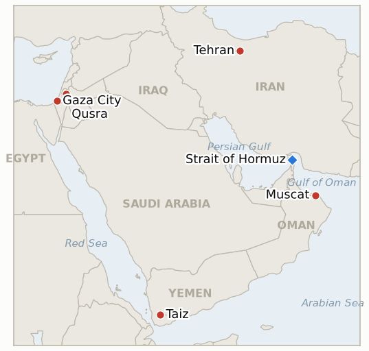

# Middle East Daily Briefing

**August 27, 2026**

- **Reporting window:** ~24 hours, August 26, 09:00 to August 27, 09:00 KST
- **Overall assessment:** Wednesday's most consequential development sat outside the war's usual Iran/Hormuz axis: Prime Minister Netanyahu publicly rejected the disarmament framework at the heart of Trump's 15-point Gaza peace plan, and UN Board of Peace envoy Nickolay Mladenov warned the Security Council that a ceasefire collapse now would be "not a setback" but "a point of no return for everyone," with "no roadmap to return to." On the Hormuz track, Iran and Oman added real technical substance to Tuesday's framework, Foreign Minister Araghchi and his Omani counterpart issued a joint mine clearing statement and Deputy Foreign Minister Gharibabadi specified a seven mile wide corridor running through Iranian waters, but Tehran still withheld an operating date and the IRGC said any vessel will need Iranian permission and surveillance before entry, leaving the underlying diplomatic instrument still unsigned; oil priced the framework's incremental but incomplete progress with a second straight decline. Two indicators resolved at their own deadlines today, in opposite directions: KOSPI's close of 6,808.21 sits within 0.9% of the pre-crash 6,869.83 reference, confirming that August 19's crash was a shock the market has substantially absorbed rather than a durable repricing, while at Qusra in the West Bank, settlers returned to the outpost site within days of its publicized dismantlement and water and electricity remained cut, falsifying any claim that the intervention produced a durable removal. Gaza's lethal, largely unclaimed pattern continued, the post-ceasefire toll reaching 1,303 killed and 4,336 wounded, a seven person increase in the window. Yemen's war sharpened further as government forces repelled a Houthi attack on Taiz's Al-Safa front, killing eight Houthi fighters and wounding fifteen, the first concrete combat result under Wednesday's "painful strikes" vow.

---

## 1. What Happened

<figure style="float:right; width:46%; margin:2pt 0 8pt 14pt;">

<figcaption style="font-size:8pt; color:#666; text-align:center; margin-top:3pt; font-style:italic;">Major places of discussion</figcaption>
</figure>

### 1.1 Netanyahu Rejects Trump's Peace Plan Disarmament Framework as UN Envoy Warns of a "Point of No Return"

Prime Minister Netanyahu publicly rejected the core disarmament framework of President Trump's 15-point Gaza peace plan, objecting specifically to the provision under which Hamas would hand its weapons to a new Palestinian governing body, and stated Israel will not withdraw its forces from Gaza until Hamas fully disarms ([Al Jazeera](https://www.aljazeera.com/news/2026/8/26/israel-hamas-truce-failure-point-of-no-return-envoy-warns)). Addressing the UN Security Council the same day, Nickolay Mladenov, high representative for Gaza on Trump's Board of Peace, warned that a collapse of the ceasefire process would not be a mere "setback" but "a point of no return for everyone," saying renewed fighting would leave "no roadmap to return to, there will be no administration to deploy and there will be nothing left on the ground to rebuild." Palestinian UN Ambassador Riyad Mansour separately accused Israel of deliberately sabotaging peace prospects through West Bank settlement expansion, specifically the E1 project. The ceasefire process, in effect since October 2025, has by the Board of Peace's own accounting already cost at least 1,303 Palestinian lives since it began (§1.3 below), a toll Mladenov's warning implicitly treats as the survivable cost of a process that a full collapse would make catastrophically worse. **Confidence: High** on Netanyahu's rejection and Mladenov's statement and quotes (Tier 1-2, on-record head of government statement, UN Security Council briefing, multi-source); Medium on how the rejection will be handled diplomatically, since no US response had been reported in the window.

### 1.2 Iran and Oman Specify a Seven Mile Wide Hormuz Corridor and Issue a Joint Mine Clearing Statement, but Still Withhold an Operating Date

Building on Tuesday's framework, Iran's Deputy Foreign Minister Kazem Gharibabadi specified Wednesday that the proposed temporary Hormuz transit corridor would be seven miles (11.3 km) wide, with the inbound route and part of the outbound route both running through Iranian territorial waters, while Foreign Minister Araghchi and Oman's foreign minister issued a joint statement on a project to clear mines from the strait ([Al Jazeera](https://www.aljazeera.com/news/2026/8/26/iran-oman-agree-on-temporary-hormuz-route-what-we-know)). Neither statement fixed an operating date or coordinates; an IRGC spokesperson said vessels will require Iranian permission and surveillance before entering the corridor, and Gharibabadi reiterated the arrangement is "a temporary route" that does not mean the strait is reopening, conditioning any fuller reopening on the US "returning to its commitments" under the collapsed June MOU. Oman's foreign minister said the two sides hoped to "soon announce" the corridor formally, with "future management of the strait and a permanent solution will follow." Oil priced the incremental but still incomplete progress with a second consecutive decline: Brent settled down 2.5% to $86.38 and WTI fell 2.2% to $80.52, as traders weighed prospects for a safe transit route alongside easing concern about renewed military conflict in the Gulf ([CNBC](https://www.cnbc.com/2026/08/26/oil-falls-as-the-us-pivots-to-economic-pressure-on-iran-.html)). Separately, preliminary Kpler shipping data showed five commodity vessels transited Hormuz Tuesday, two LPG tankers and one bitumen tanker exiting and two empty product tankers entering, up from Monday's two but still well below the ten day average of fifteen ([US News](https://www.usnews.com/news/world/articles/2026-08-26/gulf-ship-traffic-via-strait-of-hormuz-hovers-below-10-day-average-data-shows)). **Confidence: High** on the corridor's specified width, the joint mine clearing statement, and the oil settle levels (Tier 1-2, on-record deputy foreign minister and IRGC statements, market data, multi-outlet); Medium on the transit count, a single preliminary shiptracker print not yet cross-confirmed by Reuters or UKMTO.

### 1.3 KOSPI Closes Within 0.9% of Its Pre-Crash Level, Resolving a Five-Week Indicator Confirmed

KOSPI closed up 0.97% at 6,808.21 Wednesday, extending its recovery from August 19's crash, as corporate buying tied to Samsung Electronics' and SK hynix's share buyback programs (Samsung's approved 90-110 trillion won annual shareholder return plan and SK hynix's 40 trillion won repurchase) offset continued net selling by retail investors (2.25 trillion won) and foreign investors (105.2 billion won); Samsung rose 1.75% and SK hynix 0.6%, while the secondary Kosdaq index eased 0.03% to 826.87 ([Korea Times](https://www.koreatimes.co.kr/economy/20260826/kospi-inches-up-as-corporate-buying-offsets-foreign-retail-sell-offs)). The won firmed 1.3 won to 1,384.8 per dollar. Today's close sits just 0.90% below the pre-crash reference level of 6,869.83 that IND-20260820-2 has tracked since the index's 5.8% crash and 48th circuit breaker activation on August 19, formally clearing the indicator's "within 2%" confirming bar at its own deadline: the crash reads as a one-day shock the market has substantially reversed rather than a durable repricing tied to compounding war and Treasury-yield risk. **Confidence: High** on the index level, sector moves and flow data (Tier 1-2, Korea Times, exchange data, on-record reporting).

### 1.4 Gaza's Post-Ceasefire Toll Reaches 1,303 as Settlers Return to the Besieged Qusra Site, Falsifying Its Dismantlement Indicator

Gaza's health ministry said Wednesday that seven more people had been received dead at hospitals in the preceding 24 hours, five newly recorded and two who died of wounds sustained earlier, putting the toll since the October 2025 ceasefire at 1,303 killed and 4,336 wounded, up from 1,296 and 4,296 as of Tuesday's count (brief 2026-08-26, §1.3) ([IMEMC](https://imemc.org/article/health-ministry-issues-latest-gaza-death-toll/)). In the West Bank, the outpost besieging three Palestinian homes in Qusra, publicized as dismantled by Israeli forces on August 20, saw settlers return to the site; the IDF has deployed troops and says it "will not operate in the home of the Palestinian family" near the demolished structures, but water and electricity to the besieged homes remain cut and local officials describe continued "a siege on the area" ([Ynetnews](https://www.ynetnews.com/article/r1e8foolfe)). At its own ~August 27 deadline, IND-20260813-3 resolves falsified: the outpost or the siege in substance is still standing rather than durably removed, extending the same pattern of enforcement without accountability this ledger has tracked at Qusra since mid-August. **Confidence: High** on the Gaza toll figures (Tier 1-2, Gaza health ministry, multi-outlet); High on the Qusra outpost's return and continued utility cutoff (Tier 1-2, Ynetnews, Times of Israel reporting pattern); Low on the IDF's targeting rationale for individual Gaza strikes in the window, since no Israeli statement addressing specific incidents was available.

### 1.5 Yemen's Government Forces Kill Eight Houthi Fighters Repelling a Taiz Attack, the First Test of al-Alimi's "Painful Strikes" Vow

Yemeni government forces repelled a Houthi attack in the Al-Safa area of the Kalabah front, northeast of Taiz city, in fighting the Yemeni Armed Forces' media center said killed eight Houthi fighters and wounded fifteen, with "casualties and equipment losses among the Houthis"; no government casualties were reported ([Anadolu via Anews](https://www.anews.com.tr/world/2026/08/26/8-houthi-fighters-killed-in-clashes-in-yemens-taiz)). The Houthis did not immediately comment. The clash is the first concrete combat result following Presidential Leadership Council chairman Rashad al-Alimi's Tuesday vow of "painful strikes" on Houthi positions (brief 2026-08-26, §1.5), and extends a broader multi-front pattern this ledger has tracked across Marib, al-Jawf, Hadramaut, Hodeidah, Taiz, al-Dhale and Lahj provinces. **Confidence: High** on the clash location and Houthi casualty figures as reported (Tier 2-3, Yemeni Armed Forces media center, single-source military statement); Medium on the precise casualty count, since no independent or Houthi-side confirmation was available in the window.

---

## 2. Deep Dive: Incentives and Motives

### 2.1 Why would Netanyahu publicly reject Trump's own peace plan rather than negotiate its disarmament terms quietly?

Because a public rejection lets Netanyahu stake out a maximalist position, full Hamas disarmament before any Israeli withdrawal, for his own domestic coalition before any US-brokered compromise can be presented as a fait accompli, betting that Washington's investment in the ceasefire's survival (underscored by Mladenov's own "point of no return" framing) gives Israel leverage to reshape the plan's terms rather than simply accept them, even at the cost of an unusually direct break with the administration's own initiative.

### 2.2 Why would Iran and Oman keep adding technical specifics, corridor width, a mine-clearing statement, to the Hormuz framework while still withholding the operating date that would make it real?

Because publishing incremental technical detail lets both sides claim visible progress and bank goodwill from oil markets and mediators like Pakistan without Iran having to concede the substantive point Gharibabadi keeps repeating, that full reopening waits on the US honoring the collapsed June MOU, so the specifics serve as a costless demonstration of good faith that stops well short of the operational commitment (a fixed start date, a signed instrument) that would test whether Tehran is actually prepared to let the IRGC's permission-and-surveillance regime substitute for genuinely open transit.

### 2.3 Why would KOSPI's recovery to within 1% of its pre-crash level trace to Samsung and SK hynix buyback flows rather than any easing of Middle East risk specifically?

Because the crash itself was compound, a combined US 30-year Treasury-yield shock and Middle East geopolitical shock, and the two tracks this ledger has repeatedly separated (brief 2026-08-25, §2.3) recover on different mechanisms: chipmaker buybacks are a company-specific, Nasdaq-correlated lever that can repair the equity-market damage even while the underlying Middle East risk (an unsigned Hormuz corridor, an unresolved peace-plan dispute) remains as unresolved as ever, meaning the KOSPI indicator's confirmation says more about Korean corporate capital allocation than about any de-escalation in the region driving Korean policy exposure.

### 2.4 Why would settlers return to the Qusra outpost site within days of a dismantlement the IDF itself publicized?

Because the IDF's demolition of tent structures without a parallel enforcement mechanism against the settlers themselves, no arrests, no barred re-entry order enforced against them, treats the outpost's physical structures as the target rather than the individuals maintaining the siege, so removing tents while leaving the same settlers free to return predictably reproduces the site's use as a base for pressuring the Palestinian families, the same "staged for the cameras" pattern residents described to reporters throughout the siege's first weeks.

### 2.5 Why would Yemen's government escalate to an eight-Houthi-killed engagement now, one day after al-Alimi's public "painful strikes" vow?

Because converting a public vow into a documented battlefield result within 24 hours lets Aden demonstrate the campaign is substantive rather than rhetorical, both to a domestic audience weighing the government's credibility after years of quieter attritional fighting and to international observers already watching Yemen's war widen across seven provinces, making a visible, officially announced casualty count more valuable now than it would be absent Tuesday's declared campaign.

---

## 3. Policy Implications for South Korea

### 3.1 Exposure snapshot

| Item | Current reading | Source |
| --- | --- | --- |
| Middle East share of crude imports | 48.5% (May-July 2026), down from 69.1% a year earlier; non-Middle East share crossed 50% for the first time on record | KNOC via Asia Business Daily; `korea-exposure.md` |
| July-August crude procurement | 110%+ of prior-year volume secured (MOTIE, July 21); strategic reserve swap extended through August, ~21 million barrels swapped to date | MOTIE via Herald Business, Hankyung; `korea-exposure.md` |
| September crude procurement | 90%+ secured (MOTIE, July 21) | MOTIE via Herald Business; `korea-exposure.md` |
| Red Sea detour routing | Korean-bound crude cargoes continue via the Yanbu/Red Sea workaround; Yanbu exports to Asian buyers including Korea have surged to ~4 million bpd from under 1 million bpd a year earlier | Lloyd's List Intelligence; `korea-exposure.md` |
| Strategic reserve coverage | ~26 days of actual consumption (estimate); swap on immediate standby, untested at scale | CSIS; MOTIE July 27 |
| Refiner Saudi ownership exposure | S-Oil (Saudi Aramco majority ~63%), HD Hyundai Oilbank (Aramco ~17%) | Public filings; `korea-exposure.md` |
| Brent / WTI | Settle $86.38 (-2.5%) / $80.52 (-2.2%) Wednesday, a second straight decline as the Iran-Oman Hormuz framework firmed up without a fixed operating date | CNBC |
| KOSPI / USD-KRW | KOSPI +0.97% to 6,808.21, within 0.9% of its pre-crash reference; won firmed 1.3 won to 1,384.8 | Korea Times |
| Hormuz transits | 5 vessels transited Tuesday Aug 25 (preliminary Kpler data), up from Monday's 2 but still well below the 10-day average of 15 | US News/Kpler |

### 3.2 Implications by development

**Netanyahu's public rejection of Trump's peace plan disarmament framework, paired with Mladenov's "point of no return" warning, is the first genuinely open daylight this ledger has documented between Washington's ceasefire architecture and Israel's own negotiating position, and Korean planners tracking broader Middle East stability risk should treat it as a materially new source of uncertainty rather than routine friction.** New IND-20260827-1 tests whether this rejection produces a formal US response or is absorbed without consequence over the coming week.

**The Iran-Oman Hormuz corridor's added technical specificity, a defined seven-mile width and a joint mine-clearing statement, moves the diplomatic track closer to IND-20260816-3's confirming bar (a signed joint statement with an operating date, deadline September 5) than at any prior point, but the absence of a fixed start date means Korean crude planners should not yet treat the corridor as operational.** New IND-20260827-2 tests the narrower, more concrete question of whether any vessel is documented using the new corridor under the IRGC's permission regime within the next week, a lower bar than the parent indicator's full signature-and-date requirement.

**KOSPI's confirmed recovery to within 0.9% of its pre-crash level closes out IND-20260820-2 and is a genuinely reassuring data point for Korean market-watchers, but section 2.3's decoupling analysis means it should not be read as evidence that Middle East risk specifically has eased; oil's second straight decline on an unsigned Hormuz framework is the more relevant signal for that separate track.** Korean policymakers should keep the equity-recovery and oil/shipping risk channels in separate monitoring frameworks going forward, as this ledger has recommended since mid-August.

**Gaza's continuing lethal pattern and the Qusra dismantlement's falsification carry no direct Korean market channel but reinforce that the ceasefire's implementation gap between diplomatic process and ground-level enforcement remains wide, the general regional-stability signal Korean planners tracking broader Middle East risk premium should keep weighing alongside the more market-direct indicators above.** IND-20260821-2 (Qusra's food and medicine shortage, deadline August 28) remains open with no resupply reported in the window, one day from its own deadline.

**Yemen's newly demonstrated "painful strikes" campaign, now with a concrete eight-Houthi-killed result, sharpens the Red Sea corridor risk relevant to Korea's Yanbu workaround even without a direct shipping incident reported today.** IND-20260817-1 (whether Yemen's confirmed spread draws renewed international mediation, deadline August 31) remains the indicator most directly engaged by today's escalation.

**Testable indicators:**

- **IND-20260827-1** — Netanyahu's public rejection of Trump's 15-point peace plan's disarmament framework either draws a formal US response (a presidential statement, an envoy shuttle mission, a revised plan) within about a week, or the ceasefire process continues with no formal US reaction reported. A documented US response addressing the rejection by ~2026-09-02 confirms Washington treats the break as consequential; no such response by the same date falsifies it, showing the rejection was absorbed without altering the process's course.
- **IND-20260827-2** — The Iran-Oman Hormuz corridor, now specified as seven miles wide with an IRGC permission-and-surveillance regime, either produces its first documented vessel transit under the new protocol, or remains theoretical with no ship reported using it. A verified vessel transit using the announced corridor by ~2026-09-02 confirms the framework has moved from paper to operational reality ahead of the parent indicator's signature deadline; no such transit by the same date falsifies near-term operational use, showing the corridor remains a diplomatic announcement rather than a working transit lane.

---

## 4. Watch List

- **Whether the Qusra food and medicine shortage draws an Israeli intervention or hardens into a documented humanitarian emergency, one day from deadline with no resupply yet reported** (IND-20260821-2, deadline August 28).
- **Whether Israel's kite-launch "intensify strikes" threat converts into a documented, kite-specific escalation or stays indistinguishable from ongoing targeting** (IND-20260824-2, deadline August 30).
- **Whether the August 15 Hezbollah-Israel exchange triggers a further round or both sides step back to the post-truce equilibrium** (IND-20260816-1, deadline August 29).
- **Whether the Gaza Yellow Line incidents prompt a formal IDF operational response or stay isolated** (IND-20260816-2, deadline August 30).
- **Whether Yemen's confirmed spread draws renewed international mediation, now sharpened by a concrete eight-Houthi-killed Taiz engagement** (IND-20260817-1, deadline August 31).
- **Whether Trump's declared intent to make Hormuz US territory produces any concrete policy step beyond repeated rhetoric** (IND-20260817-2, deadline August 31).
- **Whether Israel's prepared Ali al-Taher ridge operation actually launches** (IND-20260818-2, deadline August 31).
- **Whether the Bessent sanctions package's promised financial-institution designation, teased for "by the end of this week," materializes** (IND-20260825-1, deadline August 29).
- **Whether the Rome track's provisionally scheduled September 1 eighth round proceeds** (IND-20260807-2, deadline September 1).
- **Whether Trump's threat to bomb Oman produces any real diplomatic or military consequence** (IND-20260818-1, deadline September 1).
- **Whether the Houthis' claimed strike on Saudi naval vessels near Mocha is confirmed or draws a direct Saudi response** (IND-20260818-3, deadline September 1).
- **Whether Katz's uncoordinated West Bank police handover proceeds or is delayed or blocked** (IND-20260819-2, deadline September 1).
- **Whether the fatal Minoan Dignity attack is ever attributed or draws a military response** (IND-20260819-1, deadline September 2).
- **Whether the State Department's diplomat-return plan to Middle East embassies proceeds or stalls** (IND-20260826-1, deadline September 2).
- **Whether Netanyahu's rejection of Trump's peace plan draws a formal US response** (IND-20260827-1, deadline September 2).
- **Whether a vessel is documented using the new Iran-Oman Hormuz corridor** (IND-20260827-2, deadline September 2).
- **Whether a signed Iran-Oman Hormuz joint statement with an operating date is reached, now with a specified seven-mile corridor width and a joint mine-clearing statement but still no fixed date** (IND-20260816-3, deadline September 5).
- **Whether the Turkey-Israel friction over the Abu al-Duhur strike escalates or is absorbed** (IND-20260823-1, deadline September 6).
- **Whether the IDF's West Bank "brink of escalation" warning is followed by an actual step change in the violence pattern** (IND-20260823-2, deadline September 6).
- **Whether Barrack's back-to-back controversies produce any actual US policy or personnel consequence** (IND-20260824-1, deadline September 6).
- **Whether the Jannatah attack on Israeli activists and an AFP journalist draws any arrest** (IND-20260826-2, deadline September 8).
- **Whether the Masafer Yatta arrests mark a durable settler-enforcement shift or stay an isolated case** (IND-20260825-2, deadline September 8).
- **Whether the Syria nuclear material find converts into a concluded agreement and verified removal** (IND-20260812-2, deadline September 11).
- **Whether the West Bank IDF-to-police enforcement transfer reduces settler violence, or leaves it unchanged** (IND-20260815-2, deadline September 12).
- **Whether Syria moves against Hezbollah in Lebanon despite Iran's warning, or the confrontation stays rhetorical** (IND-20260815-3, deadline September 15).
- **Whether Kaine's privileged war powers resolution on Oman passes, fails, or never reaches a floor vote when the Senate returns in September** (IND-20260819-3, deadline September 25).
- **Whether Yemen's fighting, sharpened by today's Taiz engagement, produces a further dramatic escalation or settles into an attritional pattern.**
- **Whether Iran's blocked IAEA access to strike-damaged nuclear sites is resolved by a new inspection protocol or hardens into a durable standoff.**
- **Whether the Caroline Bezengi oil spill is contained now that salvage work has begun.**
- **Whether the Qeshm Island explosions are ever confirmed as a real strike or resolved as a false alarm.**

---

## 5. Source Quality Summary

| Claim | Sources | Confidence |
| --- | --- | --- |
| Netanyahu's rejection of Trump's peace plan disarmament framework | Al Jazeera (Tier 2, on-record head-of-government statement, UN Security Council context) | High |
| Mladenov's "point of no return" warning to the UN Security Council | Al Jazeera, citing the Board of Peace envoy's own Security Council briefing (Tier 2, on-record UN official) | High |
| Iran-Oman corridor width, joint mine-clearing statement, IRGC permission regime | Al Jazeera (Tier 2, on-record deputy foreign minister and IRGC statements) | High on the terms as announced; Medium on whether they convert into a signed instrument |
| Brent and WTI settle levels | CNBC (Tier 1, market data) | High |
| Hormuz transit count of 5 vessels Tuesday | US News, citing preliminary Kpler data (Tier 1-2, single shiptracker, not yet cross-confirmed) | Medium |
| KOSPI close, Samsung and SK hynix moves, flow data | Korea Times (Tier 1-2, exchange data, on-record reporting) | High |
| USD/KRW close | Korea Times | Medium, figure not yet cross-checked against a second Korean outlet |
| Gaza post-ceasefire toll of 1,303 killed / 4,336 wounded | IMEMC, citing Gaza health ministry (Tier 2-3, official health-ministry figures) | High |
| Qusra outpost's settler return and continued utility cutoff | Ynetnews (Tier 2, on-the-ground reporting, IDF statement) | High |
| Yemen Taiz clash and Houthi casualty count | Anadolu Agency via Anews (Tier 2-3, single-source Yemeni Armed Forces media center statement) | High on the clash occurring; Medium on the precise casualty figures, no independent confirmation available |

