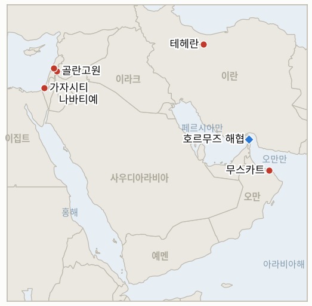

# 중동 일일 브리핑

**2026년 8월 28일**

- **보고 기간:** 약 24시간, 8월 27일 09:00 ~ 8월 28일 09:00 (한국시간)
- **종합 평가:** 목요일의 사건들은 지역 내 수사적·작전적 마찰 심화와 한국에는 진정으로 긍정적인 데이터 사이에서 뚜렷이 갈렸다. 유엔 평화이사회 특사 니콜라이 믈라데노프는 이스라엘의 지속되는 가자지구 공습을 겨냥한 공개 비판 수위를 높여 "탄약고에 대한 또 한 번의 공습"이 하마스의 재무장을 막을 수 있겠느냐고 날카롭게 반문했지만, 이는 IND-20260827-1이 실제로 추적하는 공식적인 미국 정부 대응이 아니며, 이 지표는 자체 시한을 닷새 앞두고도 여전히 미보고 상태다. 이스라엘은 동시에 시리아 쿠네이트라주에서 공습과 침투를 강화하고 레바논 남부 나바티예 일대의 포격을 확대했는데, 이는 1974년 정전선까지의 철수를 위한 안보 체계 마련을 목표로 한 암만 회담 직후 벌어진 일로, 이번 군사 활동이 해당 외교 트랙을 탈선시키는지를 시험하는 신규 지표가 열렸다. 유가는 이란-오만 호르무즈 항로가 여전히 확정된 운영 개시일을 갖추지 못한 채 사흘 연속 하락세를 이어갔으며, 윈드워드의 집계로는 통항 선박이 8척으로 늘었다. 한국 쪽에서는 코스피가 엔비디아의 실적 호조에 힘입어 붕괴 이전 기준선을 처음으로 넘어섰지만, 한국은행은 기준금리를 3.00%로 두 차례 연속 인상했고 원화는 거의 1년 만의 최고 수준으로 강세를 보였다. 가자지구의 휴전 이후 누적 사망자는 1,300명을 넘어섰고, 쿠스라 봉쇄의 식량·의약품 지표는 재공급이 끝내 확인되지 않은 채 자체 시한에서 반증으로 확정됐으며, 미국 상원의원 10명은 서안지구 폭력으로 사망한 미국 시민 9명에 대한 책임 규명을 요구하는 특권 결의안을 발의했다.

---

## 1. 오늘의 주요 사건

<figure style="float:right; width:46%; margin:2pt 0 8pt 14pt;">

<figcaption style="font-size:8pt; color:#666; text-align:center; margin-top:3pt; font-style:italic;">주요 논의 지점</figcaption>
</figure>

### 1.1 평화이사회 특사, 이스라엘 공습 비판 수위 높여, 네타냐후 거부에 대한 공식 미국 대응은 여전히 부재

평화이사회의 가자 담당 특사 니콜라이 믈라데노프는 목요일 이스라엘의 지속되는 군사 작전에 대한 공개 비판 수위를 높였다. 트럼프 자신의 평화 구상이 마무리 단계에 접어들어야 할 휴전 3주째에도 팔레스타인인들을 계속 죽이는 공습의 전략적 논리에 의문을 제기하며 그는 이렇게 말했다. "3년간의 전쟁과 20년간의 군사 작전 이후, 나는 묻는다. 탄약고에 대한 또 한 번의 공습이 하마스의 재무장이나 가자지구 장악력 강화를 막을 수 있는가? 그렇지 않다"([NPR](https://www.npr.org/2026/08/27/g-s1-140400/israel-gaza-ceasefire)). 그는 완전한 붕괴는 "돌아올 수 없는 지점"이 될 것이라는 기존 경고도 재확인했다. 믈라데노프의 발언은 평화이사회 측 논평일 뿐, 트럼프 평화안 무장해제 프레임워크에 대한 네타냐후의 거부에 특정해 공식적인 미국 측 대응을 시험하는 IND-20260827-1과는 별개다. 이 지표는 9월 2일 시한을 닷새 앞두고도 백악관이나 국무부의 대응이 전혀 보고되지 않은 채 여전히 미결 상태다. 가자지구의 사망자 수는 같은 기간 계속 늘었다(§1.5 참조). **신뢰도: 높음** — 믈라데노프의 발언과 직책(2등급, NPR, 실명 평화이사회 관계자). **신뢰도: 중간** — 이번 거부에 워싱턴이 궁극적으로 어떻게 대응할지는 보고 기간 중 확인되지 않아 불확실하다.

### 1.2 이스라엘, 암만 중재 1974년 정전선 협상 와중에도 시리아·레바논 공습과 침투 강화

이스라엘군은 시리아 쿠네이트라주 1974년 정전선 인근의 투르네자 마을에 진입해 가옥을 수색했고, 별도로 북동쪽 약 10km 거리의 바이트진 외곽을 포격했다고 시리아 국영TV가 전했다. 두 사건 모두 인명 피해는 보고되지 않았다. 이스라엘은 목요일 시리아 남부 다른 지역도 타격했다고 시리아 국영통신이 밝혔다([The National](https://www.thenationalnews.com/news/mena/2026/08/27/syria-israel-golan/); [Haaretz](https://www.haaretz.com/israel-news/israel-security/2026-08-27/ty-article-live/board-of-peace-envoy-israel-must-honor-gaza-commitments-to-advance-cease-fire/000001a0-40db-d518-a5ad-ecdf14c90000)). 동시에 이스라엘군은 레바논 남부 나바티예 인근 알리 알타헤르 능선 일대의 공습과 포격을 강화해 목요일 새벽까지 하리스, 만수리, 마이파둔, 자우타르 알샤르키야, 스레빈 등의 마을을 타격했다. 이번 군사 활동은 1974년 정전선으로의 이스라엘 철수를 위한 안보 체계 마련을 목표로 한 일요일 암만 회담 직후 벌어졌다. 한 지역 안보 소식통은 The National에 "양측이 대화할 때 이스라엘은 시리아 측에 이 영토를 원하지 않는다는 신호를 보내면서도 동시에 그곳에서 군사 활동을 늘리고 있다"고 말했다. 신규 IND-20260828-1은 이 패턴이 암만 외교 트랙을 탈선시키는지를 시험한다. **신뢰도: 높음** — 공습과 침투 자체(2등급, 시리아 국영TV, The National의 지역 안보 취재, 다중 사건 교차 확인). **신뢰도: 중간** — 이번 시점이 의도적 신호인지 통상적 작전 리듬인지는, 쿠네이트라 침투와 암만 협상의 관계를 다룬 이스라엘 정부의 직접 입장이 없어 판단하기 어렵다.

### 1.3 유가, 호르무즈 항로 개시일 여전히 미정으로 사흘 연속 하락

브렌트유는 목요일 1.03% 내린 배럴당 86.93달러, WTI유는 1.06% 내린 81.36달러로 마감해 두 지표 모두 사흘 연속 하락했다. 이번 주 초 발표된 이란-오만 임시 호르무즈 항로는 여전히 확정된 운영 개시일이나 좌표를 공개하지 않았다([Trading Economics](https://tradingeconomics.com/commodity/brent-crude-oil)). 선박추적 업체 윈드워드는 수요일 21:00 UTC까지의 24시간 동안 해협을 통항한 선박이 출항 5척, 입항 3척 등 총 8척이라고 집계했는데, 이는 화요일의 5척보다 늘었지만 분쟁 이전 일평균 약 140척 수준에는 여전히 크게 못 미치는 수치다([Foreign Policy Journal, 윈드워드 인용](https://www.foreignpolicyjournal.com/2026/08/27/strait-of-hormuz-traffic-holds-steady-as-route-uncertainty-persists-kpler-data-shows/)). 새 이란-오만 항로 절차를 이용했다고 특정된 선박은 보고되지 않아 IND-20260827-2는 미결로 남았다. **신뢰도: 높음** — 유가 종가(1등급, 시장 데이터). **신뢰도: 중간** — 통항 선박 수는 로이터, UKMTO 또는 Kpler의 교차 확인이 아직 이뤄지지 않은 단일 선박추적 업체 데이터다.

### 1.4 코스피, 붕괴 이전 기준선 첫 돌파, 한국은행은 기준금리 두 차례 연속 인상

코스피는 목요일 1.53% 오른 6,912.37로 마감해, 수요일 확증으로 마무리된 IND-20260820-2가 붕괴 이전 기준선으로 삼았던 6,869.83을 처음으로 넘어섰다. 엔비디아의 시장 예상치를 웃돈 2분기 실적(매출 962억 달러, 전년 대비 106% 증가)이 삼성전자(1.72% 상승, 26만 6,000원)와 SK하이닉스(2.49% 상승, 173만 원)의 초반 랠리를 이끌었지만, 오전 10시경 발표된 한국은행의 기준금리 인상, 즉 2.75%에서 3.00%로의 두 번째 연속 인상 이후 지수는 7,000선 돌파에는 못 미쳤다([Korea Times](https://www.koreatimes.co.kr/economy/20260827/nvidia-inspired-kospi-rally-subdued-after-boks-2nd-straight-rate-hike)). 외국인은 1,524억 원, 기관은 1,776억 원을 각각 순매수했고, 개인은 1조 9,100억 원을 순매도했다. 시장 분석가 변준호는 "엔비디아의 실적은 AI·반도체 산업을 둘러싼 우려를 일부 완화하겠지만, 경기 정점에 대한 전망이 투자자들의 경계심을 계속 유지시킬 것"이라고 말했다. 원화는 3.9원 강세로 1,380.9원에 마감해 2025년 9월 이후 최고 수준을 기록했다. **신뢰도: 높음** — 지수 수준, 종목별 등락, 매매 동향, 한국은행 금리 결정(1~2등급, 코리아타임스, 거래소·중앙은행 데이터).

### 1.5 가자지구 사망자 1,300명 넘어서, 쿠스라 재공급 지표 반증 확정, 상원 민주당 특권 결의안 발의

이스라엘의 공습으로 목요일 팔레스타인인 최소 3명이 추가로 숨졌다. 가자지구 남부 카라라 인근에서 1명, 가자시티 비치 난민촌의 한 가옥에서 1명, 이후 별도의 공습으로 가자시티에서 오토바이 운전자 1명이 각각 사망해, 보건 당국에 따르면 2025년 10월 이후 휴전 이후 누적 사망자는 최소 1,306명에 이르렀다. 이스라엘군은 개별 사건에 대한 입장을 밝히지 않았으나, 같은 기간 이스라엘 군인 4명이 사망했다고 별도로 밝혔다([Arab News](https://www.arabnews.com/node/2656041/middle-east)). 서안지구에서는 쿠스라의 포위된 가옥들에 대한 식량·의약품 접근 회복이 보고 기간 중 전혀 확인되지 않았고, 이스라엘 정부나 군 당국의 관련 입장도 없어, IND-20260821-2는 자체 시한에서 반증으로 확정됐다. 14일째 이어진 이번 재공급 위기는 전초기지 자체가 결코 지속 가능하게 철거되지 않았다는 IND-20260813-3의 앞선 판정과 나란히, 인정되었으나 방치된 인도적 위기로 남게 됐다. 한편 크리스 밴홀런, 팀 케인, 버니 샌더스, 피터 웰치 등이 이끄는 상원 민주당 의원 10명은 지난 4년간 정착민이나 이스라엘 보안군에 의해 사망한 미국 시민 9명을 열거한 특권 결의안을 발의해, 행정부가 수사 진행 상황을 보고하고 서안지구 인권 상황을 평가하도록 요구했다. 이는 외교위원회가 10일 안에 조치를 취하지 않으면 본회의 표결을 강제할 수 있는 절차다([밴홀런 상원 사무실](https://www.vanhollen.senate.gov/news/press-releases/van-hollen-kaine-sanders-announce-privileged-resolution-seeking-answers-on-west-bank-violence)). 신규 IND-20260828-2는 이 결의안이 위원회 조치나 국무부 대응으로 이어지는지 추적한다. **신뢰도: 높음** — 가자지구 사망자 수와 공습 지점(2~3등급, Arab News, 가자 보건 당국 인용, 다수 매체 패턴). **신뢰도: 높음** — 쿠스라 재공급 위기의 지속적 방치(2등급, 8월 21일 이래 이 원장이 추적해온 보도 패턴). **신뢰도: 높음** — 상원 결의안 발의와 내용(1등급, 공식 상원 보도자료).

---

## 2. 심층 분석: 유인과 동기

### 2.1 평화이사회 특사는 왜 조용한 외교적 압박 대신 지금 이스라엘 공습 비판 수위를 높였는가?

네타냐후의 거부에 대해 워싱턴이 3주째 공개적으로 아무런 대응을 하지 않는 것을 지켜본(§1.1) 믈라데노프에게는 국제 언론을 통한 도덕적 압박 외에 남은 외교적 지렛대가 거의 없기 때문이다. 개별 공습이 어떤 전략적 목적에 부합하는지를 공개적으로 반문하며 수사 수위를 높이는 것은, 휴전 이행이 흐트러지는 데 따른 평판상 비용의 일부를 이스라엘에 구체적으로 돌리는 방식이며, 절차의 실패를 책임 소재가 불분명한 지역 전체의 비극으로 읽히게 방치하지 않으려는 시도다.

### 2.2 이스라엘은 왜 암만 중재 철수 협상을 진행하면서 동시에 시리아·레바논 공습을 강화하는가?

암만에서 조건을 논의하면서도 현장에서는 작전 강도를 유지하거나 강화하는 두 트랙을 병행하면, 이스라엘은 향후 1974년 정전선 합의가 이뤄지더라도 스스로에게 남겨둘 군사적 재량의 폭을 시험할 수 있기 때문이다. 정식 철수 체계가 성립된 이후에는 정당화하기 어려울 침투 작전을, 사실관계 형성과 정보 수집의 기회로 지금 활용함으로써, 사실상 그 공습 자체가 적극적으로 재편하고 있는 위치에서 협상을 이어가는 셈이다.

### 2.3 유가는 왜 목요일의 소폭 통항 회복에도 불구하고 미서명 호르무즈 항로를 이유로 계속 하락했는가?

트레이더들은 일별 통항 선박 수가 아니라 항로의 구조적 한계, 즉 혁명수비대의 허가·감시 체계와 확정된 개시일의 부재를 가격에 반영하고 있기 때문이다. 통항 선박이 5척에서 8척으로 늘어난 것은 여전히 제약된 체제 안에서의 잡음일 뿐 공급 정상화의 증거로 읽히지 않으며, 사흘 연속 종가 하락은 시장이 이미 항로의 존재 자체는 소화했고 이제 서명된 문서와 개시일이라는 더 강력한 신호를 기다리고 있음을 보여준다.

### 2.4 한국은행은 왜 시장이 잠잠해지길 기다리지 않고 엔비디아發 랠리 와중에 기준금리를 인상했는가?

지속되는 인플레이션과 예상보다 견조한 경기 회복세가 중앙은행에 긴축을 단행할 좁은 시간의 창을 열어주었으며, 특히 증시 심리가 매도세 없이 이를 흡수할 만큼 강했던 바로 이 시점을 노렸기 때문이다. 두 번째 연속 인상 시점을 엔비디아 실적이라는 완충 요인과 맞춰, 같은 폭 25bp 인상이 훨씬 더 큰 상대적 충격으로 다가올 약세장까지 기다렸다가 인상하는 리스크를 피한 것이다.

### 2.5 상원 민주당은 왜 통상적인 감독 서한 대신 지금 특권 결의안을 발의했는가?

특권 지정은 공화당이 다수인 외교위원회가 정해진 기한 안에 조치를 취하도록 강제하거나, 그렇지 않으면 민주당이 달리 확보할 수 없었던 본회의 표결로 넘어가게 만드는 유일한 절차적 수단이기 때문이다. 이를 통해 4년간 쌓인 미해결 미국 시민 사망 사건들을 구체적인 10일 시한으로 전환해 행정부를 공식 기록에 남기며, 강제 메커니즘 없이 서한과 청문회만 계속 흡수되는 상황을 끝낸다.

---

## 3. 한국에 대한 정책적 함의

### 3.1 노출 현황 스냅숏

| 항목 | 현재 수치 | 출처 |
| --- | --- | --- |
| 원유 수입 중 중동산 비중 | 48.5%(2026년 5~7월), 전년 동기 69.1%에서 하락; 비중동산 비중이 사상 처음 50% 상회 | KNOC via 아시아경제; `korea-exposure.md` |
| 7~8월 원유 확보량 | 전년 동기 대비 110% 이상 확보(산업통상자원부, 7월 21일); 전략비축유 스와프 8월까지 연장, 현재까지 약 2,100만 배럴 스와프 | 산업통상자원부 via 헤럴드경제, 한경; `korea-exposure.md` |
| 9월 원유 확보량 | 90% 이상 확보(산업통상자원부, 7월 21일) | 산업통상자원부 via 헤럴드경제; `korea-exposure.md` |
| 홍해 우회 경로 | 한국행 원유는 얀부·홍해 우회로를 계속 이용 중; 얀부에서 한국을 포함한 아시아 구매자로의 수출량이 전년 동기 하루 100만 배럴 미만에서 약 400만 배럴로 급증 | Lloyd's List Intelligence; `korea-exposure.md` |
| 전략비축유 대응력 | 실제 소비량 기준 약 26일분(추정); 스와프는 즉시 대기 상태이나 대규모 실행은 검증되지 않음 | CSIS; 산업통상자원부 7월 27일 |
| 정유사 사우디 지분 노출 | S-Oil(사우디 아람코 지분 약 63%), HD현대오일뱅크(아람코 지분 약 17%) | 공시자료; `korea-exposure.md` |
| 한국은행 기준금리 | 3.00%, 목요일 25bp 인상, 2.75%에서 두 차례 연속 인상 | Korea Times |
| 브렌트유/WTI유 | 목요일 각각 86.93달러(-1.03%)/81.36달러(-1.06%)로 마감, 이란-오만 호르무즈 항로가 여전히 확정된 개시일 없이 사흘 연속 하락 | Trading Economics |
| 코스피/원달러 환율 | 코스피는 1.53% 오른 6,912.37로 마감해 붕괴 이전 기준선을 처음 돌파; 원화는 3.9원 강세로 1,380.9원, 2025년 9월 이후 최고 수준 | Korea Times |
| 호르무즈 통항량 | 8월 26일까지 24시간 동안 8척 통항(윈드워드 예비 데이터), 화요일의 5척보다는 늘었지만 분쟁 이전 일평균 약 140척에는 크게 못 미침 | Foreign Policy Journal/윈드워드 |

### 3.2 사안별 함의

**평화이사회 특사의 이스라엘 비판 수위 강화는 휴전 이행 격차를 계속 헤드라인에 올려두지만, 이는 IND-20260827-1이 추적하는 공식적인 미국 측 대응이 아니며, 한국 정책 당국은 믈라데노프의 발언을 워싱턴이 네타냐후의 근본적 거부에 대응하기 시작했다는 증거로 읽어서는 안 된다.** IND-20260827-1은 9월 2일 시한을 닷새 앞두고도 여전히 미결이다.

**암만 협상이 계속되는 와중에 이스라엘이 시리아·레바논에서 작전을 강화한 것은 이 지역의 외교 구도에 아직 검증되지 않은 새로운 변수를 더한다. 폭넓은 중동 안정성 리스크를 추적하는 한국 정책 당국은 이를 기존의 튀르키예-이스라엘, 서안지구 확전 지표들과 함께 주시해야 하며, 협상이 계속된다는 사실만으로 해소된 것으로 간주해서는 안 된다.** 신규 IND-20260828-1은 이번 군사 활동이 향후 일주일 안에 1974년 정전선 협상 트랙을 탈선시키는지를 시험한다.

**통항 선박 수의 소폭 개선에도 불구하고 미서명 호르무즈 항로를 이유로 유가가 사흘 연속 하락한 것은, 헤드라인상의 통항량 개선보다 한국 원유 조달 담당자들에게 더 관련성 높은 신호다. 2.3절의 분석에 따르면 이 항로는 해상운송 리스크 판단 목적으로는 여전히 운영 중인 것으로 간주해서는 안 된다.** IND-20260827-2는 어떤 선박이든 새 항로를 실제로 이용한 사례가 문서화되는지를 시험하는, 더 좁고 낮은 기준의 지표로 남아 있다.

**코스피가 붕괴 이전 기준선을 처음 넘어선 것은 한국 시장 참가자들에게 실질적으로 긍정적인 이정표이지만, 한국은행의 기준금리 3.00%로의 두 번째 연속 인상이 이번 보고 기간에서 더 중대한 국내 정책 신호다. 이는 증시가 회복세를 이어가는 와중에도 자금 조달 여건을 긴축시키는 것으로, 한국 기업과 가계 차입자들은 지수의 표면적 강세와 함께 이 괴리를 저울질해야 한다.** 원화가 거의 1년 만의 최고 수준으로 강세를 보인 것은, 이 원장이 8월 중순 이래 추적해온 통화의 중동 리스크 탈동조화 흐름에 또 하나의 근거를 더한다.

**가자지구의 지속되는 살상 패턴과 쿠스라 재공급 지표의 반증 확정은 한국 시장에 직접적인 경로는 없지만, 휴전의 현장 집행 격차가 여전히 크고 방치되어 있음을 재확인시켜준다. 한편 밴홀런 결의안은 서안지구 책임 규명을 둘러싼 새로운 미국 국내 정치적 압박을 더하는데, 워싱턴의 폭넓은 지역 관여의 지속성을 추적하는 한국 정책 당국이 주목할 만한 사안이다.** 신규 IND-20260828-2는 이 압박이 10일 시한 안에 위원회 조치나 국무부 대응으로 이어지는지 추적한다.

**검증 가능한 지표:**

- **IND-20260828-1** — 이스라엘의 시리아 남부(쿠네이트라주 투르네자 마을, 바이트진) 및 레바논 남부(나바티예 일대 마을) 공습과 침투 강화가 암만 중재 1974년 정전선 안보 협상을 탈선 또는 중단시키거나, 이번 군사 활동에도 불구하고 외교 트랙이 예정대로 계속된다. 2026년 9월 3일경까지 공습과 연관된 암만 협상의 확인된 중단이나 공개적 결렬이 있으면 군사 활동이 외교 트랙을 탈선시키고 있음을 확증하며, 같은 시점까지 예정된 협상이 계속되거나 잠정 합의가 서명되면 탈선을 반증한다.
- **IND-20260828-2** — 서안지구 폭력으로 사망한 미국 시민 9명에 대한 국무부의 설명을 요구하는 상원 민주당 10명의 특권 결의안이 외교위원회의 10일 시한 안에 본회의 표결이나 국무부 대응을 이끌어내거나, 위원회와 행정부가 공식 조치 없이 시한을 흘려보낸다. 2026년 9월 6일경까지 위원회 조치, 본회의 표결, 또는 문서화된 국무부 대응이 있으면 이 절차가 공식적인 결산을 강제했음을 확증하며, 같은 시점까지 그러한 조치가 없으면 반증한다.

---

## 4. 주시 목록

- **이스라엘의 연 발사 "공습 강화" 위협이 문서화된 확전으로 이어지는지, 아니면 기존 표적 작전과 구분되지 않는 수준에 머무는지** (IND-20260824-2, 시한 8월 30일).
- **8월 15일 헤즈볼라-이스라엘 교전이 추가 라운드로 이어지는지 아니면 양측이 휴전 이후 균형으로 물러서는지** (IND-20260816-1, 시한 8월 29일).
- **가자지구 옐로라인 사건들이 이스라엘군의 공식 작전 대응을 촉발하는지 아니면 고립된 사례로 남는지** (IND-20260816-2, 시한 8월 30일).
- **예멘의 확인된 확산이 국제 중재를 이끌어내는지** (IND-20260817-1, 시한 8월 31일).
- **호르무즈를 미국 영토로 만들겠다는 트럼프의 선언이 반복된 수사를 넘어 구체적 정책 조치로 이어지는지** (IND-20260817-2, 시한 8월 31일).
- **이스라엘이 준비한 알리 알타헤르 능선 작전이 실제로 개시되는지, 이제 그 일대 나바티예 지역 공습이 이미 강화된 상태** (IND-20260818-2, 시한 8월 31일).
- **베선트 제재 패키지가 "이번 주 안"으로 예고한 대형 금융기관 지정이 실현되는지** (IND-20260825-1, 시한 8월 29일).
- **로마 트랙의 9월 1일 예정 8차 회담이 예정대로 진행되는지** (IND-20260807-2, 시한 9월 1일).
- **오만을 폭격하겠다는 트럼프의 위협이 실제 외교적·군사적 결과로 이어지는지** (IND-20260818-1, 시한 9월 1일).
- **후티 반군의 모카 인근 사우디 해군 함정 공격 주장이 확인되거나 사우디의 직접 대응을 이끌어내는지** (IND-20260818-3, 시한 9월 1일).
- **카츠의 미조율 서안지구 경찰 이양이 예정대로 진행되는지, 지연되는지, 혹은 무산되는지** (IND-20260819-2, 시한 9월 1일).
- **미노안 디그니티호 치명적 피격 사건의 책임 소재가 규명되거나 군사적 대응으로 이어지는지** (IND-20260819-1, 시한 9월 2일).
- **국무부의 중동 공관 외교관 복귀 계획이 진행되는지 아니면 지연되는지** (IND-20260826-1, 시한 9월 2일).
- **네타냐후의 트럼프 평화안 거부가 공식적인 미국 측 대응으로 이어지는지, 평화이사회 특사 자신의 비판 수위 강화에도 불구하고 여전히 부재** (IND-20260827-1, 시한 9월 2일).
- **새 이란-오만 호르무즈 항로를 특정해 이용한 선박 통항 사례가 문서화되는지, 전반적 호르무즈 통항량의 소폭 증가와는 별개로** (IND-20260827-2, 시한 9월 2일).
- **이스라엘의 시리아·레바논 공습 강화가 암만 중재 1974년 정전선 안보 협상을 탈선시키는지** (IND-20260828-1, 시한 9월 3일).
- **운영 개시일이 명시된 이란-오만 호르무즈 공동성명이 서명되는지** (IND-20260816-3, 시한 9월 5일).
- **아부 알두후르 공습을 둘러싼 튀르키예-이스라엘 갈등이 확전되는지 아니면 흡수되는지** (IND-20260823-1, 시한 9월 6일).
- **이스라엘군의 서안지구 "경계선" 경고 이후 실제 폭력 양상의 단계적 변화가 뒤따르는지** (IND-20260823-2, 시한 9월 6일).
- **배럭의 연이은 논란이 실제 미국 정책이나 인사 조치로 이어지는지** (IND-20260824-1, 시한 9월 6일).
- **밴홀런 주도 서안지구 미국 시민 사망 특권 결의안이 위원회 조치나 국무부 대응을 이끌어내는지** (IND-20260828-2, 시한 9월 6일).
- **자나타에서 이스라엘 활동가와 AFP 기자를 공격한 사건이 체포로 이어지는지** (IND-20260826-2, 시한 9월 8일).
- **마사페르 야타 체포가 지속적인 정착민 집행 강화로 이어지는지 아니면 고립된 사례로 남는지** (IND-20260825-2, 시한 9월 8일).
- **시리아 핵물질 발견이 최종 합의와 검증된 제거로 이어지는지** (IND-20260812-2, 시한 9월 11일).
- **서안지구 이스라엘군-경찰 집행 이양이 정착민 폭력을 줄이는지 아니면 변화 없이 유지되는지** (IND-20260815-2, 시한 9월 12일).
- **이란의 경고에도 불구하고 시리아가 레바논 내 헤즈볼라에 조치를 취하는지, 아니면 대치가 수사에 머무는지** (IND-20260815-3, 시한 9월 15일).
- **케인 상원의원의 오만 관련 전쟁권한 결의안이 9월 상원 복귀 시 통과되는지, 부결되는지, 아니면 본회의 표결에 이르지 못하는지** (IND-20260819-3, 시한 9월 25일).
- **예멘의 교전이 극적인 추가 확전으로 이어지는지, 아니면 소모전 양상으로 굳어지는지.**
- **이란의 피격 핵시설에 대한 IAEA 접근 차단이 새로운 사찰 프로토콜로 해소되는지, 아니면 지속적인 대치로 굳어지는지.**
- **캐롤라인 베젠기호 기름 유출 사고가 인양 작업 개시 이후 통제되는지.**
- **케슘섬 폭발 사건이 실제 공격으로 확인되는지, 아니면 오경보로 결론 나는지.**

---

## 5. 출처 품질 요약

| 주장 | 출처 | 신뢰도 |
| --- | --- | --- |
| 믈라데노프의 이스라엘 공습 비판 수위 강화 | NPR(2등급, 실명 평화이사회 관계자, 직접 인용) | 높음 |
| 시리아 투르네자 침투, 바이트진 포격 | The National, Haaretz(2등급, 시리아 국영TV, 다수 매체) | 높음 |
| 나바티예 일대 알리 알타헤르 능선과 인근 마을 공습 | The National(2등급, 지역 보도) | 높음 |
| 암만 협상 중 이스라엘 신호에 관한 지역 안보 소식통 발언 | The National(2등급, 익명 지역 안보 소식통) | 중간 |
| 브렌트유·WTI유 종가 | Trading Economics(1등급, 시장 데이터) | 높음 |
| 8월 26일까지 24시간 동안 호르무즈 통항 선박 8척 | Foreign Policy Journal, 윈드워드 데일리 인텔리전스 인용(2~3등급, 단일 선박추적 업체, 교차 확인 전) | 중간 |
| 코스피 종가, 삼성전자·SK하이닉스 등락, 매매 동향 | Korea Times(1~2등급, 거래소 데이터, 실명 보도) | 높음 |
| 한국은행 기준금리 3.00%로 두 차례 연속 인상 | Korea Times(1~2등급, 실명 중앙은행 결정) | 높음 |
| 원달러 환율 종가 | Korea Times | 높음 |
| 가자지구 공습 및 휴전 이후 누적 사망자 최소 1,306명 | Arab News, 가자 보건 당국 인용(2~3등급, 공식 보건부 수치) | 사망자 수와 지점은 높음; 정확한 수치는 중간, 보고 기간 중 두 번째 통신사와 교차 확인되지 않음 |
| 쿠스라 봉쇄의 지속되는 식량·의약품 부족, 재공급 미확인 | 8월 21일 이래 이 원장이 추적해온 보도 패턴(2등급, Middle East Eye, Ynetnews) | 높음 |
| 상원 민주당의 서안지구 미국 시민 사망 특권 결의안 | 밴홀런 상원 사무실 보도자료(1등급, 공식 정부 출처) | 높음 |
