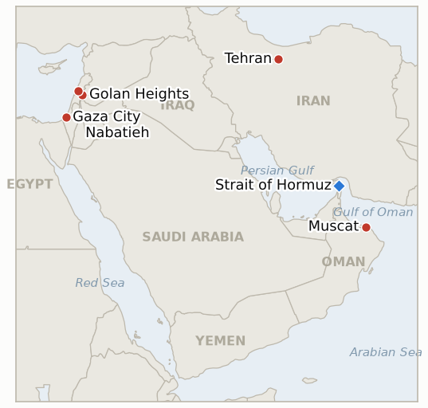

# Middle East Daily Briefing

**August 28, 2026**

- **Reporting window:** ~24 hours, August 27, 09:00 to August 28, 09:00 KST
- **Overall assessment:** Thursday's developments split cleanly between an escalating rhetorical and operational drift in the region and a genuinely positive data point for Korea. UN Board of Peace envoy Nickolay Mladenov sharpened his public criticism of Israel's continued Gaza strikes, asking pointedly whether "another strike on a munitions depot" would stop Hamas rearming, but that is Board of Peace commentary rather than the formal US government response IND-20260827-1 is actually tracking, which remains unreported five days into its own deadline. Israel simultaneously intensified strikes and an incursion in Syria's Quneitra governorate and stepped up shelling around Nabatieh in south Lebanon, days after an Amman meeting aimed at a security arrangement for withdrawal to the 1974 armistice line, prompting a new indicator on whether the military activity derails that diplomatic track. Oil extended its slide for a third session as the Iran-Oman Hormuz corridor continued to lack a fixed operating date, even as a Windward count showed transits ticking up to eight vessels. On the Korea side, KOSPI closed above its pre-crash reference level for the first time on Nvidia's earnings beat, even as the Bank of Korea delivered a second consecutive rate hike to 3.00% and the won strengthened to its best level in nearly a year. Gaza's post-ceasefire toll passed 1,300, the Qusra siege's food and medicine indicator resolved falsified at its own deadline with no resupply ever verified, and ten Senate Democrats filed a privileged resolution demanding accountability for nine Americans killed in West Bank violence.

---

## 1. What Happened

<figure style="float:right; width:46%; margin:2pt 0 8pt 14pt;">

<figcaption style="font-size:8pt; color:#666; text-align:center; margin-top:3pt; font-style:italic;">Major places of discussion</figcaption>
</figure>

### 1.1 Board of Peace Envoy Sharpens Criticism of Israel's Strikes as Formal US Response to Netanyahu's Rejection Stays Absent

Nickolay Mladenov, the Board of Peace's high representative for Gaza, escalated his public criticism of Israel's continued military operations on Thursday, questioning the strategic logic of strikes that keep killing Palestinians three weeks into a ceasefire process Trump's own peace architecture is meant to be winding down: "After three years of war and 20 years of military operations, I ask, will another strike on a munitions depot stop Hamas from rearming or tightening its grip on Gaza? It will not," he said, reiterating that a full collapse would be "a point of no return" ([NPR](https://www.npr.org/2026/08/27/g-s1-140400/israel-gaza-ceasefire)). Mladenov's remarks are Board of Peace commentary, not a US government statement, so IND-20260827-1, which tests specifically for a formal US response to Netanyahu's rejection of the plan's disarmament framework, remains open five days into its September 2 deadline with no White House or State Department reaction yet reported. Gaza's toll continued rising in parallel (§1.5). **Confidence: High** on Mladenov's quotes and role (Tier 2, NPR, on-record Board of Peace official); Medium on how Washington will ultimately respond to the underlying rejection, since that remains unaddressed in the window.

### 1.2 Israel Intensifies Strikes and Incursions in Syria and Lebanon Even as Amman Mediated 1974 Line Talks Continue

Israeli forces entered the village of Turnejeh in Syria's Quneitra governorate near the 1974 armistice line and searched a house, while separately shelling the outskirts of Beit Jinn roughly ten kilometers northeast, Syrian state television reported, with no casualties from either incident; Israel also struck other targets elsewhere in southern Syria Thursday, per Syria's state news agency ([The National](https://www.thenationalnews.com/news/mena/2026/08/27/syria-israel-golan/); [Haaretz](https://www.haaretz.com/israel-news/israel-security/2026-08-27/ty-article-live/board-of-peace-envoy-israel-must-honor-gaza-commitments-to-advance-cease-fire/000001a0-40db-d518-a5ad-ecdf14c90000)). In parallel, Israeli forces intensified strikes and shelling around Ali al-Taher Hill near Nabatieh in south Lebanon, hitting the villages of Haris, Mansouri, Mayfadoun, Zawtar al-Charqiyeh and Srebbine overnight into Thursday. The activity came days after a Sunday meeting in Amman aimed at establishing a security arrangement for an eventual Israeli withdrawal to the 1974 line; a regional security source told The National, "When the two sides talk, the Israelis signal to the Syrians that they don't want these territories but at the same time they are increasing military activity there." New IND-20260828-1 tests whether this pattern derails the Amman diplomatic track. **Confidence: High** on the strikes and incursions themselves (Tier 2, Syrian state television, The National's regional-security sourcing, multi-incident corroboration); Medium on whether the timing reflects a deliberate signal rather than routine operational tempo, since no Israeli government statement directly addressed the Quneitra incursion's relationship to the Amman talks.

### 1.3 Oil Settles Lower for a Third Session as the Hormuz Corridor Still Lacks an Operating Date

Brent crude settled down 1.03% to $86.93 a barrel and WTI fell 1.06% to $81.36 Thursday, both benchmarks' third straight decline, as the Iran-Oman temporary Hormuz corridor announced earlier this week continued to lack a fixed operating date or published coordinates ([Trading Economics](https://tradingeconomics.com/commodity/brent-crude-oil)). Shiptracker Windward recorded eight vessels transiting the strait in the 24-hour window ending 21:00 UTC Wednesday, five outbound and three inbound, up from Tuesday's five but still a fraction of the roughly 140-vessel-a-day pre-disruption norm ([Foreign Policy Journal, citing Windward](https://www.foreignpolicyjournal.com/2026/08/27/strait-of-hormuz-traffic-holds-steady-as-route-uncertainty-persists-kpler-data-shows/)). No vessel was reported transiting specifically via the new Iran-Oman corridor protocol, leaving IND-20260827-2 open. **Confidence: High** on the oil settle levels (Tier 1, market data); Medium on the transit count, a single shiptracker print not yet cross confirmed by Reuters, UKMTO or Kpler.

### 1.4 KOSPI Closes Above Its Pre Crash Reference for the First Time as the Bank of Korea Delivers a Second Straight Rate Hike

KOSPI closed up 1.53% at 6,912.37 Thursday, its first close above the 6,869.83 level IND-20260820-2 used as its pre-crash reference before resolving confirmed Wednesday, as Nvidia's stronger than expected fiscal second-quarter results (revenue $96.2 billion, up 106% year on year) drove an early rally in Samsung Electronics (+1.72% to 266,000 won) and SK hynix (+2.49% to 1.73 million won); the index fell short of 7,000 after the Bank of Korea raised its base rate a second consecutive time, from 2.75% to 3.00%, around 10 a.m. ([Korea Times](https://www.koreatimes.co.kr/economy/20260827/nvidia-inspired-kospi-rally-subdued-after-boks-2nd-straight-rate-hike)). Foreign investors bought a net 152.4 billion won and institutions bought a net 177.6 billion won, while retail investors sold a net 1.91 trillion won; market analyst Byun Jun-ho said Nvidia's results "should ease some of the concerns surrounding the AI and semiconductor industries, but the prospect of a peak in the economic cycle will likely keep investors wary." The won strengthened 3.9 won to 1,380.9 per dollar, its strongest level since September 2025. **Confidence: High** on the index level, sector moves, flow data and the BOK rate decision (Tier 1-2, Korea Times, exchange and central bank data).

### 1.5 Gaza Toll Passes 1,300 as Qusra Resupply Indicator Resolves Falsified and Senate Democrats File a Privileged Resolution

Israeli strikes killed at least three more Palestinians Thursday, one near Qarara in southern Gaza, one at a house in Gaza City's Beach refugee camp, and one motorist struck in a later Gaza City strike, pushing the post-ceasefire toll to at least 1,306 killed since October 2025 according to health officials; the Israeli military did not comment on the individual incidents but separately said four Israeli soldiers have been killed over the same period ([Arab News](https://www.arabnews.com/node/2656041/middle-east)). In the West Bank, no verified restoration of food or medicine access to the besieged Qusra homes was reported in the window and no Israeli government or IDF statement addressed the shortage, resolving IND-20260821-2 falsified at its own deadline, a fourteen-day-old resupply crisis now standing as an acknowledged, unaddressed humanitarian emergency alongside IND-20260813-3's earlier finding that the outpost itself was never durably dismantled. Separately, ten Senate Democrats led by Chris Van Hollen, Tim Kaine, Bernie Sanders and Peter Welch filed a privileged resolution listing nine American citizens killed by settlers or Israeli security forces in the West Bank over four years, ordering the administration to account for the status of investigations and assess the West Bank human rights situation, a mechanism that forces a floor vote if the Foreign Relations Committee does not act within ten days ([Van Hollen Senate office](https://www.vanhollen.senate.gov/news/press-releases/van-hollen-kaine-sanders-announce-privileged-resolution-seeking-answers-on-west-bank-violence)). New IND-20260828-2 tracks whether the resolution forces committee action or a State Department response. **Confidence: High** on the Gaza toll and strike locations (Tier 2-3, Arab News citing Gaza health officials, multi-outlet pattern); High on the Qusra resupply crisis remaining unaddressed (Tier 2, reporting pattern this ledger has tracked since August 21); High on the Senate resolution's filing and content (Tier 1, official Senate press release).

---

## 2. Deep Dive: Incentives and Motives

### 2.1 Why would the Board of Peace envoy escalate public criticism of Israel's strikes now rather than continue quieter diplomatic pressure?

Because three weeks of watching Netanyahu's rejection go publicly unanswered by Washington (§1.1) has left Mladenov with little diplomatic leverage besides moral pressure delivered through international media, so sharpening his rhetoric, explicitly questioning whether individual strikes serve any strategic purpose, shifts some of the reputational cost of the ceasefire's fraying implementation onto Israel specifically, rather than letting the process's failures read as an undifferentiated regional tragedy with no assignable responsibility.

### 2.2 Why would Israel intensify strikes in Syria and Lebanon while simultaneously negotiating an Amman mediated withdrawal framework?

Because running the two tracks in parallel, talking terms in Amman while maintaining or escalating operational tempo on the ground, lets Israel test how much military latitude it can preserve for itself even after any eventual 1974 line agreement, using the incursions to establish practical facts and intelligence-gathering opportunities now that would be harder to justify once a formal withdrawal framework exists, effectively negotiating from a position the strikes themselves are actively reshaping.

### 2.3 Why would oil keep sliding on an unsigned Hormuz corridor rather than rallying on Thursday's modest transit recovery?

Because traders are pricing the corridor's structural limits, an IRGC permission-and-surveillance regime and no fixed operating date, rather than the day to day vessel count, so a rise from five to eight transiting ships reads as noise within a still-constrained regime rather than evidence supply is normalizing, and the third straight settle decline reflects a market that has already absorbed the framework's existence and is now waiting for the harder signal, a signed instrument with a start date, before repricing meaningfully higher on genuine relief.

### 2.4 Why would the Bank of Korea hike rates into a Nvidia driven rally rather than wait for calmer markets?

Because persistent inflation and a stronger than expected recovery gave the central bank a narrow window to tighten policy precisely when equity sentiment was strong enough to absorb the move without a selloff, timing the second consecutive hike to coincide with Nvidia's earnings cushion rather than risk having to raise rates later into a weaker market, where the same 25 basis point increase would land as a much larger relative shock.

### 2.5 Why would Senate Democrats file a privileged resolution now rather than continue routine oversight letters?

Because the privileged designation is the one procedural lever that forces the Republican controlled Foreign Relations Committee to act within a fixed window or cede the floor to a vote Democrats could not otherwise obtain, converting four years of accumulated, unresolved American-citizen deaths into a concrete ten day deadline that puts the administration on record rather than letting the issue continue absorbing letters and hearings without a forcing mechanism.

---

## 3. Policy Implications for South Korea

### 3.1 Exposure snapshot

| Item | Current reading | Source |
| --- | --- | --- |
| Middle East share of crude imports | 48.5% (May-July 2026), down from 69.1% a year earlier; non-Middle East share crossed 50% for the first time on record | KNOC via Asia Business Daily; `korea-exposure.md` |
| July-August crude procurement | 110%+ of prior-year volume secured (MOTIE, July 21); strategic reserve swap extended through August, ~21 million barrels swapped to date | MOTIE via Herald Business, Hankyung; `korea-exposure.md` |
| September crude procurement | 90%+ secured (MOTIE, July 21) | MOTIE via Herald Business; `korea-exposure.md` |
| Red Sea detour routing | Korean-bound crude cargoes continue via the Yanbu/Red Sea workaround; Yanbu exports to Asian buyers including Korea have surged to ~4 million bpd from under 1 million bpd a year earlier | Lloyd's List Intelligence; `korea-exposure.md` |
| Strategic reserve coverage | ~26 days of actual consumption (estimate); swap on immediate standby, untested at scale | CSIS; MOTIE July 27 |
| Refiner Saudi ownership exposure | S-Oil (Saudi Aramco majority ~63%), HD Hyundai Oilbank (Aramco ~17%) | Public filings; `korea-exposure.md` |
| BOK base rate | 3.00%, up 25bp Thursday, second consecutive hike (from 2.75%) | Korea Times |
| Brent / WTI | Settle $86.93 (-1.03%) / $81.36 (-1.06%) Thursday, a third straight decline as the Iran-Oman Hormuz corridor still lacks a fixed operating date | Trading Economics |
| KOSPI / USD-KRW | KOSPI +1.53% to 6,912.37, first close above its pre-crash reference; won firmed 3.9 won to 1,380.9, strongest since September 2025 | Korea Times |
| Hormuz transits | 8 vessels transited in the 24h window ending Aug 26 (preliminary Windward data), up from Tuesday's 5 but far below the ~140 pre-disruption norm | Foreign Policy Journal/Windward |

### 3.2 Implications by development

**The Board of Peace envoy's sharpened public criticism of Israel keeps the ceasefire's implementation gap in the headlines, but it is not the formal US response IND-20260827-1 is tracking, and Korean planners should not read Mladenov's remarks as evidence Washington has moved to address Netanyahu's underlying rejection.** IND-20260827-1 remains open with five days left before its September 2 deadline.

**Israel's intensified Syria and Lebanon operations alongside continuing Amman talks add a new, still-untested variable to the region's diplomatic architecture, one Korean planners tracking broader Middle East stability risk should watch alongside the existing Turkey-Israel and West Bank escalation indicators rather than treat as resolved by the talks' continuation alone.** New IND-20260828-1 tests whether the military activity derails the 1974 line negotiating track over the coming week.

**Oil's third straight decline on an unsigned Hormuz corridor, even as transit counts tick modestly higher, is the more relevant signal for Korean crude planners than the headline vessel-count improvement; section 2.3's analysis means the corridor should still not be treated as operational for shipping-risk purposes.** IND-20260827-2 remains the narrower, lower-bar test of whether any vessel is documented using the new corridor specifically.

**KOSPI's first close above its pre-crash reference is a genuinely favorable milestone for Korean market-watchers, but the Bank of Korea's second consecutive rate hike to 3.00% is the more consequential domestic policy signal in the window, tightening financing conditions even as equities extend their recovery, a divergence Korean corporate and household borrowers should weigh alongside the market's headline strength.** The won's strengthening to a nearly one-year high adds a further data point to the currency's decoupling from regional Middle East risk that this ledger has tracked since mid-August.

**Gaza's continuing lethal pattern and the Qusra resupply indicator's falsified resolution carry no direct Korean market channel but confirm the ceasefire's ground-level enforcement gap remains wide and unaddressed, even as the Van Hollen resolution adds new US domestic political pressure around West Bank accountability that Korean planners tracking the broader durability of Washington's regional engagement should note.** New IND-20260828-2 tracks whether that pressure produces committee action or a State Department response within its ten-day window.

**Testable indicators:**

- **IND-20260828-1** — Israel's intensified strikes and incursions in southern Syria (Quneitra's Turnejeh village, Beit Jinn) and south Lebanon (Nabatieh-area villages) either derail or suspend the Amman-mediated 1974 armistice line security talks, or the diplomatic track continues on schedule despite the military activity. A confirmed suspension or public collapse of the Amman talks tied to the strikes by ~2026-09-03 confirms the military activity is derailing the diplomatic track; continued scheduled talks or a signed interim arrangement through the same date falsifies a derailment.
- **IND-20260828-2** — Ten Senate Democrats' privileged resolution demanding State Department accounting for nine American citizens killed in West Bank violence either forces a floor vote or a State Department response within the Foreign Relations Committee's ten day window, or the committee and administration let the window lapse without formal action. Committee action, a floor vote, or a documented State Department response by ~2026-09-06 confirms the mechanism forced a formal reckoning; no such action by the same date falsifies it.

---

## 4. Watch List

- **Whether Israel's kite-launch "intensify strikes" threat converts into a documented, kite-specific escalation or stays indistinguishable from ongoing targeting** (IND-20260824-2, deadline August 30).
- **Whether the August 15 Hezbollah-Israel exchange triggers a further round or both sides step back to the post-truce equilibrium** (IND-20260816-1, deadline August 29).
- **Whether the Gaza Yellow Line incidents prompt a formal IDF operational response or stay isolated** (IND-20260816-2, deadline August 30).
- **Whether Yemen's confirmed spread draws renewed international mediation** (IND-20260817-1, deadline August 31).
- **Whether Trump's declared intent to make Hormuz US territory produces any concrete policy step beyond repeated rhetoric** (IND-20260817-2, deadline August 31).
- **Whether Israel's prepared Ali al-Taher ridge operation actually launches, now with Nabatieh-area strikes already intensifying around it** (IND-20260818-2, deadline August 31).
- **Whether the Bessent sanctions package's promised financial-institution designation, teased for "by the end of this week," materializes** (IND-20260825-1, deadline August 29).
- **Whether the Rome track's provisionally scheduled September 1 eighth round proceeds** (IND-20260807-2, deadline September 1).
- **Whether Trump's threat to bomb Oman produces any real diplomatic or military consequence** (IND-20260818-1, deadline September 1).
- **Whether the Houthis' claimed strike on Saudi naval vessels near Mocha is confirmed or draws a direct Saudi response** (IND-20260818-3, deadline September 1).
- **Whether Katz's uncoordinated West Bank police handover proceeds or is delayed or blocked** (IND-20260819-2, deadline September 1).
- **Whether the fatal Minoan Dignity attack is ever attributed or draws a military response** (IND-20260819-1, deadline September 2).
- **Whether the State Department's diplomat-return plan to Middle East embassies proceeds or stalls** (IND-20260826-1, deadline September 2).
- **Whether Netanyahu's rejection of Trump's peace plan draws a formal US response, still absent despite the Board of Peace envoy's own sharpened criticism** (IND-20260827-1, deadline September 2).
- **Whether a vessel is documented using the new Iran-Oman Hormuz corridor specifically, distinct from the modest general uptick in Hormuz traffic** (IND-20260827-2, deadline September 2).
- **Whether Israel's intensified Syria and Lebanon strikes derail the Amman-mediated 1974 line security talks** (IND-20260828-1, deadline September 3).
- **Whether a signed Iran-Oman Hormuz joint statement with an operating date is reached** (IND-20260816-3, deadline September 5).
- **Whether the Turkey-Israel friction over the Abu al-Duhur strike escalates or is absorbed** (IND-20260823-1, deadline September 6).
- **Whether the IDF's West Bank "brink of escalation" warning is followed by an actual step change in the violence pattern** (IND-20260823-2, deadline September 6).
- **Whether Barrack's back-to-back controversies produce any actual US policy or personnel consequence** (IND-20260824-1, deadline September 6).
- **Whether the Van Hollen-led privileged resolution on West Bank American deaths forces committee action or a State Department response** (IND-20260828-2, deadline September 6).
- **Whether the Jannatah attack on Israeli activists and an AFP journalist draws any arrest** (IND-20260826-2, deadline September 8).
- **Whether the Masafer Yatta arrests mark a durable settler-enforcement shift or stay an isolated case** (IND-20260825-2, deadline September 8).
- **Whether the Syria nuclear material find converts into a concluded agreement and verified removal** (IND-20260812-2, deadline September 11).
- **Whether the West Bank IDF-to-police enforcement transfer reduces settler violence, or leaves it unchanged** (IND-20260815-2, deadline September 12).
- **Whether Syria moves against Hezbollah in Lebanon despite Iran's warning, or the confrontation stays rhetorical** (IND-20260815-3, deadline September 15).
- **Whether Kaine's privileged war powers resolution on Oman passes, fails, or never reaches a floor vote when the Senate returns in September** (IND-20260819-3, deadline September 25).
- **Whether Yemen's fighting produces a further dramatic escalation or settles into an attritional pattern.**
- **Whether Iran's blocked IAEA access to strike-damaged nuclear sites is resolved by a new inspection protocol or hardens into a durable standoff.**
- **Whether the Caroline Bezengi oil spill is contained now that salvage work has begun.**
- **Whether the Qeshm Island explosions are ever confirmed as a real strike or resolved as a false alarm.**

---

## 5. Source Quality Summary

| Claim | Sources | Confidence |
| --- | --- | --- |
| Mladenov's sharpened public criticism of Israel's continued Gaza strikes | NPR (Tier 2, on-record Board of Peace official, direct quotes) | High |
| Israeli incursion into Turnejeh, shelling of Beit Jinn, Syria | The National, Haaretz (Tier 2, Syrian state television, multi-outlet) | High |
| Nabatieh-area strikes on Ali al-Taher Hill and named villages | The National (Tier 2, regional reporting) | High |
| Regional security source's comment on Israeli signaling during Amman talks | The National (Tier 2, anonymous regional security source) | Medium |
| Brent and WTI settle levels | Trading Economics (Tier 1, market data) | High |
| Hormuz transit count of 8 vessels in the 24h window ending Aug 26 | Foreign Policy Journal, citing Windward Daily Intelligence (Tier 2-3, single shiptracker, not yet cross-confirmed) | Medium |
| KOSPI close, Samsung and SK hynix moves, flow data | Korea Times (Tier 1-2, exchange data, on-record reporting) | High |
| Bank of Korea's second consecutive rate hike to 3.00% | Korea Times (Tier 1-2, on-record central bank decision) | High |
| USD/KRW close | Korea Times | High |
| Gaza strikes and post-ceasefire toll of at least 1,306 killed | Arab News, citing Gaza health officials (Tier 2-3, official health-ministry figures) | High on the toll and locations; Medium on the precise figure, not independently cross-confirmed against a second wire in the window |
| Qusra siege's continued food and medicine shortage with no resupply | Reporting pattern this ledger has tracked since August 21 (Tier 2, Middle East Eye, Ynetnews) | High |
| Senate Democrats' privileged resolution on West Bank American deaths | Van Hollen Senate office press release (Tier 1, official government source) | High |
