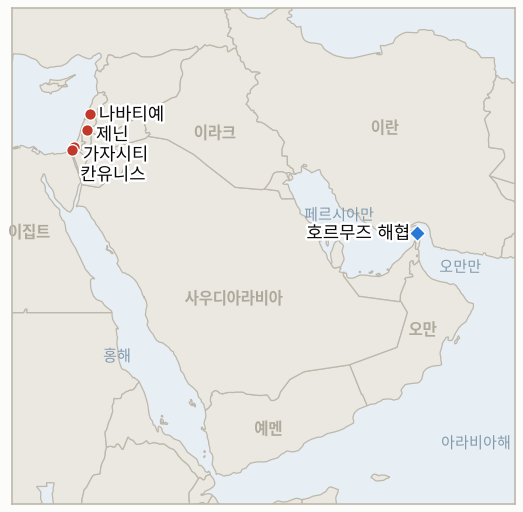

# 중동 일일 브리핑

**2026년 8월 29일**

- **보고 기간:** 약 24시간, 8월 28일 09:00 ~ 8월 29일 09:00 (한국시간)
- **종합 평가:** 금요일 보고 기간에는 지역의 두 핵심 트랙에서 정반대 방향의 지표 확정이 나왔다. 헤즈볼라의 드론 공격이 이스라엘군을 겨냥해 발생했고 이에 대한 이스라엘의 보복 공습으로 레바논 남부에서 신혼 여성이 숨지면서, 8월 15일 충돌이 6월 휴전 이후의 균형 상태로 되돌아가는 대신 실질적 교전을 재개시켰는지를 묻던 이 원장의 기존 지표가 확정으로 마무리됐다. 한편 이집트 방크미스르의 UAE 지점에 대한 재무부의 제재는 베센트 장관이 스스로 내건 "이번 주 안"이라는 약속을 이행한 것으로, 제재 캠페인의 수사가 예정대로 명확한 조치로 이어진 드문 사례였다. 이 두 확정 사이에서 트럼프 대통령은 6월 호르무즈 양해각서의 조건을 공식적으로 포기했는데, 이는 이미 운영 개시일을 확정하지 못한 이란-오만 항로 트랙에 또 다른 타격이 됐고, 가자지구와 서안지구에서는 치명적인 공습이 계속되며 휴전 이후 가자지구 누적 사망자가 1,310명을 넘어섰다. 한국 쪽에서는 호르무즈 외교의 후퇴에도 불구하고 유가가 사흘 하락 뒤 반등했고, 코스피는 연준 의장 케빈 워시의 잭슨홀 연설과 미국의 신규 반도체 관세 계획 보도에 따른 기술주 매도세로 3거래일 연속 상승 흐름을 마감했으며, 원화는 2025년 7월 이후 최고 수준으로 강세를 이어갔다.

---

## 1. 오늘의 주요 사건

<figure style="float:right; width:46%; margin:2pt 0 8pt 14pt;">

<figcaption style="font-size:8pt; color:#666; text-align:center; margin-top:3pt; font-style:italic;">주요 논의 지점</figcaption>
</figure>

### 1.1 헤즈볼라 드론 공격에 나바티예 보복 공습, 재개된 실질적 교전으로 확정

헤즈볼라는 목요일 레바논 남부에서 이스라엘군을 겨냥한 폭발물 드론 공격을 감행했다. 이스라엘군은 드론 1기는 요격했으나 나머지 1기와는 교신이 끊겼다고 밝혔으며, 이에 대응해 나바티예 지역의 헤즈볼라 시설을 겨냥한 일련의 공습을 실시해 결혼한 지 48시간밖에 되지 않은 것으로 레바논 측 보도가 전한 여성 1명이 숨지고 어린이를 포함해 6명이 다쳤다([Haaretz](https://www.haaretz.com/middle-east-news/lebanonnews/2026-08-27/ty-article/.premium/idf-strikes-in-lebanon-kill-one-wound-six-including-child-woman/000001a0-43f6-dfdc-afab-eff728230000); [The Times of Israel](https://www.timesofisrael.com/idf-strikes-southern-lebanon-town-alleging-ceasefire-violation-by-hezbollah/)). 이번 드론 공격과 그에 따른 공습은 IND-20260816-1이 자체 시험 기간 내에 요구했던 "이스라엘군에 대한 추가 헤즈볼라 공격"에 해당하며, 이로써 이 지표는 **확정**으로 마무리됐다. 8월 15일 충돌은 낙관적 결과인 휴전 후 균형 복귀가 아니라 실질적으로 재개된 교전 국면을 열었다는 뜻이다. 신규 IND-20260829-1은 이번 두 번째 충돌 자체가 자기 지속적 순환으로 이어지는지를 시험한다. **신뢰도: 높음** — 드론 공격과 요격·교신 두절 세부 사항, 공습에 따른 인명 피해(2등급, Haaretz·Times of Israel, 레바논 보건부 통계, 이스라엘군 발표). **신뢰도: 중간** — 목요일 브리핑 작성 당시에는 이 드론 공격 자체가 촉발 요인이라는 사실이 아직 파악되지 않았던 만큼, 이 사건이 목요일에 이미 보도된 나바티예 일대 공습 확대보다 더 직접적인 신호인지는 판단이 갈릴 수 있다.

### 1.2 트럼프, 6월 호르무즈 양해각서 조건 포기, 이미 정체된 항로 외교 한층 복잡해져

트럼프 대통령은 호르무즈 해협 재개방을 향한 진전으로 선전됐으나 몇 주 만에 양측 모두에게 사실상 무시된 6월 이란 양해각서 조건으로 복귀할 의사가 더는 없는 것으로 나타났다. 백악관 대변인 애나 켈리는 "대통령이 말했듯이, 이란 이슬람공화국과의 대화나 협상은 진행 중이지도, 예정돼 있지도 않다"며 해군 봉쇄는 "완전히 유효하게 지속되고" 있고 "이코노믹 아웃캐스트 작전이 정권을 지탱하는 남은 경제적 생명선을 끊기 위해 진행 중"이라고 밝혔다([월스트리트저널 인용, 예루살렘포스트](https://www.jpost.com/middle-east/iran-news/article-906879)). 행정부는 또한 임시 이란-오만 해상 항로 중재에서 오만의 역할을 부정적으로 보고 있으며, 무스카트가 "테헤란에 너무 많은 것을 양보했다"고 여기는 것으로 전해졌다. 이란 혁명수비대는 미국이 6월 조건으로 복귀하지 않는 한 호르무즈는 재개방되지 않을 것이라며 외교가 실패할 경우 "미국의 핵심 이익에 강력한 타격"을 가하겠다고 위협했고, 모하마드 라시디 국회 고위 의원은 "이해의 틀 밖의 어떤 제안도 받아들여지지 않을 것"이라고 말했다. 이번 사태는 9월 5일 시한을 앞둔 IND-20260816-3의 서명된 이란-오만 공동성명 확보 경로를 한층 더 어렵게 만든다. **신뢰도: 높음** — 트럼프의 양해각서 거부와 백악관 발표(1~2등급, WSJ 취재, 실명 대변인 발언). **신뢰도: 중간** — 이란의 보복 위협이 구체적 행동으로 이어질지는, 이 원장에서 "강력한 타격" 수사가 구체적 후속 조치 없이 반복돼 온 전례가 있어 불확실하다.

### 1.3 재무부, 방크미스르 UAE 지점 제재로 베센트 약속한 금융기관 지정 이행

미 재무부 금융범죄단속국(FinCEN)은 이란과의 연계를 이유로 이집트 국영은행 방크미스르 UAE 지점의 미국 금융기관 코레스은행 접근권을 박탈하는 규칙을 제안했다. 이는 이코노믹 아웃캐스트 작전 하에서 FinCEN 311조 규칙으로 겨냥된 첫 지점이다. 재무부는 이 지점이 이란의 그림자 금융망으로 평가되는 103개 기업을 위해 약 18억 달러를 처리했으며, 이 자금이 자금 세탁과 무기 조달, 지역 대리 세력 자금 지원에 쓰였다고 밝혔다([CNBC](https://www.cnbc.com/2026/08/28/treasury-uae-banque-misr-sanctions-iran.html); [워싱턴타임스](https://www.washingtontimes.com/news/2026/aug/28/treasury-announces-new-sanctions-egyptian-banks-uae-branch/)). 베센트 재무장관은 "방크미스르 UAE는 힘든 방식으로 알게 됐다. 오늘 우리는 이란 정권에 대한 지속적이고 노골적인 지원에 책임을 묻는 첫걸음을 내딛는다"고 말했다. 이 규칙은 방크미스르의 이집트 내 사업이나 다른 해외 지점에는 적용되지 않으며, 이집트 중앙은행은 "이집트에서 영업하는 모든 은행의 건전성과 회복력"을 강조했다. 이번 조치는 이코노믹 아웃캐스트 작전 하에서 명명된 금융기관 제재로서, 베센트 장관 스스로 내건 "이번 주 안" 약속 기한 내에 이뤄져 IND-20260825-1을 **확정**으로 마무리했다. **신뢰도: 높음** — FinCEN 규칙과 그 범위, 베센트 장관 발언(1등급, 재무부 발표 자료, 다수 매체의 실명 보도). **신뢰도: 중간** — 30일 공개 의견수렴 기간을 거쳐 제안대로 실제 발효될지는 아직 확정되지 않았다.

### 1.4 가자·서안지구 공습으로 8명 사망, 휴전 이후 누적 사망자 1,310명 넘어서

금요일 이스라엘의 공습으로 가자지구에서 팔레스타인인 5명이 숨졌다. 칸유니스 인근에서는 한 가족의 집에 대한 공습으로 형제 2명과 친척 1명이 사망했고, 가자시티에서는 별도의 공습 2건으로 2명이 더 숨졌는데 그중 1명은 알샤티 난민촌에서 발생한 공습으로, 이스라엘군은 이 공습으로 2023년 10월 7일 이스라엘에 침투한 것으로 지목한 하마스 지휘관 나빌 이브라힘 바스를 사살했다고 밝혔다([local10/AP](https://www.local10.com/business/2026/08/28/israeli-strikes-kill-5-in-gaza-and-3-in-west-bank-and-other-news-in-the-middle-east/); [예루살렘포스트](http://www.jpost.com/middle-east/iran-news/2026-08-28/live-updates-906868)). 별도로 제닌에서는 차량을 겨냥한 이스라엘의 공습으로 팔레스타인인 3명이 숨졌는데, 그중에는 이스라엘군이 제닌의 이미 해체된 테러 조직망과 연계됐으며 "중대한 테러 활동을 진전시키고 있었다"고 지목한 하마스 조직원 카이스 비트와니가 포함됐다. 하마스는 이 공습을 "잔혹한 범죄"라고 규탄했다. 목요일 확정된 최소 1,306명이라는 누적 사망자 수에 금요일 가자지구에서 추가로 확인된 5명의 사망자를 더하면, 휴전 이후 누적 사망자는 1,310명을 넘어선다. **신뢰도: 높음** — 가자지구 공습과 위치, 제닌 작전(2등급, AP 소스의 local10 보도, 이스라엘군 발표를 인용한 예루살렘포스트 실시간 업데이트, 병원 관계자). **신뢰도: 중간** — 정확한 누적 휴전 이후 사망자 수는, 이 원장이 전날 확정된 수치에 오늘 보도된 사망자 수를 더해 산출한 것으로, 보고 기간 중 단일 매체가 직접 재확인한 누적 총계는 아니다.

### 1.5 유가, 사흘 하락 뒤 반등... 코스피는 기술주 매도와 연준 불확실성에 상승 흐름 마감

브렌트유는 금요일 배럴당 88.31달러로 상승 마감했고 WTI는 83.40달러로 올랐다. 두 유종 모두 나흘 만의 첫 상승으로, 트럼프 대통령의 6월 호르무즈 양해각서 포기(§1.2)가 항로 불확실성을 완화하기는커녕 심화시켰음에도 나온 결과다. 이는 시장이 임박한 해결이 아니라 장기화된 항로 차질 위험을 가격에 반영하고 있음을 시사한다([Trading Economics](https://tradingeconomics.com/commodity/brent-crude-oil)). 한국 쪽에서는 코스피가 1.79% 하락한 6,788.88로 마감하며 3거래일 연속 상승 흐름을 마감했다. 투자자들은 제롬 파월 후임인 케빈 워시 연준 의장의 잭슨홀 기조연설을 앞두고, 그리고 트럼프 행정부가 새로운 반도체 관세를 검토 중이라는 보도 속에 기술주 비중이 큰 종목을 매도했다. 삼성전자는 3.38%, SK하이닉스는 4.45% 하락했으며, 외국인은 1조7,586억 원, 기관은 2,844억 원어치를 순매도한 반면 개인은 4,245억 원어치를 순매수했다([아시아경제](https://www.asiae.co.kr/en/article/2026082815500532441); [코리아중앙데일리](https://www.koreajoongangdaily.com/business/kospi-tumbles-as-tech-selloff-meets-tariff-and-fed-uncertainty/12849486)). 다만 원화는 8.4원 강세를 보이며 1,372.5원으로 2025년 7월 이후 최고 수준을 기록했다. 수출업체들이 달러를 매도한 데다, 신현송 한국은행 총재가 원화 추가 강세가 수입 물가 억제에 도움이 될 것이라고 밝힌 영향이다. **신뢰도: 높음** — 유가 마감 수준, 지수 수준, 업종 동향과 수급 데이터(1~2등급, Trading Economics, 아시아경제, 코리아중앙데일리). **신뢰도: 중간** — 반도체 관세 보도가 구체적인 직접 원인인지는, 여러 요인 중 하나로 인용됐을 뿐 지배적 원인으로 확정되지는 않았다.

---

## 2. 심층 분석: 동기와 유인

### 2.1 헤즈볼라는 왜 휴전 후 균형을 유지하는 대신 이스라엘군에 대한 드론 공격으로 실질적 교전 재개 위험을 감수했는가?

일부만 성공한 소규모 드론 공격은 헤즈볼라가 대규모 충돌을 촉발해 조직의 존립을 위협할 만한 이스라엘의 대응을 부르지 않으면서도, 국내 지지 기반과 이란에 지속적인 작전 능력과 억지력을 과시할 수 있게 해준다. 특히 카셈 사무총장이 이스라엘-레바논 기본합의안에 대한 공개적 거부를 계속하고 있는 만큼, 이러한 입장이 순전히 수사에 그치지 않고 어느 정도 작전적 신호를 동반해야 할 필요가 있었다. 부분적으로 실패한 단일 드론 공격은 이스라엘의 대응 임계값을 시험하면서도, 보복이 지나치게 클 경우 물러설 수 있을 만큼 부인 가능성을 유지하도록 설계된 것이다.

### 2.2 트럼프는 왜 이란과의 추가 협상 기반으로 활용하는 대신 지금 6월 양해각서 조건을 포기했는가?

이 양해각서는 이미 몇 주간 양측 모두에게 사실상 무시돼 왔고, 내부적으로는 테헤란에 지나치게 관대한 합의로 여겨져 왔다. 이를 공식적으로 포기하면 이란이나 오만이 이란-오만 항로의 기술적 진전에 대한 대가로 워싱턴이 해군 봉쇄 해제 같은 상응 양보를 해야 한다고 주장할 여지가 사라진다. 행정부가 이미 불충분하다고 판단한 합의를 버림으로써, 협상된 틀 대신 이코노믹 아웃캐스트 작전의 제재 트랙을 지렛대로 계속 밀어붙일 수 있게 된다.

### 2.3 재무부는 왜 더 크고 저명한 기관 대신 방크미스르 UAE 지점을 콕 집어 "주요" 지정 대상으로 삼았는가?

한 지점을 통해 18억 달러, 103개 기업이 연루된 그림자 금융 통로가 문서로 입증된 것은 구체적이고 증명 가능한 사례로, 베센트 장관이 예정대로 "주요 발표" 약속을 이행했다고 주장할 수 있게 해주면서도 세계적으로 시스템상 중요한 은행을 제재할 때 따르는 훨씬 더 큰 외교적·금융안정적 위험은 피할 수 있게 해준다. 방크미스르의 이집트 내 사업이 아닌 UAE 지점으로만 규칙을 명시적으로 한정한 것 역시, 가까운 지역 파트너인 카이로에 이번 조치가 이집트 은행 시스템 전반과의 단절이 아니라 특정 통로를 겨냥한 좁은 범위의 집행 조치임을 신호하려는 의도로 볼 수 있다.

### 2.4 이스라엘은 왜 한 지역에 작전을 집중하는 대신 같은 날 가자시티의 하마스 지휘관과 서안지구 제닌의 조직망을 동시에 타격했는가?

이스라엘의 휴전 이후 표적 선정 원칙은, 10월 7일 공격과 연계된 가자지구 잔존 지도부와 역사적으로 가자지구 지휘 체계와 연결된 서안지구 조직망을 휴전의 영토적 범위에 묶인 두 개의 별개 전장이 아니라 하나의 지속적 위협으로 취급한다. 같은 날 양쪽을 동시에 타격함으로써 이스라엘군은 조직의 지휘·작전 역량을 동시에 약화시키고 있다고 주장할 수 있게 되며, 가자 휴전이 서안지구에서의 표적 선정 결정을 제약하지 않는다는 메시지를 강화한다.

### 2.5 유가는 왜 호르무즈 외교 후퇴에도 긴장 완화 기대를 계속 반영하는 대신 반등했는가?

트럼프의 양해각서 포기는 시장이 가격에 반영하던, 통행료는 부과되지만 운영되는 항로로의 해결이라는 가장 확실한 단기 경로를 제거한다. 따라서 이번 후퇴는 외교 과정 자체에는 명백히 부정적이지만, 통제되고 허가에 좌우되는 통항이 더 오래 지속될 것이라는 점에서 공급 리스크에는 오히려 상승 요인으로 작용한다. 시장은 "항로가 곧 열린다"는 확률 가중 결과에서 "혼란이 지속된다"는 쪽으로 다시 방향을 조정하고 있으며, 이는 정산 가격에 반영된 위험 프리미엄을 낮추기보다 높이는 방향이다.

---

## 3. 한국에 대한 정책적 함의

### 3.1 노출도 스냅샷

| 항목 | 현재 수치 | 출처 |
| --- | --- | --- |
| 원유 수입 중 중동 비중 | 48.5% (2026년 5~7월), 전년 동기 69.1%에서 하락; 비중동 비중이 사상 처음으로 50%를 넘어섬 | 한국석유공사(KNOC), 아시아경제; `korea-exposure.md` |
| 7~8월 원유 조달 | 전년 동기 대비 110% 이상 확보(산업통상자원부, 7월 21일); 전략비축유 스와프 8월까지 연장, 현재까지 약 2,100만 배럴 스와프 | 산업통상자원부, 헤럴드경제, 한경; `korea-exposure.md` |
| 9월 원유 조달 | 90% 이상 확보(산업통상자원부, 7월 21일) | 산업통상자원부, 헤럴드경제; `korea-exposure.md` |
| 홍해 우회 항로 | 한국행 원유는 얀부/홍해 우회로를 계속 이용; 얀부에서 한국을 포함한 아시아 구매자로의 수출이 1년 전 100만 bpd 미만에서 약 400만 bpd로 급증 | Lloyd's List Intelligence; `korea-exposure.md` |
| 전략비축유 대응력 | 실제 소비 기준 약 26일분(추정); 스와프는 즉시 대응 가능하나 대규모 실전 검증은 없음 | CSIS, 산업통상자원부(7월 27일) |
| 정유사 사우디 지분 노출 | S-Oil(사우디 아람코 지분 약 63%), HD현대오일뱅크(아람코 지분 약 17%) | 공시자료; `korea-exposure.md` |
| 한국은행 기준금리 | 3.00%, 목요일 두 차례 연속 인상 이후 동결 | 코리아타임스 |
| 브렌트유 / WTI | 금요일 정산가 88.31달러 / 83.40달러, 호르무즈 양해각서 외교가 한층 더 후퇴했음에도 나흘 만의 첫 상승 | Trading Economics |
| 코스피 / 원달러 환율 | 코스피 -1.79%로 6,788.88 마감, 3거래일 연속 상승 흐름 마감; 원화는 8.4원 강세로 1,372.5원, 2025년 7월 이후 최고 | 아시아경제, 코리아중앙데일리 |
| 호르무즈 통항량 | 보고 기간 중 새로운 집계 없음; 마지막 확인된 수치는 8월 26일 8척(윈드워드), 위기 이전 수준을 크게 밑도는 상태 지속 | 윈드워드 데일리 인텔리전스 |

### 3.2 사안별 함의

**확정된 헤즈볼라-이스라엘 간 재개 교전은 레바논 남부의 휴전 후 균형이 흔들리고 있다는 두 번째 근거로, 중동 해상·에너지 회랑을 둘러싼 지역 안정성 위험을 추적하는 한국 정책 입안자들은 이를 IND-20260828-1이 별도로 추적 중인 암만 중재 시리아 협상과 함께 주시해야 한다.** 신규 IND-20260829-1은 향후 열흘간 이번 충돌 자체가 자기 지속적 순환으로 이어지는지를 시험한다.

**트럼프 대통령의 6월 호르무즈 양해각서 포기는 항로 문제 해결로 가는 가장 확실한 단기 외교 경로를 제거하는 것으로, 한국 원유 조달 담당자들은 이란-오만 해상항로 프레임워크를 여전히 미확정 상태로 취급하고 단기 항로 결정의 근거로 삼지 말아야 한다는 이 원장의 기존 평가를 재확인시킨다.** IND-20260816-3은 9월 5일 서명된 공동성명 확보 시한을 앞두고 여전히 열려 있으나, 그 가능성은 이제 더 낮아진 것으로 보인다.

**베센트 장관 스스로의 약속대로 예정된 시점에 나온 재무부의 방크미스르 UAE 지정은, 제재 캠페인의 개별 약속이 실제 조치로 이어질 수 있음을 보여주는 동시에 전체 캠페인의 확대 속도는 애초 "디데이"라는 표현이 시사했던 것보다 점진적임을 보여주는 사례로, 걸프 인접 은행 관계에서 2차 제재 노출을 관리하는 한국 기업들은 이를 주시해야 한다.** 이번 확정에 따른 신규 지표는 열리지 않으며, 캠페인의 추가 지정 여부는 기존의 제재 추적 맥락 안에서 계속 관찰된다.

**사흘 하락 뒤 호르무즈 외교가 더 후퇴하는 와중에도 나온 유가 반등은, 하루 단위 가격 방향보다 한국 원유 조달 담당자들에게 더 중요한 신호다. 2.5절의 분석대로 이번 정산가 변동은 여건 개선이 아니라 시장이 장기화된 공급 측 위험을 가격에 반영하는 것으로 읽어야 하며, 이는 항로가 여전히 단기 운항 옵션으로 취급돼서는 안 된다는 점을 재확인시킨다.** 코스피의 상승 흐름 마감은 중동 관련 전달 경로가 아니라 기술주 특유의 요인과 연준 관련 촉매에서 비롯된 것으로, 이 원장이 8월 중순 이후 추적해 온 지수의 지역 리스크로부터의 지속적인 탈동조화를 다시 한번 확인시켜 주며, 원화의 지속적 강세 역시 통화 측면에서 같은 탈동조화를 보여주는 또 하나의 근거다.

**검증 가능한 지표:**

- **IND-20260829-1** — 확정된 8월 27일 헤즈볼라의 이스라엘군 대상 드론 공격과 이스라엘의 나바티예 지역 보복 공습이, 6월 휴전 후 균형 상태와 구별되는 자기 지속적이고 재개된 교전 순환의 시작을 의미하는지, 아니면 양측이 다시 저강도, 간헐적 사건이라는 이전 패턴으로 되돌아가는지를 시험한다. 2026년 9월 8일까지 이스라엘군에 대한 추가 검증된 헤즈볼라 공격, 또는 레바논에서 5명 이상이 사망하는 이스라엘 공습이 확인되면 자기 지속적 확대 순환이 확정되며, 같은 시한까지 양측 모두에서 추가 공격이 없으면 이번 두 번째 충돌 역시 그 자체로 억제됐음을 뜻하는 반증으로 확정된다.

---

## 4. 주시 목록

- **가자지구 옐로우라인 사건이 이스라엘군의 공식 작전 대응을 불러오는지, 아니면 고립된 사건으로 남는지** (IND-20260816-2, 시한 8월 30일).
- **예멘의 확산이 확인되며 국제 중재 노력이 재개되는지** (IND-20260817-1, 시한 8월 31일).
- **트럼프의 호르무즈 미국 영토화 선언 의지가 반복된 수사를 넘어 구체적인 정책 조치로 이어지는지** (IND-20260817-2, 시한 8월 31일).
- **이스라엘이 준비 중인 알리 알타헤르 능선 작전이 실제로 개시되는지, 이제 그 주변에서 이미 확정된 재개 교전이 진행 중인 가운데** (IND-20260818-2, 시한 8월 31일).
- **이스라엘의 연 발사 관련 "공습 강화" 위협이 연에 특정된 확대 조치로 이어지는지, 아니면 기존 표적 선정과 구분되지 않는 수준에 머무는지** (IND-20260824-2, 시한 8월 30일).
- **로마 트랙의 잠정 9월 1일 8차 회담이 예정대로 진행되는지** (IND-20260807-2, 시한 9월 1일).
- **트럼프의 오만 폭격 위협이 실제 외교적·군사적 결과로 이어지는지** (IND-20260818-1, 시한 9월 1일).
- **후티의 모카 인근 사우디 해군 함정 공격 주장이 확인되거나 사우디의 직접 대응을 부르는지** (IND-20260818-3, 시한 9월 1일).
- **카츠의 조율 없는 서안지구 경찰권 이양이 진행되는지, 지연되는지, 아니면 막히는지** (IND-20260819-2, 시한 9월 1일).
- **미노안 디그니티호 치명적 공격의 배후가 규명되거나 군사적 대응을 부르는지** (IND-20260819-1, 시한 9월 2일).
- **국무부의 중동 대사관 외교관 복귀 계획이 진행되는지, 아니면 정체되는지** (IND-20260826-1, 시한 9월 2일).
- **네타냐후의 트럼프 평화안 거부에 대해, 평화이사회 특사 자신의 날카로운 비판에도 불구하고 여전히 부재한 공식 미국 대응이 나오는지** (IND-20260827-1, 시한 9월 2일).
- **호르무즈 전반의 완만한 통항량 증가와 구분되는, 신규 이란-오만 호르무즈 항로를 실제로 이용한 선박이 문서로 확인되는지** (IND-20260827-2, 시한 9월 2일).
- **이스라엘의 시리아·레바논 공습 강화가 암만 중재 1974년 정전선 협상을 탈선시키는지** (IND-20260828-1, 시한 9월 3일).
- **확정된 재개 헤즈볼라-이스라엘 교전이 자기 지속적 확대 순환으로 이어지는지** (IND-20260829-1, 시한 9월 8일).
- **트럼프의 6월 양해각서 포기로 한층 복잡해진 가운데, 운영 개시일이 명시된 서명된 이란-오만 호르무즈 공동성명이 확보되는지** (IND-20260816-3, 시한 9월 5일).
- **아부 알두후르 공습을 둘러싼 튀르키예-이스라엘 마찰이 확대되는지, 아니면 흡수되는지** (IND-20260823-1, 시한 9월 6일).
- **이스라엘군의 서안지구 "확전 임박" 경고 이후 실제로 폭력 패턴의 단계적 변화가 나타나는지** (IND-20260823-2, 시한 9월 6일).
- **배럭의 잇단 논란이 실제 미국 정책이나 인사 조치로 이어지는지** (IND-20260824-1, 시한 9월 6일).
- **밴홀런 주도의 서안지구 미국 시민 사망 관련 특권 결의안이 위원회 조치나 국무부 대응을 이끌어내는지** (IND-20260828-2, 시한 9월 6일).
- **이스라엘 활동가와 AFP 기자를 겨냥한 자나타 공격이 체포로 이어지는지** (IND-20260826-2, 시한 9월 8일).
- **마사페르 야타 체포가 지속적인 정착민 단속 전환을 의미하는지, 아니면 고립된 사례로 남는지** (IND-20260825-2, 시한 9월 8일).
- **시리아 핵물질 발견이 최종 합의와 검증된 제거로 이어지는지** (IND-20260812-2, 시한 9월 11일).
- **서안지구 이스라엘군에서 경찰로의 단속 권한 이양이 정착민 폭력을 줄이는지, 아니면 변화가 없는지** (IND-20260815-2, 시한 9월 12일).
- **시리아가 이란의 경고에도 불구하고 레바논 내 헤즈볼라에 대한 조치에 나서는지, 아니면 대립이 수사에 머무는지** (IND-20260815-3, 시한 9월 15일).
- **케인 상원의원의 오만 관련 특권 전쟁권한 결의안이 9월 상원 복귀 시 통과되는지, 부결되는지, 아니면 본회의 표결에 오르지 못하는지** (IND-20260819-3, 시한 9월 25일).
- **예멘의 교전이 극적으로 추가 확대되는지, 아니면 소모전 양상으로 정착되는지.**
- **이란의 피습 핵시설에 대한 IAEA 접근 차단이 새로운 사찰 프로토콜로 해소되는지, 아니면 지속적 교착 상태로 굳어지는지.**
- **캐롤라인 베젠기호 기름 유출이 인양 작업 개시 이후 통제되는지.**
- **케슘섬 폭발이 실제 공격으로 확인되는지, 아니면 오경보로 결론 나는지.**

---

## 5. 출처 신뢰도 요약

| 주장 | 출처 | 신뢰도 |
| --- | --- | --- |
| 헤즈볼라의 이스라엘군 대상 폭발물 드론 공격과 나바티예 지역 보복 공습, 인명 피해 | Haaretz, The Times of Israel (2등급, 이스라엘군 발표, 레바논 보건부) | 높음 |
| 트럼프의 6월 호르무즈 양해각서 조건 포기와 백악관 발표 | 월스트리트저널 인용 예루살렘포스트 (1~2등급, 취재 보도, 실명 대변인 발언) | 높음 |
| 이란 혁명수비대와 의원의 양해각서 거부 관련 위협 | 예루살렘포스트 (2등급, 공식 발언) | 후속 조치 여부는 중간 |
| 재무부의 방크미스르 UAE 지점 대상 FinCEN 규칙, 18억 달러/103개 기업 수치, 베센트 발언 | CNBC, 워싱턴타임스 (1~2등급, 재무부 발표 자료, 실명 발언) | 높음 |
| 나빌 이브라힘 바스 등 하마스 지휘관을 포함해 가자지구에서 5명 사망한 공습 | local10/AP, 예루살렘포스트 실시간 업데이트 (2등급, 이스라엘군 발표, 병원 관계자) | 높음 |
| 카이스 비트와니를 포함해 3명이 사망한 제닌 공습 | 예루살렘포스트 실시간 업데이트 (2등급, 이스라엘군 규정, 하마스 발표) | 높음 |
| 휴전 이후 가자지구 누적 사망자 1,310명 초과 | 전날 확정 총계에 오늘 보도된 사망자를 더한 이 원장의 산출(2~3등급, 보건 당국 수치, 보고 기간 중 단일 매체의 재확인 총계는 아님) | 중간 |
| 브렌트유·WTI 정산가 | Trading Economics (1등급, 시장 데이터) | 높음 |
| 코스피 마감, 업종 동향, 수급 데이터, 잭슨홀·관세 맥락 | 아시아경제, 코리아중앙데일리 (1~2등급, 거래소 데이터, 실명 애널리스트 발언) | 높음 |
| 원달러 환율 마감과 한국은행 총재 발언 | 코리아중앙데일리 (1~2등급, 실명 중앙은행 발언) | 높음 |
