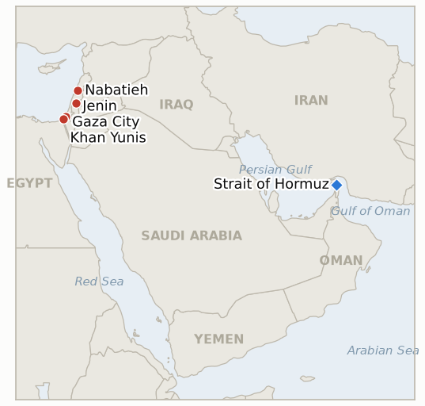

# Middle East Daily Briefing

**August 29, 2026**

- **Reporting window:** ~24 hours, August 28, 09:00 to August 29, 09:00 KST
- **Overall assessment:** Friday's window resolved two indicators in opposite directions for the region's two main tracks. A Hezbollah drone attack on IDF troops drew retaliatory Israeli strikes that killed a newlywed woman in south Lebanon, confirming this ledger's standing question of whether the August 15 exchange would reopen active combat rather than settle back into the post-June-truce equilibrium; separately, Treasury's sanctioning of Egypt's Banque Misr UAE branch fulfilled Bessent's own "by the end of this week" promise, a rare case of the sanctions campaign's rhetoric converting cleanly into a named action on schedule. Those two confirmations bookended a day that also saw Trump formally abandon the June Hormuz memorandum's terms, a further blow to the Iran-Oman corridor track already lacking an operating date, and continued lethal strikes in Gaza and the West Bank that pushed the post-ceasefire Gaza toll past 1,310. On the Korea side, oil rebounded off a three-day slide even as the Hormuz diplomacy setback deepened, while KOSPI snapped its own three-day winning streak on a tech selloff tied to Fed Chair Kevin Warsh's Jackson Hole speech and reported new US semiconductor tariff plans, even as the won pushed to its strongest level since July 2025.

---

## 1. What Happened

<figure style="float:right; width:46%; margin:2pt 0 8pt 14pt;">

<figcaption style="font-size:8pt; color:#666; text-align:center; margin-top:3pt; font-style:italic;">Major places of discussion</figcaption>
</figure>

### 1.1 Hezbollah Drone Attack on IDF Troops Draws Retaliatory Strikes in Nabatieh, Confirming a Renewed Active Combat Exchange

Hezbollah launched an explosive drone attack against Israeli troops in south Lebanon Thursday; Israel's military said one drone was intercepted while contact was lost with the second, and the IDF responded with a series of strikes on Hezbollah infrastructure in the Nabatieh area that killed one woman, described by Lebanese reporting as newly married only 48 hours earlier, and wounded six people including a child ([Haaretz](https://www.haaretz.com/middle-east-news/lebanonnews/2026-08-27/ty-article/.premium/idf-strikes-in-lebanon-kill-one-wound-six-including-child-woman/000001a0-43f6-dfdc-afab-eff728230000); [The Times of Israel](https://www.timesofisrael.com/idf-strikes-southern-lebanon-town-alleging-ceasefire-violation-by-hezbollah/)). The drone attack and the strikes it drew are a further verified Hezbollah attack on IDF forces within IND-20260816-1's own test window, resolving that indicator **confirmed**: the August 15 exchange has opened a renewed active-combat phase rather than settling back into the post-June-truce equilibrium the falsification branch required. New IND-20260829-1 tests whether this second exchange itself becomes a self-sustaining cycle or is likewise absorbed without further escalation. **Confidence: High** on the drone attack, the interception and lost-contact detail, and the strikes' casualties (Tier 2, Haaretz and Times of Israel, Lebanese Health Ministry figures, IDF statement); Medium on whether this specific exchange, rather than the broader Nabatieh-area strikes already reported Thursday, is what most directly signals the trend, since Thursday's brief did not yet have the drone-attack trigger in hand.

### 1.2 Trump Abandons June Hormuz Memorandum's Terms, Further Complicating Already Stalled Corridor Diplomacy

President Trump is no longer interested in returning to the terms of the June memorandum of understanding with Iran, which had been touted as a step toward reopening the Strait of Hormuz but was effectively disregarded by both sides within weeks; White House spokeswoman Anna Kelly said "there are no talks or conversations going on, or scheduled, with the Islamic Republic of Iran," and that the naval blockade "remains in full force and effect" while "Operation Economic Outcast is underway to sever every remaining economic lifeline sustaining the regime" ([The Wall Street Journal via The Jerusalem Post](https://www.jpost.com/middle-east/iran-news/article-906879)). The administration is also reported to view Oman's role in brokering the temporary Iran-Oman shipping corridor unfavorably, believing Muscat "gave away too much to Tehran." Iran's Revolutionary Guard said Hormuz will not reopen unless the US returns to the June terms and threatened "heavy blows to US vital interests" if diplomacy fails, while senior legislator Mohammad Rashidi said "no proposal outside the framework of understanding will be accepted." The development further undermines IND-20260816-3's path to a signed Iran-Oman joint statement with an operating date by its September 5 deadline. **Confidence: High** on Trump's rejection of the MOU and the White House statement (Tier 1-2, WSJ reporting, on-record spokeswoman quote); Medium on Iran's retaliatory threat translating into any concrete action, since "heavy blows" rhetoric has recurred without a specific follow-through in this ledger before.

### 1.3 Treasury Sanctions Banque Misr's UAE Branch, Fulfilling Bessent's Promised Financial Institution Designation

The US Treasury Department's Financial Crimes Enforcement Network proposed a rule that would revoke the correspondent banking access of Egypt's state-owned Banque Misr's UAE branch to US financial institutions, the first branch targeted under a FinCEN Section 311 rule as part of Operation Economic Outcast; Treasury said the branch processed approximately $1.8 billion for 103 companies it assesses are part of Iranian shadow banking networks used to launder funds, procure weapons and bankroll regional proxy groups ([CNBC](https://www.cnbc.com/2026/08/28/treasury-uae-banque-misr-sanctions-iran.html); [The Washington Times](https://www.washingtontimes.com/news/2026/aug/28/treasury-announces-new-sanctions-egyptian-banks-uae-branch/)). Treasury Secretary Scott Bessent said "Banque Misr UAE decided to find out the hard way, and today, we are taking the first step in holding it accountable for its continued, egregious support of the Iranian regime"; the rule does not affect Banque Misr's Egyptian operations or its other overseas branches, and Egypt's central bank affirmed "the strength and resilience of all banks operating in Egypt." The action is a named financial institution sanctioned under Operation Economic Outcast within Bessent's own "by the end of this week" promise, resolving IND-20260825-1 **confirmed**. **Confidence: High** on the FinCEN rule, its scope and Bessent's quote (Tier 1, Treasury press materials and multi-outlet on-record reporting); Medium on whether the rule's 30-day public comment period ultimately takes effect as proposed, since the substantive restriction has not yet been finalized.

### 1.4 Gaza and West Bank Strikes Kill Eight as Post-Ceasefire Toll Passes 1,310

Israeli strikes killed five Palestinians in Gaza Friday: two brothers and a relative died in a strike on their family's home near Khan Younis, and two more died in separate Gaza City strikes, one in the Al-Shati refugee camp where the IDF said it killed Hamas commander Nabil Ibrahim Bass, whom it accused of infiltrating Israel on October 7, 2023 ([local10/AP](https://www.local10.com/business/2026/08/28/israeli-strikes-kill-5-in-gaza-and-3-in-west-bank-and-other-news-in-the-middle-east/); [The Jerusalem Post](http://www.jpost.com/middle-east/iran-news/2026-08-28/live-updates-906868)). Separately, an Israeli strike on a vehicle in Jenin killed three Palestinians including Qais Bitwani, whom the IDF described as a Hamas operative tied to the city's now-dismantled terrorist network and involved in "advancing significant terrorist activity"; Hamas condemned the strike as a "heinous crime." Combined with Thursday's confirmed toll of at least 1,306 killed since the October ceasefire, Friday's five additional Gaza deaths push the running total past 1,310. **Confidence: High** on the Gaza strikes, locations and the Jenin operation (Tier 2, AP-sourced local10 reporting, JPost live updates citing IDF statements, hospital officials); Medium on the precise cumulative post-ceasefire toll, since this ledger's running total is computed from the prior day's confirmed figure plus today's reported deaths rather than a single outlet's own restated cumulative count in the window.

### 1.5 Oil Snaps Three-Day Slide as KOSPI Snaps Its Own Winning Streak on Tech Selloff and Fed Uncertainty

Brent crude settled up to $88.31 a barrel Friday and WTI to $83.40, both benchmarks' first gains in four sessions, even as Trump's abandonment of the June Hormuz MOU (§1.2) deepened rather than eased corridor uncertainty, a combination consistent with traders pricing extended disruption risk rather than an imminent resolution ([Trading Economics](https://tradingeconomics.com/commodity/brent-crude-oil)). On the Korea side, KOSPI fell 1.79% to 6,788.88, snapping a three-day winning streak, as investors sold technology heavyweights ahead of Fed Chair Kevin Warsh's Jackson Hole keynote and amid reports the Trump administration is weighing a new round of semiconductor tariffs; Samsung Electronics fell 3.38% and SK hynix 4.45%, while foreign investors sold a net 1.76 trillion won and institutions a net 284.4 billion won, partly offset by individual investors' net 424.5 billion won in purchases ([Asia Business Daily](https://www.asiae.co.kr/en/article/2026082815500532441); [Korea JoongAng Daily](https://www.koreajoongangdaily.com/business/kospi-tumbles-as-tech-selloff-meets-tariff-and-fed-uncertainty/12849486)). The won nonetheless firmed 8.4 won to 1,372.5, its strongest level since July 2025, as exporters sold dollars and Bank of Korea Governor Shin Hyun-song said further won appreciation would help contain imported inflation. **Confidence: High** on the settle levels, index level, sector moves and flow data (Tier 1-2, Trading Economics, Asia Business Daily, Korea JoongAng Daily); Medium on the semiconductor tariff report as the specific proximate driver, since it is cited as one of several contributing factors rather than confirmed as the dominant cause.

---

## 2. Deep Dive: Incentives and Motives

### 2.1 Why would Hezbollah risk a return to active combat with a drone attack on IDF troops rather than hold the post-June-truce equilibrium?

Because a modest, partly-intercepted drone strike lets Hezbollah demonstrate continued operational capability and deterrence to its domestic base and to Iran without committing to the kind of large-scale confrontation that would invite an existential Israeli response, especially as chief Naim Qassem's continued public rejection of any Israel-Lebanon framework agreement needs some operational signal behind it rather than reading as purely rhetorical opposition; a single, partly-failed drone attack is calibrated to probe Israel's response threshold while remaining deniable enough to walk back if Israel's retaliation proves disproportionate.

### 2.2 Why would Trump abandon the June MOU's terms now rather than use them as a basis to negotiate further with Iran?

Because the MOU had already been effectively disregarded by both sides for weeks and was viewed internally as too lenient toward Tehran, so formally abandoning it removes any residual argument Iran or Oman could make that Washington owes reciprocal concessions, such as lifting the naval blockade, in exchange for the Iran-Oman corridor's technical progress; walking away from a framework the administration already considers a bad deal lets it keep pressing Operation Economic Outcast's sanctions track as leverage instead of a negotiated instrument its own officials view as insufficiently favorable.

### 2.3 Why would Treasury target Banque Misr's UAE branch specifically rather than a larger, more prominent institution for its promised "major" designation?

Because a documented $1.8 billion, 103-company shadow-banking pipeline through one branch is a concrete, provable case that lets Treasury claim it fulfilled Bessent's "major announcement" promise on schedule while avoiding the far larger diplomatic and financial-stability risk of sanctioning a globally systemic bank; explicitly limiting the rule to the UAE branch, and not Banque Misr's Egyptian operations, also lets Washington signal to Cairo, a close regional partner, that this is a narrow enforcement action against a specific conduit rather than a broader rupture with Egypt's banking system.

### 2.4 Why would Israel strike a Hamas commander in Gaza City and a Jenin cell in the West Bank on the same day rather than concentrate operations in one theater?

Because Israel's post-ceasefire targeting doctrine treats Hamas's dispersed networks, the residual Gaza leadership tied to the October 7 attack and West Bank cells historically linked to Gaza's command structure, as a single continuous threat rather than two separate theaters bound by the ceasefire's territorial scope, so striking both on the same day lets the IDF claim it is degrading the group's command and operational capacity in parallel, reinforcing the message that the Gaza ceasefire does not constrain Israeli targeting decisions in the West Bank.

### 2.5 Why would oil rebound on a Hormuz diplomacy setback rather than continuing to price in easing tension?

Because Trump's abandonment of the MOU removes the clearest near-term pathway traders had been pricing toward a resolved, tolled-but-operating corridor, so the setback reads as bullish for supply risk, a longer period of constrained, permission-gated transits, even though it is unambiguously bearish for the diplomatic process itself; the market is repricing the probability-weighted outcome away from "corridor opens soon" and back toward "disruption persists," which raises rather than lowers the risk premium embedded in the settle price.

---

## 3. Policy Implications for South Korea

### 3.1 Exposure snapshot

| Item | Current reading | Source |
| --- | --- | --- |
| Middle East share of crude imports | 48.5% (May-July 2026), down from 69.1% a year earlier; non-Middle East share crossed 50% for the first time on record | KNOC via Asia Business Daily; `korea-exposure.md` |
| July-August crude procurement | 110%+ of prior-year volume secured (MOTIE, July 21); strategic reserve swap extended through August, ~21 million barrels swapped to date | MOTIE via Herald Business, Hankyung; `korea-exposure.md` |
| September crude procurement | 90%+ secured (MOTIE, July 21) | MOTIE via Herald Business; `korea-exposure.md` |
| Red Sea detour routing | Korean-bound crude cargoes continue via the Yanbu/Red Sea workaround; Yanbu exports to Asian buyers including Korea have surged to ~4 million bpd from under 1 million bpd a year earlier | Lloyd's List Intelligence; `korea-exposure.md` |
| Strategic reserve coverage | ~26 days of actual consumption (estimate); swap on immediate standby, untested at scale | CSIS; MOTIE July 27 |
| Refiner Saudi ownership exposure | S-Oil (Saudi Aramco majority ~63%), HD Hyundai Oilbank (Aramco ~17%) | Public filings; `korea-exposure.md` |
| BOK base rate | 3.00%, unchanged since Thursday's second consecutive hike | Korea Times |
| Brent / WTI | Settle $88.31 / $83.40 Friday, first gain in four sessions even as Hormuz MOU diplomacy collapsed further | Trading Economics |
| KOSPI / USD-KRW | KOSPI -1.79% to 6,788.88, snapping a three-day winning streak; won firmed 8.4 won to 1,372.5, strongest since July 2025 | Asia Business Daily; Korea JoongAng Daily |
| Hormuz transits | No fresh count in the window; last verified 8 vessels for Aug 26 (Windward), far below the pre-disruption norm | Windward Daily Intelligence |

### 3.2 Implications by development

**The confirmed renewed active-combat exchange between Hezbollah and Israel adds a second data point that south Lebanon's post-June-truce equilibrium is fraying, a regional stability risk Korean planners tracking the broader security environment around Middle East shipping and energy corridors should weigh alongside the Amman-mediated Syria talks IND-20260828-1 is separately tracking.** New IND-20260829-1 tests whether this specific exchange becomes self-sustaining over the coming ten days.

**Trump's abandonment of the June Hormuz MOU removes the clearest near-term diplomatic pathway to a resolved corridor, reinforcing that Korean crude planners should continue treating the Iran-Oman shipping-route framework as unsettled rather than a basis for near-term routing decisions, consistent with this ledger's standing assessment since the corridor was first announced.** IND-20260816-3 remains open with its September 5 deadline for a signed joint statement now looking less likely to be met.

**Treasury's Banque Misr UAE designation, arriving on schedule with Bessent's own promise, is a data point that the sanctions campaign's individual commitments can convert into real action even as its broader escalatory trajectory remains gradual rather than the "D-Day" framing originally suggested, a distinction Korean firms navigating secondary-sanctions exposure in Gulf-adjacent banking relationships should track.** No new indicator opens on this resolution; the underlying campaign's further designations remain part of the standing sanctions-tracking context.

**Oil's rebound off a three-day slide even as Hormuz diplomacy deteriorates further is the more relevant signal for Korean crude planners than any single day's price direction; section 2.5's analysis means the settle move should be read as the market pricing extended supply-side risk, not improving conditions, reinforcing that the corridor should still not be treated as a near-term routing option.** KOSPI's snapped winning streak, on tech-specific and Fed-related catalysts rather than any Middle East transmission channel, again confirms the index's continued decoupling from regional risk that this ledger has tracked since mid-August, even as the won's continued strengthening adds a further data point to that same decoupling on the currency side.

**Testable indicators:**

- **IND-20260829-1** — The confirmed August 27 Hezbollah drone attack on IDF troops and Israel's retaliatory Nabatieh-area strikes either mark the start of a renewed, self-sustaining cycle of exchanges distinguishable from the post-June-truce equilibrium, or the two sides revert to the prior pattern of intermittent, lower-casualty incidents without a further attack from either side. A further verified Hezbollah attack on IDF forces, or an Israeli strike killing five or more people in Lebanon, by ~2026-09-08 confirms a self-sustaining escalatory cycle; no further attack from either side through the same date falsifies it, showing this second exchange was itself contained.

---

## 4. Watch List

- **Whether the Gaza Yellow Line incidents prompt a formal IDF operational response or stay isolated** (IND-20260816-2, deadline August 30).
- **Whether Yemen's confirmed spread draws renewed international mediation** (IND-20260817-1, deadline August 31).
- **Whether Trump's declared intent to make Hormuz US territory produces any concrete policy step beyond repeated rhetoric** (IND-20260817-2, deadline August 31).
- **Whether Israel's prepared Ali al-Taher ridge operation actually launches, now with a confirmed renewed active-combat exchange already underway around it** (IND-20260818-2, deadline August 31).
- **Whether Israel's kite-launch "intensify strikes" threat converts into a documented, kite-specific escalation or stays indistinguishable from ongoing targeting** (IND-20260824-2, deadline August 30).
- **Whether the Rome track's provisionally scheduled September 1 eighth round proceeds** (IND-20260807-2, deadline September 1).
- **Whether Trump's threat to bomb Oman produces any real diplomatic or military consequence** (IND-20260818-1, deadline September 1).
- **Whether the Houthis' claimed strike on Saudi naval vessels near Mocha is confirmed or draws a direct Saudi response** (IND-20260818-3, deadline September 1).
- **Whether Katz's uncoordinated West Bank police handover proceeds or is delayed or blocked** (IND-20260819-2, deadline September 1).
- **Whether the fatal Minoan Dignity attack is ever attributed or draws a military response** (IND-20260819-1, deadline September 2).
- **Whether the State Department's diplomat-return plan to Middle East embassies proceeds or stalls** (IND-20260826-1, deadline September 2).
- **Whether Netanyahu's rejection of Trump's peace plan draws a formal US response, still absent despite the Board of Peace envoy's own sharpened criticism** (IND-20260827-1, deadline September 2).
- **Whether a vessel is documented using the new Iran-Oman Hormuz corridor specifically, distinct from the modest general uptick in Hormuz traffic** (IND-20260827-2, deadline September 2).
- **Whether Israel's intensified Syria and Lebanon strikes derail the Amman-mediated 1974 line security talks** (IND-20260828-1, deadline September 3).
- **Whether the confirmed renewed Hezbollah-Israel exchange becomes a self-sustaining escalatory cycle** (IND-20260829-1, deadline September 8).
- **Whether a signed Iran-Oman Hormuz joint statement with an operating date is reached, now further complicated by Trump's abandonment of the June MOU** (IND-20260816-3, deadline September 5).
- **Whether the Turkey-Israel friction over the Abu al-Duhur strike escalates or is absorbed** (IND-20260823-1, deadline September 6).
- **Whether the IDF's West Bank "brink of escalation" warning is followed by an actual step change in the violence pattern** (IND-20260823-2, deadline September 6).
- **Whether Barrack's back-to-back controversies produce any actual US policy or personnel consequence** (IND-20260824-1, deadline September 6).
- **Whether the Van Hollen-led privileged resolution on West Bank American deaths forces committee action or a State Department response** (IND-20260828-2, deadline September 6).
- **Whether the Jannatah attack on Israeli activists and an AFP journalist draws any arrest** (IND-20260826-2, deadline September 8).
- **Whether the Masafer Yatta arrests mark a durable settler-enforcement shift or stay an isolated case** (IND-20260825-2, deadline September 8).
- **Whether the Syria nuclear material find converts into a concluded agreement and verified removal** (IND-20260812-2, deadline September 11).
- **Whether the West Bank IDF-to-police enforcement transfer reduces settler violence, or leaves it unchanged** (IND-20260815-2, deadline September 12).
- **Whether Syria moves against Hezbollah in Lebanon despite Iran's warning, or the confrontation stays rhetorical** (IND-20260815-3, deadline September 15).
- **Whether Kaine's privileged war powers resolution on Oman passes, fails, or never reaches a floor vote when the Senate returns in September** (IND-20260819-3, deadline September 25).
- **Whether Yemen's fighting produces a further dramatic escalation or settles into an attritional pattern.**
- **Whether Iran's blocked IAEA access to strike-damaged nuclear sites is resolved by a new inspection protocol or hardens into a durable standoff.**
- **Whether the Caroline Bezengi oil spill is contained now that salvage work has begun.**
- **Whether the Qeshm Island explosions are ever confirmed as a real strike or resolved as a false alarm.**

---

## 5. Source Quality Summary

| Claim | Sources | Confidence |
| --- | --- | --- |
| Hezbollah explosive drone attack on IDF troops and retaliatory Nabatieh-area strikes, casualties | Haaretz, The Times of Israel (Tier 2, IDF statement, Lebanese Health Ministry) | High |
| Trump's abandonment of the June Hormuz MOU's terms and White House statement | The Wall Street Journal via The Jerusalem Post (Tier 1-2, sourced reporting, on-record spokeswoman quote) | High |
| Iranian IRGC and legislator threats over the MOU rejection | The Jerusalem Post (Tier 2, official statements) | Medium on follow-through |
| Treasury's FinCEN rule against Banque Misr's UAE branch, $1.8bn/103-company figure, Bessent quote | CNBC, The Washington Times (Tier 1-2, Treasury press materials, on-record statements) | High |
| Gaza strikes killing five, including Hamas commander Nabil Ibrahim Bass in Al-Shati | local10/AP, The Jerusalem Post live updates (Tier 2, IDF statements, hospital officials) | High |
| Jenin strike killing three including Qais Bitwani | The Jerusalem Post live updates (Tier 2, IDF characterization, Hamas statement) | High |
| Post-ceasefire Gaza toll passing 1,310 | Ledger computation from prior confirmed total plus today's reported deaths (Tier 2-3, health-official figures, not independently restated as a single cumulative total in the window) | Medium |
| Brent and WTI settle levels | Trading Economics (Tier 1, market data) | High |
| KOSPI close, sector moves, flow data, Jackson Hole and tariff context | Asia Business Daily, Korea JoongAng Daily (Tier 1-2, exchange data, on-record analyst quote) | High |
| USD/KRW close and BOK governor's remarks | Korea JoongAng Daily (Tier 1-2, on-record central bank quote) | High |
