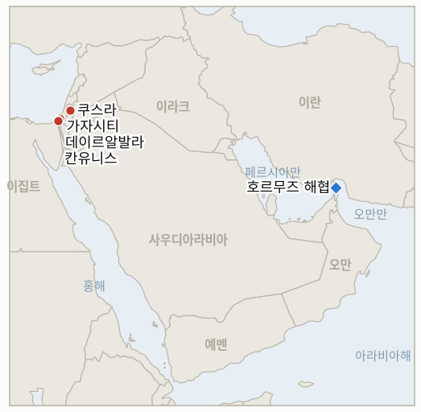

# 중동 일일 브리핑

**2026년 8월 30일**

- **보고 기간:** 약 24시간, 8월 29일 09:00 ~ 8월 30일 09:00 (한국시간)
- **종합 평가:** 이 브리핑이 가장 오래 추적해 온 가자 관련 지표 두 건이 같은 8월 30일 시한에 도달해 서로 반대 방향으로 종결됐다. 단순한 우연이 아니라 실제로 갈린 결과다. 가자 연 발사에 대한 이스라엘의 강경 대응 최후통첩은 수사(修辭)가 아닌 실제 문서화된 집행으로 전환됐다. 이번 조사에서 드러난 증거에 따르면 카츠 국방장관은 8월 27일 사흘 시한 종료를 공식 발표하며 향후 발사에 대한 명시적 대응 지침을 내렸고, 여기에 대피 경고를 동반한 공습과 가자 공습 승인 문턱의 조용한 하향 조정이 겹쳐 해당 위협이 수사에 그치지 않았음을 확증했다. 반면 옐로 라인 지표는 정반대로 종결됐다. 토요일 발생한 추가 폭발물 사건은 8월 15일 이후 모든 이전 사건이 그랬듯 동일한 통상적·국지적 대응만 이끌어냈을 뿐, 이 지표가 포착하려 했던 공식 작전 대응으로는 한 번도 이어지지 않았다. 가자 외 지역에서는 이란 혁명수비대 해군과 미 중부사령부가 호르무즈 해협의 통제 주체를 두고 정면으로 상충하는 주장을 내놓았고, 쿠스라 정착민 습격이 재발하며 네타냐후 총리가 이 브리핑이 추적해 온 서안지구 폭력 사태에 대해 처음으로 직접 유감을 표명했으나, 압수된 차량이 실제 공격 차량과 달랐다는 보도는 실질적 후속 조치 여부에 의문을 남긴다. 베이루트에서는 헤즈볼라의 나임 카셈이 무장해제 프레임워크 거부 입장을 완화가 아닌 강경화했고, 이는 암만 중재의 시리아 협상이 움직일 여지를 좁혔다.

---

## 1. 무슨 일이 있었나

<figure style="float:right; width:46%; margin:2pt 0 8pt 14pt;">

<figcaption style="font-size:8pt; color:#666; text-align:center; margin-top:3pt; font-style:italic;">주요 논의 지점</figcaption>
</figure>

### 1.1 가자 연 발사 위협, 실제 정책으로 전환되며 6일 된 지표 확증으로 종결

이스라엘이 8월 23일 가자발 연이 이스라엘 지역 사회를 향해 날아드는 데 대해 "공습을 강화하겠다"고 밝힌 최후통첩이, 이번 조사에서 드러난 증거에 따르면 수사가 아닌 실제 집행으로 전환됐다. 카츠 국방장관은 8월 27일 사흘 시한 종료를 공식 발표하며 군이 "추가 발사 시도에 단호하고 확고히 대응하라는 명확한 지시"를 받았고 "이 현상에 대한 침묵은 끝났다"고 밝혔다([Al-Quds](https://www.alquds.com/en/posts/255693-katz-announces-end-of-three-day-deadline-threatens-gaza-with-displacement-and)). 시한 종료를 전후해 이스라엘군은 대피 경고 후 부레이지 난민촌의 한 건물을 타격했으며, 미처 대피하지 못한 한 가족 중 4세 아동이 사망했다([Al Jazeera](https://www.aljazeera.com/news/2026/8/27/three-killed-in-strikes-on-gaza-as-israel-renews-threats-over-kite-flying)). 별도로, 재러드 쿠슈너의 외교 방문이 돌파구를 만들지 못한 뒤 이스라엘군은 참모총장뿐 아니라 남부사령관도 공습을 승인할 수 있도록 가자 공습 승인 문턱을 다시 낮췄고, 담당자들에게 "연 발사자를 식별해 표적화하라"는 구체적 임무가 부여됐다([Israel Hayom](https://www.israelhayom.com/2026/08/27/israel-changes-targeted-killing-policy-against-hamas-in-gaza/)). 대피 경고를 동반한 공습과 향후 지침을 명시한 집행 정책이 결합되며 IND-20260824-2의 확증 기준, 즉 연 발사와 명시적으로 연결된 문서화된 공습 또는 확대된 표적 설정, 을 충족했다. 이는 지난 한 주 대부분 이 브리핑이 추적했던, 통상적 패턴과 구분하기 어려운 모호한 양상과는 다른 결과다. **신뢰도: 높음** (카츠 장관의 발언과 정책 변경, 2등급, Al-Quds, Israel Hayom, 공식 발언 인용); 부레이지 공습의 연 발사 직접 연관성에 대해서는 **신뢰도: 중간** (대피 경고 대상이 연 발사와 관련됐다는 점이 제3의 출처로 독립 확인되지는 않음).

### 1.2 이란 혁명수비대, 호르무즈 "완전한 통제" 선언... 중부사령부는 자체 봉쇄 실적으로 맞대응

이란 이슬람혁명수비대(IRGC) 해군은 토요일 호르무즈 해협에 대해 "완전한 통제"를 유지하고 있다고 선언하며, 테헤란과 조율하지 않는 선박에 대해서는 "미군의 대이란 적대 행위가 끝나고 합의된 사항이 이행될 때까지" 해협을 계속 폐쇄하겠다고 밝혔고, 해협이 개방돼 있다는 미국 측 주장을 "명백한 거짓말"이라고 일축했다([Haaretz](https://www.haaretz.com/israel-news/israel-security/2026-08-29/ty-article-live/irgc-navy-says-it-has-full-control-over-strait-of-hormuz/000001a0-4b37-d6be-afb5-5bb7b3520000)). 미 중부사령부(CENTCOM)는 해상 봉쇄의 자체 집행 실적, 즉 봉쇄 시작 이후 상선 82척 우회, 3척 무력화, 2척 나포, 을 내세우며 USS 존 폴 존스함 승조원들이 해협을 감시하는 이미지를 공개했다([Daily News Egypt](https://www.dailynewsegypt.com/2026/08/29/irans-irgc-claims-complete-control-of-hormuz-as-us-forces-redirect-82-ships-under-blockade/)). 페제시키안 대통령은 별도로 붕괴된 이슬라마바드 양해각서 틀 아래 오만을 경유하는 항로를 "구축했다"고 밝혔으나, 해상 봉쇄 해제, 연료·석유화학 제재 해제, 동결된 이란 자산 반환, 레바논에 대한 이스라엘 공격 중단이라는 네 가지 조건을 달아, 이란의 협상 입장을 완화하기보다 오히려 최대치로 재확인한 모습이었다. 해협 통제권을 둘러싼 양측의 주장은 정면으로 상충하며, 이 브리핑이 추적해 온 통항량 통계로도 어느 쪽도 독립적으로 검증되지 않았다. **신뢰도: 높음** (IRGC와 중부사령부의 발언 자체, 1~2등급, 공식 군 발언, 중부사령부 관련 이미지); 해협의 실제 작전 상태를 어느 쪽 설명이 더 잘 반영하는지에 대해서는 **신뢰도: 낮음** (보고 기간 내 최신 통항 통계나 독립적으로 문서화된 나포 사례가 없어 판단할 근거 부족).

### 1.3 정착민, 쿠스라 재습격... 네타냐후 "범죄적 폭력"이라며 침묵 깨

토요일 수십 명의 이스라엘 정착민이 서안지구 쿠스라 마을을 재차 습격해, 가족이 안에 있는 팔레스타인 가옥을 점거했다. 이스라엘군과 국경경찰이 현장에 출동했으나, 목격자들에 따르면 병력은 오히려 주민들에게 최루탄을 쏘고 이들을 구금한 반면 정착민들은 현장 체포 없이 해산했다([The Times of Israel](https://www.timesofisrael.com/settlers-attack-west-banks-qusra-take-over-home-with-palestinian-family-inside/)). 팔레스타인 여성 최소 1명이 부상했으며, 이는 토요일 서안지구 전역의 정착민 공격으로 다친 최소 5명의 팔레스타인인 중 하나로, 유엔이 올해 하루 평균 6.6건에 달해 "역대 최고 수준"이라 지적한 패턴의 일부다. 네타냐후 총리는 수주간의 공개적 침묵을 깨고 이 폭력 사태를 직접 "범죄적"이라 규정했는데, 이는 이 브리핑이 8월 중순 이후 추적해 온 서안지구 정착민 폭력 패턴에 대한 그의 첫 직접 발언이다. 다만 하레츠는 대응 과정에서 압수된 차량이 실제 공격에 사용된 차량이 아니었다고 보도해, 이번 규탄의 실질성에 의문을 남겼다. 별도로 잘루드에서는 복면을 쓴 정착민들이 퇴거 과정을 취재하던 팔레스타인 여성과 NBC 뉴스 취재진을 막대기와 돌로 공격했으나 체포는 이뤄지지 않았다. **신뢰도: 높음** (쿠스라 습격과 현장 이스라엘군의 대응, 네타냐후의 발언, 2등급, 타임스오브이스라엘 라이브블로그, 하레츠); 네타냐후의 규탄이 실질적 정책 전환을 반영하는지 여부에 대해서는 **신뢰도: 중간** (차량 불일치 정황을 고려할 때 국제적 비판 고조에 대한 수사적 대응일 가능성).

### 1.4 옐로 라인 지표, 반증으로 종결... 추가 사건도 통상적 대응에 그쳐

이스라엘군은 토요일 가자 북부 옐로 라인을 넘어 폭발물을 설치한 팔레스타인인 2명을 사살했다고 밝히며 이들을 "임박한 위협"이라 표현했다. 이는 IND-20260816-2를 개설한 8월 15일 사건 이후 이어진 일련의 유사 사건들(파이프 절도 조사, 하마스가 설치한 폭발물에 의한 전차 피격, 이전의 사보타주 관련 사살 사건 등)의 최신 사례다. 오늘 자체 시한에 이르기까지, 이스라엘 측이 공식 작전 대응, 즉 확대된 통제 구역, 명명된 보복 공습, 또는 명시된 정책 변화를 8월 15일 사건과 명시적으로 연결지어 발표한 적은 한 번도 없다. 토요일 사건을 포함해 이후의 모든 사건은 동일한 국지적·즉각적 대응만 이끌어냈을 뿐이다. 이 지표는 **반증**으로 종결된다. 일련의 사건들이 이 지표가 포착하려 했던 별도의 작전 대응으로 이어지지 않고 통상적인 정전선 집행 활동에 흡수됐다는 의미이며, 같은 시한에 정반대 방향으로 종결된 1.1절의 연 발사 지표와 대비된다. **신뢰도: 높음** (토요일 사건 및 지표 존속 기간 전체에 걸쳐 명시적으로 연결된 대응이 없었다는 점, 2등급, 이스라엘군 발표, 다수 매체 보도).

### 1.5 가자 사망자 1,313명 넘어서... 헤즈볼라 카셈, 무장해제 거부 강경화

토요일 이스라엘 공습으로 가자에서 3명이 추가로 사망했다. 가자시티에서 오토바이를 타고 있던 2명, 데이르알발라에서 전차 사격에 의한 농민 1명이었으며, 하마스 지휘관을 겨냥했다고 이스라엘군이 밝힌 알아크사 순교자 병원 구역 공습을 포함해 7명이 추가로 부상했다. 가자 보건부는 휴전 이후 누적 사망자가 1,313명에 달한다고 밝혔다([Middle East Monitor](https://www.middleeastmonitor.com/20260829-3-palestinians-killed-7-injured-in-israeli-attacks-across-gaza-despite-ceasefire/)). 베이루트에서는 헤즈볼라 사무총장 나임 카셈이 마울리드 연설을 통해 "이란과 지역 전역의 저항 세력"이 워싱턴의 '대이스라엘' 구상을 저지했다고 선언하며 평화이사회 프레임워크 합의를 전면 거부, 헤즈볼라의 수용 범위는 유엔 안전보장이사회 결의 1701호의 틀 아래 2024년 11월 27일 합의를 이행하는 데 국한된다고 밝혔다([Press TV](https://www.presstv.co.uk/Detail/2026/08/29/775259/Sheikh-Qassem--Hezbollah-foiled-)). 이번에 재확인된 레드라인은 이전 발언보다 강경해진 것으로, IND-20260828-1이 추적 중인 암만 중재의 1974년 정전선 협상이 움직일 수 있는 여지를 더욱 좁혔다. 다만 두 트랙(레바논 무장해제와 시리아 국경 협상)은 형식적으로는 여전히 별개다. **신뢰도: 높음** (가자 공습과 사망자 수, 2등급, Middle East Monitor, 가자 보건부); 카셈의 발언에 대해서는 **신뢰도: 높음** (2등급, Press TV, 다수 아랍어권 매체 교차 확인); 암만 트랙으로의 실질적 파급 효과에 대해서는 **신뢰도: 중간** (카셈의 발언은 시리아 협상이 아닌 레바논 자체 프레임워크를 겨냥한 것).

---

## 2. 심층 분석: 유인과 동기

### 2.1 이스라엘은 왜 이전의 유사한 경고들처럼 흐지부지되지 않고 지금 연 발사 관련 강경 대응 정책을 공식화했나?

8월 23일 최후통첩이 이미 유엔으로부터 "터무니없다"는 비판을 받았고 하마스는 이를 "조작된 구실"에 근거한 것이라 일축한 상황에서, 두 번째 시한마저 눈에 띄는 결과 없이 넘어가도록 방치했다면 이스라엘은 무장해제 프레임워크 거부로 이미 평화이사회와의 관계가 긴장된 바로 그 시점에 스스로 제시한 레드라인에 대한 신뢰를 잃었을 것이기 때문이다. 요란하게 발표되는 새로운 작전이 아니라 조용한 승인 권한 변경으로 위협을 전환함으로써, 이스라엘군은 휴전의 더 넓은 정치적 틀을 공식적으로 다시 여는 일 없이 국내 청중에게 후속 조치의 실체를 보여줄 수 있다.

### 2.2 이란 혁명수비대는 왜 페제시키안 대통령이 조건부 오만 경유 항로를 별도로 제시하는 바로 그 시점에 호르무즈 "완전한 통제" 주장을 강화했나?

두 발언은 서로 다른 청중을 겨냥한 것이어서 굳이 조화를 이룰 필요가 없기 때문이다. 혁명수비대의 "완전한 통제" 주장은 트럼프가 반복해 온 "개방되어 정상 운영 중"이라는 프레이밍을 반박하고 국내와 지역을 향해 결연함을 과시하려는 목적인 반면, 페제시키안의 조건부 오만 항로 제안은 혁명수비대가 아닌 대통령실이 주도하는 외교 트랙을 살려두려는 것이다. 이러한 모순은 테헤란이 강경파와 협상파 입장 사이에서 어느 쪽도 국가 전체를 하나의 입장에 묶지 않은 채 헤지할 수 있게 해 주며, 이는 이후 중부사령부의 봉쇄 집행 자료로 반박당할 수 있는 위험을 분산시킨다.

### 2.3 네타냐후는 왜 수주간 기소 없이 이어진 정착민 폭력 사태 중에서도 유독 쿠스라 공격에 대해 개인적으로 규탄했나?

국제적 비판의 누적된 무게, 유엔의 "역대 최고 수준" 폭력 사태 판정, 포린폴리시의 탐사 보도, 동맹국들의 규탄이 계속된 침묵 자체를 외교적 부담으로 만들었기 때문이며, 특히 서안지구의 안정이 워싱턴의 더 넓은 휴전 구조와 이미 연동돼 있는 상황에서는 더욱 그렇다. 하지만 압수된 차량이 실제 공격에 사용된 차량과 달랐다는 보도는 이번 대응이 실질적으로 다른 집행 기조를 신호하기보다 사안의 여론 관리를 위해 조정된 것임을 시사하며, 이는 서안지구 체포가 예외(마사페르 야타)일 뿐 통상적 패턴이 아니라는 이 브리핑의 기존 판단과 일치한다.

### 2.4 옐로 라인 패턴은 왜 정전 "중대 위반" 기준을 개별적으로 충족하는 사건들에도 불구하고 자체 2주 시한 동안 확전되지 않고 유지됐나?

각 사건이 규모가 작고 통상적이며 부인 가능한 안보 대응(폭발물 하나, 낮은 사상자 수, 이스라엘군 부상자 없음)으로 쉽게 규정될 수 있기 때문이며, 공식적으로 선포된 작전 캠페인으로 확전할 경우 이스라엘이 정치적으로 더 반향이 큰 연 발사 축(1.1절, 2.1절)에 확전 역량을 집중하려는 바로 그 순간 가자 내 두 번째 활성 전선을 여는 위험을 감수해야 하기 때문이다. 옐로 라인 대응을 국지적이고 명시되지 않은 수준으로 유지함으로써 이스라엘군은 명명된 캠페인에 들어갈 정치적 자본을 쓰지 않고도 억지력을 유지할 수 있다.

### 2.5 헤즈볼라의 카셈은 왜 암만 중재의 시리아 국경 협상이 계속되는 와중에 무장해제 프레임워크 거부 입장을 완화가 아닌 강경화했나?

헤즈볼라 자신이 통제하지 못하는 시리아-이스라엘 병행 트랙으로부터 스스로의 입장을 분리하고, 결의 1701호를 유일하게 정당한 준거점으로 재확인함으로써, 워싱턴이 암만 프로세스를 근거로 레바논을 더 넓은 지역 프레임워크에 편입시키려는 시도를 미리 차단하려는 목적이다. 마울리드 종교 연설은 또한 무장해제 문제가 베이루트에서 다른 면으로는 잠잠해진 시점에, 카셈에게 국내 및 친이란 청중을 향해 '저항' 서사의 지속적 유효성을 재확인할 무대를 제공한다.

---

## 3. 한국에 대한 정책적 함의

### 3.1 익스포저 현황

| 항목 | 현재 수치 | 출처 |
| --- | --- | --- |
| 원유 수입 중 중동 비중 | 48.5% (2026년 5~7월), 1년 전 69.1%에서 하락; 비중동 비중이 사상 처음으로 50%를 상회 | KNOC, 아시아경제 경유; `korea-exposure.md` |
| 7~8월 원유 조달 | 전년 동기 대비 110% 이상 확보 (산업통상자원부, 7월 21일); 전략비축유 스와프를 8월까지 연장, 현재까지 약 2,100만 배럴 스와프 | 산업통상자원부, 헤럴드경제·한국경제 경유; `korea-exposure.md` |
| 9월 원유 조달 | 90% 이상 확보 (산업통상자원부, 7월 21일) | 산업통상자원부, 헤럴드경제 경유; `korea-exposure.md` |
| 홍해 우회 항로 | 한국행 원유 화물은 얀부·홍해 우회 경로를 계속 이용; 얀부에서 한국을 포함한 아시아 구매자로의 수출이 1년 전 하루 100만 배럴 미만에서 약 400만 배럴로 급증 | 로이즈리스트 인텔리전스; `korea-exposure.md` |
| 전략비축유 커버리지 | 실제 소비 기준 약 26일(추정); 스와프는 즉시 대기 상태이나 대규모 검증은 미완 | CSIS; 산업통상자원부 7월 27일 |
| 정유사 사우디 지분 노출 | S-Oil(사우디 아람코 지분 약 63%), HD현대오일뱅크(아람코 지분 약 17%) | 공시자료; `korea-exposure.md` |
| 한국은행 기준금리 | 3.00%, 8월 27일 두 번째 연속 인상 이후 변동 없음 | 코리아타임스 |
| 브렌트유/WTI | 토요일 정산 없음; 최근 확인된 8월 28일(금) 종가: 88.31달러 / 83.40달러, 4거래일 만의 첫 상승 | 트레이딩이코노믹스 |
| 코스피/원달러 환율 | 토요일 마감 없음; 최근 확인된 8월 28일(금): 코스피 -1.79% 6,788.88, 원화 1,372.5원으로 2025년 7월 이후 최강세 | 아시아경제; 코리아중앙데일리 |
| 호르무즈 통항량 | 보고 기간 내 신규 통계 없음; 최근 확인된 수치는 8월 26일 8척(윈드워드); 별도로 중부사령부는 봉쇄 시작 이후 82척을 우회시켰다고 주장(누적치이며 일일 통항량이 아님) | 윈드워드 데일리 인텔리전스; 중부사령부(Daily News Egypt 경유) |

### 3.2 사안별 함의

**연 발사 지표의 확증, 즉 수사가 아닌 실제 문서화된 이스라엘의 집행 정책은 한국 정책 담당자들이 가자 인접 휴전의 지속 가능성을 평가할 때 휴전 자체의 존속 여부라는 여전히 열려 있는 질문과 함께 고려해야 할 자료점이다. 연 발사 사안을 넘어서까지 지속되는 낮아진 공습 승인 문턱이야말로 더 주시해야 할 구조적 변화다.** 이 종결로 새로운 지표는 개설되지 않으며, 기존에 열려 있는 지표들을 통해 휴전 지속 가능성 추적을 이어간다.

**중부사령부의 자체 봉쇄 집행 수치와 정면으로 배치되는 혁명수비대의 "완전한 통제" 주장은, 한국의 원유 조달 담당자들이 호르무즈 해협의 작전 상태에 대한 어느 한쪽의 규정을 독립적인 통항 데이터로 반영되기 전까지는 미검증 상태로 취급해야 한다는 이 브리핑의 기존 원칙을 재확인시킨다. 이는 어느 정부의 프레이밍이 아니라 Kpler/윈드워드 통계에 의존해 온 이 브리핑의 표준 관행과 일치한다.** 신규 IND-20260830-2는 향후 열흘 내 검증된 이란의 나포 사례가 발생하는지, 아니면 봉쇄 시대 수준의 통항량이 지속되는지를 통해 이 모순이 해소되는지를 검증한다.

**쿠스라 공격에 대한 네타냐후의 이례적인 개인적 규탄이 이 브리핑이 확인해 온 수사적 대응에 그치는 기존 패턴을 되풀이하지 않고 실질적 후속 조치로 이어진다면, 이는 이 브리핑의 핵심 지표가 추적하는 걸프 해운·에너지 리스크와는 별개이지만 인접한 서안지구 안정성 그림을 추적하는 한국 정책 담당자들에게 의미 있는 자료점이 될 것이다.** 신규 IND-20260830-1은 열흘 이내에 체포나 지속적인 접근 금지 조치가 뒤따르는지를 검증한다.

**같은 시한에 옐로 라인 지표는 반증으로, 연 발사 지표는 확증으로 정반대 방향으로 종결됐다는 사실 자체가 시사하는 바가 있다. 가자 내 이스라엘의 집행 태세는 일률적으로 확전하는 것이 아니라 사안별로 선별적으로 조율되고 있으며, 한국 정책 담당자들은 모든 가자 마찰 지점을 동일한 확전 가능성으로 취급하기보다 이러한 구분을 휴전 붕괴 리스크 평가에 반영해야 한다.** 옐로 라인 지표 종결로는 새로운 지표가 개설되지 않는다.

**검증 가능한 지표:**

- **IND-20260830-1** — 8월 29일 쿠스라 공격에 대한 네타냐후의 "범죄적 폭력" 규탄이 약 2026년 9월 9일까지 해당 사건과 직접 연관된 검증된 체포, 기소, 또는 지속적인 접근 금지 조치로 이어지면 실질적 집행 후속 조치가 있었음을 확증하고, 같은 시한까지 그런 조치 없이 정착민들이 여전히 해당 부지에 접근할 수 있다면 이 브리핑이 확인해 온 패턴과 같은 수사적 규탄에 그쳤음을 반증한다.
- **IND-20260830-2** — 호르무즈 해협에 대한 이란 혁명수비대의 "완전한 통제" 주장이 약 2026년 9월 9일까지 테헤란과 조율하지 않은 선박에 대한 검증된 이란의 나포(승선, 압류, 기뢰, 강제 회항)로 이어지면 이 주장이 수사가 아닌 실제 작전 수준임을 확증하고, 같은 시한까지 새로운 나포 없이 이번 주 기록된 범위(하루 2~8척) 이상의 통항량이 지속되면 이를 반증한다.

---

## 4. 관찰 목록

- **예멘 확전 확증이 국제적 중재 재개로 이어지는지 여부** (IND-20260817-1, 시한 8월 31일).
- **트럼프의 호르무즈 미국 영토 선언 의지가 반복된 수사를 넘어 구체적 정책 조치로 이어지는지 여부** (IND-20260817-2, 시한 8월 31일).
- **이미 확증된 재개된 적극적 교전 속에서 이스라엘이 준비해 온 알리 알타헤르 능선 작전이 실제로 개시되는지 여부** (IND-20260818-2, 시한 8월 31일).
- **로마 트랙의 잠정 예정된 9월 1일 8차 회담이 예정대로 진행되는지 여부** (IND-20260807-2, 시한 9월 1일).
- **트럼프의 오만 폭격 위협이 실제 외교적·군사적 결과로 이어지는지 여부** (IND-20260818-1, 시한 9월 1일).
- **후티의 모카 인근 사우디 해군함정 공격 주장이 확인되거나 사우디의 직접 대응을 이끌어내는지 여부** (IND-20260818-3, 시한 9월 1일).
- **카츠의 조율되지 않은 서안지구 치안 이양이 예정대로 진행되는지, 지연 또는 차단되는지 여부** (IND-20260819-2, 시한 9월 1일).
- **미노안 디그니티호 치명적 공격의 배후가 규명되거나 군사적 대응으로 이어지는지 여부** (IND-20260819-1, 시한 9월 2일).
- **국무부의 중동 공관 외교관 복귀 계획이 진행되는지 지연되는지 여부** (IND-20260826-1, 시한 9월 2일).
- **트럼프 평화안에 대한 네타냐후의 거부가, 평화이사회 특사의 강도 높아진 비판에도 불구하고 여전히 없는 공식 미국 측 대응을 이끌어내는지 여부** (IND-20260827-1, 시한 9월 2일).
- **호르무즈 통항량의 완만한 전반적 증가와는 별개로, 신규 이란-오만 항로를 실제로 이용한 선박이 문서로 확인되는지 여부** (IND-20260827-2, 시한 9월 2일).
- **이스라엘의 강화된 시리아·레바논 공습이, 헤즈볼라 자체의 강경화된 거부로 이미 더 복잡해진 암만 중재 1974년 정전선 협상을 저해하는지 여부** (IND-20260828-1, 시한 9월 3일).
- **확증된 헤즈볼라-이스라엘 재교전이 자기지속적 확전 사이클로 이어지는지 여부** (IND-20260829-1, 시한 9월 8일).
- **네타냐후의 쿠스라 규탄이 실질적 집행으로 이어지는지, 수사에 그치는지 여부** (IND-20260830-1, 시한 9월 9일).
- **호르무즈에 대한 이란의 "완전한 통제" 주장이 검증된 나포로 확증되는지, 지속되는 봉쇄 시대 통항 수준으로 반증되는지 여부** (IND-20260830-2, 시한 9월 9일).
- **트럼프의 6월 MOU 파기로 한층 복잡해진 가운데, 운영 개시일이 포함된 이란-오만 호르무즈 공동성명 서명이 이뤄지는지 여부** (IND-20260816-3, 시한 9월 5일).
- **아부 알두후르 공습을 둘러싼 튀르키예-이스라엘 마찰이 확전되는지 흡수되는지 여부** (IND-20260823-1, 시한 9월 6일).
- **이스라엘군의 서안지구 "한계점" 경고가 실제 폭력 양상의 단계적 변화로 이어지는지 여부** (IND-20260823-2, 시한 9월 6일).
- **배럭의 연이은 논란이 실제 미국 정책 또는 인사 조치로 이어지는지 여부** (IND-20260824-1, 시한 9월 6일).
- **밴홀런 주도의 서안지구 미국인 사망 관련 특권 결의안이 위원회 조치나 국무부 대응을 이끌어내는지 여부** (IND-20260828-2, 시한 9월 6일).
- **자나타에서 이스라엘 활동가와 AFP 기자를 공격한 사건이 체포로 이어지는지 여부** (IND-20260826-2, 시한 9월 8일).
- **마사페르 야타 체포가 지속 가능한 정착민 단속 전환을 의미하는지, 일회성 사례로 그치는지 여부** (IND-20260825-2, 시한 9월 8일).
- **시리아 핵물질 발견 건이 최종 합의와 검증된 반출로 이어지는지 여부** (IND-20260812-2, 시한 9월 11일).
- **서안지구 군-경찰 치안 이양이 정착민 폭력을 감소시키는지, 변화가 없는지 여부** (IND-20260815-2, 시한 9월 12일).
- **이란의 경고에도 불구하고 시리아가 레바논 내 헤즈볼라에 대해 실제 조치를 취하는지, 대치가 수사에 그치는지 여부** (IND-20260815-3, 시한 9월 15일).
- **케인의 오만 관련 특권 전쟁권한 결의안이 9월 상원 복귀 시 통과, 부결, 또는 본회의 표결 없이 끝나는지 여부** (IND-20260819-3, 시한 9월 25일).
- **예멘 전투가 극적으로 추가 확전되는지, 소모전 양상으로 안정되는지 여부.**
- **이란의 봉쇄된 IAEA 접근 문제가 새로운 사찰 프로토콜로 해결되는지, 장기 교착으로 굳어지는지 여부.**
- **캐롤라인 베젠기호 기름 유출이 샐비지 작업 착수 이후 봉쇄되는지 여부.**
- **케슘섬 폭발이 실제 공격으로 확인되는지, 오경보로 종결되는지 여부.**

---

## 5. 출처 신뢰도 요약

| 주장 | 출처 | 신뢰도 |
| --- | --- | --- |
| 카츠 장관의 연 발사 시한 공식 종료 발표 및 집행 지침 | Al-Quds (2~3등급, 공식 장관 발언) | 높음 |
| 시한 종료 전후 대피 경고 후 부레이지 공습으로 4세 아동 사망 | Al Jazeera (1~2등급, 현장 보도) | 높음 |
| 이스라엘군 남부사령부 공습 승인 문턱 재하향 | Israel Hayom (2등급, 취재원 기반 이스라엘 국방 보도) | 정책 변경 자체는 높음; 연 발사와의 명시적 연관성은 중간 |
| 혁명수비대 해군의 호르무즈 "완전한 통제" 발표 | Haaretz 라이브블로그 (2등급, 공식 혁명수비대 해군 발언) | 높음 |
| 중부사령부 봉쇄 집행 통계(82척 우회, 3척 무력화, 2척 나포) | Daily News Egypt (2~3등급, 중부사령부 출처) | 수치 자체는 높음; 독립 검증은 중간 |
| 페제시키안의 조건부 오만 경유 항로 주장 | Daily News Egypt (2~3등급, 이란 대통령실 발언) | 중간, 단일 출처 |
| 쿠스라 정착민 습격 및 현장 이스라엘군 대응 | The Times of Israel 라이브블로그 (2등급, 현장 목격자 진술, 이스라엘군 발표) | 높음 |
| 네타냐후의 "범죄적 폭력" 규탄 및 차량 불일치 정황 | Haaretz (2등급, 공식 총리 발언, 탐사 보도 정황) | 높음 |
| 옐로 라인 토요일 사건 및 명시적으로 연결된 대응의 부재 | 이스라엘군 발표, 지표 존속 2주간의 다수 매체 보도 (2등급) | 높음 |
| 가자 공습, 사상자, 1,313명 휴전 이후 사망자 수 | Middle East Monitor, 가자 보건부 (2~3등급) | 높음 |
| 나임 카셈의 마울리드 연설 및 무장해제 프레임워크 거부 | Press TV (3등급, 친이란 매체; 다수 아랍어권 매체로 교차 확인) | 발언 자체는 높음; 프레이밍은 출처의 성향을 고려해 중간 |
