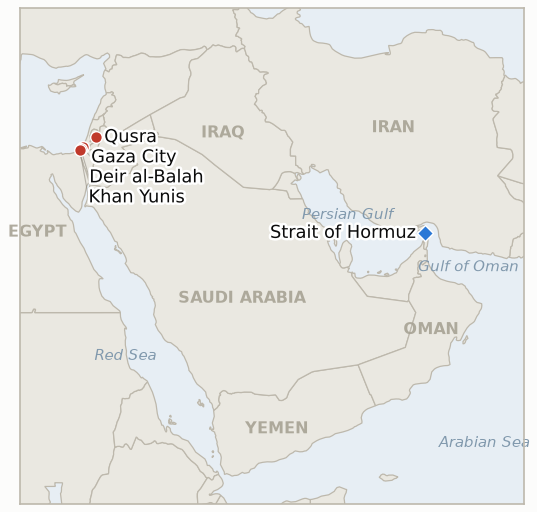

# Middle East Daily Briefing

**August 30, 2026**

- **Reporting window:** ~24 hours, August 29, 09:00 to August 30, 09:00 KST
- **Overall assessment:** Two of this ledger's longest-standing Gaza indicators hit their own August 30 deadline together and resolved in opposite directions, a genuine split rather than a pattern. Israel's kite-launch ultimatum converted into real, documented enforcement, evidence surfaced this run shows Defense Minister Katz formally ended the three-day deadline on August 27 with explicit forward-looking instructions, paired with an evacuation-warned strike and a quiet lowering of the Gaza strike-approval threshold, confirming that particular threat was not rhetorical. The Yellow Line indicator resolved the opposite way: a further explosive-device incident on Saturday drew the same routine, localized response every prior incident since August 15 has drawn, never crystallizing into the formal operational response the indicator was built to detect. Away from Gaza, Iran's IRGC Navy and US CENTOM offered flatly irreconcilable accounts of who controls the Strait of Hormuz, and a recurring Qusra settler attack drew Prime Minister Netanyahu's first personal condemnation of West Bank violence this ledger has tracked, though a reported mismatch between the vehicles seized and the vehicles used in the attack leaves real follow-through an open question. In Beirut, Hezbollah's Naim Qassem hardened rather than softened his rejection of the disarmament framework, narrowing the space the Amman-mediated Syria talks are trying to work within.

---

## 1. What Happened

<figure style="float:right; width:46%; margin:2pt 0 8pt 14pt;">

<figcaption style="font-size:8pt; color:#666; text-align:center; margin-top:3pt; font-style:italic;">Major places of discussion</figcaption>
</figure>

### 1.1 Gaza Kite Launch Threat Converts Into Documented Policy, Resolving a Six Day Old Indicator Confirmed

Israel's August 23 ultimatum that it would "intensify strikes" over kites launched from Gaza toward Israeli communities has converted into real enforcement rather than remaining rhetorical, evidence surfaced in this run shows. Defense Minister Israel Katz officially announced the end of the three-day deadline on August 27, stating the military establishment had received "clear instructions to respond forcefully and decisively to any new launch attempts" and that "silence regarding this phenomenon has ended" ([Al-Quds](https://www.alquds.com/en/posts/255693-katz-announces-end-of-three-day-deadline-threatens-gaza-with-displacement-and)). In the hours around the deadline's expiration, the IDF struck a building in the Bureij refugee camp following an evacuation warning; one family could not evacuate in time and a four-year-old child was killed ([Al Jazeera](https://www.aljazeera.com/news/2026/8/27/three-killed-in-strikes-on-gaza-as-israel-renews-threats-over-kite-flying)). Separately, following the failure of Jared Kushner's diplomatic visit to produce a breakthrough, the IDF reinstated a lower Gaza strike-approval threshold under which the head of IDF Southern Command, not only the Chief of Staff, may authorize strikes, with officials specifically tasked to "identify and target those launching the kites" ([Israel Hayom](https://www.israelhayom.com/2026/08/27/israel-changes-targeted-killing-policy-against-hamas-in-gaza/)). Together, the evacuation-warned strike and the explicit forward-looking enforcement policy meet IND-20260824-2's confirmation bar: a documented strike or expanded target set explicitly tied to kite launches, rather than the ambiguous, hard-to-distinguish-from-routine pattern this ledger tracked through most of the preceding week. **Confidence: High** on Katz's statement and the policy change (Tier 2, Al-Quds, Israel Hayom, on-record ministerial quotes); Medium on the Bureij strike's precise kite linkage, since the evacuation warning's stated target was not independently confirmed as kite-related by a third source.

### 1.2 Iran's IRGC Declares "Complete Control" of Hormuz as CENTCOM Touts Its Own Blockade Record

Iran's Islamic Revolutionary Guard Corps Navy declared Saturday it retains "complete control" over the Strait of Hormuz, stating the waterway will stay closed to vessels that do not coordinate with Tehran "until the end of the US military's hostile actions against Iran and the implementation of the agreed commitments," and dismissing US assertions that the strait remains open as "a clear lie" ([Haaretz](https://www.haaretz.com/israel-news/israel-security/2026-08-29/ty-article-live/irgc-navy-says-it-has-full-control-over-strait-of-hormuz/000001a0-4b37-d6be-afb5-5bb7b3520000)). US Central Command countered with its own tally of the naval blockade's enforcement record: 82 commercial vessels redirected, three disabled and two boarded since the blockade began, sharing imagery of personnel aboard the USS John Paul Jones monitoring the strait ([Daily News Egypt](https://www.dailynewsegypt.com/2026/08/29/irans-irgc-claims-complete-control-of-hormuz-as-us-forces-redirect-82-ships-under-blockade/)). President Pezeshkian separately said Iran had "established" a crossing route via Oman under the framework of the collapsed Islamabad memorandum of understanding, but conditioned it on four demands: lifting the naval blockade, removing fuel and petrochemical sanctions, releasing frozen Iranian assets, and halting Israeli attacks on Lebanon, a maximalist restatement rather than a narrowing of Iran's negotiating position. The two accounts of who controls the strait are directly irreconcilable and neither is independently verified against this ledger's own transit-count tracking. **Confidence: High** on the IRGC and CENTCOM statements themselves (Tier 1-2, on-record military statements, Treasury-adjacent CENTCOM imagery); Low on which account better describes the strait's actual operational status, since neither a fresh transit count nor an independently documented interdiction arrived in the window to adjudicate between them.

### 1.3 Settlers Storm Qusra Again as Netanyahu Breaks Silence to Call the Violence "Criminal"

Dozens of Israeli settlers stormed the West Bank village of Qusra again Saturday, taking over a Palestinian home with the family still inside; the IDF and Border Police were dispatched, but witnesses said troops fired tear gas at the residents and detained them while the settlers dispersed without an on-scene arrest ([The Times of Israel](https://www.timesofisrael.com/settlers-attack-west-banks-qusra-take-over-home-with-palestinian-family-inside/)). At least one Palestinian woman was injured, one of at least five Palestinians hurt in settler attacks across the West Bank Saturday, part of a pattern the UN says has hit an "all-time high" this year, averaging 6.6 incidents a day. Prime Minister Netanyahu broke weeks of public silence to personally condemn the violence as "criminal," his first direct comment on the recurring West Bank settler-violence pattern this ledger has tracked since mid-August; Haaretz reported, however, that the vehicles confiscated in the response were not those used in the actual attack, a detail that itself raises doubt about the condemnation's substance. Separately in Jalud, masked settlers attacked a Palestinian woman and NBC News journalists documenting her eviction, striking them with sticks and rocks; no arrests were made. **Confidence: High** on the Qusra attack, the IDF's on-scene conduct and Netanyahu's quote (Tier 2, Times of Israel liveblog, Haaretz); Medium on whether Netanyahu's condemnation reflects a genuine policy shift rather than a rhetorical response to mounting international criticism, given the vehicle-mismatch detail.

### 1.4 Yellow Line Indicator Resolves Falsified as a Further Incident Draws Only the Routine Response

The IDF said Saturday it killed two Palestinians who crossed Gaza's Yellow Line in the north and planted an explosive device, describing them as an "immediate threat," the latest in a string of similar incidents (a pipe-theft probe, a tank hit by a Hamas-planted charge, prior sabotage-linked killings) since the original August 15 episode that opened IND-20260816-2. Through today's own deadline, no Israeli statement has ever explicitly tied a formal operational response, an expanded enforcement zone, a named retaliatory strike, or a stated policy change, to the August 15 incidents specifically; each subsequent incident, including Saturday's, has instead drawn the same localized, in-the-moment engagement. The indicator resolves **falsified**: the string of incidents has been absorbed into routine ceasefire-line enforcement rather than producing the distinct operational response the indicator was built to detect, a different outcome from Section 1.1's kite-launch indicator resolving in the opposite direction at the very same deadline. **Confidence: High** on Saturday's incident and the absence of any explicitly tied response across the full two-week record (Tier 2, IDF statements, multi-outlet reporting spanning the indicator's life).

### 1.5 Gaza Toll Passes 1,313 as Hezbollah's Qassem Hardens Rejection of the Disarmament Framework

Israeli strikes killed three more Palestinians in Gaza Saturday, two on a motorbike in Gaza City and a farmer to tank fire in Deir al-Balah, with seven more wounded including in a strike on the Al-Aqsa Martyrs Hospital compound that the IDF said targeted a Hamas commander; Gaza's health ministry said the post-ceasefire toll now stands at 1,313 killed ([Middle East Monitor](https://www.middleeastmonitor.com/20260829-3-palestinians-killed-7-injured-in-israeli-attacks-across-gaza-despite-ceasefire/)). In Beirut, Hezbollah Secretary-General Naim Qassem used a Mawlid speech to declare that "Iran and resistance forces across the region" had defeated Washington's "Greater Israel" plot and to reject the Board of Peace framework agreement outright, saying Hezbollah's own acceptance is limited to implementing the November 27, 2024 ceasefire "under the framework of" UN Security Council Resolution 1701 ([Press TV](https://www.presstv.co.uk/Detail/2026/08/29/775259/Sheikh-Qassem--Hezbollah-foiled-)). The restated red line is harder than his prior remarks and further narrows the room the Amman-mediated 1974-armistice-line talks IND-20260828-1 is tracking are trying to work within, even though the two tracks (Lebanon disarmament and the Syria border talks) remain formally distinct. **Confidence: High** on the Gaza strikes and toll (Tier 2, Middle East Monitor, Gaza health ministry); High on Qassem's quotes (Tier 2, Press TV, multi-outlet Arabic-language coverage); Medium on the practical spillover into the Amman track, since Qassem's remarks address Lebanon's own framework rather than the Syria-specific talks directly.

---

## 2. Deep Dive: Incentives and Motives

### 2.1 Why would Israel formalize a kite-specific enforcement policy now rather than let the threat lapse as rhetorical, as similar warnings have before?

Because letting a second consecutive deadline pass with no visible consequence, after the August 23 ultimatum already drew UN criticism as "outrageous" and Hamas dismissed it as built on "fabricated pretexts," would have cost Israel credibility on its stated red lines at exactly the moment its own disarmament-framework rejection is already straining relations with the Board of Peace; converting the threat into a quiet approval-authority change, rather than a loudly announced new campaign, lets the IDF demonstrate follow-through to a domestic audience without formally reopening the ceasefire's broader political architecture.

### 2.2 Why would Iran's IRGC escalate its rhetorical claim to "complete control" of Hormuz just as President Pezeshkian is separately floating a conditional Oman crossing route?

Because the two statements serve different audiences and do not need to be reconciled: the IRGC's "complete control" claim is aimed at rebutting Trump's repeated "open and operating" framing and projecting resolve domestically and to the region, while Pezeshkian's conditional Oman-route offer keeps a diplomatic track alive that the presidency, not the IRGC, controls; the contradiction lets Tehran hedge between hardline and negotiating postures without either faction committing the state to a single position CENTCOM's own blockade-enforcement data could then be used to disprove.

### 2.3 Why would Netanyahu personally condemn the Qusra attack specifically, given weeks of unprosecuted settler violence this ledger has tracked without a comparable statement?

Because the cumulative weight of international criticism, the UN's "all-time high" violence finding, a Foreign Policy investigative piece, and allied governments' condemnations, has made continued silence itself a diplomatic liability, particularly with the West Bank's stability already tied to Washington's broader ceasefire architecture; but the reported mismatch between the vehicles seized and those used in the attack suggests the response was calibrated to manage the story's optics rather than to signal a substantively different enforcement posture, consistent with this ledger's prior finding that West Bank arrests remain a rare exception (Masafer Yatta) rather than the pattern.

### 2.4 Why would the Yellow Line pattern stay unescalated through its own two-week deadline despite incidents that individually meet the ceasefire's "grave violation" threshold?

Because each incident is small in scale and easily framed as a routine, deniable security response (a device, a low casualty count, no Israeli soldiers hurt), and formally escalating into a declared operational campaign would risk reopening a second active front in Gaza at the same moment Israel is directing its escalatory energy toward the more politically resonant kite-launch axis (§1.1, §2.1); keeping the Yellow Line response local and unstated lets the IDF preserve deterrence without spending the political capital a named campaign would cost.

### 2.5 Why would Hezbollah's Qassem harden rather than soften his rejection of the disarmament framework while the Amman-mediated Syria border talks continue?

Because distancing Hezbollah's own position from a parallel Syria-Israel track it does not control, and restating Resolution 1701 as the sole legitimate reference point, pre-empts any attempt by Washington to fold Lebanon into a broader regional framework the Amman process might later be used to justify; a Mawlid religious address also gives Qassem a domestic and Iran-aligned audience to reassert the "resistance" narrative's continued relevance at a moment when the disarmament question has otherwise gone quiet in Beirut.

---

## 3. Policy Implications for South Korea

### 3.1 Exposure snapshot

| Item | Current reading | Source |
| --- | --- | --- |
| Middle East share of crude imports | 48.5% (May-July 2026), down from 69.1% a year earlier; non-Middle East share crossed 50% for the first time on record | KNOC via Asia Business Daily; `korea-exposure.md` |
| July-August crude procurement | 110%+ of prior-year volume secured (MOTIE, July 21); strategic reserve swap extended through August, ~21 million barrels swapped to date | MOTIE via Herald Business, Hankyung; `korea-exposure.md` |
| September crude procurement | 90%+ secured (MOTIE, July 21) | MOTIE via Herald Business; `korea-exposure.md` |
| Red Sea detour routing | Korean-bound crude cargoes continue via the Yanbu/Red Sea workaround; Yanbu exports to Asian buyers including Korea have surged to ~4 million bpd from under 1 million bpd a year earlier | Lloyd's List Intelligence; `korea-exposure.md` |
| Strategic reserve coverage | ~26 days of actual consumption (estimate); swap on immediate standby, untested at scale | CSIS; MOTIE July 27 |
| Refiner Saudi ownership exposure | S-Oil (Saudi Aramco majority ~63%), HD Hyundai Oilbank (Aramco ~17%) | Public filings; `korea-exposure.md` |
| BOK base rate | 3.00%, unchanged since the August 27 second consecutive hike | Korea Times |
| Brent / WTI | No Saturday settle; last verified Friday Aug 28: $88.31 / $83.40, first gain in four sessions | Trading Economics |
| KOSPI / USD-KRW | No Saturday close; last verified Friday Aug 28: KOSPI -1.79% to 6,788.88, won 1,372.5, strongest since July 2025 | Asia Business Daily; Korea JoongAng Daily |
| Hormuz transits | No fresh count in the window; last verified 8 vessels for Aug 26 (Windward); CENTCOM separately claims 82 vessels redirected under blockade enforcement since the blockade began (a cumulative figure, not a daily count) | Windward Daily Intelligence; CENTCOM via Daily News Egypt |

### 3.2 Implications by development

**The kite-launch indicator's confirmation, a real, documented Israeli enforcement policy rather than a rhetorical threat, is a data point Korean planners tracking Gaza-adjacent ceasefire durability should weigh alongside the still-open question of whether the underlying ceasefire itself holds; a lowered strike-approval threshold that outlasts the kite issue specifically would be the more consequential structural change to watch.** No new indicator opens on this resolution; the underlying ceasefire-durability tracking continues via the standing indicators already open.

**The IRGC's "complete control" claim, directly contradicted by CENTCOM's own blockade-enforcement figures, reinforces that Korean crude planners should continue treating any single side's characterization of Hormuz's operational status as unverified until reflected in independent transit data, consistent with this ledger's standing practice of relying on Kpler/Windward counts rather than either government's framing.** New IND-20260830-2 tests whether a verified Iranian interdiction or continued blockade-era transit levels resolve the contradiction over the next ten days.

**Netanyahu's rare personal condemnation of the Qusra attack, if it produces genuine follow-through rather than repeating this ledger's established rhetorical-only pattern, would be a modest data point for Korean policymakers tracking the broader West Bank stability picture that sits adjacent to, though distinct from, the Gulf shipping and energy risk this ledger's core indicators track.** New IND-20260830-1 tests whether an arrest or lasting exclusion order follows within ten days.

**The Yellow Line indicator's falsification and the kite-launch indicator's confirmation resolving in opposite directions at the same deadline is itself informative: Israel's enforcement posture in Gaza is calibrated selectively by issue rather than uniformly escalatory, a distinction Korean planners should carry into any assessment of ceasefire-collapse risk rather than treating every Gaza friction point as equally likely to escalate.** No new indicator opens on the Yellow Line resolution.

**Testable indicators:**

- **IND-20260830-1** — Netanyahu's "criminal violence" condemnation of the August 29 Qusra attack either produces a verified arrest, charge, or lasting exclusion order tied to the specific incident by ~2026-09-09, confirming genuine enforcement follow-through, or no such action occurs through the same date with settlers still able to access the site, falsifying it as rhetorical-only condemnation matching this ledger's established pattern.
- **IND-20260830-2** — Iran's IRGC claim of "complete control" over the Strait of Hormuz either produces a verified Iranian interdiction (boarding, seizure, mining, forced turnback) of a vessel transiting without Tehran's coordination by ~2026-09-09, confirming the claim is operational rather than rhetorical, or continued daily transit counts at or above this week's recorded range (2 to 8 vessels) persist with no new interdiction through the same date, falsifying it.

---

## 4. Watch List

- **Whether Yemen's confirmed spread draws renewed international mediation** (IND-20260817-1, deadline August 31).
- **Whether Trump's declared intent to make Hormuz US territory produces any concrete policy step beyond repeated rhetoric** (IND-20260817-2, deadline August 31).
- **Whether Israel's prepared Ali al-Taher ridge operation actually launches, now with a confirmed renewed active-combat exchange already underway around it** (IND-20260818-2, deadline August 31).
- **Whether the Rome track's provisionally scheduled September 1 eighth round proceeds** (IND-20260807-2, deadline September 1).
- **Whether Trump's threat to bomb Oman produces any real diplomatic or military consequence** (IND-20260818-1, deadline September 1).
- **Whether the Houthis' claimed strike on Saudi naval vessels near Mocha is confirmed or draws a direct Saudi response** (IND-20260818-3, deadline September 1).
- **Whether Katz's uncoordinated West Bank police handover proceeds or is delayed or blocked** (IND-20260819-2, deadline September 1).
- **Whether the fatal Minoan Dignity attack is ever attributed or draws a military response** (IND-20260819-1, deadline September 2).
- **Whether the State Department's diplomat-return plan to Middle East embassies proceeds or stalls** (IND-20260826-1, deadline September 2).
- **Whether Netanyahu's rejection of Trump's peace plan draws a formal US response, still absent despite the Board of Peace envoy's own sharpened criticism** (IND-20260827-1, deadline September 2).
- **Whether a vessel is documented using the new Iran-Oman Hormuz corridor specifically, distinct from the modest general uptick in Hormuz traffic** (IND-20260827-2, deadline September 2).
- **Whether Israel's intensified Syria and Lebanon strikes derail the Amman-mediated 1974 line security talks, a track Hezbollah's own hardened rejection now further complicates** (IND-20260828-1, deadline September 3).
- **Whether the confirmed renewed Hezbollah-Israel exchange becomes a self-sustaining escalatory cycle** (IND-20260829-1, deadline September 8).
- **Whether Netanyahu's Qusra condemnation produces genuine enforcement or stays rhetorical** (IND-20260830-1, deadline September 9).
- **Whether Iran's "complete control" claim over Hormuz is validated by a verified interdiction or falsified by continued blockade-era transit levels** (IND-20260830-2, deadline September 9).
- **Whether a signed Iran-Oman Hormuz joint statement with an operating date is reached, now further complicated by Trump's abandonment of the June MOU** (IND-20260816-3, deadline September 5).
- **Whether the Turkey-Israel friction over the Abu al-Duhur strike escalates or is absorbed** (IND-20260823-1, deadline September 6).
- **Whether the IDF's West Bank "brink of escalation" warning is followed by an actual step change in the violence pattern** (IND-20260823-2, deadline September 6).
- **Whether Barrack's back-to-back controversies produce any actual US policy or personnel consequence** (IND-20260824-1, deadline September 6).
- **Whether the Van Hollen-led privileged resolution on West Bank American deaths forces committee action or a State Department response** (IND-20260828-2, deadline September 6).
- **Whether the Jannatah attack on Israeli activists and an AFP journalist draws any arrest** (IND-20260826-2, deadline September 8).
- **Whether the Masafer Yatta arrests mark a durable settler-enforcement shift or stay an isolated case** (IND-20260825-2, deadline September 8).
- **Whether the Syria nuclear material find converts into a concluded agreement and verified removal** (IND-20260812-2, deadline September 11).
- **Whether the West Bank IDF-to-police enforcement transfer reduces settler violence, or leaves it unchanged** (IND-20260815-2, deadline September 12).
- **Whether Syria moves against Hezbollah in Lebanon despite Iran's warning, or the confrontation stays rhetorical** (IND-20260815-3, deadline September 15).
- **Whether Kaine's privileged war powers resolution on Oman passes, fails, or never reaches a floor vote when the Senate returns in September** (IND-20260819-3, deadline September 25).
- **Whether Yemen's fighting produces a further dramatic escalation or settles into an attritional pattern.**
- **Whether Iran's blocked IAEA access to strike-damaged nuclear sites is resolved by a new inspection protocol or hardens into a durable standoff.**
- **Whether the Caroline Bezengi oil spill is contained now that salvage work has begun.**
- **Whether the Qeshm Island explosions are ever confirmed as a real strike or resolved as a false alarm.**

---

## 5. Source Quality Summary

| Claim | Sources | Confidence |
| --- | --- | --- |
| Katz's official end of the kite-launch deadline and enforcement instructions | Al-Quds (Tier 2-3, on-record ministerial statement) | High |
| Bureij evacuation-warned strike killing a four-year-old around the deadline's expiration | Al Jazeera (Tier 1-2, on-scene reporting) | High |
| IDF Southern Command lower strike-approval threshold reinstatement | Israel Hayom (Tier 2, sourced Israeli defense reporting) | High on the policy change; Medium on its explicit kite-launch attribution |
| IRGC Navy "complete control" of Hormuz statement | Haaretz liveblog (Tier 2, on-record IRGC Navy statement) | High |
| CENTCOM blockade-enforcement tally (82 redirected, 3 disabled, 2 boarded) | Daily News Egypt (Tier 2-3, CENTCOM-sourced) | High on the figures; Medium on independent verification |
| Pezeshkian's conditional Oman crossing-route claim | Daily News Egypt (Tier 2-3, Iranian presidential statement) | Medium, single-sourced |
| Qusra settler attack and IDF conduct on scene | The Times of Israel liveblog (Tier 2, on-scene witness accounts, IDF statement) | High |
| Netanyahu's "criminal violence" condemnation and the vehicle-mismatch detail | Haaretz (Tier 2, on-record PM statement, investigative detail) | High |
| Yellow Line Saturday incident and the absence of a formal tied response | IDF statement via multi-outlet reporting spanning the indicator's two-week life (Tier 2) | High |
| Gaza strikes, casualties and the 1,313 post-ceasefire toll | Middle East Monitor, Gaza health ministry (Tier 2-3) | High |
| Naim Qassem's Mawlid speech and disarmament-framework rejection | Press TV (Tier 3, Iran-aligned outlet; corroborated by multiple Arabic-language outlets) | High on the quotes; Medium on framing, given the source's own alignment |
