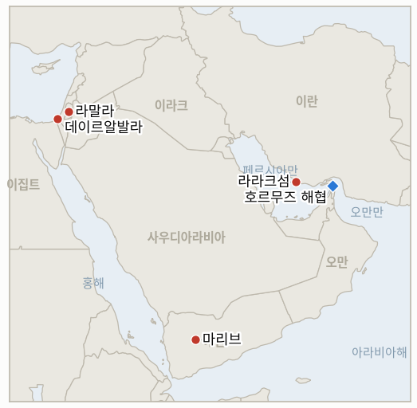

# 중동 일일 브리핑

**2026년 8월 31일**

- **보고 기간:** 약 24시간, 8월 30일 09:00 ~ 8월 31일 09:00 (한국시간)
- **종합 평가:** 이 브리핑이 가장 오래 추적해 온 지표 5건이 같은 8월 31일 시한을 맞은 바로 그 창에 실제 확전이 벌어졌고, 두 흐름은 서로 연결돼 있다. 미군은 미 중부사령부가 호르무즈 해협의 기뢰 제거를 선언한 지 불과 이틀 만에 라라크섬의 이란 로켓 발사대 2기를 타격했다. 혁명수비대가 새로운 기뢰 부설을 준비하던 현장을 포착한 것으로, 이는 "주요 이정표"라던 그 선언을 정면으로 무색하게 만들었다. 혁명수비대는 구체적 방식을 밝히지 않은 채 보복을 예고했다. 별도로 워싱턴포스트는 미군 자체 참모총장들과 지역 전투사령관들이 헤그세스 국방장관에게 6개월간 이어진 대규모 대이란 작전이 "너무 오래 과도하게" 지속되고 있다고 공식 경고했으며, 이례적으로 공식 기록에 반대 의견을 남기면서도 명령은 그대로 이행했다고 밝혔다. 이는 앞으로 일요일 타격과 같은 사건이 얼마나 더 지속될 수 있는지에 대한 지속가능성 질문을 새롭게 제기한다. 전쟁의 군사적 축에서 벗어난 곳에서는 오래 추적해 온 지표 4건이 나란히 반증으로 종결됐다. 예멘의 확전은 매칭되는 중재 대응을 이끌어내지 못했고, 트럼프의 반복된 호르무즈 미국 영토화 선언은 끝내 공식 정책 조치로 이어지지 않았으며, 이스라엘의 알리 알타헤르 능선 장악 작전은 승인 대기 상태로 정체됐고, 한국은행의 8월 27일 금리 인상은 이 지표가 포착하려 했던 수입 에너지 비용이 아니라 국내 요인을 근거로 제시했다. 서안지구에서는 정착민과 군인의 합동 습격으로 알무가이르에서 팔레스타인인 4명이 부상했는데, 이는 병력이 단순히 방관하는 대신 직접 가담했다는 점에서 기존 정착민 폭력 패턴의 변형이다.

---

## 1. 무슨 일이 있었나

<figure style="float:right; width:46%; margin:2pt 0 8pt 14pt;">

<figcaption style="font-size:8pt; color:#666; text-align:center; margin-top:3pt; font-style:italic;">주요 논의 지점</figcaption>
</figure>

### 1.1 미군, 라라크섬의 이란 로켓 발사대 타격... 혁명수비대는 보복 예고

미군은 일요일 밤 라라크섬의 이란 로켓 발사대 2기를 타격했다. 미 당국자에 따르면 혁명수비대 요원들이 해상 기뢰를 실은 로켓을 호르무즈 해협으로 발사하려는 정황이 포착된 데 따른 것으로, 한 달여 만의 첫 대이란 군사 타격이다([CNN](https://us.cnn.com/2026/08/30/politics/us-iran-strikes-larak-island); [ABC 뉴스 오스트레일리아](https://www.abc.net.au/news/2026-08-31/middle-east-war-us-strikes-launched-iran-larak-island/107096404)). 미군 대변인은 역내 병력이 해협의 항행 자유를 지키기 위해 "고도의 경계 태세를 유지하고 있다"고 밝혔으나, 타격의 정확한 결과나 발사대 파괴 여부에 대해서는 확인해주지 않았다([Israel Hayom](https://www.israelhayom.com/2026/08/30/us-strikes-irgc-launchers-in-iran-amid-strait-of-hormuz-threats)). 이란 혁명수비대는 국영방송 IRIB를 통해 이번 타격으로 이란 병력과 민간인 다수가 사망하거나 부상했다고 주장하며 정확한 수치는 밝히지 않은 채 보복을 예고했고, "침략자는 응징을 받을 것"이라고 밝혔다([The Jerusalem Post](https://www.jpost.com/middle-east/iran-news/article-907075)). 이번 타격은 미 중부사령관 브래드 쿠퍼 제독이 해협의 국제 항로가 이란 기뢰로부터 완전히 제거됐다며 이를 "주요 이정표"라 선언한 지 불과 이틀 만에 벌어졌다. 당시 쿠퍼 제독은 이번 기뢰 제거로 원유 약 7억 5,000만 배럴을 실은 선박 약 1,500척이 해협을 통과할 수 있게 됐다고 밝혔었다([걸프뉴스](https://gulfnews.com/world/mena/strait-of-hormuz-cleared-of-iranian-mines-centcom-chief-admiral-cooper-1.500654955)). 선언 후 48시간 만에 이란이 재부설을 시도한 정황이 포착됐다는 점은 그 선언을 직접적으로 무색하게 만들며, IND-20260830-2가 이미 추적 중인 이란과 미국 간 호르무즈 통제권 서사의 충돌을 한층 첨예하게 만든다. 신설된 IND-20260831-1은 혁명수비대의 보복 예고가 실제 공격으로 이어질지를 시험하며, 이는 이 브리핑이 확인해 온 이란의 미공표 보복 패턴, 즉 미 봉쇄 집행에 대한 보복을 예고했으나 실현되지 않았던 IND-20260812-1(반증)과는 구분된다. **신뢰도: 높음** (타격 자체와 미국·혁명수비대 측 발표, 1~2등급, CNN, ABC 뉴스, 알아라비야, 이스라엘 하욤, 예루살렘 포스트 등 다수 매체 교차 확인); 해상 기뢰 의도의 구체적 정황에 대해서는 **신뢰도: 중간** (익명의 미 당국자 단일 출처), 혁명수비대의 피해 주장에 대해서도 **신뢰도: 중간** (독립적으로 확인된 수치 없음).

### 1.2 미군 지휘부, 헤그세스에 "대이란 작전 장기화는 지속 불가능" 경고

워싱턴포스트는 미 육해공군 참모총장과 유럽·태평양·중남미를 관할하는 4성 사령관들이 8월 14일 기밀 국방장관 명령서를 통해 헤그세스 국방장관에게 대규모 대이란 작전의 지속이 "너무 오래 과도하다"며 미국 본토를 포함한 다른 지역의 위협 대응력을 약화시킬 위험이 있다고 경고했다고 보도했다([워싱턴포스트](https://www.washingtonpost.com/national-security/2026/08/30/military-leaders-warn-hegseth-against-extending-iran-war-operations/); [예루살렘 포스트](http://www.jpost.com/middle-east/iran-news/article-907059)). 해군참모총장 대릴 코들 제독은 해군이 현재의 작전 속도를 무기한 유지할 수 없다며, 현재 배치 가능한 구축함은 전체의 약 4분의 1에 불과하다고 밝힌 것으로 알려졌고, 태평양 동맹국들은 미사일·방공 자산이 걸프 지역으로 전용되면서 역내가 중국에 더 취약해졌다는 우려를 별도로 제기했다. 해군참모총장과 유럽·태평양·중남미 사령부 지휘관들은 명령에는 반대하되 이행은 그대로 진행하는 "반대 의견"을 공식적으로 표명했다. 명령서에는 일부 병력의 배치가 9월까지, 다른 일부는 2027년까지 이어진다는 내용도 담겼으며, 션 파넬 국방부 대변인은 "내부 운영 절차"나 구체적인 찬반 의견에 대해서는 언급하지 않겠다고 밝혔다. 신설된 IND-20260831-2는 이번에 드러난 내부 경고가 실제 가시적 전력 태세 변화로 이어질지를 시험한다. **신뢰도: 높음** (경고의 존재와 인용문, 1등급, 워싱턴포스트 단독 보도, 다수 매체 교차 확인); 구체적인 구축함 배치 가능 비율에 대해서는 **신뢰도: 중간** (출처는 명확하나 이번 보고 기간 내 독립 검증은 이뤄지지 않음).

### 1.3 정착민 군인 합동 습격으로 알무가이르에서 팔레스타인인 4명 부상

일요일 이스라엘 군인과 정착민이 라말라 인근 서안지구 중부 마을 알무가이르에서 합동 습격을 벌였다. 정착민들이 마을에 진입해 주민 차량을 공격했고, 이에 동행한 군인들은 이 공격에 맞선 팔레스타인인들을 향해 실탄과 최루탄을 발사해 4명이 부상했다. 이 중 2명은 허벅지에, 1명은 가슴에, 1명은 복부에 총상을 입었으며, 팔레스타인적신월사 응급대가 이들을 병원으로 이송했다([아랍뉴스](https://www.arabnews.com/node/2656361/middle-east)). 현장 영상에는 습격 도중 정착민들이 표적이 된 가옥에서 물건을 약탈하는 모습이 담겼으며, 이스라엘군은 즉각적인 논평을 내놓지 않았다. 정착민이 행동할 때 병력이 방관하는 기존의 익숙한 패턴과 달리 이번에는 군인이 직접 습격에 가담했다는 점은, 서안지구의 문서화된 "확전 임계점" 경고가 실제 폭력 양상의 단계적 변화로 이어지는지를 추적하는 상시 지표 IND-20260823-2에 주목할 만한 새 변수다. 아직 독립적으로 확인되지 않은 팔레스타인 자치정부 측 영상에 근거한 별도 주장으로는, 같은 날 이스라엘 군인이 요르단강 계곡 북부의 베두인 농경 공동체에 물을 공급하는 수도관을 고의로 파괴했다는 내용도 있으며, 헤브론 구시가지에서는 이스라엘군이 정착민들의 주간 행진을 확보하기 위해 팔레스타인 상점 주인들에게 폐점을 지시하는 모습이 촬영됐다([타임스오브이스라엘 라이브블로그](https://www.timesofisrael.com/liveblog-august-30-2026/)). **신뢰도: 높음** (알무가이르 총격과 부상, 2~3등급, 아랍뉴스, 팔레스타인 통신사 보도와 교차 확인); 수도관 파괴 주장에 대해서는 **신뢰도: 중간** (팔레스타인 자치정부 측 영상에 근거, 이스라엘군이나 독립 출처의 확인 없음).

### 1.4 예멘 확전, 매칭되는 중재 없이 자체 시한 통과

지난 8월 17일 정부군이 5개 주에서 후티 진지를 겨냥해 180건 이상의 작전을 수행했다는 발표를 근거로 개설된, 원래의 세 전선을 넘어선 예멘 확전 확증 지표는 8월 31일 자체 시한을 맞았으나, 전투는 여전히 마리브와 타이즈 전선에 집중돼 있고 이 확전에 특정적으로 대응하는 유엔 주도 또는 제3자 중재 이니셔티브는 끝내 출범하지 않았다([알자지라](https://www.aljazeera.com/news/2026/8/20/houthis-and-government-trade-attacks-as-yemen-slides-back-to-full-scale-war)). 유엔 예멘 특사 한스 그룬드베르그가 8월 중순 안전보장이사회 브리핑에서 밝힌, 예멘이 2022년 휴전 이후 대규모 분쟁 재발 위험이 가장 높은 상태라는 상시 경고는 여전히 공식 기록에 남아 있지만, 이는 경고일 뿐 중재 이니셔티브가 아니며, 확전을 뒤따르는 새로운 외교 트랙은 열리지 않았다([유엔 예멘특사사무소](https://osesgy.unmissions.org/en/news/briefing-by-the-un-special-envoy-for-yemen-hans-grundberg-to-the-security-council-1)). 이 지표는 **반증**으로 종결된다. 확전이 이 지표가 포착하려 했던 매칭 외교 대응 없이 진행됐기 때문이다. **신뢰도: 높음** (새로운 중재 이니셔티브의 부재와 마리브·타이즈 전선의 지속적 전투 패턴, 2등급, 알자지라, 유엔 예멘특사사무소, 8월 17일 이후 이 브리핑의 여러 주에 걸친 추적 기록과 교차 확인).

### 1.5 8월 31일 시한 지표 4건 반증 종결, 가자 사망자 수는 계속 증가

IND-20260817-1과 나란히, 이 브리핑이 가장 오래 추적해 온 지표 3건이 같은 8월 31일 시한을 맞아 같은 방향으로 종결됐다. 트럼프 대통령의 반복된 호르무즈 미국 영토화 선언은 끝내 공식 포고, 의회 통보, 또는 공개된 전력 태세 변화로 이어지지 않아 IND-20260817-2가 반증으로 종결됐다. 특히 이번 보고 기간 내 유일한 실제 제도적 대이란 조치였던 라라크섬 타격(§1.1)은 새로운 영토 주장이 아니라 기존의 봉쇄 권한에 근거한 것이었다는 점이 주목된다. 이스라엘의 남부 레바논 알리 알타헤르 능선 장악 준비 작전은 미국의 승인을 기다리며 계속 정체됐고, 헤즈볼라는 레바논 정부의 자발적 철수 요구를 계속 거부했으며 능선으로의 이스라엘군 지상 이동은 확인되지 않아 IND-20260818-2가 반증으로 종결됐다. 그리고 두 번째 연속 인상으로 기준금리를 3.00%로 올린 한국은행의 8월 27일 금리 결정은 근원 서비스·내구재 물가, 반도체 주도 성장, 수도권 주택담보대출 등을 인상 근거로 제시했을 뿐, "국제 유가와 원화 환율"은 인상 사유가 아니라 지켜봐야 할 위험 변수로만 언급해 IND-20260717-3의 확증 기준에 미치지 못했다([서울경제](https://en.sedaily.com/finance/2026/08/27/bok-signals-more-rate-hikes-citing-inflation-and-growth)). 같은 금요일 브렌트유 종가 88.31달러가 이 지표의 90달러 기준선을 밑돌면서 병행 지표 IND-20260723-3의 조건도 충족되지 않아 두 지표 모두 반증으로 종결됐다. 가자에서는 일요일 데이르알발라에서 이스라엘군 공습으로 수배 중이던 하마스 조직원 하삼 오사마 후세인 나시르와 3세 남아 타예 함단이 함께 사망했고 여러 명이 다쳤으며, 휴전 이후 사망자 수는 토요일 마지막 확인된 1,313명을 넘어 계속 증가하고 있다([타임스오브이스라엘](https://www.timesofisrael.com/weekend-strikes-kill-several-hamas-operatives-including-oct-7-invaders-idf-says/)). **신뢰도: 높음** (지표 4건 종결 모두, 각각 이 브리핑의 수 주에 걸친 자체 추적 기록에 근거, 전반적으로 1~2등급 출처); 데이르알발라 공습과 계속되는 사망자 수 증가에 대해서도 **신뢰도: 높음** (2~3등급, 타임스오브이스라엘, 가자 보건당국).

---

## 2. 심층 분석: 유인과 동기

### 2.1 미군은 왜 중부사령부의 기뢰 제거 선언 불과 이틀 만에 이란 발사대를 타격했나?

이란의 재부설 시도를 그대로 두면 쿠퍼 제독의 "주요 이정표" 선언이 발표 48시간 만에 무색해질 수밖에 없었고, 이는 선박 82척 우회라는 자체 봉쇄 집행 실적을 내세우며 혁명수비대의 "완전한 통제" 주장을 반박하는 동시에 워싱턴이 감당할 수 없는 신뢰도 손실이었기 때문이다(8월 30일자 브리핑, §1.2). 실제로 기뢰가 부설되기 전에 선제적으로 타격함으로써 중부사령부는 승리를 선언한 지 얼마 되지도 않아 재폐쇄를 인정하는 대신 "재개방" 서사를 작전적으로 방어할 수 있게 됐다.

### 2.2 참모총장들은 왜 헤그세스의 명령을 그대로 이행하면서도 공식적으로 반대 의견을 표명했나?

"반대 의견" 표명은 그 자체로 제도적 안전판 역할을 하기 때문이다. 이는 군 지휘부가 향후 자신들의 책임 소재와, 의회 및 후임 행정부가 이번 작전의 비용을 어떻게 평가할지에 대비해 작전상 위험을 공식 기록에 남기는 방식이며, 실제 전쟁이 진행 중인 상황에서 항명 사태를 촉발하지 않으면서도 이를 가능하게 한다. 명령을 계속 이행함으로써 지휘 계통은 유지되고, 동시에 문서화된 반대 의견은 작전 비용이 성과를 넘어서는 순간 곧바로 정치적 근거로 활용될 수 있다.

### 2.3 이스라엘 군인들은 왜 방관 대신 알무가이르 습격에 직접 가담했나?

규모가 작고 분산된 서안지구 중부의 한 마을은 대규모 인명 피해 사건이나 고위 상징성을 지닌 장소보다 국제적 주목을 훨씬 덜 받으며, 정착민의 접근을 "확보"하는 임무를 맡은 이스라엘군 부대들은 민간 치안 권한이 경찰로 이양되기 시작한 이후(IND-20260815-2) 호위와 직접 집행 사이의 경계가 갈수록 흐려지고 있기 때문이다. 합동 행동은 또한 책임 소재를 분산시켜, 군과 정착민 운동 어느 쪽도 결과에 대한 단독 책임을 지기 어렵게 만든다.

### 2.4 예멘 정부는 왜 중재를 기다리는 대신 확전을 이어가나?

정부군은 현재 상황을 8월 초의 값비쌌던 국경 간 공격 이후 후티 측이 무리하게 전력을 확장한 드문 기회로 보고 있으며, 어느 쪽도 실제로 요청하지 않은 중재 트랙에 맞춰 진격을 멈추는 것은 후티 측의 상응하는 자제 보장 없이 전술적 주도권만 내주는 결과가 되기 때문이다. 그룬드베르그의 반복된 안전보장이사회 경고는 국제사회의 우려를 기록으로 남기는 역할을 할 뿐, 어느 쪽도 반드시 받아들여야 할 중재 제안이 아니며, 바로 이 때문에 확전이 이 지표가 시험한 매칭 이니셔티브를 끝내 끌어내지 못한 것이다.

### 2.5 한국은행은 왜 유가를 인상 근거가 아니라 감시 위험으로만 표현했나?

수입 에너지 비용을 인상 사유로 명시적으로 밝히는 것은 한국의 통화정책이 서울이 통제할 수 없는 전쟁에 좌우된다는 사실을 인정하는 셈이 되어, 중앙은행의 독립성과 예측 신뢰도에 대한 정치적 비판을 자초하기 때문이다. 근원 서비스 물가, 반도체 주도 성장, 수도권 가계부채 등 국내 요인에 인상 근거를 두면 한국은행은 스스로의 긴축 사이클에 대한 주도권을 주장할 수 있으며, 동시에 유가와 원화는 한국은행 스스로의 언급대로 이 사이클을 벗어나게 만들 가능성이 가장 큰 두 변수로 남는다.

---

## 3. 한국에 대한 정책적 함의

### 3.1 익스포저 현황

| 항목 | 현재 수치 | 출처 |
| --- | --- | --- |
| 원유 수입 중 중동 비중 | 48.5% (2026년 5~7월), 1년 전 69.1%에서 하락; 비중동 비중이 사상 처음으로 50% 상회 | KNOC, 아시아경제 경유; `korea-exposure.md` |
| 7~8월 원유 조달 | 전년 동기 대비 110% 이상 확보 (산업통상자원부, 7월 21일); 비축유 스와프 8월까지 연장, 현재까지 약 2,100만 배럴 스와프 | 산업통상자원부, 헤럴드경제·한경 경유; `korea-exposure.md` |
| 9월 원유 조달 | 90% 이상 확보 (산업통상자원부, 7월 21일) | 산업통상자원부, 헤럴드경제 경유; `korea-exposure.md` |
| 홍해 우회 항로 | 한국행 원유 화물은 얀부/홍해 우회 항로를 계속 이용; 얀부의 아시아행(한국 포함) 수출은 1년 전 100만 b/d 미만에서 약 400만 b/d로 급증 | Lloyd's List Intelligence; `korea-exposure.md` |
| 비축유 대응력 | 실제 소비 기준 약 26일분(추정); 스와프는 즉시 가동 대기 상태이나 대규모 실증은 아직 없음 | CSIS; 산업통상자원부 7월 27일 |
| 정유사 사우디 지분 노출 | S-Oil(사우디 아람코 지분 약 63%), HD현대오일뱅크(아람코 지분 약 17%) | 공시자료; `korea-exposure.md` |
| 한국은행 기준금리 | 3.00%, 8월 27일 두 번째 연속 인상 이후 유지; IND-20260717-3은 반증 종결, 인상 근거는 수입 에너지 비용이 아닌 국내 요인 | 서울경제; 2026년 8월 31일자 브리핑 |
| 브렌트유/WTI | 보고 기간 내 종가 없음; 마지막 확인은 금요일 8월 28일, 88.31달러/83.40달러 | Trading Economics |
| 코스피/원달러 | 보고 기간 내 종가 없음; 마지막 확인은 금요일 8월 28일, 코스피 6,788.88, 원화 1,372.5원(2025년 7월 이후 최고 강세) | 아시아경제; 코리아중앙데일리 |
| 호르무즈 통항량 | 보고 기간 내 신규 일일 통계 없음; 캘리버.az 경유 Kpler 소급 자료에 따르면 목요일 8월 27일 17척, 금요일 8월 28일 7척; 미 중부사령부는 봉쇄 시작 이후 누적 82척 우회를 별도로 주장(일일 통계 아님) | 캘리버.az, Kpler 경유; 미 중부사령부, 폭스뉴스디지털 경유 |

### 3.2 사안별 함의

**미 중부사령부의 "기뢰 제거" 이정표 선언 불과 이틀 뒤 벌어진 라라크섬 타격은 한국 원유 조달 담당자들이 직접 반영해야 할 신호다. 봉쇄기 나포·재부설 위험이 작전 서사가 더 낙관적으로 바뀌는 와중에도 실제로는 줄어들지 않았음을 보여주며, 이는 한국이 계속 이용 중인 얀부·홍해 우회 항로와 직결된다.** 신설된 IND-20260831-1은 향후 열흘 내 이란의 보복 예고가 실제 공격으로 이어지는지를 추적한다.

**대이란 작전 장기화가 지속 불가능하다는 미군 내부 경고가 드러난 것은 한국 계획 담당자들에게 더 긴 시계의 신호다. 봉쇄와 해협 나포 대응 체제를 뒷받침하는 미군의 전력 태세가 현재 규모로 무기한 유지되지 않을 수 있으며, 향후 감축이 현실화된다면 한국 유조선 항로가 전제하는 안보 배경 자체가 달라질 수 있다.** 신설된 IND-20260831-2는 이번 경고가 실제 공개된 태세 변화로 이어지는지를 추적한다.

**이 브리핑이 추적하는 지표 중 한국 정책과 가장 직접적으로 연결된 한국은행의 8월 금리 결정이 유가를 인상의 근거로 제시하지 않은 채 종결됐다는 것은, 한국의 금리 경로 전망이 가정된 중동발 기계적 파급이 아니라 한국은행이 실제로 밝힌 국내 요인에 근거해 수립돼야 함을 뜻한다. 유가와 원화는 여전히 감시 대상 위험일 뿐, 아직 정책에 내재화된 가정은 아니다.** 이 종결과 관련해 새로 개설되는 지표는 없으며, 위 익스포저 현황 표에 종결 상태를 반영해 이어간다.

**예멘의 확전과 알리 알타헤르 능선의 계속된 정체는 한국의 걸프 해상 운송 익스포저에서 핵심이 아닌 인접 변수이지만, 둘 다 새로운 활성 전선으로 확대되지 않은 채 종결됐다는 점은 한국 계획 담당자들이 핵심 호르무즈 지표와 함께 참고할 만한 다소 긍정적인 신호다.** 두 종결과 관련해 새로 개설되는 지표는 없다.

**검증 가능한 지표:**

- **IND-20260831-1** — 혁명수비대의 라라크섬 타격 보복 예고가 2026년 9월 10일경까지 타격을 명시적으로 겨냥한 이란의 실제 공격으로 이어지면 실질적 후속 조치가 있었음이 확증되고, 같은 기한까지 그러한 공격이 없으면 이 브리핑이 확인해 온 이란의 미실현 보복 예고 패턴대로 수사에 그친 것으로 반증된다.
- **IND-20260831-2** — 헤그세스에 대한 미군 내부의 대이란 작전 지속 불가능 경고가 2026년 9월 14일경까지 이 우려와 명시적으로 연결된 공개된 미군 전력 태세 변화, 감축, 또는 순환배치 조정으로 이어지면 실제 운영상 결과가 있었음이 확증되고, 같은 기한까지 작전이 변함없이 지속되면 정책적 효과 없는 문서화된 이견으로 반증된다.

---

## 4. 관찰 목록

- **9월 1일로 잠정 예정된 로마 회담 8차 라운드가 예정대로 진행되는지 여부** (IND-20260807-2, 시한 9월 1일).
- **트럼프의 오만 폭격 위협이 실제 외교적 또는 군사적 결과로 이어지는지 여부** (IND-20260818-1, 시한 9월 1일).
- **모카 인근 사우디 해군 함정에 대한 후티의 공격 주장이 확인되거나 사우디의 직접 대응으로 이어지는지 여부** (IND-20260818-3, 시한 9월 1일).
- **카츠 장관의 미조율 서안지구 경찰 이양이 진행되는지, 지연되거나 무산되는지 여부** (IND-20260819-2, 시한 9월 1일).
- **치명적인 미노안 디그니티호 공격의 배후가 규명되거나 군사적 대응으로 이어지는지 여부** (IND-20260819-1, 시한 9월 2일).
- **국무부의 중동 공관 외교관 복귀 계획이 진행되는지, 무산되는지 여부** (IND-20260826-1, 시한 9월 2일).
- **네타냐후의 트럼프 평화안 거부가 미국의 공식 대응을 이끌어내는지 여부** (IND-20260827-1, 시한 9월 2일).
- **신설된 이란오만 호르무즈 경유 항로를 실제로 이용한 선박이 확인되는지 여부** (IND-20260827-2, 시한 9월 2일).
- **이스라엘의 강화된 시리아·레바논 공습이 암만 중재 1974년 정전선 안보 협상을 무산시키는지 여부** (IND-20260828-1, 시한 9월 3일).
- **가동 일자를 명시한 이란오만 호르무즈 공동성명이 체결되는지 여부** (IND-20260816-3, 시한 9월 5일).
- **아부 알두후르 공습을 둘러싼 튀르키예-이스라엘 마찰이 확대되는지, 흡수되는지 여부** (IND-20260823-1, 시한 9월 6일).
- **이스라엘군의 서안지구 "확전 임계점" 경고가 실제 폭력 양상의 단계적 변화로 이어지는지 여부, 오늘 알무가이르 습격이 새로운 근거로 추가됨** (IND-20260823-2, 시한 9월 6일).
- **바라크의 연이은 논란이 실제 미국의 정책적 또는 인사적 결과로 이어지는지 여부** (IND-20260824-1, 시한 9월 6일).
- **밴홀런 주도 서안지구 미국인 사망 관련 특권 결의안이 위원회 조치나 국무부 대응을 이끌어내는지 여부** (IND-20260828-2, 시한 9월 6일).
- **확인된 헤즈볼라-이스라엘 교전 재개가 자생적 확전 주기로 이어지는지 여부** (IND-20260829-1, 시한 9월 8일).
- **이스라엘 활동가들과 AFP 기자를 겨냥한 자나타 공격이 체포로 이어지는지 여부** (IND-20260826-2, 시한 9월 8일).
- **마사페르 야타 체포가 지속적인 정착민 단속 전환을 의미하는지, 고립된 사례로 남는지 여부** (IND-20260825-2, 시한 9월 8일).
- **쿠스라 습격에 대한 네타냐후의 규탄이 실질적 단속으로 이어지는지, 수사에 그치는지 여부** (IND-20260830-1, 시한 9월 9일).
- **호르무즈에 대한 이란의 "완전한 통제" 주장이 실제 나포로 입증되는지, 지속되는 봉쇄기 통항량으로 반증되는지 여부** (IND-20260830-2, 시한 9월 9일).
- **라라크섬 타격에 대한 혁명수비대의 보복 예고가 실제 공격으로 이어지는지, 이전의 미실현 보복 예고처럼 흐지부지되는지 여부** (IND-20260831-1, 시한 9월 10일).
- **시리아 핵물질 발견이 최종 합의와 검증된 반출로 이어지는지 여부** (IND-20260812-2, 시한 9월 11일).
- **서안지구 이스라엘군에서 경찰로의 치안 이양이 정착민 폭력을 줄이는지, 변화 없이 유지되는지 여부, 병력이 방관 대신 습격에 직접 가담한 오늘 사례가 새로운 근거로 추가됨** (IND-20260815-2, 시한 9월 12일).
- **헤그세스에 대한 미군 내부 경고가 공개된 전력 태세 변화로 이어지는지, 작전이 변함없이 지속되는지 여부** (IND-20260831-2, 시한 9월 14일).
- **시리아가 이란의 경고에도 불구하고 레바논 내 헤즈볼라에 대해 실제 군사 조치를 취하는지, 대립이 수사에 그치는지 여부** (IND-20260815-3, 시한 9월 15일).
- **케인 상원의원의 오만 관련 특권 전쟁권한 결의안이 9월 상원 복귀 시 표결에서 통과하는지, 부결되는지, 아예 상정되지 않는지 여부** (IND-20260819-3, 시한 9월 25일).
- **예멘의 전투가 극적으로 추가 확대되는지, 소모전 양상으로 정착되는지 여부.**
- **이란의 봉쇄된 IAEA 접근이 새로운 사찰 규약으로 해소되는지, 장기 교착으로 굳어지는지 여부.**
- **캐롤라인 베젠기호 기름 유출이 구조 작업 시작 이후 억제되는지 여부.**
- **케슘섬 폭발이 실제 타격으로 확인되는지, 오경보로 종결되는지 여부.**

---

## 5. 출처 신뢰도 요약

| 주장 | 출처 | 신뢰도 |
| --- | --- | --- |
| 라라크섬 이란 로켓 발사대 2기에 대한 미군 타격 | CNN, ABC 뉴스 오스트레일리아, 알아라비야, 이스라엘 하욤 (1~2등급, 다수 매체, 미 당국자 발표) | 높음 |
| 혁명수비대의 피해 주장과 보복 예고 | 예루살렘 포스트, IRIB/파르스뉴스 인용 (2~3등급, 이란 국영매체 경유) | 예고는 높음; 피해 주장은 독립 수치 부재로 중간 |
| 중부사령부의 앞선 "기뢰 제거" 이정표 선언 | 걸프뉴스, UPI (1~2등급, 중부사령관 공식 발언) | 높음 |
| 헤그세스에 대한 미군 지휘부 경고와 반대 의견 표명 | 워싱턴포스트, 예루살렘 포스트 (1등급, 워싱턴포스트 단독 보도, 다수 매체 교차 확인) | 경고와 인용문은 높음; 구축함 배치 가능 비율은 중간 |
| 알무가이르 정착민 군인 합동 습격 및 팔레스타인인 4명 부상 | 아랍뉴스 (2~3등급, 팔레스타인 통신사 보도와 교차 확인) | 높음 |
| 수도관 파괴 주장(요르단강 계곡) | 타임스오브이스라엘 라이브블로그, 팔레스타인 자치정부 측 영상 인용 (2등급, 단일 출처 미검증 주장) | 중간 |
| 예멘의 지속된 마리브·타이즈 전투와 신규 중재 부재 | 알자지라, 유엔 예멘특사사무소 (2등급, 이 브리핑의 여러 주에 걸친 추적 기록과 교차 확인) | 높음 |
| 한국은행 8월 27일 성명과 명시된 금리 인상 근거 | 서울경제, 블룸버그, 코리아중앙데일리 (1~2등급, 중앙은행 성명, 다수 매체) | 높음 |
| 데이르알발라 공습 및 가자 휴전 이후 지속되는 사망자 수 증가 | 타임스오브이스라엘, 가자 보건당국 (2~3등급) | 높음 |
