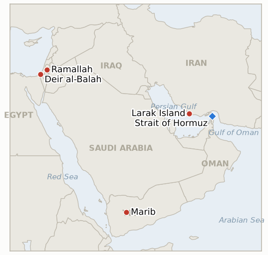

# Middle East Daily Briefing

**August 31, 2026**

- **Reporting window:** ~24 hours, August 30, 09:00 to August 31, 09:00 KST
- **Overall assessment:** Five of this ledger's oldest open indicators hit their own August 31 deadline in the same window a genuine escalation broke out, and the two threads connect. US forces struck two Iranian rocket launchers on Larak Island just two days after CENTCOM declared the Strait of Hormuz cleared of Iranian mines, catching the IRGC in the act of preparing a new mine-laying attempt and directly undercutting that "major milestone" claim; the IRGC vowed retaliation without specifying how. Separately, the Washington Post revealed that America's own service chiefs and regional combatant commanders formally warned Defense Secretary Hegseth that six months of large scale Iran operations is "too much for too long," registering rare on record non concurrence while still carrying out orders, a sustainability question that now frames how much longer episodes like Sunday's strike can keep happening. Away from the war's military axis, four long tracked indicators resolved uniformly falsified at their own deadline: Yemen's confirmed war widening drew no matching mediation response, Trump's repeated vow to declare the Strait of Hormuz US territory never became a formal policy step, Israel's prepared Ali al Taher ridge ground operation stayed stalled pending approval, and the Bank of Korea's August 27 rate hike cited domestic drivers rather than the imported energy costs the indicator was built to detect. In the West Bank, a joint settler and soldier raid on al Mughayyir wounded four Palestinians, a variant on the settler violence pattern with troops directly participating rather than merely failing to intervene.

---

## 1. What Happened

<figure style="float:right; width:46%; margin:2pt 0 8pt 14pt;">

<figcaption style="font-size:8pt; color:#666; text-align:center; margin-top:3pt; font-style:italic;">Major places of discussion</figcaption>
</figure>

### 1.1 US Strikes Iranian Rocket Launchers on Larak Island as IRGC Vows Retaliation

US forces struck two Iranian rocket launchers on Larak Island Sunday night after a US official said IRGC personnel were observed preparing to fire rockets carrying naval mines into the Strait of Hormuz, the first US military strike on Iran in over a month ([CNN](https://us.cnn.com/2026/08/30/politics/us-iran-strikes-larak-island); [ABC News Australia](https://www.abc.net.au/news/2026-08-31/middle-east-war-us-strikes-launched-iran-larak-island/107096404)). A US military spokesperson said forces in the region "remained on high alert" to defend freedom of navigation through the strait, but offered no confirmation of the strike's precise results or whether the launchers were destroyed ([Israel Hayom](https://www.israelhayom.com/2026/08/30/us-strikes-irgc-launchers-in-iran-amid-strait-of-hormuz-threats)). Iran's IRGC, via state broadcaster IRIB, said the strike killed and wounded an unspecified number of Iranian fighters and civilians and vowed retaliation, quoted saying "the aggressor will face punishment" and that Iran would "take retribution" ([The Jerusalem Post](https://www.jpost.com/middle-east/iran-news/article-907075)). The strike lands just two days after CENTCOM commander Adm. Brad Cooper declared the strait's international shipping lanes cleared of Iranian sea mines, calling it a "major milestone" that had helped roughly 1,500 ships carrying nearly 750 million barrels of crude through the waterway ([Gulf News](https://gulfnews.com/world/mena/strait-of-hormuz-cleared-of-iranian-mines-centcom-chief-admiral-cooper-1.500654955)); catching Iran attempting to re-mine the strait within 48 hours directly undercuts that claim and sharpens the contradiction IND-20260830-2 already tracks between Iranian and US narratives of who controls Hormuz. New IND-20260831-1 tests whether the IRGC's retaliation vow becomes a real attack, distinct from the ledger's established pattern (IND-20260812-1, falsified) of vowed but unrealized Iranian responses to US blockade enforcement. **Confidence: High** on the strike itself, the US and IRGC statements (Tier 1-2, CNN, ABC News, Al Arabiya, Israel Hayom, Jerusalem Post, multi-outlet corroboration); Medium on the precise sea-mine intent, since it rests on a single unnamed US official, and on the IRGC's casualty claim, which carries no independent figure or confirmation.

### 1.2 US Military Leaders Warn Hegseth a Prolonged Iran Campaign Is Unsustainable

The Washington Post reported that the heads of the US Army, Navy and Air Force, along with the four-star commanders overseeing US operations in Europe, the Pacific and Latin America, warned Defense Secretary Pete Hegseth in the classified August 14 Secretary of Defense Orders Book that continuing large scale Iran operations is "too much for too long" and risks weakening the military's ability to confront threats elsewhere, including the US homeland ([Washington Post](https://www.washingtonpost.com/national-security/2026/08/30/military-leaders-warn-hegseth-against-extending-iran-war-operations/); [The Jerusalem Post](http://www.jpost.com/middle-east/iran-news/article-907059)). Chief of Naval Operations Adm. Daryl Caudle reportedly told Hegseth the Navy cannot sustain its current pace indefinitely, with only about a quarter of the fleet's destroyers currently ready to deploy, while Pacific allies have separately raised concern that the diversion of missile and air defense systems toward the Gulf leaves the region more exposed to China; the Navy chief and the European, Pacific and Southern Command leaders formally registered "non concur," disagreeing with the order while still executing it. The orders book specifies some troop deployments extending through September and others as late as 2027; Pentagon spokesman Sean Parnell declined to discuss "internal operational processes" or any specific concurrences or non-concurrences. New IND-20260831-2 tests whether this documented internal warning ever produces a visible force posture change. **Confidence: High** on the warning's existence, the quoted language and the non-concur responses (Tier 1, Washington Post, corroborated across multiple outlets); Medium on the specific destroyer readiness figure, which is attributed but not independently verified in this window.

### 1.3 Joint Settler Soldier Raid on Al Mughayyir Wounds Four Palestinians

Israeli soldiers and settlers carried out a joint raid Sunday on the central West Bank village of al Mughayyir near Ramallah; settlers entered the village and attacked residents' vehicles, and soldiers accompanying them fired live ammunition and tear gas at Palestinians who confronted the attack, wounding four, two shot in the thigh, one in the chest and one in the abdomen, who were evacuated by the Palestine Red Crescent Emergency Service ([Arab News](https://www.arabnews.com/node/2656361/middle-east)). Footage from the scene shows settlers looting belongings from a targeted home during the raid; the IDF did not immediately comment. Troops actively participating in the raid rather than the more familiar pattern of standing by while settlers act is a notable variant for IND-20260823-2, the ledger's standing indicator on whether the West Bank's documented "brink of escalation" produces a step change in the violence pattern; a further account, drawn from Palestinian Authority footage and not yet independently verified, alleges an IDF soldier separately destroyed water pipelines serving Bedouin farming communities in the northern Jordan Valley the same day, and Israeli forces were filmed ordering Palestinian shop owners in Hebron's Old City to close their businesses to secure a weekly settler march ([Times of Israel liveblog](https://www.timesofisrael.com/liveblog-august-30-2026/)). **Confidence: High** on the al Mughayyir shooting and injuries (Tier 2-3, Arab News, corroborated by Palestinian wire reporting); Medium on the water pipeline destruction claim, sourced to PA footage without independent or IDF confirmation.

### 1.4 Yemen's War Widens Through Its Own Deadline Without a Matching Mediation Response

Yemen's confirmed spread of fighting beyond its original three fronts, opened as an indicator on August 17 after government forces logged over 180 operations against Houthi positions across five governorates, reached its own August 31 deadline with fighting still concentrated on the Marib and Taiz lines and no formal UN led or third party mediation initiative ever launched specifically in response to the confirmed spread ([Al Jazeera](https://www.aljazeera.com/news/2026/8/20/houthis-and-government-trade-attacks-as-yemen-slides-back-to-full-scale-war)). UN Special Envoy Hans Grundberg's own standing warning that Yemen faces its highest risk of returning to large scale conflict since the 2022 truce remains on record from his mid-August Security Council briefing, but it is a warning, not a mediation initiative, and no new diplomatic track opened to match the war's continued widening ([UN OSESGY](https://osesgy.unmissions.org/en/news/briefing-by-the-un-special-envoy-for-yemen-hans-grundberg-to-the-security-council-1)). The indicator resolves **falsified**: the war widened without drawing the matching diplomatic response the indicator was built to detect. **Confidence: High** on the absence of any new mediation initiative and the continued Marib and Taiz fighting pattern (Tier 2, Al Jazeera, UN OSESGY, corroborated across this ledger's multi-week tracking since August 17).

### 1.5 Four August 31 Indicators Resolve Falsified as Gaza's Toll Continues to Climb

Three more of this ledger's oldest open indicators hit their own August 31 deadline alongside IND-20260817-1 and resolved the same way. Trump's repeated vow to declare the Strait of Hormuz US territory never produced a formal proclamation, congressional notification, or disclosed force posture change, resolving IND-20260817-2 falsified; notably, the window's one real institutional US-Iran action, the Larak Island strike (§1.1), rested on existing blockade authority rather than any new territorial claim. Israel's prepared operation to seize south Lebanon's Ali al Taher ridge stayed stalled pending US approval, with Hezbollah continuing to rebuff Lebanese government overtures to withdraw voluntarily and no verified IDF ground movement onto the ridge reported, resolving IND-20260818-2 falsified. And the Bank of Korea's August 27 rate decision, which raised the base rate a second consecutive time to 3.00%, cited core services and durable goods inflation, semiconductor-led growth and Seoul area housing debt as its drivers, naming "global oil prices and the won's exchange rate" only as risk variables to keep monitoring rather than the reason for the hike, falling short of IND-20260717-3's confirming bar; the same Friday Brent settle of $88.31, below the indicator's $90 threshold, left the parallel IND-20260723-3 unmet as well, so both resolve falsified ([Seoul Economic Daily](https://en.sedaily.com/finance/2026/08/27/bok-signals-more-rate-hikes-citing-inflation-and-growth)). In Gaza, an IDF strike in Deir al-Balah Sunday killed a wanted Hamas operative, Hassam Osama Hussein Nasir, along with a three-year-old boy, Tayyem Hamdan, with several more wounded, as the post-ceasefire toll continued climbing past the 1,313 killed last verified Saturday ([Times of Israel](https://www.timesofisrael.com/weekend-strikes-kill-several-hamas-operatives-including-oct-7-invaders-idf-says/)). **Confidence: High** on all four indicator resolutions, each resting on this ledger's own multi-week tracking record (Tier 1-2 sourcing throughout); High on the Deir al-Balah strike and the continuing toll (Tier 2-3, Times of Israel, Gaza health officials).

---

## 2. Deep Dive: Incentives and Motives

### 2.1 Why would the US strike Iranian launchers now, just two days after CENTCOM declared the strait's mines cleared?

Because letting Iran re-lay sea mines unanswered would have falsified Adm. Cooper's "major milestone" claim within 48 hours of making it, a credibility cost Washington could not absorb while it is simultaneously touting an 82-vessel blockade-enforcement record and disputing the IRGC's own "complete control" claim over the strait (brief 2026-08-30, §1.2); striking preemptively, before any mine was actually laid, lets CENTCOM defend the "reopened" narrative operationally rather than conceding a second closure so soon after declaring victory over the first.

### 2.2 Why would service chiefs formally register non concur while still executing Hegseth's orders?

Because "non concur" functions as an institutional pressure valve: it lets uniformed leadership place operational risk on the record, for their own future accountability and for how Congress and later administrations judge the campaign's costs, without triggering the insubordination crisis that outright refusal would cause during an active war; continuing to execute preserves the chain of command while the documented dissent itself becomes political ammunition the moment the campaign's costs outweigh its results.

### 2.3 Why would Israeli soldiers actively join the al Mughayyir raid rather than the more familiar pattern of standing by?

Because a small, dispersed central West Bank village draws far less international scrutiny than a mass casualty event or a high-profile site, and because IDF units tasked with "securing" settler access have increasingly blurred the line between escorting and directly enforcing since the broader civilian enforcement handover to police began (IND-20260815-2); joint action also diffuses accountability, making it harder for either institution, army or settler movement, to be held solely responsible for the outcome.

### 2.4 Why would Yemen's government keep widening the war rather than pause for mediation to catch up?

Because government forces appear to read the current window as a rare moment of Houthi overextension following early August's costly cross-border strikes, and pausing to accommodate a mediation track neither side has actually requested would cede tactical momentum without any guaranteed reciprocal restraint from the Houthis; Grundberg's repeated Security Council warnings function as recorded international concern rather than a mediation offer either party is bound to accept, which is precisely why the confirmed spread never drew the matching initiative this indicator tested for.

### 2.5 Why would the Bank of Korea frame oil as a risk to monitor rather than the reason for its hike?

Because explicitly citing imported energy costs would concede that Korean monetary policy is hostage to a war Seoul cannot influence, an admission that invites political criticism of the central bank's independence and forecasting credibility; grounding the hike in domestic drivers, core services inflation, semiconductor-led growth, Seoul-area housing debt, lets the BOK claim ownership of its own tightening cycle even as oil and the won remain, by its own statement, the two variables most likely to force a decision off that cycle.

---

## 3. Policy Implications for South Korea

### 3.1 Exposure snapshot

| Item | Current reading | Source |
| --- | --- | --- |
| Middle East share of crude imports | 48.5% (May to July 2026), down from 69.1% a year earlier; non-Middle East share crossed 50% for the first time on record | KNOC via Asia Business Daily; `korea-exposure.md` |
| July to August crude procurement | 110%+ of prior-year volume secured (MOTIE, July 21); strategic reserve swap extended through August, ~21 million barrels swapped to date | MOTIE via Herald Business, Hankyung; `korea-exposure.md` |
| September crude procurement | 90%+ secured (MOTIE, July 21) | MOTIE via Herald Business; `korea-exposure.md` |
| Red Sea detour routing | Korean-bound crude cargoes continue via the Yanbu/Red Sea workaround; Yanbu exports to Asian buyers including Korea have surged to ~4 million bpd from under 1 million bpd a year earlier | Lloyd's List Intelligence; `korea-exposure.md` |
| Strategic reserve coverage | ~26 days of actual consumption (estimate); swap on immediate standby, untested at scale | CSIS; MOTIE July 27 |
| Refiner Saudi ownership exposure | S-Oil (Saudi Aramco majority ~63%), HD Hyundai Oilbank (Aramco ~17%) | Public filings; `korea-exposure.md` |
| BOK base rate | 3.00%, unchanged since the August 27 second consecutive hike; IND-20260717-3 resolves falsified, hike cited domestic drivers not imported energy costs | Seoul Economic Daily; brief 2026-08-31 |
| Brent / WTI | No settle in window; last verified Friday Aug 28: $88.31 / $83.40 | Trading Economics |
| KOSPI / USD-KRW | No close in window; last verified Friday Aug 28: KOSPI 6,788.88, won 1,372.5, strongest since July 2025 | Asia Business Daily; Korea JoongAng Daily |
| Hormuz transits | No fresh daily count in window; backfilled Kpler data via Caliber.Az shows 17 vessels Thu Aug 27, 7 vessels Fri Aug 28; CENTCOM separately claims 82 vessels redirected under blockade enforcement since the blockade began (cumulative, not a daily count) | Caliber.Az via Kpler; CENTCOM via Fox News Digital |

### 3.2 Implications by development

**The Larak Island strike, coming just two days after CENTCOM's "mines cleared" milestone claim, is a data point Korean crude planners should weigh directly: it shows the blockade-era interdiction and re-mining risk shaping Korea's continued Yanbu/Red Sea detour routing has not actually receded even as the operational narrative around it turns more confident.** New IND-20260831-1 tracks whether Iran's retaliation vow becomes a real attack within the coming ten days.

**The revealed internal US military warning that a prolonged Iran campaign is unsustainable is a longer-horizon signal for Korean planners: the US force posture underwriting the blockade and the strait's interdiction regime may not hold indefinitely at its current scale, and any future drawdown would alter the security backdrop Korean tanker routing currently assumes.** New IND-20260831-2 tracks whether the warning produces a disclosed posture change.

**The Bank of Korea's own August rate decision, the indicator most directly connected to Korean policy this ledger tracks, resolved without oil being cited as the driving reason for the hike, meaning Korean rate-path expectations should be built on the BOK's stated domestic drivers rather than on an assumed mechanical Middle East pass-through; oil and the won remain named risks to monitor, not yet embedded policy assumptions.** No new indicator opens on this resolution; the exposure table above carries the resolved status forward.

**Yemen's widening war and the Ali al Taher ridge's continued stall are adjacent rather than core to Korea's Gulf shipping exposure, but both resolving without escalation into a new active front is a modestly reassuring data point for the broader regional stability picture Korean planners weigh alongside the core Hormuz indicators.** No new indicators open on either resolution.

**Testable indicators:**

- **IND-20260831-1** — The IRGC's vow to retaliate for the US strike on its Larak Island rocket launchers either produces a verified Iranian attack explicitly tied to avenging the strike by ~2026-09-10, confirming real follow-through, or no such attack occurs through the same date, falsifying it as rhetorical, consistent with this ledger's established pattern of unrealized Iranian retaliation vows.
- **IND-20260831-2** — The internal US military warning to Hegseth that a prolonged Iran campaign is unsustainable either produces a disclosed US force posture change, drawdown, or rotation adjustment explicitly linked to the readiness concerns by ~2026-09-14, confirming operational consequence, or the campaign continues unchanged through the same date, falsifying it as documented dissent without policy effect.

---

## 4. Watch List

- **Whether the Rome track's provisionally scheduled September 1 eighth round proceeds** (IND-20260807-2, deadline September 1).
- **Whether Trump's threat to bomb Oman produces any real diplomatic or military consequence** (IND-20260818-1, deadline September 1).
- **Whether the Houthis' claimed strike on Saudi naval vessels near Mocha is confirmed or draws a direct Saudi response** (IND-20260818-3, deadline September 1).
- **Whether Katz's uncoordinated West Bank police handover proceeds or is delayed or blocked** (IND-20260819-2, deadline September 1).
- **Whether the fatal Minoan Dignity attack is ever attributed or draws a military response** (IND-20260819-1, deadline September 2).
- **Whether the State Department's diplomat-return plan to Middle East embassies proceeds or stalls** (IND-20260826-1, deadline September 2).
- **Whether Netanyahu's rejection of Trump's peace plan draws a formal US response** (IND-20260827-1, deadline September 2).
- **Whether a vessel is documented using the new Iran-Oman Hormuz corridor specifically** (IND-20260827-2, deadline September 2).
- **Whether Israel's intensified Syria and Lebanon strikes derail the Amman-mediated 1974 line security talks** (IND-20260828-1, deadline September 3).
- **Whether the signed Iran-Oman Hormuz joint statement with an operating date is reached** (IND-20260816-3, deadline September 5).
- **Whether the Turkey-Israel friction over the Abu al-Duhur strike escalates or is absorbed** (IND-20260823-1, deadline September 6).
- **Whether the IDF's West Bank "brink of escalation" warning is followed by an actual step change in the violence pattern, now with today's al Mughayyir raid as a fresh data point** (IND-20260823-2, deadline September 6).
- **Whether Barrack's back-to-back controversies produce any actual US policy or personnel consequence** (IND-20260824-1, deadline September 6).
- **Whether the Van Hollen-led privileged resolution on West Bank American deaths forces committee action or a State Department response** (IND-20260828-2, deadline September 6).
- **Whether the confirmed renewed Hezbollah-Israel exchange becomes a self-sustaining escalatory cycle** (IND-20260829-1, deadline September 8).
- **Whether the Jannatah attack on Israeli activists and an AFP journalist draws any arrest** (IND-20260826-2, deadline September 8).
- **Whether the Masafer Yatta arrests mark a durable settler-enforcement shift or stay an isolated case** (IND-20260825-2, deadline September 8).
- **Whether Netanyahu's Qusra condemnation produces genuine enforcement or stays rhetorical** (IND-20260830-1, deadline September 9).
- **Whether Iran's "complete control" claim over Hormuz is validated by a verified interdiction or falsified by continued blockade-era transit levels** (IND-20260830-2, deadline September 9).
- **Whether the IRGC's vow to retaliate for the Larak Island strike becomes a real attack or fades like prior unrealized retaliation vows** (IND-20260831-1, deadline September 10).
- **Whether the Syria nuclear material find converts into a concluded agreement and verified removal** (IND-20260812-2, deadline September 11).
- **Whether the West Bank IDF-to-police enforcement transfer reduces settler violence, or leaves it unchanged, now with troops directly joining a raid rather than merely failing to intervene** (IND-20260815-2, deadline September 12).
- **Whether the internal military warning to Hegseth produces a disclosed force posture change or the campaign continues unchanged** (IND-20260831-2, deadline September 14).
- **Whether Syria moves against Hezbollah in Lebanon despite Iran's warning, or the confrontation stays rhetorical** (IND-20260815-3, deadline September 15).
- **Whether Kaine's privileged war powers resolution on Oman passes, fails, or never reaches a floor vote when the Senate returns in September** (IND-20260819-3, deadline September 25).
- **Whether Yemen's fighting produces a further dramatic escalation or settles into an attritional pattern.**
- **Whether Iran's blocked IAEA access to strike-damaged nuclear sites is resolved by a new inspection protocol or hardens into a durable standoff.**
- **Whether the Caroline Bezengi oil spill is contained now that salvage work has begun.**
- **Whether the Qeshm Island explosions are ever confirmed as a real strike or resolved as a false alarm.**

---

## 5. Source Quality Summary

| Claim | Sources | Confidence |
| --- | --- | --- |
| US strike on two Iranian rocket launchers on Larak Island | CNN, ABC News Australia, Al Arabiya English, Israel Hayom (Tier 1-2, multi-outlet, US official statements) | High |
| IRGC casualty claim and retaliation vow | The Jerusalem Post citing IRIB/Fars News (Tier 2-3, Iranian state media relay) | High on the vow; Medium on the casualty claim, no independent figure |
| CENTCOM's prior "mines cleared" milestone claim | Gulf News, UPI (Tier 1-2, CENTCOM commander on-record statement) | High |
| US military leaders' warning to Hegseth and non concur responses | Washington Post, The Jerusalem Post (Tier 1, original WaPo reporting, multi-outlet corroboration) | High on the warning and quotes; Medium on the specific destroyer readiness figure |
| Al Mughayyir joint settler-soldier raid and four Palestinians shot | Arab News (Tier 2-3, corroborated by Palestinian wire reporting) | High |
| Water pipeline destruction claim (Jordan Valley) | Times of Israel liveblog citing PA-released footage (Tier 2, unverified single-source claim) | Medium |
| Yemen's continued Marib and Taiz fighting and absence of new mediation | Al Jazeera, UN OSESGY (Tier 2, corroborated across this ledger's multi-week tracking) | High |
| Bank of Korea's August 27 statement and stated rate-hike drivers | Seoul Economic Daily, Bloomberg, Korea JoongAng Daily (Tier 1-2, central bank statement, multi-outlet) | High |
| Deir al-Balah strike and Gaza's continuing post-ceasefire toll | Times of Israel, Gaza health officials (Tier 2-3) | High |
