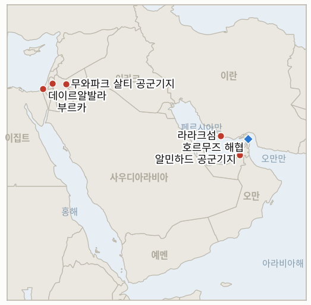

# 중동 일일 브리핑

**2026년 9월 1일**

- **보고 기간:** 약 24시간, 8월 31일 09:00 ~ 9월 1일 09:00 (한국시간)
- **종합 평가:** 라라크섬 타격에 대한 혁명수비대의 보복 예고가 하루 만에 실제 공격으로 이어졌고, 이번 라운드 들어 처음으로 이란 영토 밖까지 확대됐다. 혁명수비대가 "침략자 응징 작전"이라 명명한 미사일·드론 합동 작전이 요르단의 무와파크 살티·프린스 하산 공군기지와, 이란 측 주장으로는 UAE의 알민하드 공군기지까지 타격했으며, 이로써 IND-20260831-1이 자체 시한보다 9일 앞서 확증으로 종결됐다. 트럼프는 "강하게 되받아치겠다"는 경고와 함께 하르그섬이 파괴됐다는 AI 생성 영상을 게시했지만, 이란 측 신호는 정반대 방향으로도 갈라졌다. 페제시키안 대통령은 상하이협력기구 정상회의에서 인도의 모디 총리에게 전쟁 지속이 "이란의 이익에 부합하지 않는다"고 밝혔고, 익명의 이란 소식통은 이번 교전을 "제한적이고 억제된 충돌"이라고 표현했다. 이는 확전 수사와 양측 모두의 억제 본능 사이의 실질적 간극이며, 신설 지표가 이를 추적한다. 별도로 이 브리핑이 가장 오래 추적해 온 로마 트랙 지표가 같은 창에서 9월 1일 자체 시한을 맞았다. 잠정적으로 9월 1일로 거론됐던 레바논-이스라엘 8차 라운드는 출처에 따라 "9월 초" 또는 "9월 하반기"로 밀린 것으로 보도됐으며, 이 자체가 9월 1일 일정이 지켜지지 않았음을 확인해준다. 같은 시한을 맞은 지표 4건도 함께 반증으로 종결됐다. THAAD 요격미사일 부족설은 확인된 운용상 제약으로 이어지지 않았고(국방부는 재배치가 아닌 증산으로 대응), 트럼프의 오만 위협은 수사에 그쳤으며, 후티의 모카 해상 공격 주장은 사우디의 확인도 대응도 이끌어내지 못했고, 카츠 국방장관의 서안지구 경찰 이양은 제출조차 이르지 못했다. 이 마지막 종결에는 같은 날의 실례가 따른다. 라말라 인근 부르카 마을 습격에서 이스라엘군은 팔레스타인인만 체포했는데, 이는 정체된 이양이 바꾸려 했던 바로 그 단속 패턴이다. 가자에서는 이스라엘군의 드론 공격으로 데이르알발라에서 자전거를 타던 팔레스타인인 2명이 사망했고, 휴전 이후 사망자 수는 계속 늘고 있다.

---

## 1. 무슨 일이 있었나

<figure style="float:right; width:46%; margin:2pt 0 8pt 14pt;">

<figcaption style="font-size:8pt; color:#666; text-align:center; margin-top:3pt; font-style:italic;">주요 논의 지점</figcaption>
</figure>

### 1.1 이란, 요르단·UAE 내 미군 관련 기지 타격... 트럼프는 강경 대응 경고

이란 혁명수비대는 미군이 라라크섬의 이란 로켓 발사대 2기를 타격한 지 약 하루 만에 "침략자 응징 작전"이라 명명한 미사일·드론 합동 작전을 요르단·UAE 내 미군 관련 기지에 감행했으며, 이 타격을 라라크섬 공격으로 사망한 혁명수비대원과 민간인에 대한 보복이라고 명시적으로 밝혔다([알자지라](https://www.aljazeera.com/news/2026/8/31/iran-attacks-jordan-uae-after-us-bombs-larak-island-whats-the-latest); [Stars and Stripes](https://www.stripes.com/theaters/middle_east/2026-08-31/iran-attacks-centcom-jordan-22687541.html)). 요르단군은 자국 영공에 진입한 미사일 8발을 요격해 인명·재산 피해 전에 파괴했다고 밝혔으나 발원지나 구체적 표적은 확인하지 않았고, 이란 측은 미군 작전을 지원해온 무와파크 살티(아즈라크)·프린스 하산(마프라크, 통상 킹후세인으로도 불림) 공군기지의 "기술·정비 시설"을 타격했다고 발표했다. UAE 국방부는 이란의 두 번째 표적 관련 주장 자체를 정면으로 반박했다. UAE 공군은 자국 영해 상공의 드론 1기만 요격했다고 밝히고 알민하드 공군기지 자체가 타격받았다는 보도를 "허위"라고 규정했으나, 이란군은 미군 병력과 헬기가 주둔한 지점을 표적으로 삼았다는 입장을 고수했다. 미 당국자는 "미군 기지에는 피해가 없었다"고 밝혔고, 미 중부사령부는 앞선 라라크섬 타격을 "선박에 임박한 위협을 가하던 혁명수비대 기뢰부설 병력에 대한 제한적이고 정밀한 조치"였다고 설명했다([UPI](https://www.upi.com/Top_News/US/2026/08/31/trump-threatens-iran-larak-island-jordan-attacks/9011788203027/); [NPR](https://www.npr.org/2026/08/31/g-s1-141175/attacks-flare-us-iran)). 라라크섬 타격에 따른 이란 측 사망자 수는 확인된 사망자 3명(하미드 아바자데, 알리 파야지가 신원 확인됐고 1명은 미확인)에 부상자 2명으로 늘었다. 트럼프 대통령은 "우리는 그들을 강하게 되받아칠 것"이라고 밝히며 이란의 주요 원유 수출 거점인 하르그섬이 "산산조각 났다"는 AI 생성 영상을 게시했으나, 이란 석유부는 이를 조작이며 "터무니없다"고 일축했다. 이번 교전은 신설된 IND-20260831-1을 자체 시한보다 9일 앞서 확증으로 종결시켰으며, 새로 개설된 IND-20260901-1은 이것이 더 확대될지를 시험한다. **신뢰도: 높음** (라라크섬 타격, 요르단의 미사일 요격, 이란 보복 주장의 큰 틀, 1~2등급, 다수 매체, 각국 공식 발표); UAE 관련 부분에 대해서는 **신뢰도: 중간** (표적국인 UAE가 직접 반박), 이란의 구체적 사상자·피해 주장에 대해서도 **신뢰도: 중간** (독립 검증 없는 이란 국영매체 근거).

### 1.2 이란 신호는 트럼프의 하르그섬 위협 속에서도 억제 쪽으로 갈라져

요르단·UAE 타격 몇 시간 뒤, 페제시키안 대통령은 키르기스스탄 비슈케크에서 열린 상하이협력기구 정상회의를 계기로 만난 인도의 나렌드라 모디 총리에게 미국과의 전쟁 지속이 "이란의 이익에 부합하지 않는다"며 대화와 협력이 남은 문제를 풀어가는 길이라고 밝혔다. 같은 날 시진핑, 푸틴, 모디가 전쟁 발발 이후 처음으로 함께 페제시키안을 만나면서, 테헤란으로서는 상징적인 외교적 연대의 순간이었다([알자지라](https://www.aljazeera.com/news/liveblog/2026/8/31/iran-war-live-irgc-attacks-us-bases-in-jordan-after-us-bombs-larak-island); [The National](https://www.thenationalnews.com/business/2026/08/31/symbolic-solidarity-xi-putin-and-modi-set-to-meet-irans-pezeshkian/)). 익명의 이란 소식통은 별도로 취재진에게 요르단·UAE 타격을 "제한적이고 억제된 충돌"이라고 표현해, 테헤란이 이번 재개된 교전을 전면전 재개로 보지 않고 있음을 시사했다. 다만 이란군은 이번 작전을 유엔헌장상 "정당한 자위권 행사"라고 공개적으로 규정하기도 했다. 이는 트럼프 자신의 수사, 하르그섬 영상과 "강하게 되받아치겠다"는 경고, 그리고 브래드 쿠퍼 제독이 해협은 "매우 양호한 상태"이며 이란의 경제·군사·지도부가 "상당히 약화됐다"고 밝힌 것과 직접적으로 긴장 관계에 있다. 신설된 IND-20260901-1은 향후 열흘간 수사와 자제 선언 중 어느 쪽이 더 정확한 예측 지표였는지를 추적한다. **신뢰도: 높음** (페제시키안 발언과 상하이협력기구 정상회의, 1~2등급, 다수 매체); "제한적이고 억제된" 표현에 대해서는 **신뢰도: 중간** (익명의 이란 당국자 근거).

### 1.3 로마 레바논 회담, 9월 1일 예정일을 넘김... 지표 4건 추가 반증 종결

이 브리핑이 가장 오래 추적해 온 지표, 즉 미국 중재 로마 레바논-이스라엘 회담 8차 라운드가 잠정 거론된 9월 1일 전후로 진행되는지를 시험하는 지표가 그 라운드가 열리지 않은 채 자체 시한을 맞았다. 나하르넷은 8월 27일 정통한 소식통을 인용해 다음 라운드가 9월 하반기로 잡혔다고 보도한 반면, 국무부 관계자는 시기를 "9월 초"로만 언급했고, 미셸 이사 대사는 회담이 "특정 날짜에 얽매이지 않는 기술적 성격"이라고 표현하며 근접 일정 진행을 확인하지 않았다([나하르넷](https://www.naharnet.com/stories/en/322106-next-round-of-rome-talks-to-be-held-in-second-half-of-september); [Ya Libnan](https://yalibnan.com/2026/08/29/next-round-of-lebanon-israel-talks-to-take-place-in-early-september-report/)). 출처 간의 이 불일치 자체가 9월 1일 일정이 지켜지지 않았다는 가장 명확한 증거이며, 이로써 IND-20260807-2는 확증으로 종결된다. 남부 레바논의 재개된 실전투 국면이 외교 트랙 자체 일정을 앞질렀다는 의미다. 같은 9월 1일 시한을 맞은 지표 3건도 반증으로 종결됐다. 한때 80% 소진됐다고 알려진 미군 THAAD 요격미사일 재고 부족설은 동맹 배터리 간 재배치를 확인하는 국방부 공식 성명이나 한국 성주 배터리에 영향을 미치는 재보급 부족을 공개한 사례로 이어지지 않았다. 오히려 국방부는 THAAD 4배·패트리엇 3배 증산 계약을 발표하며 "위험할 정도로 낮다"는 보도를 공개적으로 반박했는데, 이는 반증 요건의 "신빙성 있게 반박됨" 조건에 부합한다(IND-20260808-3). 8월 중순 트럼프 대통령이 오만이 호르무즈 외교에 "걸림돌이 되면" "폭격해버리겠다"고 한 위협은 공식적인 미군 태세 변화, 오만의 항의, 의회의 대응 조치 어느 것도 이끌어내지 못했다. 케인 상원의원이 제안한 전쟁권한 결의안은 의회가 9월 중순까지 휴회 상태여서 아직 정식 발의되지 않았고, 이 좁은 질문은 별도의 더 늦은 시한을 가진 지표로 계속 추적된다(IND-20260818-1). 그리고 후티가 주장한 모카 인근 사우디 상륙함·호위함에 대한 탄도미사일 공격은 전체 보고 기간 동안 사우디의 확인이나 부인, 검증된 보복 어느 것도 이끌어내지 못해, 이 브리핑이 이미 한 차례 확인한 흡수 패턴을 이어갔다(IND-20260818-3). **신뢰도: 높음** (네 건의 종결 모두, 각각 이 브리핑의 수 주에 걸친 자체 추적 기록에 근거, 전반적으로 1~2등급 출처, 국무부·국방부 발표, 나하르넷, Ya Libnan).

### 1.4 부르카 정착민 습격과 카츠의 정체된 경찰 이양이 다섯 번째 지표 종결, 가자 사망자 수는 증가

이스라엘 정착민들이 라말라 동쪽 팔레스타인 마을 부르카를 습격해 가옥에 침입, 안에 있던 여성과 아이를 폭행하고 트랙터·차량 폐차장·양 축사에 불을 지르려 시도했다. 이스라엘군이 도착했을 때는 습격에 가담한 정착민이 아니라 팔레스타인인만 체포했다([타임스오브이스라엘 라이브블로그](https://www.timesofisrael.com/liveblog-august-31-2026/)). 이 사건은 카츠 국방장관이 8월 중순 발표한 서안지구 민간 치안의 이스라엘군에서 경찰로의 이양 계획이 같은 9월 1일 자체 시한을 맞으면서도 이스라엘군이 이양 계획을 제출했다거나 이행에 착수했다는 보도가 없었던 날 벌어졌고, 이로써 IND-20260819-2는 반증으로 종결된다. 사전에 이스라엘군과 조율되지 않은 채 발표된 이 계획은 법무부서 반대와 대법원 청원 가능성 등 예상된 장애물이 그대로 발목을 잡으면서, 발표 자체가 이행 역량을 앞질렀다. 가자에서는 이스라엘군의 드론 공격으로 휴전선 인근 데이르알발라 동부에서 자전거를 타던 팔레스타인인 2명이 사망했으며, 이는 주말에 마지막 확인된 1,313명을 넘어 계속 증가하는 가자 휴전 이후 사망자 수의 일부다([알아크사 순교자 병원 경유 통신사 보도](https://www.aljazeera.com/news/2026/8/24/israeli-strike-on-gaza-shelter-extends-casualty-list)). **신뢰도: 높음** (부르카 습격과 이스라엘군의 체포 패턴, 2~3등급, 타임스오브이스라엘 라이브블로그, 이 브리핑의 수 주에 걸친 서안지구 추적 기록과 일치); 카츠 계획 종결에 대해서도 **신뢰도: 높음** (1~2등급, 8월 19일 이후 이 브리핑 자체 추적 기록); 데이르알발라의 구체적 사망 경위에 대해서는 **신뢰도: 중간** (단일 병원 출처).

---

## 2. 심층 분석: 유인과 동기

### 2.1 이란은 왜 걸프 해역 대응이 아니라 요르단·UAE 내 미군 관련 기지를 타격했나?

미군을 호스팅하는 제3국을 타격하면 이란과 인접한 걸프 해역에서 해상 사건이 통제 불능으로 번질 위험이 가장 큰 지역에서 미군을 직접 공격하지 않고도 도달 능력을 과시하고 워싱턴의 역내 기지망에 정치적 비용을 부과할 수 있기 때문이다. 인명이 아닌 시설을 표적으로 삼고 이 작전을 공개적으로 유엔헌장상 "자위권"이라 규정함으로써, 이란은 확전이 아니라 비례적 대응이라고 내세울 수 있는 보복을 확보하는 동시에 전체 교전을 "제한적이고 억제된" 것으로 묘사할 여지를 남긴다.

### 2.2 트럼프는 왜 실제 타격 대신 AI 생성 영상으로 대응했나?

이란 핵심 석유 수출 거점이 폐허가 된 AI 생성 영상은, 실제 가동 중인 석유 수출 시설에 대한 진짜 타격이 촉발할 시장 충격, 인명 피해 위험, 외교적 파장 없이도 억지 신호, 즉 이란 경제에 가장 큰 타격을 줄 구체적 표적에 대한 가시적 위협을 전달하기 때문이다. 이날 하루 교전만으로도 브렌트유가 3% 뛴 상황에서는 더욱 그렇다. 이는 트럼프로 하여금 전쟁의 실제 물리적 범위를 확대하는 대신, 검증 불가능한 주장과 극적 언어라는 이란 자체의 정보전 방식에 맞춰 대응할 수 있게 해준다.

### 2.3 페제시키안은 왜 이란의 자체 보복 타격 직후 모디에게 억제 신호를 보냈나?

상하이협력기구 정상회의는 이란에 전쟁 외에 다른 선택지가 있음을 과시할 드문 무대를 제공하며, 분쟁 시작 이후 처음으로 시진핑·푸틴·모디가 함께 페제시키안을 만나는 상징적 지지를 얻는 기회이기도 하다. 동시에 국내적으로 라라크섬 타격에 가시적으로 대응해야 한다는 정치적 필요는 이미 보복 타격으로 충족된 상태였다. 두 메시지는 모순이 아니라 순서의 문제다. 먼저 보복해 국내 억지력의 신뢰를 지키고, 그다음 대외적으로 자제를 신호해 이란이 여전히 완성하고자 하는 오만 중재 호르무즈 트랙의 문을 열어두는 것이다.

### 2.4 남부 레바논의 전투 국면이 이어지는 가운데 로마 회담은 왜 예정일을 넘겼나?

7차 라운드를 무산시킨 무장해제 순서 분쟁이 여전히 미해결인 상태에서 실패할 것이 뻔한 라운드를 열 유인이 어느 쪽에도 없고, 10월로 다가온 이스라엘 총선은 예루살렘에 협상 시한에 쫓기기보다 "시간을 끌" 이유를 제공하기 때문이다. 공식 취소 없이 일정이 그냥 밀리도록 두면 양측 모두 외교를 명시적으로 포기했다는 정치적 비용을 피할 수 있는 반면, 타격·사상자, 그리고 이제 라라크섬-요르단-UAE 교전까지 이어지는 실제 군사 트랙은 별개의 자체 시계로 계속 돌아간다.

### 2.5 카츠는 왜 자신도 2주 만에 실현할 수 없었던 서안지구 단속 이양을 발표했나?

이양을 즉시 지시하면 쿠스라 사태로 촉발된 정치적 압박에 실제 이양이 요구하는 조율·법적 검토·경찰 인력 확보 작업을 기다리지 않고도 곧바로 대응할 수 있었기 때문이다. 먼저 발표하고 나중에 조율하는 방식은 원래 시한이 처음부터 비현실적이었음, 즉 이스라엘군 법무부서의 반대, 잠재적 대법원 청원, 10월 총선이라는 보도된 장애물에도 불구하고 즉각적인 결단을 과시할 수 있게 해주었으며, 이 브리핑의 이제 종결된 지표가 이 패턴을 확증한다.

---

## 3. 한국에 대한 정책적 함의

### 3.1 익스포저 현황

| 항목 | 현재 수치 | 출처 |
| --- | --- | --- |
| 원유 수입 중 중동 비중 | 48.5% (2026년 5~7월), 1년 전 69.1%에서 하락; 비중동 비중이 사상 처음으로 50% 상회 | KNOC, 아시아경제 경유; `korea-exposure.md` |
| 7~8월 원유 조달 | 전년 동기 대비 110% 이상 확보 (산업통상자원부, 7월 21일); 비축유 스와프 8월까지 연장, 현재까지 약 2,100만 배럴 스와프 | 산업통상자원부, 헤럴드경제·한경 경유; `korea-exposure.md` |
| 9월 원유 조달 | 90% 이상 확보 (산업통상자원부, 7월 21일) | 산업통상자원부, 헤럴드경제 경유; `korea-exposure.md` |
| 홍해 우회 항로 | 한국행 원유 화물은 얀부/홍해 우회 항로를 계속 이용; 얀부의 아시아행(한국 포함) 수출은 1년 전 100만 b/d 미만에서 약 400만 b/d로 급증 | Lloyd's List Intelligence; `korea-exposure.md` |
| 비축유 대응력 | 실제 소비 기준 약 26일분(추정); 스와프는 즉시 가동 대기 상태이나 대규모 실증은 아직 없음 | CSIS; 산업통상자원부 7월 27일 |
| 정유사 사우디 지분 노출 | S-Oil(사우디 아람코 지분 약 63%), HD현대오일뱅크(아람코 지분 약 17%) | 공시자료; `korea-exposure.md` |
| 한국은행 기준금리 | 3.00%, 8월 27일 두 번째 연속 인상 이후 유지, 인상 근거는 수입 에너지 비용이 아닌 국내 요인 | 서울경제; 2026년 8월 31일자 브리핑 |
| 브렌트유/WTI | 월요일 종가 각각 +2.93%/+2.57%, 90.69달러/85.54달러; 브렌트는 약 1주일 만에 처음으로 90달러 상회, 요르단·UAE 교전이 촉발 | Trading Economics |
| 코스피/원달러 | 코스피 월요일 장중 3.55% 급락을 반전시켜 +0.46% 6,820.02로 마감(연준 매파적 발언, 반도체 우려); 원화는 약 13개월 만의 최고 강세인 1,368.6원으로 마감 | 아시아경제; 서울경제 |
| 호르무즈 통항량 | 월요일 단 2척 통항, 5월 초 이후 최저치이자 10일 평균(14척)을 크게 밑돎 (Vortexa 별도 잠정치는 일 500만 배럴) | Kpler, Baird Maritime·Marine Link 경유 |

### 3.2 사안별 함의

**이란이 호르무즈 통항량이 일 2척으로 급감하는 와중에도 자국 영토 밖 미군 관련 기지를 타격할 의지를 보인 것은, 한국 원유 조달 담당자들이 반영해 온 봉쇄기 나포·재부설 위험이 통항량이 더 줄어드는 상황에서도 완화되지 않았음을 보여주는 가장 뚜렷한 신호다.** 신설된 IND-20260901-1은 이번 교전이 추가 라운드로 확대되는지, 아니면 이란 스스로의 신호와 페제시키안의 상하이협력기구 발언이 시사하듯 테헤란이 현재 원하는 단일한 억제된 사건으로 남는지를 추적한다.

**요르단·UAE 교전 당일 유가가 3% 뛴 것은 양측 모두 제한적이라 표현한 단일 사건만으로도 한국의 수입 비용이 얼마나 빠르게 움직일 수 있는지를 실시간으로 보여준다. 비축유 스와프와 다변화된 조달원(중동 비중 48.5%, 비중동 비중 50% 상회)은 여전히 구조적 완충장치이지만, 이번 사건이 보여준 일간 가격 변동성 자체를 없애주지는 못한다.** 유가 변동 자체에 대해 새로 개설되는 지표는 없으며, 위 시계열 차트로 계속 추적된다.

**로마 레바논 회담이 예정일을 넘긴 것과 함께 같은 9월 1일 시한을 맞은 지표 4건이 반증으로 종결된 것은 한국 계획 담당자들에게 좁은 의미에서 다소 안심할 만한 신호다. 다섯 건의 종결 모두 새로운 활성 전선이 열리지 않은 채, 이전에 우려됐던 위험(THAAD 재배치, 오만에 대한 군사 조치, 사우디-후티 해상 확전, 서안지구 단속 이양)이 예정대로 실현되지 않았음을 확인해줬을 뿐이다.** 이 다섯 건의 종결과 관련해 새로 개설되는 지표는 없으며, 원장에 종결 상태로 이월된다.

**정착민이 부르카를 습격했는데 팔레스타인인만 체포된 서안지구의 계속되는 단속 패턴과, 계속 증가하는 가자 휴전 이후 사망자 수는 한국의 걸프 해상 운송 익스포저에서 핵심이 아닌 인접 변수로 남아 있지만, 둘 다 정책적 변화 없이 지속되는 것은 한국 계획 담당자들이 핵심 호르무즈 지표와 함께 참고하는 더 넓은 지역 불안정성 배경과 일치한다.** 두 사안 관련 새로 개설되는 지표는 없으며, 이 브리핑의 상시 서안지구·가자 지표로 계속 추적된다.

**검증 가능한 지표:**

- **IND-20260901-1** — 이란의 요르단·UAE 타격이 2026년 9월 10일경까지 제3국 내 미군 호스팅 시설에 대한 추가 이란 타격이나 이란 영토에 대한 추가 미군 타격으로, 이번 확전과 명시적으로 연결돼 이어지면 교전이 최초 라운드를 넘어 확대됐음이 확증되고, 같은 기한까지 어느 쪽도 추가 타격이 없으면 페제시키안 스스로의 "이익에 부합하지 않는다"는 표현과 일치하는 단일한 억제된 교전으로 반증된다.

---

## 4. 관찰 목록

- **치명적인 미노안 디그니티호 공격의 배후가 규명되거나 군사적 대응으로 이어지는지 여부** (IND-20260819-1, 시한 9월 2일).
- **국무부의 중동 공관 외교관 복귀 계획이 진행되는지, 무산되는지 여부** (IND-20260826-1, 시한 9월 2일).
- **네타냐후의 트럼프 평화안 거부가 미국의 공식 대응을 이끌어내는지 여부** (IND-20260827-1, 시한 9월 2일).
- **신설된 이란오만 호르무즈 경유 항로를 실제로 이용한 선박이 확인되는지 여부** (IND-20260827-2, 시한 9월 2일).
- **이스라엘의 강화된 시리아·레바논 공습이 암만 중재 1974년 정전선 안보 협상을 무산시키는지 여부** (IND-20260828-1, 시한 9월 3일).
- **가동 일자를 명시한 이란오만 호르무즈 공동성명이 체결되는지 여부** (IND-20260816-3, 시한 9월 5일).
- **아부 알두후르 공습을 둘러싼 튀르키예-이스라엘 마찰이 확대되는지, 흡수되는지 여부** (IND-20260823-1, 시한 9월 6일).
- **이스라엘군의 서안지구 "확전 임계점" 경고가 실제 폭력 양상의 단계적 변화로 이어지는지 여부, 부르카 습격이 새로운 근거로 추가됨** (IND-20260823-2, 시한 9월 6일).
- **바라크의 연이은 논란이 실제 미국의 정책적 또는 인사적 결과로 이어지는지 여부** (IND-20260824-1, 시한 9월 6일).
- **밴홀런 주도 서안지구 미국인 사망 관련 특권 결의안이 위원회 조치나 국무부 대응을 이끌어내는지 여부** (IND-20260828-2, 시한 9월 6일).
- **확인된 헤즈볼라-이스라엘 교전 재개가 자생적 확전 주기로 이어지는지 여부** (IND-20260829-1, 시한 9월 8일).
- **이스라엘 활동가들과 AFP 기자를 겨냥한 자나타 공격이 체포로 이어지는지 여부** (IND-20260826-2, 시한 9월 8일).
- **마사페르 야타 체포가 지속적인 정착민 단속 전환을 의미하는지, 고립된 사례로 남는지 여부** (IND-20260825-2, 시한 9월 8일).
- **쿠스라 습격에 대한 네타냐후의 규탄이 실질적 단속으로 이어지는지, 수사에 그치는지 여부** (IND-20260830-1, 시한 9월 9일).
- **호르무즈에 대한 이란의 "완전한 통제" 주장이 실제 나포로 입증되는지, 지속되는 봉쇄기 통항량으로 반증되는지 여부, 월요일 2척 통항이 새로운 근거로 추가됨** (IND-20260830-2, 시한 9월 9일).
- **혁명수비대의 요르단·UAE 타격이 추가 라운드로 확대되는지, 단일한 억제된 교전으로 남는지 여부** (IND-20260901-1, 시한 9월 10일).
- **헤그세스에 대한 미군 내부 경고가 공개된 전력 태세 변화로 이어지는지, 작전이 변함없이 지속되는지 여부** (IND-20260831-2, 시한 9월 14일).
- **시리아가 이란의 경고에도 불구하고 레바논 내 헤즈볼라에 대해 실제 군사 조치를 취하는지, 대립이 수사에 그치는지 여부** (IND-20260815-3, 시한 9월 15일).
- **케인 상원의원의 오만 관련 특권 전쟁권한 결의안이 9월 상원 복귀 시 표결에서 통과하는지, 부결되는지, 아예 상정되지 않는지 여부** (IND-20260819-3, 시한 9월 25일).
- **예멘의 전투가 극적으로 추가 확대되는지, 소모전 양상으로 정착되는지 여부.**
- **이란의 봉쇄된 IAEA 접근이 새로운 사찰 규약으로 해소되는지, 장기 교착으로 굳어지는지 여부.**
- **캐롤라인 베젠기호 기름 유출이 구조 작업 시작 이후 억제되는지 여부.**
- **케슘섬 폭발이 실제 타격으로 확인되는지, 오경보로 종결되는지 여부.**

---

## 5. 출처 신뢰도 요약

| 주장 | 출처 | 신뢰도 |
| --- | --- | --- |
| 이란의 요르단(무와파크 살티, 프린스 하산 기지) 보복 타격과 요르단의 미사일 요격 | 알자지라, Stars and Stripes, UPI, NPR (1~2등급, 다수 매체, 요르단군 공식 발표) | 높음 |
| 이란이 주장한 UAE 알민하드 공군기지 타격 | 이란군 발표(알자지라 경유); UAE 국방부 반박 (2~3등급, 표적국이 직접 반박) | 중간 |
| 라라크섬 사망자 수(확인된 혁명수비대원 3명) | 이란 국영매체, 교차 보도 (2~3등급, 독립 검증 없는 이란 측 근거) | 중간 |
| 트럼프의 "강하게 되받아치겠다" 발언과 하르그섬 AI 영상 | UPI, NPR, 이란 석유부 반응을 인용한 naked capitalism (1~2등급, 공식 발언, 다수 매체) | 높음 |
| 상하이협력기구 정상회의에서 모디에게 한 페제시키안의 "이익에 부합하지 않는다" 발언 | ANI, The Tribune, Business Standard, The National (2등급, 다수 매체, 공식 발언) | 높음 |
| 로마 레바논 회담의 9월 1일 예정일 초과 | 나하르넷, Ya Libnan (2~3등급, 정통한 소식통 보도, 새 일정에 대해서는 서로 불일치) | 중간 |
| THAAD 요격미사일 부족설과 국방부의 증산 대응 | 알자지라, CNN, Defense News, Stars and Stripes (1~2등급, 국방부 공식 계약 발표) | 높음 |
| 트럼프의 오만 위협이 공식 결과로 이어지지 않음 | 워싱턴포스트, CNN, CNBC, Cleveland Jewish News/JNS (1~2등급, 다수 매체) | 높음 |
| 후티의 모카 해상 공격 주장과 사우디의 무대응 | L'Orient Today, Business Standard (2~3등급, 후티 측 주장, 독립 확인 없음) | 중간 |
| 부르카 정착민 습격과 이스라엘군의 선별적 체포 | 타임스오브이스라엘 라이브블로그 (2~3등급, 단일 출처이나 이 브리핑의 수 주에 걸친 추적과 일치) | 높음 |
| 카츠의 서안지구 경찰 이양이 시한까지 제출조차 이르지 못함 | 예루살렘 포스트, 타임스오브이스라엘, 하아레츠 (1~2등급, 8월 19일 이후 이 브리핑 자체 추적 기록) | 높음 |
| 데이르알발라 드론 공격과 계속되는 가자 휴전 이후 사망자 수 | 알아크사 순교자 병원 경유 통신사 보도, 가자 보건당국 (2~3등급) | 중간 |
