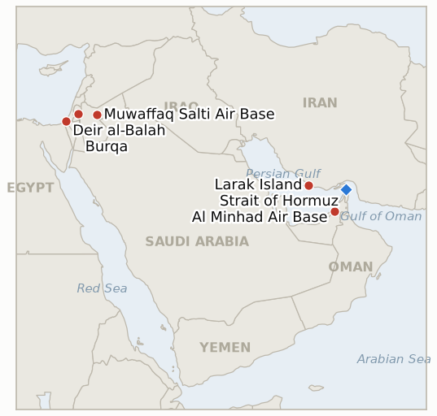

# Middle East Daily Briefing

**September 1, 2026**

- **Reporting window:** ~24 hours, August 31, 09:00 to September 1, 09:00 KST
- **Overall assessment:** The IRGC's vow to retaliate for Sunday's Larak Island strike converted into a real attack within a day, and for the first time this round it reached beyond Iranian territory: a combined missile and drone operation the IRGC called "Punishment of the Aggressor" hit Jordan's Muwaffaq Salti and Prince Hassan air bases and, by Iran's own contested account, the UAE's Al Minhad Air Base, confirming IND-20260831-1 nine days ahead of its own deadline. Trump answered with a vow to "hit them hard" and an AI-generated video of Kharg Island in ruins, while Iran's own signals split in the opposite direction: President Pezeshkian told India's Modi at the SCO summit that continued war "is not in our interest," and an unnamed Iranian source described the exchange as "limited and contained," a real gap between escalatory rhetoric and both sides' quieter de-escalatory instinct that a new indicator will track. Separately, this ledger's oldest Rome-track indicator hit its own September 1 deadline in the same window: the eighth round of Lebanon-Israel talks, provisionally floated for today, has instead slipped to "early" or "the second half of" September depending on the source, a genuine ambiguity that nonetheless confirms the proposed date was not kept. Four other long-open indicators resolved falsified at the same deadline: the reported THAAD interceptor shortage never became a confirmed operative constraint (the Pentagon answered with a production surge, not a reallocation), Trump's threat to bomb Oman stayed rhetorical, the Houthis' claimed naval strike near Mocha drew neither Saudi confirmation nor retaliation, and Defense Minister Katz's West Bank police handover never reached submission, let alone implementation. That last resolution has a same-day illustration: a settler raid on Burqa, near Ramallah, saw the IDF arrest only Palestinians, the enforcement pattern the stalled handover was meant to change. In Gaza, an Israeli drone strike killed two Palestinians cycling in Deir al-Balah as the post-ceasefire toll continues climbing.

---

## 1. What Happened

<figure style="float:right; width:46%; margin:2pt 0 8pt 14pt;">

<figcaption style="font-size:8pt; color:#666; text-align:center; margin-top:3pt; font-style:italic;">Major places of discussion</figcaption>
</figure>

### 1.1 Iran Strikes US-Linked Bases in Jordan and the UAE as Trump Vows to Hit Back Hard

Iran's IRGC launched a combined missile and drone operation it named "Punishment of the Aggressor" against US-linked bases in Jordan and the UAE roughly a day after the US struck two Iranian rocket launchers on Larak Island, explicitly tying the strikes to avenging IRGC personnel and civilians killed in that attack ([Al Jazeera](https://www.aljazeera.com/news/2026/8/31/iran-attacks-jordan-uae-after-us-bombs-larak-island-whats-the-latest); [Stars and Stripes](https://www.stripes.com/theaters/middle_east/2026-08-31/iran-attacks-centcom-jordan-22687541.html)). Jordan's armed forces said they intercepted eight missiles that entered the country's airspace, destroying them before they reached people or property, without confirming their origin or specific targets; Iran's own statement said the operation hit the "technical and repair infrastructure" of the Muwaffaq Salti (Azraq) and Prince Hassan (Mafraq, often called King Hussein) air bases, both used to support US operations. The UAE's Ministry of Defence disputed Iran's account of the second leg entirely, saying its air force intercepted only a drone over its territorial waters and calling reports that Al Minhad Air Base itself was hit "false"; Iran's military maintained it targeted "sites where US forces and helicopters were stationed" there. A US official said there were "no impacts at U.S. bases," and CENTCOM described the original Larak Island strike as "limited, precise action against IRGC minelaying forces posing an imminent threat" to shipping ([UPI](https://www.upi.com/Top_News/US/2026/08/31/trump-threatens-iran-larak-island-jordan-attacks/9011788203027/); [NPR](https://www.npr.org/2026/08/31/g-s1-141175/attacks-flare-us-iran)). Iran's own death toll from the Larak Island strike climbed to three confirmed fatalities (Hamid Avazzadeh and Ali Fayazi named, a third unnamed) with two more wounded. President Trump responded by declaring "we're going to hit them hard" and posting an AI-generated video depicting Kharg Island, Iran's main oil-export hub, "blown to smithereens," which Iran's oil ministry dismissed as fabricated and "laughable." The exchange directly confirms new IND-20260831-1, resolved nine days ahead of its own deadline, and opens IND-20260901-1 to test whether it widens further. **Confidence: High** on the Larak Island strike, Jordan's missile interception, and the broad shape of Iran's retaliation claim (Tier 1-2, multi-outlet, official statements on all sides); Medium on the UAE leg specifically, which the UAE itself disputes, and on Iran's precise casualty and damage claims, which rest on Iranian state media without independent verification.

### 1.2 Iran's Own Signals Split Toward De-Escalation Even as Trump Threatens Kharg Island

Hours after the Jordan and UAE strikes, President Pezeshkian told Indian Prime Minister Narendra Modi on the sidelines of the Shanghai Cooperation Organisation summit in Bishkek that continuing the war with the United States "is not in [Iran's] interest" and that dialogue and cooperation were the way to resolve outstanding problems, the same day Xi Jinping, Putin and Modi all met Pezeshkian for the first time since the war began, a moment of symbolic diplomatic solidarity for Tehran ([Al Jazeera](https://www.aljazeera.com/news/liveblog/2026/8/31/iran-war-live-irgc-attacks-us-bases-in-jordan-after-us-bombs-larak-island); [The National](https://www.thenationalnews.com/business/2026/08/31/symbolic-solidarity-xi-putin-and-modi-set-to-meet-irans-pezeshkian/)). An unnamed Iranian source separately described the Jordan and UAE strikes to reporters as a "limited and contained confrontation," signaling Tehran does not currently view the renewed exchange as a return to full-scale war, even as Iran's armed forces publicly framed the operation as "a legitimate exercise of self-defence" under the UN Charter. This sits in direct tension with Trump's own rhetoric, the Kharg Island video and the "hit them hard" vow, and with Adm. Brad Cooper's separate insistence the strait remains in "extremely good shape" and Iran's economy, military and leadership "largely deteriorated." New IND-20260901-1 tracks which signal, the rhetoric or the stated restraint, better predicts the next ten days. **Confidence: High** on Pezeshkian's quoted remarks and the SCO summit meeting (Tier 1-2, multi-outlet); Medium on the "limited and contained" characterization, sourced to an unnamed Iranian official.

### 1.3 Rome Lebanon Talks Miss Their Proposed September 1 Date as Four More Indicators Resolve Falsified

This ledger's oldest open indicator, tracking whether the eighth round of US-mediated Lebanon-Israel Rome talks would proceed on or near its provisionally floated September 1 date, hit its own deadline without that round convening: an informed source told Naharnet on August 27 the next round would fall in the second half of September, while a State Department official separately described the timing only as "early September" and US Ambassador Michel Issa called the talks "technical in nature and not tied to fixed dates" rather than confirming any near-schedule round ([Naharnet](https://www.naharnet.com/stories/en/322106-next-round-of-rome-talks-to-be-held-in-second-half-of-september); [Ya Libnan](https://yalibnan.com/2026/08/29/next-round-of-lebanon-israel-talks-to-take-place-in-early-september-report/)). The discrepancy between sources is itself the clearest evidence the September 1 date was not kept, and it resolves IND-20260807-2 confirmed: the renewed active-combat phase in south Lebanon has outpaced the diplomatic track's own schedule. Three other indicators also hit their September 1 deadline and resolved falsified. The reported depletion of US THAAD interceptor stocks, once described as 80% exhausted, never produced an official Pentagon statement confirming a reallocation among allied batteries or a disclosed shortfall affecting Korea's own Seongju battery; instead the Pentagon's response was to announce contracts quadrupling THAAD and tripling Patriot production while publicly pushing back on the "dangerously low" framing, which reads as the falsification branch's "credibly walked back" condition (IND-20260808-3). President Trump's mid-August threat to "bomb the s*** out of" Oman if it "gets in the way" of Hormuz diplomacy produced no formal US military posture change, no Omani protest, and no congressional action; Sen. Kaine's proposed war-powers resolution has still not been formally introduced with Congress in recess until mid-September, so that narrower question continues under its own later-dated indicator (IND-20260818-1). And the Houthis' claimed ballistic-missile strike on a Saudi naval landing ship and escort vessels near Mocha drew neither Saudi confirmation nor denial nor any verified retaliation across the full window, extending the absorption pattern this ledger has already documented once (IND-20260818-3). **Confidence: High** on all four resolutions, each resting on this ledger's own multi-week tracking record (Tier 1-2 sourcing throughout, State Department and Pentagon statements, Naharnet, Ya Libnan).

### 1.4 Burqa Settler Raid and Katz's Stalled Police Handover Resolve a Fifth Indicator as Gaza's Toll Climbs

Israeli settlers attacked the Palestinian village of Burqa, east of Ramallah, breaking into a home and beating a woman and child inside while attempting to set fire to a tractor, a vehicle scrapyard and a sheep pen; when the IDF arrived, it arrested only Palestinians rather than any of the settlers involved ([Times of Israel liveblog](https://www.timesofisrael.com/liveblog-august-31-2026/)). The incident lands the same day Defense Minister Katz's mid-August plan to transfer West Bank civilian enforcement from the IDF to the police hit its own September 1 deadline with no report of the IDF having submitted, let alone begun implementing, a handover plan, resolving IND-20260819-2 falsified: the announcement, made without prior IDF coordination and facing legal-division and potential High Court opposition, outran its own implementation capacity exactly as the reported obstacles anticipated. In Gaza, an Israeli drone strike killed two Palestinians cycling in eastern Deir al-Balah near the ceasefire line, part of the continued climb in Gaza's post-ceasefire toll past the 1,313 last verified over the weekend ([Al-Aqsa Martyrs Hospital via wire reporting](https://www.aljazeera.com/news/2026/8/24/israeli-strike-on-gaza-shelter-extends-casualty-list)). **Confidence: High** on the Burqa raid and the IDF's arrest pattern (Tier 2-3, Times of Israel liveblog, consistent with this ledger's multi-week West Bank tracking); High on the Katz-plan resolution (Tier 1-2, this ledger's own record since August 19); Medium on the precise Deir al-Balah casualty circumstances, which rest on a single hospital source.

---

## 2. Deep Dive: Incentives and Motives

### 2.1 Why would Iran strike US-linked bases in Jordan and the UAE rather than confine its response to Iranian or Gulf waters?

Because striking third-country hosts of US forces lets Tehran demonstrate reach and impose a political cost on Washington's regional basing network without attacking US forces directly inside Iran-adjacent Gulf waters, where the risk of a maritime incident spiraling out of control is highest; targeting infrastructure rather than personnel, and publicly branding the operation "self-defence" under the UN Charter, gives Iran a retaliation it can point to as proportionate while leaving itself room to describe the broader exchange as "limited and contained" rather than a war-widening move.

### 2.2 Why would Trump answer with an AI-generated video rather than order a real strike on Kharg Island?

Because an AI-generated video of Iran's central oil-export hub in ruins delivers the deterrent signal, a visible, specific threat against the target that would hurt Iran's economy most, without the market shock, casualty risk or diplomatic fallout an actual strike on live oil-export infrastructure would trigger, especially with Brent already jumping 3% on the day's exchange alone; it lets Trump match Iran's own information-operations register (unverifiable claims, dramatic language) rather than escalate the war's actual kinetic scope.

### 2.3 Why would Pezeshkian signal de-escalation to Modi hours after Iran's own retaliatory strikes?

Because the SCO summit gives Iran a rare stage to project that it has options beyond the war, symbolic backing from Xi, Putin and Modi meeting Pezeshkian together for the first time since the conflict began, while the domestic retaliation strikes already satisfied the political need to visibly answer the Larak Island strike; the two messages are not contradictory but sequenced, retaliate first to preserve deterrent credibility at home, then signal restraint abroad to keep the door open for the Oman-mediated Hormuz track Iran still wants completed.

### 2.4 Why would the Rome talks slip past their own proposed date just as south Lebanon's combat phase continues?

Because neither side has an incentive to convene a round destined to fail while the disarmament-sequencing dispute that stalled the seventh round remains unresolved and Israel's own elections loom in October, giving Jerusalem reason to "play for time" rather than negotiate against a deadline; letting the date slip without a formal cancellation lets both sides avoid the political cost of visibly abandoning diplomacy while the underlying military track, strikes, casualties, and now the Larak Island-Jordan-UAE exchange, continues on its own separate clock.

### 2.5 Why would Katz announce a West Bank enforcement handover he could not actually deliver within his own two-week window?

Because publicly ordering the IDF to cede civilian enforcement let Katz respond immediately to the political pressure generated by the Qusra chaos without waiting for the coordination, legal review, and police-resourcing work an actual handover requires; announcing first and coordinating after let him claim decisive action in the moment even though the reported obstacles, IDF legal division opposition, potential High Court petitions, and October's elections, made the original timeline implausible from the outset, a pattern this ledger's now-resolved indicator confirms.

---

## 3. Policy Implications for South Korea

### 3.1 Exposure snapshot

| Item | Current reading | Source |
| --- | --- | --- |
| Middle East share of crude imports | 48.5% (May to July 2026), down from 69.1% a year earlier; non-Middle East share crossed 50% for the first time on record | KNOC via Asia Business Daily; `korea-exposure.md` |
| July to August crude procurement | 110%+ of prior-year volume secured (MOTIE, July 21); strategic reserve swap extended through August, ~21 million barrels swapped to date | MOTIE via Herald Business, Hankyung; `korea-exposure.md` |
| September crude procurement | 90%+ secured (MOTIE, July 21) | MOTIE via Herald Business; `korea-exposure.md` |
| Red Sea detour routing | Korean-bound crude cargoes continue via the Yanbu/Red Sea workaround; Yanbu exports to Asian buyers including Korea have surged to ~4 million bpd from under 1 million bpd a year earlier | Lloyd's List Intelligence; `korea-exposure.md` |
| Strategic reserve coverage | ~26 days of actual consumption (estimate); swap on immediate standby, untested at scale | CSIS; MOTIE July 27 |
| Refiner Saudi ownership exposure | S-Oil (Saudi Aramco majority ~63%), HD Hyundai Oilbank (Aramco ~17%) | Public filings; `korea-exposure.md` |
| BOK base rate | 3.00%, unchanged since the August 27 second consecutive hike, cited domestic drivers not imported energy costs | Seoul Economic Daily; brief 2026-08-31 |
| Brent / WTI | Settled +2.93% / +2.57% Monday to $90.69 / $85.54, first Brent close above $90 in about a week, on the US-Iran Jordan and UAE exchange | TradingEconomics |
| KOSPI / USD-KRW | KOSPI +0.46% to 6,820.02 Monday after reversing a 3.55% intraday plunge (Fed hawkishness, chip jitters); won firmed to 1,368.6, its strongest level in about 13 months | Asia Business Daily; Seoul Economic Daily |
| Hormuz transits | Just 2 vessels transited Monday, the lowest daily tally since early May and well below the 10-day average of 14 (Vortexa's separate provisional read: 5 million bpd) | Kpler via Baird Maritime, Marine Link |

### 3.2 Implications by development

**Iran's willingness to strike US-linked bases outside its own territory, even as Hormuz transit volume collapses to a two-vessel daily low, is the sharpest signal yet that the blockade-era interdiction risk Korean crude planners have priced into the Yanbu/Red Sea detour has not eased even as the corridor's traffic thins further.** New IND-20260901-1 tracks whether the exchange widens into a further round or stays the single contained episode both Iran's own signals and Pezeshkian's SCO remarks suggest Tehran currently wants.

**Oil's 3% jump on the day of the Jordan/UAE exchange is a live illustration of how quickly Korea's import bill can move on a single escalatory event, even one both sides describe as limited; Korean refiners' strategic reserve swap and diversified sourcing (48.5% Middle East share, non-Middle East share above 50%) remain the structural buffers, but they do not remove the day-to-day price volatility this event demonstrates.** No new indicator opens on the price move itself; it is tracked through the series chart above.

**The Rome Lebanon talks slipping past their own proposed date, together with four other long-tracked indicators resolving falsified at the same September 1 deadline, is a modestly reassuring data point for Korean planners in one narrow sense: none of the five resolutions involved a new active front opening, each instead confirmed that a previously flagged risk (a THAAD reallocation, an Oman military strike, a Saudi-Houthi naval escalation, a West Bank enforcement handover) did not materialize on schedule.** No new indicators open on these five resolutions; the ledger carries each forward as closed.

**The West Bank's continuing enforcement pattern, settlers attacking Burqa while only Palestinians are arrested, and Gaza's climbing post-ceasefire toll remain adjacent rather than core to Korea's Gulf shipping exposure, but both continuing without a policy shift is consistent with the broader regional-instability backdrop Korean planners weigh alongside the core Hormuz indicators.** No new indicators open on either development; both are tracked through this ledger's standing West Bank and Gaza indicators.

**Testable indicators:**

- **IND-20260901-1** — Iran's Jordan and UAE strikes either produce a further Iranian strike on a third-country US-host site or a further US strike on Iranian territory, explicitly tied to this round of escalation, by ~2026-09-10, confirming the exchange has widened beyond its opening round, or no further strikes by either side occur through the same date, falsifying it as a single contained exchange consistent with Pezeshkian's own "not in our interest" framing.

---

## 4. Watch List

- **Whether the fatal Minoan Dignity attack is ever attributed or draws a military response** (IND-20260819-1, deadline September 2).
- **Whether the State Department's diplomat-return plan to Middle East embassies proceeds or stalls** (IND-20260826-1, deadline September 2).
- **Whether Netanyahu's rejection of Trump's peace plan draws a formal US response** (IND-20260827-1, deadline September 2).
- **Whether a vessel is documented using the new Iran-Oman Hormuz corridor specifically** (IND-20260827-2, deadline September 2).
- **Whether Israel's intensified Syria and Lebanon strikes derail the Amman-mediated 1974 line security talks** (IND-20260828-1, deadline September 3).
- **Whether the signed Iran-Oman Hormuz joint statement with an operating date is reached** (IND-20260816-3, deadline September 5).
- **Whether the Turkey-Israel friction over the Abu al-Duhur strike escalates or is absorbed** (IND-20260823-1, deadline September 6).
- **Whether the IDF's West Bank "brink of escalation" warning is followed by an actual step change in the violence pattern, now with the Burqa raid as a fresh data point** (IND-20260823-2, deadline September 6).
- **Whether Barrack's back-to-back controversies produce any actual US policy or personnel consequence** (IND-20260824-1, deadline September 6).
- **Whether the Van Hollen-led privileged resolution on West Bank American deaths forces committee action or a State Department response** (IND-20260828-2, deadline September 6).
- **Whether the confirmed renewed Hezbollah-Israel exchange becomes a self-sustaining escalatory cycle** (IND-20260829-1, deadline September 8).
- **Whether the Jannatah attack on Israeli activists and an AFP journalist draws any arrest** (IND-20260826-2, deadline September 8).
- **Whether the Masafer Yatta arrests mark a durable settler-enforcement shift or stay an isolated case** (IND-20260825-2, deadline September 8).
- **Whether Netanyahu's Qusra condemnation produces genuine enforcement or stays rhetorical** (IND-20260830-1, deadline September 9).
- **Whether Iran's "complete control" claim over Hormuz is validated by a verified interdiction or falsified by continued blockade-era transit levels, now with Monday's two-vessel count as a fresh data point** (IND-20260830-2, deadline September 9).
- **Whether the IRGC's Jordan and UAE strikes widen into a further round or stay a single contained exchange** (IND-20260901-1, deadline September 10).
- **Whether the internal military warning to Hegseth produces a disclosed force posture change or the campaign continues unchanged** (IND-20260831-2, deadline September 14).
- **Whether Syria moves against Hezbollah in Lebanon despite Iran's warning, or the confrontation stays rhetorical** (IND-20260815-3, deadline September 15).
- **Whether Kaine's privileged war powers resolution on Oman passes, fails, or never reaches a floor vote when the Senate returns in September** (IND-20260819-3, deadline September 25).
- **Whether Yemen's fighting produces a further dramatic escalation or settles into an attritional pattern.**
- **Whether Iran's blocked IAEA access to strike-damaged nuclear sites is resolved by a new inspection protocol or hardens into a durable standoff.**
- **Whether the Caroline Bezengi oil spill is contained now that salvage work has begun.**
- **Whether the Qeshm Island explosions are ever confirmed as a real strike or resolved as a false alarm.**

---

## 5. Source Quality Summary

| Claim | Sources | Confidence |
| --- | --- | --- |
| Iran's retaliatory strikes on Jordan (Muwaffaq Salti, Prince Hassan bases) and Jordan's missile interception | Al Jazeera, Stars and Stripes, UPI, NPR (Tier 1-2, multi-outlet, Jordanian armed forces statement) | High |
| Iran's claimed UAE strike on Al Minhad Air Base | Iranian military statement via Al Jazeera; UAE Ministry of Defence denial (Tier 2-3, directly disputed by the target) | Medium |
| Larak Island death toll (three confirmed IRGC fatalities) | Iranian state media, cross-referenced reporting (Tier 2-3, Iranian sourcing without independent confirmation) | Medium |
| Trump's "hit them hard" statement and Kharg Island AI video | UPI, NPR, naked capitalism citing Iran's oil ministry response (Tier 1-2, on-record statement, multi-outlet) | High |
| Pezeshkian's "not in our interest" remarks to Modi at the SCO summit | ANI, The Tribune, Business Standard, The National (Tier 2, multi-outlet, on-record) | High |
| Rome Lebanon talks slipping past the proposed September 1 date | Naharnet, Ya Libnan (Tier 2-3, informed-source reporting, conflicting on the exact new date) | Medium |
| THAAD interceptor depletion story and Pentagon's production-surge response | Al Jazeera, CNN, Defense News, Stars and Stripes (Tier 1-2, official Pentagon contract announcements) | High |
| Trump's Oman threat drawing no formal consequence | Washington Post, CNN, CNBC, Cleveland Jewish News/JNS (Tier 1-2, multi-outlet) | High |
| Houthi claimed Mocha naval strike and absence of Saudi response | L'Orient Today, Business Standard (Tier 2-3, Houthi claim, no independent corroboration) | Medium |
| Burqa settler raid and selective IDF arrests | Times of Israel liveblog (Tier 2-3, single-source but consistent with this ledger's multi-week tracking) | High |
| Katz's West Bank police handover reaching no submission by deadline | Jerusalem Post, Times of Israel, Haaretz (Tier 1-2, this ledger's own record since August 19) | High |
| Deir al-Balah drone strike and Gaza's continuing post-ceasefire toll | Al-Aqsa Martyrs Hospital via wire reporting, Gaza health officials (Tier 2-3) | Medium |
