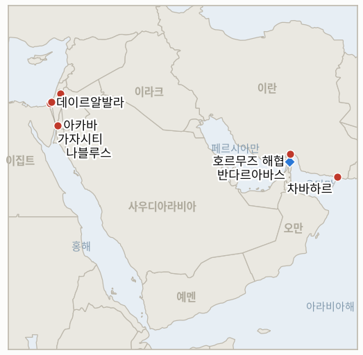

# 중동 일일 브리핑

**2026년 9월 2일**

- **보도 대상 기간:** 약 24시간, 9월 1일 09:00 ~ 9월 2일 09:00 (한국시간)
- **종합 평가:** 지난 한 주간 이어지던 저강도 소강 국면이 깨졌다. 월요일 밤 호르무즈 해협을 통과하던 대형 유조선 두 척이 정체불명의 발사체에 피격됐는데, 그중 한 척은 한국 시노코그룹이 운항하는 선박이었다. 약 하루 뒤 미 중부사령부(CENTCOM)는 "호르무즈 해협 상업 선박과 미군에 대한 IRGC의 최근 공격 시도"를 명시적으로 이유로 들며 이란 남부 해안 9개 지점에 대규모 타격을 가했다. 이란은 "결정적 작전"이라 명명한 무기한 보복으로 맞섰고, IRGC는 요르단 아카바만 연안의 미 해병대 캠프 티틴을 탄도미사일로 2차 타격했다고 주장했다. "다수의" 미군 사상자를 주장했지만 워싱턴과 암만 어느 쪽도 이를 확인하지 않았다. 트럼프 대통령은 이란이 추가 보복할 경우 "훨씬 더 강하고 높은 수준으로" 타격받을 것이라며, "그 모든 것 중 가장 큰 공격"이 아직 "대기 중"이라고 경고했다. 유가는 이 충격을 즉각 반영해 브렌트유 11월물이 3.8% 오른 배럴당 94.36달러, WTI 10월물이 4.3% 오른 89.46달러에 마감했으며, 두 지표 모두 수 주 만에 최고 수준이다. 같은 기간 이 원장이 1~3주간 추적해온 지표 6건이 마감시한을 맞았다. 4건은 허위로 판정됐다(미노안 디그니티호 피격의 배후 규명, 국무부 외교관 복귀 계획, 네타냐후의 가자 계획 거부에 대한 미국의 대응, 발표된 이란-오만 호르무즈 통로의 실사용). 2건은 오늘의 확전을 근거로 마감시한을 앞두고 확정으로 판정됐다(IRGC가 주장한 호르무즈 "완전한 통제", 요르단·UAE 타격의 추가 확대). 한편 이스라엘군은 가자시티 습격으로 하마스 내부보안 책임자를 생포했고, 데이르알발라 공습으로 3명이 숨지고 병원 시설이 훼손됐다. 서안지구 비자리야에서는 모스크 방화 사건에 이례적으로 8명이 체포됐다.

---

## 1. 무슨 일이 있었나

<figure style="float:right; width:46%; margin:2pt 0 8pt 14pt;">

<figcaption style="font-size:8pt; color:#666; text-align:center; margin-top:3pt; font-style:italic;">주요 논의 지점</figcaption>
</figure>

### 1.1 호르무즈 유조선 피격이 이란 남부 해안 대규모 미군 타격을 촉발하다

주아이마에서 사우디산 원유 약 200만 배럴을 각각 싣고 있던 초대형 유조선(VLCC) 두 척이 월요일 밤 오만 하사브 북동쪽 약 17해리 지점에서 정체불명의 발사체에 연이어 피격됐다. 사우디 국적, 바흐리 운항의 시드르호와 라이베리아 국적, 한국 시노코그룹이 운항하며 해협을 빠져나가던 중 발사체 3발을 맞은 세네갈 프로스퍼리티호다([Bloomberg via Insurance Journal](https://www.insurancejournal.com/news/international/2026/09/01/883510.htm); [Korea Herald](https://www.koreaherald.com/article/10859323); [Seatrade Maritime](https://www.seatrade-maritime.com/security/tanker-struck-three-times-in-strait-of-hormuz)). 두 선박 모두 선원 전원 무사했고 배후를 자처한 세력은 없었지만, 해상보안 컨설팅업체 마리스크스는 거의 동시에 발생한 이번 피격을 "위협 환경의 추가 확대"로 규정했다. 약 하루 뒤 CENTCOM은 이란 남부·남동부 해안의 반다르아바스, 케슘섬, 시리크, 자스크, 차바하르, 코나라크, 지로프트, 아살루예, 라반섬 등 9개 지점에 대규모 타격을 가하며 "호르무즈 해협 상업 선박과 미군에 대한 IRGC의 최근 공격 시도"를 명시적 이유로 들었다([Washington Times](https://www.washingtontimes.com/news/2026/sep/1/us-strikes-irgc-targets-iran-attempted-attacks-vessels-strait-hormuz/); [CNBC](https://www.cnbc.com/2026/09/01/us-strikes-iran-after-new-hormuz-strait-shipping-attacks-centcom.html)). 이란 당국은 차바하르와 코나라크에 발사체 4발이 명중했고 지로프트 공항이 타격받았다고 확인했으며, 한 타격은 결혼식이 열리던 가정집을 맞혀 현지 당국에 따르면 2명이 숨지고 수십 명이 다쳤다. 트럼프 대통령은 이번 타격을 유조선 공격과 앞선 요르단·UAE 타격에 대한 보복이자 선제적 조치로 규정하며 "그들은 아무것도 보이지 않으니 레이더를 재건하려 했다... 거의 완성될 때까지 기다렸다가 타격했다"고 말했다. **신뢰도: 높음** (유조선 피격과 미군 타격 규모, 1~2등급 다수 매체, CENTCOM 및 이란 당국 성명 근거); 결혼식 타격 사상자 수치와 CENTCOM의 유조선 공격 IRGC 배후 지목은 **중간** (독립적 검증 없는 현지 이란 당국 및 미군 자체 해석 근거).

### 1.2 이란의 "결정적 작전"이 요르단 미 해병대 기지를 타격, 트럼프는 더 강한 대응을 예고하다

미군의 타격 후 몇 시간 뒤 이란 타스님통신은 "미국이라는 적에 대응하는 이란군의 결정적 작전이 시작됐다. 역내 미군 기지와 이익이 이란의 미사일과 드론의 표적이 되고 있다"고 발표했고, 요르단 마프라크주와 아카바주에서 공습경보가 울렸다([Naharnet](https://www.naharnet.com/stories/en/322199-iran-media-says-military-launches-decisive-operation-against-us-targets); [Times of Israel liveblog](https://www.timesofisrael.com/liveblog-september-1-2026/)). 이어 IRGC는 항공우주군이 요르단 아카바만 연안의 미 해병대 기지 캠프 티틴을 탄도미사일로 타격했다고 밝히며, 이를 작전의 "2차 파상공격"이자 시리크 인근 미군 타격에 대한 명시적 보복이라 규정했다. "다수의" 미군 사상자와 여러 시설·공격헬기 파괴를 주장했으나, 미국과 요르단 어느 쪽도 사상자나 피해를 확인하지 않았으며 IRGC는 작전이 계속되고 있다고 밝혔다([APA](https://en.apa.az/asia/irgc-says-it-struck-us-marine-camp-in-jordan-with-ballistic-missiles-522491); [Al Jazeera liveblog](https://www.aljazeera.com/news/liveblog/2026/9/1/iran-war-live-trump-vows-to-hit-iran-following-first-clash-in-a-month)). 트럼프 대통령은 명확한 확전 경고로 응수했다: "실패한 국가 이란이 이 정당한 공격에 보복한다면, 훨씬 더 강하고 높은 수준으로 다시 타격받을 것이다. 다만 그것이 모든 것 중 가장 큰 공격은 아니며, 그것은 대기 중이다." 이번 교전은 IND-20260901-1을 마감시한보다 8일 앞서 확정으로 종결시켰다. 신규 지표 IND-20260902-1과 IND-20260902-2는 각각 캠프 티틴 사상자 주장의 검증 여부와 트럼프가 예고한 후속 타격의 실현 여부를 추적한다. **신뢰도: 높음** ("결정적 작전" 발표와 캠프 티틴 타격 주장 자체, 1~2등급 다수 매체, IRGC 공식 성명 근거); 주장된 미군 사상자·헬기 손실은 **낮음** (미국·요르단 확인 전무, IRGC 단독 주장).

### 1.3 장기 추적 지표 6건이 9월 2일 마감시한에 판정되고 유가는 4% 가까이 급등하다

이미 설정돼 있던 9월 2일 마감시한에 지표 4건이 각각 도달해 모두 허위로 판정됐다. 8월 19일 발생한 미노안 디그니티호 피격 사건은 끝내 공식 배후 규명이나 이에 결부된 군사 대응을 이끌어내지 못했다(IND-20260819-1). 국무부의 외교관 복귀 계획은 일부 공관의 가족 동반 여행 허가에 그쳤을 뿐, 확인된 외교관 도착 사례는 단 한 건도 없었다(IND-20260826-1). 네타냐후 총리의 가자 무장해제 계획 거부에 대해 미국 정부의 공식 성명, 특사 순방, 수정안 제시 그 무엇도 나오지 않았다(IND-20260827-1). 그리고 발표됐던 이란-오만 호르무즈 통로를 실제로 통과한 선박은 단 한 척도 확인되지 않았으며, 이 통로는 여전히 운영 개시일조차 정해지지 않았다(IND-20260827-2). 반면 지표 2건은 오늘의 확전을 근거로 마감시한을 앞두고 확정으로 판정됐다. IRGC가 주장한 호르무즈 "완전한 통제"는 CENTCOM이 유조선 공격을 이란 측 행위로 지목하며 사실상 이를 실체로 취급한 것으로 확정됐고(IND-20260830-2), 요르단·UAE 타격이 추가로 확대될지를 묻던 지표는 캠프 티틴 타격으로 확정됐다(IND-20260901-1). 유가 시장은 이날의 사건을 즉각 반영했다: 브렌트유 11월물은 3.8% 오른 배럴당 94.36달러로 약 2주 만의 최고치를, WTI 10월물은 4.3% 오른 89.46달러로 한 달 넘는 기간 중 최고 마감가를 기록했다([Yahoo Finance](https://finance.yahoo.com/energy/articles/oil-prices-surge-above-94-173653702.html)). **신뢰도: 높음** (지표 판정 6건 전부, 이 원장의 수 주간 추적 기록과 1~2등급 출처 근거); 유가 마감가도 **높음** (로이터 통신, 다수 금융 매체).

### 1.4 가자시티 습격으로 하마스 내부보안 책임자 생포, 데이르알발라 공습으로 3명 사망

이스라엘군의 공습이 데이르알발라 동부를 강타해 이스라 알히시를 포함해 3명이 숨지고, 알아크사 순교자 병원 산부인과 병동 인근 창고가 훼손돼 3명이 부상했다. 이스라엘군은 병원 구내에 "숨어 있던" 하마스 지휘관을 표적으로 삼았으며 인접 건물을 타격했다고 밝혔다([The National](https://www.thenationalnews.com/news/mena/2026/09/01/series-of-strikes-hit-gaza-amid-reports-of-commando-operation-and-clashes/); [Al Jazeera](https://www.aljazeera.com/news/2026/9/1/israeli-attacks-on-gaza-kill-at-least-four-including-children)). 가자시티에서는 하마스 언론실이 전투기 10대 이상이 동원된 리말 지구 작전으로 여러 명이 부상했다고 밝혔고, 이스라엘군은 별도로 하마스 내부보안 책임자 무에인 알아라비드를 습격 작전으로 생포했다고 발표했다. 유엔 대변인 스테판 두자릭은 "민간인과 병원을 포함한 민간 시설은 항상 보호돼야 한다"고 재차 강조했다. 이번 공습들로 가자지구의 휴전 이후 누적 사망자 수(직전 확인치 1,313명 초과)는 더 늘어날 것으로 보이나, 가자 보건당국의 갱신된 누적 수치는 이번 기간 발표되지 않았다. **신뢰도: 중간** (데이르알발라 정확한 사상자 수와 병원 시설 피해 규모, 병원 및 통신사 출처); 알아라비드 생포는 **높음** (이스라엘군 성명, 다수 매체).

### 1.5 서안지구 비자리야 모스크 방화에 이례적으로 체포자 발생

나블루스 인근 비자리야 마을에서 정착민들이 밤사이 모스크에 방화했다는 신고가 접수됐으며 현장에는 히브리어 낙서가 남겨졌다. 몇 시간 뒤 이스라엘 경찰은 서안지구에서 벌어진 일련의 방화와 팔레스타인인에 대한 폭행 사건과 관련해 용의자 8명을 체포했다고 발표했다. 이는 이 원장이 수 주간 기록해온 정착민 처벌 면제 양상에서 벗어난 이례적 사례다([Times of Israel](https://www.timesofisrael.com/west-bank-mosque-said-torched-by-settlers-8-arrested-for-assaults-on-palestinians-mosque-arsons)). 한편 이스라엘군은 불법 전초기지 쿠스라에서 정착민을 몰아내는 대신 이들과 함께 기도한 예비군 중대장을 해임했으며, 정작 최근 발생한 쿠스라 정착민 공격 자체에 대해서는 영상 증거가 있음에도 체포가 이뤄지지 않았다. **신뢰도: 중간** (비자리야 방화와 체포자 수, 2~3등급, 타임스오브이스라엘 단독이나 이 원장의 다주간 서안지구 추적과 일치).

---

## 2. 심층 분석: 동기와 유인

### 2.1 전쟁이 저강도 국면으로 접어드는 듯했던 시점에 왜 한국 운항 선박을 포함한 호르무즈 통과 유조선 두 척이 표적이 됐을까?

군사 표적이 아닌 상업 선박을 직접 공격하는 것은 국가 간 노골적 타격이 잠잠한 시기에도 어느 국적, 어느 운항사든 해협 통항의 경제적 비용을 끌어올려 보험사와 용선주, 구매자들이 이 항로를 위험하다고 인식하도록 압박하는 효과를 낸다. 사우디 국적 선박과 나란히 시노코 운항 VLCC를 타격한 것은 이 메시지를 걸프 지역 선박을 넘어, 수개월간의 위험에도 해협을 계속 이용해온 한국을 비롯한 아시아 구매자들에게까지 확장하는 의미를 지닌다.

### 2.2 CENTCOM은 왜 유조선 공격에 국한된 대응이 아니라 이란 해안 전역에 걸친 광범위한 타격으로 응수했을까?

레이더, 항만, 공항 등 9개 지점에 걸친 분산 타격은 이란이 재차 기뢰 부설이나 미사일 작전에 활용할 수 있는 단일 역량을 재건하지 못하도록 하는 동시에, 유조선 공격과 앞선 요르단·UAE 타격, 이란의 지속적 기뢰 부설 시도 등 여러 불만을 하나의 정당화된 작전으로 묶어낼 수 있게 해준다. 트럼프 대통령의 "레이더 재건" 프레이밍은 이번 타격이 월요일 유조선 공격 이전부터 이미 사전 계획되고 표적이 추적돼온 정황을 시사한다.

### 2.3 이란은 왜 라라크섬 이후처럼 제한적인 단발성 보복 대신 무기한의 "결정적 작전"을 선언했을까?

무기한 작전은 테헤란이 워싱턴의 대응에 맞춰 추가 타격 수위를 조절할 수 있는 여지를 남기면서, 쉽게 반증 가능한 고정된 종료 시점을 미리 못박지 않아도 되게 해준다. 이는 IRGC가 이미 종결된 일회성 교전이 아니라 계속되는 주도권을 주장할 수 있게 한다. "결정적"이라는 명명은 이 원장이 여러 차례 기록한 대로 앞선 여러 라운드의 주고받기식 교전이 결국 일회성 사건으로 마무리된 것을 지켜본 국내외 청중을 겨냥한 것으로, 실제 군사적 효과가 비슷하게 제한적으로 끝나더라도 이번만큼은 다르게 읽히기를 노린 것이다.

### 2.4 별개로 추적되던 지표 6건이 왜 모두 같은 9월 2일 마감시한에 몰렸으며, 그 엇갈린 판정 결과는 무엇을 시사하는가?

이 원장의 지표 대부분은 8월 중순에서 하순 사이 개설되며 약 1~2주의 검증 기간을 두었기 때문에 그 시기에 몰린 지표군이 자연스럽게 함께 성숙해 마감에 이르렀다. 허위로 판정된 4건, 미노안 디그니티호, 외교관 복귀 계획, 네타냐후 계획에 대한 대응, 이란-오만 통로는 모두 워싱턴, 테헤란, 예루살렘 중 누군가의 지속적인 후속 조치가 필요했으나 이뤄지지 않은 사안들이다. 반면 확정으로 판정된 2건, 호르무즈 "통제"와 요르단·UAE 확전은 모두 누구의 후속 조치 없이도 스스로 가속화된 확전 역학에 관한 것이다. 이는 이 원장의 수개월간 기록에서 탈확전 신호가 확전 신호보다 더 자주 정체되는 패턴과 일치한다.

### 2.5 이스라엘군은 수 주간 기록된 정착민 처벌 면제 양상 속에서 왜 갑자기 서안지구 모스크 방화 사건에 체포자를 냈을까?

모스크 방화는 개인에 대한 공격과 달리 요르단, 걸프 파트너국, 워싱턴으로부터 이 원장이 기록해온 일반적 정착민 폭력만큼의 반발을 이끌어내지 않던 것과는 다른 성격의 종교적·외교적 반발 위험을 안고 있어, 경찰이 신속하고 가시적으로 대응할 강한 제도적 유인을 갖게 된다. 이번 체포 8건이 실제 기소나 지속적 변화로 이어질지, 아니면 마사페르 야타 사례처럼 또 하나의 고립된 사례로 그칠지는 IND-20260825-2를 통한 향후 몇 주간의 추적으로 드러날 것이다.

---

## 3. 한국에 대한 정책 함의

### 3.1 노출도 스냅샷

| 항목 | 현재 수치 | 출처 |
| --- | --- | --- |
| 원유 수입 중 중동산 비중 | 48.5% (2026년 5~7월 이동 평균), 전년 동기 69.1%에서 하락 | KNOC, 아시아비즈니스데일리 경유; `korea-exposure.md` |
| 8월 원유 수입 구성 | 8월 단월 기준 중동산 비중 61.1%로 하락(전년 동월 69.5%); 이라크산 원유 수입은 20여 년 만에 처음으로 전무; 비중동산 수입 전년 대비 +40% | 한국 경제 매체(블루밍비트, 인도네오); 이동 평균 기준선과는 별개의 단월 수치로 신뢰도 중간 |
| 8월 수출·무역수지 | 수출 전년 대비 +68.7%인 982.5억 달러(반도체 +209%인 466.5억 달러로 3개월 연속 400억 달러 상회); 무역흑자 347.5억 달러로 역대 두 번째 |산업통상자원부 경유 코리아타임스, 신화통신 |
| 호르무즈 리스크에 대한 정유사 대응 | GS칼텍스, 셸로부터 마스유 200만 배럴 매입(11월 인도, 10월 두바이유 대비 배럴당 약 13~14달러 프리미엄); SK에너지·HD현대오일뱅크·S-Oil은 베네수엘라 등 중남미산 원유 추가 검토 | Investing.com; 베어드 마리타임 |
| 전략비축유 커버리지 | 실제 소비량 기준 약 26일분(추정); 스와프 즉시 대기 상태이나 대규모 실행은 미검증 | CSIS; 산업통상자원부 7월 27일 |
| 정유사 사우디 지분 노출 | S-Oil(사우디 아람코 지분 약 63%), HD현대오일뱅크(아람코 지분 약 17%) | 공시자료; `korea-exposure.md` |
| 직접 피격된 한국 운항 유조선 | 세네갈 프로스퍼리티호(시노코 운항, 라이베리아 국적 VLCC), 하사브 인근에서 발사체 3발 피격; 선원 전원 무사; 이번 기간 외교부 성명 확인 안 됨 | 코리아헤럴드; 블룸버그/인슈어런스저널 |
| 브렌트유/WTI | 화요일 각각 +3.8%/+4.3% 오른 94.36달러/89.46달러로 마감, 호르무즈 유조선 피격과 미군 타격이 배경 | 야후 파이낸스/로이터 통신 |
| 코스피/원달러 환율 | 코스피 화요일 +0.23%인 6,835.80으로 마감(이날 후반 확전 이전 마감); 원화는 1,370.4원으로 소폭 변동 | 비즈니스코리아; 뉴스핌 |
| 호르무즈 통과 선박 수 | 확전 당일 자체 통과량은 검증된 수치 미발표; 켈러의 수정된 월요일(8월 31일) 수치(화요일 보도)는 5척(입항 4척, 출항 4척, 액체 탱커는 없음)으로 10일 평균 약 14척을 크게 밑돎 | 알모니터 경유 켈러 |

### 3.2 발전 사안별 함의

**시노코 운항 VLCC에 대한 직접적인 발사체 피격은 이 원장이 기록해온 사례 중 한국 관련 선박이 연루된 가장 구체적인 호르무즈 해상 리스크 사건이지만, 이번 기간 마감 시점까지 한국 정부의 공식 성명은 확인되지 않았다.** 신규 IND-20260902-3은 리스크가 실제로 한국이 운항하는 선박에 미친 지금, 서울이 과거 호르무즈 사건들에 대해 보여온 침묵 패턴을 깨는지를 추적한다.

**미군의 타격과 이란의 캠프 티틴 보복이 IND-20260901-1을 확정시키고 브렌트유를 94달러, WTI를 89달러 위로 단 하루 만에 밀어올린 것은 이 원장이 저강도 국면으로 묘사해온 최근 몇 주 동안에도 한국의 수입 대금이 얼마나 빠르게 움직일 수 있는지를 실시간으로 보여준다. GS칼텍스의 이번 마스유 신규 매입, 알려진 베네수엘라산 전환 검토, 8월 한 달 기준 중동산 수입 비중이 61.1%로 낮아진 점 등 한국 정유사들의 능동적 다변화가 이 사건이 실시간으로 시험하는 구조적 완충 장치다.** 유가 변동 자체에 대한 신규 지표는 개설하지 않으며, 위 시계열 차트로 계속 추적한다.

**요르단·UAE 교전의 확대 확정과 "완전한 통제" 판정은 같은 방향을 가리킨다. 이 원장의 통과량 지표 허위 판정 기준이 전제해온 지속적 증거가 필요한 호르무즈 봉쇄 리스크를, 이제는 워싱턴 자신의 타격 정당화 논리가 이미 확립된 사실로 취급하고 있다는 점에서, 한국의 호르무즈 의존 계획 수립에는 판정이 허위로 났을 경우보다 훨씬 나쁜 기준선이 형성된 셈이다.** 신규 IND-20260902-1과 IND-20260902-2는 각각 주장된 캠프 티틴 사상자의 검증 여부와 트럼프가 예고한 대규모 타격의 실현 여부를 추적하며, 두 사안 모두 향후 일주일간 리스크 기준선을 추가로 좌우할 것이다.

**허위로 판정된 지표 4건, 미노안 디그니티호 배후 미확인, 외교관 복귀 지연, 네타냐후에 대한 미국의 무대응, 미사용 이란-오만 통로는 지난 한 달간 이 원장에서 탈확전 신호가 확전 신호보다 꾸준히 부진했다는 사실을 다시금 보여준다. 한국 계획 당국은 향후 어떤 외교적 돌파구 발표든 그것이 자체 검증 기간을 통과하기 전까지는 이 패턴을 감안해 신중히 가중치를 둬야 한다.** 이 4건의 판정에 대해서는 신규 지표를 개설하지 않으며, 원장에는 종결된 사안으로 계속 기록한다.

**가자지구의 계속되는 습격과 서안지구의 이례적인 비자리야 체포는 한국의 걸프 해상 리스크에 핵심적이라기보다는 인접한 사안으로 남아 있지만, 8월의 호조를 보인 수출·무역흑자 지표(반도체 3개월 연속 400억 달러 상회)는 국내 경제가 지금까지는 유가·환율 변동성을 뚜렷한 타격 없이 흡수하고 있음을 보여준다.** 두 사안 모두 신규 지표를 개설하지 않으며, 이 원장의 기존 서안지구·가자지구 지표로 계속 추적한다.

**검증 가능한 지표:**

- **IND-20260902-1** — 미국 또는 요르단 정부의 캠프 티틴 사상자·피해 공식 확인, 또는 이 타격에 명시적으로 결부된 미군의 대응이 2026년 9월 9일까지 나오면 IRGC가 주장한 사상자 규모가 실제였음이 확정되고, 같은 기간 미국과 요르단의 침묵 또는 부인이 이어지면 검증되지 않은 이란 측 주장으로 허위 판정된다.
- **IND-20260902-2** — 2026년 9월 9일까지 이란 영토에 대한 추가 검증된 미군 타격이 있으면 트럼프의 확전 경고가 실제로 이행됐음이 확정되고, 같은 기간 추가 타격이 없으면 억지력을 위한 수사로 허위 판정된다.
- **IND-20260902-3** — 2026년 9월 9일까지 세네갈 프로스퍼리티호 피격에 특정해 대응하는 한국 정부의 공식 성명, 권고, 또는 외교적 조치가 나오면 서울이 자국 운항 선박에 대한 직접 피격을 중대 사안으로 취급함이 확정되고, 같은 기간 침묵이 이어지면 과거 호르무즈 리스크 대응 패턴과 일치해 허위 판정된다.

---

## 4. 주시 목록

- **IRGC가 주장한 캠프 티틴 사상자·피해가 독립적으로 확인되는지 여부** (IND-20260902-1, 마감 9월 9일).
- **트럼프가 예고한 "훨씬 더 강한" 대응과 "대기 중인 가장 큰 공격"이 실제 미군의 추가 타격으로 실현되는지 여부** (IND-20260902-2, 마감 9월 9일).
- **시노코 운항 세네갈 프로스퍼리티호에 대한 직접 피격에 서울이 공식 성명이나 보호 조치를 내놓는지 여부** (IND-20260902-3, 마감 9월 9일).
- **이스라엘의 강화된 시리아·레바논 타격이 암만 중재의 1974년 정전선 안보 협상을 무산시키는지 여부** (IND-20260828-1, 마감 9월 3일).
- **운영 개시일이 명시된 이란-오만 호르무즈 공동성명 서명이 이번 확전으로 더 복잡해진 상황에서도 이뤄지는지 여부** (IND-20260816-3, 마감 9월 5일).
- **메카 공동방위협정이 구체적 이행 조치로 이어지는지 여부** (IND-20260809-2, 마감 9월 8일).
- **아부 알두후르 타격을 둘러싼 튀르키예-이스라엘 갈등이 확대되는지, 흡수되는지 여부** (IND-20260823-1, 마감 9월 6일).
- **이스라엘군의 서안지구 "확전 임박" 경고 이후 실제 폭력 양상에 단계적 변화가 나타나는지 여부, 비자리야의 이례적 체포가 반증 사례로 추가됨** (IND-20260823-2, 마감 9월 6일).
- **배럭 특사의 연이은 논란이 실제 미국의 정책 또는 인사 조치로 이어지는지 여부** (IND-20260824-1, 마감 9월 6일).
- **밴홀런 주도의 서안지구 미국인 사망 관련 특권 결의안이 발의된 후 위원회 조치나 국무부 대응을 이끌어내는지 여부** (IND-20260828-2, 마감 9월 6일).
- **확정된 헤즈볼라-이스라엘 재교전이 자체 지속되는 확전 주기로 이어지는지 여부** (IND-20260829-1, 마감 9월 8일).
- **이스라엘 활동가와 AFP 기자를 대상으로 한 자나타 공격이 체포로 이어지는지 여부** (IND-20260826-2, 마감 9월 8일).
- **마사페르 야타와 이제 비자리야의 체포 사례가 지속적인 정착민 처벌 강화로 이어지는지, 고립된 사례로 그치는지 여부** (IND-20260825-2, 마감 9월 8일).
- **네타냐후의 쿠스라 규탄이 실질적 집행으로 이어지는지, 수사에 그치는지 여부, 예비군 중대장은 해임됐으나 최근 쿠스라 공격 자체에는 체포가 없었던 상황** (IND-20260830-1, 마감 9월 9일).
- **헤그세스 장관에 대한 군 내부 경고가 이번 기간의 확전으로 더 큰 압박을 받는 가운데 공개된 전력 태세 변화로 이어지는지, 작전이 그대로 유지되는지 여부** (IND-20260831-2, 마감 9월 14일).
- **케인 상원의원의 오만 관련 전쟁권한 결의안이 9월 상원 복귀 시 본회의 표결에서 통과·부결되는지, 아예 상정되지 않는지 여부** (IND-20260819-3, 마감 9월 25일).
- **예멘의 교전이 극적으로 추가 확대되는지, 소모전 양상으로 정착되는지 여부.**
- **UAE가 주장한 이란의 탄도미사일 표적 공격이 독립적으로 확인되는지 여부** (IND-20260820-1, 마감 9월 3일).
- **사우디아라비아가 후티의 나즈란·아람코 타격 주장에 대응하는지, 기존의 자제 패턴을 유지하는지 여부** (IND-20260822-1, 마감 9월 5일).
- **소말리아 해적 급증 사태가 공동 해군 대응이나 보험시장 대응을 이끌어내는지 여부** (IND-20260822-2, 마감 9월 5일).
- **가자 국제안정화군에 대한 미국의 2억 600만 달러 지원이 실제 장비 인도나 부대 창설 활동으로 이어지는지 여부** (IND-20260820-3, 마감 9월 19일).

---

## 5. 출처 신뢰도 요약

| 주장 | 출처 | 신뢰도 |
| --- | --- | --- |
| 시드르호·세네갈 프로스퍼리티호 호르무즈 피격 | 블룸버그/인슈어런스저널, 코리아헤럴드, 시트레이드 마리타임, UPI (1~2등급, 다수 매체, 마리스크스 해상보안 컨설팅) | 높음 |
| 이란 남부 해안 미군 타격 규모와 대상 | 워싱턴타임스, CNBC, CNN, 액시오스, 알자지라 라이브블로그 (1~2등급, CENTCOM 성명, 다수 매체) | 높음 |
| 이란 결혼식 타격 사상자(2명 사망, 수십 명 부상) | AP 목격자 경유 현지 이란 당국, 시아셋 (2~3등급, 단일 출처) | 중간 |
| CENTCOM의 유조선 공격 IRGC 배후 지목 | CENTCOM 성명 경유 워싱턴타임스, CNBC (1~2등급, 미군 공식 해석, 독립적 법의학적 확인 없음) | 중간 |
| 이란의 "결정적 작전" 발표와 캠프 티틴 타격 주장 | 나하르넷, 타임스오브이스라엘 라이브블로그, APA, 알자지라 라이브블로그 (1~2등급, IRGC 공식 성명, 다수 매체) | 높음 |
| 캠프 티틴에서 주장된 미군 사상자·헬기 손실 | IRGC 성명 단독; 미국·요르단 확인 없음 (3등급, 단일 출처, 미확인) | 낮음 |
| 트럼프의 확전 경고("훨씬 더 강하게", "대기 중") | 타임스오브이스라엘 라이브블로그, 저스트시큐리티, 뉴스위크 (1~2등급, 공식 발언, 다수 매체) | 높음 |
| 브렌트유·WTI 마감가 | 야후 파이낸스, 로이터 통신 경유 다수 금융 매체 (1~2등급) | 높음 |
| 미노안 디그니티호 배후 미확인 판정 | 윈드워드, USNI뉴스, HS투데이, 프로토테마 (2~3등급, 이 원장의 수 주간 추적) | 높음 |
| 국무부 외교관 복귀 계획의 확인된 도착 사례 부재 | AP 경유 WSLS, 세마포, 쿠르디스탄24 (1~2등급) | 높음 |
| 데이르알발라 공습과 병원 시설 피해 | 더내셔널, 알자지라, 저스트시큐리티 (2~3등급, 병원 및 통신사 출처) | 중간 |
| 무에인 알아라비드 가자시티 생포 | 이스라엘군 성명 경유 다수 통신사 (1~2등급) | 높음 |
| 비자리야 모스크 방화와 체포 8명 | 타임스오브이스라엘 (2~3등급, 단독이나 이 원장의 다주간 추적과 일치) | 중간 |
| 한국의 8월 무역·수출 통계 | 코리아타임스, 신화통신, 산업통상자원부 (1~2등급, 공식 무역통계) | 높음 |
| 한국의 8월 원유 수입 구성(이라크 전무, 중동 비중 61.1%) | 블루밍비트, 인도네오 (3등급, 단월 수치, 하위 등급 취합) | 중간 |
