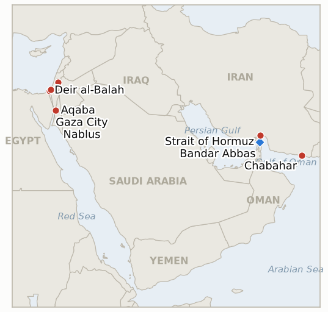

# Middle East Daily Briefing

**September 2, 2026**

- **Reporting window:** ~24 hours, September 1, 09:00 to September 2, 09:00 KST
- **Overall assessment:** The lower-intensity pattern of the past week broke open. Unidentified projectiles struck two Hormuz-transiting VLCCs Monday night, one of them operated by South Korea's Sinokor Group, and CENTCOM answered roughly a day later with a major strike wave across nine sites on Iran's southern coast, explicitly citing "recent attempted attacks by the IRGC against commercial shipping." Iran responded with an open-ended "decisive operation," a claimed second-wave ballistic-missile strike on US Marine Camp Titin in Jordan, with "a large number" of US casualties claimed but confirmed by neither Washington nor Amman; Trump warned Iran would be hit "much harder" if it retaliates further, teasing a "biggest attack of them all" still "waiting in the wings." Oil registered the shock directly, Brent's November contract settling +3.8% to $94.36 and WTI's October contract +4.3% to $89.46, both the best closes in weeks. The same window closed out six indicators this ledger had tracked for one to three weeks: four resolved falsified (the Minoan Dignity attack's attribution, the State Department's diplomat-return plan, any US response to Netanyahu's Gaza-plan rejection, and use of the announced Iran-Oman Hormuz corridor), while two resolved confirmed on the strength of today's escalation (the IRGC's claimed "complete control" of Hormuz, and the further widening of the Jordan/UAE strike exchange). Separately, an Israeli raid in Gaza City captured Hamas's internal security chief as a Deir al-Balah strike killed three and damaged a hospital compound, and a West Bank mosque arson in Bizzariya drew a rare round of eight arrests.

---

## 1. What Happened

<figure style="float:right; width:46%; margin:2pt 0 8pt 14pt;">

<figcaption style="font-size:8pt; color:#666; text-align:center; margin-top:3pt; font-style:italic;">Major places of discussion</figcaption>
</figure>

### 1.1 Hormuz Tanker Attacks Trigger a Major US Strike Wave Across Southern Iran

Two VLCCs, each carrying roughly 2 million barrels of Saudi crude loaded at Juaymah, were struck by unidentified projectiles in quick succession Monday night about 17 nautical miles northeast of Khasab, Oman: the Saudi-flagged Sidr, operated by Bahri, and the Liberia-flagged Senegal Prosperity, operated by South Korea's Sinokor Group and hit by three separate projectiles while exiting the strait ([Bloomberg via Insurance Journal](https://www.insurancejournal.com/news/international/2026/09/01/883510.htm); [Korea Herald](https://www.koreaherald.com/article/10859323); [Seatrade Maritime](https://www.seatrade-maritime.com/security/tanker-struck-three-times-in-strait-of-hormuz)). All crew were reported safe on both vessels and no group claimed responsibility, but maritime security consultant Marisks called the near-simultaneous strikes "a further escalation in the threat environment." CENTCOM answered roughly a day later with a major strike wave across Iran's southern and southeastern coast, hitting sites at Bandar Abbas, Qeshm Island, Sirik, Jask, Chabahar, Konarak, Jiroft, Asaluyeh and Lavan Island, explicitly citing "recent attempted attacks by the IRGC against commercial shipping in the Strait of Hormuz and US military personnel" ([Washington Times](https://www.washingtontimes.com/news/2026/sep/1/us-strikes-irgc-targets-iran-attempted-attacks-vessels-strait-hormuz/); [CNBC](https://www.cnbc.com/2026/09/01/us-strikes-iran-after-new-hormuz-strait-shipping-attacks-centcom.html)). Iranian officials confirmed four projectiles struck Chabahar and Konarak and that Jiroft's airport was hit; one strike hit a home hosting a wedding, killing two and wounding dozens, according to local officials. Trump framed the strikes both as retaliation for the shipping attacks and as pre-emptive: "they tried to rebuild their radar because they can't see anything... we waited until it was almost built and then we hit it." **Confidence: High** on the tanker strikes and the scale of the US strike wave (Tier 1-2, multi-outlet, CENTCOM and Iranian official statements); Medium on the wedding-strike casualty figures, resting on local Iranian officials without independent verification, and on CENTCOM's implicit attribution of the tanker attacks to the IRGC, which no independent probe has yet confirmed.

### 1.2 Iran's "Decisive Operation" Hits a US Marine Camp in Jordan as Trump Warns of a Harder Response in Reserve

Hours after the US strike wave, Tasnim announced that "a decisive operation by Iran's armed forces in response to the US enemy has begun. The US bases and interests in the region are being targeted by Iranian missiles and drones," with air-raid sirens sounding in Jordan's Mafraq and Aqaba governorates ([Naharnet](https://www.naharnet.com/stories/en/322199-iran-media-says-military-launches-decisive-operation-against-us-targets); [Times of Israel liveblog](https://www.timesofisrael.com/liveblog-september-1-2026/)). The IRGC then said its aerospace force struck Camp Titin, a US Marine camp on Jordan's Gulf of Aqaba coast, with ballistic missiles in what it called the operation's "second wave," explicitly avenging the US strike near Sirik, and claimed "a large number" of US personnel killed along with several destroyed facilities and attack helicopters; neither the US nor Jordan had confirmed any casualties or damage as of window close, and the IRGC said the operation was continuing ([APA](https://en.apa.az/asia/irgc-says-it-struck-us-marine-camp-in-jordan-with-ballistic-missiles-522491); [Al Jazeera liveblog](https://www.aljazeera.com/news/liveblog/2026/9/1/iran-war-live-trump-vows-to-hit-iran-following-first-clash-in-a-month)). Trump responded with an explicit escalation ladder: "if the failed Nation of Iran retaliates for this very justified attack, they will be hit again at a much harder and higher level, but it will not be the biggest attack of them all, that is waiting in the wings." The exchange confirms IND-20260901-1 eight days ahead of its own deadline; two new indicators, IND-20260902-1 and IND-20260902-2, track whether the Camp Titin casualty claim holds up and whether Trump's threatened follow-on strike materializes. **Confidence: High** on the "decisive operation" announcement and the Camp Titin strike claim itself (Tier 1-2, multi-outlet, IRGC's own on-record statement); Low on the claimed US casualties and helicopter losses, wholly unconfirmed by the US or Jordan.

### 1.3 Six Long-Tracked Indicators Resolve at Their Own September 2 Deadlines as Oil Jumps Nearly 4 Percent

Four indicators independently reached previously set September 2 deadlines in the same window and all resolved falsified. The fatal, unattributed Minoan Dignity attack from August 19 never drew an official attribution or a tied military response (IND-20260819-1). The State Department's diplomat-return plan produced only family-member travel authorizations at a handful of posts, not a single confirmed Foreign Service officer arrival (IND-20260826-1). No formal US government statement, envoy shuttle or revised plan text ever addressed Netanyahu's rejection of Trump's Gaza disarmament framework (IND-20260827-1). And zero vessels were ever confirmed transiting the announced Iran-Oman Hormuz corridor, which still carries no operating date (IND-20260827-2). Two more indicators resolved confirmed well ahead of their deadlines on the strength of today's escalation: the IRGC's "complete control" claim over Hormuz (IND-20260830-2), which CENTCOM's own strike justification effectively treated as real by attributing the tanker attacks to Iranian action; and the question of whether the Jordan/UAE exchange would widen further (IND-20260901-1), confirmed by the Camp Titin strike. Oil markets registered the day's events directly: Brent's November contract settled +3.8% to $94.36, a level not seen in nearly two weeks, and WTI's October contract settled +4.3% to $89.46, its best close in more than a month ([Yahoo Finance](https://finance.yahoo.com/energy/articles/oil-prices-surge-above-94-173653702.html)). **Confidence: High** on all six resolutions, each resting on this ledger's own multi-week tracking record and Tier 1-2 sourcing; High on the oil settles (Reuters wire via multiple financial outlets).

### 1.4 Gaza City Raid Captures Hamas's Internal Security Chief as a Deir al-Balah Strike Kills Three

An Israeli strike in eastern Deir al-Balah killed Israa al-Hissi and two others and damaged a warehouse near the Al-Aqsa Martyrs Hospital's maternity ward, wounding three; Israel said it targeted a Hamas commander "hiding within the compound," striking an adjacent structure ([The National](https://www.thenationalnews.com/news/mena/2026/09/01/series-of-strikes-hit-gaza-amid-reports-of-commando-operation-and-clashes/); [Al Jazeera](https://www.aljazeera.com/news/2026/9/1/israeli-attacks-on-gaza-kill-at-least-four-including-children)). In Gaza City, Hamas's media office said Israel mounted an operation involving more than 10 warplanes over the Rimal neighborhood, wounding several, while the IDF separately captured Muein al-Arabid, Hamas's internal security chief, in a raid; UN spokesman Stéphane Dujarric reiterated that "civilians and civilian infrastructure, including hospitals, must always be protected." The strikes push Gaza's post-ceasefire toll, last verified above 1,313, further upward, though no updated cumulative figure from Gaza's health ministry was published in the window. **Confidence: Medium** on the precise Deir al-Balah casualty count and hospital-compound damage (Tier 2-3, hospital and wire sourcing); High on the al-Arabid capture (Tier 1-2, IDF statement, multi-outlet).

### 1.5 A West Bank Mosque Arson in Bizzariya Draws a Rare Round of Arrests

Settlers reportedly torched a mosque overnight in Bizzariya, near Nablus, leaving Hebrew graffiti at the scene; hours later, Israel Police announced the arrest of eight suspects in a series of arson attacks and assaults against Palestinians in the West Bank, a departure from this ledger's long-documented pattern of settler impunity ([Times of Israel](https://www.timesofisrael.com/west-bank-mosque-said-torched-by-settlers-8-arrested-for-assaults-on-palestinians-mosque-arsons)). Separately, the IDF dismissed a reservist company commander for praying alongside settlers at the illegal Qusra outpost rather than removing them, and no arrests followed the latest Qusra settler attack itself despite video evidence. **Confidence: Medium** on the Bizzariya arson and the arrest count (Tier 2-3, Times of Israel, consistent with this ledger's multi-week West Bank tracking).

---

## 2. Deep Dive: Incentives and Motives

### 2.1 Why would unidentified attackers target two Hormuz-transiting tankers, including a Korean-operated one, just as the war seemed to be settling into a lower-intensity pattern?

Because striking commercial shipping directly, rather than military targets, raises the economic cost of continued transit through the strait for every flag and operator without requiring an explicit military commitment, pressuring insurers, charterers and buyers to treat the corridor as unsafe even during stretches when overt state-to-state strikes have paused; hitting a Sinokor-operated VLCC alongside a Saudi-flagged one broadens that message beyond Gulf-state shipping to the Asian buyers, including Korea, who have kept using the strait despite months of risk.

### 2.2 Why would CENTCOM answer with a broad multi-site strike wave across Iran's coast rather than a narrower response to the tanker attacks specifically?

Because a dispersed strike across nine sites, radar, ports, an airport, denies Iran the ability to reconstitute any single capability it might use for a renewed mining or missile campaign, and lets Washington fold multiple grievances, the tanker attacks, the earlier Jordan/UAE strikes, and Iran's continued mine-laying attempts, into one justified operation rather than several separately defensible smaller ones; Trump's radar-rebuilding framing suggests a degree of premeditation and target-tracking that predates Monday's tanker attacks specifically.

### 2.3 Why would Iran announce an open-ended "decisive operation" rather than a single bounded retaliatory strike as it did after Larak Island?

Because an open-ended operation preserves Tehran's ability to calibrate further strikes to Washington's own response without committing in advance to a fixed, easily falsified endpoint, letting the IRGC claim ongoing initiative rather than a completed, contained exchange; naming it "decisive" plays to a domestic and regional audience that has watched several rounds of tit-for-tat exchanges resolve as one-off events, signaling this round is meant to read differently even if its actual military effects turn out to be similarly contained.

### 2.4 Why would six separately tracked indicators all land on the same September 2 deadline, and what does their mixed resolution suggest?

Because most of this ledger's indicators carry roughly one- to two-week testing windows opened in mid-to-late August, a natural clustering emerges as that cohort matures together; the four falsifications, Minoan Dignity, the diplomat-return plan, the Netanyahu-plan response, and the Iran-Oman corridor, all involve claims or plans that required sustained follow-through Washington, Tehran or Jerusalem did not deliver, while the two confirmations, Hormuz "control" and the Jordan/UAE widening, both involve escalatory dynamics that accelerated on their own rather than requiring anyone's follow-through, a pattern consistent with de-escalatory processes stalling more often than escalatory ones in this ledger's multi-month record.

### 2.5 Why would the IDF suddenly produce arrests over a West Bank mosque arson after weeks of documented settler impunity?

Because a mosque arson, unlike attacks on individuals, risks a distinct kind of religious and diplomatic backlash, from Jordan, from Gulf partners, and from Washington, that ordinary settler violence against people has not generated at the same volume in this ledger's tracking, giving police a stronger institutional incentive to act visibly and quickly; whether the eight arrests produce actual charges or a durable shift, rather than another isolated case like Masafer Yatta, is what ongoing tracking under IND-20260825-2 will show over the coming weeks.

---

## 3. Policy Implications for South Korea

### 3.1 Exposure snapshot

| Item | Current reading | Source |
| --- | --- | --- |
| Middle East share of crude imports | 48.5% (May to July 2026 rolling), down from 69.1% a year earlier | KNOC via Asia Business Daily; `korea-exposure.md` |
| August crude import mix | Middle East crude fell to 61.1% of that single month's total (down from 69.5% a year earlier); Iraqi crude imports fell to zero for the first time in over 20 years; non-Middle East imports +40% y/y | Korean trade press (Bloomingbit, Indoneo); Medium confidence, single-month reading distinct from the rolling baseline above |
| August exports / trade surplus | Exports +68.7% y/y to $98.25bn (semiconductors +209% to $46.65bn, a third straight month above $40bn); trade surplus $34.75bn, second-highest on record | MOTIE via Korea Times, Xinhua |
| Refiner response to Hormuz risk | GS Caltex bought 2m bbl of Shell Mars crude for November arrival (~$13-14/bbl over October Dubai); SK Energy, HD Hyundai Oilbank and S-Oil weighing further Venezuelan/Latin American crude | Investing.com; Baird Maritime |
| Strategic reserve coverage | ~26 days of actual consumption (estimate); swap on immediate standby, untested at scale | CSIS; MOTIE July 27 |
| Refiner Saudi ownership exposure | S-Oil (Saudi Aramco majority ~63%), HD Hyundai Oilbank (Aramco ~17%) | Public filings; `korea-exposure.md` |
| Korean-operated tanker directly struck | Senegal Prosperity (Sinokor-operated, Liberia-flagged VLCC), hit by three projectiles near Khasab; all crew safe; no MOFA statement found as of window close | Korea Herald; Insurance Journal/Bloomberg |
| Brent / WTI | Settled +3.8% / +4.3% Tuesday to $94.36 / $89.46, on the Hormuz tanker attacks and the US strike wave | Yahoo Finance/Reuters wire |
| KOSPI / USD-KRW | KOSPI +0.23% to 6,835.80 Tuesday, closing before the day's later escalation broke; won little changed at 1,370.4 | Businesskorea; Newspim |
| Hormuz transits | No verified count published for the escalation day itself; Kpler's revised Monday reading (reported Tuesday) put Aug 31 at 5 vessels, 4 inbound and 1 outbound, no liquid tankers among them, well below the 10-day average of ~14 | Al-Monitor via Kpler |

### 3.2 Implications by development

**A direct projectile strike on a Sinokor-operated VLCC is the most concrete Hormuz-shipping risk event this ledger has recorded involving Korean-linked tonnage specifically, yet no Korean government statement had surfaced as of window close.** New IND-20260902-3 tracks whether Seoul breaks its pattern of silence on prior Hormuz incidents now that the risk has landed on a vessel it operates.

**The US strike wave and Iran's Camp Titin retaliation, confirming IND-20260901-1 and pushing Brent above $94 and WTI above $89 in a single session, is a live illustration of how quickly Korea's import bill can move even during weeks the ledger had described as a lower-intensity pattern; Korean refiners' active diversification, GS Caltex's fresh Mars crude purchase, the reported Venezuela pivot, and August's Middle East import share falling to 61.1% for the month, are the structural buffers this event tests in real time.** No new indicator opens on the price move itself; it is tracked through the series chart above.

**The confirmed widening of the Jordan/UAE exchange and the "complete control" resolution both point the same direction: Hormuz interdiction risk that this ledger's own transit-count falsification branches assumed would need continued proof is now treated by Washington's own strike justification as an established fact, a materially worse baseline for Korean Hormuz-dependent planning than the falsified alternative would have been.** New IND-20260902-1 and IND-20260902-2 track whether the claimed Camp Titin casualties are verified and whether Trump's threatened larger strike materializes, both of which would further shape the risk baseline over the coming week.

**The four falsified indicators, Minoan Dignity's non-attribution, the stalled diplomat return, the absent US response to Netanyahu, and the unused Iran-Oman corridor, are a reminder that de-escalatory signals in this ledger have consistently underperformed escalatory ones over the past month, a pattern Korean planners should weight against any future announcement of a diplomatic breakthrough until it survives its own test window.** No new indicators open on these four resolutions; the ledger carries each forward as closed.

**Gaza's continuing raids and the West Bank's rare Bizzariya arrests remain adjacent rather than core to Korea's Gulf shipping exposure, but August's blockbuster export and trade-surplus data (semiconductors above $40bn for a third straight month) shows the domestic economy absorbing the oil-price and won volatility so far without a visible drag on Korea's own trade performance.** No new indicators open on either development; both are tracked through this ledger's standing West Bank and Gaza indicators.

**Testable indicators:**

- **IND-20260902-1** — Official US or Jordanian confirmation of casualties or damage at Camp Titin, or a disclosed US military response explicitly tied to this strike, by ~2026-09-09 confirms the IRGC's claimed casualty toll carried real weight; continued US and Jordanian silence or denial through the same date falsifies it as an unverified Iranian claim.
- **IND-20260902-2** — A further verified US strike on Iranian territory by ~2026-09-09 confirms Trump's threatened escalation had real follow-through; no further US strike through the same date falsifies it as deterrent rhetoric.
- **IND-20260902-3** — An official Korean government statement, advisory, or diplomatic action specifically addressing the Senegal Prosperity attack by ~2026-09-09 confirms Seoul treats a direct hit on Korean-operated tonnage as consequential; continued silence through the same date falsifies it, consistent with Korea's approach to prior Hormuz risk to its shipping.

---

## 4. Watch List

- **Whether the IRGC's claimed Camp Titin casualties and damage are ever independently confirmed** (IND-20260902-1, deadline September 9).
- **Whether Trump's threatened "much harder" response and the "biggest attack... waiting in the wings" materializes as a further US strike on Iran** (IND-20260902-2, deadline September 9).
- **Whether Seoul issues any official statement or protective measure over the direct hit on the Sinokor-operated Senegal Prosperity** (IND-20260902-3, deadline September 9).
- **Whether Israel's intensified Syria and Lebanon strikes derail the Amman-mediated 1974 line security talks** (IND-20260828-1, deadline September 3).
- **Whether the signed Iran-Oman Hormuz joint statement with an operating date is ever reached, now further complicated by the Sept 1 to 2 escalation** (IND-20260816-3, deadline September 5).
- **Whether the Mecca Joint Defence Agreement produces any concrete implementing step** (IND-20260809-2, deadline September 8).
- **Whether the Turkey-Israel friction over the Abu al-Duhur strike escalates or is absorbed** (IND-20260823-1, deadline September 6).
- **Whether the IDF's West Bank "brink of escalation" warning is followed by an actual step change in the violence pattern, now with Bizzariya's rare arrests as a countervailing data point** (IND-20260823-2, deadline September 6).
- **Whether Barrack's back-to-back controversies produce any actual US policy or personnel consequence** (IND-20260824-1, deadline September 6).
- **Whether the Van Hollen-led privileged resolution on West Bank American deaths forces committee action or a State Department response once introduced** (IND-20260828-2, deadline September 6).
- **Whether the confirmed renewed Hezbollah-Israel exchange becomes a self-sustaining escalatory cycle** (IND-20260829-1, deadline September 8).
- **Whether the Jannatah attack on Israeli activists and an AFP journalist draws any arrest** (IND-20260826-2, deadline September 8).
- **Whether the Masafer Yatta arrests, and now Bizzariya's, mark a durable settler-enforcement shift or stay isolated cases** (IND-20260825-2, deadline September 8).
- **Whether Netanyahu's Qusra condemnation produces genuine enforcement or stays rhetorical, after a reservist commander was dismissed but no arrests followed the latest Qusra attack** (IND-20260830-1, deadline September 9).
- **Whether the internal military warning to Hegseth produces a disclosed force posture change or the campaign continues unchanged, now under further strain from this window's escalation** (IND-20260831-2, deadline September 14).
- **Whether Kaine's privileged war powers resolution on Oman passes, fails, or never reaches a floor vote when the Senate returns in September** (IND-20260819-3, deadline September 25).
- **Whether Yemen's fighting produces a further dramatic escalation or settles into an attritional pattern.**
- **Whether the UAE's claimed Iranian ballistic-missile targeting is ever independently confirmed** (IND-20260820-1, deadline September 3).
- **Whether Saudi Arabia responds to the Houthis' claimed Najran/Aramco strikes or continues its established pattern of restraint** (IND-20260822-1, deadline September 5).
- **Whether the Somali piracy surge draws a coordinated naval or insurance-market response** (IND-20260822-2, deadline September 5).
- **Whether the $206 million US ISF funding for Gaza converts into visible equipment delivery or stand-up activity** (IND-20260820-3, deadline September 19).

---

## 5. Source Quality Summary

| Claim | Sources | Confidence |
| --- | --- | --- |
| Hormuz tanker attacks on Sidr and Senegal Prosperity | Bloomberg/Insurance Journal, Korea Herald, Seatrade Maritime, UPI (Tier 1-2, multi-outlet, Marisks maritime security consultancy) | High |
| Scale and targets of the US strike wave across southern Iran | Washington Times, CNBC, CNN, Axios, Al Jazeera liveblog (Tier 1-2, CENTCOM statement, multi-outlet) | High |
| Iranian wedding-strike casualties (2 killed, dozens wounded) | Local Iranian officials via AP witnesses, Siasat (Tier 2-3, single-sourced) | Medium |
| CENTCOM's attribution of the tanker attacks to IRGC action | CENTCOM statement via Washington Times, CNBC (Tier 1-2, official US military framing, no independent forensic confirmation) | Medium |
| Iran's "decisive operation" announcement and the Camp Titin strike claim | Naharnet, Times of Israel liveblog, APA, Al Jazeera liveblog (Tier 1-2, IRGC's own on-record statement, multi-outlet) | High |
| Claimed US casualties and helicopter losses at Camp Titin | IRGC statement only; no US or Jordanian confirmation (Tier 3, single-source, unconfirmed) | Low |
| Trump's escalation-ladder warning ("much harder," "waiting in the wings") | Times of Israel liveblog, Just Security, Newsweek (Tier 1-2, on-record statement, multi-outlet) | High |
| Brent and WTI settlement prices | Yahoo Finance, Reuters wire via multiple financial outlets (Tier 1-2) | High |
| Minoan Dignity non-attribution resolution | Windward, USNI News, HSToday, ProtoThema (Tier 2-3, this ledger's own multi-week tracking) | High |
| State Department diplomat-return plan's lack of confirmed FSO arrivals | AP via WSLS, Semafor, Kurdistan24 (Tier 1-2) | High |
| Deir al-Balah strike and hospital-compound damage | The National, Al Jazeera, Just Security (Tier 2-3, hospital and wire sourcing) | Medium |
| Muein al-Arabid's capture in Gaza City | IDF statement via multiple wire outlets (Tier 1-2) | High |
| Bizzariya mosque arson and the eight arrests | Times of Israel (Tier 2-3, single-source but consistent with this ledger's multi-week tracking) | Medium |
| Korea's August trade and export data | Korea Times, Xinhua, MOTIE (Tier 1-2, official trade statistics) | High |
| Korea's August crude import mix (Iraq to zero, Middle East share 61.1%) | Bloomingbit, Indoneo (Tier 3, single-month reading, lower-tier aggregation) | Medium |
