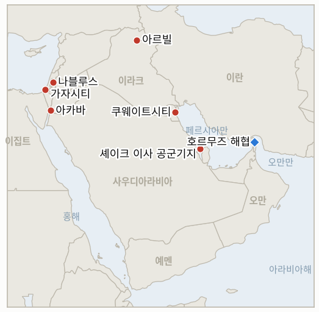

# 중동 일일 브리핑

**2026년 9월 3일**

- **보도 대상 기간:** 약 24시간, 9월 2일 09:00 ~ 9월 3일 09:00 (한국시간)
- **종합 평가:** 어제 브리핑의 그림이 두 갈래로 뚜렷해지고 일부는 뒤집혔다. 첫째는 배후 규명이다. 사우디 국영해운사 바흐리는 8월 31일 자사 유조선 시드르호에 대한 공격, 그동안 배후 불명에 선원 전원 무사로 보도됐던 사건이 필리핀 국적 선원 2명의 사망으로 이어졌다고 확인했고, 리야드는 이번 공격을 명시적으로 이란 소행으로 지목했다. 이는 이번 주 미군 타격 파상 공세를 촉발한 호르무즈 유조선 피격 사건에 대한 첫 국가 차원의 배후 규명이다. 둘째는 부인이다. 미국과 요르단 당국자들은 IRGC가 주장한 캠프 티틴에서의 "다수의" 사상자를 직접 반박하며, 미군 사망·부상자가 전혀 없고 유의미한 피해도 없었다고 밝혔다. 한편 이란의 밤사이 "결정적 작전"은 어제 브리핑에서 확인 가능했던 범위보다 넓었던 것으로 드러났다. 미사일과 드론이 바레인의 셰이크 이사 공군기지, 이라크 아르빌 인근 미군 거점을 타격했다고 알려졌고 쿠웨이트에도 경보가 발령됐으며, 이는 요르단 공격(미사일 13발, 10발 요격, 3발 공터 낙하)에 더해진 것이다. 이란 외무부 대변인 에스마일 바가에이는 상향 조정된 쿠헤스타크 결혼식 피격 사망자 수(어린이 1명 포함 최소 4명 사망, 약 68명 부상)를 "전쟁범죄"라고 규정했고, 트럼프 대통령은 백악관 집무실에서 기자들에게 "그리 오래 가지는 않을 것"이라며 이스라엘은 "이번 확전을 걱정할 필요 없다"고 말해, 전날의 "훨씬 더 강한" 위협보다 눈에 띄게 차분한 어조를 보였다. 유가는 상승세를 유지했고(브렌트유 95달러 근방, WTI 90.63달러 마감), 코스피는 유가·채권금리 복합 충격으로 거의 4% 급락했지만 원화는 거의 보합세를 유지했다. 가자지구에서는 카츠 국방장관이 트럼프가 팔레스타인 대규모 이주 계획을 "백지화"가 아니라 "동결"했을 뿐이라고 밝혔고, 서안지구에서는 정착민과 이스라엘군의 합동 습격으로 알무가이르에서 10대 후반∼20대 팔레스타인 남성 2명이 숨져, 어제의 이례적인 비자리야 체포가 전반적 양상을 바꾸지 못했음을 보여주었다. 한편 한국 정부는 시드르호와 함께 피격된 시노코 계열 세네갈 프로스퍼리티호와 거리를 두며 라이베리아 국적 선박에 한국인 선원이 없다는 점을 강조했다. 이란이 지정한 호르무즈 통항 위반 선박 45척 블랙리스트에는 장금상선 계열 선박 5척이 여전히 포함돼 있다.

**정정 및 업데이트:** 9월 2일 브리핑(§1.1)은 8월 31일 호르무즈 피격 이후 초기 해상보안 보도를 근거로 시드르호와 세네갈 프로스퍼리티호 "선원 전원 무사"라고 전했다. 사우디 바흐리와 사우디 외무부는 이제 시드르호에서 현지시각 밤 11시 40분 "보안 사건" 중 필리핀 국적 선원 2명이 숨졌다고 확인했으며, 리야드는 이 공격을 명시적으로 이란 소행으로 규정해 "사상자 없음" 보도와 이전의 배후 불명 상태를 모두 대체했다. 9월 2일 브리핑은 또한 쿠헤스타크 결혼식 피격 사망자를 "2명"으로 보도했으나, 이란 당국과 다수 매체는 이제 사망자를 4∼5명(어린이 포함)으로, 부상자를 약 68명으로 상향 조정했다. 이번 브리핑은 그날의 전문(front matter)이 아닌 본문에서 이를 반영한다.

---

## 1. 무슨 일이 있었나

<figure style="float:right; width:46%; margin:2pt 0 8pt 14pt;">

<figcaption style="font-size:8pt; color:#666; text-align:center; margin-top:3pt; font-style:italic;">주요 논의 지점</figcaption>
</figure>

### 1.1 사우디아라비아, 시드르호 피격을 이란 소행으로 규명하고 선원 2명 사망 확인

사우디 국영해운사 바흐리는 자사 초대형 유조선 시드르호가 8월 31일 현지시각 밤 11시 40분 호르무즈 해협을 통과하던 중 "보안 사건"으로 피격돼 필리핀 국적 선원 2명이 숨졌다고 확인했고, 사우디 외무부는 이번 공격을 이란 소행으로 지목하며 "확전 중단과 국제 해상 안전 및 세계 에너지 공급 안보 존중의 필요성을 강조한다"고 밝혔다([HuffPost/Reuters](https://www.huffpost.com/entry/iran-attack-tanker-hormuz-kills-sailors_n_6a985489e4b0f5af0411b6dd/amp)). 이는 9월 2일 브리핑의 "선원 전원 무사" 보도를 정정하는 것이며, 시노코 계열 세네갈 프로스퍼리티호와 함께 피격된 8월 31일 공격에 대한 국가 차원의 첫 직접 배후 규명이다. 바흐리에 따르면 시드르호는 7월 해협 내 웨디안호, 그리고 예멘 후티군의 대사우디 해상 봉쇄 선언 이후 홍해에서 피격된 마사호·암잔호에 이어 올해 들어 네 번째로 피격된 자사 선박이다. 한편 밤사이 이란의 "결정적 작전"은 그동안 요르단 캠프 티틴 타격으로만 알려졌으나 실제로는 더 확대된 것으로 확인됐다. 이란 관영매체는 바레인 셰이크 이사 공군기지에 대한 대규모 드론 공격과 이라크 아르빌 인근 미군 거점에 대한 미사일·드론 복합 공격을 주장했고, 쿠웨이트는 별도 언급 없이 적성 드론과 미사일 경보를 발령했으며, 요르단군은 미사일 13발이 영공에 진입해 캠프 티틴과 프린스 하산 공군기지를 겨냥했으나 10발을 요격하고 3발이 외딴 지역에 떨어졌다고 밝혔다([CNBC](https://www.cnbc.com/2026/09/02/us-iran-war-trump-hormuz-irgc-jordan-bahrain.html); [Al Jazeera](https://www.aljazeera.com/news/2026/9/1/us-military-says-launching-new-attacks-on-iran)). **신뢰도: 높음** (시드르호 배후 규명과 사상자, 1등급, 바흐리·사우디 외무부 공식 성명 근거; 확대된 타격 대상 목록도 1~2등급 다수 매체 근거); 이란 측이 주장한 각 지점의 피해 규모는 독립적으로 확인되지 않아 **중간**.

### 1.2 미국과 요르단, 캠프 티틴 사상자 주장 부인, 트럼프는 "곧 가라앉을 것"이라고 예고

미국 당국자 2명은 로이터통신과 알자지라에 캠프 티틴에서 미군 사상자가 전혀 없었고 유의미한 피해도 없었다고 밝혀, IRGC가 주장한 "다수의" 미군 사망 및 헬기 파괴 주장을 직접 반박했다. 요르단도 요격되거나 빗나간 미사일로 인한 자국 인명피해가 없었다고 밝혔다([JPost](https://www.jpost.com/middle-east/article-907279)). 이로써 IND-20260902-1은 9월 9일 마감시한을 훨씬 앞두고 반증으로 판정됐다. 트럼프 대통령은 백악관 집무실에서 기자들과 만나 전날의 "훨씬 더 강한" 위협보다 눈에 띄게 차분한 어조로 "그리 오래 가지는 않을 것 같다. 그들이 얼마나 더 버틸 수 있을지 모르겠다"고 말했고, 이스라엘에는 이번 확전을 "걱정할 필요 없다"며 "곧 가라앉을 것"이라고 예고했다. 별도로 이란을 협상 테이블로 복귀시키려는 것 아니냐는 질문에는 "그들에게는 무가치한 합의에 서명하든 말든 전혀 관심 없다"며 미국이 "호르무즈 해협을 거의 완전히 통제하고 있고 그들의 경제는 완전히 붕괴하고 있다"고 답했다([Times of Israel liveblog](https://www.timesofisrael.com/liveblog-september-2-2026/); [Forbes](https://www.forbes.com/sites/siladityaray/2026/09/02/trump-says-he-couldnt-care-less-about-forcing-iran-to-accept-a-deal/)). 이란 측이 상향 조정한 쿠헤스타크 결혼식 피격 사망자는 4세 아미르 알리 카리미를 포함해 최소 4명, 부상자는 약 68명으로 늘었다. 외무부 대변인 에스마일 바가에이는 이를 "전쟁범죄"라 규정하고 단호한 보복을 다짐했으며, CENTCOM은 민간인 사상자 보고를 인지하고 있다면서도 미군은 민간인을 표적으로 삼지 않는다는 입장을 유지했다([Al Jazeera](https://www.aljazeera.com/news/2026/9/2/what-do-we-know-about-the-fatal-us-bombing-of-a-wedding-in-irans-sirik)). **신뢰도: 높음** (미국·요르단의 부인과 트럼프 발언, 1~2등급, 공식 발언 다수 매체 근거); 결혼식 사망자 수는 24시간 사이 매체별로 2명에서 11명까지 엇갈려 **중간**.

### 1.3 유가 상승세 유지, 코스피 거의 4% 급락, 원화는 보합

브렌트유는 세션 내내 95달러 근방에서 거래됐고(매체별 종가 보도는 94.19달러에서 95.40달러까지 엇갈렸다) 전일 약 4% 급등에 이어 상승세를 이어갔으며, WTI 10월물은 90.63달러(+0.45%)에 마감해 확대된 요르단·바레인·이라크·쿠웨이트 교전이 공급 차질 우려를 계속 높였다([Yahoo Finance](https://finance.yahoo.com/markets/stocks/articles/stock-market-today-sept-2-134032621.html); [Reuters via Business Recorder](https://www.brecorder.com/news/40437536/oil-up-nearly-1-as-us-and-iran-trade-fresh-strikes)). 코스피는 3.99% 하락한 6,562.72로 마감해 수 주 만에 가장 큰 낙폭을 기록했는데, 유가 충격에 미국 국채 금리 급등(10년물 금리 2023년 말 이후 최고 수준인 4.814%까지 상승)이 겹친 결과였으며 기업 자사주 매입이 낙폭을 일부 완충했다. 반면 원화는 거의 보합세를 유지해 1,368.7원으로 전일 대비 1.7원 절상 마감, 주식시장의 급락과는 다른 흐름을 보였다([Seoul Economic Daily](https://en.sedaily.com/finance/2026/09/02/kospi-closes-down-399-percent-at-656272); [Asia Business Daily](https://www.asiae.co.kr/en/article/2026090215514382923)). 이번 기간 검증된 호르무즈 일일 통항량 수치는 발표되지 않았다. **신뢰도: 높음** (코스피, 원화, WTI 종가, 1~2등급 공식 거래소 데이터 다수 매체 근거); 브렌트유 정확한 종가는 매체 간 수치가 엇갈려 **중간**.

### 1.4 가자지구 카츠 국방장관 "이주 계획은 동결일 뿐", 알무가이르 합동 습격으로 2명 사망

이스라엘 카츠 국방장관은 예디오트 아하로노트 주최 행사에서 트럼프 대통령이 팔레스타인 대규모 이주 계획을 "백지화"가 아니라 "동결"했을 뿐이며, 이집트가 수용을 거부한 상황에서 워싱턴이 수용국을 물색 중이라고 말했다. 그는 이스라엘이 "바다로, 하늘로, 모든 방법을 동원해" 이들을 내보낼 준비가 돼 있다고 밝혔고, 근거를 밝히지 않은 자체 조사를 인용해 가자 주민의 80%가 이주를 원한다고 주장했다([Times of Israel](https://www.timesofisrael.com/katz-israel-will-facilitate-emigration-from-gaza-by-any-means-as-soon-as-trump-allows); [Arab News](https://www.arabnews.com/middle-east/israel-ready-to-remove-gaza-population-if-us-gives-approval-minister-3000230)). 네타냐후 총리는 별도로 가자지구 내 이스라엘군 초소를 방문해 현재 점령 중인 지역에서는 철수하지 않겠다고 말했다. 서안지구에서는 정착민과 이스라엘군의 합동 습격이 라말라 인근 알무가이르 마을에 진입했고, 팔레스타인 측은 10대 후반에서 20대 남성 2명이 총격으로 숨졌다고 전했다. 정확한 경위는 이스라엘군의 입장 발표 전까지 불분명한 상태로 남았으며, 이는 8월 30일 같은 마을에서 4명이 부상당한 유사한 합동 습격에 이은 것이다([Times of Israel liveblog](https://www.timesofisrael.com/liveblog-september-2-2026/)). 한편 이스라엘군은 나블루스 인근 베이타의 한 모스크에 최루탄을 발사했고 정착민들은 두 번째 모스크에 방화를 시도해, 월요일 비자리야 방화 사건에 대한 이례적인 체포 8건 이후에도 상황이 이어졌다. **신뢰도: 중간** (알무가이르 사망자, 1~2등급, 타임스오브이스라엘 라이브블로그가 팔레스타인 측 발표 인용, 이스라엘군 입장 미확인); 카츠·네타냐후 발언은 **높음**.

### 1.5 한국 정부, 시노코 계열 유조선과 선 긋기…이란 블랙리스트는 장금상선 계열 선박 위협

한국 해양수산부는 시드르호와 함께 피격된 라이베리아 국적 VLCC 세네갈 프로스퍼리티호(장금상선, 시노코의 한국 법인명이 용선 후 재용선한 선박)에 대해 "정부 관리 대상 선박이 아니며 한국인 선원도 없다"고 밝혔고, 외교부도 언론 문의에 같은 입장을 전했다([Asia Business Daily](https://view.asiae.co.kr/article/2026090209041239057); [Herald Corp](https://biz.heraldcorp.com/article/10859760)). 이는 이번 공격에 대한 한국 정부의 첫 공식 대응으로, IND-20260902-3을 확정으로 판정하지만 그 내용은 한국의 관련성을 강조하기보다 축소하는 방향이다. 한편 한국 경제지들은 장금상선이 올해 들어 호르무즈 원유 수송 시장에 공격적으로 진출해 VLCC를 매입·용선하며 2월 기준 약 120척을 운용 중이라고 보도했으며, 이란 페르시아만 해협청(PGSA)이 8월 31일 발표한 통항 위반 45척 블랙리스트에는 장금상선 계열 선박 5척(세네갈 프로스퍼리티호는 미포함)이 포함돼 벌금·억류·화물 압류 위협에 놓여 있다([Khan](https://www.khan.co.kr/en/article/202609021116027/); [Seatrade Maritime](https://www.seatrade-maritime.com/security/iran-threatens-45-blacklisted-ships-with-seizure-and-fines)). **신뢰도: 중간** (정부 발표와 장금상선 블랙리스트 노출, 2~3등급, 한국 경제·일반 매체 다수 근거 일치); 선단 규모 수치는 단일 매체 근거로 **낮음**.

---

## 2. 심층 분석: 유인과 동기

### 2.1 사우디아라비아는 왜 하루의 침묵 끝에 시드르호 피격을 이란 소행으로 직접 지목했을까?

선원 사망은 리야드가 기존 바흐리 선박 피격 사례처럼 조용히 넘길 수 있었던 모호한 "정체불명 발사체" 사건을, 국내외 여론이 배후를 요구할 수밖에 없는 국영자산에 대한 치명적 공격으로 전환시키기 때문이다. 확전 자제를 동시에 촉구하면서 이란을 지목하는 방식은 사우디가 독자적 보복 태세를 취하지 않으면서도 외교·보험 기록상 사실관계를 남길 수 있게 하며, 이는 자국 선박 피격에 대응하기보다 기록으로 남기는 사우디의 기존 패턴과 일치한다.

### 2.2 미국과 요르단 당국자들은 왜 과거 이란의 미확인 공격 주장에 침묵으로 일관했던 것과 달리 캠프 티틴 사상자 주장을 이렇게 신속하고 명시적으로 부인했을까?

"다수의" 미군 사망이라는 반박되지 않은 주장이 하루라도 방치되면 워싱턴과 암만이 이란의 시간표에 맞춰 즉각적이고 대규모인 보복에 나서야 한다는 국내 정치적 압력이 커질 위험이 있기 때문이다. 신속하고 공식적인 부인은 특정 사상자 사건에 대응해야 한다는 실질적 긴급성을 제거하면서도, 같은 날 트럼프의 더 차분한 "곧 가라앉을 것" 발언에서 드러나듯 워싱턴 자체의 타격 일정을 이란의 검증되지 않은 서사에 휘둘리지 않고 독자적으로 통제할 수 있게 한다.

### 2.3 트럼프는 왜 약 24시간 만에 "훨씬 더 강하게", "그 모든 것 중 가장 큰 공격이 대기 중"이라던 발언에서 "그리 오래 가지는 않을 것 같다"로 선회했을까?

두 발언은 계획 변경을 반영한다기보다 서로 다른 대상과 목적을 겨냥한 것이기 때문이다. 확전 위협은 캠프 티틴 직후 이란의 추가 공격을 억지하려는 목적이었던 반면, "호르무즈 해협을 거의 완전히 통제하고 있고 그들의 경제는 완전히 붕괴하고 있다"는 발언과 짝을 이루는 차분한 어조는 이번 작전이 이미 성공하고 있다는 대외적 평가로, "그들에게는 무가치한 합의에 서명하든 말든 전혀 관심 없다"는 동시 발언과도 맞닿아 있다. 승리하고 있다고 규정된 전쟁은 협상을 통한 출구가 필요 없으며 상대의 일방적 굴복이 필요할 뿐이고, 두 메시지 모두 이란을 같은 결말로 이끌고 있다.

### 2.4 카츠 국방장관은 왜 트럼프의 발언 후퇴를 그대로 두지 않고 가자 이주 계획을 "동결일 뿐"이라고 공개적으로 재확인했을까?

이스라엘 국방당국 스스로 "준비가 돼 있다"고 밝힌 계획은 단기 실현 가능성과 무관하게 연립정부 내 정치적 가치를 유지하기 때문이다. 채널13 여론조사에서 네타냐후 진영과 야권이 동률을 이룬 상황에서, 이는 정착촌·강경 우파 진영에게 이 구상이 이집트와 국제사회의 압박에 밀려 폐기된 것이 아니라 여전히 살아 있다는 신호를 준다. 걸림돌을 정책 후퇴가 아니라 수용국 부재로 규정하면, 이스라엘이 실제로 누가 이 인구를 받아들일지 특정하지 않고도 이 구상을 명목상 테이블 위에 유지할 수 있다.

### 2.5 월요일 비자리야 체포로 단속 강화 가능성이 제기된 지 얼마 되지 않아 알무가이르 정착민·군 합동 습격이 왜 사망 사건으로 이어졌을까?

비자리야 체포는 종교 시설에 대한 방화, 뚜렷한 외교적 파장을 부르는 폭력 유형을 겨냥한 것이었던 반면, 알무가이르에 대한 정착민·이스라엘군 합동 작전은 4월 팔레스타인 2명 사망, 8월 30일 4명 부상 등 올해 반복적으로 표적이 돼 온 마을을 상대로 한 것으로, 이미 용인돼 온 단속성 습격 패턴 안에 있기 때문이다. 따라서 같은 주에 이례적 책임 추궁 제스처와 치명적 반복 사건이 서로 모순 없이 동시에 발생할 수 있으며, 이는 이 원장의 자체 추적(IND-20260825-2)이 보여주듯 서로 다른 폭력 범주가 서로 다른 제도적 대응을 이끌어낸다는 점과 일치한다.

---

## 3. 한국에 대한 정책적 함의

### 3.1 익스포저 현황

| 항목 | 현재 수치 | 출처 |
| --- | --- | --- |
| 시노코 계열 유조선 상태 정정 | 세네갈 프로스퍼리티호는 라이베리아 국적, 한국인 선원 없음, 정부 관리 대상 아님(해수부·외교부 확인); 선주 장금상선(시노코)이 용선 후 재용선 | 아시아경제, 헤럴드경제 |
| 장금상선 호르무즈 익스포저 | 2026년 2월 기준 약 120척 운용 추정(VLCC 적극 확장); 이란 45척 블랙리스트에 장금상선 계열 5척 포함(세네갈 프로스퍼리티호는 미포함) | 경향신문, Seatrade Maritime |
| 중동산 원유 수입 비중 | 48.5%(2026년 5~7월 이동평균), 전년 동기 69.1%에서 하락; 8월 단월 수치는 61.1% | KNOC via 아시아경제; `korea-exposure.md` |
| 브렌트유/WTI | 브렌트유 95달러 근방 거래(매체별 종가 94.19~95.40달러); WTI 90.63달러(+0.45%) 마감 | Yahoo Finance; Reuters via Business Recorder |
| 코스피/원달러 환율 | 코스피 유가·채권금리 복합 충격으로 3.99% 하락한 6,562.72 마감; 원화는 거의 보합, 1,368.7원(1.7원 절상) | 서울경제, 아시아경제 |
| 전략비축유 보유 일수 | 실제 소비 기준 약 26일(추정치); 스와프 즉시 시행 대기, 대규모 시행 검증 안 됨 | CSIS; 산업통상자원부 7월 27일 |
| 정유사 사우디 지분 노출 | S-Oil(사우디 아람코 지분 약 63% 과반), HD현대오일뱅크(아람코 지분 약 17%) | 공시자료; `korea-exposure.md` |
| 호르무즈 통항량 | 이번 기간 검증된 일일 통항량 수치 미발표 | 해당 없음 |

### 3.2 사안별 함의

**사우디아라비아가 시드르호 피격을 이란 소행으로 규명하고 선원 2명 사망을 확인한 것은, 8월 31일 유조선 공격을 모호한 사건에서 국가가 배후를 지목한 걸프 해상 치명적 공격으로 격상시켰으며, 이는 같은 항로를 운항하는 한국 관련 선박에 대해서도 어제 브리핑의 "배후 불명, 사상자 없음" 진단보다 훨씬 더 나쁜 기준선을 의미한다.** 신규 IND-20260903-3은 이제 직접 피격과 부분적 블랙리스트 노출을 동시에 겪고 있는 운항사 장금상선이 호르무즈 용선 속도를 조정하는지를 추적한다.

**해수부와 외교부의 세네갈 프로스퍼리티호 피격 대응이 장금상선의 한국 자본 소유권이나 계열 선단 전체의 블랙리스트 노출이 아니라 오로지 해당 선박의 비한국 국적·선원 여부에만 초점을 맞춘 것은 IND-20260902-3을 확정으로 판정하지만, 서울이 호르무즈 사건을 유의미하다고 판단하는 기준선이 실제 기업 익스포저보다 훨씬 좁다는 점을 시사한다.** 이 구체적 대응 방식에 대해 별도 신규 지표는 열지 않으며 IND-20260903-3을 통해 계속 추적한다.

**트럼프의 차분해진 "곧 가라앉을 것" 발언이 실제로 유지된다면 이는 최근 3주 사이 이 원장이 기록한 다른 네 건의 긴장 완화 주장(IND-20260819-1, IND-20260826-1, IND-20260827-1, IND-20260827-2)이 모두 허위로 판정된 것과 대비되는 이번 원장 최초의 진정한 긴장 완화 신호가 될 것이다. 한국 정유사와 KNOC는 이 발언이 자체 검증 기간을 통과하기 전까지는 이 패턴과 일치하는 미검증 수사(修辭)로 취급해야 한다.** 신규 IND-20260903-1이 이를 구체적으로 추적한다.

**코스피가 거의 4% 급락한 것은 원화 자체가 안정세를 유지하는 상황에서도 한국 주식시장이 유가와 글로벌 채권금리 결합 경로에 여전히 매우 민감하게 반응한다는 점을 보여주며, 한국 정책당국이 환율 안정만으로 중동발 변동성에 충분한 완충재가 되는지 검토할 필요가 있음을 시사한다.** 이번 시장 변동 자체에는 별도 신규 지표를 열지 않으며 위 시계열 차트로 계속 추적한다.

**가자지구 카츠 발언과 서안지구 알무가이르 사망 사건은 한국의 직접적인 걸프 해상 익스포저와는 다소 거리가 있지만, 이 원장의 관찰 목록이 이어온 병렬적이고 미해결된 분쟁 축의 지속 양상을 뒷받침한다.** 두 사안 모두에 대해 신규 지표는 열지 않는다.

**검증 가능한 지표:**

- **IND-20260903-1** — 트럼프의 9월 2일 "곧 가라앉을 것" 발언 이후 약 2주간(~2026년 9월 16일까지) 미국의 추가 대이란 타격과 이란의 추가 대미·동맹국 타격이 모두 없는 검증된 지속적 긴장 완화가 확인되면 이 발언이 실제 판단을 반영했음이 확정된다. 같은 기간 내 미국 또는 이란의 추가 타격이 있으면, 이는 실제 전개 양상과 맞지 않는 수사(修辭)였음을 뜻하는 반증으로 판정된다.
- **IND-20260903-2** — 9월 1~2일 파상 공격 이후 미국, 요르단, 바레인, 이라크, 쿠웨이트 중 어느 곳에라도 검증된 추가 이란 공격이 ~2026년 9월 9일까지 발생하면 "결정적 작전"이 단일 제한적 라운드가 아니라 무기한 지속 작전임이 확정된다. 같은 기한까지 추가 이란 공격이 없으면, 라라크섬 및 1차 캠프 티틴 타격 이후 패턴과 일치하는 제한적 작전으로 반증 판정된다.
- **IND-20260903-3** — 장금상선의 호르무즈 통과 VLCC 용선 활동이 검증 가능하게 축소되거나, 한국 정부가 해당 기업의 호르무즈 익스포저를 구체적으로 다루는 권고·조치를 ~2026년 9월 17일까지 발표하면, 직접 피격과 블랙리스트 위협이 한국 관련 해운 행태를 실제로 변화시켰음이 확정된다. 같은 기한까지 호르무즈 운항이 지속되거나 확대되고 관련 권고도 없으면, "고위험 고수익" 전략이 그대로 유지되고 있음을 보여주는 반증으로 판정된다.

---

## 4. 관찰 목록

- **트럼프의 "곧 가라앉을 것" 예고가 추가 미국·이란 타격 없이 약 2주간 유지되는지** (IND-20260903-1, 마감 9월 16일).
- **이란의 "결정적 작전"이 9월 1~2일 파상 공격 이후 추가로 검증된 타격을 발생시키는지** (IND-20260903-2, 마감 9월 9일).
- **장금상선이 호르무즈 용선 속도를 바꾸거나, 서울이 해당 기업의 익스포저에 특정한 권고를 발표하는지** (IND-20260903-3, 마감 9월 17일).
- **트럼프가 위협한 "그 모든 것 중 가장 큰 공격"이 실제 추가 대이란 타격으로 실현되는지** (IND-20260902-2, 마감 9월 9일).
- **메카 공동방위협정이 구체적인 이행 조치로 이어지는지** (IND-20260809-2, 마감 9월 8일).
- **아부 알두후르 타격을 둘러싼 튀르키예·이스라엘 마찰이 확전되는지 흡수되는지** (IND-20260823-1, 마감 9월 6일).
- **이스라엘군의 서안지구 "확전 임계점" 경고가 실제 폭력 양상의 단계적 변화로 이어지는지, 이제 알무가이르의 치명적 습격이 추가 근거로 더해진 가운데** (IND-20260823-2, 마감 9월 6일).
- **배럭 특사의 연이은 논란이 실제 미국의 정책 또는 인사 조치로 이어지는지** (IND-20260824-1, 마감 9월 6일).
- **밴홀런 상원의원 주도의 서안지구 미국인 사망 관련 특권 결의안이 위원회 조치나 국무부 대응을 이끌어내는지** (IND-20260828-2, 마감 9월 6일).
- **확인된 헤즈볼라·이스라엘 재교전이 자기지속적 확전 주기로 이어지는지** (IND-20260829-1, 마감 9월 8일).
- **자나타에서 이스라엘 인권단체 활동가와 AFP 기자를 겨냥한 공격에 체포가 이뤄지는지** (IND-20260826-2, 마감 9월 8일).
- **마사페르 야타와 비자리야의 체포가 지속적인 정착민 단속 전환을 의미하는지 아니면 고립된 사례로 남는지, 이제 알무가이르의 치명적 결과로 다시 시험대에 오른 가운데** (IND-20260825-2, 마감 9월 8일).
- **네타냐후의 쿠스라 규탄이 실질적 단속으로 이어지는지 수사에 그치는지** (IND-20260830-1, 마감 9월 9일).
- **헤그세스 국방장관에 대한 군 내부 경고가 공개된 전력 태세 변화로 이어지는지 아니면 작전이 그대로 지속되는지** (IND-20260831-2, 마감 9월 14일).
- **케인 상원의원의 오만 관련 특권 전쟁권한 결의안이 9월 상원 복귀 시 본회의 표결에 부쳐지는지, 부결되는지, 아니면 상정조차 안 되는지** (IND-20260819-3, 마감 9월 25일).
- **예멘 전황이 극적으로 확전되는지 소모전 양상으로 굳어지는지.**
- **사우디아라비아의 이번 시드르호 이란 배후 직접 지목이 공식 성명 외에 추가적인 사우디 외교적 또는 군사적 대응으로 이어지는지.**
- **소말리아 해적 급증이 공조된 해군 또는 보험시장 대응을 이끌어내는지** (IND-20260822-2, 마감 9월 5일).
- **가자지구 지원 2억 600만 달러 규모 미국 국제안정화군(ISF) 자금이 가시적인 장비 인도나 창설 활동으로 이어지는지** (IND-20260820-3, 마감 9월 19일).
- **카츠가 재확인한 가자 이주 계획이 실제 수용국을 특정하는지, 아니면 이 유일한 미해결 변수에 계속 발이 묶이는지.**

---

## 5. 출처 신뢰도 요약

| 주장 | 출처 | 신뢰도 |
| --- | --- | --- |
| 시드르호 피격의 이란 배후 규명과 필리핀 선원 2명 사망 | HuffPost/Reuters, 바흐리·사우디 외무부 성명 (1등급, 공식 성명) | 높음 |
| 바레인·이라크·쿠웨이트로 확대된 이란 타격 | CNBC, Al Jazeera, JPost (1~2등급, 다수 매체, 요르단군의 요르단 관련 부분 확인) | 높음 |
| 캠프 티틴 사상자에 대한 미국·요르단의 부인 | Reuters via JPost, Al Jazeera, 미 당국자 2명 공식 발언 (1~2등급) | 높음 |
| 트럼프의 "곧 가라앉을 것", "전혀 관심 없다" 발언 | Times of Israel liveblog, Forbes (1~2등급, 공식 발언, 다수 매체) | 높음 |
| 상향 조정된 쿠헤스타크 결혼식 피격 사망자 수와 이란 측 "전쟁범죄" 규정 | Al Jazeera, Outlook India, 호르모즈간 주지사실 (2~3등급, 현지 당국, 매체 간 수치 불일치) | 중간 |
| 9월 2일 유가 종가 수치 | Yahoo Finance, Reuters via Business Recorder (1~2등급, 브렌트유 수치는 매체별로 상이) | 중간~높음 |
| 코스피와 원달러 환율 종가 | 서울경제, 아시아경제 (1~2등급, 공식 거래소 데이터) | 높음 |
| 카츠의 가자 이주 계획 발언 | Times of Israel, Arab News (1~2등급, 공식 행사 발언) | 높음 |
| 알무가이르 습격 사망자 | Times of Israel liveblog가 팔레스타인 측 인용, 이스라엘군 입장 미확인 (2등급, 단일 출처, 공식 확인 대기) | 중간 |
| 세네갈 프로스퍼리티호에 대한 한국 정부 성명 | 아시아경제, 헤럴드경제, 머니투데이 (2~3등급, 한국 국내 매체, 다수 일치) | 중간 |
| 장금상선 선단 규모와 블랙리스트 노출 | 경향신문, Seatrade Maritime, SAFETY4SEA (2~3등급, 선단 규모는 단일 출처, 블랙리스트는 다수 매체) | 중간 |
