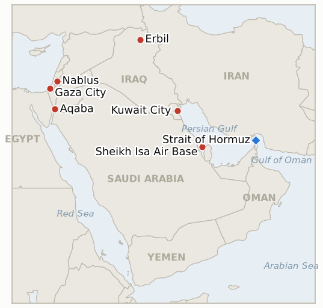

# Middle East Daily Briefing

**September 3, 2026**

- **Reporting window:** ~24 hours, September 2, 09:00 to September 3, 09:00 KST
- **Overall assessment:** The picture from yesterday's brief sharpened and partly reversed on two points. First, an attribution: Saudi Arabia's state carrier Bahri confirmed that the Aug 31 attack on its tanker Sidr, previously reported as unattributed with all crew safe, killed two Filipino seafarers, and Riyadh explicitly pinned the strike on Iran, the first state attribution of the Hormuz tanker attacks that triggered this week's US strike wave. Second, a denial: US and Jordanian officials directly refuted the IRGC's claimed "large number" of casualties at Camp Titin, saying no American personnel were killed or wounded and no significant damage occurred, even as Iran's overnight "decisive operation" turned out to be wider than yesterday's brief could confirm, missiles and drones also reportedly hitting Bahrain's Sheikh Isa Air Base, US positions near Erbil, Iraq, and prompting alerts in Kuwait, on top of the Jordan strikes (13 missiles, 10 intercepted, 3 landing in open ground). Iran's Foreign Minister Abbas Araghchi's deputy, Esmail Baghaei, called the revised, higher Kuhestak wedding strike toll, now at least four dead including a child and roughly 68 wounded, a "war crime," while President Trump told reporters in the Oval Office "I don't think it will be very much longer" and that Israel "should not worry" about the exchange, a markedly calmer register than his "much harder" threat from the day before. Oil held its gains (Brent near $95, WTI settling $90.63), KOSPI fell nearly 4% on the combined oil and bond-yield shock even as the won held steady, and in Gaza, Defense Minister Katz said Trump had only "frozen," not cancelled, the mass Palestinian emigration plan, while the West Bank saw a joint settler-IDF raid on al-Mughayyir kill two Palestinian men in their teens or twenties, a reminder that yesterday's rare Bizzariya arrests have not altered the broader pattern. Separately, Seoul's government moved to distance itself from the Sinokor-linked Senegal Prosperity, the tanker hit alongside the Sidr, stressing it is Liberian-flagged with no Korean crew, even as Iran's blacklist of 45 Hormuz-transiting vessels keeps five Janggeum Shipping-linked ships under threat of fines or seizure.

**Corrections and updates:** The September 2 brief (§1.1) reported "all crew were reported safe" on both the Sidr and Senegal Prosperity following the Aug 31 Hormuz strikes, based on initial maritime-security reporting. Saudi Arabia's Bahri and the Saudi foreign ministry now confirm two Filipino seafarers were killed aboard the Sidr in a "security incident" at 23:40 local time that night, and Riyadh has explicitly attributed the attack to Iran, superseding both the "no casualties" report and the prior unattributed status of the strike. The September 2 brief also reported the Kuhestak wedding strike killed "two" people; Iranian officials and multiple outlets now put the toll at four to five dead (including a child) and roughly 68 wounded, an upward revision reflected here rather than in that day's front matter.

---

## 1. What Happened

<figure style="float:right; width:46%; margin:2pt 0 8pt 14pt;">

<figcaption style="font-size:8pt; color:#666; text-align:center; margin-top:3pt; font-style:italic;">Major places of discussion</figcaption>
</figure>

### 1.1 Saudi Arabia Attributes the Sidr Tanker Attack to Iran and Confirms Two Sailors Killed

Bahri, Saudi Arabia's state shipping company, confirmed that its supertanker Sidr was struck in a "security incident" at 23:40 local time on Aug 31 while transiting the Strait of Hormuz, killing two Filipino seafarers, and Saudi Arabia's foreign ministry attributed the attack to Iran while "stressing the necessity of halting escalations and respecting international maritime safety" ([HuffPost/Reuters](https://www.huffpost.com/entry/iran-attack-tanker-hormuz-kills-sailors_n_6a985489e4b0f5af0411b6dd/amp)). This corrects the Sept 2 brief's "all crew safe" report and is the first direct state attribution of the Aug 31 attacks, which also struck the Sinokor-linked Senegal Prosperity, to Iran; Bahri noted the Sidr is the fourth of its vessels hit since July, after the Wedyan in the strait and the Masa and Amzan in the Red Sea. Overnight, Iran's "decisive operation," previously reported as striking only Camp Titin in Jordan, was confirmed to have widened further: Iranian state media claimed a large-scale drone attack on Bahrain's Sheikh Isa Air Base, a combined missile-and-drone attack on US positions near Erbil, Iraq, and Kuwait reported hostile drones and missiles without commenting further, while Jordan's military said 13 missiles entered its airspace targeting Camp Titin and Prince Hassan Air Base, intercepting 10 with three landing in remote areas ([CNBC](https://www.cnbc.com/2026/09/02/us-iran-war-trump-hormuz-irgc-jordan-bahrain.html); [Al Jazeera](https://www.aljazeera.com/news/2026/9/1/us-military-says-launching-new-attacks-on-iran)). **Confidence: High** on the Sidr attribution and casualties (Tier 1, Bahri and Saudi MoFA on-record statements) and on the widened target list (Tier 1-2, CENTCOM-adjacent and multi-outlet reporting); Medium on Iran's own damage claims at each site, none independently confirmed.

### 1.2 US and Jordan Deny Camp Titin Casualties as Trump Predicts the War Will Wind Down Soon

Two US officials told Reuters and Al Jazeera there were no American casualties and no significant damage from the Iranian strikes on Camp Titin, directly contradicting the IRGC's claim of "a large number" of US personnel killed and helicopters destroyed; Jordan separately confirmed no Jordanian casualties from the intercepted and stray missiles ([JPost](https://www.jpost.com/middle-east/article-907279)). This falsifies IND-20260902-1 far ahead of its Sept 9 deadline. President Trump, addressing reporters in the Oval Office, struck a notably calmer tone than the prior day's "much harder" threat: "I don't think it will be very much longer. I don't know how much more they can take," and told Israel it "should not worry" about the latest escalation, predicting it would "wind down soon"; separately, asked about forcing Iran back to the table, he said "I couldn't care less if they sign a worthless, to them, agreement," describing the US as holding "almost total control of the Hormuz Strait, and their economy totally collapsing" ([Times of Israel liveblog](https://www.timesofisrael.com/liveblog-september-2-2026/); [Forbes](https://www.forbes.com/sites/siladityaray/2026/09/02/trump-says-he-couldnt-care-less-about-forcing-iran-to-accept-a-deal/)). Iran's revised Kuhestak wedding-strike toll rose to at least four dead, including four-year-old Amir Ali Karimi, and roughly 68 wounded; Foreign Ministry spokesman Esmail Baghaei called it a "war crime" and vowed firm retaliation, while CENTCOM said it was aware of civilian casualty reports and maintains it does not target civilians ([Al Jazeera](https://www.aljazeera.com/news/2026/9/2/what-do-we-know-about-the-fatal-us-bombing-of-a-wedding-in-irans-sirik)). **Confidence: High** on the US/Jordanian denial and Trump's quotes (Tier 1-2, on-record, multi-outlet); Medium on the revised wedding toll, which has moved between two and eleven across outlets in 24 hours.

### 1.3 Oil Holds Its Surge as KOSPI Drops Nearly 4 Percent and the Won Holds Steady

Brent traded near $95 a barrel through the session (reports of the settle ranged $94.19 to $95.40) after Tuesday's roughly 4% jump, while WTI's October contract settled at $90.63, +0.45%, extending gains as the widened Jordan/Bahrain/Iraq/Kuwait exchange kept supply-disruption risk elevated ([Yahoo Finance](https://finance.yahoo.com/markets/stocks/articles/stock-market-today-sept-2-134032621.html); [Reuters via Business Recorder](https://www.brecorder.com/news/40437536/oil-up-nearly-1-as-us-and-iran-trade-fresh-strikes)). KOSPI fell 3.99% to 6,562.72, its steepest drop in weeks, as the oil shock compounded a separate run-up in bond yields (the 10-year US Treasury yield touched 4.814%, a level since late 2023) even as corporate buybacks partly cushioned the decline; the won, by contrast, held nearly flat, easing to 1,368.7 per dollar, 1.7 won stronger than Tuesday's close, a divergence from the equity selloff ([Seoul Economic Daily](https://en.sedaily.com/finance/2026/09/02/kospi-closes-down-399-percent-at-656272); [Asia Business Daily](https://www.asiae.co.kr/en/article/2026090215514382923)). No verified Hormuz daily transit count was published in the window. **Confidence: High** on KOSPI, the won and WTI's settle (Tier 1-2, official exchange data via multiple financial outlets); Medium on the exact Brent settle given conflicting wire figures.

### 1.4 Gaza's Katz Says the Emigration Plan Is Only Frozen as a Joint Raid Kills Two in al Mughayyir

Defense Minister Israel Katz told a Yedioth Ahronoth conference that Trump had only "frozen," not scrapped, the mass Palestinian emigration plan while Washington searches for host countries now that Egypt has ruled itself out, saying Israel remains "organised and prepared to get them out, by sea, by air, by every way possible" and citing an unspecified survey claiming 80% of Gazans want to leave ([Times of Israel](https://www.timesofisrael.com/katz-israel-will-facilitate-emigration-from-gaza-by-any-means-as-soon-as-trump-allows); [Arab News](https://www.arabnews.com/middle-east/israel-ready-to-remove-gaza-population-if-us-gives-approval-minister-3000230)). Netanyahu separately visited an IDF post inside Gaza and said Israel would not withdraw from territory it currently holds. In the West Bank, a joint settler-IDF raid entered al-Mughayyir near Ramallah; Palestinian sources reported two men in their late teens or twenties killed by gunfire, with the circumstances still unclear pending IDF comment as of window close, following a similar joint raid in the same village that wounded four on Aug 30 ([Times of Israel liveblog](https://www.timesofisrael.com/liveblog-september-2-2026/)). Separately, Israeli forces fired tear gas into a West Bank mosque near Beita and settlers attempted to torch a second mosque, hours after Monday's rare eight arrests over the Bizzariya arson. **Confidence: Medium** on the al-Mughayyir deaths (Tier 1-2, Times of Israel liveblog citing Palestinian sources, IDF comment pending); High on Katz's and Netanyahu's on-record statements.

### 1.5 Seoul Distances Itself From the Sinokor Linked Tanker as Iran's Blacklist Shadows Janggeum Shipping

South Korea's Ministry of Oceans and Fisheries said the Senegal Prosperity, the Liberian-flagged VLCC hit alongside the Sidr and chartered out by Janggeum Shipping (Sinokor's Korean corporate name), "is not a government-managed vessel and has no Korean crew aboard," while the Ministry of Foreign Affairs echoed that framing in response to press inquiries ([Asia Business Daily](https://view.asiae.co.kr/article/2026090209041239057); [Herald Corp](https://biz.heraldcorp.com/article/10859760)). This constitutes Seoul's first public response to the attack, confirming IND-20260902-3, though its substance minimizes rather than affirms Korean exposure. Separately, Korean financial press reported Janggeum Shipping has aggressively expanded into Hormuz crude transport this year, buying or chartering VLCCs to control an estimated 120 vessels as of February, even as Iran's Persian Gulf Strait Authority's Aug 31 blacklist of 45 vessels for alleged transit violations includes five Janggeum-linked ships, though not the Senegal Prosperity itself, under threat of fines, detention or cargo seizure ([Khan](https://www.khan.co.kr/en/article/202609021116027/); [Seatrade Maritime](https://www.seatrade-maritime.com/security/iran-threatens-45-blacklisted-ships-with-seizure-and-fines)). **Confidence: Medium** on the government statements and Janggeum's blacklist exposure (Tier 2-3, Korean trade and general press, consistent multi-outlet reporting); the fleet-size figure is Low confidence, sourced to a single outlet.

---

## 2. Deep Dive: Incentives and Motives

### 2.1 Why would Saudi Arabia now attribute the Sidr attack directly to Iran after a day of silence on responsibility?

Because the death of two crew members converts an ambiguous "unidentified projectile" incident, which Riyadh could absorb quietly as it has with prior Bahri vessel attacks, into a fatal strike on a state-owned asset that domestic and international audiences will expect a named culprit for; attributing it to Iran while simultaneously calling for de-escalation lets Saudi Arabia register the fact for the diplomatic and insurance record without committing to a retaliatory posture of its own, consistent with the kingdom's established pattern of documenting rather than answering attacks on its shipping.

### 2.2 Why would US and Jordanian officials move so quickly and explicitly to deny the Camp Titin casualty claim, rather than staying silent as after earlier unconfirmed Iranian strike claims?

Because an unrebutted claim of "a large number" of US dead sitting for even a day risks shaping domestic political pressure for immediate, large-scale retaliation that neither Washington nor Amman may want to commit to on Iran's timeline; a fast, on-record denial removes the practical urgency to respond to a specific casualty event while leaving Washington's own strike calendar, evident in Trump's calmer "wind down soon" framing the same day, under its own control rather than reactive to an unverified Iranian narrative.

### 2.3 Why would Trump shift from "much harder" and "biggest attack... waiting in the wings" to "I don't think it will be very much longer" within roughly 24 hours?

Because the two statements serve different audiences and purposes rather than reflecting a change of plan: the escalatory threat was aimed at deterring further Iranian strikes in the immediate aftermath of Camp Titin, while the calmer framing, paired with "almost total control of the Hormuz Strait, and their economy totally collapsing," is a public accounting of the campaign as already succeeding, which supports his simultaneous claim that he "couldn't care less" about forcing a deal; a war that is framed as winning does not need a negotiated exit; it needs an opponent to concede unilaterally, and both messages point Iran toward that same expectation.

### 2.4 Why would Defense Minister Katz publicly reaffirm the Gaza emigration plan as merely frozen rather than let Trump's walkback stand unaddressed?

Because a plan Israel's own defense establishment says it is "organised and prepared" to execute retains coalition value regardless of its near-term feasibility, reassuring the settler and nationalist wings of Netanyahu's bloc, currently deadlocked with the opposition in the Channel 13 poll, that the idea remains live rather than abandoned under Egyptian and international pressure; framing the obstacle as a lack of host countries rather than a policy reversal keeps the option nominally on the table without requiring Israel to identify who would actually take the population.

### 2.5 Why would a joint settler-IDF raid on al-Mughayyir turn fatal just as Monday's Bizzariya arrests suggested a possible enforcement shift?

Because the Bizzariya arrests targeted arson, a category of violence against property and religious sites that draws distinct diplomatic exposure, while a joint settler-IDF operation against a village IDF and settlers have targeted repeatedly this year, including the April killing of two Palestinians and an August 30 raid wounding four, sits inside an entirely different, already-tolerated pattern of enforcement-adjacent raids; the same week can therefore produce both a rare accountability gesture and a fatal repeat incident without the two being in tension, since they address different categories of violence that this ledger's own tracking (IND-20260825-2) has shown draw different institutional responses.

---

## 3. Policy Implications for South Korea

### 3.1 Exposure snapshot

| Item | Current reading | Source |
| --- | --- | --- |
| Sinokor linked tanker, revised status | Senegal Prosperity confirmed Liberian flagged, no Korean crew, not government managed, per MOF/MOFA; owner Janggeum Shipping (Sinokor) chartered it out | Asia Business Daily, Herald Corp |
| Janggeum Shipping Hormuz exposure | Estimated 120 vessels controlled as of Feb 2026 after aggressive VLCC expansion; 5 Janggeum linked ships among Iran's 45 vessel blacklist (Senegal Prosperity not among them) | Khan, Seatrade Maritime |
| Middle East share of crude imports | 48.5% (May to July 2026 rolling), down from 69.1% a year earlier; August single month reading 61.1% | KNOC via Asia Business Daily; `korea-exposure.md` |
| Brent / WTI | Brent traded near $95 (wire reports 94.19 to 95.40); WTI settled +0.45% to $90.63 | Yahoo Finance; Reuters via Business Recorder |
| KOSPI / USD-KRW | KOSPI −3.99% to 6,562.72 on combined oil and bond yield shock; won held nearly flat, easing to 1,368.7 (won 1.7 stronger) | Seoul Economic Daily, Asia Business Daily |
| Strategic reserve coverage | ~26 days of actual consumption (estimate); swap on immediate standby, untested at scale | CSIS; MOTIE July 27 |
| Refiner Saudi ownership exposure | S-Oil (Saudi Aramco majority ~63%), HD Hyundai Oilbank (Aramco ~17%) | Public filings; `korea-exposure.md` |
| Hormuz transits | No verified daily count published in this window | n/a |

### 3.2 Implications by development

**Saudi Arabia's attribution of the Sidr attack to Iran, and the confirmed deaths of two crew, upgrades the Aug 31 tanker attacks from an ambiguous incident to a state-attributed fatal strike on Gulf shipping, a materially worse baseline than yesterday's "unidentified, no casualties" read for any Korean-linked vessel operating the same corridor.** New IND-20260903-3 tracks whether Janggeum Shipping, the operator whose ships now sit both directly attacked and partly blacklisted, changes its Hormuz chartering pace in response.

**MOF and MOFA's response to the Senegal Prosperity attack, framed entirely around the vessel's non-Korean flag and crew rather than around Janggeum Shipping's Korean ownership and the wider blacklist exposure of its fleet, confirms IND-20260902-3 but suggests Seoul's threshold for treating a Hormuz incident as consequential is narrower than the corporate exposure itself.** No new indicator opens on this specific framing; it is tracked through IND-20260903-3.

**Trump's calmer "wind down soon" framing, if it holds, would be the first genuine de-escalatory signal in a ledger that has recorded four other de-escalatory claims falsified in the past three weeks alone (IND-20260819-1, IND-20260826-1, IND-20260827-1, IND-20260827-2); Korean refiners and KNOC should treat it as unverified rhetoric consistent with that pattern until it survives its own test window.** New IND-20260903-1 tracks this specifically.

**KOSPI's near 4% drop shows Korean equities remain highly reactive to the combined oil price and global bond yield channel even when the won itself holds steady, a divergence worth noting for Korean policymakers weighing whether currency stability alone is a sufficient buffer against Middle East driven volatility.** No new indicator opens on the market move; it is tracked through the series chart above.

**Gaza's Katz statement and the West Bank's al Mughayyir deaths remain adjacent to Korea's direct Gulf shipping exposure but sustain the pattern of parallel, unresolved conflict tracks that this ledger's Watch List carries forward.** No new indicators open on either development.

**Testable indicators:**

- **IND-20260903-1** — A verified, sustained de-escalation, no further US strikes on Iran and no further Iranian strikes on US or allied positions, for roughly two weeks from Trump's September 2 "wind down soon" prediction, by ~2026-09-16, confirms the statement reflected a real assessment; a further US or Iranian strike within that window falsifies it as rhetoric inconsistent with the campaign's actual trajectory.
- **IND-20260903-2** — A further verified Iranian strike on US, Jordanian, Bahraini, Iraqi or Kuwaiti positions beyond the September 1 to 2 wave, by ~2026-09-09, confirms the "decisive operation" is an open-ended campaign rather than a single bounded round; no further Iranian strike through the same date falsifies it as contained, consistent with the pattern after Larak Island and the first Camp Titin strike.
- **IND-20260903-3** — A verified reduction in Janggeum Shipping's Hormuz-transiting VLCC chartering activity, or a Korean government advisory specifically addressing the company's Hormuz exposure, by ~2026-09-17, confirms the direct attack and blacklist risk changed Korean-linked shipping behavior; continued or expanded Hormuz activity with no such advisory through the same date falsifies it, showing the "high risk, high return" strategy continues unchanged.

---

## 4. Watch List

- **Whether Trump's "wind down soon" prediction holds for roughly two weeks without a further US or Iranian strike** (IND-20260903-1, deadline September 16).
- **Whether Iran's "decisive operation" produces any further verified strike beyond the September 1 to 2 wave** (IND-20260903-2, deadline September 9).
- **Whether Janggeum Shipping changes its Hormuz chartering pace, or Seoul issues an advisory specifically on the company's exposure** (IND-20260903-3, deadline September 17).
- **Whether Trump's threatened "biggest attack of them all" ever materializes as a further US strike on Iran** (IND-20260902-2, deadline September 9).
- **Whether the Mecca Joint Defence Agreement produces any concrete implementing step** (IND-20260809-2, deadline September 8).
- **Whether the Turkey Israel friction over the Abu al-Duhur strike escalates or is absorbed** (IND-20260823-1, deadline September 6).
- **Whether the IDF's West Bank "brink of escalation" warning is followed by an actual step change in the violence pattern, now with al Mughayyir's fatal raid as a further data point** (IND-20260823-2, deadline September 6).
- **Whether Barrack's back-to-back controversies produce any actual US policy or personnel consequence** (IND-20260824-1, deadline September 6).
- **Whether the Van Hollen led privileged resolution on West Bank American deaths forces committee action or a State Department response once introduced** (IND-20260828-2, deadline September 6).
- **Whether the confirmed renewed Hezbollah Israel exchange becomes a self sustaining escalatory cycle** (IND-20260829-1, deadline September 8).
- **Whether the Jannatah attack on Israeli activists and an AFP journalist draws any arrest** (IND-20260826-2, deadline September 8).
- **Whether the Masafer Yatta and Bizzariya arrests mark a durable settler enforcement shift or stay isolated cases, now tested again by al Mughayyir's fatal outcome** (IND-20260825-2, deadline September 8).
- **Whether Netanyahu's Qusra condemnation produces genuine enforcement or stays rhetorical** (IND-20260830-1, deadline September 9).
- **Whether the internal military warning to Hegseth produces a disclosed force posture change or the campaign continues unchanged** (IND-20260831-2, deadline September 14).
- **Whether Kaine's privileged war powers resolution on Oman passes, fails, or never reaches a floor vote when the Senate returns in September** (IND-20260819-3, deadline September 25).
- **Whether Yemen's fighting produces a further dramatic escalation or settles into an attritional pattern.**
- **Whether Saudi Arabia's new direct attribution of the Sidr attack to Iran draws any further Saudi diplomatic or military response beyond its public statement.**
- **Whether the Somali piracy surge draws a coordinated naval or insurance market response** (IND-20260822-2, deadline September 5).
- **Whether the $206 million US ISF funding for Gaza converts into visible equipment delivery or stand up activity** (IND-20260820-3, deadline September 19).
- **Whether Katz's reaffirmed Gaza emigration plan ever identifies a host country, or continues to stall on that single unresolved variable.**

---

## 5. Source Quality Summary

| Claim | Sources | Confidence |
| --- | --- | --- |
| Saudi attribution of the Sidr attack to Iran and two Filipino sailors killed | HuffPost/Reuters, Bahri and Saudi MoFA statements (Tier 1, official statements) | High |
| Widened Iranian strikes on Bahrain, Iraq and Kuwait | CNBC, Al Jazeera, JPost (Tier 1-2, multi-outlet, Jordanian military confirmation on the Jordan leg) | High |
| US and Jordanian denial of Camp Titin casualties | Reuters via JPost and Al Jazeera, two US officials on record (Tier 1-2) | High |
| Trump's "wind down soon" and "couldn't care less" statements | Times of Israel liveblog, Forbes (Tier 1-2, on-record, multi-outlet) | High |
| Revised Kuhestak wedding strike toll and Iranian "war crime" characterization | Al Jazeera, Outlook India, Hormozgan governor's office (Tier 2-3, local officials, toll inconsistent across outlets) | Medium |
| Oil settlement figures for September 2 | Yahoo Finance, Reuters via Business Recorder (Tier 1-2, wire figures for Brent varied by outlet) | Medium to High |
| KOSPI and won closing levels | Seoul Economic Daily, Asia Business Daily (Tier 1-2, official exchange data) | High |
| Katz's Gaza emigration plan statement | Times of Israel, Arab News (Tier 1-2, on-record conference remarks) | High |
| al Mughayyir raid deaths | Times of Israel liveblog citing Palestinian sources, IDF comment pending (Tier 2, single-sourced pending official confirmation) | Medium |
| Korean government statements on the Senegal Prosperity | Asia Business Daily, Herald Corp, Money Today (Tier 2-3, Korean domestic press, multi-outlet consistent) | Medium |
| Janggeum Shipping fleet size and blacklist exposure | Khan, Seatrade Maritime, SAFETY4SEA (Tier 2-3, single-outlet fleet figure, multi-outlet blacklist reporting) | Medium |
