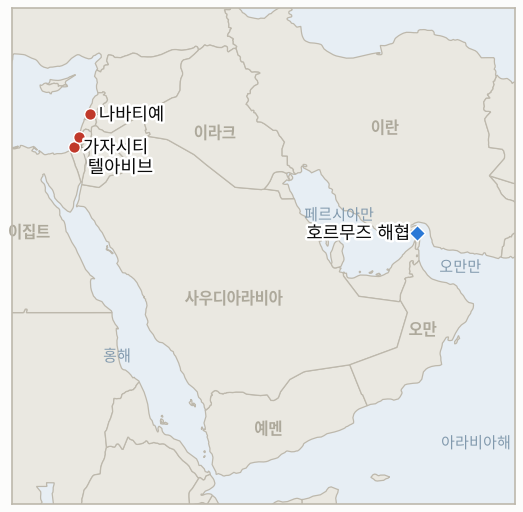

# 중동 일일 브리핑

**2026년 9월 4일**

- **보도 대상 기간:** 약 24시간, 9월 3일 09:00 ~ 9월 4일 09:00 (한국시간)
- **종합 평가:** 워싱턴과 이스라엘 모두 오늘 이번 분쟁을 각자의 방식으로 규정하려 했지만, 그 방향은 서로 엇갈렸다. 네타냐후 총리는 이스라엘군 참모총장 포럼에 참석해 로시 하샤나 건배사를 하며 이란 정권 타도가 이제 이스라엘의 "중심 임무"이며 목표가 "손에 닿는 거리"에 있다고 처음으로 명시적으로 밝혔는데, 이는 그동안 전장의 수사에 그쳤던 것을 공식 전쟁 목표로 격상시킨 것이다. 몇 시간 앞서 워싱턴에서는 밴스 부통령이 사뭇 다른 어조를 보였다. 그는 테헤란과의 협상 재개에 상선 공격 중단이라는 확고한 전제조건을 내걸고, 이란의 호르무즈 해협 통제력이 이제 "사실상 사라졌으며" "소멸해가는 자산"이라고 밝혔지만, 동시에 "지금은 실제 교전이 없다"며 이번 전쟁을 "전쟁이라 부르지 않겠다"고 말해, 불과 하루 전 이란의 미사일과 드론이 4개국에 도달했던 상황을 감안하면 눈에 띄는 축소 발언이었다. 시장은 이 차분한 어조를 액면 그대로 받아들였다. 브렌트유는 0.4% 하락한 95.26달러, WTI는 0.1% 내린 90.84달러로 마감해 이번 주 급등분의 일부를 반납했고, 코스피는 장중 약 3% 급락했다가 0.26% 상승한 6,579.48로 마감했으며 원화는 9.4원 절상된 1,359.3원을 기록했다. 가자지구에서는 벤그비르 국가안보장관이 팔레스타인 186만 명을 이주시키는 비용까지 산정된 7개년 "디스인게이지먼트 710" 계획을 발표했는데, 이는 어제 카츠 국방장관이 밝힌 "동결이지 백지화 아님"이라는 입장을 10월 27일 선거를 앞두고 더 구체적으로 밀어붙인 것이다. 한편 이스라엘군은 남부 레바논의 20년 된 알리 타헤르 능선 지하 시설에서 헤즈볼라 소탕을 완료했다고 발표했으며, 가자지구에서는 정전에도 불구하고 이스라엘군 사격으로 팔레스타인인 3명이 추가로 숨져 2025년 10월 정전 이후 이 원장이 추적해 온 사망자 수가 1,334명을 넘어섰다.

---

## 1. 무슨 일이 있었나

<figure style="float:right; width:46%; margin:2pt 0 8pt 14pt;">

<figcaption style="font-size:8pt; color:#666; text-align:center; margin-top:3pt; font-style:italic;">주요 논의 지점</figcaption>
</figure>

### 1.1 네타냐후, 이란 정권교체를 이스라엘의 중심 임무로 선언

네타냐후 총리는 텔아비브에서 열린 이스라엘군 참모총장 포럼 로시 하샤나 건배사에서 이란 정권 타도가 이제 이스라엘의 "중심 임무"라고 밝히며 "정권은 지금 흔들리고 있다. 그 어느 때보다 약하다. 생존을 위해 발버둥치고 있다"고 말했고, "이 위협을 완전히 제거할 능력, 즉 이 정권을 타도할 능력에 자신이 있다"고 덧붙였다([Times of Israel liveblog](https://www.timesofisrael.com/liveblog-september-03-2026/); [Israel National News](https://www.israelnationalnews.com/flashes/692920)). 이는 이스라엘 총리 스스로가 정권교체를 이스라엘군이나 미국 측의 배경 평가 수준이 아니라 공식 전쟁 목표로 명문화한 첫 사례로, 워싱턴과 걸프 국가, 이스라엘 정보 당국이 모두 이란 정권이 극심한 압박을 받고 있다고 평가하고 있다는 이번 주 보도를 뒤따른 것이다. **신뢰도: 높음** (발언과 표현, 2~3등급, 다수 이스라엘 매체, 공식 발언 근거); 이것이 수사적 입장 표명이 아니라 실제 작전상의 전환을 의미하는지는 이스라엘 자체 선거 국면을 앞둔 정치적 포지셔닝일 가능성도 있어 **중간**.

### 1.2 밴스, 대이란 협상 조건 제시하며 호르무즈 통제력을 소멸해가는 자산이라 규정, 전쟁이라 부르지 않겠다고 발언

밴스 부통령은 기자들에게 이란이 "상선에 대한 발포를 중단하지 않는 한" 미국은 협상을 재개하지 않을 것이라며 "그들은 멈춰야 한다, 그게 전부다"라고 말했고, 공격에도 불구하고 수요일 하루 동안 약 1,500만 배럴의 원유가 호르무즈 해협을 통과했다면서 이란의 "호르무즈 해협 통제력은 사실상 사라졌으며 소멸해가는 자산"이고 테헤란은 "능력을 나날이 상실하고 있다"고 주장했다([Fox News liveblog](https://www.foxnews.com/live-news/us-iran-war-strikes-strait-of-hormuz-09-03-26); [Investing.com/Reuters](https://www.investing.com/news/commodities-news/vance-says-us-not-talking-to-iran-unless-they-stop-shooting-at-ships-4888397)). 별도로 밴스는 7개월째 이어진 이번 분쟁에 대해 "전쟁이라고 부르지는 않겠다. 지금은 실제 교전이 없다"며 "본격적인 전투 작전은 약 6주간 지속됐다"고 말했는데, 이는 불과 하루 전 이란의 미사일과 드론이 요르단, 바레인, 이라크, 쿠웨이트를 타격하거나 경보를 촉발한 직후 나온 발언이었다. 한편 9월 1~2일 타격 파상 공세에 대한 새로운 보도는 미국이 이란 정부 소유 유조선 2척을 드론 발사 미사일로 기관실에 직접 명중시켰다는 사실을 확인했는데, 이는 상선 공격을 억지하기 위해 새로 선언된 "탱커 대 탱커" 정책의 일환으로, IRGC 관련 목표물 약 100곳에 대한 타격과 함께 이뤄졌다([Axios](https://www.axios.com/2026/09/02/iran-tankers-hormuz-attacks-oil); [TWZ](https://www.twz.com/news-features/iranian-oil-tankers-in-the-cross-hairs-of-new-u-s-campaign)). **신뢰도: 높음** (밴스 발언, 1~2등급, 다수 매체 공식 브리핑 근거); 1,500만 배럴 통항량 수치의 독립적 검증 여부와 "탱커 대 탱커" 정책이 지속적 원칙인지 일회성 신호인지는 **중간**.

### 1.3 유가 진정, 코스피 반등…트럼프 "작전 장기화 않을 것" 신호

브렌트유는 0.4% 하락한 95.26달러, WTI는 0.1% 내린 90.84달러로 마감해 3거래일 연속 상승세가 멈췄다. 투자자들은 트럼프 대통령이 재개된 대이란 타격이 장기화되지 않을 것이라는 신호를 보낸 점과, 지난주 미국 원유 재고가 450만 배럴 감소해 7월 말 이후 처음으로 줄었다는 공식 자료를 함께 저울질했다([AP via Local10/WSLS](https://www.local10.com/business/2026/09/03/oil-prices-edge-lower-while-asian-shares-rise-tracking-wall-street-gains/)). 코스피는 개장 후 10분 만에 약 3% 급락했다가 기업 자사주 매입이 유가와 글로벌 채권금리발 압력을 상쇄하면서 0.26% 오른 6,579.48로 마감했고, 원화는 9.4원 절상된 1,359.3원을 기록했다([Seoul Economic Daily](https://en.sedaily.com/finance/2026/09/03/kospi-closes-026-percent-higher-at-657948); [Money Today](https://www.mt.co.kr/economy/2026/09/03/2026090315353672880)). 이번 기간 독립적으로 검증된 호르무즈 일일 통항량 수치는 발표되지 않았으며, 밴스의 1,500만 배럴 통항 주장(§1.2)만 유일하게 존재하는 수치로, Kpler나 Windward의 보도로 뒷받침되지 않는다. **신뢰도: 높음** (브렌트유, WTI, 코스피, 원화, 1~2등급 공식 거래소·통신사 데이터); 트럼프의 "장기화되지 않을 것"이라는 신호를 시장이 어떻게 해석했는지 자체는, 이 원장이 유사한 발언들이 검증 기간을 통과하지 못한 전례를 기록해 온 만큼 **중간**.

### 1.4 벤그비르, 팔레스타인 186만 명 가자 이주 7개년 계획 발표

이타마르 벤그비르 국가안보장관은 가자지구 인구의 "자발적 이주"를 3단계로 달성한다는 "디스인게이지먼트 710" 계획을 공개했다. 1년 내 25만 명, 3년 내 111만 명, 7년 내 186만 명을 이주시킨다는 목표로, 전담 정부 부처 신설과 초기 100억 셰켈 규모의 이스라엘 정부 투자, 국제사회 참여를 전제로 최대 500억 셰켈에 달하는 매칭 지원 체계를 갖췄으며 튀르키예, 에티오피아, 콩고 등이 이주 대상국으로 검토되고 있다([Times of Israel](https://www.timesofisrael.com/liveblog_entry/ben-gvir-unveils-voluntary-emigration-plan-aimed-at-removing-1-86-million-palestinians-from-gaza/); [Jerusalem Post](https://www.jpost.com/israel-election-2026/article-907523)). 10월 27일 선거를 앞두고 공개된 이 계획에 대해 벤그비르의 오츠마 예후디트는 차기 연립정부 참여 조건으로 삼겠다고 밝혔는데, 이는 트럼프가 유사한 대규모 이주 구상을 "백지화가 아니라 동결"했을 뿐이라는 카츠 국방장관의 9월 2일 발언을 더 구체적이고 비용까지 산정된 형태로 밀어붙인 것이다([Middle East Eye](https://www.middleeasteye.net/news/ben-gvir-set-unveil-20-billion-plan-ethnically-cleanse-gaza-within-seven-years)). **신뢰도: 높음** (계획 내용과 벤그비르의 공식 발표, 2~3등급, 다수 매체, 공식 발표 근거); 실제로 이름이 거론된 어느 이주 대상국이 무언가에 합의했는지는 오늘 보도만으로는 확인되지 않아 **낮음**.

### 1.5 이스라엘군, 알리 타헤르 능선 헤즈볼라 시설 소탕 완료…가자지구 정전 사망자는 계속 발생

이스라엘군 제36사단은 남부 레바논 알리 타헤르 능선 지하의 20년 된 헤즈볼라 시설에서 조직원 소탕을 완료했다고 발표하며, 이란의 자금 지원으로 건설된 지휘소, 무기고, 발전실, 생활공간으로 이뤄진 시설망이라고 설명했고 이제 시설 폭파를 준비 중이라고 밝혔다. 리타니강 북쪽, 나바티예 인근에 위치한 이 능선은 레바논 남부와 해안, 서부 베카밸리를 잇는 요로를 통제하는 전략적 요충지다([Times of Israel liveblog](https://www.timesofisrael.com/liveblog-september-03-2026/); [Israel National News](https://www.israelnationalnews.com/news/432674)). 가자지구에서는 정전에도 불구하고 이스라엘군이 팔레스타인인 3명을 추가로 사살했는데, 1명은 가자시티 중심가에서 민간인 무리를 겨냥한 드론 공격으로, 2명은 베이트라히야에서 총격으로 숨졌다. 이스라엘군은 베이트라히야 사건에 대해 "옐로우 라인을 넘어 병력에 접근해 즉각적 위협을 가한 무장 인물을 식별했다"고 밝혔을 뿐, 가자시티 드론 공격에 대해서는 언급하지 않았다([Middle East Monitor](https://www.middleeastmonitor.com/20260903-israeli-army-kills-3-palestinians-wounds-others-in-gaza-strip-despite-ceasefire/)). 유엔 인권사무소는 별도로 9월 1일 이전 닷새간 어린이 4명을 포함해 팔레스타인인 24명이 숨졌다고 밝혔다. **신뢰도: 높음** (알리 타헤르 능선 소탕, 2~3등급, 이스라엘군 발표, 다수 매체); 가자시티 드론 공격 경위는 팔레스타인 측 의료 소식통 근거에 이스라엘군의 부분적 확인만 있어 **중간**.

---

## 2. 심층 분석: 유인과 동기

### 2.1 네타냐후는 왜 정책 연설이 아니라 로시 하샤나 건배사에서 지금 이란 정권교체를 공식 전쟁 목표로 선언했을까?

정권교체를 이스라엘군이나 언론의 배경 평가로 남겨두지 않고 공식 목표로 명문화하면, 승리의 기준 자체가 바뀌면서 이란과의 향후 정전이나 협상 타결이 충족해야 할 조건도 달라지기 때문이다. 참모총장에 대한 부담 적은 건배사에서 이를 선언하는 방식은 크네세트 연설이나 정식 기자회견과 달리, 네타냐후가 이스라엘을 이를 협상 입장으로 공식 구속시키지 않으면서도 국내외, 특히 미국과 걸프 지역의 반응을 시험할 수 있게 해 주며, 이는 이번 주 워싱턴과 걸프, 이스라엘 채널에서 두루 나온 "이란 정권이 극심한 압박을 받고 있다"는 평가를 스스로 만들어내기보다 활용하는 방식이다.

### 2.2 밴스는 왜 같은 자리에서 협상 조건은 강화하면서 동시에 이번 분쟁을 "전쟁이 아니다"라고 축소했을까?

두 메시지는 서로 모순되기보다 상호 보완적인 목적을 수행하기 때문이다. 상선 공격 중단이라는 확고한 전제조건은 미국의 새로운 개입이나 추가 타격 없이도 이란에 압박을 유지시키는 반면, "실제 교전이 없다"며 7개월째 이어진 분쟁을 "전쟁이 아니다"라고 규정하는 것은 국내 정치적 비용을 낮추고 무기한 작전에 대한 정부 책임 추궁을 차단한다. 같은 주 보도가 이란 내 목표물 약 100곳에 대한 타격과 이란 미사일의 4개국 도달을 전하고 있다는 점을 감안하면, 이러한 수사적 축소는 워싱턴이 새로 공개된 이란 유조선 직접 타격을 포함해 작전상으로는 계속 확전하면서도 국내적으로는 분쟁이 진정되고 있다고 설명할 수 있게 해 준다.

### 2.3 시장은 왜 트럼프의 "장기화되지 않을 것"이라는 신호를 지속적 반전이 아니라 부분적이고 되돌릴 수 있는 조정으로만 받아들였을까?

하루치의 진정, 브렌트유의 0.4% 하락과 장중 3% 급락 후 0.26% 상승 마감으로 반등한 코스피는 8월 31일 유조선 공격과 9월 1~2일 미군 타격 파상 공세 이후 누적된 충격의 극히 일부만을 되돌린 것이기 때문이다. 이 원장은 이미 다른 네 건의 긴장 완화 주장(IND-20260819-1, IND-20260826-1, IND-20260827-1, IND-20260827-2)이 각각의 검증 기간 내에 모두 반증으로 판정된 것을 기록해 왔으며, 이 패턴을 학습한 시장은 "장기화되지 않을 것"이라는 발언을 전반적 위험 프리미엄을 해소할 근거가 아니라 거래 가능한 안도 랠리 정도로만 가격에 반영하는데, 이는 IND-20260903-1이 아직 확정이 아니라 미결 상태로 남아 있는 것과도 일치한다.

### 2.4 벤그비르는 왜 카츠의 더 신중한 "동결이지 백지화 아님"이라는 입장이 아직 신선한 시점에 굳이 최대치의 비용 산정된 이주 계획을 발표했을까?

오츠마 예후디트로서는 10월 27일 선거를 앞두고 네타냐후의 리쿠드나 카츠의 절제된 입장과는 차별화되는 최대치의 입장이 필요하기 때문이다. 전담 부처, 구체적 재원 규모, 후보 이주 대상국까지 명시된 비용 산정형 7개년 계획은 카츠가 단지 보류됐다고 표현한 것을, 벤그비르의 표현으로는 트럼프의 승인만 기다리는 현재 진행형 정부 프로젝트로 전환시킨다. 이는 튀르키예, 에티오피아, 콩고를 비롯한 어느 나라가 실제로 가자 주민을 받아들이는 데 동의하든 말든, 오츠마 예후디트가 이 계획을 연립정부 참여 조건으로 요구할 수 있는 위치를 확보해 준다.

### 2.5 이스라엘군은 왜 가자지구 정전 위반이 계속되는 바로 그날 알리 타헤르 능선 소탕 완료를 공개적으로 알렸을까?

두 사안은 완전히 다른 대상과 규칙을 상대하기 때문이다. 알리 타헤르 능선 작전은 레바논 정전 체제 안에서 20년 된 헤즈볼라 인프라의 한 부분을 마무리 짓는 사안으로, 상징적인 날에 이스라엘군이 홍보할 수 있는 명확하고 입증 가능한 작전상 성과를 제공한다. 반면 같은 24시간 동안 팔레스타인인 3명을 추가로 숨지게 한 가자지구의 "옐로우 라인" 단속은 훨씬 느슨한 교전수칙 아래 이뤄지며, 이 원장이 추적해 온 2025년 10월 정전 이후 누적 사망자 수(1,334명 초과)를 그날그날의 다른 헤드라인과 사실상 무관하게 만들어 왔다.

---

## 3. 한국에 대한 정책적 함의

### 3.1 익스포저 현황

| 항목 | 현재 수치 | 출처 |
| --- | --- | --- |
| 네타냐후의 정권교체 선언 | 이란 정권 타도를 이스라엘의 "중심 임무"로 처음 명시; 아직 공개된 작전상 조치는 없음 | Times of Israel, Israel National News |
| 탱커 대 탱커 정책 | 미국이 9월 1~2일 목표물 약 100곳 타격의 일환으로 이란 정부 소유 유조선 2척을 기관실 직접 명중; 미국이 이란 자체 유조선 선단을 직접 타격한 첫 사례 | Axios, TWZ |
| 호르무즈 원유 통항량(밴스 주장) | 9월 2일 약 1,500만 배럴 통과, 밴스 부통령 발언 근거; Kpler·Windward의 독립적 검증 없음 | Fox News, Investing.com/Reuters |
| 장금상선/세네갈 프로스퍼리티호 | 8월 31일 시드르호와 함께 피격; 약 120척 VLCC 선단 중 5척이 이란 45척 블랙리스트에 포함 | 경향신문, Seatrade Maritime |
| 중동산 원유 수입 비중 | 48.5%(2026년 5~7월 이동평균), 전년 동기 69.1%에서 하락; 8월 단월 수치는 61.1% | KNOC via 아시아경제; `korea-exposure.md` |
| 브렌트유/WTI | 브렌트유 -0.4% 95.26달러; WTI -0.1% 90.84달러, 트럼프의 "장기화되지 않을 것"이라는 신호로 화요일 급등분에서 진정 | AP via Local10/WSLS |
| 코스피/원달러 환율 | 코스피 장중 3% 급락 후 0.26% 상승한 6,579.48 마감; 원화 9.4원 절상된 1,359.3원 | Seoul Economic Daily; Money Today |
| 전략비축유 보유 일수 | 실제 소비 기준 약 26일(추정치); 약 2,100만 배럴 이미 스와프, 즉시 시행 대기 | CSIS; 산업통상자원부 |
| 정유사 사우디 지분 노출 | S-Oil(사우디 아람코 지분 약 63% 과반), HD현대오일뱅크(아람코 지분 약 17%) | 공시자료; `korea-exposure.md` |
| 호르무즈 통항량 | 이번 기간 독립적으로 검증된 일일 통항량 수치 미발표 | 해당 없음 |

### 3.2 사안별 함의

**네타냐후의 새로운 이란 정권교체 전쟁 목표 선언이 만약 수사에 그치지 않고 실제 이스라엘 또는 미국의 작동 정책으로 전환된다면, 한국의 걸프 리스크 계획 지평은 제한적인 타격·보복 순환에서 명확한 종료 시점이 없는 무기한 작전으로 확장되며, 이는 정유사와 한국석유공사가 운임·보험·원유 조달 비용 상승을 얼마나 오래 감내해야 할지에 대한 계산을 근본적으로 바꾼다.** 신규 IND-20260904-1은 이 선언이 실제 공개된 작전상 조치로 이어지는지를 추적한다.

**밴스가 IRGC 군사 인프라뿐 아니라 이란 자체 정부 유조선 선단을 직접 타격하고 있다고 공개하면서 동시에 "전쟁이 아니다"라는 프레임을 유지한 것은, 워싱턴이 대외적으로는 분쟁을 축소하면서도 작전상으로는 계속 확전할 의도임을 보여주며, 한국 정책당국은 이를 이번 작전의 실제 속도가 공개 수사와 일치하지 않는다는 증거로 읽어야 한다.** 신규 IND-20260904-3은 탱커 대 탱커 정책이 첫 두 차례 타격을 넘어 계속되는지를 추적한다.

**유가의 소폭 진정과 코스피의 장중 급락 후 부분 회복은 이번 주 손실의 극히 일부만 되돌린 것으로 다음 헤드라인에 얼마든지 다시 뒤집힐 수 있으며, 이는 검증 기간을 통과하지 못한 이 원장의 기존 긴장 완화 주장 기록과 일치한다. 한국 정유사와 KNOC는 오늘의 안도를 바닥이 아니라 일시적 소강으로 취급해야 한다.** 위 시계열 차트와 IND-20260903-1을 통해 계속 추적한다.

**벤그비르의 비용 산정된 7개년 이주 계획은 이스라엘 10월 선거를 앞둔 가자 정책 변동성 패턴을 이어가지만, 그 자체로는 한국의 시장에 직접적 함의를 주지 않으며 한국의 걸프 해상 익스포저와는 인접해 있을 뿐 직접 교차하지는 않는다.** 신규 IND-20260904-2는 어느 이주 대상국이라도 실질적 협의를 확인하는지를 추적한다.

**이번 기간 한국 관련 신규 해운 사안은 발생하지 않았으며, 세네갈 프로스퍼리티호와 블랙리스트에 오른 선단을 통한 장금상선의 익스포저는 오늘 새로운 계기 없이 IND-20260903-3을 통해 계속 추적된다.**

**검증 가능한 지표:**

- **IND-20260904-1** — 네타냐후의 정권교체 선언이 ~2026년 9월 18일까지 공식 안보내각 결의, 확인된 비밀공작 프로그램, 또는 정권교체를 전쟁 목표로 명시한 미·이스라엘 공동 정책 성명 등 공개된 작전상 조치로 이어지면, 이 선언이 수사가 아니라 실제 전환을 반영했음이 확정된다. 같은 기한까지 수사만 지속되고 그러한 조치가 없으면, 이스라엘의 10월 27일 선거를 앞둔 시기 특유의 정치적 포지셔닝으로 반증 판정된다.
- **IND-20260904-2** — 튀르키예, 에티오피아, 콩고 또는 다른 국가가 벤그비르의 "디스인게이지먼트 710" 계획에 대한 실질적 협의를 확인하거나, 이스라엘 정부가 이를 연립정부 정책으로 공식 채택 또는 거부하는 조치가 ~2026년 9월 18일까지 있으면, 이 계획이 선거용 구상 단계를 넘어섰음이 확정된다. 같은 기한까지 그러한 확인이나 정부 조치가 없으면, 과거 가자 이주 구상들이 동일한 수용국 미확정 변수에 발목 잡혀 온 패턴과 일치하는 근시일 내 비실현으로 반증 판정된다.
- **IND-20260904-3** — 9월 1~2일 타격 이후 "탱커 대 탱커" 정책에 따라 이란 정부 소유 또는 이란 국적 유조선에 대한 추가 검증된 미군 타격이 ~2026년 9월 17일까지 발생하면, 이 정책이 지속적 원칙임이 확정된다. 다른 미·이란 교전이 계속되더라도 같은 기한까지 추가 유조선 타격이 없으면, 지속적 작전이 아니라 일회성 신호였음을 뜻하는 반증으로 판정된다.

---

## 4. 관찰 목록

- **네타냐후의 정권교체 선언이 공개된 작전상 조치로 이어지는지** (IND-20260904-1, 마감 9월 18일).
- **어느 수용국이라도 벤그비르의 디스인게이지먼트 710 계획에 대한 실질적 협의를 확인하는지** (IND-20260904-2, 마감 9월 18일).
- **미국의 탱커 대 탱커 정책이 첫 두 차례 이란 정부 유조선 타격을 넘어 계속되는지** (IND-20260904-3, 마감 9월 17일).
- **트럼프의 "곧 가라앉을 것" 예고가 추가 미국·이란 타격 없이 약 2주간 유지되는지** (IND-20260903-1, 마감 9월 16일).
- **이란의 "결정적 작전"이 9월 1~2일 파상 공격 이후 추가로 검증된 타격을 발생시키는지** (IND-20260903-2, 마감 9월 9일).
- **장금상선이 호르무즈 용선 속도를 바꾸거나, 서울이 해당 기업의 익스포저에 특정한 권고를 발표하는지** (IND-20260903-3, 마감 9월 17일).
- **트럼프가 위협한 "그 모든 것 중 가장 큰 공격"이 실제 추가 대이란 타격으로 실현되는지** (IND-20260902-2, 마감 9월 9일).
- **메카 공동방위협정이 구체적인 이행 조치로 이어지는지** (IND-20260809-2, 마감 9월 8일).
- **이란·오만 호르무즈 해상 항로 협정이 운항 개시일이 명시된 서명 성명으로 이어지는지** (IND-20260816-3, 마감 9월 5일).
- **아부 알두후르 타격을 둘러싼 튀르키예·이스라엘 마찰이 확전되는지 흡수되는지** (IND-20260823-1, 마감 9월 6일).
- **이스라엘군의 서안지구 "확전 임계점" 경고가 실제 폭력 양상의 단계적 변화로 이어지는지** (IND-20260823-2, 마감 9월 6일).
- **배럭 특사의 연이은 논란이 실제 미국의 정책 또는 인사 조치로 이어지는지** (IND-20260824-1, 마감 9월 6일).
- **밴홀런 상원의원 주도의 서안지구 미국인 사망 관련 특권 결의안이 위원회 조치나 국무부 대응을 이끌어내는지** (IND-20260828-2, 마감 9월 6일).
- **확인된 헤즈볼라·이스라엘 재교전이 자기지속적 확전 주기로 이어지는지** (IND-20260829-1, 마감 9월 8일).
- **자나타에서 이스라엘 인권단체 활동가와 AFP 기자를 겨냥한 공격에 체포가 이뤄지는지** (IND-20260826-2, 마감 9월 8일).
- **마사페르 야타와 비자리야의 체포가 지속적인 정착민 단속 전환을 의미하는지 아니면 고립된 사례로 남는지** (IND-20260825-2, 마감 9월 8일).
- **네타냐후의 쿠스라 규탄이 실질적 단속으로 이어지는지 수사에 그치는지** (IND-20260830-1, 마감 9월 9일).
- **헤그세스 국방장관에 대한 군 내부 경고가 공개된 전력 태세 변화로 이어지는지 아니면 작전이 그대로 지속되는지** (IND-20260831-2, 마감 9월 14일).
- **케인 상원의원의 오만 관련 특권 전쟁권한 결의안이 9월 상원 복귀 시 본회의 표결에 부쳐지는지, 부결되는지, 아니면 상정조차 안 되는지** (IND-20260819-3, 마감 9월 25일).
- **소말리아 해적 급증이 공조된 해군 또는 보험시장 대응을 이끌어내는지** (IND-20260822-2, 마감 9월 5일).
- **가자지구 지원 2억 600만 달러 규모 미국 국제안정화군(ISF) 자금이 가시적인 장비 인도나 창설 활동으로 이어지는지** (IND-20260820-3, 마감 9월 19일).
- **예멘 전황이 극적으로 확전되는지 소모전 양상으로 굳어지는지.**
- **사우디아라비아의 시드르호 이란 배후 직접 지목이 공식 성명 외에 추가적인 사우디 외교적 또는 군사적 대응으로 이어지는지.**

---

## 5. 출처 신뢰도 요약

| 주장 | 출처 | 신뢰도 |
| --- | --- | --- |
| 네타냐후의 정권교체 선언과 발언 | Times of Israel liveblog, Israel National News, Israel Hayom (2~3등급, 공식 발언, 다수 매체) | 높음 |
| 밴스의 대이란 협상 조건, 호르무즈 "소멸해가는 자산", 통항량 주장 | Fox News liveblog, Investing.com/Reuters (1~2등급, 공식 브리핑, 다수 매체) | 높음 |
| 밴스의 "전쟁이라 부르지 않겠다" 발언 | Bloomberg via headtopics (1~2등급, 단일 주요 통신사, 공식 발언) | 높음 |
| 미국의 이란 정부 유조선 2척 "탱커 대 탱커" 타격 | Axios, TWZ (2~3등급, 배경 발언 당국자, 다수 매체 교차 확인) | 중간~높음 |
| 9월 3일 유가 종가 수치 | AP via Local10/WSLS (1~2등급, 통신사 기사) | 높음 |
| 코스피와 원달러 환율 종가 | Seoul Economic Daily, Money Today (2~3등급, 한국 금융 매체, 공식 거래소 데이터) | 높음 |
| 벤그비르의 디스인게이지먼트 710 계획 세부 내용 | Times of Israel, Jerusalem Post, Middle East Eye (2~3등급, 공식 발표, 다수 매체) | 높음 |
| 알리 타헤르 능선 소탕 완료 | Times of Israel liveblog, Israel National News, Amit Institute (2~3등급, 이스라엘군 발표, 다수 매체) | 높음 |
| 가자지구 정전 사망자(9월 3일 3명) | Middle East Monitor, 팔레스타인 측 의료 소식통 인용, 이스라엘군 부분 확인 (3등급, 단일 관점 매체, 이스라엘군은 1건만 확인) | 중간 |
| 장금상선/세네갈 프로스퍼리티호 익스포저 기존치 | 경향신문, Seatrade Maritime (2~3등급, 기존 보도와 동일, 이번 기간 신규 주장 없음) | 중간 |
