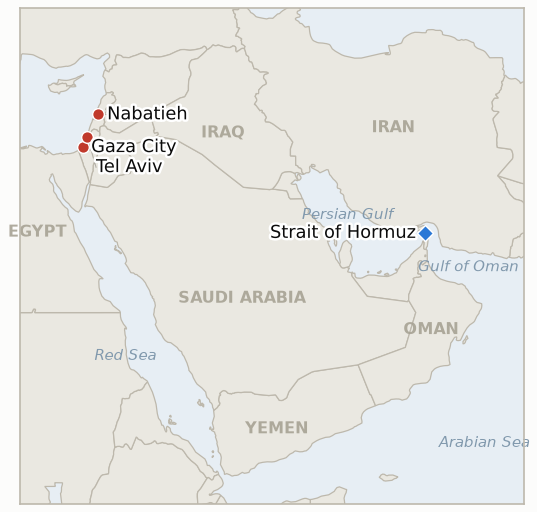

# Middle East Daily Briefing

**September 4, 2026**

- **Reporting window:** ~24 hours, September 3, 09:00 to September 4, 09:00 KST
- **Overall assessment:** Washington and Israel both moved to define the conflict on their own terms today, in ways that point in different directions. Netanyahu, addressing the IDF General Staff Forum at a Rosh Hashanah toast, made explicit for the first time that toppling Iran's regime is now Israel's "central mission" and that the goal is "within reach," a formalization of what had previously been battlefield rhetoric rather than a declared war aim. Hours earlier in Washington, Vice President Vance struck a notably different register: he set a firm precondition for resuming talks with Tehran, an end to attacks on commercial shipping, disclosed that Iran's control of the Strait of Hormuz is now "effectively gone" and a "diminishing asset," yet also said he "wouldn't call it a war" given "no active shooting" right now, a striking minimization one day after Iran's missiles and drones reached four countries. Markets took the calmer tone at face value: Brent eased 0.4% to $95.26 and WTI slipped 0.1% to $90.84, giving back a fraction of the week's surge, while KOSPI, after plunging roughly 3% intraday, closed up 0.26% at 6,579.48 and the won firmed 9.4 won to 1,359.3. In Gaza, National Security Minister Ben Gvir unveiled a costed, seven year "Disengagement 710" plan to remove 1.86 million Palestinians, a more concrete escalation of the "frozen, not cancelled" framing Defense Minister Katz offered yesterday, timed ahead of the October 27 election; separately, the IDF announced it had finished clearing Hezbollah's two-decade-old underground Ali Taher Ridge facility in southern Lebanon ahead of demolition, even as Israeli fire in Gaza killed three more Palestinians despite the ceasefire, pushing this ledger's tracked toll since the October 2025 ceasefire past 1,334 dead.

---

## 1. What Happened

<figure style="float:right; width:46%; margin:2pt 0 8pt 14pt;">

<figcaption style="font-size:8pt; color:#666; text-align:center; margin-top:3pt; font-style:italic;">Major places of discussion</figcaption>
</figure>

### 1.1 Netanyahu Declares Toppling Iran's Regime Israel's Central Mission

Addressing the IDF General Staff Forum at a Rosh Hashanah toast in Tel Aviv, Prime Minister Netanyahu said Israel's "central mission" is now to topple Iran's government, declaring "the regime is now faltering. It is weaker than ever. It is fighting for its survival," and "I am confident in our ability to remove this threat once and for all, in other words, to topple this regime" ([Times of Israel liveblog](https://www.timesofisrael.com/liveblog-september-03-2026/); [Israel National News](https://www.israelnationalnews.com/flashes/692920)). This is the first time Israel's own prime minister has formalized regime change as a declared war aim rather than leaving it as IDF or US background assessment, and follows reporting that intelligence, economic and diplomatic assessments in Washington, Gulf capitals and Israel now judge Iran's regime to be under exceptional strain. **Confidence: High** on the quotes and framing (Tier 2-3, multiple Israeli outlets, on-record remarks); Medium on whether this reflects an operational shift rather than rhetorical positioning ahead of Israel's own election season.

### 1.2 Vance Sets Conditions for Iran Talks, Calls Hormuz Control a Diminishing Asset, and Says He Would Not Call It a War

Vice President JD Vance told reporters the US will not resume talks with Iran "unless they stop shooting at commercial shipping," adding "they've got to stop, it's that simple," and that roughly 15 million barrels of oil moved through the Strait of Hormuz on Wednesday despite the attacks, arguing Iran's "control over the Strait of Hormuz is effectively gone, and it's a diminishing asset" as Tehran is "losing their capabilities by the day" ([Fox News liveblog](https://www.foxnews.com/live-news/us-iran-war-strikes-strait-of-hormuz-09-03-26); [Investing.com/Reuters](https://www.investing.com/news/commodities-news/vance-says-us-not-talking-to-iran-unless-they-stop-shooting-at-ships-4888397)). Separately, Vance said of the seven-month conflict, "I wouldn't call it a war. Right now, there is no active shooting," and that "major combat operations lasted for about six weeks," a framing that arrived one day after Iran's missiles and drones struck or triggered alerts in Jordan, Bahrain, Iraq and Kuwait. New reporting on the Sept 1 to 2 strike wave that triggered that retaliation also confirmed the US struck two Iranian government tankers directly, hitting their engine rooms with drone-launched missiles as part of a newly declared "tanker for tanker" policy meant to deter further Iranian attacks on shipping, alongside roughly 100 IRGC-linked military targets ([Axios](https://www.axios.com/2026/09/02/iran-tankers-hormuz-attacks-oil); [TWZ](https://www.twz.com/news-features/iranian-oil-tankers-in-the-cross-hairs-of-new-u-s-campaign)). **Confidence: High** on Vance's quotes (Tier 1-2, multi-outlet, on-record); Medium on the independent verification of the 15 million barrel flow figure and on whether "tanker for tanker" is a sustained doctrine or a one-time signal.

### 1.3 Oil Eases and KOSPI Rebounds as Trump Signals the Campaign Will Not Be Prolonged

Brent crude fell 0.4% to $95.26 a barrel and WTI shed 0.1% to $90.84, snapping a three-day rally as investors weighed President Trump's signal that the renewed strikes on Iran would not be prolonged against official data showing US crude inventories fell 4.5 million barrels last week, their first drop since late July ([AP via Local10](https://www.local10.com/business/2026/09/03/oil-prices-edge-lower-while-asian-shares-rise-tracking-wall-street-gains/)). KOSPI, which plunged roughly 3% within the first ten minutes of trading, recovered to close up 0.26% at 6,579.48 as corporate buybacks offset renewed pressure from oil and global bond yields, while the won firmed 9.4 won to 1,359.3 ([Seoul Economic Daily](https://en.sedaily.com/finance/2026/09/03/kospi-closes-026-percent-higher-at-657948); [Money Today](https://www.mt.co.kr/economy/2026/09/03/2026090315353672880)). No independently verified Hormuz daily transit count was published in the window; Vance's 15 million barrel flow claim (§1.2) is the only figure available and has not been corroborated by Kpler or Windward reporting. **Confidence: High** on Brent, WTI, KOSPI and the won (Tier 1-2, official exchange and wire data); the market's read of Trump's "not prolonged" signal itself is Medium, given this ledger's record of similar claims not holding.

### 1.4 Ben Gvir Unveils a Seven Year Plan to Remove 1.86 Million Palestinians From Gaza

National Security Minister Itamar Ben Gvir unveiled "Disengagement 710," a plan to achieve the "voluntary emigration" of Gaza's population in three stages, 250,000 within a year, 1.11 million within three years and 1.86 million within seven, backed by a proposed dedicated government ministry, an initial 10 billion shekel Israeli investment and a matching framework of up to 50 billion shekels contingent on international participation, with Turkey, Ethiopia, Congo and other countries being examined as destinations ([Times of Israel](https://www.timesofisrael.com/liveblog_entry/ben-gvir-unveils-voluntary-emigration-plan-aimed-at-removing-1-86-million-palestinians-from-gaza/); [Jerusalem Post](https://www.jpost.com/israel-election-2026/article-907523)). Unveiled ahead of the October 27 election, Ben Gvir's Otzma Yehudit says it will make the plan a coalition condition for joining the next government, a more concrete and costed escalation of Defense Minister Katz's Sept 2 statement that Trump had only "frozen" rather than cancelled a similar mass-emigration idea ([Middle East Eye](https://www.middleeasteye.net/news/ben-gvir-set-unveil-20-billion-plan-ethnically-cleanse-gaza-within-seven-years)). **Confidence: High** on the plan's contents and Ben Gvir's on-record unveiling (Tier 2-3, multi-outlet, official announcement); Low on whether any named destination country has agreed to anything, which none of today's reporting establishes.

### 1.5 The IDF Completes Clearing Hezbollah's Ali Taher Ridge Facility as Gaza Ceasefire Deaths Continue

The IDF's 36th Division announced it had finished clearing Hezbollah operatives from a two-decades-old underground facility beneath the Ali Taher Ridge in southern Lebanon, describing a network of command centers, weapons rooms, generator rooms and living quarters built with Iranian financing, and said it is now preparing to demolish the site; the ridge, north of the Litani River near Nabatieh, commands the routes linking south Lebanon to the coast and the western Beqaa Valley ([Times of Israel liveblog](https://www.timesofisrael.com/liveblog-september-03-2026/); [Israel National News](https://www.israelnationalnews.com/news/432674)). In Gaza, Israeli forces killed three more Palestinians despite the ceasefire, one in a drone strike on a group of civilians in central Gaza City and two by gunfire in Beit Lahia; the IDF said it had "identified an armed individual who crossed the Yellow Line and approached the forces in a way that posed an immediate threat" in the Beit Lahia case, without commenting on the Gaza City strike ([Middle East Monitor](https://www.middleeastmonitor.com/20260903-israeli-army-kills-3-palestinians-wounds-others-in-gaza-strip-despite-ceasefire/)). The UN human rights office separately reported 24 Palestinians, including four children, killed in the five days before Sept 1. **Confidence: High** on the Ali Taher Ridge clearance (Tier 2-3, IDF statement, multi-outlet); Medium on the Gaza City drone strike circumstances (Tier 2-3, Palestinian medical sources, partial IDF comment).

---

## 2. Deep Dive: Incentives and Motives

### 2.1 Why would Netanyahu formalize regime change as Israel's stated war aim now, in a Rosh Hashanah toast rather than a policy address?

Because formalizing regime change as a declared aim, rather than leaving it as IDF or Israeli-media background assessment, changes what counts as victory and therefore what any future ceasefire or negotiated arrangement with Tehran would need to deliver; making the declaration in a low-stakes toast to the General Staff, rather than a Knesset address or formal press conference, lets Netanyahu test the framing's reception domestically and among US and Gulf audiences without formally committing Israel to it as a negotiating position, and lets him leverage rather than originate the assessment, reported this week across Washington, Gulf and Israeli channels, that Iran's regime is under exceptional strain.

### 2.2 Why would Vance both harden conditions for talks and downplay the conflict as "not a war" in the same set of remarks?

Because the two messages serve complementary rather than contradictory purposes: setting a firm precondition, an end to attacks on shipping, keeps pressure on Iran without requiring a new US commitment or strike, while calling the seven-month conflict "not a war" with "no active shooting" minimizes its domestic political cost and insulates the administration from scrutiny of an open-ended campaign, even as the same week's reporting describes roughly 100 targets struck inside Iran and Iranian missiles reaching four countries; the rhetorical downgrade lets Washington keep escalating operationally, including the newly disclosed direct strikes on Iran's own tanker fleet, while describing the conflict, for domestic audiences, as something short of a war.

### 2.3 Why would markets treat Trump's "not prolonged" signal as only a partial, reversible correction rather than a durable reversal?

Because a single day's easing, Brent's 0.4% pullback and KOSPI's rebound to a 0.26% gain after a 3% intraday plunge, reverses only a fraction of the shock accumulated since the Aug 31 tanker attacks and the Sept 1 to 2 US strike wave, and this ledger has already recorded four other de-escalatory claims (IND-20260819-1, IND-20260826-1, IND-20260827-1, IND-20260827-2) fail within their own test windows; a market conditioned by that pattern prices the "not prolonged" comment as a tradeable relief rally rather than grounds to unwind the broader risk premium, consistent with IND-20260903-1 remaining open rather than confirmed.

### 2.4 Why would Ben Gvir unveil a maximalist, costed emigration plan just as Katz's more cautious "frozen, not cancelled" framing was still fresh?

Because Otzma Yehudit needs a differentiated, maximalist position ahead of the October 27 election that neither Netanyahu's Likud nor Katz's hedged framing can match, and a costed seven-year plan, complete with a proposed ministry, funding figures and named candidate destination countries, converts what Katz described as merely suspended into what Ben Gvir presents as an active government project awaiting only Trump's approval; this positions Otzma Yehudit to demand the plan as a coalition condition regardless of whether Turkey, Ethiopia, Congo or any other country ever agrees to receive Gazans.

### 2.5 Why would the IDF publicize completing the Ali Taher Ridge clearance the same day Gaza's ceasefire violations continue unresolved?

Because the two tracks answer to different audiences and rules entirely: the Ali Taher Ridge operation closes out a discrete, two-decade-old piece of Hezbollah infrastructure inside the bounds of the Lebanon ceasefire framework, giving the IDF a clean, demonstrable operational success to publicize on a symbolically significant day, while Gaza's "Yellow Line" enforcement, which killed three more Palestinians in the same 24 hours, operates under looser rules of engagement that have made the running toll this ledger tracks, now past 1,334 dead since the October 2025 ceasefire, effectively independent of whatever else leads that day's headlines.

---

## 3. Policy Implications for South Korea

### 3.1 Exposure snapshot

| Item | Current reading | Source |
| --- | --- | --- |
| Netanyahu's regime change declaration | First explicit statement that toppling Iran's government is Israel's "central mission"; no disclosed operational step yet | Times of Israel, Israel National News |
| Tanker for tanker policy | US struck two Iranian government tankers directly (engine rooms) as part of the Sept 1 to 2 wave of roughly 100 targets; first direct US strikes on Iran's own tanker fleet | Axios, TWZ |
| Hormuz oil flow (Vance claim) | ~15 million barrels transited Sept 2, per VP Vance; unverified independently by Kpler or Windward | Fox News, Investing.com/Reuters |
| Janggeum Shipping / Senegal Prosperity | Vessel struck Aug 31 alongside the Sidr; ~120 VLCC fleet, 5 vessels on Iran's 45-vessel blacklist | Khan, Seatrade Maritime |
| Middle East share of crude imports | 48.5% (May to July 2026 rolling), down from 69.1% a year earlier; August single month reading 61.1% | KNOC via Asia Business Daily; `korea-exposure.md` |
| Brent / WTI | Brent −0.4% to $95.26; WTI −0.1% to $90.84, both easing from Tuesday's surge on Trump's "not prolonged" signal | AP via Local10 |
| KOSPI / USD-KRW | KOSPI +0.26% to 6,579.48 after a 3% intraday plunge; won firmed 9.4 won to 1,359.3 | Seoul Economic Daily; Money Today |
| Strategic reserve coverage | ~26 days of actual consumption (estimate); ~21 million barrels already swapped, on immediate standby | CSIS; MOTIE |
| Refiner Saudi ownership exposure | S-Oil (Saudi Aramco majority ~63%), HD Hyundai Oilbank (Aramco ~17%) | Public filings; `korea-exposure.md` |
| Hormuz transits | No independently verified daily count published in this window | n/a |

### 3.2 Implications by development

**Netanyahu's explicit new war aim of regime change in Iran, if it becomes operative Israeli or US policy rather than remaining rhetorical, would extend Korea's planning horizon for Gulf risk from a bounded strike-and-retaliate cycle to an open-ended campaign with no clear end state, materially changing how long refiners and KNOC should expect elevated freight, insurance and crude-sourcing costs to persist.** New IND-20260904-1 tracks whether the declaration produces any disclosed operational step.

**Vance's disclosure that the US is now striking Iran's own government tanker fleet directly, not only IRGC military infrastructure, alongside his simultaneous "not a war" framing, signals Washington intends to keep escalating a conflict it is minimizing in domestic messaging, a combination Korean policymakers should read as evidence the campaign's operational tempo is not tracking its public rhetoric.** New IND-20260904-3 tracks whether the tanker for tanker policy extends beyond its first two strikes.

**Oil's modest pullback and KOSPI's partial, intraday-reversed recovery restore only a fraction of the week's losses and remain fully reversible on the next headline, consistent with this ledger's record of de-escalatory claims that have not survived their test windows; Korean refiners and KNOC should treat today's relief as a pause rather than a floor.** Tracked through IND-20260903-1 and the series chart above.

**Ben Gvir's costed, seven year emigration plan sustains the pattern of Gaza policy volatility ahead of Israel's October election but carries no direct Korean market implication on its own, remaining adjacent to rather than intersecting with Korea's Gulf shipping exposure.** New IND-20260904-2 tracks whether any named destination country confirms substantive talks.

**No new Korean-specific shipping development emerged in this window; Janggeum Shipping's exposure through the Senegal Prosperity and its blacklisted fleet remains tracked through IND-20260903-3 without a fresh trigger today.**

**Testable indicators:**

- **IND-20260904-1** — A disclosed Israeli or US operational step toward Iranian regime change (a formal Security Cabinet resolution, a confirmed covert program, or a joint US-Israel policy statement naming regime change as a war aim) by ~2026-09-18 confirms Netanyahu's declaration reflects an operative shift rather than rhetoric; no such step by the same date, even if the rhetoric continues, falsifies it as election-season positioning consistent with Israel's approaching October 27 vote.
- **IND-20260904-2** — A named destination country (Turkey, Ethiopia, Congo, or another) confirming substantive talks on Ben Gvir's "Disengagement 710" plan, or the Israeli government formally adopting or rejecting it as coalition policy, by ~2026-09-18 confirms the plan has moved beyond a campaign proposal; no such confirmation or government action by the same date falsifies near-term operational status, consistent with the pattern of prior Gaza emigration proposals stalling on the same host-country variable.
- **IND-20260904-3** — A further verified US strike on an Iranian government or Iran-flagged tanker under the "tanker for tanker" policy, beyond the two struck Sept 1 to 2, by ~2026-09-17 confirms it as a sustained doctrine; no further such strike through the same date, even if other US-Iran exchanges continue, falsifies it as a one-time signal rather than an ongoing campaign.

---

## 4. Watch List

- **Whether Netanyahu's regime change declaration produces any disclosed operational step** (IND-20260904-1, deadline September 18).
- **Whether any host country confirms substantive talks on Ben Gvir's Disengagement 710 plan** (IND-20260904-2, deadline September 18).
- **Whether the US "tanker for tanker" policy extends beyond its first two strikes on Iranian government tankers** (IND-20260904-3, deadline September 17).
- **Whether Trump's "wind down soon" prediction holds for roughly two weeks without a further US or Iranian strike** (IND-20260903-1, deadline September 16).
- **Whether Iran's "decisive operation" produces any further verified strike beyond the September 1 to 2 wave** (IND-20260903-2, deadline September 9).
- **Whether Janggeum Shipping changes its Hormuz chartering pace, or Seoul issues an advisory specifically on the company's exposure** (IND-20260903-3, deadline September 17).
- **Whether Trump's threatened "biggest attack of them all" ever materializes as a further US strike on Iran** (IND-20260902-2, deadline September 9).
- **Whether the Mecca Joint Defence Agreement produces any concrete implementing step** (IND-20260809-2, deadline September 8).
- **Whether the Iran-Oman Hormuz shipping-map agreement produces a signed statement with an operating date** (IND-20260816-3, deadline September 5).
- **Whether the Turkey Israel friction over the Abu al-Duhur strike escalates or is absorbed** (IND-20260823-1, deadline September 6).
- **Whether the IDF's West Bank "brink of escalation" warning is followed by an actual step change in the violence pattern** (IND-20260823-2, deadline September 6).
- **Whether Barrack's back-to-back controversies produce any actual US policy or personnel consequence** (IND-20260824-1, deadline September 6).
- **Whether the Van Hollen led privileged resolution on West Bank American deaths forces committee action or a State Department response once introduced** (IND-20260828-2, deadline September 6).
- **Whether the confirmed renewed Hezbollah Israel exchange becomes a self sustaining escalatory cycle** (IND-20260829-1, deadline September 8).
- **Whether the Jannatah attack on Israeli activists and an AFP journalist draws any arrest** (IND-20260826-2, deadline September 8).
- **Whether the Masafer Yatta and Bizzariya arrests mark a durable settler enforcement shift or stay isolated cases** (IND-20260825-2, deadline September 8).
- **Whether Netanyahu's Qusra condemnation produces genuine enforcement or stays rhetorical** (IND-20260830-1, deadline September 9).
- **Whether the internal military warning to Hegseth produces a disclosed force posture change or the campaign continues unchanged** (IND-20260831-2, deadline September 14).
- **Whether Kaine's privileged war powers resolution on Oman passes, fails, or never reaches a floor vote when the Senate returns in September** (IND-20260819-3, deadline September 25).
- **Whether the Somali piracy surge draws a coordinated naval or insurance market response** (IND-20260822-2, deadline September 5).
- **Whether the $206 million US ISF funding for Gaza converts into visible equipment delivery or stand up activity** (IND-20260820-3, deadline September 19).
- **Whether Yemen's fighting produces a further dramatic escalation or settles into an attritional pattern.**
- **Whether Saudi Arabia's direct attribution of the Sidr attack to Iran draws any further Saudi diplomatic or military response beyond its public statement.**

---

## 5. Source Quality Summary

| Claim | Sources | Confidence |
| --- | --- | --- |
| Netanyahu's regime change declaration and quotes | Times of Israel liveblog, Israel National News, Israel Hayom (Tier 2-3, on-record remarks, multi-outlet) | High |
| Vance's Iran talks conditions, Hormuz "diminishing asset" and oil flow claims | Fox News liveblog, Investing.com/Reuters (Tier 1-2, on-record briefing, multi-outlet) | High |
| Vance's "wouldn't call it a war" characterization | Bloomberg via headtopics (Tier 1-2, single primary wire, on-record) | High |
| US strikes on two Iranian government tankers under "tanker for tanker" policy | Axios, TWZ (Tier 2-3, officials speaking on background, multi-outlet corroboration) | Medium to High |
| Oil settlement figures for September 3 | AP via Local10/WSLS (Tier 1-2, wire copy) | High |
| KOSPI and won closing levels | Seoul Economic Daily, Money Today (Tier 2-3, Korean financial press, official exchange data) | High |
| Ben Gvir's Disengagement 710 plan details | Times of Israel, Jerusalem Post, Middle East Eye (Tier 2-3, official unveiling, multi-outlet) | High |
| Ali Taher Ridge clearance | Times of Israel liveblog, Israel National News, Amit Institute (Tier 2-3, IDF statement, multi-outlet) | High |
| Gaza ceasefire deaths (three Palestinians, September 3) | Middle East Monitor, citing Palestinian medical sources and partial IDF comment (Tier 3, single-perspective outlet, IDF confirmed one incident) | Medium |
| Janggeum Shipping / Senegal Prosperity exposure baseline | Khan, Seatrade Maritime (Tier 2-3, unchanged from prior reporting, no new window-specific claim) | Medium |
