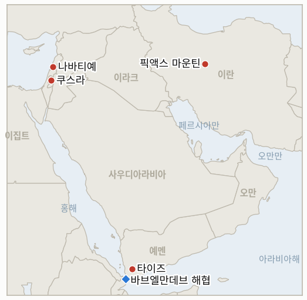

# 중동 일일 브리핑

**2026년 9월 5일**

- **보도 대상 기간:** 약 24시간, 9월 4일 09:00 ~ 9월 5일 09:00 (한국시간)
- **종합 평가:** 오늘의 사안들은 전쟁이 확전을 계속하는 동시에 처음으로 그 대가에 대한 뜻하지 않은 솔직함을 드러낸 하루를 보여준다. 트럼프 대통령은 이란의 깊숙이 매설된 지하 시설 "픽액스 마운틴"을 "곧" 타격할 수 있다고 위협했는데, 같은 날 하워드 러트닉 상무장관이 이번 분쟁에서 "미국인 사망자는 없었다"고 잘못 발언한 것이 파문으로 커지면서 행정부가 그동안 공개하지 않았던 실제 사망자 수, 전사 18명과 부상 767명이라는 수치가 처음으로 드러났다. 레바논에서는 8월 말 이후 이 원장이 추적해 온 두 번째 헤즈볼라·이스라엘 충돌이 억제되지 않고 오히려 확산됐다. 헤즈볼라의 추가 드론 공격에 대한 대응으로 이스라엘군이 나바티예의 르웨이스 지역, 알라마디예, 서베카를 타격해 최소 4명이 여러 마을에서 목숨을 잃었으며, 이는 이스라엘군이 알리 타헤르 능선 터널 소탕 완료를 발표한 지 며칠 만에 벌어진 일이다. 더 남쪽에서는 예멘 후티 세력이 바브엘만데브 해협 접근로를 겨냥해 타이즈 일대에서 대규모 지상 공세를 개시했는데, 하루 사망자가 120명을 넘어 2022년 휴전 이후 예멘 내 최악의 하루로 기록됐다. 이는 이번 주 다른 어떤 역내 폭력보다도 규모가 큰데도 서방 언론의 주목은 상대적으로 적었다. 그러나 시장은 이 모든 것을 배경 소음처럼 받아들였다. 브렌트유는 0.28% 오른 95.80달러로 마감하며 7월 이후 최고의 한 주를 마쳤고, 코스피는 1.64% 오른 6,687.21로, 원화는 1,350.4원으로 강세를 보였는데, 이는 중동 관련 신호가 아니라 크리스토퍼 월러 연준 이사의 완화적 금리 발언에 따른 것으로, 이번 주의 확전과 시장 심리 사이의 뚜렷한 탈동조화를 보여준다. 가자지구 정책에서는 벤그비르 국가안보장관의 대규모 이주 계획 "디스인게이지먼트 710"이 하마스의 즉각적 거부와 이집트의 반대에 부딪혔고, 어떤 목적지 국가도 나서지 않았다. 한편 서안지구에서는 쿠스라 정착민 공격과 관련해 이스라엘 경찰이 첫 체포를 단행했는데, 이는 그 외에는 변함없는 정착민 폭력 양상 속에서 드문 구체적 집행 조치였다.

---

## 1. 무슨 일이 있었나

<figure style="float:right; width:46%; margin:2pt 0 8pt 14pt;">

<figcaption style="font-size:8pt; color:#666; text-align:center; margin-top:3pt; font-style:italic;">주요 논의 지점</figcaption>
</figure>

### 1.1 트럼프, 픽액스 마운틴 타격 위협, 러트닉의 실언이 전쟁 최초 미군 공식 사망자 집계를 이끌어내

트럼프 대통령은 기자들에게 "픽액스에 뭔가 진행 중이라면... 우리는 아주 곧 픽액스를 타격할 수도 있다"고 말했는데, 이는 이란이 2025년 6월 타격 이후 원심분리기를 이전한 것으로 이스라엘 정보 당국이 평가한, 손상된 나탄즈 농축 시설 인근의 견고하게 요새화된 깊은 지하 터널 단지를 가리킨 것으로, "이란은 핵무기를 갖지 못할 것"이라고 덧붙였다([Israel National News](https://www.israelnationalnews.com/news/432724); [Investing.com/Reuters](https://www.investing.com/news/commodities-news/trump-says-us-may-hit-irans-pickaxe-mountain-soon-4889937); [Middle East Eye](https://www.middleeasteye.net/live-blog/live-blog-update/trump-says-us-may-hit-irans-pickaxe-mountain-soon)). 같은 날 하워드 러트닉 상무장관은 CNBC에서 이번 분쟁을 "사실상 경제적 봉쇄일 뿐"이라 칭하며 "미국인 사망자는 없었다"고 말했는데, 본인은 이를 별개의 베네수엘라 작전과 혼동한 데서 나온 실수라고 설명했다. 트럼프 대통령은 트루스소셜에서 "러트닉 장관은 아무도 죽지 않았다고 말했을 때 베네수엘라를 생각하고 있었다. 이란에서는 18명이 사망했다!"고 공개적으로 정정했고, 러트닉은 사과하며 미군 18명이 사망하고 750명 이상(767명)이 부상했다는, 행정부가 이전까지 공개하지 않았던 전쟁 최초의 공식 사망자 집계를 밝혔다([CNN](https://edition.cnn.com/2026/09/03/politics/lutnick-apology-iran-troop-deaths); [The Hill](https://thehill.com/homenews/administration/6068731-lutnick-apologizes-iran-death-claim/); [US News](https://www.usnews.com/news/world/articles/2026-09-03/lutnick-apologizes-for-saying-no-americans-have-died-in-iran-war)). **신뢰도: 높음** (픽액스 마운틴 위협과 사망자 수치 모두, 1~2등급, 다수 매체, 공식 발언 근거); 이 공개가 지속적인 투명성 전환을 의미하는지 실수로 인한 일회성 정정인지는 **중간**.

### 1.2 헤즈볼라·이스라엘 교전, 레바논 남부로 확산되며 자기 지속적 2차 충돌로 확인

헤즈볼라는 9월 4일 레바논 남부의 이스라엘군을 향해 추가 폭발물 탑재 드론을 발사했으나(요격됨), 이에 대한 이스라엘의 보복 타격이 나바티예의 르웨이스 지역(2명 사망), 알라마디예(8명 부상), 서베카의 아인 엘티네(1명 부상)를 강타했고, 같은 날 오후 별도의 이스라엘 드론 공격이 나바티예의 다른 지역에서 오토바이를 타던 남성 2명을 추가로 살해해 "정전에도 불구하고" 사망자가 발생했다([Middle East Monitor](https://www.middleeastmonitor.com/20260904-2-killed-in-israeli-drone-strike-in-southern-lebanon-despite-ceasefire/); [Naharnet](https://www.naharnet.com/) 실시간 보도; [China.org.cn/신화통신](http://www.china.org.cn/world/Off_the_Wire/2026-09/05/content_118681401.shtml)). 이는 8월 29일 이 원장이 재개된 헤즈볼라·이스라엘 교전이 자기 지속적 국면이 될지, 이전의 낮은 강도 패턴으로 되돌아갈지를 판별하기 위해 설정한 확증 기준을 그대로 충족하며, **IND-20260829-1을 확증**으로 종결했는데, 이는 마감 기한보다 3일 앞선 시점이다. 이번 타격은 이스라엘군이 헤즈볼라의 알리 타헤르 능선 터널 단지 소탕 완료를 공표하고 네타냐후 총리가 해당 능선이 "더 이상 이스라엘을 위협하지 않는다"고 선언한 지 얼마 지나지 않아 벌어졌으며, 같은 날 이스라엘에 구금됐던 레바논 민간인 4명이 적십자를 통해 석방되고 아운 대통령이 헤즈볼라 무장해제 공약을 재확인하기도 했다([Naharnet](https://www.naharnet.com/); 배경 [aawsat](https://english.aawsat.com/arab-world/5314519-israeli-military-says-it-has-control-lebanon%E2%80%99s-strategic-ali-al-taher-area)). **신뢰도: 높음** (타격 및 사망자 수치, 2~3등급, 실시간 보도와 통신사 기사 등 다수 매체); 지역별 세부 사망자 수치가 매체마다 다소 차이가 있어 그 부분은 **중간**.

### 1.3 예멘 후티, 바브엘만데브 방면 대규모 공세 개시, 2022년 이후 최악의 하루

후티 세력은 로켓 및 드론 지원을 받는 지상 공세를 타이즈 인근의 마크바나, 마우자, 자발 하바시 지역에서 개시해 바브엘만데브 해협 남쪽 관문으로의 접근로를 놓고 정부군과 다퉜다. AFP 통신을 인용한 보도에 따르면 하루 사망자가 120명을 넘어, 예멘 내 수년 만의 최악의 충돌이자 2022년 유엔 중재 휴전 이후 가장 큰 규모의 교전으로 묘사됐으며, 새로운 피난 물결을 촉발했다([France24](https://www.france24.com/en/live-news/20260904-more-than-120-killed-in-yemen-s-worst-clashes-in-years-sources); [RTE](https://www.rte.ie/news/middle-east/2026/0904/1590368-120-killed-in-yemen/); [Al Jazeera](https://www.aljazeera.com/news/2026/9/4/houthi-attacks-on-yemens-taiz-escalate-triggering-new-displacement-wave); [Arab News](https://www.arabnews.com/middle-east/yemeni-government-forces-push-back-against-houthi-offensive-in-taiz-hodeidah-3000519)). 사우디의 지원을 받는 예멘 정부군은 반격에 나서 일부 지역을 재탈환했다고 밝혔으며, 공식 보고에 따르면 직전 24시간 동안 최소 50명의 후티 전투원(현장 지휘관 2명 포함)이 사망하거나 부상당했다. 별도로 9월 3일에는 모카 항구를 겨냥한 폭탄 적재 선박이 목표에 도달하기 전에 격파돼, 이번 공세에 해상 차원도 병행되고 있음을 시사했다([Al Arabiya](https://english.alarabiya.net/amp/News/middle-east/2026/09/03/fighting-continues-in-yemen-s-taiz-bombladen-boat-targeting-mokha-destroyed)). 이는 이번 주 다른 어떤 역내 전선보다도 규모가 큰 폭력 사태이지만, 국제적 반응은 상대적으로 미미했다. **신뢰도: 높음** (사망자 규모와 지역, 1~2등급, AFP 통신 기사를 다수 매체가 인용); 정부군과 후티 측 손실의 구체적 구분은 매체마다 차이가 있어 **중간**.

### 1.4 유가와 한국 증시, 연준의 완화적 발언에 강세, 이번 주 확전과 탈동조화

브렌트유는 0.28% 오른 배럴당 95.80달러로 마감해 7월 이후 최고의 한 주(약 8~9% 상승)를 마쳤는데, 이는 미국·이란 분쟁과 레바논·예멘 전선 확산이 계속되는 가운데서도 나온 결과다. WTI는 0.09% 내린 91.22달러로 거의 변동 없이 마감했으나 역시 약 9%의 주간 상승 폭 안에 있었으며, 이라크 원유 수출 증가와 OPEC+가 10월 생산량을 동결할 것이라는 전망이 일부 상쇄 요인으로 작용했다([TradingEconomics](https://tradingeconomics.com/commodity/brent-crude-oil); [TradingEconomics](https://tradingeconomics.com/commodity/crude-oil)). 코스피는 1.64% 오른 6,687.21을 기록했고, 삼성전자는 2.20%, SK하이닉스는 3.20% 상승했으며, 코스닥은 5거래일 연속 하락세를 끊고 2.95% 오른 813.50을 기록했다. 원화는 8.9원 절상된 1,350.4원을 나타냈다. 한국 증시 강세의 배경으로 지목된 것은 중동 관련 사안이 아니라 크리스토퍼 월러 연준 이사의 완화적 발언으로, 그는 "2% 물가 목표를 향한 진전이 계속된다면 현재 수준의 정책금리 유지를 지지하겠다"고 밝혔으며, 밤사이 뉴욕증시 상승도 함께 작용했다([Seoul Economic Daily](https://en.sedaily.com/finance/2026/09/04/kospi-closes-up-164-percent-at-668721); [Asia Business Daily](https://view.asiae.co.kr/article/2026090415363964713); [Money Today](https://www.mt.co.kr/economy/2026/09/04/2026090415342187051)). 호르무즈 해협의 독립 통항량 추적치는 이번 주에도 서로 엇갈렸다. 같은 날짜에 대해 매체별로 인용한 Kpler 기반 수치가 서로 달랐고(9월 2일의 경우 매체에 따라 약 6척과 9척, 9월 3일은 4척과 그보다 높은 수치가 각각 제시됨), 마감 시점까지 9월 4일치 확정 수치는 발표되지 않았는데, 이는 이 데이터 시리즈에서 통상적인 1~2일의 보도 지연에 부합한다([Al Jazeera](https://www.aljazeera.com/news/2026/9/3/how-much-oil-is-going-through-hormuz-how-data-doesnt-match-us-claims)). **신뢰도: 높음** (브렌트유, WTI, 코스피, 원화 모두, 1~2등급, 공식 거래소·통신사 데이터); 호르무즈 통항량 수치 자체는 매체 간 불일치가 계속되고 있어 **중간에서 낮음**.

### 1.5 벤그비르의 가자지구 계획에 반발 이어져, 쿠스라에서는 첫 정착민 체포

하마스 대변인 하젬 카셈은 벤그비르의 "디스인게이지먼트 710" 계획을 거부하며 이는 이스라엘이 "팽창과 통제 의도를 버리지 않았다"는 것을 보여준다고 말했고, 아랍·이슬람 국가들이 "심각한 조치"를 취해야 한다며 팔레스타인 대의에 대한 "직접적 위협"이라고 규정했다([Infobae](https://www.infobae.com/america/agencias/2026/09/04/hamas-denuncia-el-plan-de-ben-gvir-para-desplazar-a-la-poblacion-palestina-de-gaza/)). 이집트는 별도로 자국 영토를 통한 팔레스타인인의 어떠한 이주도 "강력히 반대한다"고 재확인했으며, 튀르키예, 에티오피아, 콩고 등 어떤 국가도 제안된 규모의 가자지구 주민 수용에 합의했다고 공식 확인하지 않았다는 보도가 이어졌다([Daily Sabah](https://www.dailysabah.com/world/mid-east/fury-grows-as-israel-plans-to-displace-186m-palestinians-from-gaza)). 카츠 국방장관은 대규모 이주 구상 전반에 대해 여전히 트럼프 대통령이 이를 백지화한 것이 아니라 단지 "동결"시켰을 뿐이라는 입장을 유지하며, 목적지 국가가 나타나지 않는 상황에서도 이를 정부 내에서 공식적으로 살려두고 있다([Times of Israel](https://www.timesofisrael.com/ben-gvir-unveils-voluntary-emigration-plan-to-remove-most-palestinians-from-gaza/)). 한편 서안지구에서는 이스라엘 경찰이 이스라엘 경찰과 신베트의 공동 수사를 거쳐 쿠스라 주택 점거 공격과 관련해 19세 정착민을 첫 체포했으며, 별도로 불법 정착촌 메바세르 하샬롬에서 해당 공격에 사용된 것으로 추정되는 차량을 압수했는데, 현장에 있던 정착민들이 이에 돌을 던지기도 했다. 이는 8월 30일 이 원장이 설정한 집행 기준을 충족하며 **IND-20260830-1을 확증**으로 종결했는데, 마감 기한보다 4일 앞선 시점이다. 서안지구 다른 지역에서는 정착민들이 알무가이르에서 농지에 불을 지르고 팔레스타인 조문 행렬을 공격했으며, 부르카에서는 방어용 울타리를 해체하는 모습이 촬영됐다. 한 고위 군 관계자는 채널12에 신베트의 "유대인 부서"가 "거의 아무 일도 하지 않고 있다"고 말했고, 서안지구 중부에서는 한 주 만에 불법 정착촌 5곳이 새로 세워졌다([Times of Israel 실시간 보도](https://www.timesofisrael.com/liveblog-september-04-2026/)). **신뢰도: 높음** (하마스의 거부, 이집트의 입장, 쿠스라 체포 모두, 2~3등급, 다수 매체, 공식 발언 근거); 신베트가 "거의 아무 일도 하지 않고 있다"는 특징 묘사는 방송사 한 곳이 전한 관계자 한 명의 발언이라 **중간**.

---

## 2. 심층 분석: 유인과 동기

### 2.1 트럼프는 왜 러트닉의 실언으로 전쟁 최초의 공식 사망자 집계가 드러난 바로 그날 픽액스 마운틴 타격 위협을 공개했을까?

두 가지 공개는 7개월째 이어진 분쟁의 국내 여론 관리라는 측면에서 상반되면서도 서로 보완적인 목적을 수행하기 때문이다. 구체적이고 고가치인 표적을 지목하고 "아주 곧" 타격하겠다고 다짐하는 것은 지속적인 결의와 추진력을 과시하는 반면, 행정부가 그동안 자발적으로 공개하지 않았고 러트닉의 실수로만 드러난 전사 18명, 부상 767명이라는 수치로부터 시선을 돌리게 한다. 확전 위협과 뜻하지 않은 비용 인정을 함께 내놓음으로써, 트럼프는 전쟁의 대가를 수사적으로 축소하기 어려워지는 상황에서도 이를 여전히 승리 가능하고 계속할 가치가 있는 것으로 규정할 수 있는데, 이는 그가 이번 전쟁을 "작은 감자" 정도라고 표현하면서도 지금까지 가장 중요한 표적을 타격하겠다고 위협하는 것과도 일맥상통한다.

### 2.2 헤즈볼라는 왜 명백히 열세인 교전에 계속 드론을 투입하며, 이스라엘은 왜 단일 표적이 아니라 레바논 여러 마을을 타격으로 대응할까?

헤즈볼라 입장에서는, 비록 매번 요격되는 드론이라도 계속 발사하는 것이 이스라엘군이 마지막 남은 주요 요새화 거점 중 하나(알리 타헤르 능선)의 소탕을 막 공표하고 아운 대통령이 공개적으로 무장해제를 약속하는 시점에도, 국내 레바논·시아파 지지층에 대한 최소한의 저항과 존재감을 유지하는 신호이기 때문이며, 이는 군사적 성공을 필요로 하지 않는 생존 신호의 논리다. 이스라엘 입장에서는, 단일 표적이 아니라 나바티예, 알라마디예, 서베카 등 여러 마을을 타격하는 것이 하나의 드론 발사에 대해 헤즈볼라를 더 광범위하게 응징하는 동시에, 정전 체계가 이스라엘 자신의 대응 규모를 제약하지 않는다는 것을 이스라엘 국내 여론에 보여주는 것이며, 이는 이 충돌을 관리하기 위해 설계된 메커니즘 안에서 억제하기 더 어렵게 만든다.

### 2.3 예멘 후티는 왜 이란 자신의 확전과 병행해 지금 타이즈 인근 정부군을 상대로 확전에 나섰을까, 홍해 해상 압박에 집중하는 대신?

바브엘만데브 접근로를 겨냥한 지상 공세는 역내와 국제적 관심이 이스라엘·이란·호르무즈 위기에 쏠려 있어 병행되는 예멘 내전 확전에 대한 조율된 대응이 동원될 가능성이 낮은 시점에, 후티가 해협 남쪽 관문에 대한 지속적이고 전략적인 영토적 이득을 추구할 수 있게 해주기 때문이다. 해상 압박과 달리 지상 공세는 즉각적인 해군 및 보험시장의 반응을 부르지 않으며, 예멘 정부군을 상대로 외부의 제약을 상대적으로 적게 받으며 진행될 수 있다. 이는 후티의 전반적인 전쟁 노력이 명목상 이란과 정렬돼 있음에도, 이번 국면에서 추가 해상 공격보다 지상 확전을 선택한 이유를 설명해 준다.

### 2.4 시장은 왜 미국의 첫 공식 사망자 공개와 예멘의 수년 만의 최악의 하루가 있었던 이번 주에도 월러의 완화적 발언을 더 중요하게 취급했을까?

통화정책 신호는 모든 자산군에 동시에 영향을 미치며 시장 전체의 할인율에 영향을 주는 반면, 이번 주 개별 확전들은 인적 피해 측면에서는 심각했더라도 아직 그러한 기계적 재평가를 뒤엎을 만큼 큰 공급 차단이나 금융시스템 충격으로 이어지지 않았기 때문이다. 투자자들은 또한 수개월에 걸쳐 이 원장이 추적해 온, 완화 신호가 결국 유지되지 않고 유가가 급등 후에도 다시 하락하는 패턴에 익숙해져 있어, 한국이나 세계 공급망을 아직 직접 위협하지 않는 파악하기 어려운 전쟁 뉴스보다 알려진, 정량화 가능한 촉매(연준 이사의 금리 지침)가 가격 형성을 지배한다.

### 2.5 벤그비르는 왜 목적지 국가가 하나도 없는 계획을 계속 밀어붙이며, 카츠는 왜 하마스와 이집트의 거부 이후에도 이를 폐기하지 않고 "논의 중"으로 유지할까?

벤그비르에게 이 계획의 선거적 가치는 10월 27일 선거를 앞둔 시점에 그 존재와 구체성 자체에 있으며, 단기적 실현 가능성에 있지 않다. 비용까지 산정된 단계별 제안은 오츠마 예후디트가 어떤 목적지 국가가 실제로 동의하는지와 무관하게 이를 연정 조건으로 요구할 수 있게 해주며, 하마스와 이집트의 거부는 벤그비르에게 정치적으로 아무런 손실이 되지 않고 오히려 지지층에게 이 계획이 "올바른" 상대들의 반대를 받고 있다는 인식을 강화할 수도 있다. 카츠에게는 대규모 이주 구상 전반을 공식적으로 폐기하지 않고 "논의 중"으로 유지하는 것이 네타냐후의 연정 관리 유연성을 보존해 주며, 정부가 국제적 규탄을 초래할 계획을 완전히 소유하지도, 선거가 가까워지면서 벤그비르 진영이 양보받아야 할 수도 있는 선택지를 완전히 배제하지도 않게 해준다.

---

## 3. 한국에 대한 정책적 함의

### 3.1 익스포저 현황

| 항목 | 현재 수치 | 출처 |
| --- | --- | --- |
| 픽액스 마운틴 타격 위협 | 트럼프, 나탄즈 인근의 요새화된 이란 터널 단지를 "아주 곧" 타격하겠다고 위협; 아직 확인된 타격 없음 | Israel National News, Investing.com/Reuters |
| 첫 공식 미군 사망자 집계 | 러트닉의 실언과 트럼프의 정정 이후 미군 18명 전사, 767명 부상으로 공개 | CNN, The Hill |
| 헤즈볼라·이스라엘 교전 | 자기 지속적으로 확증(IND-20260829-1); 나바티예, 알라마디예, 서베카로 확산되며 9월 4일 최소 4명 사망 | Middle East Monitor, Naharnet |
| 예멘 타이즈·바브엘만데브 공세 | 하루 120명 이상 사망, 2022년 휴전 이후 예멘 내 최악의 충돌; 해협 접근로 영토를 놓고 다툼 | France24/AFP, Al Jazeera |
| 브렌트유 / WTI | 브렌트유 +0.28%로 95.80달러(7월 이후 최고의 한 주); WTI −0.09%로 91.22달러 | TradingEconomics |
| 코스피 / 원달러 환율 | 코스피 +1.64%로 6,687.21(연준의 완화적 발언 영향); 원화 1,350.4원으로 강세 | Seoul Economic Daily; Money Today |
| 호르무즈 통항량 | 같은 날짜에 대해 매체별 Kpler 기반 수치가 서로 엇갈림; 9월 4일치 확정 수치는 미발표 | Al Jazeera |
| 장금상선 / 세네갈 프로스퍼리티호 | 이번 window에서 용선 활동 변화나 새로운 한국 정부 권고는 확인되지 않음; 9월 2일 장금상선 성명은 블랙리스트에 오른 라이베리아·파나마 선적 선박들에 대한 실질적 소유권을 부인 | Kyunghyang; gCaptain/gosships |
| 한국 원유 수입 중 중동 비중 | 48.5% (2026년 5~7월 이동평균), 전년 동기 69.1%에서 하락; 8월 단월 수치는 61.1% | KNOC 인용 아시아경제; `korea-exposure.md` |
| 전략비축유 커버리지 | 실제 소비량 기준 약 26일 분량(추정); 이미 스왑된 약 2,100만 배럴이 즉시 대기 상태 | CSIS; 산업통상자원부 |
| 정유사 사우디 지분 노출 | S-Oil(사우디 아람코 지분 약 63% 과반), HD현대오일뱅크(아람코 지분 약 17%) | 공시자료; `korea-exposure.md` |

### 3.2 사안별 함의

**트럼프의 픽액스 마운틴 타격 위협이 실행된다면, 이는 이번 타격 작전이 시작된 이래 가장 중대한 확전이 될 것이며, 군사·해상 자산이 아니라 이란 자체의 핵 기반시설을 겨냥하는 것으로, 한국 정유사와 석유공사는 이를 배경 소음이 아니라 실재하는 급등 리스크로 다뤄야 한다.** 신규 IND-20260905-1이 이 위협이 실제 타격으로 이어지는지를 추적한다.

**전쟁 최초로 공개된 미군 사망자 집계는 정책이 아닌 실수로 드러난 것이지만, 작전이 계속되거나 심화되는 가운데 이 분쟁의 인적 대가가 워싱턴이 수사적으로 관리하기 점점 어려워지고 있음을 보여준다. 한국 정책 담당자들은 이를 미국의 조기 개입 축소 신호가 아니라, 작전의 기간과 강도가 줄어들지 않고 있다는 증거로 읽어야 한다.** 신규 IND-20260905-2가 추가 공식 발표가 이어지는지를 추적한다.

**헤즈볼라·이스라엘 교전이 자기 지속적임이 확증되고(IND-20260829-1) 지리적으로 확산된 것은 핵심 이란·호르무즈 축을 넘어선 두 번째 활성 전선이 역내 리스크 그림에 추가됐다는 의미이며, 한국의 해운·보험 노출 계산이 레바논을 걸프보다 낮은 등급의 안정된 리스크로 취급해서는 안 된다는 점을 상기시킨다.** 신규 IND-20260905-3이 확산된 교전이 제도적 정전 메커니즘의 대응을 이끌어내는지를 추적한다.

**예멘 타이즈 공세는 아직 호르무즈나 걸프 해운에 직접 영향을 주지 않고 있지만, 홍해 우회로로 이미 활용되는 바브엘만데브 접근로를 위협한다. 후티가 해협 자체를 향해 더 진격한다면, 한국 해운업체의 초크포인트 리스크는 분산되기보다 오히려 가중될 것이다.** 신규 IND-20260905-4가 이 공세가 새로운 중재를 이끌어내는지를 추적한다.

**시장이 이번 주의 확전들, 픽액스 마운틴 위협, 레바논 확산, 예멘의 사망자 규모를 반영하지 않고 연준의 완화적 발언에 힘입어 오히려 강세를 보인 탈동조화 자체가 하나의 리스크 신호다. 전쟁 뉴스에 이토록 반응하지 않는 시장은, 만약 어느 한 사건이 공급 차단의 임계점을 넘긴다면 오히려 그동안 미뤄진 재평가가 더 급격하게 나타날 수 있는 시장이다. 한국 정유사와 석유공사는 오늘의 잠잠함을 리스크가 해소된 것이 아니라 압축된 것으로 다뤄야 한다.** 위 시리즈 차트와 작전의 향방을 추적하는 기존 지표들(IND-20260902-2, IND-20260903-1)을 통해 추적된다.

**검증 가능한 지표:**

- **IND-20260905-1** — 2026년 9월 18일까지 픽액스 마운틴에 대한 미국의 확인된 타격이 있으면 트럼프의 위협에 실제 작전적 뒷받침이 있었음을 확증하고, 같은 기한까지 그러한 타격이 없으면 이는 억지 수사에 그친 것으로 반증되며, 이는 이 원장이 기록해 온 실행되지 않은 트럼프 타격 위협들(오만 폭격 위협, 하르그섬 발언)의 패턴과 일치한다.
- **IND-20260905-2** — 2026년 9월 18일까지 백악관이나 국방부로부터 추가 공식 사망자 집계 발표가 있으면 새로운 투명성 규범이 확립됐음을 확증하고, 작전이 계속되는데도 같은 기한까지 추가 발표에 대한 침묵이 이어지면 이는 정책 변화가 아니라 러트닉의 실수로 강제된 일회성 공개였음을 반증한다.
- **IND-20260905-3** — 2026년 9월 19일까지 유엔레바논평화유지군(UNIFIL), 레바논군, 또는 미국이 중재한 성명이 확산된 헤즈볼라·이스라엘 교전을 구체적으로 다루면 제도적 개입을 이끌어냈음을 확증하고, 같은 기한까지 그러한 성명 없이 타격이 계속되면 이는 정전 메커니즘의 범위 밖에서 진행되는 충돌임을 반증한다.
- **IND-20260905-4** — 2026년 9월 19일까지 유엔 특별대표 성명, 사우디 중재 협상 발표, 또는 이에 준하는 중재 노력이 예멘 타이즈·바브엘만데브 공세를 구체적으로 다루면 새로운 외교적 개입을 이끌어냈음을 확증하고, 같은 기한까지 그러한 노력 없이 전투가 계속되면 이는 중재되지 않은 소모적 공세임을 반증한다.

---

## 4. 관찰 목록

- **트럼프의 픽액스 마운틴 타격 위협이 실제 미국의 타격으로 이어지는지** (IND-20260905-1, 마감 9월 18일).
- **전쟁 최초로 공개된 미군 사망자 집계 이후 추가 공식 발표가 이어지는지, 아니면 이전의 비공개 방침으로 되돌아가는지** (IND-20260905-2, 마감 9월 18일).
- **확산된 헤즈볼라·이스라엘 교전이 UNIFIL, 레바논군, 또는 미국 중재 대응을 이끌어내는지** (IND-20260905-3, 마감 9월 19일).
- **예멘 타이즈·바브엘만데브 공세가 새로운 국제 중재를 이끌어내는지** (IND-20260905-4, 마감 9월 19일).
- **아부 알두후르 타격을 둘러싼 튀르키예·이스라엘 갈등이 데콘플릭션 채널을 통해 공식적으로 흡수되는지, 확전되는지** (IND-20260823-1, 마감 9월 6일, 하루 남음).
- **이스라엘군의 서안지구 "확전 임박" 경고가 대규모 사망 사건이나 공식 비상조치로 이어지는지** (IND-20260823-2, 마감 9월 6일, 하루 남음).
- **배럭의 잇따른 논란이 실제 미국의 정책이나 인사상 결과로 이어지는지** (IND-20260824-1, 마감 9월 6일, 하루 남음).
- **밴홀런 주도의 서안지구 미국인 사망 관련 특권 결의안이 상원이 휴회에서 복귀한 뒤 위원회 조치를 이끌어내는지** (IND-20260828-2, 마감 9월 6일, 하루 남음).
- **마사페르 야타 및 쿠스라 체포가 지속적인 정착민 폭력 집행 전환을 의미하는지, 고립된 사례로 남는지** (IND-20260825-2, 마감 9월 8일).
- **이스라엘 활동가와 AFP 기자를 겨냥한 자나타 공격이(예멘이 아닌 서안지구 사건으로, 이전의 오기 정정) 체포로 이어지는지** (IND-20260826-2, 마감 9월 8일).
- **트럼프의 "곧 진정될 것"이라는 예측이 추가 미국이나 이란의 타격 없이 유지되는지** (IND-20260903-1, 마감 9월 16일).
- **이란의 "결정적 작전"이 9월 1~3일 파상 공세 이후 추가 확인된 타격으로 이어지는지** (IND-20260903-2, 마감 9월 9일).
- **미국의 "탱커 대 탱커" 정책이 이란 정부 유조선에 대한 첫 두 차례 타격을 넘어 계속되는지** (IND-20260904-3, 마감 9월 17일).
- **트럼프가 위협한 "가장 큰 공격"이 실제 추가 미국의 이란 타격으로 실현되는지** (IND-20260902-2, 마감 9월 9일).
- **장금상선이 호르무즈 용선 속도를 바꾸는지, 서울이 해당 기업의 노출에 대해 구체적으로 권고를 발표하는지** (IND-20260903-3, 마감 9월 17일).
- **네타냐후의 정권교체 선언이 실제 공개된 작전상 조치로 이어지는지** (IND-20260904-1, 마감 9월 18일).
- **벤그비르의 디스인게이지먼트 710 계획에 대해 목적지 국가가 실질적 협의를 확인하는지** (IND-20260904-2, 마감 9월 18일).
- **헤그세스에 대한 내부 군 경고가 공개된 전력 배치 변화로 이어지는지, 작전이 변함없이 계속되는지** (IND-20260831-2, 마감 9월 14일).
- **케인의 오만 관련 특권 전쟁권한 결의안이 9월 14일 상원 복귀 후 통과되는지, 실패하는지, 아니면 본회의 표결에 이르지 못하는지** (IND-20260819-3, 마감 9월 25일).
- **가자지구를 위한 2억 600만 달러 규모의 미국 국제안정군(ISF) 자금이 실제 장비 인도나 창설 활동으로 전환되는지** (IND-20260820-3, 마감 9월 19일).

---

## 5. 출처 신뢰도 요약

| 주장 | 출처 | 신뢰도 |
| --- | --- | --- |
| 트럼프의 픽액스 마운틴 타격 위협 | Israel National News, Investing.com/Reuters, Middle East Eye (1~2등급, 공식 발언, 다수 매체) | 높음 |
| 러트닉의 잘못된 사망자 발언, 트럼프의 정정, 전사 18명·부상 767명 집계 | CNN, The Hill, US News (1~2등급, 공식 사과, 다수 매체) | 높음 |
| 나바티예·알라마디예·서베카에서의 헤즈볼라 드론 공격과 이스라엘의 보복 타격 | Middle East Monitor, Naharnet 실시간 보도, China.org.cn/신화통신 (2~3등급, 다수 매체, 지역별 수치 일부 차이) | 높음 |
| 예멘 타이즈·바브엘만데브 공세 사망자 규모(120명 이상) | France24, RTE(AFP 통신), Al Jazeera, Arab News (1~2등급, 통신사 근거, 다수 매체) | 높음 |
| 9월 4일 원유 정산가 | TradingEconomics, Yahoo Finance (1~2등급, 상호 대조된 집계 데이터) | 높음 |
| 코스피 및 원화 종가 | Seoul Economic Daily, Asia Business Daily, Money Today (2~3등급, 한국 경제매체, 공식 거래소 데이터) | 높음 |
| 디스인게이지먼트 710에 대한 하마스의 거부와 이집트의 반대 | Infobae, Daily Sabah (2~3등급, 다수 매체, 공식 발언 근거) | 높음 |
| 쿠스라 첫 정착민 체포와 차량 압수 | 8월 말 하아레츠의 "영장 신청" 보도를 뒷받침하는 다수 매체의 종합 보도 (2~3등급) | 중간에서 높음 |
| 서안지구 정착민 폭력(알무가이르, 부르카, 신베트 관련 발언) | Times of Israel 실시간 보도 (2~3등급, 신베트 관련 발언은 단일 실시간 보도 출처) | 중간 |
| 호르무즈 일일 통항량 | Al Jazeera, 매체별로 엇갈리는 Kpler 기반 수치를 인용 (2~3등급, 해소되지 않은 출처 간 불일치) | 낮음에서 중간 |
