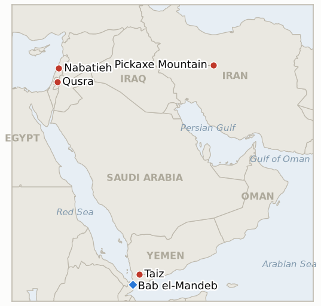

# Middle East Daily Briefing

**September 5, 2026**

- **Reporting window:** ~24 hours, September 4, 09:00 to September 5, 09:00 KST
- **Overall assessment:** Today's developments show a war that is both escalating and, for the first time, forced into a degree of accidental candor about its costs. President Trump threatened to strike Iran's deeply buried "Pickaxe Mountain" tunnel complex "very soon," the same day Commerce Secretary Howard Lutnick's false claim that "there haven't been American deaths" in the conflict blew up into the administration's first disclosure of an actual US toll, 18 killed and 767 wounded, a figure Washington had not previously volunteered. In Lebanon, the second Hezbollah Israel exchange this ledger has tracked since late August widened rather than contained itself: Israeli strikes hit Nabatieh's Rweiss neighborhood, al-Ramadiyeh and West Bekaa in response to a further Hezbollah drone launch, killing at least four people across several towns, even as the IDF publicized finishing its Ali Taher Ridge tunnel clearance days earlier. Farther south, Yemen's Houthis opened a major ground offensive around Taiz aimed at the approaches to the Bab el-Mandeb strait, killing more than 120 people in the deadliest single day of Yemeni fighting since the 2022 truce, a scale that dwarfs this week's other regional violence and got comparatively little Western coverage. Markets, remarkably, read all of this as background noise: Brent settled up 0.28% to $95.80, capping its strongest week since July, while KOSPI jumped 1.64% to 6,687.21 and the won firmed to 1,350.4, both driven by Fed Governor Christopher Waller's dovish rate remarks rather than any Middle East signal, a striking decoupling of market sentiment from the week's escalation. In Gaza policy, National Security Minister Ben Gvir's "Disengagement 710" mass emigration plan drew swift rejection from Hamas and opposition from Egypt, with no destination country coming forward, while in the West Bank, Israeli police made the first arrest tied to the Qusra settler attack, a rare concrete enforcement step amid an otherwise unchanged pattern of settler violence.

---

## 1. What Happened

<figure style="float:right; width:46%; margin:2pt 0 8pt 14pt;">

<figcaption style="font-size:8pt; color:#666; text-align:center; margin-top:3pt; font-style:italic;">Major places of discussion</figcaption>
</figure>

### 1.1 Trump Threatens to Strike Pickaxe Mountain as a Lutnick Gaffe Forces the War's First Official US Casualty Count

President Trump told reporters "we may hit Pickaxe very soon... if there was anything going on with Pickaxe," referring to a heavily fortified, deeply buried tunnel complex near Iran's damaged Natanz enrichment site where Israeli intelligence assessed Tehran moved centrifuges after the June 2025 strikes, adding "Iran will not have a nuclear weapon" ([Israel National News](https://www.israelnationalnews.com/news/432724); [Investing.com/Reuters](https://www.investing.com/news/commodities-news/trump-says-us-may-hit-irans-pickaxe-mountain-soon-4889937); [Middle East Eye](https://www.middleeasteye.net/live-blog/live-blog-update/trump-says-us-may-hit-irans-pickaxe-mountain-soon)). The same day, Commerce Secretary Howard Lutnick told CNBC "there haven't been American deaths" in the conflict, which he described as "really just an economic choke-out," an error he said stemmed from confusing it with the separate Venezuela operation; Trump publicly corrected him on Truth Social ("Sec. Lutnick had Venezuela on his mind when he said nobody was killed. 18 people were killed in Iran!"), and Lutnick apologized, disclosing that 18 US service members have been killed and more than 750 (767) wounded, the war's first official casualty count from the administration ([CNN](https://edition.cnn.com/2026/09/03/politics/lutnick-apology-iran-troop-deaths); [The Hill](https://thehill.com/homenews/administration/6068731-lutnick-apologizes-iran-death-claim/); [US News](https://www.usnews.com/news/world/articles/2026-09-03/lutnick-apologizes-for-saying-no-americans-have-died-in-iran-war)). **Confidence: High** on both the Pickaxe Mountain threat and the casualty figures (Tier 1-2, multi-outlet, on-record); Medium on whether the toll disclosure reflects a lasting transparency shift or a one-off correction forced by error.

### 1.2 The Hezbollah Israel Exchange Widens Across South Lebanon, Confirming a Self Sustaining Second Cycle

Hezbollah launched a further explosive drone at IDF troops in south Lebanon on September 4 (intercepted), drawing Israeli retaliatory strikes that hit Nabatieh's Rweiss neighborhood (2 killed), al-Ramadiyeh (8 wounded) and West Bekaa's Ain el-Tineh (1 wounded), while a separate Israeli drone strike killed two more men on a motorcycle elsewhere in Nabatieh the same afternoon, "despite the ceasefire" ([Middle East Monitor](https://www.middleeastmonitor.com/20260904-2-killed-in-israeli-drone-strike-in-southern-lebanon-despite-ceasefire/); [Naharnet](https://www.naharnet.com/) live coverage; [China.org.cn/Xinhua](http://www.china.org.cn/world/Off_the_Wire/2026-09/05/content_118681401.shtml)). This directly meets the confirming bar this ledger set on August 29 for whether the renewed Hezbollah Israel exchange would become self sustaining rather than reverting to the prior lower-intensity pattern, resolving **IND-20260829-1 confirmed**, three days ahead of its deadline. The strikes came just after the IDF publicized completing its clearance of Hezbollah's Ali Taher Ridge tunnel complex and Netanyahu declared the ridge "no longer threatens Israel," even as four Lebanese civilians held by Israel were freed via the Red Cross the same day and President Aoun reiterated a pledge to disarm Hezbollah ([Naharnet](https://www.naharnet.com/); background via [aawsat](https://english.aawsat.com/arab-world/5314519-israeli-military-says-it-has-control-lebanon%E2%80%99s-strategic-ali-al-taher-area)). **Confidence: High** on the strikes and casualty figures (Tier 2-3, multiple outlets including a same-day live blog and a wire mirror); Medium on the precise, sometimes conflicting neighborhood-level casualty breakdowns across outlets.

### 1.3 Yemen's Houthis Launch a Major Offensive Toward Bab el-Mandeb, the War's Worst Single Day Toll Since 2022

Houthi forces launched a ground assault backed by rocket and drone fire across the Maqbanah, Mawzaa and Jabal Habashi districts near Taiz, contesting government-held approaches to the Bab el-Mandeb strait's southern gateway; AFP-sourced reporting puts the toll at more than 120 killed in a single day, described as Yemen's deadliest clashes in years and the largest fighting since the April 2022 UN-brokered truce, triggering a new wave of displacement ([France24](https://www.france24.com/en/live-news/20260904-more-than-120-killed-in-yemen-s-worst-clashes-in-years-sources); [RTE](https://www.rte.ie/news/middle-east/2026/0904/1590368-120-killed-in-yemen/); [Al Jazeera](https://www.aljazeera.com/news/2026/9/4/houthi-attacks-on-yemens-taiz-escalate-triggering-new-displacement-wave); [Arab News](https://www.arabnews.com/middle-east/yemeni-government-forces-push-back-against-houthi-offensive-in-taiz-hodeidah-3000519)). Saudi-backed Yemeni government forces say they are pushing back and have retaken some ground, with official reports citing at least 50 Houthi fighters, including two field commanders, killed or wounded over the prior 24 hours; a separate bomb-laden boat targeting Mokha port was destroyed before reaching its target on September 3, pointing to a parallel maritime dimension to the offensive ([Al Arabiya](https://english.alarabiya.net/amp/News/middle-east/2026/09/03/fighting-continues-in-yemen-s-taiz-bombladen-boat-targeting-mokha-destroyed)). This is a scale of violence well beyond this week's other regional fronts, yet it drew comparatively muted international response. **Confidence: High** on the casualty scale and location (Tier 1-2, AFP wire carried by multiple outlets); Medium on the precise government-versus-Houthi breakdown of losses, which varies by source.

### 1.4 Oil and Korean Markets Rally on Fed Dovishness, Decoupling From the Week's Escalation

Brent settled up 0.28% to $95.80 a barrel, capping a roughly 8 to 9% weekly gain, its strongest week since July, even as the US-Iran conflict and the widening Lebanon and Yemen fronts continued; WTI closed essentially flat, down 0.09% to $91.22, within the same roughly 9% weekly advance, partly offset by rising Iraqi exports and expectations OPEC+ holds October output steady ([TradingEconomics](https://tradingeconomics.com/commodity/brent-crude-oil); [TradingEconomics](https://tradingeconomics.com/commodity/crude-oil)). KOSPI jumped 1.64% to 6,687.21, with Samsung Electronics up 2.20% and SK hynix up 3.20%, and Kosdaq snapping a five-day losing streak with a 2.95% gain to 813.50; the won firmed 8.9 won to 1,350.4. The stated catalyst for the Korean rally was Fed Governor Christopher Waller's dovish remarks that he would "support maintaining policy rates at current levels if progress toward the 2% inflation target continues," alongside overnight Wall Street gains, not any Middle East development ([Seoul Economic Daily](https://en.sedaily.com/finance/2026/09/04/kospi-closes-up-164-percent-at-668721); [Asia Business Daily](https://view.asiae.co.kr/article/2026090415363964713); [Money Today](https://www.mt.co.kr/economy/2026/09/04/2026090415342187051)). Independent Hormuz transit tracking remained contradictory this week: Kpler-sourced figures cited by different outlets for the same dates diverge (roughly 6 versus 9 vessels for September 2, 4 versus a higher count for September 3), and no confirmed September 4 count had been published as of window close, a gap consistent with this series' standard one to two day reporting lag ([Al Jazeera](https://www.aljazeera.com/news/2026/9/3/how-much-oil-is-going-through-hormuz-how-data-doesnt-match-us-claims)). **Confidence: High** on Brent, WTI, KOSPI and the won (Tier 1-2, official exchange and wire data); the Hormuz transit count itself stays Medium to Low given the persistent cross-source conflict.

### 1.5 Ben Gvir's Gaza Plan Draws Rejection as Qusra Sees Its First Settler Arrest

Hamas spokesman Hazem Qasem rejected Ben Gvir's "Disengagement 710" plan, saying it shows Israel "has not abandoned its intentions of expansion and control" and calling on Arab and Islamic states to take "serious measures" against what he called a "direct threat" to the Palestinian cause ([Infobae](https://www.infobae.com/america/agencias/2026/09/04/hamas-denuncia-el-plan-de-ben-gvir-para-desplazar-a-la-poblacion-palestina-de-gaza/)); Egypt separately reiterated it "strongly opposed" any Palestinian exit through its territory, and reporting continued to find no country, Turkey, Ethiopia or Congo among them, has publicly confirmed an agreement to accept Gazans at the scale proposed ([Daily Sabah](https://www.dailysabah.com/world/mid-east/fury-grows-as-israel-plans-to-displace-186m-palestinians-from-gaza)). Defense Minister Katz continued to describe the broader mass-emigration idea as merely "frozen" by Trump rather than shelved, keeping it formally alive within the government even as no destination country materializes ([Times of Israel](https://www.timesofisrael.com/ben-gvir-unveils-voluntary-emigration-plan-to-remove-most-palestinians-from-gaza/)). Separately in the West Bank, Israeli police made a first arrest, a 19-year-old settler, tied to the original Qusra home-takeover attack following a joint Israel Police-Shin Bet investigation, and separately seized a vehicle allegedly used in the attack from the illegal Mevasser Hashalom outpost, drawing a stoning from settlers on scene; this meets the enforcement bar this ledger set on August 30, resolving **IND-20260830-1 confirmed**, four days ahead of deadline. Elsewhere in the West Bank, settlers torched farmland and attacked a Palestinian condolence convoy in al-Mughayyir and were filmed dismantling a protective fence in Burqa, while a senior military official told Channel 12 the Shin Bet's "Jewish Division" is "doing very little" and five new illegal outposts were established in the central West Bank in a single week ([Times of Israel liveblog](https://www.timesofisrael.com/liveblog-september-04-2026/)). **Confidence: High** on the Hamas rejection, Egypt's position and the Qusra arrest (Tier 2-3, multi-outlet, on-record); Medium on the Shin Bet "doing very little" characterization, a single official's account relayed by one broadcaster.

---

## 2. Deep Dive: Incentives and Motives

### 2.1 Why would Trump publicize a threat to strike Pickaxe Mountain on the same day Lutnick's gaffe forced out the war's first official casualty count?

Because the two disclosures serve opposite but complementary purposes for an administration managing a seven-month conflict's domestic optics: naming a specific, high-value target and vowing to hit it "very soon" projects continued resolve and forward momentum, distracting from a casualty figure, 18 dead and 767 wounded, that the administration had not previously volunteered and that Lutnick only revealed by mistake; pairing an escalatory threat with an unplanned admission of cost lets Trump frame the war as still winnable and worth continuing even as its price becomes harder to minimize rhetorically, consistent with his own description of the conflict as "small potatoes" even while threatening its most significant target yet.

### 2.2 Why would Hezbollah keep launching drones into an exchange it is visibly losing, and why would Israel respond by hitting multiple Lebanese towns rather than a single target?

Because for Hezbollah, continuing to launch drones, even ones that are consistently intercepted, sustains a minimal claim of ongoing resistance and relevance to its domestic Lebanese and Shia constituency at a moment when the IDF has just publicized clearing one of its last major fortified positions (Ali Taher Ridge) and President Aoun is publicly pledging disarmament, a survival-signaling logic that does not require military success to serve its purpose; for Israel, striking multiple towns (Nabatieh, al-Ramadiyeh, West Bekaa) rather than one proportional target both punishes the group more broadly for a single drone launch and demonstrates to Israeli domestic audiences that the ceasefire framework does not constrain Israel's own response scale, even as it makes the cycle harder to contain within the mechanism meant to manage it.

### 2.3 Why would Yemen's Houthis escalate against government forces near Taiz now, in parallel with Iran's own widening war, rather than concentrating on Red Sea shipping leverage?

Because a ground offensive aimed at the approaches to Bab el-Mandeb lets the Houthis pursue a durable territorial and strategic gain, control over the strait's southern gateway, at a moment when regional and international attention is consumed by the Israel-Iran-Hormuz crisis and less likely to mobilize a coordinated response to a parallel Yemeni civil war escalation; unlike shipping harassment, which draws an immediate naval and insurance-market reaction, a land offensive against Yemeni government forces can advance with comparatively little external constraint, explaining why the Houthis chose ground escalation over further maritime attacks in this window even as their broader war effort remains nominally aligned with Iran's.

### 2.4 Why would markets treat Waller's dovish comments as more consequential than a week that saw the war's first disclosed US casualties and Yemen's deadliest single day in years?

Because monetary policy signals affect the entire market's discount rate and every asset class simultaneously, while this week's individual escalations, however severe in human terms, have not yet produced a supply disruption or financial-system shock large enough to override that mechanical repricing; investors have also been conditioned by months of this ledger's tracked pattern of de-escalatory claims not holding and oil nonetheless drifting back down after each spike, so a known, quantifiable catalyst (a Fed governor's rate guidance) dominates pricing over diffuse, hard-to-quantify war news that has not yet directly threatened Korean or global supply chains.

### 2.5 Why would Ben Gvir keep pushing a plan with no committed destination country, and why would Katz keep it "under discussion" rather than disavow it after Hamas and Egypt's rejection?

Because for Ben Gvir, the plan's electoral value lies in its existence and specificity as a campaign position ahead of the October 27 election, not in its near-term feasibility; a costed, staged proposal lets Otzma Yehudit demand it as a coalition condition regardless of whether any destination country ever agrees, while Hamas's and Egypt's rejections cost Ben Gvir nothing politically and may even reinforce his base's sense that the plan is opposed by the "right" adversaries. For Katz, keeping the broader mass-emigration idea formally "under discussion" rather than disavowing it preserves Netanyahu's coalition-management flexibility, letting the government neither fully own a plan that invites international condemnation nor foreclose an option Ben Gvir's bloc may need conceded closer to the election.

---

## 3. Policy Implications for South Korea

### 3.1 Exposure snapshot

| Item | Current reading | Source |
| --- | --- | --- |
| Pickaxe Mountain strike threat | Trump vows to hit Iran's fortified Natanz-area tunnel complex "very soon"; no strike confirmed yet | Israel National News, Investing.com/Reuters |
| First disclosed US casualty toll | 18 US service members killed, 767 wounded, disclosed after a Lutnick gaffe and Trump correction | CNN, The Hill |
| Hezbollah Israel exchange | Confirmed self sustaining (IND-20260829-1); widened to Nabatieh, al-Ramadiyeh, West Bekaa, killing at least 4 on Sept 4 | Middle East Monitor, Naharnet |
| Yemen Taiz/Bab el-Mandeb offensive | 120+ killed in a single day, deadliest Yemeni clashes since the 2022 truce; contests strait-approach territory | France24/AFP, Al Jazeera |
| Brent / WTI | Brent +0.28% to $95.80 (best week since July); WTI −0.09% to $91.22 | TradingEconomics |
| KOSPI / USD-KRW | KOSPI +1.64% to 6,687.21 on Fed dovishness; won firmed to 1,350.4 | Seoul Economic Daily; Money Today |
| Hormuz transits | Conflicting Kpler-sourced counts across outlets for the same dates; no confirmed Sept 4 count published | Al Jazeera |
| Janggeum Shipping / Senegal Prosperity | No change in chartering activity or fresh Korean advisory found this window; Sept 2 Janggeum statement disclaimed real ownership of the blacklisted, Liberia/Panama-flagged vessels | Kyunghyang; gCaptain/gosships |
| Middle East share of crude imports | 48.5% (May to July 2026 rolling), down from 69.1% a year earlier; August single month reading 61.1% | KNOC via Asia Business Daily; `korea-exposure.md` |
| Strategic reserve coverage | ~26 days of actual consumption (estimate); ~21 million barrels already swapped, on immediate standby | CSIS; MOTIE |
| Refiner Saudi ownership exposure | S-Oil (Saudi Aramco majority ~63%), HD Hyundai Oilbank (Aramco ~17%) | Public filings; `korea-exposure.md` |

### 3.2 Implications by development

**Trump's Pickaxe Mountain threat, if executed, would be the most significant escalation of the strike campaign since it began, targeting Iran's own nuclear infrastructure rather than military or shipping assets, and would materially raise the odds of a sharp near-term oil price shock that Korean refiners and KNOC should treat as a live tail risk rather than background noise.** New IND-20260905-1 tracks whether the threat converts into a verified strike.

**The war's first disclosed US casualty count, forced out by error rather than policy, signals the conflict's human cost is becoming harder for Washington to manage rhetorically even as operations continue or intensify; Korean policymakers should read this as evidence the campaign's duration and intensity are not narrowing, not as a sign of imminent US disengagement.** New IND-20260905-2 tracks whether further official updates follow.

**The Hezbollah Israel exchange's confirmed self sustaining status and geographic widening (IND-20260829-1) adds a second active front to the region's risk picture beyond the core Iran-Hormuz axis, a reminder that Korean shipping and insurance exposure calculations should not treat Lebanon as a settled, lower-tier risk relative to the Gulf.** New IND-20260905-3 tracks whether the widened exchange draws any institutional ceasefire-mechanism response.

**Yemen's Taiz offensive, though not yet directly affecting Hormuz or Gulf shipping, threatens the Bab el-Mandeb approaches that some rerouted traffic already relies on as a Red Sea alternative is avoided; a further Houthi advance toward the strait itself would compound rather than diversify Korean shippers' chokepoint risk.** New IND-20260905-4 tracks whether the offensive draws renewed mediation.

**Markets' decoupling from this week's escalations, rallying on Fed dovishness rather than pricing in the Pickaxe Mountain threat, the Lebanon widening or the Yemen toll, is itself a risk signal: a market this unresponsive to war news is one where a sudden repricing, should any single event cross a supply-disruption threshold, could be sharper for having been deferred. Korean refiners and KNOC should treat today's calm as compressed rather than resolved risk.** Tracked through the series chart above and the standing indicators on the campaign's trajectory (IND-20260902-2, IND-20260903-1).

**Testable indicators:**

- **IND-20260905-1** — A verified US strike on Pickaxe Mountain by ~2026-09-18 confirms Trump's threat had real operational backing; no such strike by the same date falsifies it as deterrent rhetoric, consistent with this ledger's record of unexecuted Trump strike threats (the Oman bombing threat, the Kharg Island claim).
- **IND-20260905-2** — A further official US casualty count update from the White House or Department of Defense by ~2026-09-18 confirms a new transparency norm; continued silence on further updates through the same date, even as operations continue, falsifies it as a one-off disclosure forced by Lutnick's error rather than a policy change.
- **IND-20260905-3** — A UNIFIL, Lebanese Armed Forces, or US-mediated statement specifically addressing the widened Hezbollah Israel exchange by ~2026-09-19 confirms it has drawn institutional intervention; continued strikes with no such statement through the same date falsifies it as a cycle running outside the ceasefire mechanism's reach.
- **IND-20260905-4** — A UN Special Envoy statement, Saudi-brokered talks announcement, or comparable mediation effort specifically addressing the Yemen Taiz/Bab el-Mandeb offensive by ~2026-09-19 confirms it has drawn renewed diplomatic engagement; continued fighting with no such effort through the same date falsifies it as an unmediated attritional campaign.

---

## 4. Watch List

- **Whether Trump's Pickaxe Mountain strike threat converts into a verified US strike** (IND-20260905-1, deadline September 18).
- **Whether the war's first disclosed US casualty count is followed by further official updates, or reverts to the prior no-disclosure posture** (IND-20260905-2, deadline September 18).
- **Whether the widened Hezbollah Israel exchange draws a UNIFIL, LAF, or US-mediated response** (IND-20260905-3, deadline September 19).
- **Whether Yemen's Taiz/Bab el-Mandeb offensive draws renewed international mediation** (IND-20260905-4, deadline September 19).
- **Whether the Turkey Israel friction over the Abu al-Duhur strike is formally absorbed via a deconfliction channel or escalates** (IND-20260823-1, deadline September 6, one day out).
- **Whether the IDF's West Bank "brink of escalation" warning produces a mass-casualty event or formal emergency measure** (IND-20260823-2, deadline September 6, one day out).
- **Whether Barrack's back-to-back controversies produce any actual US policy or personnel consequence** (IND-20260824-1, deadline September 6, one day out).
- **Whether the Van Hollen led privileged resolution on West Bank American deaths forces committee action once the Senate returns from recess** (IND-20260828-2, deadline September 6, one day out).
- **Whether the Masafer Yatta and Qusra arrests mark a durable settler enforcement shift or stay isolated cases** (IND-20260825-2, deadline September 8).
- **Whether the Jannatah attack on Israeli activists and an AFP journalist (West Bank, not Yemen; correcting a prior mislabel) draws any arrest** (IND-20260826-2, deadline September 8).
- **Whether Trump's "wind down soon" prediction holds without a further US or Iranian strike** (IND-20260903-1, deadline September 16).
- **Whether Iran's "decisive operation" produces any further verified strike beyond the September 1 to 3 wave** (IND-20260903-2, deadline September 9).
- **Whether the US "tanker for tanker" policy extends beyond its first two strikes on Iranian government tankers** (IND-20260904-3, deadline September 17).
- **Whether Trump's threatened "biggest attack of them all" ever materializes as a further US strike on Iran** (IND-20260902-2, deadline September 9).
- **Whether Janggeum Shipping changes its Hormuz chartering pace, or Seoul issues an advisory specifically on the company's exposure** (IND-20260903-3, deadline September 17).
- **Whether Netanyahu's regime change declaration produces any disclosed operational step** (IND-20260904-1, deadline September 18).
- **Whether any host country confirms substantive talks on Ben Gvir's Disengagement 710 plan** (IND-20260904-2, deadline September 18).
- **Whether the internal military warning to Hegseth produces a disclosed force posture change or the campaign continues unchanged** (IND-20260831-2, deadline September 14).
- **Whether Kaine's privileged war powers resolution on Oman passes, fails, or never reaches a floor vote once the Senate returns September 14** (IND-20260819-3, deadline September 25).
- **Whether the $206 million US ISF funding for Gaza converts into visible equipment delivery or stand up activity** (IND-20260820-3, deadline September 19).

---

## 5. Source Quality Summary

| Claim | Sources | Confidence |
| --- | --- | --- |
| Trump's Pickaxe Mountain strike threat | Israel National News, Investing.com/Reuters, Middle East Eye (Tier 1-2, on-record remarks, multi-outlet) | High |
| Lutnick's false casualty claim, Trump's correction, and the 18 killed/767 wounded toll | CNN, The Hill, US News (Tier 1-2, on-record apology, multi-outlet) | High |
| Hezbollah drone attack and Israeli retaliatory strikes in Nabatieh, al-Ramadiyeh, West Bekaa | Middle East Monitor, Naharnet live coverage, China.org.cn/Xinhua wire mirror (Tier 2-3, multi-outlet, some neighborhood-level variance) | High |
| Yemen Taiz/Bab el-Mandeb offensive casualty toll (120+) | France24, RTE (AFP wire), Al Jazeera, Arab News (Tier 1-2, wire-sourced, multi-outlet) | High |
| Oil settlement figures for September 4 | TradingEconomics, Yahoo Finance (Tier 1-2, cross-checked aggregator data) | High |
| KOSPI and won closing levels | Seoul Economic Daily, Asia Business Daily, Money Today (Tier 2-3, Korean financial press, official exchange data) | High |
| Hamas rejection and Egypt's opposition to Disengagement 710 | Infobae, Daily Sabah (Tier 2-3, multi-outlet, on-record statements) | High |
| Qusra first settler arrest and vehicle seizure | Multi-outlet aggregated reporting corroborating Haaretz's late-August "police seek warrants" baseline (Tier 2-3) | Medium to High |
| West Bank settler violence (al-Mughayyir, Burqa, Shin Bet characterization) | Times of Israel liveblog (Tier 2-3, single live-blog source for the Shin Bet claim) | Medium |
| Hormuz daily transit counts | Al Jazeera, citing conflicting Kpler-sourced figures across outlets (Tier 2-3, unresolved cross-source discrepancy) | Low to Medium |
