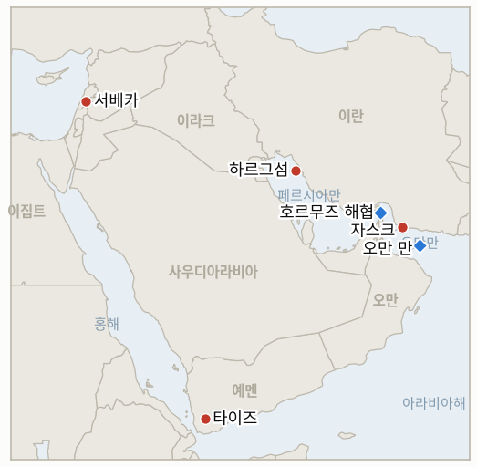

# 중동 일일 브리핑

**2026년 9월 6일**

- **보고 기간:** 약 24시간, 9월 5일 09:00 ~ 9월 6일 09:00 (한국시간)
- **종합 평가:** 전쟁은 주말 사이 미국과 이란 간 가장 직접적인 군사 충돌 국면으로 접어들었다. 혁명수비대가 미 항공모함과 이지스구축함에 탄도미사일을 발사했으나 두 함정 모두 공격을 회피했고, 중부사령부는 몇 시간 만에 이란 국영 유조선 세 척을 파괴 또는 무력화하며 응수했다. 지역사령관은 자국 함정에 총 한 발이라도 발사되면 "더 높은 경제적 대가를 치르게 하겠다"고 선언했다. 이란은 유조선 공습을 전쟁범죄로 규정하고 해상 봉쇄가 계속되면 미 함정에 "더 가혹한" 공격을 가하겠다고 위협했으며, 이번 교전은 트럼프 대통령이 사흘 전 내놓은 "곧 전쟁이 잦아들 것"이라는 예측을, 2주짜리 검증 기간이 4분의 1도 지나기 전에 반증시켰다. 한국에는 이번 주말이 전쟁이 야기한 가장 직접적인 국내 정책 파장으로 다가왔다. 서울 정부가 수개월간 이어진 트럼프의 압박 끝에 지원함과 초계기, 약 150명의 병력을 호르무즈 해협에 파병하는 방안을 공식적으로 준비하기 시작했으며, 이는 예정된 국회 표결을 앞두고 여당인 더불어민주당과 진보 연정 파트너 사이에 뚜렷한 균열을 드러내고 있다. 예멘 내전 또한 새로운 국면에 접어들어, 국제적으로 인정받는 정부가 이번 재개된 공세에서 처음으로 자국 공군을 후티 세력과의 직접 전투에 투입했고, 같은 시각 후티의 탄도미사일이 타이즈 남부의 붐비는 도로에서 민간인들을 살상했다. 레바논에서는 금요일 헤즈볼라·이스라엘 교전이 처음 보도된 것보다 더 치명적이고 지리적으로 광범위했던 것으로 드러나, 사망자 수가 상향 조정되고 공습이 6월 이후 처음으로 서베카까지 확대됐다. 그리고 이 지표 장부 자체의 회계에서는, 튀르키예·이스라엘 마찰, 서안지구 대응, 미국 특사 톰 배럭의 논란, 상원 특권 결의안을 각각 추적해온 오래된 지표 네 건이 모두 9월 6일 동일 시한에 도달했고, 모두 반증으로 종결되며 "구체적으로 명명된 제도적 조치에 대한 예측은 분쟁 지속 예측보다 계속 성과가 떨어진다"는 이 장부의 기존 결론을 다시 한번 뒷받침했다.

---

## 1. 무슨 일이 있었나

<figure style="float:right; width:46%; margin:2pt 0 8pt 14pt;">

<figcaption style="font-size:8pt; color:#666; text-align:center; margin-top:3pt; font-style:italic;">주요 논의 지점</figcaption>
</figure>

### 1.1 이란, 개전 이후 처음으로 미 해군 함정에 발포하고 미국은 이란 유조선 세 척을 파괴하며 응수하다

토요일 혁명수비대 해군이 인근 해역을 순찰 중이던 미 항공모함과 이지스구축함에 탄도미사일을 발사했다. 개전 이후 이란이 상선이나 제3국 선박이 아닌 미 해군 함정을 직접 표적으로 삼은 것은 이번이 처음이다. 두 함정 모두 공격을 회피했으며, 중부사령부는 미군 피해가 없었다고 밝혔다([Jerusalem Post](http://www.jpost.com/middle-east/iran-news/article-907641); [CENTCOM](https://www.centcom.mil/MEDIA/PUBLIC-RELEASES/Article/4591744/centcom-destroys-3-irgc-oil-tankers-after-iran-targets-2-us-navy-warships/); [NPR](https://www.npr.org/2026/09/05/nx-s1-5959159/us-iran-warships-targeted)). 몇 시간 뒤 중부사령부는 혁명수비대와 그 대리세력의 자금줄이라고 규정한 이란 국영 유조선 세 척을 타격했다. 하르그섬 인근의 다우니호는 영구 무력화됐고, 자스크 인근의 스타크 1호도 무력화됐으며, 오만 만에서는 화물을 싣지 않은 카일로호가 승조원 대피 후 파괴됐다([Al Jazeera](https://www.aljazeera.com/news/2026/9/5/us-says-it-hit-iran-oil-tankers-helping-finance-regional-proxies); [CNN](https://edition.cnn.com/2026/09/05/middleeast/iran-us-tanker-kharg-intl)). 중부사령관 브래드 쿠퍼 제독은 "우리 함정 두 척에 발포하면 우리는 너희 배 세 척을 파괴해 더 높은 경제적 대가를 치르게 하겠다"며 "미군 방어를 위해 필요하다면 주저 없이 이란의 제한적이고 노출된 유조선단을 파괴하겠다"고 밝혔다([RedState](https://redstate.com/streiff/2026/09/05/centcom-invokes-chicago-rules-to-deal-with-iranian-missile-attacks-n2206547)). 이란 외무부는 유조선 공습을 "불법적이고 침략적인" 전쟁범죄라고 규정했고, 이란군은 별도로 해상 봉쇄가 계속되면 미 함정에 "더 가혹한" 공격을 가하겠다고 경고했다([Times of Israel](https://www.timesofisrael.com/liveblog-september-05-2026/); [Washington Times](https://www.washingtontimes.com/news/2026/sep/5/iran-accuses-us-military-targeting-tanker-near-kharg-island/)). 이는 이란 국영 유조선에 대한 추가 검증된 미국의 공습에 해당해 **IND-20260904-3이 시한보다 12일 앞서 확증**으로 종결됐고, 양측이 모두 공격을 주고받은 이번 교전은 2주짜리 검증 기간이 겨우 나흘째로 접어든 시점에 발생해 **IND-20260903-1이 반증**으로 종결됐다. 트럼프 대통령이 9월 2일 내놓은 "곧 전쟁이 잦아들 것"이라는 예측은 자체 검증 기간의 4분의 1도 버티지 못했다. **신뢰도: 높음** (사건 경과와 양측 군의 공식 발표, 1~2등급 출처, 미 중부사령부 공식 발표 및 다수 매체 교차 확인); 정확한 미사일 발사 수와 이란 발사체가 실제로 얼마나 근접했는지는 중부사령부가 공개하지 않아 **중간**.

### 1.2 한국, 호르무즈 파병 준비를 공식화하며 여당 내 균열이 드러나다

블룸버그와 서울경제는 한국 정부가 수개월간 이어진 트럼프의 압박 끝에 지원함 소양함과 P-8A 포세이돈 해상초계기를 호르무즈 해협에 파견하는 방안을 공식적으로 준비하기 시작했다고 보도했다. 서울은 지난달 이미 워싱턴에 해당 자산을 파견할 의사를 통보했으며, 운용 인력으로 약 150명이 필요하다. 국회 승인을 구하는 동의안은 이르면 이달 중 제출될 수 있으며, 실제 표결은 이재명 대통령의 9월 18일부터 28일까지 유엔총회 방문 일정에 맞춰 이뤄질 것으로 전망된다([Bloomberg](https://www.bloomberg.com/news/articles/2026-09-04/south-korea-paving-way-to-send-troops-to-hormuz-reports-say); [gCaptain](https://gcaptain.com/korea-paving-way-to-send-naval-ship-to-hormuz-reports-say/)). 이번 조치는 트럼프 대통령이 수개월째 한국의 이란전 불참을 공개적으로 비판해온 데 따른 것으로, 이미 미국은 한미 연합 군사훈련을 일주일 단축한 바 있다([Yahoo Finance](https://finance.yahoo.com/economy/policy/articles/south-korea-paving-way-send-010455728.html)). 이번 파병 방안은 한국 여권 내부에 뚜렷한 균열을 드러내고 있다. 더불어민주당 이기헌 의원은 "국익과 헌법적 가치를 지키기 위해" 파병에 동의할 수 없다고 밝혔고, 진보당 정혜경 의원은 이재명 대통령이 "전쟁에 가담할 것이 아니라 전쟁을 멈춰야 한다"고 주장했으며, 조국혁신당 김준형 원내대표는 윤석열 정부조차 우크라이나 전쟁에 공개적으로 파병하지 않았는데 왜 한국이 이 전쟁에 병력을 보내야 하느냐고 반문했다([서울경제](https://en.sedaily.com/politics/2026/09/05/hormuz-deployment-splits-koreas-ruling-bloc-again)). 대통령실 고위 관계자는 파병이 여전히 검토 중이라고 확인하며, 한국이 원유의 약 70%를 중동과 호르무즈 해협에 의존하고 있다고 언급했다. **신뢰도: 높음** (검토 중인 구체적 자산과 여권 균열, 1~2등급 출처, 블룸버그 및 한국 경제지, 실명 의원 다수 인용); 실제 국회 표결 시기와 결과는 아직 확정되지 않아 **중간**.

### 1.3 예멘 정부, 처음으로 타이즈 전선에 자국 공군을 투입하다

예멘의 국제적으로 인정받는 정부가 금요일 타이즈 서부 해안 전선의 후티 진지를 상대로 15회 이상의 공습을 감행했다. 이는 9월 3일 재개된 이번 공세에서 정부군이 처음으로 직접 항공전에 나선 사례로, 그에 앞서 며칠간 후티 세력은 마크바나·마우자·자발 하바시 일대에서 지상 진격을 이어왔다([Al Jazeera](https://www.aljazeera.com/news/2026/9/5/yemen-government-launches-own-air-attacks-on-houthis-what-that-means); [Yemen Monitor](https://www.yemenmonitor.com/en/Details/ArtMID/908/ArticleID/180967)). 정부 관계자들은 이번 작전으로 지휘관 2명을 포함해 후티 전투원 수십 명이 사망했고 일부 지역을 탈환했다고 밝혔다. 한편 토요일에는 후티의 탄도미사일이 타이즈시 남쪽 헤이자 알아브드 도로를 지나던 차량들을 강타했다. 타이즈와 라흐즈주를 잇는 이 요충 도로에서 최소 민간인 4명이 숨지고 9명이 다쳤으며, 버스 한 대가 파괴되고 도로가 일시 폐쇄됐다([Al Jazeera](https://www.aljazeera.com/news/2026/9/5/at-least-four-killed-in-houthi-missile-strike-near-yemens-taiz)). 유엔 인도주의 조정 기구는 9월 3일 전투 재개 이후 약 1,790가구가 피란한 것으로 집계했다([The National](https://www.thenationalnews.com/news/mena/2026/09/05/yemen-government-appeals-to-support-thousands-of-people-displaced-by-renewed-war/)). 신규 **IND-20260906-3**은 정부 공군이 공습을 계속할지, 아니면 이번이 일회성 무력시위에 그칠지를 추적한다. **신뢰도: 높음** (정부 공습과 헤이자 알아브드 도로 민간인 피해, 1~2등급 출처, AFP 및 알자지라 계열, 다수 매체 교차 확인); 후티 측 정확한 사상자와 탈환 지역 주장은 정부 측 발표에만 의존해 **중간**.

### 1.4 레바논, 금요일 교전 사망자 수가 상향 조정되고 공습이 6월 이후 처음으로 서베카까지 확대되다

레바논 보건부는 금요일 나바티예 르웨이스 지구, 알라마디예, 서베카 일대에 대한 이스라엘 공습 사망자 수를 애초 3명 사망·23명 부상에서 5명 사망·24명 부상으로 상향 조정했다. 이스라엘군은 점령 완충지대 내 병력을 겨냥한 헤즈볼라의 드론 공격 시도에 대한 보복이라고 밝혔다([Antiwar.com](https://news.antiwar.com/2026/09/05/flurry-of-israeli-strikes-in-southern-eastern-lebanon-kill-5-wound-24/); [Arab News](https://www.arabnews.com/middle-east/israeli-strikes-kill-three-injure-23-in-south-and-east-lebanon-3000550)). 개별 공습 보도에 따르면 나바티예 지구에서 오토바이를 타고 있던 2명이 숨졌고, 르마디예의 한 주택에 대한 공습으로 어린이를 포함해 3명이 추가로 사망했다. 아인 엘티네를 강타한 서베카 공습은 6월 이후 처음으로 해당 지역에서 발생한 이스라엘 공습으로, 9월 5일 **IND-20260829-1이 확증**으로 종결된 패턴을 넘어서는 지리적 확대다([The National](https://www.thenationalnews.com/news/mena/2026/09/05/israel-widens-lebanon-strikes-after-announcing-control-of-strategic-ali-al-taher-ridge/)). 이번 공습은 이스라엘군이 헤즈볼라의 알리 알타헤르 능선 터널 단지 소탕 완료를 공표한 직후 이뤄졌다. **신뢰도: 높음** (상향 조정된 사망자 수와 공습 지점, 1~3등급 출처, 레바논 보건부 집계를 다수 통신사가 인용); 개별 지역 단위 사상자 귀속은 매체별로 다소 차이가 있어 **중간**.

### 1.5 오랫동안 추적해온 지표 네 건이 9월 6일 동일 시한에 도달해 모두 반증으로 종결되다

8월 23일부터 28일 사이 개설된 지표 네 건이 오늘 같은 시한을 맞았고, 네 건 모두 같은 방향으로 종결됐다. 톰 배럭 특사의 아부 알두후르 "미끼" 발언은 튀르키예의 군사적 대응이나 외교 단절로 이어지지 않았고 양국은 대신 디컨플릭션 채널을 논의 중이어서 **IND-20260823-1이 반증**으로 종결됐다. 서안지구가 "한계점"에 있다는 이스라엘군의 비공개 경고는, 지속적으로 높은 강도의 정착민 폭력이 이어졌음에도 대량 사상자 사건이나 공식 비상조치로 이어지지 않아 **IND-20260823-2가 반증**으로 종결됐다. 배럭의 연이은 논란, 즉 아부 알두후르 발언과 골란고원 관련 정정 발언은 국무부의 공식 성명이나 보직 변경으로 이어지지 않아 **IND-20260824-1이 반증**으로 종결됐다. 그리고 크리스 밴홀런 상원의원이 주도한 서안지구 미국인 사망 관련 특권 결의안은 자체 10일 시한 내에 위원회 심사나 본회의 표결로 이어지지 못했으며, 상원은 9월 14일까지 휴회 중이어서 **IND-20260828-2가 반증**으로 종결됐다. **신뢰도: 높음** (네 건 모두, 추적 기간 전반에 걸쳐 어떠한 문서화된 조치도 확인되지 않음, 1~2등급 출처, 다수 매체를 통한 공식 침묵 확인).

---

## 2. 심층 분석: 유인과 동기

### 2.1 이란은 왜 지금 이 전쟁에서 가장 위험한 조치인 미 해군 함정에 대한 직접 발포를 감행했나?

미국이 수주간 이란 유조선과 석유 시설, 혁명수비대 표적을 타격해왔음에도 이란이 미군 자산에 직접 보복하지 않아온 가운데, 해상 봉쇄가 실제 군사적 대가를 수반한다는 것을 입증해야 한다는 테헤란 내부의 정치적 압박이 커지고 있었기 때문이다. 특히 이란 국회의장이 이번 주 초 봉쇄 확대가 계속되면 군사적 대응이 뒤따를 것이라고 경고한 바 있다. 미 해군 함정에 발포하는 것은, 비록 두 함정 모두 회피에 성공한 실패한 시도였지만, 실제 타격 없이도 "선을 그었다"고 주장할 수 있게 해주는 조치로, 공격이 (실제로 그랬듯) 실패해도 최소한의 위험으로 최대한의 수사적 효과를 노린 결의 표시다.

### 2.2 중부사령부는 왜 실패한 이란의 공격에 대해 군사 표적이 아닌 유조선을 2대 3 비율로 겨냥해 대응했나?

이란 자체의 유조선단을 타격하는 것은, 미국인 사상자를 전혀 내지 않은 공격에 대한 직접 대응으로 혁명수비대 기지나 병력을 타격할 때 수반되는 확전 위험을 피하면서도, 중부사령부가 "지역 대리세력" 자금줄이라고 명시한 정권의 석유 수입에 경제적 대가를 부과할 수 있게 해주기 때문이다. 쿠퍼 제독이 밝힌 "더 높은 경제적 대가" 프레이밍 자체가 무력에는 반드시 무력으로 맞대응하지 않고도 무한정 반복 가능한, 비대칭적이고 경제적으로 계산된 보복 원칙을 의도적으로 신호한 것이다.

### 2.3 서울은 왜 자국 여당의 분열이라는 국내 정치적 비용을 감수하면서까지 지금 호르무즈 파병으로 움직이고 있나?

파병 결정은 "전쟁이 끝난 뒤에야 움직이겠다"는 기존 입장 아래 수개월째 미뤄져 왔으나, 계속되는 유예가 이제 지속적이고 공개적인 트럼프의 압박, 그리고 서울이 계속 거부할 경우 동맹 관계에 실질적 비용이 따른다는 것을 시사한 한미 연합훈련 단축과 충돌하고 있기 때문이다. 지금 파병을 추진하는 것은, 비록 여권 내 분열이 뚜렷해지는 대가를 치르더라도, 이재명 대통령이 유엔총회 참석을 앞두고 동맹에 대한 호응 의지를 보여줄 수 있게 해준다. 동시에 이번 파병안이 비전투 자산(지원함, 초계기, 기뢰 제거)에 초점을 맞춘 것은, 진보 연정 파트너들이 훨씬 받아들이기 어려워할 전투 임무에 한국군을 투입하지 않으면서도 워싱턴을 만족시키려는 계산이 반영된 것이다.

### 2.4 예멘 정부는 왜 지금, 지상군과 연합군 지원에만 의존하는 대신 자국 공군을 직접 투입하는 위험을 감수했나?

9월 3일 시작된 후티의 지상 공세가 이미 2022년 휴전 이후 예멘에서 가장 치명적인 단일 사망자 규모를 기록하고 거의 1,800가구를 피란시킨 상황에서, 지상군에만 계속 의존하는 것은 분쟁 지역을 방어할 수 있음을 입증하는 데 정당성이 걸려 있는 정부로서는 정치적으로 감당하기 어려워졌기 때문이다. 공군을 투입하는 것은, 비록 후티와의 확전 위험과 이스라엘·이란 위기에 국제적 관심이 쏠린 상황에서 무력을 사용한다는 외교적 부담을 감수하더라도, 정부가 수동적 방어가 아닌 능동적 전장 주도권을 쥐고 있다고 주장할 수 있게 해준다.

### 2.5 6월 이후 잠잠했던 서베카가 공습 지점으로 재활성화된 것은 단일 사건의 사망자 수를 넘어 왜 중요한가?

두 달 넘게 잠잠했던 공습 지점이 다시 활성화됐다는 것은, 지난 8월 말 이후 이 장부가 교전의 주요 무대로 추적해온 좁은 나바티예 회랑을 넘어 헤즈볼라의 작전 반경이나 의도가 확대됐다는 이스라엘 자체의 판단을 시사하기 때문이며, 서베카가 시리아 국경에 더 가깝고 휴전 체제가 구축된 완충지대에서 더 멀리 떨어져 있다는 점에서, 그곳에서의 지속적인 활동은 애초에 휴전 메커니즘이 억제하도록 설계된 지리적 경계 자체를 시험하는 사안이 될 것이기 때문이다.

---

## 3. 한국에 대한 정책적 함의

### 3.1 익스포저 현황

| 항목 | 현재 수치 | 출처 |
| --- | --- | --- |
| 미·이란 해상 충돌 | 혁명수비대 미사일이 미 해군 함정 두 척을 빗나감; 중부사령부는 이란 유조선 세 척을 파괴·무력화하며 대응 | CENTCOM, Jerusalem Post |
| 한국 호르무즈 파병 | 지원함, P-8A 항공기, 약 150명 병력 공식 준비 중; 이재명 대통령의 9월 18~28일 유엔총회 일정에 맞춰 국회 표결 전망 | Bloomberg, 서울경제 |
| 예멘 타이즈/바브엘만데브 공세 | 정부 공군이 처음으로 후티를 직접 타격; 9월 3일 이후 120명 이상 사망, 약 1,790가구 피란 | Al Jazeera, The National |
| 헤즈볼라·이스라엘 교전 | 자기지속적 성격 확증(IND-20260829-1); 6월 이후 처음으로 서베카까지 확대, 사망자 수 5명·부상 24명으로 상향 | Antiwar.com, The National |
| 브렌트유/WTI | 주말로 시장 휴장, 신규 종가 없음; 최종 확인된 9월 4일(금) 수준: 브렌트 95.80달러, WTI 91.22달러 | TradingEconomics |
| 코스피/원달러 환율 | 신규 종가 없음; 최종 확인된 9월 4일(금) 수준: 코스피 6,687.21, 원화 1,350.4원 | 서울경제; 머니투데이 |
| 호르무즈 통항량 | 소급 반영된 9월 3일(목) 수치: 4척(Kpler 자료, BOE Report 경유); 동일 날짜에 대해 6척이라는 상반된 수치도 존재, 9월 4·5일 수치는 미발표 | BOE Report; Al-Monitor |
| 중동산 원유 수입 비중 | 48.5%(5~7월 이동평균), 전년 동기 69.1%에서 하락; 8월 단월 수치는 61.1% | KNOC, 아시아경제 경유; `korea-exposure.md` |
| 전략비축유 대응 여력 | 실제 소비 기준 약 26일분(추정); 이미 스와프된 약 2,100만 배럴이 즉시 대기 상태 | CSIS; 산업통상자원부 |
| 정유사 사우디 지분 익스포저 | S-Oil(사우디 아람코 지분 약 63%), HD현대오일뱅크(아람코 지분 약 17%) | 공시자료; `korea-exposure.md` |

### 3.2 사안별 함의

**이번 전쟁 최초의 혁명수비대발 미 해군 함정 직접 공격, 그리고 이것이 촉발한 탱커 대 탱커 대응 원칙은 해상 대치가 선박 대상 위협 수준에 머물지 않고 종류 자체가 확대되고 있다는 가장 분명한 증거다. 한국 해운업계와 한국석유공사는 오판에 따른 공격이 한국 국적 또는 한국 운영 선박을 직접적인 교전 상황으로 끌어들일 위험이 안정적이 아니라 상승 중이라고 봐야 한다.** 신규 IND-20260906-1은 이란이 미 해군 자산에 대한 직접 공격을 반복할지를 추적한다.

**한국 정부의 호르무즈 파병 준비는 이 전쟁과 한국 정책 사이에서 이 장부가 추적해온 가장 직접적인 연결고리다. 여당 내 분열은 파병의 실제 규모와 시기, 심지어 파병 자체의 실현 여부까지 아직 결정되지 않은 1차적 정책 불확실성임을 의미한다.** 신규 IND-20260906-2는 파병안이 국회 표결에 도달할지, 아니면 무산될지를 추적한다.

**예멘 정부가 자국 공군을 타이즈 전선에 직접 투입한 것은, 비록 아직 호르무즈나 걸프 해상 운송에 직접적인 사건은 아니지만, 이미 우회 운항 중인 한국 관련 물동량이 의존하는 바브엘만데브 접근로의 위험을 키운다. 이곳에서의 추가 확전은, 서울이 자체 호르무즈 파병을 저울질하는 바로 이 시점에 초크포인트 위험을 분산시키기보다 오히려 가중시킬 것이다.** 신규 IND-20260906-3은 정부군의 공중 작전 지속 여부를 추적한다.

**이번 보고 기간 동안 원유·코스피·원화의 신규 종가가 전혀 없었다는 사실 자체가 소극적 의미에서만 유의미하다. 이번 주말의 어떤 확전도, 그 심각성에도 불구하고 아직 월요일 개장 전 리프라이싱을 촉발할 만큼의 파급력을 보이지 않았다는 뜻이며, 따라서 월요일 개장은 시장이 이번 해상 충돌을 이번 주 누적된 다른 긴장 완화 실패들과 어떻게 견주어 평가하는지를 보여줄 첫 실질적 시험대가 될 것이다.** 위 시계열 차트와 캠페인 궤적을 추적하는 상시 지표(IND-20260902-2, IND-20260906-1)를 통해 계속 추적한다.

**오늘 동일 시한에 도달한 지표 네 건이 모두 반증으로 종결된 것은, 외교적 단절이나 공식 비상조치, 행정부 성명, 상원 표결처럼 구체적으로 명명된 제도적 조치에 대한 예측이 분쟁 자체가 지속된다는 예측보다 계속 성과가 떨어진다는 이 장부의 기존 결론을 다시 뒷받침한다. 한국 정책 당국은 오늘의 해상 확전에 대해서도 동일한 기저율을 적용해, 이에 대한 어떤 단일한 긴장 완화 주장도 이 장부가 반복적으로 검증해온 것과 같은 수준의 회의적 시각으로 받아들여야 한다.** `tracking/indicators.md`의 자체 검증 기록을 통해 추적한다.

**검증 가능한 지표:**

- **IND-20260906-1** — 2026년 9월 19일까지 이란 혁명수비대가 미 해군 함정을 추가로 공격한 사실이 검증되면 지속적인 직접 군사 대치 패턴을 확증하는 것이고, 같은 날짜까지 추가 공격이 없으면 이번이 단발성 실패 시도였음을 반증하는 것이다.
- **IND-20260906-2** — 2026년 9월 28일까지 한국의 호르무즈 파병안에 대한 국회 본회의 표결(가결이든 부결이든)이나 공식 동의안 제출이 이뤄지면 이 사안이 실제 제도적 결정 단계에 도달했음을 확증하는 것이고, 같은 날짜까지 동의안 제출이나 표결 없이 당내 논쟁만 계속되면 근시일 내 결론이 나지 않았음을 반증하는 것이다.
- **IND-20260906-3** — 2026년 9월 19일까지 예멘 정부 공군이 후티 진지에 대한 추가 공습을 실시한 사실이 검증되면 지속적인 직접 전투 역할 수행을 확증하는 것이고, 같은 날짜까지 추가 공습 없이 지상 작전으로만 회귀하면 이번이 일회성 무력시위였음을 반증하는 것이다.

---

## 4. 관찰 목록

- **이란이 미 해군 함정에 대한 직접 공격을 반복할지 여부** (IND-20260906-1, 시한 9월 19일).
- **한국의 호르무즈 파병안이 국회 본회의 표결이나 공식 동의안 제출에 도달할지, 아니면 여권 내 반대로 무산될지 여부** (IND-20260906-2, 시한 9월 28일).
- **예멘 정부 공군이 첫 공습 이후에도 후티 진지에 대한 공습을 계속할지 여부** (IND-20260906-3, 시한 9월 19일).
- **트럼프의 픽액스 마운틴 타격 위협이 실제 미군 타격으로 이어질지 여부** (IND-20260905-1, 시한 9월 18일).
- **전쟁 최초로 공개된 미군 사상자 집계 이후 추가 공식 발표가 이어질지 여부** (IND-20260905-2, 시한 9월 18일).
- **서베카까지 확대된 헤즈볼라·이스라엘 교전이 유엔레바논평화유지군(UNIFIL), 레바논군, 또는 미국 중재의 대응을 이끌어낼지 여부** (IND-20260905-3, 시한 9월 19일).
- **예멘 타이즈/바브엘만데브 공세가 새로운 국제 중재를 이끌어낼지 여부** (IND-20260905-4, 시한 9월 19일).
- **마사페르 야타와 쿠스라 체포가 지속적인 정착민 단속 전환을 의미하는지, 아니면 고립된 사례로 남을지 여부** (IND-20260825-2, 시한 9월 8일).
- **자나타에서 이스라엘 활동가와 AFP 기자를 공격한 사건이 체포로 이어질지 여부** (IND-20260826-2, 시한 9월 8일).
- **이란의 "결정적 작전"이 9월 1~3일 공격 물결 이후 요르단, 바레인, 이라크, 쿠웨이트에 대한 추가 검증된 공격으로 이어질지 여부** (IND-20260903-2, 시한 9월 9일).
- **트럼프가 위협한 이란 영토에 대한 "가장 큰 공격"이 실제로 일어날지 여부** (IND-20260902-2, 시한 9월 9일).
- **장금상선이 호르무즈 용선 속도를 바꾸거나, 서울이 해당 기업의 익스포저에 대해 구체적으로 권고할지 여부** (IND-20260903-3, 시한 9월 17일).
- **네타냐후의 정권교체 선언이 실제 작전 단계로 이어질지 여부** (IND-20260904-1, 시한 9월 18일).
- **벤그비르의 디스인게이지먼트 710 계획에 대해 수용국이 실질적 협상을 확인할지 여부** (IND-20260904-2, 시한 9월 18일).
- **헤그세스 국방장관에 대한 군 내부 경고가 실제 전력 태세 변화로 이어질지 여부** (IND-20260831-2, 시한 9월 14일).
- **케인 의원의 오만 관련 전쟁권한 결의안이 9월 14일 상원 복귀 후 가결·부결되거나 끝내 표결에 오르지 못할지 여부** (IND-20260819-3, 시한 9월 25일).
- **가자 국제안정화군에 대한 미국의 2억 600만 달러 지원이 실제 장비 인도나 창설 활동으로 이어질지 여부** (IND-20260820-3, 시한 9월 19일).

---

## 5. 출처 신뢰도 요약

| 주장 | 출처 | 신뢰도 |
| --- | --- | --- |
| 혁명수비대의 미 해군 함정 미사일 공격과 중부사령부의 유조선 타격 | CENTCOM 공식 발표, Jerusalem Post, CNN, NPR, Al Jazeera (1~2등급, 공식 군 발표, 다수 매체) | 높음 |
| 이란의 "전쟁범죄" 규정과 "더 가혹한" 공격 위협 | Times of Israel, Washington Times (2~3등급, 이란 국영·준관영 매체를 국제 매체가 인용) | 높음 |
| 한국의 호르무즈 파병 준비와 구체적 자산 | Bloomberg, 서울경제, gCaptain (1~2등급, 실명 관료·의원을 인용한 경제지) | 높음 |
| 한국 파병안을 둘러싼 여권 내 균열 | 서울경제 (2~3등급, 실명 의원 인용, 단일 한국 매체) | 높음 |
| 예멘 정부 공군의 후티 진지 공습 | Al Jazeera, Yemen Monitor (1~3등급, 다수 매체, 군 소식통 주장은 독립적으로 검증되지 않음) | 중간~높음 |
| 헤이자 알아브드 도로 민간인 사망자 수 | Al Jazeera, Yahoo News Canada (1~2등급, AFP 계열 통신 인용, 다수 매체) | 높음 |
| 레바논 사망자 수 상향 조정 및 서베카 공습 지점 | Antiwar.com, Arab News, The National, RTE (2~3등급, 레바논 보건부 집계, 다수 매체) | 높음 |
| 지표 4건 종결 (튀르키예·이스라엘, 서안지구, 배럭, 상원 결의안) | 각 지표 개설 이후 이 장부 자체 추적 출처 전반에 걸친 조치 부재 확인 (1~2등급, 추적 기간 전반의 공식 침묵을 교차 확인) | 높음 |
