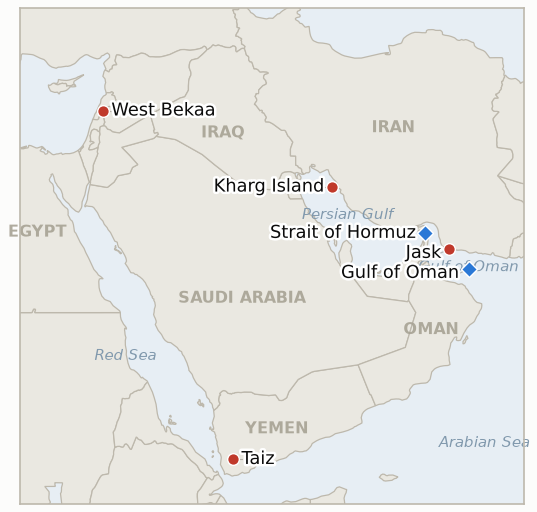

# Middle East Daily Briefing

**September 6, 2026**

- **Reporting window:** ~24 hours, September 5, 09:00 to September 6, 09:00 KST
- **Overall assessment:** The war crossed into its most direct US Iran military confrontation to date over the weekend: the IRGC fired ballistic missiles at a US aircraft carrier and a guided missile destroyer, both of which evaded the attack, and CENTCOM answered within hours by destroying or disabling three Iranian government tankers, with its regional commander declaring the US would "impose an even higher economic cost" for any shot fired at its ships. Iran called the tanker strikes a war crime and threatened "more severe" attacks on US vessels if the naval blockade continues, an exchange that falsified President Trump's three day old prediction the war would "wind down soon" before its own two week test clock had run a quarter of its course. For South Korea, the weekend brought the war's most direct domestic policy consequence yet: Seoul's government has begun formally preparing to send a naval support ship, a patrol aircraft and roughly 150 personnel to the Strait of Hormuz after months of Trump pressure, a step that is now visibly splitting the ruling Democratic Party and its progressive coalition partners ahead of a expected National Assembly vote. Yemen's civil war reached a new threshold of its own as the internationally recognized government flew its air force into direct combat against the Houthis around Taiz for the first time in this renewed offensive, even as a Houthi ballistic missile killed civilians on a crowded highway south of the city. In Lebanon, Friday's Hezbollah Israel exchange proved deadlier and more geographically extensive than first reported, with the toll revised upward and strikes reaching West Bekaa for the first time since June. And in the ledger's own bookkeeping, four long running indicators, on Turkey Israel friction, West Bank enforcement, US envoy Tom Barrack's controversies and a Senate privileged resolution, all reached their shared September 6 deadline and all resolved falsified, extending this ledger's pattern that specific, named institutional actions keep underperforming forecasts of continued conflict.

---

## 1. What Happened

<figure style="float:right; width:46%; margin:2pt 0 8pt 14pt;">

<figcaption style="font-size:8pt; color:#666; text-align:center; margin-top:3pt; font-style:italic;">Major places of discussion</figcaption>
</figure>

### 1.1 Iran Fires on US Navy Warships for the First Time, and the US Destroys Three Iranian Tankers in Response

The IRGC Navy launched ballistic missiles at a US aircraft carrier and a guided missile destroyer patrolling regional waters on Saturday, the first time in the war that Iran has targeted US Navy vessels directly rather than commercial or third country shipping; both ships evaded the attack and CENTCOM said no American personnel were harmed ([Jerusalem Post](http://www.jpost.com/middle-east/iran-news/article-907641); [CENTCOM](https://www.centcom.mil/MEDIA/PUBLIC-RELEASES/Article/4591744/centcom-destroys-3-irgc-oil-tankers-after-iran-targets-2-us-navy-warships/); [NPR](https://www.npr.org/2026/09/05/nx-s1-5959159/us-iran-warships-targeted)). Within hours CENTCOM struck three Iranian government crude carriers it described as part of a multibillion dollar shadow network financing the IRGC and its proxies: the M/T Downy was permanently disabled off Kharg Island, the M/T Stark 1 was disabled near Jask, and the unladen M/T Kylo was destroyed in the Gulf of Oman after its crew abandoned ship ([Al Jazeera](https://www.aljazeera.com/news/2026/9/5/us-says-it-hit-iran-oil-tankers-helping-finance-regional-proxies); [CNN](https://edition.cnn.com/2026/09/05/middleeast/iran-us-tanker-kharg-intl)). CENTCOM commander Adm. Brad Cooper framed the response explicitly: "If you shoot at two of our ships, we will impose an even higher economic cost, taking out three of yours," adding the US "will not hesitate to defend American forces, and if necessary, destroy Iran's limited and exposed oil fleet" ([RedState](https://redstate.com/streiff/2026/09/05/centcom-invokes-chicago-rules-to-deal-with-iranian-missile-attacks-n2206547)). Iran's Foreign Ministry called the tanker strikes "illegal and aggressive," a war crime, and Iran's military separately vowed "more severe" attacks on US vessels if the naval blockade continues ([Times of Israel](https://www.timesofisrael.com/liveblog-september-05-2026/); [Washington Times](https://www.washingtontimes.com/news/2026/sep/5/iran-accuses-us-military-targeting-tanker-near-kharg-island/)). This is a further verified US strike on Iranian government tankers, resolving **IND-20260904-3 confirmed** twelve days ahead of deadline, and the exchange itself, a further strike from both sides just three days into a roughly two week window, resolves **IND-20260903-1 falsified**: Trump's September 2 prediction the war would "wind down soon" did not survive even a quarter of its own test period. **Confidence: High** on the sequence of events and both militaries' own statements (Tier 1-2, official CENTCOM release, multi-outlet); Medium on the precise missile count and whether any Iranian projectile came close to impact, details CENTCOM has not detailed publicly.

### 1.2 South Korea Formally Begins Preparing a Hormuz Deployment, Splitting the Ruling Coalition

Bloomberg and Seoul Economic Daily reported that South Korea's government has begun formal preparations to deploy the destroyer support ship ROKS Soyang and a P-8A Poseidon maritime patrol aircraft to the Strait of Hormuz, requiring roughly 150 personnel to operate, after Seoul notified Washington last month it is willing to dispatch the assets; a National Assembly motion for approval could be submitted as early as this month, with the actual vote expected to align with President Lee Jae-myung's September 18 to 28 UN General Assembly trip ([Bloomberg](https://www.bloomberg.com/news/articles/2026-09-04/south-korea-paving-way-to-send-troops-to-hormuz-reports-say); [gCaptain](https://gcaptain.com/korea-paving-way-to-send-naval-ship-to-hormuz-reports-say/)). The move follows months of Trump publicly criticizing Seoul's non-participation in the Iran war effort, pressure that has already led the US to scale back a joint military exercise with South Korea by a week ([Yahoo Finance](https://finance.yahoo.com/economy/policy/articles/south-korea-paving-way-send-010455728.html)). The plan is now visibly splitting Korea's own ruling bloc: Democratic Party lawmaker Lee Ki-heon said he would not consent to the deployment "to defend the national interest and constitutional values," Progressive Party lawmaker Jung Hye-kyung argued President Lee should be "stopping the war, not joining the fight," and Rebuilding Korea Party floor leader Kim Joon-hyung questioned why Korea should send troops when even the prior Yoon government did not openly send troops to Ukraine ([Seoul Economic Daily](https://en.sedaily.com/politics/2026/09/05/hormuz-deployment-splits-koreas-ruling-bloc-again)). A Presidential Office official confirmed the deployment remains under review, noting Korea depends on the Middle East and the Strait of Hormuz for close to 70% of its crude oil imports. **Confidence: High** on the specific assets under consideration and the coalition split (Tier 1-2, Bloomberg and Korean financial press, multiple on record lawmakers); Medium on the actual timing and outcome of any National Assembly vote, which has not yet been scheduled.

### 1.3 Yemen's Government Commits Its Own Air Force to the Taiz Front for the First Time

Yemen's internationally recognized government flew more than 15 air strikes against Houthi positions along Taiz's western coastal fronts on Friday, the government's first direct air combat role in the renewed offensive that began September 3, after days of Houthi ground gains around Maqbanah, Mawzaa and Jabal Habashi ([Al Jazeera](https://www.aljazeera.com/news/2026/9/5/yemen-government-launches-own-air-attacks-on-houthis-what-that-means); [Yemen Monitor](https://www.yemenmonitor.com/en/Details/ArtMID/908/ArticleID/180967)). Government officials said the campaign killed dozens of Houthi fighters, including two field commanders, and recaptured some ground. Separately, a Houthi ballistic missile struck passenger vehicles on the Hejah al-Abd road south of Taiz city on Saturday, a vital route connecting Taiz to Lahj province, killing at least four civilians and wounding nine, destroying a bus and briefly closing the road ([Al Jazeera](https://www.aljazeera.com/news/2026/9/5/at-least-four-killed-in-houthi-missile-strike-near-yemens-taiz)). The UN's humanitarian coordination office recorded roughly 1,790 families displaced by the fighting since it resumed September 3 ([The National](https://www.thenationalnews.com/news/mena/2026/09/05/yemen-government-appeals-to-support-thousands-of-people-displaced-by-renewed-war/)). New **IND-20260906-3** tracks whether the government's air force keeps flying strikes or this proves a one time show of force. **Confidence: High** on the government air strikes and the Hejah al-Abd civilian toll (Tier 1-2, AFP and Al Jazeera sourced, multi-outlet); Medium on the precise Houthi casualty and territory-recaptured claims, which come from the government side only.

### 1.4 Lebanon's Death Toll From Friday's Exchange Is Revised Upward as Strikes Reach West Bekaa for the First Time Since June

Lebanon's Health Ministry revised its toll from Friday's Israeli strikes across Nabatieh's Rweiss neighborhood, al-Ramadiyeh and West Bekaa upward to five killed and 24 wounded, from an initial count of three killed and 23 injured, after the Israeli military said it launched the strikes in retaliation for an attempted Hezbollah drone attack on troops in the occupied buffer zone ([Antiwar.com](https://news.antiwar.com/2026/09/05/flurry-of-israeli-strikes-in-southern-eastern-lebanon-kill-5-wound-24/); [Arab News](https://www.arabnews.com/middle-east/israeli-strikes-kill-three-injure-23-in-south-and-east-lebanon-3000550)). Reporting on the individual strikes found a motorcycle hit in Nabatieh district killed two riders, and a strike on a house in Rmadiyeh killed three more people, including a child. The West Bekaa strike, hitting Ain el-Tineh, was the first Israeli strike in that district since June, a geographic widening beyond the pattern that already resolved **IND-20260829-1 confirmed** on September 5 ([The National](https://www.thenationalnews.com/news/mena/2026/09/05/israel-widens-lebanon-strikes-after-announcing-control-of-strategic-ali-al-taher-ridge/)). The strikes came just after the IDF publicized completing its clearance of Hezbollah's Ali al-Taher Ridge tunnel complex. **Confidence: High** on the revised toll and strike locations (Tier 1-3, Lebanese Health Ministry figures carried by multiple wires); Medium on the precise neighborhood level casualty attribution, which varies slightly by outlet.

### 1.5 Four Long Tracked Indicators Reach Their Shared September 6 Deadline, and All Resolve Falsified

Four indicators opened between August 23 and August 28 shared today's deadline, and all four resolved the same way. Envoy Tom Barrack's Abu al-Duhur "bait" remarks never produced a Turkish military response or diplomatic rupture, with both governments instead discussing a deconfliction channel, resolving **IND-20260823-1 falsified**. The IDF's private warning that the West Bank was on the "brink" of escalation never produced a mass casualty event or a formal emergency measure, despite sustained high tempo settler violence continuing through the window, resolving **IND-20260823-2 falsified**. Barrack's own back to back controversies, the Abu al-Duhur remarks and his walked back Golan Heights comment, drew no formal State Department statement and no disclosed change to his assignment, resolving **IND-20260824-1 falsified**. And the Senate's Van Hollen led privileged resolution on West Bank American deaths produced no committee markup and no floor vote within its own 10 day clock, with the chamber still in recess until September 14, resolving **IND-20260828-2 falsified**. **Confidence: High** on all four resolutions, based on the absence of any documented action across the full tracking windows (Tier 1-2, official silence confirmed across multiple outlets).

---

## 2. Deep Dive: Incentives and Motives

### 2.1 Why would Iran fire on US Navy warships directly now, a qualitatively riskier step than anything it has done in this war so far?

Because after weeks of the US striking Iranian tankers, oil infrastructure and IRGC targets without direct Iranian retaliation against US military assets, Tehran's own domestic political pressure to demonstrate the naval blockade has a real military cost was mounting, particularly after its parliament speaker warned earlier in the week that continued blockade escalation would draw a military response; firing at US warships, even a failed attempt both ships evaded, lets Iran claim it drew a line without actually needing to land a hit, a demonstration of resolve calibrated to generate maximum rhetorical value at comparatively low risk if the attack (as it did) fails to inflict damage.

### 2.2 Why would CENTCOM respond to a failed Iranian attack with a three for two ratio against tankers rather than a proportional response against military targets?

Because striking Iran's own tanker fleet, rather than IRGC bases or personnel, lets the US impose an economic cost on the regime's oil revenue, explicitly tied by CENTCOM to financing "regional proxies," while avoiding the escalatory risk of a strike that kills Iranian military personnel in direct response to an attack that itself caused no American casualties; Adm. Cooper's own "even higher economic cost" framing signals a deliberate doctrine of asymmetric, economically calibrated retaliation, a formula the administration can repeat indefinitely without needing to match kinetic force with kinetic force.

### 2.3 Why is Seoul moving toward a Hormuz deployment now, given the domestic political cost of fracturing its own ruling coalition?

Because the deployment decision has been deferred for months under the stated position that Korea would act only after the war ends, and continued deferral is now colliding with sustained, public Trump pressure and a scaled back joint military exercise that signals a real cost to the alliance relationship if Seoul keeps declining; moving forward now, even at the price of visible coalition division, lets President Lee's government demonstrate alliance responsiveness ahead of his own UN General Assembly appearance, while the deployment's framing around non-combat assets (a support ship, a patrol aircraft, mine clearance) is calibrated to satisfy Washington without committing Korean forces to combat operations its own progressive coalition partners would find much harder to accept.

### 2.4 Why would Yemen's government risk committing its own air force to Taiz now, rather than continuing to rely on ground troops and allied support?

Because the Houthi ground offensive that began September 3 has already produced Yemen's deadliest single day since the 2022 truce and displaced nearly 1,800 families, a scale of loss that made continued reliance on ground forces alone politically untenable for a government whose legitimacy already rests on demonstrating it can defend contested territory; committing the air force, even at the risk of a further escalatory spiral with the Houthis and the diplomatic complication of using force while international attention is consumed by the Israel Iran crisis, lets the government claim active battlefield initiative rather than passive defense.

### 2.5 Why does West Bekaa's reactivation as a strike location, dormant since June, matter beyond a single incident's death toll?

Because a strike location returning to active use after more than two months signals Israel's own assessment that Hezbollah's operational reach or intent has expanded beyond the narrower Nabatieh corridor this ledger has tracked as the exchange's primary theater since late August, and because West Bekaa sits closer to the Syrian border and further from the security zone the ceasefire framework was built around, meaning any sustained activity there would test the geographic boundaries of what the ceasefire mechanism was designed to contain in the first place.

---

## 3. Policy Implications for South Korea

### 3.1 Exposure snapshot

| Item | Current reading | Source |
| --- | --- | --- |
| US Iran naval clash | IRGC missiles miss two US Navy warships; CENTCOM destroys or disables three Iranian tankers in response | CENTCOM, Jerusalem Post |
| Korea Hormuz deployment | Naval support ship, P-8A aircraft, ~150 personnel under formal preparation; National Assembly vote expected around Lee's Sept 18 to 28 UN trip | Bloomberg, Seoul Economic Daily |
| Yemen Taiz/Bab el-Mandeb offensive | Government air force strikes Houthis directly for first time; 120+ killed since Sept 3, ~1,790 families displaced | Al Jazeera, The National |
| Hezbollah Israel exchange | Confirmed self sustaining (IND-20260829-1); widened to West Bekaa for first time since June, toll revised to 5 killed, 24 wounded | Antiwar.com, The National |
| Brent / WTI | No new settle; markets closed for the weekend, last verified Friday Sept 4 levels: Brent 95.80, WTI 91.22 | TradingEconomics |
| KOSPI / USD-KRW | No new close; last verified Friday Sept 4 levels: KOSPI 6,687.21, won 1,350.4 | Seoul Economic Daily; Money Today |
| Hormuz transits | Backfilled Thursday Sept 3 count: 4 vessels (Kpler via BOE Report), conflicting with a separate 6-vessel figure for the same date; no Sept 4 or 5 count published | BOE Report; Al-Monitor |
| Middle East share of crude imports | 48.5% (May to July 2026 rolling), down from 69.1% a year earlier; August single month reading 61.1% | KNOC via Asia Business Daily; `korea-exposure.md` |
| Strategic reserve coverage | ~26 days of actual consumption (estimate); ~21 million barrels already swapped, on immediate standby | CSIS; MOTIE |
| Refiner Saudi ownership exposure | S-Oil (Saudi Aramco majority ~63%), HD Hyundai Oilbank (Aramco ~17%) | Public filings; `korea-exposure.md` |

### 3.2 Implications by development

**The war's first direct IRGC attack on US Navy vessels, and the tanker for tanker doctrine it triggered, is the clearest evidence yet that the naval confrontation is escalating in kind rather than staying confined to shipping harassment; Korean shippers and KNOC should treat the risk of a miscalculated strike drawing Korean-flagged or Korean-operated tonnage into direct crossfire as rising, not stable.** New IND-20260906-1 tracks whether Iran repeats a direct attack on US naval assets.

**South Korea's own Hormuz deployment preparations are now the most direct link this ledger has tracked between the war and Korean policy itself; the coalition split within the ruling party means the deployment's actual scale, timing, and even whether it proceeds at all remain genuinely unresolved, a first order policy uncertainty rather than a settled commitment.** New IND-20260906-2 tracks whether the deployment reaches a National Assembly vote or stalls.

**Yemen's government committing its own air force to Taiz, while not yet a Hormuz or Gulf shipping event, raises the stakes around the Bab el-Mandeb approaches that rerouted Korean-linked traffic already relies on; a further escalatory spiral there would compound rather than diversify chokepoint risk just as Seoul weighs a Hormuz commitment of its own.** New IND-20260906-3 tracks whether the government's air campaign continues.

**The absence of any new oil, KOSPI or won settlement this window is itself informative only in the negative: none of this weekend's escalations, however significant, has yet forced a reopening-hours repricing large enough to preempt Monday's trading, meaning Monday's open is the first real test of how markets weigh the naval clash against the accumulated week's other de-escalatory failures.** Tracked through the series chart above and the standing indicators on the campaign's trajectory (IND-20260902-2, IND-20260906-1).

**Four indicators resolving falsified at their shared deadline today reinforces this ledger's standing lesson that specific, named institutional actions (a diplomatic rupture, a formal emergency measure, an administration statement, a Senate floor vote) keep underperforming forecasts that conflict itself continues; Korean policymakers should read today's naval escalation against that same base rate, treating any single de-escalatory claim about it with the same skepticism this ledger has now validated repeatedly.** Tracked via the ledger's own calibration record in `tracking/indicators.md`.

**Testable indicators:**

- **IND-20260906-1** — A further verified IRGC attack on a US Navy vessel by ~2026-09-19 confirms a sustained pattern of direct military confrontation; no further such attack through the same date falsifies it as a single failed attempt.
- **IND-20260906-2** — A National Assembly floor vote (pass or fail) or a formal motion submission on Korea's Hormuz deployment by ~2026-09-28 confirms the question reached a real institutional decision point; continued internal party debate with no motion filed and no vote by the same date falsifies near-term resolution.
- **IND-20260906-3** — A further verified Yemeni government air strike on Houthi positions by ~2026-09-19 confirms a sustained direct combat role; a reversion to ground-only operations with no further government air strikes through the same date falsifies it as a one-off show of force.

---

## 4. Watch List

- **Whether Iran repeats a direct attack on a US Navy vessel** (IND-20260906-1, deadline September 19).
- **Whether Korea's Hormuz deployment reaches a National Assembly floor vote or a formal motion, or stalls under coalition opposition** (IND-20260906-2, deadline September 28).
- **Whether Yemen's government air force continues striking Houthi positions beyond its first wave** (IND-20260906-3, deadline September 19).
- **Whether Trump's Pickaxe Mountain strike threat converts into a verified US strike** (IND-20260905-1, deadline September 18).
- **Whether the war's first disclosed US casualty count is followed by further official updates** (IND-20260905-2, deadline September 18).
- **Whether the widened Hezbollah Israel exchange, now reaching West Bekaa, draws a UNIFIL, LAF, or US-mediated response** (IND-20260905-3, deadline September 19).
- **Whether Yemen's Taiz/Bab el-Mandeb offensive draws renewed international mediation** (IND-20260905-4, deadline September 19).
- **Whether the Masafer Yatta and Qusra arrests mark a durable settler enforcement shift or stay isolated cases** (IND-20260825-2, deadline September 8).
- **Whether the Jannatah attack on Israeli activists and an AFP journalist draws any arrest** (IND-20260826-2, deadline September 8).
- **Whether Iran's "decisive operation" produces any further verified strike on Jordan, Bahrain, Iraq or Kuwait beyond the September 1 to 3 wave** (IND-20260903-2, deadline September 9).
- **Whether Trump's threatened "biggest attack of them all" on Iranian territory ever materializes** (IND-20260902-2, deadline September 9).
- **Whether Janggeum Shipping changes its Hormuz chartering pace, or Seoul issues an advisory specifically on the company's exposure** (IND-20260903-3, deadline September 17).
- **Whether Netanyahu's regime change declaration produces any disclosed operational step** (IND-20260904-1, deadline September 18).
- **Whether any host country confirms substantive talks on Ben Gvir's Disengagement 710 plan** (IND-20260904-2, deadline September 18).
- **Whether the internal military warning to Hegseth produces a disclosed force posture change** (IND-20260831-2, deadline September 14).
- **Whether Kaine's privileged war powers resolution on Oman passes, fails, or never reaches a floor vote once the Senate returns September 14** (IND-20260819-3, deadline September 25).
- **Whether the $206 million US ISF funding for Gaza converts into visible equipment delivery or stand up activity** (IND-20260820-3, deadline September 19).

---

## 5. Source Quality Summary

| Claim | Sources | Confidence |
| --- | --- | --- |
| IRGC missile attack on two US Navy warships and CENTCOM's tanker strikes | CENTCOM official release, Jerusalem Post, CNN, NPR, Al Jazeera (Tier 1-2, official military statements, multi-outlet) | High |
| Iran's "war crime" characterization and "more severe" attack threat | Times of Israel, Washington Times (Tier 2-3, Iranian state and semi-official media relayed by international outlets) | High |
| South Korea's Hormuz deployment preparations and specific assets | Bloomberg, Seoul Economic Daily, gCaptain (Tier 1-2, financial press with named officials and lawmakers) | High |
| Ruling coalition split over the Korea deployment | Seoul Economic Daily (Tier 2-3, named lawmaker quotes, single Korean outlet) | High |
| Yemen government air force strikes on Houthi positions | Al Jazeera, Yemen Monitor (Tier 1-3, multi-outlet, military source claims not independently verified) | Medium to High |
| Hejah al-Abd road civilian toll | Al Jazeera, Yahoo News Canada (Tier 1-2, AFP-adjacent wire sourcing, multi-outlet) | High |
| Lebanon revised death toll and West Bekaa strike location | Antiwar.com, Arab News, The National, RTE (Tier 2-3, Lebanese Health Ministry figures, multi-outlet) | High |
| Four indicator resolutions (Turkey-Israel, West Bank, Barrack, Senate resolution) | Absence of documented action across this ledger's own tracked sourcing since each indicator's opening (Tier 1-2, official silence corroborated across the tracking window) | High |
