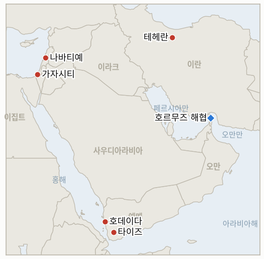

# 중동 일일 브리핑

**2026년 9월 7일**

- **보고 기간:** 약 24시간, 9월 6일 09:00 ~ 9월 7일 09:00 (한국시간)
- **종합 평가:** 미 해군 함정에 대한 개전 이후 첫 직접 공격 다음 날, 이란 국회 스스로가 수사적 수위를 한층 끌어올렸다. 갈리바프 국회의장은 공개 본회의에서 "비례적 대응의 시대는 끝났다"고 선언하며 이란의 이익을 침해하는 어떤 추가 행동에도 "더 빠르고 더 무겁고 더 고통스러운" 대응이 뒤따를 것이라고 경고했다. 분석가들은 이를 테헤란 스스로가 부과해온 보복 수위의 상한선을 걷어낸 신호로 읽었으며, 이 와중에도 유조선을 주고받는 해상 교전은 계속되고 있다. 레바논은 6월 정전 체제 이후 이스라엘의 단일 최대 공습을 겪었다. 네 개 마을이 피격됐고 병원과 정부 청사를 포함한 건물이 파손됐으며 최소 7명이 숨졌다. 조제프 아운 대통령은 이를 레바논 국가 기구 자체에까지 미치는 "위험한 확전"이라 규정하며 워싱턴에 개입을 공개적으로 요청했다. 예멘의 재개된 내전은 새로운 전환점에 도달했다. 정부군이 호데이다·타이즈·이브 세 개 주의 접경지인 하이스 지구를 장악하고 동시에 세 개 전선으로 진격했으나, 나흘간의 전투 사망자는 117명을 넘어섰고 분석가들은 이번 전과가 아직 결정적 국면 전환에는 미치지 못한다고 경고했다. 한국에는 이번 보고 기간 동안 호르무즈 사안이 새로운 국면으로 접어들었다. 이재명 대통령이 프랑스 국빈방문길에 올랐고, 마크롱 대통령과의 정상회담에서 해협 안전 확보를 위한 다국적 협력이 논의될 것으로 전망되는 한편, 대통령의 부재중 국내에서는 실제 파병을 둘러싼 정치권의 노선 차이가 한층 굳어졌다. 그리고 가자지구에서는 쿠슈너 미 특사가 네타냐후 정부에 대한 행정부의 통상적인 공개적 예우를 깨고 나섰다. 그는 다가오는 총선을 이유로 이스라엘 정부가 가자 정책에서 "다소 비이성적"이라고 말했는데, 이는 평화이사회의 무장해제 로드맵이 애초에 우회하려 했던 바로 그 정치 지형에 여전히 발목 잡혀 있음을 이례적으로 솔직하게 인정한 발언이다.

---

## 1. 무슨 일이 있었나

<figure style="float:right; width:46%; margin:2pt 0 8pt 14pt;">

<figcaption style="font-size:8pt; color:#666; text-align:center; margin-top:3pt; font-style:italic;">주요 논의 지점</figcaption>
</figure>

### 1.1 이란 국회의장, 비례적 대응의 시대는 끝났다고 선언하다

혁명수비대의 미 해군 함정 두 척에 대한 탄도미사일 공격이 실패로 끝나고 중부사령부가 이란 국영 유조선 세 척을 파괴 또는 무력화하며 응수한 다음 날인 일요일, 국회의장이자 수석 협상가인 모하마드 바게르 갈리바프는 공개 본회의 연설에서 "아직도 이해하지 못했다면, 너무 늦기 전에 게임의 규칙이 바뀌었다는 것을 이해해야 한다"고 말하며, 이란의 이익과 안보를 침해하는 어떤 추가 행위에도 이제는 "더 빠르고 더 무겁고 더 고통스러운" 대응이 뒤따를 것이라고 경고했다([La Voce di New York](https://lavocedinewyork.com/en/news/2026/09/06/irans-ghalibaf-proportionate-responses-over-as-us-strikes-tankers/); [Fortune](https://fortune.com/2026/09/06/iran-faster-heavier-painful-oil-tankers-attack-attempt-warships/); [IRNA](https://en.irna.ir/amp/86256429/)). 이 발언은 알자지라가 확전되는 유조선 전쟁을 조명한 기사에서 국방 분석가 볼프강 푸스타이가 미국의 유조선 공습을 "매우, 매우 중대한 사건"이라 평하고, 분석가 알리 아크바르 다레이니가 이번 교전이 "이란으로 하여금 더 거칠게 반격하도록 부추긴다"며 테헤란이 유가를 배럴당 100달러 이상으로 끌어올리려 한다고 경고한 것과 같은 날 나왔다. 브렌트유는 장중 7월 24일 이후 최고치인 96.28달러까지 거래됐고, 미국 경유 가격은 갤런당 5.85달러로 사상 최고치를 기록했다([Al Jazeera](https://www.aljazeera.com/news/2026/9/6/us-iran-engaged-in-tanker-war-where-is-the-months-long-conflict-headed)). 중부사령관 브래드 쿠퍼 제독은 앞서 유조선 공습을 "우리 함정 두 척에 발포하면 우리는 너희 배 세 척을 파괴해 더 높은 경제적 대가를 치르게 하겠다"는 등가보복 논리로 명시적으로 규정한 바 있다. 이번 보고 기간 동안 이란의 미 해군 함정에 대한 추가 공격은 보고되지 않아 **IND-20260906-1**은 열린 상태로 남았다. **신뢰도: 높음** (갈리바프의 발언과 발언 장소, 공개 국회 본회의, IRNA 및 다수 통신사 보도, 1~2등급 출처); 이 수사가 실제 교전규칙의 작전상 변화를 반영하는지는 추가 사건이 있어야만 검증할 수 있어 **중간**.

### 1.2 이스라엘, 레바논 남부 네 개 마을로 공습 확대, 최소 7명 사망

이스라엘 전투기가 일요일 새벽 나바티예 알파우카, 아랍 살림, 나바티예 시내, 크파르 루만을 타격했다. 이스라엘군은 헤즈볼라가 점령지 완충지대의 이스라엘군을 향해 폭발물 탑재 드론 두 대를 발사했으며, 하나는 요격됐고 다른 하나는 알리 알타헤르 능선 인근을 타격했으나 군인 부상자는 없었다고 밝혔다([Times of Israel](https://www.timesofisrael.com/4-killed-as-israel-strikes-south-lebanon-after-hezbollah-drones-target-troops); [Arab News](https://www.arabnews.com/middle-east/lebanons-aoun-calls-for-us-help-after-israeli-strikes-kill-4-amid-hezbollah-drone-claims-3000647)). 이스라엘군은 현지시각 오전 6시 아랍 살림의 한 건물에 대해 헤즈볼라가 사용 중이라며 온라인 대피 경고를 발령한 뒤 이를 타격해 여성 2명이 숨지고 소녀 2명을 포함해 6명이 다쳤으며, 별도로 점령 완충지대 인근 마을에서는 남성 2명이 숨졌다. 레바논 당국은 이날 공습의 전체 사망자가 최소 7명, 부상자가 약 20명에 이른다고 밝혔으며, 나바티예 알파우카의 운영 중단된 병원 한 곳이 파괴됐고 재무부와 농림부 청사를 포함한 정부 청사가 이번 작전에서 두 번째로 피해를 입었다. 조제프 아운 대통령은 이번 공습을 "레바논 국가 기구 자체에까지 미치는 위험한 확전"이라 규정하며 워싱턴과 국제사회에 6월 합의를 위반하는 행위를 중단시키기 위한 개입을 촉구했다. 이는 이 장부가 추적해온 확전 주기의 세 번째 확대 국면으로, UNIFIL이나 레바논군, 미국 중재 성명이 이 패턴 자체를 다룰 때까지 **IND-20260905-3**은 열린 상태로 남는다. 아운 대통령의 호소는 레바논 국가원수의 성명이지, 이 지표가 요구하는 구체적인 제도적 계기는 아직 아니다. **신뢰도: 높음** (공습 위치와 사망자 수, 1~3등급 출처, 레바논 보건부 수치를 인용한 Times of Israel, Arab News, 알자지라, France24); 헤즈볼라의 드론 발사 자체는 이견이 없으나 그 작전적 의미를 둘러싼 양측의 해석은 엇갈려 **중간**.

### 1.3 예멘 정부군, 하이스 지구 장악하며 사망자 117명 넘어서다

예멘 정부군은 일요일 호데이다·타이즈·이브 세 개 주의 접경 요충지인 하이스 지구를 완전히 장악했다고 발표했다. 토요일 저녁 남은 농촌 지역을 확보한 뒤였으며, 동시에 인접한 알자라히 지구와 자발 라스 방향, 남쪽으로는 타이즈주의 알바르흐까지 진격을 이어갔다([TASS](https://tass.com/world/2183363); [Yemen Monitor](https://www.yemenmonitor.com/en/Details/ArtMID/908/ArticleID/181068)). 타이즈 자체에서도 정부군은 하이판 전선의 여러 거점을 점령했다고 밝혔으며, 후티 측은 타이즈시에 탄도미사일 3발을 발사했다. 9월 3일 시작된 재개 전투 나흘째, 확인된 사망자는 최소 117명(정부군 54명, 후티 63명)에 이르며 약 1,800가구가 피란했다([The Business Standard](https://www.tbsnews.net/world/least-117-killed-fierce-government-houthi-fighting-rages-western-yemen-1535281)). 알자지라 자체 분석은 이번 전과가 실재하지만 "예멘의 오래된 내전에서 아직 결정적 전환에는 이르지 못했다"고 경고했다([Al Jazeera](https://www.aljazeera.com/news/2026/9/6/how-significant-are-the-yemeni-governments-military-gains-against-the-houthis); [Al Jazeera](https://www.aljazeera.com/news/2026/9/6/yemeni-forces-claim-strategic-district-amid-intensified-houthi-clashes)). 이번 보고 기간 중 9월 5일 첫 출격 이후 정부 공군의 추가 출격은 확인되지 않아 **IND-20260906-3**은 열린 상태로 남는다. **신뢰도: 높음** (하이스 장악과 전체 사망자 수, 1~2등급 출처, TASS·알자지라·AFP 취재 기반 다수 매체); 하이판 전선의 구체적 전과와 후티 측 사망자 수는 주로 정부 측 발표에 의존해 **중간**.

### 1.4 이재명 대통령, 파리로 출국하며 국내 호르무즈 논쟁은 격화

이재명 대통령은 일요일 4일 일정으로 프랑스 방문길에 올랐다. 먼저 생폴드방스 인근에서 열리는 영화산업 뤼미에르 정상회의를 공동주재한 뒤 파리에서 마크롱 대통령과의 정상회담과 만찬을 포함한 이틀간의 국빈방문을 이어간다. 발표된 의제는 문화·인공지능·원자력 협력이 상단에 있지만, 한국 언론들은 이번 회담이 양국 정상이 호르무즈 해협 안전 확보를 위한 서울의 잠재적 군사 기여를 논의할지에 관심이 쏠려 있다고 짚었다. 프랑스는 지난 3월 35개국 군 관계자를 소집한 이래 이 사안에 관한 다국적 논의를 주도해왔다([Korea Herald](https://www.koreaherald.com/article/10863883); [SBS](https://news.sbs.co.kr/english/article.do?news_id=N1008739734)). 대통령의 부재중 국내에서는 논쟁이 더욱 격화됐다. 대통령실 조용술 대변인은 파병을 둘러싼 계속되는 공개적 모호함이 "외교적 신뢰를 흔들고 있다"고 경고했고, 국민의힘 안철수 의원은 파병을 촉구해온 기존 입장을 재확인했으며, 더불어민주당 이기헌 의원은 "어떤 명분으로도 호르무즈 파병을 받아들일 수 없다"고 맞섰다. 한국 언론은 이 균열을 2003년 이라크 파병 동의안 표결 당시 여당 자체가 갈렸던 사례(찬성 49표, 반대 43표)에 명시적으로 비유했다([파이낸셜뉴스](https://www.fnnews.com/news/202609061524371557)). 국회에 정식 동의안은 아직 제출되지 않았다. **신뢰도: 높음** (이 대통령의 방문 일정과 국내 정치 균열, 1~2등급 출처, 한국 통신사 및 경제지, 실명 의원 다수 인용); 마크롱 대통령과 실제로 호르무즈 문제가 실질적으로 논의될지는 한국 언론도 유력하지만 확정적이지 않다고 짚어 **중간**.

### 1.5 쿠슈너, 네타냐후 정부의 가자 정책을 "다소 비이성적"이라 평하다

키이우 방문 중이던 쿠슈너 미 특사는 다가오는 크네세트 총선이 네타냐후 정부의 가자 정책을 "다소 비이성적"으로 만들었다고 말했다. "가자의 최종 상태에 대해서는 우리도 이스라엘과 뜻이 같다고 생각한다. 다만 그들에게는 정신없는 선거가 있고, 그것이 그들을 어떤 면에서는 다소 비이성적으로 만든다"([Times of Israel](https://www.timesofisrael.com/liveblog-september-06-2026/)). 이 발언은 네타냐후에 대한 행정부의 통상적인 공개적 예우에서 벗어난 지금까지 가장 솔직한 발언이며, 15개항 틀에 따른 하마스 무장해제를 추진하려는 평화이사회의 노력이 바로 그 선거 정치에 여전히 발목 잡혀 있는 시점에 나왔다. 네타냐후는 앞서 쿠슈너와 평화이사회 특사 니콜라이 믈라데노프와의 회동에서 10월 27일 표결 전에 가시적 진전을 보이는 것은 정치적으로 "곤란하다"고 밝힌 바 있으며, 벤그비르 국가안보장관의 경쟁하는 가자 이주 계획 "디스인게이지먼트 710"은 여전히 어떤 대상국의 확인된 관심도 끌어내지 못하고 있다. 이번 보고 기간 중 벤그비르 계획에 대한 정부의 공식 조치나 쿠슈너 발언에 따른 공개된 정책적 결과는 나타나지 않아 **IND-20260904-2**는 열린 상태로 남는다. **신뢰도: 높음** (쿠슈너의 발언과 발언 경위, 1~2등급 출처, Times of Israel의 직접 취재); 이 발언이 미국의 실질적인 압박 전환을 반영하는지 아니면 지나가는 말에 불과한지는 후속 조치가 있어야만 검증할 수 있어 **중간**.

---

## 2. 심층 분석: 동기와 유인

### 2.1 갈리바프의 "비례적 대응의 시대는 끝났다"는 선언이 이란의 기존 억지 수사보다 더 위험한 신호인 이유는 무엇인가?

특정 표적에 국한된 기존의 개별 위협들과 달리, 이번에는 이란의 국회 지도부 스스로가 2월 개전 이후 확전의 사다리를 구조화해온 틀, 즉 미국의 각 공습에 계산된 제한적 대응으로 맞대응해온 원칙을 공개적으로 폐기했기 때문이다. 배경 브리핑이 아니라 기록에 남는 공개 국회 본회의에서 그 틀의 종료를 선언함으로써, 갈리바프는 다음에 미국이 공습할 때 이란 지도부 스스로가 불균형한 무력 이외의 대응을 하는 데 따르는 국내 정치적 비용을 끌어올린다. 이는 분석가 알리 아크바르 다레이니가 지적하듯 양측 모두 아직 완전히는 선택하지 않은 더 넓은 전쟁으로 이어질 수 있는, 바로 그런 종류의 더 거친 보복을 부추기는 유인으로 작용한다.

### 2.2 이스라엘이 6월 정전 체제에도 불구하고 레바논 남부에서 병원과 정부 청사를 타격하며 공습을 확대하는 이유는 무엇인가?

9월 4일 교전 이후 이스라엘이 적용해온 작전 논리, 즉 완충지대 어디서든 헤즈볼라의 드론 발사가 있으면 어떤 시설을 타격하든 그에 비례해 대규모 보복 공습이 정당화된다는 논리가, 이제 운영 중단된 병원과 재무부·농림부 청사를 두 번째로 타격하는 상황에서도 수정되지 않고 있기 때문이다. 국가 기구를 특정해 타격하는 것은 헤즈볼라가 작전을 계속하는 대가를 헤즈볼라 조직 자체만이 아니라 레바논 국가의 기간시설이 짊어지게 될 것이라는 신호를 베이루트에 보내는 것이며, 이는 아운 정부가 헤즈볼라와의 공존 비용으로 공습을 감수하는 대신 스스로 내건 무장해제 공약을 이행하도록 압박하려는 캠페인이다.

### 2.3 예멘 정부군이 세 개 전선을 동시에 밀어붙이는 이유, 그리고 분석가들이 여전히 이번 전과를 결정적이지 않다고 평가하는 이유는 무엇인가?

하이스 장악이 북쪽 알자라히, 동쪽 자발 라스, 남쪽 알바르흐 등 세 개 주로 향하는 경로를 동시에 열어주고, 나흘간의 값비싼 전투 끝에 얻은 기세는 후티 측이 새로운 방어선을 재편하기 전에 전술적 전과를 영토적 전과로 전환하는 데 유리하기 때문이다. 그러나 분석가들은 정부군이 과거 공세에서도 비슷한 전략적 요충지를 장악했다가 몇 주 안에 후티 방어선이 안정화되는 것을 지켜본 전례가 있다는 점, 그리고 나흘간 양측이 비슷한 비율로 나눠 낸 117명이라는 합산 사망자 수가 어느 한쪽도 붕괴하고 있지 않음을 보여준다는 점에서 이번 전과를 결정적이지 않다고 경고한다. 이는 돌파구가 아니라 소모전의 양상과 부합한다.

### 2.4 쿠슈너가 지금 이 시점에 네타냐후 정부를 공개적으로 "비이성적"이라 평한 이유는 무엇이며, 이는 가자 무장해제 로드맵의 실제 상태에 대해 무엇을 드러내는가?

평화이사회가 수개월째 무장해제·위생 실무그룹, 확정된 로드맵 등 점진적 진전을 공개적으로 내세워 왔지만 실제 걸림돌은 전혀 움직이지 않았기 때문이다. 네타냐후는 미국 당국자들에게 10월 27일 이전에 가시적 움직임을 보이는 것이 "곤란하다"고 사적으로 밝혀왔으며, 쿠슈너의 공개적 인정은 로드맵 정체의 책임을 미국이나 하마스의 비타협이 아니라 이스라엘 국내 정치로 돌리려는 시도로 읽는 것이 가장 타당하다. 이는 실질 내용이 8월 중순과 정확히 같은 자리에 멈춰 있는 와중에도 아랍권 중재자들 사이에서 이 틀의 신뢰도를 지키려는 신호다.

---

## 3. 한국에 대한 정책적 함의

**노출도 스냅샷:** 한국의 원유 수입은 여전히 약 70%가 호르무즈 해협 통행에 의존하고 있으며, LNG 수입의 약 36%가 중동산이다. 카타르 라스라판이 단일 최대 LNG 공급 노출원이다(전체 완화 조치는 `instructions/korea-exposure.md`, 2026년 8월 14일 최종 업데이트 참조: 비호르무즈 원유·나프타 비축, 전략비축유 스와프 프로그램, 홍해·얀부 우회 경로 포함). 이번 보고 기간 중 이 기준치에 대한 실질적인 업데이트는 없었다.

**사안별 함의:**

- **갈리바프의 확전 위협 (§1.1):** 국회 지도부가 절제된 자제를 끝냈다고 선언한 것이 실제 작전상 변화로 이어진다면, 현재 안정적인 한국의 원유 조달 여건을 뒤집을 수 있는 추가 호르무즈 인접 충격의 확률이 높아진다. 추가 이란 공습이 현실화될 경우 산업통상자원부의 수급 점검 체계와 전략비축유 스와프 프로그램이 관련 대응 수단으로 남는다.
- **레바논 공습 확대 (§1.2):** 이번 특정 작전에서 한국 선박이나 인력에 대한 직접적 노출은 확인되지 않았으나, 정부 청사·병원 등 제도적 표적이 타격받는 패턴은 외교부의 상시 여행경보 3단계가 이미 반영하고 있는 광범위한 지역 확전 위험을 재확인시킨다.
- **예멘 하이스 장악과 사망자 증가 (§1.3):** 재개된 타이즈·호데이다 전투는 한국의 홍해·얀부 원유 우회 경로가 지나는 바로 그 바브엘만데브 회랑에 걸쳐 있다. 해안에서 떨어진 정부군·후티 간 지상전이 계속되고 있지만 아직 이 경로 자체를 교란하지는 않았다. 다만 노출도 파일의 기존 평가대로 이 회랑의 위험 프리미엄은 구조적으로 높은 수준을 유지하고 있다.
- **한국 자체의 호르무즈 파병 논쟁 (§1.4):** 이는 이제 이 장부에서 가장 직접적인 한국 관련 정책 사안이다. 이재명·마크롱 정상회담이 서울의 기여를 다국적(프랑스 주도) 틀 안에 위치시켜 일방적 파병에 따른 정치적 부담을 줄이는 결과로 이어질 수도 있고, 회담이 구체적인 호르무즈 관련 결과물 없이 지나갈 수도 있어 국내 연정 균열이 당분간 파병 여부를 좌우하는 구속력 있는 변수로 남을 수도 있다.
- **쿠슈너의 가자 발언 (§1.5):** 한국에 직접적인 통로는 없으나, 가자 로드맵의 계속되는 정체는 한국의 구조적 호르무즈·홍해 노출을 주로 좌우하는 전쟁 자체의 지속 기간을 늘리는 요인이다.

**검증 가능한 지표:**

- **IND-20260907-1** (신규): 갈리바프의 "비례적 대응의 시대는 끝났다"는 선언과 "더 빠르고 더 무겁고 더 고통스러운" 대응 위협이 기존 유조선 상호 보복을 넘어서는 질적으로 더 큰 이란의 보복 공격으로 전환되는지, 아니면 실제 작전을 앞지르는 확전 수사로 이 장부의 기존 패턴에 합류하는지를 검증한다. 시한 ~2026-09-20.
- **IND-20260907-2** (신규): 예멘 정부군의 하이스 지구 장악과 알자라히·자발 라스·알바르흐 방향 동시 진격이 이후 2주간 유지·확대되는지, 아니면 후티의 반격으로 뒤집히는지를 검증한다. 시한 ~2026-09-20.
- **IND-20260907-3** (신규): 이재명 대통령의 파리 국빈방문과 마크롱 대통령과의 정상회담이 호르무즈 협력에 관한 구체적 결과물을 내는지, 아니면 문화·인공지능·원자력 협력 발표만 있고 호르무즈 관련 결과물은 없이 끝나는지를 검증한다. 시한 ~2026-09-10.
- **IND-20260907-4** (신규): 쿠슈너가 네타냐후 정부를 "다소 비이성적"이라 공개 평가한 것이 이스라엘 정부에 대한 미국의 가시적인 정책적 결과로 이어지는지, 아니면 후속 조치 없는 일회성 발언으로 남는지를 검증한다. 시한 ~2026-09-20.
- **IND-20260906-1** (기존): 혁명수비대가 미 해군 함정에 대한 직접 공격을 반복하는지 여부. 이번 보고 기간에는 반복 사례가 관측되지 않았다. 시한 ~2026-09-19.
- **IND-20260906-2** (기존): 한국의 호르무즈 파병이 정식 국회 동의안이나 표결에 도달하는지 여부. 이번 보고 기간까지 동의안은 제출되지 않았으나, 이재명·마크롱 정상회담과 격화되는 국내 논쟁 모두 관련 변수다. 시한 ~2026-09-28.
- **IND-20260906-3** (기존): 예멘 정부 공군이 9월 5일 첫 출격 이후에도 직접 전투 역할을 지속하는지 여부. 이번 보고 기간에는 추가 정부 공군 출격이 확인되지 않았다. 시한 ~2026-09-19.
- **IND-20260905-3** (기존): 레바논의 확대된 헤즈볼라·이스라엘 교전이 UNIFIL·레바논군·미국 중재 성명을 이끌어내는지 여부. 아운 대통령의 워싱턴 호소는 국가원수 성명이지, 이 지표가 검증하는 구체적인 제도적 계기는 아직 아니다. 시한 ~2026-09-19.

---

## 4. 주시할 사안

- **메카 공동방위협정 (IND-20260809-2):** 시한 ~09-08, 하루 앞. 에르도안 대통령이 앞서 호르무즈 재개방을 "우선순위"라 언급한 수사적 표현 외에 협정에 따른 구체적 이행 조치(합동훈련, 주둔 협정, 조약 발동)는 보고되지 않았다.
- **마사페르 야타·자나타흐 정착민 폭력 대응 (IND-20260825-2, IND-20260826-2):** 두 지표 모두 시한 ~09-08. 추가 체포와 철거가 동시에 기록된 엇갈린 상황을 고려할 때 내일 실제 판정 여부를 주시.
- **픽액스산 (IND-20260905-1):** 이번 보고 기간까지 타격되지 않았음. 이번 주 여러 분석은 지연 원인을 트럼프의 발언 의지 변화가 아니라 시설 자체의 미완공 상태로 지목한다.
- **벤그비르의 디스인게이지먼트 710 계획 (IND-20260904-2):** 여전히 확인된 대상국의 관심이나 정부의 공식 조치가 없으며, 이제 쿠슈너의 가자 정책 관련 공개적 마찰과 겹치고 있다.
- **장금상선의 호르무즈 노출 (IND-20260903-3):** 시한 ~09-17. 한국계 용선사의 호르무즈 운항 활동 변화나 한국 정부의 관련 권고는 아직 확인되지 않음.
- **라스라판 카타르 LNG 선적 (IND-20260714-4):** 여전히 새로운 주간 선적 수치가 없음. 이 수출 동결은 이 장부에서 가장 오래 미해결 상태로 남아 있는 지표다.

---

## 5. 출처 신뢰도 요약

| 주장 | 출처 | 신뢰도 |
|---|---|---|
| 갈리바프, "비례적 대응" 종료 선언하며 "더 빠르고 더 무겁고 더 고통스러운" 대응 위협 | IRNA (1등급, 국영 매체, 직접 인용); La Voce di New York, Fortune (2등급, 통신 인용) | 높음 |
| 미이란 유조선 전쟁 배경, 유가 및 분석가 전망 | 알자지라 (2등급) | 사실관계는 높음; 분석가 전망은 중간 |
| 이스라엘 공습으로 레바논 남부 네 개 마을에서 최소 7명 사망, 병원·청사 피격 | Times of Israel, Arab News, 알자지라, France24 (1~3등급, 레바논 보건부 수치, 다수 매체) | 높음 |
| 아운 대통령, 공습을 "위험한 확전"이라 규정하며 워싱턴에 호소 | Arab News (2등급, 직접 인용) | 높음 |
| 예멘 정부군, 하이스 지구 장악하며 세 전선에서 진격 | TASS, Yemen Monitor (2~3등급, 정부 취재원) | 장악 사실은 높음; 하이판 전선 및 후티 사망자 세부는 중간 |
| 예멘 나흘간 사망자 117명 넘어서 | The Business Standard (2등급, AFP 취재 기반) | 높음 |
| 이재명 대통령 프랑스 출국, 마크롱과 호르무즈 협력 논의 예상 | Korea Herald, SBS (1~2등급, 한국 통신사) | 출국 일정은 높음; 실질적 호르무즈 논의 여부는 중간 |
| 한국 국내 호르무즈 파병 논쟁 격화 (조용술, 안철수, 이기헌) | 파이낸셜뉴스 (2등급, 한국 경제지, 실명 인용) | 높음 |
| 쿠슈너, 네타냐후 정부를 가자 정책에서 "다소 비이성적"이라 평가 | Times of Israel (1등급, 직접 인용, 실명 발언) | 높음 |
