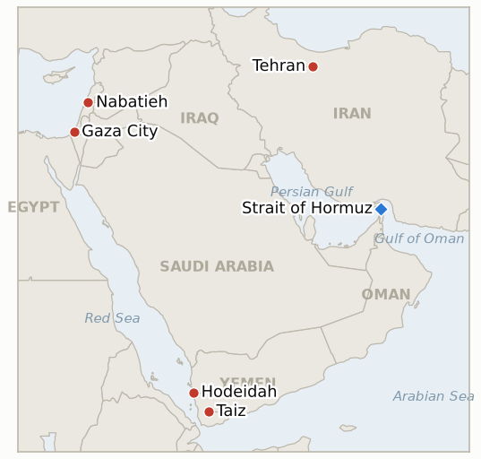

# Middle East Daily Briefing

**September 7, 2026**

- **Reporting window:** ~24 hours, September 6, 09:00 to September 7, 09:00 KST
- **Overall assessment:** Iran's own parliament raised the rhetorical stakes a day after the war's first direct strike on US Navy vessels: Speaker Mohammad Bagher Ghalibaf told an open session that "the era of proportionate responses is over" and any further move against Iran's interests would draw a response that is "faster, heavier, and more painful," a declaration analysts read as removing Tehran's own self-imposed ceiling on retaliation even as the tanker for tanker exchange continues at sea. Lebanon absorbed the widest single day of Israeli strikes since the June ceasefire framework, four towns hit, a hospital and government ministry offices among the buildings damaged and at least seven dead, prompting President Joseph Aoun to publicly call on Washington to intervene against what he termed a dangerous escalation reaching the Lebanese state itself. Yemen's renewed war reached a new inflection as government forces captured Hays district at the Hodeidah Taiz Ibb junction and pushed into three fronts simultaneously, even as the toll across four days of fighting passed 117 dead and analysts cautioned the gains do not yet amount to a decisive shift. For South Korea, the reporting window carried the Hormuz question onto a new stage: President Lee Jae-myung departed for a state visit to France where his summit with President Macron is expected to touch on multinational cooperation to secure the strait, even as the domestic debate over an actual deployment hardened along party lines in his absence. And in Gaza, US envoy Jared Kushner broke with the administration's usual public deference to Netanyahu, calling Israel's government "a little irrational" on Gaza because of next month's election, an unusually candid acknowledgment that the Board of Peace's disarmament roadmap remains stuck on the same politics it was designed to work around.

---

## 1. What Happened

<figure style="float:right; width:46%; margin:2pt 0 8pt 14pt;">

<figcaption style="font-size:8pt; color:#666; text-align:center; margin-top:3pt; font-style:italic;">Major places of discussion</figcaption>
</figure>

### 1.1 Iran's Parliament Speaker Declares the Era of Proportionate Responses Over

Speaking in an open session of parliament on Sunday, a day after the IRGC's failed ballistic missile attack on two US Navy warships and CENTCOM's retaliatory destruction or disabling of three Iranian government tankers, Speaker and chief negotiator Mohammad Bagher Ghalibaf said "if they haven't understood by now, they should understand before it's too late that the rules of the game have changed," and warned that any further violation of Iran's interests and security would now draw a response that is "faster, heavier, and more painful" ([La Voce di New York](https://lavocedinewyork.com/en/news/2026/09/06/irans-ghalibaf-proportionate-responses-over-as-us-strikes-tankers/); [Fortune](https://fortune.com/2026/09/06/iran-faster-heavier-painful-oil-tankers-attack-attempt-warships/); [IRNA](https://en.irna.ir/amp/86256429/)). The statement came as Al Jazeera's own survey of the widening tanker war quoted defense analyst Wolfgang Pusztai calling the US tanker strikes "a very, very significant development" and analyst Ali Akbar Dareini warning the exchange "incentivises Iran to lash out and retaliate more harshly," predicting Tehran wants oil prices to clear $100 a barrel; Brent traded near $96.28, its highest since July 24, alongside a record US diesel price of $5.85 a gallon ([Al Jazeera](https://www.aljazeera.com/news/2026/9/6/us-iran-engaged-in-tanker-war-where-is-the-months-long-conflict-headed)). CENTCOM's own commander, Adm. Brad Cooper, had framed the tanker strikes explicitly as tit for tat: "If you shoot at two of our ships, we will impose an even higher economic cost, taking out three of yours." No further Iranian attack on a US Navy vessel was reported in the window, leaving **IND-20260906-1** open. **Confidence: High** on Ghalibaf's remarks and their venue, an open parliamentary session carried by IRNA and multiple wires (Tier 1-2); Medium on whether the rhetoric reflects an actual operational shift in Iran's rules of engagement, which only a further incident can test.

### 1.2 Israel Widens South Lebanon Strikes to Four Towns, Killing at Least Seven

Israeli warplanes struck Nabatieh al-Fawqa, Arab Salim, Nabatieh city and Kfar Rumman early Sunday, after the military said Hezbollah launched two explosive drones at IDF troops in the occupied buffer zone, one intercepted, the other striking near the Ali al-Taher Ridge area with no soldiers hurt ([Times of Israel](https://www.timesofisrael.com/4-killed-as-israel-strikes-south-lebanon-after-hezbollah-drones-target-troops); [Arab News](https://www.arabnews.com/middle-east/lebanons-aoun-calls-for-us-help-after-israeli-strikes-kill-4-amid-hezbollah-drone-claims-3000647)). The IDF issued an online evacuation warning at 6 a.m. local time for a building in Arab Salim it said Hezbollah was using, then struck it, killing two women and wounding six, including two girls; separately two men were killed in a town on the edge of the security zone. Lebanese officials said the toll across the day's strikes reached at least seven dead and roughly 20 wounded, with an out of service hospital in Nabatieh al-Fawqa destroyed and government ministry premises, including finance and agriculture offices, damaged for a second time in this campaign. President Joseph Aoun called the strikes "a dangerous escalation... reaching Lebanese state institutions" and urged Washington and the international community to intervene to halt violations of the June framework agreement. This is the third widening episode in the cycle this ledger tracks under **IND-20260905-3**, which remains open pending any UNIFIL, Lebanese Armed Forces or US mediated statement addressing the pattern itself; Aoun's appeal is a Lebanese head of state statement, not yet the specific institutional trigger the indicator tests. **Confidence: High** on the strike locations and toll (Tier 1-3, Lebanese Health Ministry figures carried by Times of Israel, Arab News, Al Jazeera and France24); Medium on the precise justification chain, since the claimed Hezbollah drone launch is undisputed but its operational significance is contested between the two sides.

### 1.3 Yemen's Government Forces Capture Hays District as the War's Toll Passes 117

Yemeni government forces announced Sunday they had taken full control of Hays district in Hodeidah province, a strategic junction of Hodeidah, Taiz and Ibb provinces, after securing its remaining rural areas Saturday evening, and pressed simultaneously into neighboring al-Jarrahi district, toward Jabal Ra's and south into al-Barh in Taiz province ([TASS](https://tass.com/world/2183363); [Yemen Monitor](https://www.yemenmonitor.com/en/Details/ArtMID/908/ArticleID/181068)). In Taiz itself, government forces said they captured several positions on the Hayfan front, while Houthi forces fired three ballistic missiles at Taiz city. Four days into the renewed fighting that began September 3, the confirmed toll has reached at least 117 dead, 54 government soldiers and 63 Houthi fighters, with roughly 1,800 families displaced ([The Business Standard](https://www.tbsnews.net/world/least-117-killed-fierce-government-houthi-fighting-rages-western-yemen-1535281)). Al Jazeera's own analysis cautioned the gains, while real, "do not yet amount to a decisive shift" in Yemen's long running war ([Al Jazeera](https://www.aljazeera.com/news/2026/9/6/how-significant-are-the-yemeni-governments-military-gains-against-the-houthis); [Al Jazeera](https://www.aljazeera.com/news/2026/9/6/yemeni-forces-claim-strategic-district-amid-intensified-houthi-clashes)). No confirmation surfaced in the window of a further government air force strike beyond the initial September 5 wave, leaving **IND-20260906-3** open. **Confidence: High** on the Hays capture and overall toll (Tier 1-2, multi-outlet including TASS, Al Jazeera and AFP sourced reporting); Medium on the precise Hayfan front claims and Houthi casualty count, which come predominantly from the government side.

### 1.4 President Lee Departs for Paris as Korea's Hormuz Debate Hardens at Home

President Lee Jae-myung left Sunday for a four day visit to France, first to co-chair the Lumiere Summit on cinema near Saint-Paul-de-Vence before a two day state visit to Paris including a summit and banquet with President Emmanuel Macron; while cultural, AI and nuclear power cooperation top the announced agenda, Korean outlets flagged the meeting is drawing attention over whether the two leaders will discuss Seoul's possible military contribution to securing the Strait of Hormuz, a subject France has led multinational planning on since convening 35 countries' military officials in March ([Korea Herald](https://www.koreaherald.com/article/10863883); [SBS](https://news.sbs.co.kr/english/article.do?news_id=N1008739734)). At home, the domestic debate hardened in Lee's absence: government spokesman Jo Yong-sool warned that continued public equivocation over the deployment was "shaking diplomatic credibility," and conservative People Party lawmaker Ahn Cheol-soo repeated his call for Korea to send the assets, while Democratic Party lawmaker Lee Ki-heon countered "we cannot accept Hormuz deployment under any pretext," a split that Korean commentary explicitly compared to the divided 2003 Iraq deployment vote, when 49 of the then ruling party's own lawmakers voted for and 43 against ([Financial News](https://www.fnnews.com/news/202609061524371557)). No formal National Assembly motion has yet been filed. **Confidence: High** on Lee's travel schedule and the domestic political split (Tier 1-2, Korean wire and financial press, multiple named lawmakers on record); Medium on whether Hormuz will actually be raised substantively with Macron, which Korean outlets flag as likely but unconfirmed ahead of the summit.

### 1.5 Kushner Calls Netanyahu's Government "a Little Irrational" on Gaza

US envoy Jared Kushner, speaking during a visit to Kyiv, said Israel's approaching Knesset election has made Netanyahu's government act "a little irrational" on Gaza: "I think we agree with the Israelis on the end state for Gaza. They just have crazy elections, and that makes them a little irrational in certain regards" ([Times of Israel](https://www.timesofisrael.com/liveblog-september-06-2026/)). The remark is the most candid public break yet from the administration's usual deference to Netanyahu, and comes as the Board of Peace's push to advance Hamas disarmament under its 15 point framework remains stalled on the same election politics; Netanyahu has told Kushner and Board of Peace envoy Nickolay Mladenov in prior meetings that progress before the October 27 vote is politically "problematic," while National Security Minister Ben Gvir's competing "Disengagement 710" Gaza emigration plan continues to draw no confirmed host country interest. Neither a formal government step on Ben Gvir's plan nor a disclosed policy consequence from Kushner's comment surfaced in the window, leaving **IND-20260904-2** open. **Confidence: High** on Kushner's quote and venue (Tier 1-2, Times of Israel direct reporting); Medium on how much the comment reflects a genuine US shift in pressure versus a passing aside, which only a follow up US action can test.

---

## 2. Deep Dive: Incentives and Motives

### 2.1 Why does Ghalibaf's declaration that "proportionate responses" are over mark a more dangerous signal than Iran's earlier deterrence rhetoric?

Because unlike prior individual threats tied to a specific target, this is Iran's own parliamentary leadership publicly discarding the framework, matching each US strike with a calibrated, contained Iranian response, that has structured the war's escalation ladder since February; by declaring that framework over in an open, recorded legislative session rather than a background briefing, Ghalibaf raises the domestic political cost of Iran's own leadership responding with anything less than disproportionate force the next time the US strikes, which analysts like Ali Akbar Dareini read as an incentive toward exactly the kind of harsher retaliation that risks a wider war neither side has yet chosen outright.

### 2.2 Why is Israel widening its south Lebanon campaign to hit a hospital and government ministries despite the June ceasefire framework?

Because the operational logic Israel has applied since the September 4 exchange, that any Hezbollah drone launch anywhere in the security zone justifies a proportionally large retaliatory strike regardless of the structure it hits, has not been revised even as the strikes now reach an out of service hospital and finance and agriculture ministry buildings for a second time; hitting state institutions specifically signals to Beirut that the cost of Hezbollah's continued operations will be borne by the Lebanese state's own infrastructure, not just the group itself, a pressure campaign aimed at forcing Aoun's government to make good on its own disarmament pledge rather than absorbing the strikes as a cost of coexistence with Hezbollah.

### 2.3 Why are Yemeni government forces pressing three fronts simultaneously, and why do analysts still call the gains indecisive?

Because the government's Hays capture opens routes into three provinces at once, north to al-Jarrahi, east to Jabal Ra's, south to al-Barh, and momentum after four days of costly fighting favors converting tactical gains into territorial ones before the Houthis can reorganize a defensive line; but analysts caution the gains are indecisive because the government has captured similar strategic junctions in prior offensives only to see Houthi forces stabilize new lines within weeks, and 117 combined dead in four days, a toll roughly split between both sides, indicates neither side is collapsing, consistent with a war of attrition rather than a breakthrough.

### 2.4 Why would Kushner publicly call Netanyahu's government "irrational" now, and what does it reveal about the Gaza disarmament roadmap's real state?

Because after months of the Board of Peace publicly presenting incremental progress, working groups on disarmament and sanitation, a finalized roadmap, the actual blocker has not moved: Netanyahu has privately told US officials that visible movement before October 27 is "problematic," and Kushner's public acknowledgment is best read as an attempt to shift blame for the roadmap's stall onto Israeli domestic politics rather than US or Hamas intransigence, a signal aimed at preserving the framework's credibility with Arab mediators even as the substance remains stuck exactly where it was in mid-August.

---

## 3. Policy Implications for South Korea

**Exposure snapshot:** South Korea's crude imports remain roughly 70% dependent on Strait of Hormuz transit and about 36% of its LNG imports come from the Middle East, with Qatar's Ras Laffan as the single largest LNG supplier exposure (see `instructions/korea-exposure.md`, last updated August 14, 2026, for the full mitigation picture: non-Hormuz crude and naphtha reserves, the strategic reserve swap program, and Red Sea/Yanbu workaround routing). No material update to these baselines surfaced in the window.

**Implications by development:**

- **Ghalibaf's escalation threat (§1.1):** A parliamentary leadership declaring calibrated restraint over, if it holds operationally, raises the probability of a further Hormuz-adjacent shock that could reverse the currently stable Korean crude procurement position; MOTIE's supply review posture and the strategic reserve swap program remain the relevant instruments if a further Iranian strike materializes.
- **Lebanon's widened strikes (§1.2):** No direct Korean shipping or personnel exposure identified in this specific campaign, but the pattern of institutional targets being hit, government ministries, a hospital, reinforces the broader regional escalation risk MOFA's standing Level 3 advisories already price in.
- **Yemen's Hays capture and rising toll (§1.3):** The renewed Taiz Hodeidah fighting sits astride the same Bab el-Mandeb corridor Korea's Red Sea/Yanbu crude workaround transits; continued government-Houthi ground fighting away from the coast itself has not yet disrupted that route, but the corridor's risk premium remains structurally elevated per the exposure file's standing assessment.
- **Korea's own Hormuz deployment debate (§1.4):** This is now the most direct Korea specific policy line in the ledger; the Lee-Macron summit could either anchor Seoul's contribution inside a multinational (French-led) framework, reducing unilateral political exposure, or the summit could pass without a specific Hormuz deliverable, leaving the domestic coalition split as the binding constraint on any near-term deployment.
- **Kushner's Gaza comment (§1.5):** No direct Korea channel, though continued Gaza roadmap stagnation sustains the broader war's duration, the primary driver of Korea's structural Hormuz and Red Sea exposure discussed above.

**Testable indicators:**

- **IND-20260907-1** (new): Ghalibaf's declaration that "the era of proportionate responses is over," paired with the threat of a "faster, heavier, more painful" response, either converts into a qualitatively larger Iranian retaliatory strike beyond the existing tanker for tanker exchange, or joins this ledger's pattern of escalatory rhetoric that outpaces actual Iranian operations. Deadline ~2026-09-20.
- **IND-20260907-2** (new): Yemeni government forces' capture of Hays district and simultaneous advances toward al-Jarrahi, Jabal Ra's and al-Barh either hold and extend over the following two weeks, or are reversed by a Houthi counteroffensive, testing whether September 6's gains mark a real shift or another indecisive tactical swing in a war of attrition. Deadline ~2026-09-20.
- **IND-20260907-3** (new): President Lee's Paris state visit and summit with President Macron either produces a concrete outcome on Hormuz cooperation, a joint statement, a commitment inside France's multinational planning framework, or Korea's own deployment question, or the visit passes with cultural, AI and nuclear cooperation announcements only and no specific Hormuz deliverable. Deadline ~2026-09-10.
- **IND-20260907-4** (new): Kushner's public characterization of Netanyahu's government as "a little irrational" on Gaza either produces a visible US policy consequence toward Israel's government, a further public rebuke, disarmament roadmap pressure, or a disclosed change in US Israel coordination, or remains an isolated remark with no follow through. Deadline ~2026-09-20.
- **IND-20260906-1** (open): Whether the IRGC repeats a direct attack on a US Navy vessel; no repeat observed in this window. Deadline ~2026-09-19.
- **IND-20260906-2** (open): Whether Korea's Hormuz deployment reaches a formal National Assembly motion or vote; no motion filed as of this window, though the Lee-Macron summit and hardening domestic debate are both relevant developments. Deadline ~2026-09-28.
- **IND-20260906-3** (open): Whether Yemen's government air force sustains a direct combat role beyond its September 5 debut; no further government air strike confirmed in this window. Deadline ~2026-09-19.
- **IND-20260905-3** (open): Whether Lebanon's widened Hezbollah Israel exchange draws a UNIFIL, LAF or US mediated statement; Aoun's appeal to Washington is a head of state statement, not yet the specific institutional trigger the indicator tests. Deadline ~2026-09-19.

---

## 4. Watch List

- **Mecca Joint Defence Agreement (IND-20260809-2):** deadline ~09-08, one day out; no concrete implementing step (joint exercise, basing arrangement, invocation) reported beyond Erdogan's earlier rhetorical framing of Hormuz reopening as a "priority."
- **Masafer Yatta and Jannatah settler-violence enforcement (IND-20260825-2, IND-20260826-2):** both deadline ~09-08; watch for the actual resolution note tomorrow given the mixed picture (further arrests and a demolition both recorded).
- **Pickaxe Mountain (IND-20260905-1):** still not struck as of this window; multiple analyses this week attribute the delay to the site's unfinished construction rather than any change in Trump's stated intent.
- **Ben Gvir's Disengagement 710 plan (IND-20260904-2):** still no confirmed host country interest or formal government action, now overlapping with Kushner's public friction over Gaza policy.
- **Janggeum Shipping's Hormuz exposure (IND-20260903-3):** deadline ~09-17; no verified change in the Korean-linked charterer's Hormuz activity or a Korean government advisory yet.
- **Qatari LNG loadings at Ras Laffan (IND-20260714-4):** still no fresh weekly loading figure; the export freeze remains the ledger's longest-running unresolved indicator.

---

## 5. Source Quality Summary

| Claim | Sources | Confidence |
|---|---|---|
| Ghalibaf declares "proportionate responses" over, threatens "faster, heavier, more painful" response | IRNA (Tier 1, state media, direct quote); La Voce di New York, Fortune (Tier 2, wire pickup) | High |
| US Iran tanker war context, oil price and analyst reads | Al Jazeera (Tier 2) | High on facts; Medium on analyst predictions |
| Israeli strikes kill at least seven across four south Lebanon towns; hospital and ministry buildings hit | Times of Israel, Arab News, Al Jazeera, France24 (Tier 1-3, Lebanese Health Ministry figures, multi-outlet) | High |
| Aoun calls strikes "a dangerous escalation" and appeals to Washington | Arab News (Tier 2, direct quote) | High |
| Yemeni government forces capture Hays district, advance on three fronts | TASS, Yemen Monitor (Tier 2-3, government sourced) | High on the capture; Medium on Hayfan front and Houthi casualty specifics |
| Yemen's four day toll passes 117 dead | The Business Standard (Tier 2, AFP sourced) | High |
| President Lee departs for France; Hormuz cooperation expected with Macron | Korea Herald, SBS (Tier 1-2, Korean wire) | High on travel; Medium on whether Hormuz is substantively raised |
| Korea's domestic Hormuz deployment debate hardens (Jo Yong-sool, Ahn Cheol-soo, Lee Ki-heon) | Financial News (Tier 2, Korean financial press, named quotes) | High |
| Kushner calls Netanyahu's government "a little irrational" on Gaza | Times of Israel (Tier 1, direct quote, on the record) | High |
