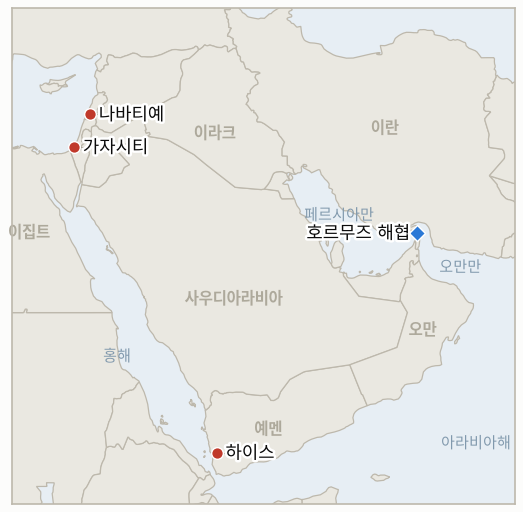

# 중동 일일 브리핑

**2026년 9월 8일**

- **보고 기간:** 약 24시간, 9월 7일 09:00 ~ 9월 8일 09:00 (한국시간)
- **종합 평가:** 예멘의 재개된 내전이 지금까지 가장 급격한 전환점을 맞았다. 확인된 사망자 수가 일요일 117명에서 월요일 300명 이상으로 뛰어올라 2022년 휴전 붕괴 이후 가장 참혹한 국면이 됐으며, 그 와중에도 정부군은 하이스를 지키고 알자우프주에서 후티 기지를 추가로 장악했으며 모카 항구에 대한 후티의 공세도 격퇴했다. 다만 분석가들은 양측 모두의 손실 규모를 감안하면 이를 결정적 전과로 부르기에는 여전히 이르다고 본다. 이스라엘의 레바논 남부 공세는 그 자체로 판돈을 키우는 방식으로 다시 확대됐다. 크파르 루만 인근에서 드론 공격이 차량에 타고 있던 의료진 2명을 살해했고, 같은 마을에서 별도의 공습이 주거용 건물을 타격했으며, 나바티예의 간두르 병원이 파괴돼 이 작전에서 병원이 파괴된 것은 처음이었다. 이로 인해 36시간 동안의 해당 지역 사망자 수는 집계에 따라 최대 18명에서 30명에 이른다. 이란은 자신의 수사를 말로만 시험했다. 관영 매체는 혁명수비대가 호르무즈 해협의 "보호구역"에 진입하려던 미군 무인 선박을 타격했다고 주장했지만 어떤 미국 측이나 서방 측 확인도 없었으며, 이로써 갈리바프가 위협한 "더 빠르고 더 무겁고 더 고통스러운" 대응은 여전히 검증된 실제 행동으로 뒷받침되지 않은 채 남았다. 한국에는 이재명 대통령이 마크롱 대통령과의 화요일 정상회담을 앞두고 파리에 도착했으며, 호르무즈 협력이 의제로 명시적으로 올라 있는 가운데, 대통령실은 국회 파병 동의안 제출이 임박했다는 보도를 직접 부인했다. 전쟁과는 전혀 무관하게 코스피는 전세계 AI·반도체 랠리에 힘입어 4.61% 급등해 사상 최고치에 근접한 6995.39를 기록했다. 그리고 이스라엘-팔레스타인 국면에서는 쿠슈너 미 특사의 일요일 발언, 네타냐후 정부가 가자 정책에서 "다소 비이성적"이라는 발언에 하레츠의 반박 칼럼만 나왔을 뿐 양국 정부 어느 쪽도 공식 대응하지 않았으며, 요르단강 서안 하자 마을 급습에서는 군과 정착민이 양쪽에서 몰려들어 함께 발포한 끝에 팔레스타인 19세가 숨졌다.

**정정 및 업데이트:** 9월 7일 브리핑(§1.4)은 파병을 둘러싼 모호함이 "외교적 신뢰를 흔들고 있다"고 경고한 조용술을 정부 또는 대통령실 대변인으로 잘못 표기했다. 그는 실제로는 야당인 국민의힘 대변인이며, 그의 발언은 정부 발표가 아니라 이재명 정부의 파병 처리 방식에 대한 야당의 비판이었다. `instructions/glossary-ko.md`의 조용술 관련 고정 표기도 이에 맞춰 정정했다.

---

## 1. 무슨 일이 있었나

<figure style="float:right; width:46%; margin:2pt 0 8pt 14pt;">

<figcaption style="font-size:8pt; color:#666; text-align:center; margin-top:3pt; font-style:italic;">주요 논의 지점</figcaption>
</figure>

### 1.1 예멘 사망자 300명 넘어서다, 정부군은 하이스 사수하며 전과 확대

예멘 정부군은 월요일 하이스 지구를 사수하는 한편 여러 전선에서 공세를 더 밀어붙였다. 호데이다·타이즈·이브 축과는 별개의 북부 전선인 알자우프주에서 후티 군사기지를 장악했고, 홍해의 모카 항구에 대한 후티의 공세를 격퇴했으며, 정부 공군은 모카 인근 반격을 지원하는 새로운 출격을 단행했다([Israel Hayom](https://www.israelhayom.com/2026/09/07/yemen-government-forces-capture-houthi-base-jawf/); [Al Jazeera](https://www.aljazeera.com/news/2026/9/7/yemen-govt-forces-launch-air-strikes-on-houthi-targets)). 그러나 이번 공세의 대가는 하룻밤 사이 급격히 커졌다. AFP 집계에 따르면 합산 사망자 수는 일요일 117명에서 300명 이상으로 뛰었고, 단 24시간 만에 정부군 84명과 후티 57명이 숨졌으며, 버스에 대한 미사일 공격으로 민간인 6명이 숨지고 7명이 다쳤다. 이는 2022년 휴전 붕괴 이후 가장 참혹한 전투였다([Arab News](https://www.arabnews.com/middle-east/toll-from-yemen-clashes-passes-300-as-civilians-flee-homes-3000718); [Business Recorder](https://www.brecorder.com/news/40438242/toll-from-yemen-clashes-passes-300-as-civilians-flee-homes); [Al-Monitor](https://www.al-monitor.com/originals/2026/09/toll-yemen-clashes-passes-300-civilians-flee-homes)). 9월 3일 전투 재개 이후 유엔이 집계한 피란민 수는 이미 1,790가구를 넘어선 상태에서 더 늘었다. 하이스를 비롯한 전과가 2주간 유지·확대되는지를 검증하는 **IND-20260907-2**는 확증 쪽으로 기우는 추세이나, 사망자 규모를 고려하면 이를 손쉽고 명백히 결정적인 전환으로 읽기는 복잡하다. **신뢰도: 높음** (사망자 수와 알자우프 장악, 1~2등급 출처, AFP 통신 기반 다수 매체); 모카 방어전과 하이판 인근 주장의 구체적 내용은 정부 측 및 정부 우호적 소식통에 주로 의존해 **중간**.

### 1.2 이스라엘의 레바논 남부 공세 한층 확대, 의료진 사망하고 병원 파괴되다

일요일 밤부터 월요일까지 크파르 루만 인근 이스라엘 공습은 두 건의 사건에 걸쳐 최소 9명에서 12명을 살해했다. 드론 공격이 의료진 2명이 타고 있던 차량을 타격해 두 사람 모두 숨졌고, 별도의 공습은 주거용 건물을 타격했으며 사전 대피 경고는 없었다. 이스라엘군은 해당 지역에서 이스라엘군을 겨냥한 헤즈볼라의 드론 공격에 대응해 무기를 "운반 중이던" 무장세력을 노렸다고 밝혔다([Washington Post](https://www.washingtonpost.com/world/2026/09/07/lebanon-israel-airstrikes-kfar-rumman/721e03e8-aa95-11f1-b498-8697f35a6743_story.html); [Al Jazeera](https://www.aljazeera.com/news/2026/9/7/israeli-air-attack-kills-at-least-10-people-in-southern-lebanon); [Al-Monitor](https://www.al-monitor.com/originals/2026/09/israeli-strikes-southern-lebanese-town-kill-12-fears-escalation-mount)). 같은 확대된 작전 속에서 나바티예의 간두르 병원이 파괴돼 이 작전에서 병원이 파괴된 것은 처음이었고, 재무부 청사도 피해를 입어 36시간 동안 나바티예 일대의 합산 사망자 수는 집계에 따라 최대 18명에서 30명에 이르렀다([L'Orient Today](https://today.lorientlejour.com/article/1546678/israeli-strikes-kill-2-women-in-arab-salim-destroy-ghandour-hospital-in-nabatieh.html); [Naharnet](https://naharnet.com/stories/en/322304-israel-targets-car-in-nabatieh-wages-fresh-airstrikes-on-nabatieh-al-fawqa)). 유엔 대변인 스테판 뒤자릭이 앞서 "블루라인 이북의 광범위한 이스라엘군 주둔은... 안보리 결의 1701호와 레바논의 주권을 위반한다"고 밝힌 성명([UN News](https://news.un.org/en/story/2026/09/1168275))은 이번 주기의 사망자 급증보다 앞선 것으로 이를 특정해 언급하지 않아, 확대된 교전에 대한 유엔평화유지군(UNIFIL)·레바논군·미국 중재 성명 여부를 검증하는 **IND-20260905-3**은 열린 상태로 남는다. 의료진과 병원을 표적으로 삼은 것이 국제인도법 차원의 별도 대응을 끌어내는지는 신규 **IND-20260908-1**로 검증한다. **신뢰도: 높음** (공습 위치와 사망자 수 범위, 병원 파괴, 1~3등급 출처, 워싱턴포스트·알자지라·로리앙투데이·나하르넷 등 다수 매체); 정확한 정당화 근거는 논쟁적인 헤즈볼라 드론 공격 주장에 의존해 **중간**.

### 1.3 혁명수비대, 호르무즈서 미군 무인 선박 타격 주장하나 워싱턴은 미확인

이란 관영 매체는 토요일 혁명수비대가 이란이 "보호구역"이라 부르는 호르무즈 해협 구역에 진입하려던 미군 무인 선박을 타격했다고 보도했으며, 혁명수비대 하탐 알안비야 합동사령부는 별도로 미군의 추가 해상 행동이 있을 경우 "이전보다 더 심각하고... 확대될 가능성이 있는" 공격에 직면할 것이라고 경고했다([Tasnim](https://www.tasnimnews.ir/en/news/2026/09/06/3689747/irgc-strikes-us-warships-tankers-in-response-to-attacks-on-iranian-vessels); [GlobalSecurity/RFE-RL](https://www.globalsecurity.org/wmd/library/news/iran/2026/09/iran-260906-rferl04.htm)). 이번 보고 기간 중 이 주장을 확인하거나 부인하는 중부사령부, 국방부 등 미국 측 성명은 발견되지 않았다. 이는 9월 5일 유인 미 해군 함정 두 척에 대한 확인된 혁명수비대 미사일 공격보다 신뢰도와 파급력이 현저히 낮은 사례로, **IND-20260906-1**은 열린 상태로 남고, 확인 여부 자체는 신규 **IND-20260908-2**로 별도 추적한다. 한편 중부사령부는 대이란 해상 봉쇄를 "엄격히 준수시키기 위해" 상선 92척을 우회시키고 3척을 무력화했으며 2척을 추가로 승선 검색했다고 밝혔고([CBS News](https://www.cbsnews.com/live-updates/iran-war-us-trump-diesel-gas-prices-labor-day/)), 갈리바프는 확장된 발언에서 "적이 페르시아만에서 우리 원유를 수출하지 못하게 하려 한다면, 누구도 수출할 수 없게 될 것"이라고 경고했다([Middle East Eye](https://www.middleeasteye.net/live-blog/live-blog-update/irans-response-us-attacks-will-be-more-painful-ghalibaf-says); [Tehran Times](https://www.tehrantimes.com/news/529766/Qalibaf-warns-of-faster-heavier-Iranian-response-to-any-new)). 브렌트유는 7월 말 이후 최고치인 97.05달러까지 올랐다. **신뢰도: 낮음** (무인 선박 타격 주장 자체, 3등급, 이란 관영매체 단독 보도로 독립적 검증 없음); 중부사령부의 봉쇄 집행 관련 발표와 갈리바프의 발언은 **높음** (1~2등급).

### 1.4 한국 대통령실, 파병 동의안 임박설 부인… 이재명 파리 도착, 코스피는 사상 최고 속도

이재명 대통령은 월요일 생폴드방스 인근에서 마크롱 대통령과 뤼미에르 정상회의를 공동주재한 뒤 그날 저녁 파리에 도착했으며, 화요일에는 개선문 무명용사 묘역 헌화, 공식 환영식, 마크롱 대통령과의 확대 정상회담과 엘리제궁 만찬으로 이어지는 본격 국빈방문 일정이 예정돼 있다. 한국 언론은 호르무즈 관련 "군사 기여 방식"이 인공지능·원자력 협력과 함께 의제에 명시적으로 올라 있다고 짚었으나, 정상회담 자체는 이번 보고 기간이 끝난 이후에 열린다([Korea Herald](https://www.koreaherald.com/article/10864263); [Kukmin Ilbo](https://www.kmib.co.kr/article/view.asp?arcid=9000009494)). 국내에서는 MBC가 정부가 여전히 동의안 문구를 다듬고 있으며 "이달 안에" 국회에 제출할 것으로 예상된다고 보도했지만, 대통령실은 이 같은 보도를 정면으로 반박하며 "사실과 다르다"면서 "아직 국회에 동의안을 보내는 단계가 아니다"라고 밝혔다([MBC](https://imnews.imbc.com/replay/2026/nw1200/article/6849616_36967.html)). 여야 모두 신중한 태도를 보이는 것으로 전해졌으며, 여권 내부의 반대 기류 자체가 연정을 흔들 "뇌관"이 될 수 있다는 지적도 나왔다([Aju News](https://www.ajunews.com/view/20260907112149450)). 전쟁과는 전혀 무관하게 코스피는 전세계 AI·반도체 랠리(SK하이닉스 +8.26%, 삼성전자 +5.68%)에 힘입어 308.18포인트(+4.61%) 오른 6995.39로 7,000선에 근접했고, 원화도 1340.5원으로 강세를 보였다([Money Today](https://www.mt.co.kr/stock/2026/09/07/2026090715333651094); [Businesskorea](https://www.businesskorea.co.kr/news/articleView.html?idxno=276351)). **신뢰도: 높음** (이 대통령의 일정, 대통령실의 부인, 증시 마감가, 1~2등급 출처, 한국 통신사 및 경제지); 마크롱 대통령과의 화요일 실제 정상회담에서 호르무즈가 실질적으로 다뤄질지는 이번 보고 기간에는 아직 확인되지 않아 **중간**.

### 1.5 쿠슈너의 가자 발언에 무대응… 요르단강 서안 급습으로 팔레스타인 10대 숨져

네타냐후 총리실도 미 국무부도 일요일 쿠슈너 특사가 이스라엘 정부를 가자 정책에서 "다소 비이성적"이라 평한 발언에 공식 대응하지 않았다. 하레츠는 이 표현을 정면으로 반박하는("그의 말은 틀렸다") 오피니언 칼럼을 게재했는데, 이는 발견된 가장 눈에 띄는 반박이었으나 정책적 대응이 아니라 논평에 그쳤다([Haaretz](https://www.haaretz.com/israel-news/haaretz-today/2026-09-07/ty-article/.highlight/kushner-says-israels-crazy-election-makes-it-irrational-on-gaza-hes-wrong/000001a0-7bb6-d7d5-a9fc-7fff241c0000); [Times of Israel](https://www.timesofisrael.com/kushner-israel-acting-a-little-irrational-on-gaza-due-to-upcoming-election)). 한편 요르단강 서안에서는 월요일 하자 마을 급습 중 팔레스타인 19세가 총에 맞아 숨지고 3명이 다쳤는데, 주민들은 이스라엘군과 정착민들이 양쪽에서 몰려들어 함께 발포했다고 전했으며, 별도로 마오즈 예후다 전초기지 인근에서는 팔레스타인 남성이 정착민을 흉기로 찌르고 도주했다가 이후 체포됐다([Al-Monitor](https://www.al-monitor.com/originals/2026/09/two-palestinians-killed-israeli-stabbed-west-bank-settler-violence-flares); [Palestine Info Center](https://english.palinfo.com/news/2026/09/07/369691/)). 벤그비르의 가자 이주 계획 "디스인게이지먼트 710"에 대해서는 확인된 대상국의 관심도, 정부의 공식 조치도 없어 **IND-20260904-2**는 열린 상태로 남으며, 군과 정착민이 함께 연루된 하자 급습은 정착민 단독 사건만을 다뤄온 이 장부의 기존 집행 선례와는 구별되는 신규 **IND-20260908-3**으로 검증한다. **신뢰도: 높음** (쿠슈너의 발언과 공식 대응의 부재, 1~2등급 출처, Times of Israel·CBS·Haaretz); 하자 급습의 정확한 경위는 주민 증언과 팔레스타인계 매체 및 Al-Monitor에 부분적으로 의존해 **중간**.

---

## 2. 심층 분석: 유인과 동기

### 2.1 예멘의 사망자 수가 공세가 계속 전진하는 와중에도 하룻밤 사이 거의 세 배로 뛴 이유는 무엇이며, 이는 전쟁의 실제 궤적에 대해 무엇을 말해주는가?

하이스, 알자라히, 알자우프, 모카 등 세 개 이상의 전선을 동시에 압박하는 것은 후티 측이 한정된 병력으로 여러 축을 동시에 방어하도록 강제하며, 사망자 급증은 이 전략이 실패하고 있다는 증거라기보다 그 전략에 따른 직접적 대가이기 때문이다. 그러나 단 하루 만에 정부군 84명과 후티 57명이 숨진, 거의 균등하게 나뉜 사망자 수는 어느 쪽도 붕괴하고 있지 않음을 보여주며, 이는 알자지라 자체 분석가들이 앞선 전과를 두고 "아직 결정적 전환에는 이르지 못했다"고 경고했던 것과 같은 패턴이 이번에는 훨씬 높은 사상률로 반복되고 있음을 시사한다.

### 2.2 이스라엘의 레바논 남부 공세가 명백한 평판·법적 위험을 무릅쓰고 의료진 살해와 병원 파괴로까지 확대된 이유는 무엇이며, 지금까지 어떤 제도적 대응도 없다는 사실은 무엇을 시사하는가?

9월 초 이래 이 작전이 따라온 작전 논리, 즉 헤즈볼라의 어떤 드론 발사도 무엇을 타격하든 상관없이 비례적으로 대규모인 보복 공습을 정당화한다는 논리가, 이를 구체적으로 제약할 어떤 UNIFIL·레바논·미국 중재 성명도 없이 실제로 계속 확대되어 왔기 때문이다. 그나마 가장 근접한 제도적 견제인 유엔의 9월 2일 블루라인 이북 이스라엘군 주둔 관련 성명조차 이번 주의 의료진 살해와 병원 파괴보다 앞선 것으로 이를 특정해 언급하지 않는데, 이는 바로 이런 종류의 확대를 포착하도록 설계된 제도적 메커니즘이 현재 작전의 속도를 형성하기는커녕 오히려 한발 뒤처져 있음을 시사한다.

### 2.3 이란이 갈리바프의 수사에 부합하는 더 크고 검증 가능한 타격을 실행하는 대신 무인 선박에 대한 미확인 주장을 증폭시키는 이유는 무엇인가?

무인 선박에 대한 타격 주장은 유인 미 함정에 대한 타격이 유발할 중부사령부의 압도적 대응을 자초하지 않으면서도, 특히 중부사령부가 이란 유조선 세 척을 파괴한 직후라는 시점에서, 지속적인 결의를 신호하고 갈리바프의 위협을 수사적으로 살려두는 저비용·저위험 방식이기 때문이다. 국회의장이 선언한 "비례적 대응 시대의 종료"와 실제 작전 현실, 즉 미확인된 데다 무인 자산을 대상으로 한 주장 사이의 간극은 테헤란의 실제 확전 여력이 공개 수사가 시사하는 것보다 훨씬 좁다는 점을 보여준다.

### 2.4 한국 대통령실이 이재명·마크롱 정상회담을 앞두고 파병 동의안 임박설을 정면으로 부인한 이유는 무엇인가?

정상회담에 앞서 국회 동의안을 제출하면 서울의 협상 위치가 일방적으로 고정되는 반면, 기다리면 이 대통령이 파리에서 마크롱 정부가 내놓는 어떤 다국적 틀이든 그것을 가지고 귀국할 수 있기 때문이다. 이는 파병 결정을 미국의 직접 압박에 따른 단독 행동이 아니라 이미 확립된 연합체에 합류하는 것으로 제시함으로써 국내 정치적 비용을 낮추는 순서 짜기 전략이며, 성급하게 국내에서 동의안을 제출하면 이런 이점을 스스로 포기하게 된다.

### 2.5 쿠슈너의 발언이 언론의 반박은 낳으면서도 양국 정부의 공식 대응은 이끌어내지 못한 이유는 무엇이며, 이는 네타냐후의 가자 접근법에 대한 미국의 실제 영향력에 대해 무엇을 드러내는가?

워싱턴과 예루살렘 모두 이 발언을 파열이 아니라 지나가는 말로 취급하는 데 이해관계가 일치하기 때문이다. 미 행정부는 이스라엘 총선을 몇 주 앞두고 가장 가까운 역내 동맹을 공개적으로 질책하는 모습으로 비치기를 원치 않고, 네타냐후 정부로서는 이미 스스로의 서사를 훼손하는 발언을 굳이 증폭시키기보다는 그냥 대응하지 않는 편이 잃을 것이 적다. 그 결과 선거 정치가 로드맵 정체를 실제로 얼마나 설명하는지에 대한 실질적 논쟁은 하레츠의 오피니언 지면에서만 이루어지고 있다.

---

## 3. 한국에 대한 정책적 함의

**익스포저 현황:** 한국의 원유 수입은 여전히 약 70%가 호르무즈 해협 통항에 의존하고 있으며, LNG 수입의 약 36%가 중동산이다. 카타르 라스라판이 단일 최대 LNG 공급 노출원이다(전체 완화 방안, 즉 비호르무즈 원유·나프타 비축, 전략비축유 스와프 프로그램, 홍해·얀부 우회 경로에 대해서는 2026년 8월 14일 최종 갱신된 `instructions/korea-exposure.md` 참조). 이번 보고 기간 중 이 기준치에 대한 중대한 갱신은 없었으나, Korea Times는 별도로 외교부의 기존 수치, 지난해 원유의 61%와 나프타의 54%가 호르무즈를 통항했다는 통계를 인용했다.

**사안별 함의:**

- **예멘의 사망자 증가와 전과 확대 (§1.1):** 호데이다·타이즈·모카 전투는 한국의 홍해·얀부 원유 우회 경로가 지나는 바로 그 바브엘만데브 회랑에 걸쳐 있다. 전투는 여전히 해안에서 떨어진 지상전이지만, 거의 세 배로 늘어난 사망자 수와 늘어나는 활성 전선(알자우프·모카 포함)은 확인된 교란이 아직 없더라도 이 회랑에 대한 구조적 위험을 높인다.
- **이스라엘의 레바논 공세 확대 (§1.2):** 한국의 직접적인 선박이나 인력 노출은 없으나, 어떤 제도적 견제도 없이 의료진 살해와 병원 파괴로까지 이어진 상황은 외교부의 기존 3단계 여행경보가 이미 반영하고 있는 광범위한 역내 확전 위험을 재확인시킨다.
- **이란의 미확인 호르무즈 선박 타격 주장 (§1.3):** 미확인 상태임에도 이 주장과 갈리바프의 계속된 수사는 브렌트유가 97.05달러까지 오른 배경의 리스크 프리미엄을 지탱한다. 중부사령부의 봉쇄 집행 통계(선박 92척 우회, 3척 무력화, 2척 승선 검색)는 개별 공습뿐 아니라 봉쇄 자체가 한국 국적·용선 선박이 감당해야 할 호르무즈 통항 여건을 좌우하고 있음을 보여주는 가장 뚜렷한 신호다.
- **한국 자체의 호르무즈 파병 순서 짜기 (§1.4):** 대통령실의 임박설 부인과 다가오는 이재명·마크롱 정상회담이 맞물린 것이 이 장부에서 가장 직접적인 한국 관련 정책 노선이다. 화요일 정상회담에서 프랑스를 축으로 한 다국적 틀이 나온다면 향후 파병 표결의 국내 정치적 비용이 실질적으로 달라질 것이다.
- **쿠슈너의 가자 발언과 서안 폭력 (§1.5):** 한국에 직접적인 통로는 없으나, 가자 로드맵의 계속되는 정체와 제어되지 않는 서안 폭력은 위에서 논한 한국의 구조적 호르무즈·홍해 노출을 좌우하는 전쟁 자체의 지속 기간을 늘리는 요인이다.

**검증 가능한 지표:**

- **IND-20260908-1** (신규): 이스라엘의 9월 7일 크파르 루만 인근 의료진 살해와 나바티예 간두르 병원 파괴가 국제적십자위원회·세계보건기구·유엔 인권 차원의 별도 대응이나 이스라엘의 조사로 이어지는지, 아니면 기존 확대 교전 양상에 흡수되는지를 검증한다. 시한 ~2026-09-22.
- **IND-20260908-2** (신규): 9월 6일 혁명수비대가 호르무즈 해협에서 미군 무인 선박을 타격했다는 이란 관영매체의 주장이 미국 측의 확인이나 부인으로 이어지는지, 아니면 서방의 어떤 검증도 없는 이란 측 단독 주장으로 남는지를 검증한다. 시한 ~2026-09-15.
- **IND-20260908-3** (신규): 군과 정착민이 함께 연루된 9월 7일 하자 급습이 정착민 단독 사건에 대한 이 장부의 기존 집행 선례처럼 실명 체포·기소·이스라엘군의 공식 조사로 이어지는지, 아니면 기소되지 않는 서안 폭력의 더 넓은 패턴에 합류하는지를 검증한다. 시한 ~2026-09-21.
- **IND-20260907-1** (진행): 갈리바프가 선언한 "비례적 대응 시대의 종료"가 질적으로 더 큰, 확인된 이란의 타격으로 전환되는지 검증한다. 이번 보고 기간에는 미확인 무인 선박 타격 주장만 나타났다. 시한 ~2026-09-20.
- **IND-20260907-2** (진행): 예멘 정부군의 전과가 유지·확대되는지 검증한다. 알자우프와 모카에서 새로운 전과가 나오며 유지됐으나, 사망자 규모로 인해 단순한 판단은 복잡해졌다. 시한 ~2026-09-20.
- **IND-20260907-3** (진행): 이재명·마크롱 정상회담이 구체적인 호르무즈 관련 성과를 내는지 검증한다. 정상회담 자체가 이번 보고 기간 종료 이후에 열려 아직 검증되지 않았다. 시한 ~2026-09-10.
- **IND-20260907-4** (진행): 쿠슈너의 발언이 눈에 보이는 미국의 정책적 결과로 이어지는지 검증한다. 이번 보고 기간에는 하레츠의 오피니언 반박만 나타났다. 시한 ~2026-09-20.
- **IND-20260906-1** (진행): 혁명수비대가 미 해군 함정에 대한 확인된 직접 공격을 반복하는지 검증한다. 무인 선박에 대한 미확인 이란 측 주장만 나타났다. 시한 ~2026-09-19.
- **IND-20260906-2** (진행): 한국의 호르무즈 파병이 정식 국회 동의안 단계에 이르는지 검증한다. 대통령실은 이번 보고 기간 중 임박설을 명확히 부인했다. 시한 ~2026-09-28.
- **IND-20260905-3** (진행): 레바논의 확대된 교전이 UNIFIL·레바논군·미국 중재 성명을 끌어내는지 검증한다. 이번 주의 사망자 급증을 특정해 언급한 성명은 없었다. 시한 ~2026-09-19.
- **IND-20260904-2** (진행): 벤그비르의 가자 이주 계획이 실명 대상국이나 정부의 공식 조치를 끌어내는지 검증한다. 이번 보고 기간에는 어느 쪽도 나타나지 않았다. 시한 ~2026-09-18.

---

## 4. 관찰 목록

- **메카 공동방위협정 (IND-20260809-2):** 오늘 시한에 **반증**으로 종결됐다. 서명 이후 한 달 동안 구체적인 이행 조치가 전혀 나오지 않았다.
- **마사페르 야타·자나타 정착민 폭력 집행 (IND-20260825-2, IND-20260826-2):** 둘 다 오늘 시한에 종결됐다. 마사페르 야타 패턴은 **확증**(9월 5일 쿠스라 사건의 두 번째 별도 정착민 체포가 기준을 충족)됐고, 자나타는 **반증**(뚜렷한 영상 증거에도 끝내 체포 없음)됐다.
- **픽액스 마운틴 (IND-20260905-1):** 이번 보고 기간까지도 타격되지 않았다. 시한 ~09-18.
- **벤그비르의 디스인게이지먼트 710 계획 (IND-20260904-2):** 여전히 확인된 대상국의 관심이나 정부의 공식 조치가 없으며, 이제 무관한 쿠슈너 관련 마찰과도 겹치고 있다.
- **잔금 시핑의 호르무즈 노출 (IND-20260903-3):** 시한 ~09-17. 이번 보고 기간 중 한국계 용선사의 호르무즈 활동 변화나 해당 회사에 특정된 한국 정부 권고는 확인되지 않았다.
- **라스라판 카타르 LNG 선적량 (IND-20260714-4):** 여전히 새로운 주간 선적 수치가 없다. 수출 동결은 이 장부에서 가장 오래 미해결 상태로 남은 지표다.

---

## 5. 출처 신뢰도 요약

| 주장 | 출처 | 신뢰도 |
|---|---|---|
| 예멘 정부군, 알자우프서 후티 기지 장악하고 모카 공세 격퇴, 정부 공군 추가 출격 | Israel Hayom, Al Jazeera (2~3등급) | 행동 자체는 높음; 이스라엘 매체의 예멘 보도 틀은 중간 |
| 예멘 재개 내전 사망자 117명에서 300명 이상으로 증가 | Arab News, Business Recorder, Al-Monitor (1~2등급, AFP 통신) | 높음 |
| 크파르 루만 인근 이스라엘 공습 9~12명 사망, 의료진 태운 차량과 주거 건물 표적 | Washington Post, Al Jazeera, Al-Monitor (1~2등급) | 높음 |
| 나바티예 간두르 병원 파괴, 36시간 지역 사망자 18~30명 | L'Orient Today, Naharnet (2등급) | 높음 |
| 유엔 대변인 뒤자릭의 블루라인 이북 이스라엘군 주둔 관련 성명 | UN News (1등급) | 성명 자체는 높음; 이번 사망자 수와의 연관성은 중간 |
| 혁명수비대, 호르무즈 "보호구역" 진입 시도 미군 무인 선박 타격 주장 | Tasnim, GlobalSecurity/RFE-RL (3등급, 이란 관영매체 단독) | 낮음 |
| 중부사령부 봉쇄 집행: 선박 92척 우회, 3척 무력화, 2척 승선 검색 | CBS News (1~2등급) | 높음 |
| 갈리바프의 확장된 위협("첫 걸음에 불과"; 원유 수출 경고) | Middle East Eye, Tehran Times (2~3등급) | 발언 자체는 높음; 작전적 의미는 중간 |
| 브렌트유 97.05달러, WTI 92달러 이상, 노동절 휴장 속 | TradingEconomics, FXDailyReport (2등급) | 중간 (정산가 아닌 장중 시세) |
| 이 대통령, 뤼미에르 정상회의 공동주재 후 마크롱 정상회담 앞두고 파리 도착 | Korea Herald, Kukmin Ilbo (1~2등급) | 높음 |
| 대통령실, 국회 파병 동의안 임박설 부인 | MBC, Aju News (1~2등급, 한국 통신사) | 높음 |
| 조용술, 정부가 아닌 국민의힘(야당) 대변인으로 확인 | Asiae, Herald Biz, Segye (2등급, 한국 언론) | 높음 |
| 코스피 +4.61% 6995.39, 원화 1340.5원 강세 | Money Today, Businesskorea (2등급) | 높음 |
| 쿠슈너 발언에 공식 대응 없음, 하레츠 오피니언 반박 | Times of Israel, CBS, Haaretz (1~2등급) | 발언과 무대응 자체는 높음; 침묵을 정책 신호로 해석하는 것은 중간 |
| 하자 급습으로 팔레스타인 10대 사망, 마오즈 예후다 흉기 사건 | Al-Monitor, Palestine Info Center (2~3등급) | 중간 |
