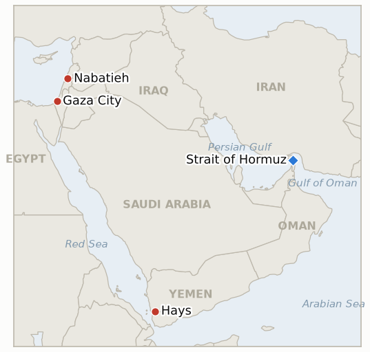

# Middle East Daily Briefing

**September 8, 2026**

- **Reporting window:** ~24 hours, September 7, 09:00 to September 8, 09:00 KST
- **Overall assessment:** Yemen's renewed war took its sharpest turn yet: the confirmed toll jumped from 117 dead on Sunday to more than 300 by Monday, the deadliest stretch since the 2022 truce collapsed, even as government forces held Hays, captured a further Houthi base in Jawf province and repelled a Houthi assault on the port of Mocha, gains analysts still stop short of calling decisive given the scale of the losses on both sides. Israel's south Lebanon campaign widened again in a way that raises its own stakes: a drone strike killed two medics traveling in a car near Kfar Rumman, a separate airstrike hit a residential building in the same town, and Nabatieh's Ghandour Hospital was destroyed, the first hospital destroyed in this campaign, pushing the 36-hour regional toll as high as 18 to 30 depending on the count. Iran, for its part, tested its own rhetoric only rhetorically: state media claimed the IRGC struck an unmanned US military vessel entering the Strait of Hormuz's "protected area," a claim no US or Western source has confirmed, leaving Ghalibaf's threatened "faster, heavier, more painful" response still unmatched by any verified action. For South Korea, President Lee arrived in Paris ahead of Tuesday's summit with President Macron, where Hormuz cooperation is explicitly on the agenda, even as the presidential office pushed back directly on reports that a National Assembly deployment-consent motion is imminent, and KOSPI, entirely disconnected from the war, surged 4.61% to a record-adjacent 6995.39 on a global AI and chip rally. And in the Israeli-Palestinian arena, US envoy Kushner's Sunday remark calling Netanyahu's government "a little irrational" on Gaza drew a Haaretz opinion rebuttal but no formal response from either government, while a West Bank raid on Hajja village killed a 19-year-old Palestinian after troops and settlers reportedly converged and both opened fire.

**Corrections and updates:** The September 7 brief (§1.4) misidentified Jo Yong-sool, who warned that ambiguity over Korea's Hormuz deployment was "shaking diplomatic credibility," as a government or presidential spokesman. He is in fact a spokesperson for the opposition People Power Party, and his remark was opposition criticism of the Lee government's handling of the deployment question, not a government statement. `instructions/glossary-ko.md`'s pinned entry for Jo Yong-sool has been corrected accordingly.

---

## 1. What Happened

<figure style="float:right; width:46%; margin:2pt 0 8pt 14pt;">

<figcaption style="font-size:8pt; color:#666; text-align:center; margin-top:3pt; font-style:italic;">Major places of discussion</figcaption>
</figure>

### 1.1 Yemen's War Toll Passes 300 as Government Forces Hold Hays and Extend Gains

Yemeni government forces held Hays district and pushed the offensive further on multiple fronts Monday: they captured a Houthi military base in Al-Jawf province, a separate northern front from the Hodeidah-Taiz-Ibb axis, and repelled a Houthi assault on the Red Sea port of Mocha, while the government air force flew a fresh round of strikes supporting the Mocha-area counteroffensive ([Israel Hayom](https://www.israelhayom.com/2026/09/07/yemen-government-forces-capture-houthi-base-jawf/); [Al Jazeera](https://www.aljazeera.com/news/2026/9/7/yemen-govt-forces-launch-air-strikes-on-houthi-targets)). But the offensive's cost rose sharply overnight: an AFP tally put the combined toll past 300 dead, up from 117 on Sunday, with 84 government troops and 57 Houthi fighters killed in roughly 24 hours alone and a missile strike on a bus killing six civilians and wounding seven, the deadliest stretch of fighting since the 2022 truce collapsed ([Arab News](https://www.arabnews.com/middle-east/toll-from-yemen-clashes-passes-300-as-civilians-flee-homes-3000718); [Business Recorder](https://www.brecorder.com/news/40438242/toll-from-yemen-clashes-passes-300-as-civilians-flee-homes); [Al-Monitor](https://www.al-monitor.com/originals/2026/09/toll-yemen-clashes-passes-300-civilians-flee-homes)). Hundreds more families fled their homes, adding to a UN-tracked displacement already above 1,790 families since fighting resumed September 3. **IND-20260907-2**, which tests whether Hays and the surrounding gains hold and extend over two weeks, is trending toward confirmed, though the toll's scale complicates any reading of this as a low-cost, clearly decisive shift. **Confidence: High** on the toll and the Jawf capture (Tier 1-2, AFP wire carried by multiple outlets); Medium on the precise Mocha defense and Hayfan-adjacent claims, which lean on government and government-aligned sourcing.

### 1.2 Israel's South Lebanon Campaign Widens Further: Medics Killed, Hospital Destroyed

Israeli strikes near Kfar Rumman on Sunday night into Monday killed at least nine to twelve people across two incidents: a drone strike hit a car carrying two medics, killing both, and a separate airstrike hit a residential building, with no evacuation warning issued beforehand; the Israeli military said the strikes targeted a militant "transporting weapons" in response to Hezbollah drone attacks on Israeli troops in the area ([Washington Post](https://www.washingtonpost.com/world/2026/09/07/lebanon-israel-airstrikes-kfar-rumman/721e03e8-aa95-11f1-b498-8697f35a6743_story.html); [Al Jazeera](https://www.aljazeera.com/news/2026/9/7/israeli-air-attack-kills-at-least-10-people-in-southern-lebanon); [Al-Monitor](https://www.al-monitor.com/originals/2026/09/israeli-strikes-southern-lebanese-town-kill-12-fears-escalation-mount)). The same widened campaign destroyed Nabatieh's Ghandour Hospital, the first hospital destroyed in this campaign, and damaged a Finance Ministry building, pushing the combined Nabatieh-region toll over 36 hours as high as 18 to 30 dead by different counts ([L'Orient Today](https://today.lorientlejour.com/article/1546678/israeli-strikes-kill-2-women-in-arab-salim-destroy-ghandour-hospital-in-nabatieh.html); [Naharnet](https://naharnet.com/stories/en/322304-israel-targets-car-in-nabatieh-wages-fresh-airstrikes-on-nabatieh-al-fawqa)). UN spokesperson Stephane Dujarric's earlier statement that "extensive Israeli military presence north of the Blue Line...constitutes a violation of Security Council resolution 1701 and of Lebanon's sovereignty" ([UN News](https://news.un.org/en/story/2026/09/1168275)) predates this window's casualty spike and does not name it, so **IND-20260905-3** (a UNIFIL, LAF or US-mediated statement addressing the widened exchange) stays open; the narrower question of whether targeting medics and a hospital specifically draws humanitarian-law scrutiny is now tracked by new **IND-20260908-1**. **Confidence: High** on the strike locations, toll range and hospital's destruction (Tier 1-3, multi-outlet including Washington Post, Al Jazeera, L'Orient Today, Naharnet); Medium on the precise justification chain, which rests on a disputed Hezbollah drone claim.

### 1.3 IRGC Claims Strike on Unmanned US Vessel in Hormuz, Unconfirmed by Washington

Iranian state media reported Saturday that the IRGC targeted an unmanned US military vessel attempting to enter what Iran calls the "protected area" of the Strait of Hormuz, and Iran's IRGC Khatam al-Anbiya joint command separately warned that further US naval action would face attacks "more severe than before...with a possibility of its expansion" ([Tasnim](https://www.tasnimnews.ir/en/news/2026/09/06/3689747/irgc-strikes-us-warships-tankers-in-response-to-attacks-on-iranian-vessels); [GlobalSecurity/RFE-RL](https://www.globalsecurity.org/wmd/library/news/iran/2026/09/iran-260906-rferl04.htm)). No CENTCOM, Pentagon or other US statement confirming or denying the claim was found in the window, a materially lower-confidence, lower-stakes data point than the confirmed Sept 5 IRGC missile attack on two crewed US Navy vessels; **IND-20260906-1** stays open, and the confirmation question itself is now tracked separately by new **IND-20260908-2**. Separately, CENTCOM said it has redirected 92 commercial vessels and disabled three and boarded two more "to ensure strict compliance" with its maritime blockade against Iran ([CBS News](https://www.cbsnews.com/live-updates/iran-war-us-trump-diesel-gas-prices-labor-day/)), while Ghalibaf's expanded remarks warned "if the enemy wants us not to export oil from the Persian Gulf, no one will be able to export oil" ([Middle East Eye](https://www.middleeasteye.net/live-blog/live-blog-update/irans-response-us-attacks-will-be-more-painful-ghalibaf-says); [Tehran Times](https://www.tehrantimes.com/news/529766/Qalibaf-warns-of-faster-heavier-Iranian-response-to-any-new)). Brent continued climbing to 97.05, its highest since late July. **Confidence: Low** on the unmanned-vessel strike itself (Tier 3, Iranian state media only, no independent corroboration); **High** on the CENTCOM blockade-enforcement statement and Ghalibaf's quotes (Tier 1-2).

### 1.4 Korea's Presidential Office Denies Imminent Hormuz Motion as Lee Reaches Paris, KOSPI Sets Record Pace

President Lee co-chaired the Lumiere film summit with President Macron near Saint-Paul-de-Vence Monday before arriving in Paris that evening ahead of Tuesday's state visit proper, wreath-laying at the Arc de Triomphe, an official welcome, and an expanded summit and Elysee banquet with Macron; Korean outlets frame "military contribution methods" on Hormuz as explicitly on the agenda alongside AI and nuclear cooperation, though the summit itself falls after this window's close ([Korea Herald](https://www.koreaherald.com/article/10864263); [Kukmin Ilbo](https://www.kmib.co.kr/article/view.asp?arcid=9000009494)). At home, MBC reported the government is still finalizing consent-motion wording and expects to submit it to the National Assembly "within this month," but the presidential office explicitly disputed that characterization, calling it "not accurate" and saying the process is "not yet at the stage of sending a consent motion" ([MBC](https://imnews.imbc.com/replay/2026/nw1200/article/6849616_36967.html)); both ruling and opposition parties are described as taking a cautious line, with the ruling camp's own internal opposition flagged as a possible coalition "detonator" ([Aju News](https://www.ajunews.com/view/20260907112149450)). Entirely apart from the war, KOSPI jumped 308.18 points (+4.61%) to 6995.39, just short of 7,000, on a global AI and semiconductor rally (SK hynix +8.26%, Samsung Electronics +5.68%), with the won firming to 1340.5 ([Money Today](https://www.mt.co.kr/stock/2026/09/07/2026090715333651094); [Businesskorea](https://www.businesskorea.co.kr/news/articleView.html?idxno=276351)). **Confidence: High** on Lee's schedule, the presidential office's denial, and the market close (Tier 1-2, Korean wire and financial press); Medium on whether Hormuz will be substantively addressed in Tuesday's actual summit outcome, which remains unconfirmed as of this window.

### 1.5 Kushner's Gaza Remark Draws No Response as West Bank Raid Kills Palestinian Teenager

Neither Netanyahu's office nor the US State Department issued a public response to Kushner's Sunday remark calling Israel's government "a little irrational" on Gaza; Haaretz published an opinion piece disputing the framing outright ("he's wrong"), the most notable pushback found, though it is commentary rather than a policy consequence ([Haaretz](https://www.haaretz.com/israel-news/haaretz-today/2026-09-07/ty-article/.highlight/kushner-says-israels-crazy-election-makes-it-irrational-on-gaza-hes-wrong/000001a0-7bb6-d7d5-a9fc-7fff241c0000); [Times of Israel](https://www.timesofisrael.com/kushner-israel-acting-a-little-irrational-on-gaza-due-to-upcoming-election)). Separately in the West Bank, a 19-year-old Palestinian was shot dead and three others wounded during a raid on Hajja village Monday, with residents saying Israeli troops and settlers converged from opposite sides and both opened fire, while a Palestinian stabbed a settler near the Maoz Yehuda outpost before fleeing and was later arrested ([Al-Monitor](https://www.al-monitor.com/originals/2026/09/two-palestinians-killed-israeli-stabbed-west-bank-settler-violence-flares); [Palestine Info Center](https://english.palinfo.com/news/2026/09/07/369691/)). No named destination country has confirmed talks on Ben Gvir's "Disengagement 710" Gaza emigration plan and no formal Israeli government action on it was found either, leaving **IND-20260904-2** open; the Hajja killing, which implicates troops alongside settlers rather than settlers alone, is now tracked by new **IND-20260908-3**, distinct from this ledger's settler-only enforcement precedents. **Confidence: High** on Kushner's remark and the absence of a formal response (Tier 1-2, Times of Israel, CBS, Haaretz); Medium on the Hajja raid's precise sequence, which relies partly on resident accounts and a Palestinian-affiliated outlet alongside Al-Monitor.

---

## 2. Deep Dive: Incentives and Motives

### 2.1 Why did Yemen's toll nearly triple overnight even as the government's offensive continued to advance, and what does that reveal about the war's actual trajectory?

Because pressing three or more fronts simultaneously, Hays, al-Jarrahi, Jawf, and Mocha, forces the Houthis to defend multiple axes at once with a finite force, and a rising toll is the direct cost of that strategy rather than evidence it is failing; but 84 government and 57 Houthi dead in roughly a day, a toll split nearly evenly between both sides, indicates neither side is collapsing, which is consistent with the same pattern of costly, indecisive gains that led Al Jazeera's own analysts to caution earlier gains "do not yet amount to a decisive shift," now simply playing out at a much higher casualty rate.

### 2.2 Why would Israel's south Lebanon campaign escalate to killing medics and destroying a hospital despite the reputational and legal exposure that carries, and what does the absence of any institutional response so far suggest?

Because the operational logic this campaign has followed since early September, that any Hezbollah drone launch justifies a proportionally large retaliatory strike regardless of what it hits, has continued to widen in practice without any UNIFIL, Lebanese, or US-mediated statement specifically constraining it; the closest thing to an institutional check, the UN's Sept 2 statement on Israel's presence north of the Blue Line, predates and does not name this week's medic killings or hospital's destruction, suggesting the enforcement mechanism meant to catch exactly this kind of widening is currently a step behind the campaign's own pace rather than shaping it.

### 2.3 Why is Iran amplifying an unconfirmed claim about an unmanned vessel rather than executing a larger, verifiable strike matching Ghalibaf's rhetoric?

Because a claimed strike on an unmanned vessel is a low-cost, low-risk way to signal continued resolve and keep Ghalibaf's threat rhetorically alive without inviting the kind of overwhelming CENTCOM response a strike on a crewed US vessel would draw, particularly right after CENTCOM's own destruction of three Iranian tankers; the gap between the parliamentary speaker's declared end of "proportionate responses" and the operational reality, an unconfirmed claim against an uncrewed asset, suggests Tehran's actual room to escalate remains narrower than its public rhetoric implies.

### 2.4 Why would Korea's presidential office push back publicly on reports of an imminent deployment motion just as the Lee-Macron summit approaches?

Because submitting a National Assembly consent motion before the summit would lock in Seoul's negotiating position unilaterally, while waiting allows Lee to return from Paris with whatever multinational framework Macron's government offers, reducing the domestic political cost of a deployment decision by presenting it as joining an established coalition rather than acting alone under direct US pressure, a sequencing advantage that a premature motion filed at home would forfeit.

### 2.5 Why did Kushner's remark draw a media rebuttal but no formal response from either government, and what does that reveal about actual US leverage over Netanyahu's Gaza approach?

Because both Washington and Jerusalem have an interest in treating the remark as an aside rather than a rupture: the US administration does not want to be seen publicly rebuking its closest regional ally weeks before an Israeli election, and Netanyahu's government has more to lose by amplifying a comment that already undercuts its own narrative than by simply not responding, leaving Haaretz's opinion desk as the only venue where the substance of the disagreement, whether election politics genuinely explains the roadmap's stall, gets argued out at all.

---

## 3. Policy Implications for South Korea

**Exposure snapshot:** South Korea's crude imports remain roughly 70% dependent on Strait of Hormuz transit and about 36% of its LNG imports come from the Middle East, with Qatar's Ras Laffan as the single largest LNG supplier exposure (see `instructions/korea-exposure.md`, last updated August 14, 2026, for the full mitigation picture: non-Hormuz crude and naphtha reserves, the strategic reserve swap program, and Red Sea/Yanbu workaround routing). No material update to these baselines surfaced in the window, though Korea Times separately cited MOFA's standing figure of 61% of crude and 54% of naphtha imports transiting Hormuz last year.

**Implications by development:**

- **Yemen's rising toll and extending gains (§1.1):** The Hodeidah-Taiz-Mocha fighting sits astride the same Bab el-Mandeb corridor Korea's Red Sea/Yanbu crude workaround transits; the fighting remains a land war away from the coast itself, but a nearly tripled toll and a widening number of active fronts (now including Al-Jawf and Mocha) raises the structural risk to that corridor even without a confirmed disruption yet.
- **Israel's widened Lebanon strikes (§1.2):** No direct Korean shipping or personnel exposure, but strikes now killing medics and destroying a hospital, absent any institutional check, reinforce the broader regional escalation risk MOFA's standing Level 3 advisories already price in.
- **Iran's unconfirmed Hormuz vessel claim (§1.3):** Even unconfirmed, the claim and Ghalibaf's continued rhetoric sustain the risk premium behind Brent's climb to 97.05; CENTCOM's blockade-enforcement statistics (92 vessels redirected, 3 disabled, 2 boarded) are the clearest sign the blockade itself, not just individual strikes, now shapes Hormuz transit conditions Korean-flagged and Korean-chartered shipping must navigate.
- **Korea's own Hormuz deployment sequencing (§1.4):** The presidential office's denial of an imminent motion, paired with the approaching Lee-Macron summit, is the most direct Korea-specific policy line in the ledger; a French-anchored multinational framework emerging from Tuesday's summit would materially change the domestic political cost of any eventual deployment vote.
- **Kushner's Gaza remark and West Bank violence (§1.5):** No direct Korea channel, though continued Gaza roadmap stagnation and unchecked West Bank violence sustain the broader war's duration, the primary driver of Korea's structural Hormuz and Red Sea exposure discussed above.

**Testable indicators:**

- **IND-20260908-1** (new): Israel's Sept 7 strikes killing two medics near Kfar Rumman and destroying Nabatieh's Ghandour Hospital either draw a distinct ICRC, WHO, UN human rights, or Israeli investigatory response, or are absorbed into the ongoing widened-exchange pattern without a targeted reaction. Deadline ~2026-09-22.
- **IND-20260908-2** (new): Iranian state media's claim of a Sept 6 IRGC strike on an unmanned US vessel in the Strait of Hormuz either draws a US confirmation or denial, or remains an unverified Iranian-sourced claim with no Western corroboration. Deadline ~2026-09-15.
- **IND-20260908-3** (new): The fatal Sept 7 Hajja raid, implicating both troops and settlers, either draws a named arrest, indictment, or formal IDF investigation paralleling this ledger's settler-only enforcement precedents, or joins the broader pattern of unprosecuted West Bank violence. Deadline ~2026-09-21.
- **IND-20260907-1** (open): Whether Ghalibaf's declared end to "proportionate responses" converts into a qualitatively larger, confirmed Iranian strike; only an unconfirmed unmanned-vessel claim surfaced this window. Deadline ~2026-09-20.
- **IND-20260907-2** (open): Whether Yemen's government gains hold and extend; they did, with new gains in Jawf and at Mocha, though the toll's scale complicates a clean read. Deadline ~2026-09-20.
- **IND-20260907-3** (open): Whether the Lee-Macron summit produces a concrete Hormuz deliverable; the summit itself falls after this window's close, so still untested. Deadline ~2026-09-10.
- **IND-20260907-4** (open): Whether Kushner's remark produces a visible US policy consequence; none found this window, only a Haaretz opinion rebuttal. Deadline ~2026-09-20.
- **IND-20260906-1** (open): Whether the IRGC repeats a confirmed direct attack on a US Navy vessel; only an unconfirmed Iranian claim of a strike on an unmanned vessel surfaced. Deadline ~2026-09-19.
- **IND-20260906-2** (open): Whether Korea's Hormuz deployment reaches a formal National Assembly motion; the presidential office explicitly denied one is imminent this window. Deadline ~2026-09-28.
- **IND-20260905-3** (open): Whether Lebanon's widened exchange draws a UNIFIL, LAF or US-mediated statement; none named this window's casualty spike specifically. Deadline ~2026-09-19.
- **IND-20260904-2** (open): Whether Ben Gvir's Gaza emigration plan draws a named host country or formal government action; neither surfaced this window. Deadline ~2026-09-18.

---

## 4. Watch List

- **Mecca Joint Defence Agreement (IND-20260809-2):** resolved **Falsified** today at its own deadline; no concrete implementing step materialized in the month since signing.
- **Masafer Yatta and Jannatah settler-violence enforcement (IND-20260825-2, IND-20260826-2):** both resolved today at deadline, Masafer Yatta's pattern **Confirmed** (a second separate settler arrest, the Sept 5 Qusra case, met the bar), Jannatah **Falsified** (no arrest ever materialized despite strong video evidence).
- **Pickaxe Mountain (IND-20260905-1):** still not struck as of this window; deadline ~09-18.
- **Ben Gvir's Disengagement 710 plan (IND-20260904-2):** still no confirmed host country interest or formal government action, now also overlapping with the unrelated Kushner friction.
- **Janggeum Shipping's Hormuz exposure (IND-20260903-3):** deadline ~09-17; no verified change in the Korean-linked charterer's Hormuz activity or a Korean government advisory specific to the company this window.
- **Qatari LNG loadings at Ras Laffan (IND-20260714-4):** still no fresh weekly loading figure; the export freeze remains the ledger's longest-running unresolved indicator.

---

## 5. Source Quality Summary

| Claim | Sources | Confidence |
|---|---|---|
| Yemen's government forces capture a Houthi base in Jawf and repel a Mocha assault; fresh government air strikes | Israel Hayom, Al Jazeera (Tier 2-3) | High on the actions; Medium on Israeli-outlet framing of a Yemen story |
| Yemen's renewed war toll passes 300 dead, up from 117 | Arab News, Business Recorder, Al-Monitor (Tier 1-2, AFP wire) | High |
| Israeli strikes near Kfar Rumman kill 9-12, targeting a car carrying two medics and a residential building | Washington Post, Al Jazeera, Al-Monitor (Tier 1-2) | High |
| Nabatieh's Ghandour Hospital destroyed; combined regional toll 18-30 over 36 hours | L'Orient Today, Naharnet (Tier 2) | High |
| UN spokesperson Dujarric statement on Israeli presence north of the Blue Line | UN News (Tier 1) | High on the statement; Medium on its relevance to this window's specific toll |
| IRGC claims strike on unmanned US vessel in Hormuz "protected area" | Tasnim, GlobalSecurity/RFE-RL (Tier 3, Iranian state media only) | Low |
| CENTCOM blockade enforcement: 92 vessels redirected, 3 disabled, 2 boarded | CBS News (Tier 1-2) | High |
| Ghalibaf's expanded threats ("only the first step"; oil export warning) | Middle East Eye, Tehran Times (Tier 2-3) | High on the quotes; Medium on their operational significance |
| Brent rises to 97.05, WTI above 92 amid Labor Day closure | TradingEconomics, FXDailyReport (Tier 2) | Medium (intraday reads, not official settles) |
| Lee co-chairs Lumiere summit, arrives Paris ahead of Macron summit | Korea Herald, Kukmin Ilbo (Tier 1-2) | High |
| Presidential office denies imminent National Assembly consent motion | MBC, Aju News (Tier 1-2, Korean wire) | High |
| Jo Yong-sool identified as PPP (opposition) spokesperson, not government | Asiae, Herald Biz, Segye (Tier 2, Korean press) | High |
| KOSPI +4.61% to 6995.39; won firms to 1340.5 | Money Today, Businesskorea (Tier 2) | High |
| Kushner's remark draws no formal government response; Haaretz opinion rebuttal | Times of Israel, CBS, Haaretz (Tier 1-2) | High on the remark and absence of response; Medium on how to weigh silence as a policy signal |
| Fatal Hajja raid kills Palestinian teenager; Maoz Yehuda stabbing | Al-Monitor, Palestine Info Center (Tier 2-3) | Medium |
